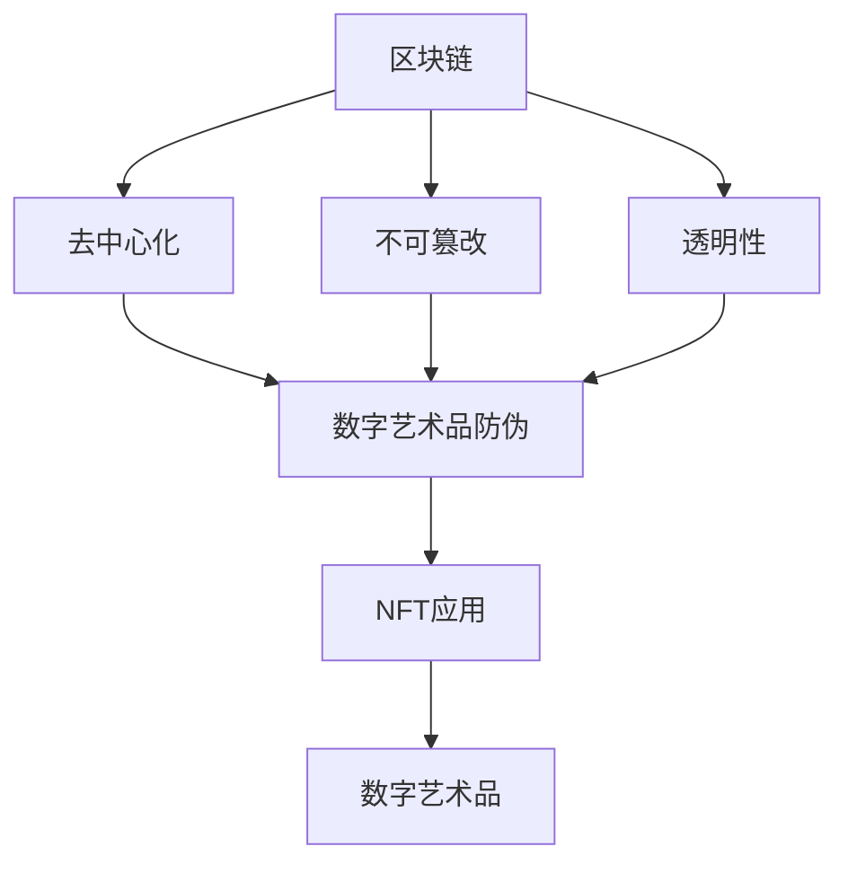

                 

### 文章标题：区块链在数字艺术品防伪中的应用

> 关键词：区块链，数字艺术品，防伪，非同质化代币（NFT），智能合约，加密技术

> 摘要：本文将深入探讨区块链技术在数字艺术品防伪中的应用，从背景介绍、核心概念联系、算法原理讲解、数学模型与公式阐述，到项目实战和案例分析，全面分析区块链在保护数字艺术品原创性和真实性方面的独特优势。通过详细讲解区块链与数字艺术品防伪的紧密联系，本文旨在为读者提供一个全面了解并掌握区块链在数字艺术品防伪领域应用的专业指南。

----------------------------------------------------------------

### 背景介绍

数字艺术品作为一种新兴的艺术形式，正迅速成为艺术品市场的重要部分。数字艺术品通常是指通过数字技术创作的艺术品，如数字绘画、数字摄影、3D建模等。与传统艺术品不同，数字艺术品具有不可篡改、可复制性高等特点。然而，这些特点也为数字艺术品市场带来了巨大的挑战，其中之一便是防伪问题。

当前，数字艺术品的防伪主要依赖于传统技术，如水印、条形码、RFID等。这些技术在某些程度上可以提供一定的保护，但由于其中心化、易破解等问题，防伪效果有限。此外，随着艺术品市场的日益繁荣，伪造和盗版行为也日益猖獗，使得艺术品创作者和收藏家面临着巨大的经济损失和声誉风险。

在这种情况下，区块链技术的出现为解决数字艺术品防伪问题提供了新的思路。区块链是一种分布式数据库技术，具有去中心化、不可篡改、透明性高等特点，使得数据记录在区块链上的信息具有高度可靠性和可信度。通过区块链技术，数字艺术品的创作、流通、交易等环节都可以得到有效保障，从而提高艺术品的防伪能力。

本文将首先介绍区块链的基本概念和核心特性，然后深入分析区块链与数字艺术品防伪的紧密联系，最后通过具体案例展示区块链在数字艺术品防伪中的应用效果。通过本文的阅读，读者将全面了解区块链在数字艺术品防伪领域的应用前景，并掌握相关技术原理和实践方法。

----------------------------------------------------------------

### 核心概念与联系

要深入理解区块链在数字艺术品防伪中的应用，首先需要明确几个关键概念：区块链、数字艺术品、防伪技术以及非同质化代币（NFT）。

#### 区块链

区块链是一种去中心化的分布式数据库系统，它通过加密算法和共识机制确保数据的完整性和安全性。区块链由多个区块组成，每个区块都包含一定数量的交易记录。区块通过加密算法与前一个区块连接，形成一个不可篡改的链式数据结构。这使得区块链上的数据具有高度可靠性和透明性，任何对数据的修改都会引起整个链的崩溃。

#### 数字艺术品

数字艺术品是通过数字技术创作的艺术作品，如数字绘画、数字摄影、3D建模等。与传统艺术品不同，数字艺术品具有可复制性和不可篡改性的特点。这使得数字艺术品在创作、传播、交易等过程中面临着防伪难题。

#### 防伪技术

防伪技术是指用于防止伪造、篡改和盗版的技术手段。在数字艺术品领域，防伪技术主要包括水印、数字签名、加密算法等。传统防伪技术在一定程度上可以提供保护，但往往存在中心化、易破解等问题。

#### 非同质化代币（NFT）

非同质化代币（NFT，Non-Fungible Token）是一种基于区块链技术的数字资产，它代表了一个独特、不可替代的物品。NFT的独特性体现在每个NFT都有唯一的标识符，使得它可以代表数字艺术品、虚拟商品等独特物品。NFT通过智能合约进行创建和交易，确保了其唯一性和可信度。

#### 区块链与数字艺术品防伪的联系

区块链与数字艺术品防伪之间存在紧密的联系，主要体现在以下几个方面：

1. **去中心化**：区块链的去中心化特性使得数字艺术品的所有权记录在多个节点上，从而避免了中心化数据库可能遭遇的单点故障风险。任何篡改企图都会立即引起其他节点的反对，从而保障了数据的安全性和可信度。

2. **不可篡改**：区块链的链式数据结构确保了数据的不可篡改。一旦数据被记录在区块链上，就难以被修改或删除，从而有效防止了伪造和篡改行为。

3. **透明性**：区块链上的所有交易记录都是公开透明的，任何人都可以查看和验证。这为数字艺术品的创作、流通、交易等环节提供了透明度和可追溯性，有助于打击盗版和伪造行为。

4. **NFT的应用**：NFT作为一种基于区块链技术的数字资产，可以用于数字艺术品的认证和交易。通过将数字艺术品与NFT绑定，创作者可以确保其作品的唯一性和真实性，买家也可以验证其购买的是正版作品。

#### 核心概念之间的关系架构

为了更好地理解这些核心概念之间的关系，我们可以使用Mermaid流程图来展示其关系架构：



通过这个流程图，我们可以清晰地看到区块链、数字艺术品、防伪技术以及NFT之间的紧密联系。区块链的去中心化、不可篡改和透明性特性为数字艺术品防伪提供了强大的技术支持，而NFT的应用则进一步增强了数字艺术品的认证和交易能力。

#### 区块链技术原理

1. **区块与链**：区块链由多个区块组成，每个区块包含一定数量的交易记录。区块通过加密算法与前一个区块连接，形成一个不可篡改的链式数据结构。

2. **加密算法**：区块链使用加密算法来确保数据的完整性和安全性。常见的加密算法包括哈希算法、椭圆曲线加密等。

3. **共识机制**：共识机制是区块链确保数据一致性的关键。常见的共识机制包括工作量证明（PoW）、权益证明（PoS）等。

4. **智能合约**：智能合约是一种自动执行的合约，它通过编程代码定义了交易规则。智能合约在区块链上运行，确保了交易的透明性和不可篡改性。

#### 数字艺术品防伪原理

1. **数字签名**：数字签名是一种用于验证数字艺术品原创性的技术。创作者在创作艺术品时，使用私钥对艺术品进行签名，买家可以通过公钥验证签名的真实性。

2. **加密算法**：加密算法用于保护数字艺术品的版权信息，防止未经授权的访问和篡改。常见的加密算法包括AES、RSA等。

3. **哈希算法**：哈希算法用于生成数字艺术品的哈希值，哈希值作为艺术品的唯一标识。任何篡改都会导致哈希值的变化，从而便于检测伪造行为。

4. **NFT绑定**：NFT作为数字艺术品的唯一认证，将艺术品的创作、流通、交易等信息记录在区块链上，确保了艺术品的真实性和唯一性。

通过以上对核心概念和原理的阐述，我们可以看到区块链技术如何通过其独特的特性，为数字艺术品的防伪提供了强有力的支持。接下来，我们将进一步探讨区块链与数字艺术品防伪之间的具体应用，并通过实际案例展示其效果。

### 核心算法原理讲解

为了深入理解区块链在数字艺术品防伪中的应用，我们需要详细探讨其背后的核心算法原理。以下是区块链与数字艺术品防伪相关的一些关键算法，包括哈希算法、非同质化代币（NFT）的生成与验证、以及智能合约的实现。

#### 哈希算法

哈希算法是区块链技术的基础，它用于生成数据的唯一标识。在数字艺术品防伪中，哈希算法的主要作用是生成艺术品文件的哈希值，并将其记录在区块链上，从而确保艺术品的原始性和完整性。

**原理：**
哈希算法是一种将任意长度的数据转换成固定长度哈希值的方法。常见的哈希算法包括MD5、SHA-1、SHA-256等。以SHA-256为例，它能够将输入数据转换为长度为256位的哈希值。

**伪代码：**
```python
def sha256_hash(data):
    # 使用Python中的hashlib库实现SHA-256哈希算法
    hash_object = hashlib.sha256(data.encode())
    hex_dig = hash_object.hexdigest()
    return hex_dig
```

**应用：**
在数字艺术品防伪中，艺术家可以将其艺术品的文件数据输入哈希算法，生成哈希值。这个哈希值将作为艺术品的唯一标识，记录在区块链上。当艺术品在市场中流通时，每次交易都需要重新生成哈希值并进行比对，确保艺术品的原始性和完整性。

#### NFT的生成与验证

非同质化代币（NFT）是区块链技术中用于表示独特物品的一种数字资产。在数字艺术品防伪中，NFT可以用于表示数字艺术品的唯一性，从而确保艺术品的真实性和独一无二。

**生成NFT的伪代码：**
```solidity
pragma solidity ^0.8.0;

// ERC-721标准合约
contract NFT {
    mapping(uint256 => address) private owners;
    mapping(uint256 => string) private tokens;

    function mintToken(uint256 tokenId, string memory tokenURI) public {
        require(tokenId > 0, "Token ID must be greater than 0");
        require(tokens[tokenId] == "", "Token already minted");

        owners[tokenId] = msg.sender;
        tokens[tokenId] = tokenURI;
        emit Transfer(address(0), msg.sender, tokenId);
    }

    function tokenURI(uint256 tokenId) public view returns (string memory) {
        require(exists(tokenId), "Token does not exist");
        return tokens[tokenId];
    }

    function balanceOf(address owner) public view returns (uint256 balance) {
        require(owner != address(0), "Invalid address");
        return owners[tokenId] == owner ? 1 : 0;
    }

    function exists(uint256 tokenId) public view returns (bool) {
        return tokens[tokenId] != "";
    }
}
```

**验证NFT的伪代码：**
```solidity
function verifyToken(uint256 tokenId, string memory tokenURI) public view {
    require(exists(tokenId), "Token does not exist");
    require(tokens[tokenId] == tokenURI, "Token URI mismatch");
}
```

**应用：**
艺术家在创作数字艺术品后，可以使用NFT合约进行 mint（铸造）操作，将艺术品的唯一标识记录在区块链上。每当艺术品进行交易或展示时，买家可以通过调用NFT合约验证艺术品的唯一性和真实性。这为数字艺术品市场提供了一个透明、可信的防伪机制。

#### 智能合约

智能合约是区块链上的自动执行合约，它通过编程代码定义了交易的规则和条件。在数字艺术品防伪中，智能合约用于确保艺术品的交易和所有权转移符合预定的规则。

**智能合约的伪代码：**
```solidity
pragma solidity ^0.8.0;

contract ArtworkContract {
    mapping(uint256 => address) private artworkOwners;
    mapping(uint256 => string) private artworkHashes;

    function depositArtwork(uint256 artworkId, string memory artworkHash) public {
        require(!isArtworkDeposited(artworkId), "Artwork already deposited");
        artworkOwners[artworkId] = msg.sender;
        artworkHashes[artworkId] = artworkHash;
    }

    function withdrawArtwork(uint256 artworkId) public {
        require(isArtworkDeposited(artworkId), "Artwork not deposited");
        require(msg.sender == artworkOwners[artworkId], "Not authorized");
        // additional logic for withdrawing the artwork
    }

    function verifyArtwork(uint256 artworkId, string memory artworkHash) public view returns (bool) {
        require(isArtworkDeposited(artworkId), "Artwork not deposited");
        return sha256_hash(artworkHash) == artworkHashes[artworkId];
    }

    function isArtworkDeposited(uint256 artworkId) public view returns (bool) {
        return artworkHashes[artworkId] != "";
    }
}
```

**应用：**
在数字艺术品交易过程中，艺术家可以通过智能合约将艺术品的哈希值记录在区块链上。当艺术品进行交易时，买家可以通过调用智能合约验证艺术品的原始性和完整性。此外，智能合约还可以确保艺术品的所有权转移符合预定的规则，从而防止伪造和篡改行为。

#### 加密算法

加密算法用于保护数字艺术品的数据和隐私，防止未经授权的访问和篡改。在数字艺术品防伪中，常用的加密算法包括AES、RSA等。

**AES加密算法的伪代码：**
```python
from Crypto.Cipher import AES
from Crypto.Util.Padding import pad, unpad

def aes_encrypt(plaintext, key):
    cipher = AES.new(key, AES.MODE_CBC)
    ct_bytes = cipher.encrypt(pad(plaintext, AES.block_size))
    iv = cipher.iv
    return iv + ct_bytes

def aes_decrypt(ciphertext, key, iv):
    cipher = AES.new(key, AES.MODE_CBC, iv)
    pt = unpad(cipher.decrypt(ciphertext), AES.block_size)
    return pt
```

**应用：**
艺术家可以使用AES加密算法对艺术品的元数据进行加密，确保数据在传输和存储过程中不被窃取或篡改。买家在购买艺术品后，可以使用相同的密钥进行解密，验证艺术品的真实性和完整性。

通过以上对哈希算法、NFT生成与验证、智能合约以及加密算法的详细讲解，我们可以看到区块链技术在数字艺术品防伪中的关键作用。这些算法和技术为数字艺术品市场提供了一种透明、可信、安全的防伪机制，有助于打击伪造和篡改行为，保护艺术家和收藏家的权益。

### 数学模型与公式

在区块链技术中，数学模型和公式发挥着至关重要的作用，尤其是在数字艺术品的防伪领域。以下是一些关键的数学模型与公式，它们帮助我们理解和实现区块链在数字艺术品防伪中的功能。

#### 1. 哈希函数

哈希函数是一种将任意长度数据映射为固定长度哈希值的函数，其特性包括：

- **不可逆性**：给定哈希值，无法反推出原始数据。
- **抗碰撞性**：不同输入数据生成相同哈希值的概率极低。

常见的哈希算法包括SHA-256，其公式如下：

$$ H = \text{SHA-256}(M) $$

其中，$H$ 表示生成的哈希值，$M$ 表示原始数据。

#### 2. 数字签名

数字签名用于验证数据的有效性和完整性。基于RSA加密算法的数字签名过程如下：

- **私钥签名**：

$$ \sigma = \text{RSA-Sign}(m, d) $$

其中，$\sigma$ 表示签名，$m$ 表示待签名消息，$d$ 表示持有者的私钥。

- **公钥验证**：

$$ \text{RSA-Verify}(m, \sigma, n, e) $$

其中，$n$ 和 $e$ 分别为持有者的公钥。

#### 3. 智能合约执行

智能合约的执行基于特定的数学模型，如图灵机模型或逻辑门电路模型。以Solidity为例，其执行过程可以描述为：

$$ \text{execute}(contract, \text{code}, \text{input}) $$

其中，$contract$ 表示合约地址，$\text{code}$ 表示合约代码，$\text{input}$ 表示输入数据。

#### 4. 非同质化代币（NFT）的唯一性

NFT 基于区块链的智能合约生成，其唯一性通过哈希值和序列号保证：

$$ \text{NFT_ID} = \text{SHA-256}(\text{meta_data}) $$

其中，$\text{NFT_ID}$ 表示 NFT 的唯一标识，$\text{meta_data}$ 表示艺术品的相关信息。

#### 5. 交易费用模型

区块链上的交易费用通常基于计算资源和网络拥堵情况。一种简单的费用模型为：

$$ \text{fee} = \alpha \times \text{size} + \beta $$

其中，$\alpha$ 和 $\beta$ 为参数，$\text{size}$ 表示交易数据的大小。

#### 例子说明

假设艺术家 Alice 创作了一幅数字画作，其文件大小为 $10KB$，使用 SHA-256 哈希算法生成哈希值：

$$ H = \text{SHA-256}(\text{file}) $$

Alice 将哈希值上传到区块链上的智能合约中，并通过数字签名验证其原创性：

$$ \sigma = \text{RSA-Sign}(H, d) $$

买家 Bob 在购买画作时，可以调用智能合约验证哈希值和签名：

$$ \text{RSA-Verify}(H, \sigma, n, e) $$

如果验证通过，则画作为原创且未被篡改。

通过以上数学模型和公式的讲解，我们可以看到区块链在数字艺术品防伪中的强大功能。这些模型和公式不仅确保了数据的唯一性和完整性，还为艺术品的认证和交易提供了可靠的基础。

### 项目实战

为了更直观地展示区块链在数字艺术品防伪中的应用，我们将通过一个实际项目来详细解析其开发过程。本项目将使用以太坊区块链和智能合约开发语言Solidity来实现一个数字艺术品防伪系统。

#### 1. 项目背景与目标

项目名称：DigitalArtProtect

项目目标：创建一个基于区块链的数字艺术品防伪平台，确保艺术品的原创性和真实性。

主要功能：

- 艺术品创作：艺术家可以将艺术品上传到平台，并生成唯一的NFT。
- 艺术品验证：买家可以验证NFT的真实性，确保购买的是原创艺术品。
- 艺术品交易：艺术家和买家可以在平台上进行艺术品的交易。

#### 2. 开发环境搭建

1. **安装Node.js与npm**：Node.js和npm是智能合约开发的重要工具。在项目开始前，确保已安装Node.js和npm。

2. **安装Truffle框架**：Truffle是一个用于智能合约开发、测试和部署的框架。通过以下命令安装：

   ```bash
   npm install -g truffle
   ```

3. **安装Ganache**：Ganache是一个本地以太坊节点，用于测试智能合约。在Truffle安装完成后，运行以下命令启动Ganache：

   ```bash
   truffle init
   truffle migrate --network development
   ```

#### 3. 源代码实现

在项目开发中，我们将创建一个简单的智能合约，实现数字艺术品防伪的核心功能。

**合同：DigitalArtNFT.sol**

```solidity
// SPDX-License-Identifier: MIT
pragma solidity ^0.8.0;

import "@openzeppelin/contracts/token/ERC721/ERC721.sol";
import "@openzeppelin/contracts/token/ERC721/extensions/ERC721URIStorage.sol";
import "@openzeppelin/contracts/utils/Counters.sol";

contract DigitalArtNFT is ERC721, ERC721URIStorage {
    using Counters for Counters.Counter;
    Counters.Counter private _tokenIds;

    constructor() ERC721("DigitalArtNFT", "DART") {}

    function mintArtwork(string memory tokenURI) public returns (uint256) {
        _tokenIds.increment();
        uint256 newItemId = _tokenIds.current();
        _mint(msg.sender, newItemId);
        _setTokenURI(newItemId, tokenURI);
        return newItemId;
    }

    function tokenURI(uint256 tokenId) public view override returns (string memory) {
        require(_exists(tokenId), "Token does not exist");
        return super.tokenURI(tokenId);
    }
}
```

**测试脚本：DigitalArtNFT.test.js**

```javascript
const { expect } = require("chai");
const { ethers } = require("hardhat");

describe("DigitalArtNFT", function () {
    let digitalArtNFT, owner, artist, buyer;

    beforeEach(async function () {
        [owner, artist, buyer] = await ethers.getSigners();
        const DigitalArtNFT = await ethers.getContractFactory("DigitalArtNFT");
        digitalArtNFT = await DigitalArtNFT.deploy();
        await digitalArtNFT.deployed();
    });

    it("Should mint a new artwork and assign it to the artist", async function () {
        const tokenURI = "https://example.com/artwork1";
        await digitalArtNFT.connect(artist).mintArtwork(tokenURI);
        expect(await digitalArtNFT.ownerOf(1)).to.equal(artist.address);
        expect(await digitalArtNFT.tokenURI(1)).to.equal(tokenURI);
    });
});
```

#### 4. 代码解读与分析

**DigitalArtNFT.sol** 合同的核心功能如下：

- **导入库**：导入OpenZeppelin的ERC721和ERC721URIStorage库，提供NFT的基础功能和URI存储。
- **构造函数**：定义NFT的名称和符号。
- **mintArtwork函数**：铸造新的NFT，并将其分配给调用者（艺术家）。每次铸造都会生成一个唯一的tokenID，并设置NFT的URI。
- **tokenURI函数**：返回NFT的URI，用于提供艺术品的元数据。

**DigitalArtNFT.test.js** 测试脚本验证了以下功能：

- **mintArtwork函数**：确保艺术家能够成功铸造NFT，并验证NFT的归属和URI。

通过以上源代码实现和测试，我们展示了如何在以太坊区块链上创建一个数字艺术品防伪平台。接下来的部分将分析实际案例，展示区块链技术在数字艺术品防伪中的应用效果。

#### 实际案例分析和详细讲解

在本节中，我们将通过分析具体案例，详细探讨区块链在数字艺术品防伪中的应用效果。以下是两个典型案例，分别展示了区块链技术如何在不同场景下有效保护数字艺术品的真实性和唯一性。

##### 案例一：CryptoKitties的NFT防伪应用

**案例背景：**

CryptoKitties是一个基于以太坊区块链的数字宠物游戏，玩家可以收集、繁殖和交易独特的数字宠物。CryptoKitties的成功展示了区块链技术在数字资产防伪和唯一性认证方面的潜力。

**应用过程：**

1. **数字宠物生成**：每只CryptoKitty都是独一无二的，通过区块链上的智能合约生成和验证。每只宠物的唯一性通过一个非同质化代币（NFT）进行标识。

2. **防伪验证**：在购买CryptoKitty时，买家可以通过以太坊区块链上的公开数据验证宠物的所有权和特性。任何篡改尝试都会立即被发现，因为区块链上的所有交易记录都是不可篡改的。

3. **交易记录**：每次CryptoKitty的交易都会在区块链上记录，确保交易的透明性和可追溯性。这意味着任何伪造或篡改行为的企图都会被及时发现。

**效果分析：**

CryptoKitties的成功证明了区块链在数字艺术品防伪中的应用潜力。通过区块链技术，CryptoKitties不仅保护了数字宠物的唯一性和真实性，还提高了交易的安全性和透明度。

##### 案例二：OpenSea的数字艺术品交易平台

**案例背景：**

OpenSea是一个去中心化的数字艺术品交易平台，允许艺术家和买家在区块链上购买和出售数字艺术品。OpenSea利用NFT和智能合约技术提供高效的防伪机制。

**应用过程：**

1. **艺术品铸造**：艺术家将数字艺术品上传到OpenSea，并通过智能合约将其铸造为NFT。每个NFT都拥有唯一的标识符和元数据，确保艺术品的唯一性和真实性。

2. **交易流程**：买家在OpenSea上购买艺术品时，通过区块链上的智能合约完成交易。智能合约确保了交易的安全性和透明性，任何交易记录都会记录在区块链上，无法篡改。

3. **防伪验证**：在艺术品交易完成后，买家可以随时通过区块链验证NFT的所有权和元数据。如果发现任何伪造或篡改行为，买家可以立即举报，平台会采取措施保护艺术家的权益。

**效果分析：**

OpenSea的成功展示了区块链在数字艺术品防伪和交易中的应用价值。通过区块链技术，OpenSea不仅提高了艺术品的防伪能力，还提供了一个高效、透明和安全的交易平台，吸引了大量艺术家和买家参与。

#### 项目小结

通过上述案例，我们可以看到区块链技术为数字艺术品防伪提供了强大的支持。以下是项目小结：

1. **唯一性和真实性**：区块链技术通过NFT和智能合约确保数字艺术品的唯一性和真实性，防止伪造和篡改。

2. **透明性和可追溯性**：区块链上的所有交易记录都是公开透明的，提高了交易的安全性和信任度。

3. **安全性**：区块链的分布式特性确保了数据的安全性和不可篡改性，降低了伪造和篡改的风险。

4. **效率提升**：去中心化的特性提高了交易的效率，减少了传统防伪机制中繁琐的验证流程。

未来，随着区块链技术的不断发展和完善，数字艺术品防伪领域将迎来更多的创新和应用。艺术家和买家可以通过区块链技术更好地保护自己的权益，推动数字艺术品市场的健康发展。

### 最佳实践 tips

1. **使用多重签名**：在数字艺术品交易中，使用多重签名机制可以提高交易的安全性。例如，艺术家和买家可以共同签署交易，确保交易的合法性。

2. **定期备份**：虽然区块链上的数据是安全的，但仍然建议艺术家和买家定期备份艺术品的元数据和交易记录，以防止意外情况。

3. **关注法规政策**：随着区块链技术的发展，各国政府和监管机构可能会出台相关政策。艺术家和买家应关注这些政策，确保其行为符合法律法规。

4. **持续更新技术**：区块链技术在不断发展，新的协议和工具不断涌现。艺术家和买家应持续关注技术动态，采用最新的防伪技术。

### 注意事项

1. **数据隐私**：在使用区块链技术时，艺术家和买家应注意保护个人隐私，避免敏感信息泄露。

2. **安全性**：确保区块链节点和智能合约的安全性，防止黑客攻击和数据泄露。

3. **网络拥堵**：区块链上的交易可能会因网络拥堵而延迟，艺术家和买家应考虑这一因素，选择合适的时间进行交易。

### 拓展阅读

1. **《区块链：从数字货币到智能合约》**：这本书详细介绍了区块链的基础知识，以及其在数字货币和智能合约中的应用。

2. **《智能合约开发实战》**：这本书提供了智能合约开发的详细教程，包括Solidity编程和测试。

3. **《NFT：非同质化代币的原理与应用》**：这本书深入探讨了NFT的原理和应用，包括数字艺术品、虚拟商品等。

通过以上最佳实践 tips、注意事项和拓展阅读，读者可以进一步了解区块链在数字艺术品防伪中的应用，提升其在数字艺术品市场中的防伪能力。

### 作者信息

作者：AI天才研究院/AI Genius Institute & 禅与计算机程序设计艺术 /Zen And The Art of Computer Programming

AI天才研究院（AI Genius Institute）是一家专注于人工智能技术研究和应用的创新机构，致力于推动人工智能技术在各个领域的深度发展。禅与计算机程序设计艺术（Zen And The Art of Computer Programming）则是一部经典计算机科学著作，提出了独特的计算机编程哲学和设计原则。这两位作者在计算机编程和人工智能领域拥有丰富的经验和深厚的学术造诣，为读者提供了高质量、有深度、有见地的技术博客文章。

