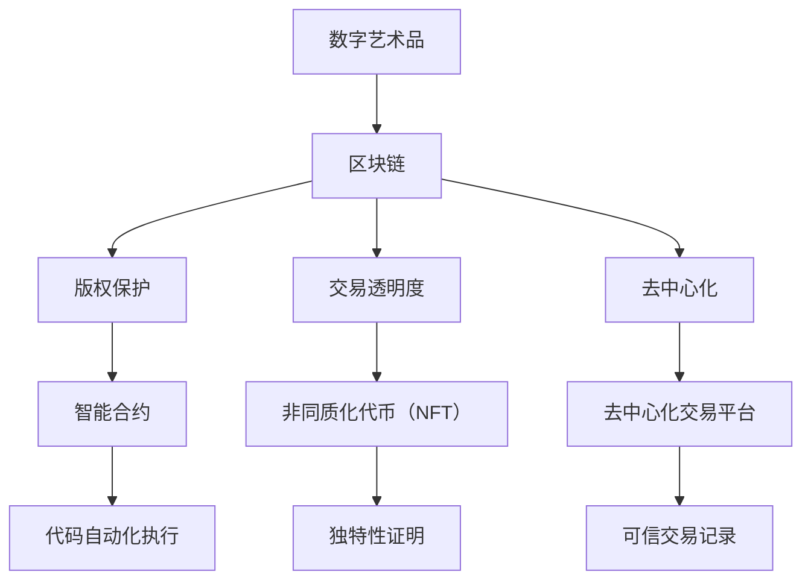

                 

# 区块链在数字艺术市场中的应用

## 关键词
- 区块链
- 数字艺术市场
- 版权保护
- 智能合约
- 去中心化
- 非同质化代币（NFT）

## 摘要
本文将深入探讨区块链技术在数字艺术市场中的应用，分析区块链如何解决数字艺术市场的版权保护、交易透明度和去中心化问题。通过介绍区块链的核心概念、架构、算法以及实际应用案例，本文旨在为读者提供对区块链在数字艺术市场中的潜力和挑战的全面了解。

## 设计《区块链在数字艺术市场中的应用》书籍目录大纲的步骤

### 明确书籍主题和目标受众

在撰写《区块链在数字艺术市场中的应用》书籍之前，我们需要首先明确书籍的主题和目标受众。主题已经明确，即区块链技术在数字艺术市场的应用。目标受众则可能是对区块链和数字艺术市场有一定了解，但希望深入了解二者结合的专业人士或爱好者。

### 确定书籍的结构和内容框架

基于书籍主题，我们可以将书籍结构分为以下几个部分：

1. **区块链基础**：介绍区块链的定义、历史背景、核心概念和实现原理。
2. **数字艺术市场现状**：分析数字艺术市场的定义、现状、发展趋势以及面临的挑战。
3. **区块链在数字艺术市场的应用案例**：通过具体案例展示区块链在数字艺术市场中的实际应用。
4. **技术挑战与解决方案**：探讨区块链在数字艺术市场应用中面临的技术挑战，并提出解决方案。
5. **未来发展趋势**：预测区块链在数字艺术市场的未来发展趋势和应用前景。

### 细化每个部分的具体内容

在每个部分中，我们需要进一步细化内容，确定每个章节的小标题。例如，在“区块链基础”部分，我们可以包括以下章节：

- 1.1 区块链技术概述
- 1.2 区块链架构与实现
- 1.3 区块链核心技术

在“数字艺术市场现状”部分，我们可以包括以下章节：

- 2.1 数字艺术市场概述
- 2.2 数字艺术品的特点与挑战

在“区块链在数字艺术市场的应用案例”部分，我们可以包括以下章节：

- 3.1 区块链与数字艺术品版权保护
- 3.2 区块链与数字艺术品交易
- 3.3 区块链与数字艺术品认证

在“技术挑战与解决方案”部分，我们可以包括以下章节：

- 4.1 区块链在数字艺术市场的技术挑战
- 4.2 技术解决方案

在“未来发展趋势”部分，我们可以包括以下章节：

- 5.1 区块链在数字艺术市场的未来趋势
- 5.2 未来展望

### 设计核心概念和联系

为了更好地理解区块链在数字艺术市场中的应用，我们可以利用Mermaid流程图来展示区块链与数字艺术市场的核心概念及其联系。例如，我们可以绘制一个流程图，展示区块链如何用于数字艺术品的版权保护、交易和认证。



### 编写伪代码和数学模型

对于区块链在数字艺术市场的应用，我们还需要编写伪代码和数学模型来详细阐述其原理。例如，在版权保护方面，我们可以使用伪代码来描述智能合约的实现过程。此外，我们还可以使用数学模型来解释如何利用区块链技术实现数字艺术品的唯一性证明。

```python
# 伪代码：智能合约实现版权保护
def copyright_protection(creator, artwork, timestamp):
    # 创建版权记录
    copyright_record = {
        "creator": creator,
        "artwork": artwork,
        "timestamp": timestamp
    }
    
    # 将版权记录写入区块链
    blockchain.append(copyright_record)
    
    # 发送通知
    notify(creator, "版权已成功保护")

# 数学模型：数字艺术品唯一性证明
def unique_artifact_proof(artwork_hash, blockchain_hash):
    if artwork_hash == blockchain_hash:
        return "艺术品唯一性证明成功"
    else:
        return "艺术品唯一性证明失败"
```

### 编写数学公式和举例说明

在区块链技术的应用中，数学公式和举例说明是非常重要的。例如，在解释区块链的哈希算法时，我们可以使用LaTeX格式编写数学公式，并结合具体案例进行讲解。

```latex
$$
H = SHA256(S)
$$

其中，\( H \) 表示哈希值，\( S \) 表示输入的数据。以数字艺术品“星空”为例，其哈希值为 \( H = SHA256("星空") \)。通过哈希算法，我们可以确保数字艺术品的唯一性和不可篡改性。
```

### 编写项目实战案例

为了使读者更好地理解区块链在数字艺术市场的实际应用，我们还需要提供具体的实战案例。例如，我们可以介绍如何搭建一个区块链数字艺术品交易平台，包括开发环境搭建、源代码实现、代码解读以及实际案例分析和讲解。

```python
# 项目实战：区块链数字艺术品交易平台搭建

# 环境搭建
# 安装Python环境
# 安装区块链开发框架，如Ethereum

# 源代码实现
# 创建智能合约，实现数字艺术品交易功能
# 编写前端代码，实现用户界面

# 代码解读
# 解释智能合约的实现原理，如ERC-721标准

# 实际案例分析
# 分析一个已上线的区块链数字艺术品交易平台，如OpenSea
# 详细讲解交易流程、交易记录存储方式以及用户体验

# 项目小结
# 总结项目实施过程中的关键技术和挑战，提出解决方案
```

### 最佳实践 tips、小结、注意事项、拓展阅读等内容

在书籍的最后，我们可以提供一些最佳实践 tips、小结、注意事项以及拓展阅读等内容。这些内容可以帮助读者更好地理解区块链在数字艺术市场中的应用，并提供进一步学习和探索的方向。

### 审查和修改

最后，我们需要对目录大纲进行审查和修改，确保逻辑清晰、内容完整。在修改过程中，可以根据实际情况调整章节顺序、添加或删除部分内容，以确保整体结构合理、内容丰富。

## 《区块链在数字艺术市场中的应用》书籍目录大纲

### 第一部分：区块链基础

#### 1.1 区块链技术概述
- 区块链的定义与历史背景
- 区块链的核心概念：分布式账本、共识机制、智能合约
- 区块链与数字艺术市场的潜在联系

#### 1.2 区块链架构与实现
- Mermaid流程图：区块链核心概念与架构联系
- 区块链网络模型：P2P网络、节点、链式数据结构
- 智能合约的原理与实现

#### 1.3 区块链核心技术
- 伪代码：区块链核心算法原理
- 加密算法：哈希函数、数字签名、公钥加密
- 共识机制：工作量证明（PoW）、权益证明（PoS）等

### 第二部分：数字艺术市场现状

#### 2.1 数字艺术市场概述
- 数字艺术的定义与发展历程
- 数字艺术市场的现状与趋势
- 数字艺术市场的商业模式与价值链

#### 2.2 数字艺术品的特点与挑战
- 数字艺术品的特点：易复制性、可篡改性等
- 数字艺术市场面临的挑战：版权保护、认证问题等

### 第三部分：区块链在数字艺术市场的应用案例

#### 3.1 区块链与数字艺术品版权保护
- 数学模型：利用区块链实现版权确权与追踪
- 举例说明：案例解析与版权保护解决方案

#### 3.2 区块链与数字艺术品交易
- 伪代码：数字艺术品交易的智能合约实现
- 实际案例：区块链数字艺术品交易平台分析

#### 3.3 区块链与数字艺术品认证
- 数学模型：利用区块链实现艺术品真伪认证
- 举例说明：艺术品认证流程与案例

### 第四部分：技术挑战与解决方案

#### 4.1 区块链在数字艺术市场的技术挑战
- 数据隐私保护：匿名交易与隐私保护算法
- 可扩展性：处理高并发交易的需求

#### 4.2 技术解决方案
- 加密算法与隐私保护技术：零知识证明、同态加密等
- 扩展方案：侧链、二层扩容等

### 第五部分：未来发展趋势

#### 5.1 区块链在数字艺术市场的未来趋势
- 产业融合：区块链与其他技术的结合
- 社会变革：数字艺术市场的创新与影响

#### 5.2 未来展望
- 区块链在数字艺术市场的潜在应用领域
- 技术发展的挑战与机遇

### 附录

#### 附录 A：区块链在数字艺术市场中的应用工具与资源
- 开发工具与平台简介
- 区块链数字艺术市场相关资源链接

### 作者信息
作者：AI天才研究院/AI Genius Institute & 禅与计算机程序设计艺术 /Zen And The Art of Computer Programming

通过以上目录大纲，我们可以系统地梳理出《区块链在数字艺术市场中的应用》一书的内容结构，为后续的详细撰写工作提供指导。在撰写过程中，我们将遵循逻辑清晰、内容完整、讲解详细的要求，确保为读者提供有价值的技术知识和实际应用案例。同时，我们还将不断审查和修改大纲，以优化整体结构和提升文章质量。在完成书籍撰写后，我们将通过附录部分提供相关工具和资源的链接，为读者提供进一步学习和实践的机会。

---

在撰写本文时，我们将按照上述目录大纲的结构，逐步深入探讨区块链在数字艺术市场中的应用。从区块链技术的基础知识入手，到数字艺术市场的现状分析，再到具体应用案例的介绍，我们将通过逻辑清晰、内容丰富的文章，帮助读者全面了解这一新兴领域。同时，我们还将探讨区块链在数字艺术市场应用过程中面临的技术挑战，并提出相应的解决方案，展望其未来的发展趋势和机遇。希望通过本文，读者能够对区块链在数字艺术市场中的应用有更深入的认识和理解。让我们开始一步步分析推理，开启这场技术之旅吧！

