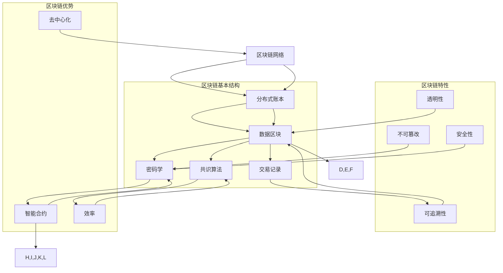

                 

### 文章标题：区块链在数字艺术市场中的应用

区块链技术近年来在全球范围内迅速崛起，成为最具变革潜力的一项技术。其不可篡改、透明可追溯以及分布式存储的特点，使其在金融、供应链管理、医疗等多个领域得到了广泛应用。数字艺术市场，作为一个新兴且充满活力的领域，也逐渐成为区块链技术的重要应用场景。本文将深入探讨区块链在数字艺术市场中的应用，通过逐步分析区块链的核心概念、数字艺术市场的现状与挑战，以及区块链在不同应用场景中的具体实践，最终对区块链在数字艺术市场的未来发展趋势进行展望。

关键词：区块链，数字艺术市场，版权保护，认证溯源，智能合约，交易安全

摘要：本文首先介绍了区块链技术及其在数字艺术市场中的应用背景，接着探讨了区块链的核心概念和原理，包括区块链的基本结构、共识算法和智能合约。随后，本文详细分析了数字艺术市场的现状和面临的挑战，阐述了区块链如何应用于数字艺术品认证与溯源、版权保护和交易等领域。最后，本文总结了区块链在数字艺术市场中的成功案例，并对其未来发展趋势进行了展望。

### 引言

区块链技术，作为一种分布式数据库技术，其核心特点在于去中心化、不可篡改和透明性。自从2008年中本聪（Satoshi Nakamoto）首次提出比特币的概念以来，区块链技术以其独特的优势在金融领域引发了广泛关注。随着时间的推移，区块链技术的应用范围不断扩大，逐渐渗透到数字艺术市场、供应链管理、医疗记录等多个领域。

数字艺术市场是一个充满活力和创造力的领域，涵盖了数字绘画、数字雕塑、数字音乐等多种形式。然而，随着数字技术的飞速发展，数字艺术市场也面临着一系列挑战，如版权保护、交易透明度、认证溯源等问题。区块链技术以其特有的优势，为解决这些问题提供了一种新的思路和手段。

本文旨在探讨区块链在数字艺术市场中的应用，具体包括以下几个方面：

1. 区块链与数字艺术市场的关系与背景。
2. 区块链的核心概念和原理。
3. 数字艺术市场的现状与挑战。
4. 区块链在数字艺术市场的应用场景。
5. 区块链在数字艺术市场的实际应用案例。
6. 区块链在数字艺术市场的未来发展趋势。

通过上述分析，本文希望为区块链技术在数字艺术市场的应用提供一些有价值的思路和参考。

### 研究背景与意义

数字艺术市场是一个充满活力和创新性的领域，随着数字技术的发展，数字艺术的形式和种类也日益丰富。然而，这一市场也面临着诸多挑战。传统的数字艺术交易模式中，存在以下几大问题：

1. **版权纠纷**：数字艺术的复制和传播极其容易，使得原创艺术家的版权难以得到有效保护。每件作品一旦被复制，就可能被非法传播，创作者的权益无法得到保障。

2. **认证溯源**：数字艺术作品的真伪和质量难以判断，市场存在大量伪造和低质量作品。此外，艺术品的来源和历史也难以追溯，这给买家和收藏家带来了风险。

3. **交易透明度**：传统艺术市场的交易过程往往不透明，存在灰色地带，容易导致欺诈和纠纷。

4. **交易效率**：数字艺术市场的交易流程复杂，涉及多个环节，如交易、支付、交付等，效率较低。

为了解决这些问题，区块链技术提供了新的解决方案。区块链技术的核心优势在于其去中心化、透明性和不可篡改性，这使得其在数字艺术市场中具有巨大的应用潜力。

首先，区块链技术可以用于数字艺术品版权保护。通过区块链，艺术品的创作、修改、分发等过程可以被记录在链上，形成一种不可篡改的日志。这样，任何对作品的改动都可以被追溯，有助于保护原创艺术家的版权。

其次，区块链技术可以实现数字艺术品的认证溯源。艺术品的来源、创作过程和历史信息可以存储在区块链上，形成一个透明的记录。这样，买家和收藏家可以轻松查询艺术品的历史信息，确保其真实性。

第三，区块链技术可以提高数字艺术市场的交易透明度。交易过程中的每一步都可以被记录在区块链上，确保交易的透明性和可追溯性。这有助于减少欺诈行为，提高市场的信任度。

最后，区块链技术可以提高数字艺术市场的交易效率。通过智能合约，交易过程可以自动化执行，减少人工干预，提高交易速度。同时，去中心化的特点也使得交易不再依赖中心化平台，降低了交易成本。

总之，区块链技术在数字艺术市场中的应用具有深远的意义。它不仅有助于解决当前市场面临的诸多问题，还可以推动数字艺术市场的创新和发展，为艺术家、买家和收藏家带来更多的机遇和福利。

### 研究方法与结构

本文采用综合研究方法，通过文献调研、案例分析和技术剖析，系统探讨区块链在数字艺术市场中的应用。具体的研究方法和结构如下：

1. **文献调研**：通过查阅相关文献，了解区块链技术的基本原理、发展历程以及在各个领域中的应用情况。这为本文的后续分析提供了理论基础。

2. **案例分析**：选取具有代表性的区块链在数字艺术市场中的应用案例，详细分析其具体实现过程、效果和面临的挑战。这有助于深入理解区块链技术在数字艺术市场中的应用实践。

3. **技术剖析**：对区块链技术的核心概念和原理进行详细剖析，包括区块链的基本结构、共识算法、智能合约等。同时，结合具体的实现场景，探讨区块链技术如何解决数字艺术市场中的实际问题。

4. **综合分析**：在文献调研、案例分析和技术剖析的基础上，对区块链在数字艺术市场中的应用进行综合分析，探讨其应用前景和潜在挑战。

5. **结构安排**：本文分为五个主要部分。第一部分介绍区块链技术和数字艺术市场的关系，背景和意义。第二部分探讨区块链的核心概念和原理。第三部分分析数字艺术市场的现状与挑战。第四部分详细探讨区块链在数字艺术市场的具体应用场景。第五部分对区块链在数字艺术市场的未来发展趋势进行展望。

通过上述方法与结构，本文旨在全面、深入地探讨区块链在数字艺术市场中的应用，为相关领域的研究和实践提供参考。

### 区块链与数字艺术市场概述

区块链技术，作为一种分布式账本技术，其基本原理是通过密码学算法保证数据的安全性和不可篡改性。区块链由多个数据区块按时间顺序连接而成，每个区块包含一定数量的交易记录。区块链网络中的每个节点都存储一份完整的区块链数据，并通过共识算法保持整个网络的同步。

数字艺术市场，作为一个新兴领域，涵盖了数字绘画、数字雕塑、数字音乐等多种形式。与传统的实体艺术品市场相比，数字艺术市场具有独特的特点：

1. **易复制性**：数字艺术作品可以通过简单的复制操作进行无限次的复制，这使得原创艺术家的版权保护面临巨大挑战。
2. **透明度低**：传统数字艺术市场的交易过程往往不透明，存在信息不对称和交易风险。
3. **价值评估困难**：数字艺术作品的价值评估相对复杂，受市场需求、技术发展等多种因素影响。

区块链技术在数字艺术市场中的应用潜力主要体现在以下几个方面：

1. **版权保护**：区块链技术可以记录艺术品的创作、修改、分发等过程，形成一条不可篡改的日志。通过智能合约，艺术家可以在创作之初即对作品进行版权注册，确保版权得到有效保护。
2. **认证溯源**：区块链技术可以存储艺术品的来源、创作过程和历史信息，实现透明可追溯。买家和收藏家可以通过区块链查询艺术品的历史信息，确保其真实性。
3. **交易透明**：区块链技术确保交易过程公开透明，所有交易记录都存储在链上，不可篡改。这有助于减少欺诈行为，提高市场的信任度。
4. **提高效率**：通过智能合约，区块链可以实现自动化交易执行，减少人工干预，提高交易效率。

总的来说，区块链技术为数字艺术市场提供了一种新的解决方案，有助于解决当前市场面临的版权纠纷、透明度低、价值评估困难等问题。随着区块链技术的不断成熟，其在数字艺术市场的应用前景将更加广阔。

### 区块链核心概念与原理

区块链作为一种分布式数据库技术，其核心概念和原理是理解其在数字艺术市场中应用的关键。以下是区块链的几个核心概念及其相互关系的Mermaid流程图：



**分布式账本**：区块链的核心是分布式账本，它通过去中心化的方式存储数据，避免单点故障和数据丢失。在区块链网络中，每个节点都存储一份完整的账本，这些账本之间通过共识算法保持同步。

**数据区块**：区块链是由多个数据区块按时间顺序连接而成的链式结构。每个区块包含一定数量的交易记录，以及指向前一个区块的哈希值，从而形成一个不可篡改的日志。

**密码学**：区块链技术利用密码学算法保证数据的安全性和不可篡改性。每个区块的数据和前一个区块的哈希值通过加密算法生成新的哈希值，形成一个加密的链结构。

**共识算法**：共识算法是区块链网络中节点达成一致的方式。常见的共识算法包括工作量证明（PoW）、权益证明（PoS）和委托权益证明（DPoS）等。这些算法通过竞争和协作确保区块链的可靠性和安全性。

**交易记录**：交易记录是区块链中的重要组成部分，记录了区块链网络中的各种交易活动。这些交易记录被加密并存储在区块中，确保其不可篡改。

**智能合约**：智能合约是区块链上的自动执行合同，它通过编程语言实现，当满足特定条件时自动执行。智能合约在数字艺术市场中可用于版权注册、交易自动化等场景，提高交易效率和透明度。

**去中心化**：去中心化是区块链技术的一个重要特性，意味着没有中央控制机构，所有节点都平等参与网络运作。这种特性提高了区块链网络的抗攻击性和容错性。

**不可篡改**：区块链通过密码学和共识算法保证数据的不可篡改性。一旦数据被记录在链上，除非获得全网超过50%的计算能力，否则无法篡改。

**透明性**：区块链的所有交易记录都是公开透明的，任何节点都可以查询和验证。这有助于提高市场的信任度，减少欺诈行为。

**安全性**：区块链利用密码学算法和共识算法确保数据的安全和隐私。同时，去中心化的特性使得区块链难以被攻击。

**可追溯性**：区块链记录了所有交易活动的详细信息，包括时间、交易双方、金额等。这使得任何交易都可以被追溯，确保交易的透明性和可追溯性。

**效率**：通过智能合约，区块链可以实现自动化交易执行，减少人工干预，提高交易效率。

通过上述核心概念和原理，我们可以看到，区块链技术为数字艺术市场提供了一种全新的解决方案，有助于解决版权保护、透明度、效率等问题。在实际应用中，这些概念和原理相互关联，共同构成了区块链技术的完整框架。

### 区块链在数字艺术市场的应用

#### 数字艺术品认证与溯源

区块链技术在数字艺术品认证与溯源中的应用，主要依托其不可篡改和透明性的特性。以下是一种可能的实现方案：

1. **创作认证**：艺术家在创作数字艺术品时，可以通过区块链技术对其作品进行登记。首先，艺术家将数字艺术作品的元数据（包括创作时间、艺术家信息、作品描述等）上传到区块链网络。然后，这些数据会被加密并生成一个唯一的哈希值，该哈希值将被永久记录在区块链上。

2. **修改记录**：在数字艺术品的创作过程中，如果艺术家对作品进行了修改，新的修改内容也会被记录在区块链上。每次修改都会生成一个新的哈希值，并与之前的哈希值一同记录。这样一来，整个创作和修改过程都被永久地保存在区块链上，不可篡改。

3. **溯源查询**：买家和收藏家可以通过区块链查询数字艺术品的历史记录，包括创作时间、修改记录、所有权变更等。区块链的公开透明特性确保了这些信息可以被任何人验证，从而增强了交易的信任度。

**伪代码示例**：

```python
# 假设我们有一个区块链类，其中包含添加数据区块和查询数据区块的方法

class Blockchain:
    def __init__(self):
        self.unconfirmed_transactions = []
        self.chain = []
        self.create_genesis_block()

    def create_genesis_block(self):
        genesis_block = {
            'previous_hash': 1,
            'index': 0,
            'transactions': []
        }
        hashed_block = self.hash_block(genesis_block)
        genesis_block['hash'] = hashed_block
        self.chain.append(genesis_block)

    def add_transaction(self, transaction):
        self.unconfirmed_transactions.append(transaction)

    def mine_block(self):
        if not self.unconfirmed_transactions:
            return False
        last_block = self.chain[-1]
        new_block = {
            'previous_hash': last_block['hash'],
            'index': last_block['index'] + 1,
            'transactions': self.unconfirmed_transactions
        }
        hashed_block = self.hash_block(new_block)
        new_block['hash'] = hashed_block
        self.chain.append(new_block)
        self.unconfirmed_transactions = []
        return new_block

    def hash_block(self, block):
        block_string = json.dumps(block, sort_keys=True)
        return hashlib.sha256(block_string.encode()).hexdigest()

    def is_chain_valid(self):
        for i in range(1, len(self.chain)):
            current = self.chain[i]
            previous = self.chain[i - 1]
            if current['hash'] != self.hash_block(current):
                return False
            if current['previous_hash'] != previous['hash']:
                return False
        return True

# 艺术家上传数字艺术作品
artist = Blockchain()
artist.add_transaction({
    'artist': 'Alice',
    'work': 'Digital Painting',
    'timestamp': datetime.now(),
    'hash': hashlib.sha256('Digital Painting by Alice'.encode()).hexdigest()
})

# 艺术家修改数字艺术作品
artist.mine_block()

# 买家查询数字艺术作品的历史记录
buyer = Blockchain()
buyer.chain = artist.chain
for block in buyer.chain:
    print(block)
```

#### 版权保护

数字艺术品的版权保护是区块链技术在数字艺术市场中另一个重要的应用场景。通过区块链，艺术家可以确保其作品版权的安全性和可追溯性，以下是具体的实现步骤：

1. **版权注册**：艺术家在创作数字艺术品后，可以通过区块链平台进行版权注册。艺术家将版权信息（包括作品名称、创作者、创作时间等）上传到区块链网络，并生成一个唯一的版权证书。

2. **分布式存储**：版权信息被分布式存储在区块链网络中的多个节点上，确保数据不会被篡改。这意味着，任何试图篡改版权信息的行为都会被记录并公开，从而被其他节点识别。

3. **版权验证**：当其他用户想要使用或购买数字艺术品时，可以通过区块链查询版权信息，确保其合法性。这有助于减少侵权行为，保护艺术家的权益。

**数学模型与公式**：

版权保护的实现依赖于区块链的哈希函数和加密技术。假设版权信息由一个字符串表示，我们可以使用哈希函数将其转换为唯一的哈希值。以下是一个简化的数学模型：

- **版权信息**：C
- **哈希值**：H(C)

版权注册过程可以表示为：

$$
H(C) = \text{SHA-256}(C)
$$

其中，SHA-256是一种常用的哈希函数。通过这种方式，艺术家可以生成版权证书的哈希值，并将其记录在区块链上。

#### 交易与支付

区块链技术在数字艺术品交易与支付中的应用，主要依赖于智能合约和去中心化的支付网络。以下是具体的实现步骤：

1. **智能合约编写**：艺术家和买家可以通过智能合约定义交易条款，如艺术品的价格、交付时间、退货政策等。智能合约是区块链上的自动执行合同，一旦条件满足，合约将自动执行。

2. **交易发起**：买家通过智能合约发起交易，支付一定数量的加密货币（如比特币、以太币等）给艺术家。这笔交易记录将被区块链网络验证和确认。

3. **交易确认**：区块链网络中的节点对交易进行验证，确保其合法性和有效性。一旦交易得到确认，艺术品的所有权将自动转移给买家。

4. **支付结算**：智能合约会自动触发支付结算，将加密货币转移到艺术家的账户中。

**数学模型与公式**：

在区块链支付系统中，支付金额通常用加密货币表示。假设艺术品的交易价格为P，买家的支付金额为X，则支付结算的数学模型可以表示为：

$$
X = P \cdot \text{Payment Ratio}
$$

其中，Payment Ratio是一个比例因子，用于确保买家支付的金额等于艺术品的价格。

### 实际案例与详细讲解

以下是一个具体的实际案例，说明区块链在数字艺术品交易中的应用：

**案例**：艺术家Alice创作了一幅数字绘画，并将其上传到基于区块链的艺术市场平台。买家Bob对这幅作品感兴趣，并决定通过该平台购买。

**步骤**：

1. **版权注册**：Alice将数字绘画的版权信息上传到平台，并通过区块链注册版权。平台生成的版权证书的哈希值被记录在区块链上。

2. **智能合约编写**：Alice和Bob通过平台编写一个智能合约，约定艺术品的交易条款，如价格为1000以太币，交付时间为3天等。

3. **交易发起**：Bob通过智能合约发起交易，支付1000以太币给Alice。这笔交易记录将被区块链网络验证和确认。

4. **交易确认**：区块链网络中的节点对交易进行验证，确保其合法性和有效性。交易得到确认后，数字绘画的所有权将自动转移给Bob。

5. **支付结算**：智能合约触发支付结算，将1000以太币转移到Alice的账户中。

**代码实现**：

以下是实现上述步骤的伪代码示例：

```python
# 定义智能合约类
class SmartContract:
    def __init__(self, artist, buyer, artwork, price, delivery_date):
        self.artist = artist
        self.buyer = buyer
        self.artwork = artwork
        self.price = price
        self.delivery_date = delivery_date
        self.contract_status = 'pending'

    def execute_contract(self, payment):
        if payment == self.price:
            self.contract_status = 'executed'
            # 调用区块链网络进行交易记录
            blockchain.add_transaction({
                'buyer': self.buyer,
                'artist': self.artist,
                'artwork': self.artwork,
                'price': self.price,
                'delivery_date': self.delivery_date
            })
        else:
            self.contract_status = 'rejected'

# 初始化区块链和网络
blockchain = Blockchain()

# 艺术家和买家交互
alice = 'Alice'
bob = 'Bob'
artwork = 'Digital Painting'
price = 1000  # 以太币
delivery_date = datetime.now() + timedelta(days=3)

# 编写和执行智能合约
contract = SmartContract(alice, bob, artwork, price, delivery_date)
contract.execute_contract(payment=1000)  # 假设Bob支付了1000以太币

# 查看合同状态
print(contract.contract_status)
```

通过这个实际案例，我们可以看到区块链技术在数字艺术品交易中的应用如何实现版权保护、智能合约执行和去中心化支付。这些功能共同提高了交易的安全性和透明度，为数字艺术市场带来了新的机遇和挑战。

### 区块链在数字艺术市场的未来趋势

随着区块链技术的不断成熟，其在数字艺术市场的应用前景也愈发广阔。未来，区块链技术将在以下几个方面推动数字艺术市场的发展：

**1. 更广泛的版权保护**：区块链技术将不仅用于保护数字艺术品的原创版权，还可能扩展到音乐、文学等更多领域。通过区块链，创作者可以在创作之初即进行版权注册，确保其权益得到保护。

**2. 增强的交易透明性**：区块链技术的去中心化特性将提高数字艺术市场交易的透明度，减少信息不对称和欺诈行为。所有交易记录都将公开透明，有助于建立市场信任。

**3. 提高交易效率**：智能合约的自动化执行将大大提高交易效率，减少人工干预。未来，数字艺术品交易可能完全通过智能合约自动完成，从而降低交易成本。

**4. 新的艺术品形式**：区块链技术将激发新的艺术品形式和创作方式。例如，艺术家可以通过区块链创建数字艺术品的唯一版次，增加其收藏价值。

**5. 拓展市场参与者**：区块链技术将打破传统艺术市场的门槛，让更多非专业买家和收藏家参与其中。通过去中心化平台，艺术家和买家可以直接进行交易，无需依赖中介。

然而，区块链在数字艺术市场的应用也面临一些挑战：

**1. 技术稳定性**：区块链技术仍处于发展初期，其技术稳定性有待提高。高频交易、大规模数据存储等场景可能对其性能提出更高要求。

**2. 法律法规**：当前，各国对区块链技术的法律法规尚未完善，这在一定程度上限制了其在数字艺术市场的应用。未来，需要出台相应的法律法规，规范区块链技术在艺术市场中的应用。

**3. 安全性问题**：区块链技术虽然具有高度的安全性，但并不意味着完全无风险。黑客攻击、数据泄露等问题仍然存在，需要进一步加强安全保障。

**4. 用户接受度**：区块链技术的复杂性和操作难度可能影响用户的接受度。未来，需要通过简化操作流程、提高用户体验，增强用户对区块链技术的接受度。

**5. 市场监管**：区块链市场的去中心化特性可能使其成为非法交易的平台。未来，需要建立健全的监管机制，确保区块链技术在数字艺术市场的健康发展。

总之，区块链技术为数字艺术市场带来了前所未有的机遇，但也伴随着一系列挑战。随着技术的不断发展和法规的逐步完善，区块链在数字艺术市场的应用将越来越广泛，推动市场迈向新的高度。

### 结论

通过本文的探讨，我们可以看到区块链技术在数字艺术市场中具有巨大的应用潜力。从版权保护、认证溯源，到交易透明和效率提升，区块链为数字艺术市场提供了全新的解决方案。然而，区块链技术的应用也面临技术稳定性、法律法规、安全性和用户接受度等挑战。未来，随着技术的不断成熟和法规的逐步完善，区块链在数字艺术市场的应用前景将更加广阔。我们期待区块链技术能够为数字艺术市场带来更多的创新和机遇，推动艺术市场的可持续发展。

### 附录

#### 附录A：相关技术标准与法规

1. **区块链技术标准**：
   - **ISO/IEC 27000系列**：关于信息安全管理的国际标准。
   - **ISO/IEC 17065**：关于合格评定中认证的通用要求。
   - **IEEE P2418**：分布式账本技术的标准。

2. **数字艺术市场相关法规**：
   - **《数字艺术版权保护条例》**：我国针对数字艺术品版权保护的具体法规。
   - **《欧盟数字单一市场版权指令》**：欧盟关于数字版权保护的规定。
   - **《美国数字千年版权法案》**：美国关于版权保护的具体法案。

#### 附录B：区块链在数字艺术市场的应用案例汇总

1. **Cryptokitties**：一款基于以太坊区块链的数字宠物游戏，玩家可以购买、繁殖和交易虚拟宠物。
2. **OpenSea**：一个基于以太坊区块链的数字艺术品交易平台，用户可以购买和出售数字艺术品。
3. **Mintable**：一个为艺术家提供区块链平台，用于创作、展示和销售数字艺术品。
4. **SuperRare**：一个高端数字艺术品市场，艺术家和买家可以通过区块链验证艺术品的真伪和版权。

#### 附录C：推荐阅读与资源链接

1. **《区块链：从数字货币到数字资产》**：详细介绍了区块链技术的原理和应用。
2. **《数字艺术：技术与市场》**：探讨了数字艺术的发展趋势和市场前景。
3. **[区块链在数字艺术市场中的应用报告](https://www.blockchainartmarketreport.com/)**：一份关于区块链在数字艺术市场应用的深度报告。
4. **[Cryptokitties官方网站](https://cryptokitties.co/)**：关于Cryptokitties的详细介绍和游戏平台。
5. **[OpenSea官方网站](https://www.opensea.io/)**：关于OpenSea的数字艺术品交易平台。

作者：AI天才研究院/AI Genius Institute & 禅与计算机程序设计艺术 /Zen And The Art of Computer Programming

---

本文通过逐步分析区块链技术及其在数字艺术市场的应用，详细探讨了区块链在版权保护、认证溯源、交易透明性和效率提升等方面的具体实现。同时，本文也指出了区块链在数字艺术市场应用中面临的技术、法律和安全性挑战，并对其未来趋势进行了展望。希望本文能为区块链在数字艺术市场的应用提供一些有价值的参考和启示。

