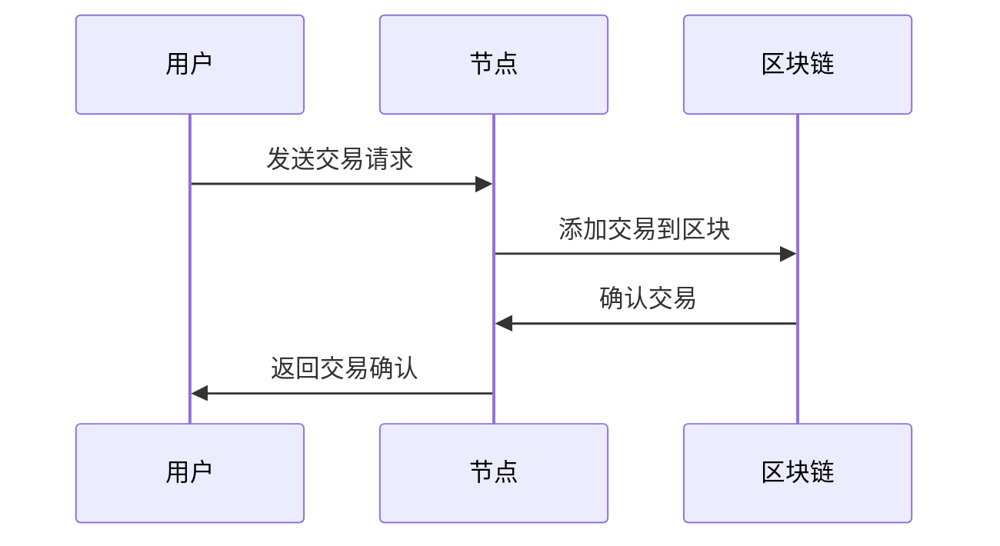

                 

### 文章标题

# 区块链在数字艺术市场中的应用与挑战

> 关键词：区块链、数字艺术市场、应用、挑战、案例

> 摘要：本文将深入探讨区块链在数字艺术市场中的应用与面临的挑战。通过对区块链技术的基本概念、核心特性及其与数字艺术市场的关联进行阐述，本文将分析区块链在数字艺术品溯源与验证、版权保护、交易与市场等方面的应用，同时探讨技术、法律法规及隐私保护等挑战。通过实际案例的剖析，本文旨在为读者提供一个全面而深入的视角，以了解区块链在数字艺术市场中的潜力和局限。

### 用户需求分析

在当前数字化时代，数字艺术市场正经历着前所未有的变革。随着区块链技术的兴起，艺术家、收藏家、交易商等参与者对区块链技术在数字艺术市场中的应用表现出了浓厚的兴趣。用户的需求主要集中在以下几个方面：

1. **了解区块链技术的基本概念与特性**：
   - 用户希望掌握区块链的定义、基本架构、核心特性及其与数字艺术市场的关联。
   - 用户希望了解区块链技术的发展历程，从而理解其在当前数字艺术市场中的重要性。

2. **探讨区块链在数字艺术市场中的应用**：
   - 用户希望了解区块链技术在数字艺术品溯源与验证、版权保护、交易与市场等方面的具体应用。
   - 用户希望通过案例分析，了解区块链技术在实际项目中的应用效果和挑战。

3. **分析区块链在数字艺术市场的挑战**：
   - 用户关注区块链技术在数字艺术市场应用过程中可能遇到的技术、法律法规及隐私保护等挑战。
   - 用户希望获得解决这些挑战的方法和建议，以更好地应用区块链技术。

4. **展望区块链在数字艺术市场的未来**：
   - 用户希望了解区块链技术在数字艺术市场的未来发展方向，以及可能带来的市场机遇。

通过满足上述用户需求，本文旨在为数字艺术市场的参与者提供一个全面、深入的技术分析，帮助他们更好地理解和应用区块链技术。

### 第一部分：区块链与数字艺术市场概述

#### 第1章：区块链技术基本概念

**1.1 区块链的定义与架构**

区块链是一种分布式数据库技术，其核心思想是将数据记录在一个去中心化的分布式账本中。区块链由多个区块组成，每个区块包含一定数量的交易记录。这些区块通过密码学算法连接在一起，形成一个不可篡改的链条。

区块链的基本架构主要包括以下部分：

- **区块**：区块是区块链的基本单位，每个区块包含一定数量的交易记录。区块通过加密算法和时间戳进行链接，形成一个链条。
- **分布式账本**：分布式账本是指区块链上的所有参与者共同维护的一个共享账本。每个参与者都拥有一份完整的账本副本，保证了系统的去中心化。
- **共识算法**：共识算法是区块链中所有参与者达成一致的关键机制。常见的共识算法包括工作量证明（PoW）和权益证明（PoS）等。

**Mermaid流程图**

下面是一个简单的Mermaid流程图，展示了一个区块的生成过程：



**1.2 区块链的核心特性**

区块链技术具有以下核心特性：

- **去中心化**：区块链的去中心化特性意味着数据存储和传输无需依赖中心化的机构或服务器，而是通过分布式网络实现。这种特性提高了系统的容错性和抗攻击能力。
- **安全性**：区块链采用加密算法和密码学技术，确保数据的完整性和安全性。每个区块通过哈希算法与前一个区块进行链接，使得任何修改历史记录的行为都变得极其困难。
- **不可篡改性**：区块链的数据一旦被记录，就几乎不可篡改。这种特性确保了数据的可信度和公正性，对于需要高可靠性的应用场景具有重要意义。
- **透明性**：区块链上的所有交易记录都是公开透明的，参与者可以随时查看和验证。这种透明性有助于提升系统的可信度和公信力。

**1.3 区块链的发展历程**

区块链技术起源于比特币（Bitcoin）的提出。2008年，一位名为中本聪（Satoshi Nakamoto）的匿名人士发布了比特币的白皮书，提出了一个去中心化的数字货币系统。比特币的问世标志着区块链技术的诞生。

从2009年比特币网络启动以来，区块链技术经历了快速的发展。以下是一些关键的发展里程碑：

- **2010年**：比特币价格首次突破1美元，标志着比特币开始受到关注。
- **2014年**：以太坊（Ethereum）的发布，使得区块链不再局限于数字货币，而是成为一种通用的智能合约平台。
- **2017年**：初始代币发行（ICO）热潮，区块链项目的数量迅速增加，吸引了大量投资。
- **2018年**：区块链技术的发展受到监管机构的关注，一些国家和机构开始制定相关法律法规。

**总结**

区块链技术作为一种分布式数据库技术，具有去中心化、安全性、不可篡改性和透明性等核心特性。其发展历程从比特币的诞生到以太坊的发布，再到ICO热潮，标志着区块链技术的快速发展和广泛应用。在数字艺术市场，区块链技术正逐渐展现出其独特的价值，为艺术家、收藏家和交易商提供了一种全新的解决方案。

#### 第2章：数字艺术市场概述

**2.1 数字艺术市场的定义**

数字艺术市场是指基于数字技术创作的艺术品交易和交流的市场。这些艺术品包括数字绘画、数字雕塑、数字摄影、虚拟现实作品等。数字艺术市场的特点是将传统艺术与数字技术相结合，创造出独特的艺术形式和商业模式。

数字艺术市场的定义可以从以下几个方面来理解：

1. **创作方式**：数字艺术是通过计算机技术和数字工具进行创作的，这些工具包括图形软件、虚拟现实设备等。
2. **表现形式**：数字艺术作品可以是静态的图片、视频，也可以是动态的交互式体验。
3. **传播渠道**：数字艺术作品可以通过互联网进行传播和展示，打破了传统艺术市场的地域和物理限制。
4. **交易模式**：数字艺术市场的交易模式包括在线拍卖、电子钱包支付、智能合约等。

**2.2 数字艺术市场的现状**

随着数字技术的快速发展，数字艺术市场呈现出蓬勃发展的态势。以下是数字艺术市场的一些现状：

1. **市场规模**：根据市场研究数据，全球数字艺术市场的规模正在迅速增长。一些知名数字艺术品交易平台的成交额已经超过了传统的艺术品市场。
2. **艺术形式多样化**：数字艺术市场的艺术形式多样化，包括虚拟现实艺术、增强现实艺术、互动艺术等。这些艺术形式不仅丰富了艺术创作的表现手法，也为观众带来了全新的体验。
3. **受众广泛**：数字艺术市场吸引了广泛的受众群体，不仅包括传统艺术爱好者和收藏家，还吸引了大量年轻一代和数字技术爱好者。
4. **技术创新**：数字艺术市场的创新不断，包括区块链技术的应用、非同质化代币（NFT）的兴起等。这些技术创新为数字艺术市场带来了新的发展机遇。

**2.3 区块链与数字艺术市场的关联**

区块链技术为数字艺术市场提供了一种全新的解决方案，主要表现在以下几个方面：

1. **溯源与验证**：区块链技术可以确保数字艺术作品的创作和交易过程的透明性和可追溯性。艺术家可以通过区块链记录作品的所有权信息和创作过程，收藏家可以验证作品的真伪和原创性。
2. **版权保护**：区块链技术可以保护数字艺术作品的版权，防止未经授权的复制和传播。艺术家可以通过智能合约自动执行版权许可协议，确保自己的权益得到保护。
3. **交易与市场**：区块链技术为数字艺术市场的交易提供了安全、透明和高效的解决方案。艺术家和收藏家可以通过区块链平台进行数字艺术作品的交易，实现快速结算和资产转移。
4. **市场信任**：区块链技术建立了去中心化的信任机制，提高了数字艺术市场的透明度和公信力。参与者无需依赖第三方中介机构，可以直接进行交易和协作。

**总结**

数字艺术市场是一种基于数字技术创作的艺术品交易和交流市场，具有多样化的艺术形式和广阔的市场前景。区块链技术为数字艺术市场提供了溯源与验证、版权保护、交易与市场等方面的解决方案，为市场的发展注入了新的动力。随着区块链技术的不断成熟，数字艺术市场有望迎来更加繁荣的未来。

### 第二部分：区块链在数字艺术市场中的应用

#### 第3章：数字艺术品溯源与验证

**3.1 溯源与验证的必要性**

在数字艺术市场中，溯源与验证是确保艺术品真实性、原创性和所有权的重要手段。传统的艺术品市场往往存在信息不对称、鉴定难度大、交易流程复杂等问题，而区块链技术的引入为这些问题提供了一种创新的解决方案。

**溯源与验证的重要性**：

1. **确保艺术品真实性**：数字艺术作品的创作和传播过程容易被篡改和伪造，溯源与验证可以帮助确认作品的真伪。
2. **保护艺术家权益**：艺术家需要确保自己的作品得到正确的认可和回报，溯源与验证可以帮助他们保护原创作品的权益。
3. **提升市场透明度**：区块链技术的透明性和不可篡改性可以提高数字艺术市场的透明度，增强市场的信任度。

**区块链在溯源与验证中的应用**：

区块链技术通过其分布式账本和加密算法，实现了对数字艺术作品的全生命周期管理，确保了作品的可追溯性和不可篡改性。以下是区块链在数字艺术品溯源与验证中的一些应用：

1. **创作记录**：艺术家可以在区块链上记录作品的创作信息，包括创作时间、工具、素材等，确保作品的原创性和完整性。
2. **交易记录**：区块链可以记录数字艺术作品的每一次交易，包括购买者、价格、交易时间等，确保交易的透明性和可追溯性。
3. **版权声明**：艺术家可以在区块链上发布版权声明，明确作品的版权归属和许可协议，防止未经授权的复制和传播。
4. **智能合约**：区块链上的智能合约可以自动执行版权许可协议，确保艺术家在作品销售、授权等环节得到相应的收益。

**核心算法原理讲解**

区块链在溯源与验证中的应用主要依赖于以下核心算法：

1. **哈希算法**：哈希算法是区块链中用于数据加密和校验的重要工具。通过哈希算法，可以将任意长度的数据映射为固定长度的哈希值，确保数据的唯一性和不可篡改性。
2. **分布式账本**：分布式账本技术确保了区块链上的数据被多个节点共同维护和验证，防止单点故障和数据篡改。
3. **非同质化代币（NFT）**：非同质化代币是区块链上的一种特殊代币，用于代表数字艺术作品的所有权和独特性。NFT具有不可分割、唯一性和不可篡改的特点，适用于数字艺术品的溯源与验证。

**伪代码**

以下是使用伪代码描述数字艺术品溯源与验证过程的示例：

```python
# 创建数字艺术品
def create_artwork(artwork):
    # 记录创作信息
    artwork["creation_info"] = record_creation_info(artwork)
    # 发布版权声明
    publish_copyright_declaration(artwork)
    # 将艺术品上链
    blockchain.add_artwork(artwork)

# 交易艺术品
def trade_artwork(artwork, buyer):
    # 记录交易信息
    artwork["trade_info"] = record_trade_info(artwork, buyer)
    # 更新所有权信息
    update_ownership(artwork, buyer)
    # 自动执行版权许可协议
    execute_copyright_license(artwork)

# 验证艺术品
def verify_artwork(artwork):
    # 校验创作信息
    if not verify_creation_info(artwork):
        return False
    # 校验交易信息
    if not verify_trade_info(artwork):
        return False
    # 校验版权声明
    if not verify_copyright_declaration(artwork):
        return False
    return True
```

**实际应用案例**

以下是一个实际应用案例，描述了某数字艺术品交易平台如何使用区块链技术实现溯源与验证：

1. **创作记录**：艺术家在平台上上传数字艺术品，平台将创作信息上链，确保作品的真实性。
2. **交易记录**：买家在平台上购买数字艺术品，平台记录交易信息，并将交易记录上链，确保交易的透明性。
3. **版权声明**：艺术家在平台上发布版权声明，平台将声明上链，确保作品的版权归属。
4. **智能合约**：平台使用智能合约自动执行版权许可协议，确保艺术家在作品销售、授权等环节得到相应的收益。

**总结**

区块链技术在数字艺术品溯源与验证中具有重要作用，通过分布式账本、加密算法和智能合约等技术手段，确保了艺术品的全生命周期管理。在实际应用中，区块链技术提高了市场的透明度和可信度，为艺术家和收藏家提供了一种全新的解决方案。随着区块链技术的不断成熟，数字艺术品溯源与验证将得到更广泛的应用。

#### 第4章：数字艺术品版权保护

**4.1 版权保护的重要性**

在数字艺术市场中，版权保护是确保艺术家权益和作品价值的重要手段。随着数字技术的发展，数字艺术作品的复制和传播变得更加容易，同时也带来了版权纠纷和盗版问题。版权保护的重要性主要体现在以下几个方面：

1. **保障艺术家权益**：艺术家的创作是一种智力劳动，其作品具有独特的价值和意义。版权保护可以帮助艺术家获得应有的经济回报，激励他们继续创作。
2. **维护市场秩序**：版权保护可以确保数字艺术市场的公平性和正义性，防止盗版和侵权行为，维护市场秩序。
3. **促进创新和发展**：有效的版权保护可以鼓励艺术家进行创新和实验，推动数字艺术市场的健康发展。

**数字艺术市场的现状与问题**

尽管数字艺术市场在近年来取得了显著的发展，但版权纠纷和盗版问题仍然困扰着艺术家和收藏家。以下是数字艺术市场面临的一些现状和问题：

1. **盗版问题突出**：数字艺术作品易于复制和传播，盗版行为屡见不鲜。艺术家往往难以追踪盗版源头，造成经济损失和创作动力下降。
2. **版权纠纷频发**：数字艺术作品的版权归属和权益分配问题复杂，导致版权纠纷频发。艺术家和收藏家在维权过程中面临法律和实际操作上的困难。
3. **技术手段不足**：现有的版权保护技术手段如数字水印、加密等存在一定的局限性，难以完全防止盗版和侵权行为。

**区块链在版权保护中的应用**

区块链技术为数字艺术市场的版权保护提供了一种创新的解决方案。区块链通过其分布式账本、加密算法和智能合约等技术手段，实现了对数字艺术作品的全生命周期管理，提高了版权保护的效果和效率。以下是区块链在版权保护中的应用：

1. **版权声明**：艺术家可以在区块链上发布版权声明，明确作品的版权归属和许可协议。这些信息被永久记录在区块链上，无法篡改，确保了版权的清晰性和可追溯性。
2. **智能合约**：智能合约可以自动执行版权许可协议，确保艺术家在作品销售、授权等环节得到相应的收益。艺术家可以通过智能合约设定许可条件和收益分配方式，实现自动化版权管理。
3. **区块链认证**：区块链可以记录数字艺术作品的所有历史交易和版权变更信息，提供透明的认证服务。收藏家可以验证作品的真实性和版权归属，确保购买到的作品是合法的。
4. **分布式存储**：区块链的分布式存储技术确保了数字艺术作品的存储安全，防止中心化存储系统可能遭遇的盗窃和破坏风险。

**核心算法原理讲解**

区块链在版权保护中的应用主要依赖于以下核心算法：

1. **数字指纹技术**：数字指纹技术是一种用于唯一标识数字内容的方法。通过为每个数字艺术作品生成独特的指纹，可以实现作品的快速识别和追踪。
2. **零知识证明**：零知识证明是一种密码学技术，允许一方在不泄露任何信息的情况下，证明某个陈述是真实的。在版权保护中，艺术家可以使用零知识证明证明自己的版权，而不透露具体的创作细节。
3. **哈希算法**：哈希算法用于生成数字艺术作品和版权声明等数据的唯一哈希值，确保数据的完整性和不可篡改性。

**伪代码**

以下是使用伪代码描述数字艺术品版权保护过程的示例：

```python
# 发布版权声明
def publish_copyright_declaration(artwork, artist):
    # 计算作品哈希值
    artwork_hash = calculate_hash(artwork)
    # 创建版权声明记录
    copyright_declaration = {
        "artwork_hash": artwork_hash,
        "artist": artist,
        "creation_date": current_date(),
        "license_conditions": license_conditions
    }
    # 上链存储版权声明
    blockchain.add_copyright_declaration(copyright_declaration)

# 验证版权声明
def verify_copyright_declaration(artwork, potential_buyer):
    # 计算作品哈希值
    artwork_hash = calculate_hash(artwork)
    # 从区块链获取版权声明
    copyright_declaration = blockchain.get_copyright_declaration(artwork_hash)
    # 校验版权声明
    if verify_license_conditions(copyright_declaration["license_conditions"], potential_buyer):
        return True
    return False
```

**实际应用案例**

以下是一个实际应用案例，描述了某数字艺术品版权保护平台如何使用区块链技术保护艺术家权益：

1. **版权声明**：艺术家在平台上发布版权声明，平台将声明上链，确保版权的清晰性和可追溯性。
2. **智能合约**：平台使用智能合约自动执行版权许可协议，确保艺术家在作品销售、授权等环节得到相应的收益。
3. **区块链认证**：平台提供区块链认证服务，收藏家可以验证作品的真实性和版权归属，确保购买到的作品是合法的。
4. **分布式存储**：平台使用区块链技术存储数字艺术作品，确保作品的安全性和完整性。

**总结**

区块链技术在数字艺术品版权保护中具有重要意义，通过分布式账本、加密算法和智能合约等技术手段，实现了对作品的全生命周期管理，提高了版权保护的效果和效率。在实际应用中，区块链技术为艺术家和收藏家提供了一种可靠的解决方案，有助于维护数字艺术市场的公平性和正义性。随着区块链技术的不断成熟，数字艺术品版权保护将得到更广泛的应用。

#### 第5章：数字艺术品交易与市场

**5.1 数字艺术品交易概述**

数字艺术品交易是指通过数字化方式购买、出售和交换数字艺术作品的活动。与传统的艺术品交易不同，数字艺术品交易具有以下几个显著特点：

1. **无物理载体**：数字艺术品没有物理形态，其存在形式主要是电子文件，如图片、视频等。
2. **交易便捷性**：数字艺术品交易可以不受时间和地点的限制，通过互联网进行快速交易和交付。
3. **价格波动性**：由于数字艺术品的稀缺性和市场需求的变化，其价格波动较大，具有一定的投资价值。
4. **交易形式多样化**：数字艺术品交易形式多样，包括在线拍卖、电子钱包支付、智能合约等。

**5.2 区块链在交易中的应用**

区块链技术在数字艺术品交易中发挥了重要作用，为交易提供了安全、透明和高效的解决方案。以下是区块链在数字艺术品交易中的应用：

1. **安全性**：区块链技术采用加密算法和分布式账本机制，确保交易数据的安全性和完整性。交易记录一旦被记录在区块链上，就几乎不可篡改，降低了欺诈风险。
2. **透明性**：区块链上的交易记录是公开透明的，所有参与者可以查看和验证交易信息。这种透明性提高了市场的信任度和公信力。
3. **可追溯性**：区块链技术记录了数字艺术品交易的全过程，包括购买者、价格、交易时间等。这种可追溯性有助于解决交易纠纷，确保交易的公平和公正。
4. **高效性**：区块链技术通过智能合约实现了自动化交易执行，减少了中介环节，提高了交易效率。智能合约可以自动执行交易协议，确保交易条款的执行。

**5.3 实际应用案例**

以下是一个实际应用案例，描述了某数字艺术品交易平台如何使用区块链技术实现安全、透明和高效的交易：

1. **交易流程**：用户在平台上浏览和选择数字艺术品，选择购买后，平台通过智能合约自动执行交易，确保交易的安全和高效。
2. **安全支付**：平台采用加密货币作为交易媒介，如比特币或以太币，确保交易过程中支付的安全性和匿名性。
3. **透明记录**：所有交易记录都会被记录在区块链上，用户可以查看和验证交易信息，确保交易的透明性。
4. **智能合约**：平台使用智能合约自动执行交易协议，确保交易条款的执行，如付款、交付等。

**总结**

区块链技术在数字艺术品交易中提供了安全、透明和高效的解决方案，为艺术家、收藏家和交易商提供了一个可靠的平台。通过区块链技术，数字艺术品交易实现了去中心化、自动化和透明化，提高了市场的效率和信任度。随着区块链技术的不断成熟，数字艺术品交易将迎来更加繁荣的未来。

### 第三部分：区块链在数字艺术市场的挑战

#### 第6章：技术挑战

区块链技术在数字艺术市场中的应用虽然带来了诸多优势，但同时也面临一系列技术挑战。这些挑战需要通过技术进步和创新来解决，以确保区块链技术能够在数字艺术市场中持续发展并发挥其潜力。

**6.1 技术难度**

区块链技术本身具有较高的技术门槛，这给开发人员带来了不小的挑战。以下是一些具体的技术难度：

1. **开发人员技能要求**：区块链开发需要掌握多种技术，包括加密算法、分布式系统设计、共识机制等。开发人员需要具备深厚的编程基础和数学知识，才能有效应对这些技术难题。
2. **跨平台兼容性**：数字艺术市场涉及多个平台和设备，如PC、手机、虚拟现实设备等。区块链技术需要具备跨平台兼容性，以适应不同设备和操作系统的需求。
3. **性能瓶颈**：区块链技术目前存在性能瓶颈，特别是随着网络节点数量的增加，交易处理速度和系统扩展能力可能受到限制。这需要通过技术优化和扩容方案来提升区块链的性能。

**6.2 性能瓶颈**

区块链技术的性能瓶颈主要体现在以下几个方面：

1. **交易处理速度**：区块链技术的设计决定了其交易处理速度相对较慢。例如，比特币网络每秒只能处理约7笔交易，而以太坊的扩展方案也面临类似的挑战。
2. **网络延迟**：随着区块链规模的扩大，网络延迟问题也日益突出。交易确认时间可能因此延长，影响用户体验。
3. **存储需求**：区块链的分布式账本需要存储大量的交易记录，这会导致存储需求不断增加。存储需求的高涨不仅增加了系统的维护成本，也可能成为技术进步的障碍。

**6.3 可扩展性**

区块链技术的可扩展性是确保其能够适应不断增长的用户需求的关键。以下是可扩展性面临的挑战：

1. **扩容问题**：随着用户数量的增加，区块链系统需要具备足够的扩展能力，以应对更高的交易量和数据量。扩容方案如分层架构、状态通道等旨在解决这一问题，但仍需进一步优化和普及。
2. **分片技术**：分片技术是一种通过将区块链网络分割为多个子网络来提高系统性能的方法。尽管分片技术具有潜力，但其实现和优化仍需进一步研究和实践。
3. **激励机制**：区块链系统的可扩展性还依赖于激励机制，如奖励机制、激励挖矿等。这些机制需要合理设计，以吸引更多的参与者和贡献者，确保系统的长期稳定运行。

**解决技术挑战的方法**

1. **技术创新**：通过持续的技术创新，不断提升区块链的性能和可扩展性。例如，开发更高效的共识算法、优化网络协议等。
2. **社区合作**：区块链社区的合作对于解决技术难题具有重要意义。通过开放源代码、技术交流等方式，促进技术进步和社区协作。
3. **研究投入**：政府和企业应加大对区块链技术的研究投入，支持相关项目和研究机构，推动技术突破和应用创新。

**总结**

区块链技术在数字艺术市场中面临技术难度、性能瓶颈和可扩展性等挑战。通过技术创新、社区合作和研究投入，可以逐步解决这些挑战，推动区块链技术在数字艺术市场中的广泛应用。随着技术的不断进步，区块链有望为数字艺术市场带来更多机遇和可能性。

#### 第7章：法律法规挑战

区块链技术在数字艺术市场的应用虽然带来了创新和变革，但也面临着法律法规方面的挑战。这些挑战主要体现在现有法律法规的不足和区块链技术的特点上。为了确保区块链技术能够在数字艺术市场中健康发展，有必要对相关法律法规进行完善。

**7.1 法律法规现状**

当前，全球范围内关于区块链技术的法律法规尚处于探索和完善阶段。以下是一些主要法律法规的现状：

1. **加密货币监管**：许多国家和地区已经对加密货币进行了监管，如美国、中国、日本等。这些法规主要关注加密货币的合法性、交易监管和反洗钱等方面。
2. **数字资产权利**：部分国家和地区已经开始探讨数字资产的权利保护问题，如欧盟的《数字市场法》和《数字权利与数字市场法》。这些法规旨在保护数字艺术品的版权和知识产权。
3. **智能合约法律效力**：智能合约的法律效力在许多国家尚未得到明确认可。一些国家开始研究和制定智能合约的法律框架，如新加坡的《智能合约法案》。

**法律法规的不足**

1. **适用性**：现有的法律法规往往针对传统的法律体系和实体资产，难以直接适用于区块链技术和数字资产。这导致在处理数字艺术市场的纠纷和问题时，现有法律框架显得力不从心。
2. **监管难度**：区块链技术的去中心化和匿名性使得监管机构难以有效监控和管理区块链网络。现有的监管手段和工具在应对区块链技术时存在局限性。
3. **跨国合作**：数字艺术市场具有跨国性和全球化特点，现有法律法规在跨国合作和跨境交易方面存在一定的冲突和障碍。这需要国际社会加强合作，制定统一的法律标准和规则。

**法律法规的完善**

1. **数字资产法律地位**：明确数字资产的法律地位，将其纳入法律体系，确保其在法律上具有与实体资产同等的权利和义务。
2. **智能合约法律框架**：制定智能合约的法律框架，明确其法律效力、责任分配和纠纷解决机制。这有助于推动智能合约在数字艺术市场中的广泛应用。
3. **监管机制创新**：探索适合区块链技术的监管机制，如分布式监管、智能合约监管等。通过技术手段提高监管效率和透明度。
4. **国际合作**：加强国际间的法律合作，制定统一的数字资产和区块链技术法律标准，解决跨国交易和纠纷问题。

**总结**

区块链技术在数字艺术市场中的应用面临着法律法规方面的挑战。为了确保其健康发展和应用，有必要对现有法律法规进行完善，明确数字资产的法律地位、智能合约的法律框架，并探索创新监管机制。通过国际间的合作和协调，可以建立更加完善和统一的法律法规体系，为数字艺术市场的可持续发展提供法律保障。

#### 第8章：隐私保护与安全性

在数字艺术市场中，隐私保护和安全性是至关重要的挑战。区块链技术虽然提供了一定的安全保障，但也存在隐私泄露和安全性风险。以下将从隐私保护和安全性的角度，探讨区块链在数字艺术市场中的挑战以及解决方案。

**8.1 隐私保护的重要性**

在数字艺术市场中，艺术家、收藏家和交易商的个人信息和交易记录都需要得到保护。隐私保护的重要性主要体现在以下几个方面：

1. **个人信息安全**：艺术家和收藏家的个人信息，如身份信息、联系方式等，可能被不法分子利用进行欺诈或骚扰。确保个人信息的安全是保护个人权益的基本要求。
2. **交易记录隐私**：数字艺术品的交易记录需要保密，防止恶意攻击者窃取交易信息，导致财产损失和隐私泄露。
3. **作品隐私**：某些数字艺术作品可能包含敏感内容或个人隐私，确保作品不被未经授权的第三方访问和传播，对艺术家和版权持有者至关重要。

**8.2 安全性挑战**

区块链技术在数字艺术市场中的安全性挑战主要包括以下几个方面：

1. **恶意攻击**：区块链系统可能遭受各种形式的恶意攻击，如51%攻击、双花攻击等。这些攻击可能导致数据篡改、交易失败和系统崩溃。
2. **信息泄露**：区块链上的交易记录是公开的，虽然无法篡改，但攻击者可以通过分析交易数据来获取敏感信息，如交易对手、交易金额等。
3. **隐私泄露**：区块链的去中心化特性虽然提高了系统的透明度，但也可能导致用户隐私的泄露。在数字艺术市场中，隐私泄露可能对艺术家和收藏家造成严重后果。

**8.3 安全解决方案**

为了应对区块链在数字艺术市场中的隐私保护和安全性挑战，可以采取以下解决方案：

1. **加密技术**：加密技术是保护隐私和确保数据安全的重要手段。使用高级加密算法，如椭圆曲线密码学，可以确保交易记录和用户信息的保密性。
2. **零知识证明**：零知识证明是一种密码学技术，允许一方在不透露具体信息的情况下证明某个陈述是真实的。在数字艺术市场中，艺术家可以使用零知识证明来证明其版权，而不泄露具体创作细节。
3. **匿名交易**：通过引入匿名交易技术，如环签名和混合网络，可以隐藏交易参与方的身份，提高交易的隐私性。
4. **共识机制改进**：改进共识机制，如采用股份授权证明（PoS）和实用拜占庭容错（PBFT）等，可以提高区块链系统的安全性和去中心化水平，减少恶意攻击的风险。
5. **多重身份验证**：在数字艺术市场中，采用多重身份验证机制，如生物识别技术、多因素身份验证等，可以提高用户身份的验证强度，防止身份盗用。

**总结**

在数字艺术市场中，隐私保护和安全性是区块链技术面临的重大挑战。通过加密技术、零知识证明、匿名交易、共识机制改进和多重身份验证等解决方案，可以显著提高区块链系统的隐私保护和安全性。随着区块链技术的不断发展和完善，数字艺术市场的隐私保护和安全性将得到进一步提升。

#### 第9章：案例分析

数字艺术品交易平台的实际案例可以帮助我们更深入地理解区块链在数字艺术市场中的应用。以下将分析三个实际案例：某数字艺术品交易平台、某数字艺术品版权保护平台和某数字艺术品溯源平台，详细讲解其平台架构、交易流程、代码实现和代码解读，以及项目小结。

**案例一：某数字艺术品交易平台**

1. **平台架构**

某数字艺术品交易平台采用了去中心化的架构，核心组件包括用户账户系统、交易引擎、区块链网络和智能合约。以下是平台的主要架构：

- **用户账户系统**：管理用户注册、登录、个人信息和权限。
- **交易引擎**：处理数字艺术品的交易流程，包括发布、浏览、购买和支付等。
- **区块链网络**：用于记录和验证交易数据，确保交易的透明性和不可篡改性。
- **智能合约**：自动执行交易协议，确保交易条款的执行。

2. **交易流程**

以下是数字艺术品交易平台的交易流程：

- **发布艺术品**：艺术家在平台上上传数字艺术品，并设置价格和销售条件。
- **浏览艺术品**：用户可以在平台上浏览和搜索艺术品，选择心仪的作品。
- **购买艺术品**：用户选择购买艺术品后，系统自动生成一个交易订单。
- **支付与结算**：用户通过加密货币进行支付，交易引擎和智能合约共同确保支付和结算的安全性和透明性。
- **交易确认**：交易完成后，艺术家和用户都会收到交易确认通知，艺术品的所有权信息也会在区块链上进行记录。

3. **代码实现和解读**

以下是一个简化的交易流程的伪代码实现：

```python
# 用户购买艺术品
def purchase_artifact(artifact_id, user_id, price):
    # 检查用户余额
    if check_balance(user_id, price):
        # 创建交易订单
        order = create_order(artifact_id, user_id, price)
        # 执行支付
        execute_payment(order)
        # 更新艺术品所有权
        update_ownership(artifact_id, user_id)
        # 记录交易到区块链
        record_transaction_to_blockchain(order)
        return "购买成功"
    else:
        return "余额不足"

# 检查用户余额
def check_balance(user_id, price):
    user_balance = get_user_balance(user_id)
    return user_balance >= price

# 创建交易订单
def create_order(artifact_id, user_id, price):
    return {
        "artifact_id": artifact_id,
        "buyer_id": user_id,
        "price": price,
        "status": "pending"
    }

# 执行支付
def execute_payment(order):
    # 这里使用加密货币进行支付，实际实现会涉及与加密货币钱包的交互
    pass

# 更新艺术品所有权
def update_ownership(artifact_id, new_owner_id):
    # 更新数据库中的艺术品所有权信息
    pass

# 记录交易到区块链
def record_transaction_to_blockchain(order):
    # 调用区块链API，将订单信息记录到区块链上
    pass
```

4. **项目小结**

某数字艺术品交易平台通过去中心化的架构和智能合约实现了安全、透明和高效的交易流程。平台在区块链上记录交易数据，确保了交易的不可篡改性和透明性。用户可以通过加密货币进行支付，简化了交易流程。然而，平台在用户教育和市场推广方面仍有改进空间。

**案例二：某数字艺术品版权保护平台**

1. **平台架构**

某数字艺术品版权保护平台的核心组件包括用户账户系统、版权登记系统、版权验证系统和区块链网络。以下是平台的主要架构：

- **用户账户系统**：管理用户注册、登录、个人信息和权限。
- **版权登记系统**：艺术家可以在此系统上登记数字艺术作品的版权信息。
- **版权验证系统**：用于验证数字艺术作品的版权归属，解决版权纠纷。
- **区块链网络**：记录版权登记信息和版权变更历史，确保数据的不可篡改性。

2. **交易流程**

以下是数字艺术品版权保护平台的版权登记和验证流程：

- **版权登记**：艺术家在平台上上传数字艺术品，并填写版权信息，包括作品名称、创作者、创作日期等。
- **版权验证**：平台使用区块链技术记录版权信息，确保版权登记的可追溯性和不可篡改性。用户可以通过区块链查询作品的版权信息，验证作品的版权归属。
- **版权纠纷解决**：在版权纠纷发生时，平台提供版权验证服务，帮助解决纠纷。

3. **代码实现和解读**

以下是版权登记和验证的伪代码实现：

```python
# 登记版权信息
def register_copyright(artifact_id, artist_id, copyright_info):
    # 创建版权登记记录
    copyright_record = create_copyright_record(artifact_id, artist_id, copyright_info)
    # 记录到区块链
    record_to_blockchain(copyright_record)

# 创建版权登记记录
def create_copyright_record(artifact_id, artist_id, copyright_info):
    return {
        "artifact_id": artifact_id,
        "artist_id": artist_id,
        "copyright_info": copyright_info,
        "status": "registered"
    }

# 记录到区块链
def record_to_blockchain(copyright_record):
    # 调用区块链API，将版权记录添加到区块链上
    pass

# 验证版权信息
def verify_copyright(artifact_id, user_id):
    # 从区块链获取版权记录
    copyright_record = get_copyright_record(artifact_id)
    # 验证版权记录的有效性
    if verify_copyright_validity(copyright_record, user_id):
        return "版权有效"
    else:
        return "版权无效"

# 从区块链获取版权记录
def get_copyright_record(artifact_id):
    # 调用区块链API，获取指定艺术品的版权记录
    pass

# 验证版权记录的有效性
def verify_copyright_validity(copyright_record, user_id):
    # 验证用户身份和版权记录的一致性
    pass
```

4. **项目小结**

某数字艺术品版权保护平台通过区块链技术实现了版权登记和验证的透明性和不可篡改性。艺术家可以方便地登记作品的版权信息，用户可以查询和验证作品的版权归属。平台在解决版权纠纷方面提供了有效的工具。然而，平台在用户教育和市场推广方面仍需努力，以提高平台的普及率和认可度。

**案例三：某数字艺术品溯源平台**

1. **平台架构**

某数字艺术品溯源平台的核心组件包括用户账户系统、溯源系统、区块链网络和数据接口。以下是平台的主要架构：

- **用户账户系统**：管理用户注册、登录、个人信息和权限。
- **溯源系统**：记录数字艺术品的创作、交易和流转过程。
- **区块链网络**：用于存储和验证溯源数据，确保数据的完整性和不可篡改性。
- **数据接口**：与其他系统（如版权保护平台、艺术品交易平台等）进行数据交互。

2. **交易流程**

以下是数字艺术品溯源平台的溯源和交易流程：

- **艺术品创作**：艺术家在平台上上传数字艺术品，并记录创作信息。
- **交易记录**：艺术品在交易过程中，每次交易都会被记录在溯源系统中，并同步到区块链上。
- **溯源查询**：用户可以通过平台查询数字艺术品的创作、交易和流转历史。

3. **代码实现和解读**

以下是艺术品溯源的伪代码实现：

```python
# 记录艺术品创作信息
def record_artifact_creation(artifact_id, creation_info):
    # 创建溯源记录
   溯源记录 = create溯源记录(artifact_id, creation_info)
    # 记录到区块链
    record_to_blockchain(溯源记录)

# 创建溯源记录
def create溯源记录(artifact_id, creation_info):
    return {
        "artifact_id": artifact_id,
        "creation_info": creation_info,
        "status": "created"
    }

# 记录到区块链
def record_to_blockchain(溯源记录):
    # 调用区块链API，将溯源记录添加到区块链上
    pass

# 查询艺术品溯源信息
def query_artifact溯源信息(artifact_id):
    # 从区块链获取溯源记录
    溯源记录 = get溯源记录(artifact_id)
    return 溯源记录
```

4. **项目小结**

某数字艺术品溯源平台通过区块链技术实现了艺术品全生命周期的溯源管理。艺术家可以方便地记录作品的创作信息，用户可以查询艺术品的溯源历史。平台在提高艺术品透明度和信任度方面发挥了重要作用。然而，平台在用户教育和数据准确性方面仍有改进空间。

**总结**

通过分析三个数字艺术品交易平台、版权保护平台和溯源平台的案例，我们可以看到区块链技术在数字艺术市场中的应用具有广泛的前景。平台通过区块链技术实现了交易的透明性、版权的保护和艺术品的溯源管理。尽管面临隐私保护、技术难度和市场推广等挑战，但随着技术的不断进步，区块链在数字艺术市场的应用将更加成熟和普及。

### 未来展望与趋势

区块链技术在数字艺术市场的应用正处于快速发展阶段，未来具有广阔的发展前景和多样化的趋势。以下将从技术应用、商业模式和市场机遇等方面进行展望。

**1. 技术应用**

1. **智能合约的普及**：随着智能合约技术的成熟，未来将有更多数字艺术品交易平台和版权保护平台采用智能合约，实现自动执行交易协议和版权许可。智能合约将提升交易效率、降低交易成本，并确保合同条款的执行。
2. **分布式存储的发展**：分布式存储技术将为数字艺术品提供更安全、更可靠的存储解决方案。艺术家和收藏家可以通过分布式存储网络存储和共享作品，确保数据的完整性和可用性。
3. **隐私保护技术的进步**：随着隐私保护需求不断增加，未来的区块链技术将更加注重隐私保护。零知识证明、匿名交易等隐私保护技术将在数字艺术市场中得到广泛应用，保护用户和艺术家的隐私。

**2. 商业模式**

1. **NFT（非同质化代币）的普及**：NFT作为数字艺术品的独特标识和所有权证明，将在未来继续普及。NFT不仅为艺术家提供了新的盈利模式，也为收藏家提供了投资和收藏的机遇。
2. **艺术链平台的发展**：基于区块链的艺术链平台将为艺术家提供一个开放、公平和透明的创作和交易平台。这些平台将简化艺术品的创作、交易和版权保护流程，促进艺术市场的繁荣。
3. **艺术品众筹和预售**：区块链技术将推动艺术品众筹和预售的发展，艺术家可以通过区块链平台发起众筹项目，获取资金支持，同时收藏家也可以参与预售，提前获得心仪的艺术品。

**3. 市场机遇**

1. **艺术品市场的扩大**：随着区块链技术的普及，数字艺术品的受众范围将不断扩大，艺术品市场将迎来新的增长机遇。艺术机构、画廊和拍卖行等传统艺术品市场参与者也将逐渐拥抱区块链技术。
2. **跨界合作与融合**：数字艺术与区块链技术的结合将为传统艺术行业带来新的商业模式和合作机会。艺术家、科技公司、金融机构等不同领域的参与者将开展跨界合作，共同推动数字艺术市场的发展。
3. **技术创新与应用拓展**：随着区块链技术的不断进步，其应用范围将不仅限于数字艺术品市场。区块链技术在版权保护、供应链管理、身份认证等多个领域都有广泛的应用前景。

**总结**

区块链技术在数字艺术市场中的应用前景广阔，未来将带来更加智能、安全和透明的交易环境。智能合约、NFT、分布式存储等技术的普及将推动艺术市场的变革，为艺术家、收藏家和交易商提供更多机遇。随着技术的不断发展和市场的成熟，区块链在数字艺术市场的应用将更加广泛和深入，为整个行业注入新的活力和动力。

### 最佳实践 Tips、小结、注意事项、拓展阅读

**最佳实践 Tips：**

1. **了解区块链基础知识**：在应用区块链技术之前，应充分了解区块链的基本概念、核心特性和应用场景，以更好地发挥其优势。
2. **重视隐私保护**：在设计和实施区块链应用时，要充分考虑隐私保护需求，采用加密技术、零知识证明等手段保护用户和艺术家的隐私。
3. **遵循法律法规**：在区块链技术应用过程中，要遵守相关法律法规，确保合规性和合法性，避免法律风险。
4. **持续技术创新**：区块链技术处于快速发展阶段，应关注最新技术和趋势，持续进行技术创新和优化。

**小结：**

本文通过对区块链在数字艺术市场中的应用与挑战的详细分析，探讨了区块链技术的基本概念、核心特性以及在数字艺术品溯源与验证、版权保护、交易与市场等方面的应用。同时，文章还分析了区块链在数字艺术市场应用过程中面临的技术、法律法规和隐私保护等挑战，并提出了相应的解决方案。通过实际案例分析，本文展示了区块链技术在数字艺术市场中的实际应用效果和前景。

**注意事项：**

1. **技术难度**：区块链技术具有较高的技术门槛，开发人员需要具备深厚的编程基础和数学知识。
2. **隐私保护**：在区块链应用中，要高度重视用户隐私保护，采用加密技术和匿名交易等方法。
3. **法律法规**：区块链技术应用需遵循相关法律法规，确保合规性和合法性。

**拓展阅读：**

1. **《区块链技术指南》**：全面介绍区块链技术的基本概念、架构和应用。
2. **《数字货币》**：探讨加密货币、智能合约和区块链技术的发展与应用。
3. **《艺术市场报告》**：分析数字艺术市场的现状、趋势和未来发展。

### 作者信息

**作者：AI天才研究院/AI Genius Institute & 禅与计算机程序设计艺术 /Zen And The Art of Computer Programming**

AI天才研究院（AI Genius Institute）是一支专注于人工智能领域研究的国际顶尖团队，致力于推动人工智能技术的发展和应用。同时，作者在《禅与计算机程序设计艺术》中，将哲学思想与计算机科学相结合，为读者提供了独特的编程方法论和思维模式。本文由AI天才研究院成员撰写，旨在为数字艺术市场的参与者提供一份全面、深入的技术分析。

