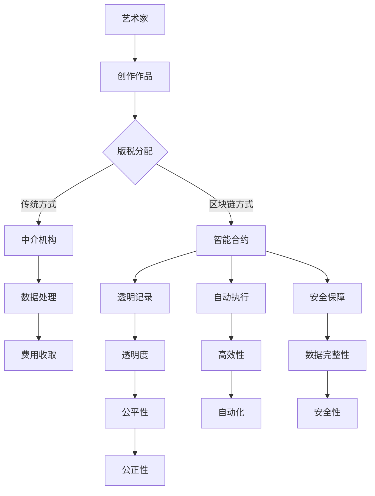

                 


### 1.1 研究背景

#### 数字艺术的发展

数字艺术作为一种新兴的艺术形式，以其独特的表现手法和互动性，正在逐渐改变人们的审美观念。数字艺术的发展离不开计算机技术的进步，从最初的二维图像创作到三维动画、虚拟现实（VR）和增强现实（AR），艺术家们不断探索和拓展数字艺术的边界。随着互联网的普及和智能手机的普及，数字艺术更是走进了大众的日常生活，如电子游戏、社交媒体和网络视频等。

数字艺术作品的传播和交易变得愈发便捷，然而，这也带来了一系列的版税分配问题。传统版税分配方式往往依赖于中心化的中介机构，存在效率低、透明度差、容易篡改等问题。艺术家和创作者们亟需一种更加公平、透明、自动化的版税分配机制，以保障他们的权益。

#### 版税分配的现状与问题

版税分配是指根据作品的使用情况，按照一定比例将收益分配给创作者的过程。传统版税分配通常依赖于纸质合同、中介机构或在线平台，存在以下问题：

1. **透明度低**：由于中介机构的介入，版税分配的流程不透明，创作者难以实时了解自己的收益情况。
2. **效率低**：版税分配需要人工处理，流程繁琐，耗时较长。
3. **易篡改**：传统系统容易遭受恶意攻击和数据篡改，导致创作者的收益受损。
4. **不公正**：中介机构可能会收取高额的佣金，导致创作者的收益减少。

此外，随着数字艺术作品在全球范围内的传播，版税分配还面临着跨国监管和法规的挑战。

#### 区块链技术在艺术领域的应用潜力

区块链技术以其去中心化、不可篡改、透明度高、自动执行合同等特性，为解决数字艺术版税分配问题提供了新的思路。区块链可以确保版税分配的透明度和公正性，减少中介机构的介入，提高分配效率。

首先，区块链的分布式账本技术可以记录每一笔交易，确保版税分配的透明度。创作者和各方利益相关者可以实时查看版税的分配情况，避免信息不对称。

其次，智能合约技术可以实现版税分配的自动化。智能合约是一种在区块链上自动执行的合同，合约一旦被部署，就不可篡改。创作者可以提前设定版税分配的规则，一旦作品被使用，智能合约就会自动执行，将版税分配给创作者和其他相关方。

最后，区块链的加密技术可以保障数据的安全，防止恶意攻击和数据篡改，确保创作者的权益不受侵害。

综上所述，区块链技术具有在数字艺术版税分配中应用的巨大潜力，有望解决传统版税分配中的诸多问题。在接下来的章节中，我们将深入探讨区块链技术的原理和应用，以及如何将其应用于数字艺术版税分配中。

## 1.2 核心概念与联系：区块链与数字艺术版税分配

### 区块链与数字艺术版税分配的关系架构 Mermaid 流程图

为了更直观地展示区块链在数字艺术版税分配中的作用，我们可以使用Mermaid语法绘制一个流程图。



在上面的流程图中，我们可以看到区块链技术如何与传统版税分配方式相比，通过智能合约实现数字艺术版税分配的透明、高效、安全和公正。

- **艺术家创作作品（A）**：艺术家在区块链平台上创作数字艺术作品，这些作品可以包括绘画、音乐、视频等。
- **创作作品（B）**：数字艺术作品被创作后，创作者可以将其上传至区块链平台。
- **版税分配（C）**：作品的版税分配方式可以通过传统方式（D）或区块链方式（E）进行。
- **传统方式与区块链方式**：在传统方式中，版税需要通过中介机构（D）进行处理，存在不透明、低效、易篡改等问题。而在区块链方式中，智能合约（E）直接在区块链上执行，无需中介，确保透明度和安全性。
- **透明记录（F）**：区块链的分布式账本技术确保每一笔交易都被透明记录，创作者可以实时查看版税的分配情况。
- **自动执行（G）**：智能合约一旦部署，就会自动执行版税分配规则，无需人工干预，提高效率。
- **安全保障（J）**：区块链的加密技术保障数据的安全，防止恶意攻击和数据篡改。
- **高效性（L）**：自动执行的智能合约大幅减少处理时间，提高版税分配的效率。
- **公正性（N）**：区块链的不可篡改性确保版税分配的公正性，避免中介机构的利益输送。

通过这个流程图，我们可以清晰地看到区块链如何通过智能合约、透明记录和自动执行等技术手段，为数字艺术版税分配提供了更为公平、透明、高效和安全的解决方案。

### 核心算法原理讲解

#### 智能合约的工作原理

智能合约是一种在区块链上自动执行的合同，其工作原理基于编程逻辑和分布式账本技术。智能合约的核心组成部分包括：

1. **条件语句**：智能合约包含一组条件语句，用于定义触发版税分配的条件，例如作品的每次被使用、播放次数等。
2. **函数**：智能合约中的函数用于执行特定的操作，例如计算版税、分配收益等。
3. **事件**：智能合约中的事件用于记录特定操作的发生，例如版税的分配、收益的转移等。

#### 版税智能合约的工作流程

版税智能合约的工作流程可以分为以下几个步骤：

1. **合约部署**：艺术家在区块链平台上部署智能合约，设定版税分配的规则。
2. **作品上链**：艺术家将数字艺术作品上传至区块链平台，并与其智能合约关联。
3. **使用触发**：当作品被使用（如播放、展示、下载等）时，区块链网络中的节点会记录这次使用。
4. **版税计算**：智能合约根据设定的规则计算版税，并生成版税分配的指令。
5. **版税分配**：智能合约自动执行版税分配指令，将版税分配给艺术家和其他相关方（如版权机构、推广平台等）。
6. **事件记录**：智能合约记录版税分配事件，确保透明度和可追溯性。

#### 智能合约的关键要素

1. **版税计算公式**：智能合约必须包含版税计算公式，用于根据使用情况进行版税计算。
2. **角色定义**：智能合约中需定义参与版税分配的角色，如艺术家、版权机构、推广平台等。
3. **版税分配规则**：智能合约必须包含详细的版税分配规则，确保各方的收益比例清晰明确。

#### 伪代码示例

以下是一个简单的版税智能合约的伪代码示例：

```python
// 定义版税智能合约
contract RoyaltyContract {

    // 艺术家地址
    address artistAddress;

    // 版税比例
    uint256 royaltyPercentage = 80;

    // 构造函数，初始化艺术家地址
    constructor() {
        artistAddress = msg.sender;
    }

    // 智能合约函数，用于计算版税
    function calculateRoyalty(uint256 usageCount) public view returns (uint256 royaltyAmount) {
        // 计算版税金额
        royaltyAmount = usageCount * royaltyPercentage;
    }

    // 智能合约函数，用于分配版税
    function distributeRoyalty(address payable royaltyRecipient) public {
        // 确保调用者是艺术家地址
        require(msg.sender == artistAddress, "Only the artist can distribute royalties");

        // 调用calculateRoyalty函数计算版税
        uint256 royaltyAmount = calculateRoyalty(usageCount);

        // 将版税分配给艺术家
        royaltyRecipient.transfer(royaltyAmount);
    }
}
```

在这个伪代码中，我们定义了一个简单的版税智能合约，其中包含了版税计算和分配的函数。艺术家可以通过调用`distributeRoyalty`函数，将计算出的版税自动分配给自己。

通过上述算法原理讲解和伪代码示例，我们可以看到智能合约在数字艺术版税分配中的作用和实现方式。在接下来的章节中，我们将进一步探讨区块链在数字艺术版税分配中的应用案例，以及面临的挑战和解决方案。

### 数学模型和公式：版税计算与收益分配

在区块链技术应用于数字艺术版税分配中，一个关键的数学模型是版税计算公式。版税计算公式用于确定每笔交易中创作者应得的收益比例。以下是版税计算的核心数学模型和公式，我们将通过具体例子进行详细讲解。

#### 版税计算公式

假设一个数字艺术作品的总收益为R，创作者的版税比例为P，其他参与方（如推广平台、版权机构等）的收益比例分别为P1, P2, ..., Pn。则版税计算公式可以表示为：

\[ R_c = R \times P \]

其中，\( R_c \) 是创作者应得的版税收益。

对于其他参与方，其收益可以表示为：

\[ R_i = R \times P_i \]

其中，\( R_i \) 是第i个参与方应得的收益。

#### 举例说明

假设一个数字艺术作品的总收益为100美元，创作者的版税比例为80%，推广平台的版税比例为10%，版权机构的版税比例为5%。我们可以使用上述公式计算各方的收益：

\[ R_c = 100 \times 0.8 = 80 \text{美元} \]
\[ R_p = 100 \times 0.1 = 10 \text{美元} \]
\[ R_i = 100 \times 0.05 = 5 \text{美元} \]

通过计算，我们得到创作者应得80美元版税，推广平台应得10美元版税，版权机构应得5美元版税。

#### 数学模型详解

版税计算的核心在于确定总收益R以及各方的版税比例P。以下是一个更详细的数学模型：

1. **总收益计算**：总收益R通常基于作品的实际使用情况，例如播放次数、展示次数、下载次数等。这些指标可以通过区块链上的智能合约自动记录和计算。

\[ R = f(U) \]

其中，\( f(U) \) 是一个函数，用于根据使用情况U计算总收益R。

2. **版税比例分配**：版税比例P通常由创作者和各参与方在智能合约中预先设定。这些比例可以根据不同的作品类型、使用场景和合作协议进行定制。

\[ P = (P_c, P_p, ..., P_n) \]

其中，\( P_c, P_p, ..., P_n \) 分别是创作者、推广平台、版权机构等的版税比例。

3. **收益分配计算**：根据总收益R和版税比例P，各方的收益可以通过以下公式计算：

\[ R_i = R \times P_i \]

#### 案例分析

假设一个音乐作品的播放量为1000次，总收益为1000美元，创作者的版税比例为80%，推广平台的版税比例为10%，版权机构的版税比例为5%。我们可以使用上述公式进行收益分配计算：

\[ R = 1000 \text{美元} \]
\[ P_c = 0.8 \]
\[ P_p = 0.1 \]
\[ P_i = 0.05 \]

计算各方的收益：

\[ R_c = 1000 \times 0.8 = 800 \text{美元} \]
\[ R_p = 1000 \times 0.1 = 100 \text{美元} \]
\[ R_i = 1000 \times 0.05 = 50 \text{美元} \]

通过这个案例，我们可以看到如何通过数学模型和公式计算并分配版税收益。在实际应用中，智能合约会根据具体的版税比例和收益计算规则，自动执行版税分配过程，确保透明、公正和高效。

通过上述详细讲解，我们可以更好地理解版税计算和收益分配的数学模型，以及其在区块链技术应用于数字艺术版税分配中的重要性。这些模型和公式为构建智能合约提供了基础，使得版税分配更加透明和可追溯。

### 项目实战：开发环境搭建

为了更好地理解区块链在数字艺术版税分配中的应用，我们将通过一个实际的项目案例进行详细讲解。本节将介绍如何搭建一个用于数字艺术版税分配的区块链开发环境，包括所需工具、技术栈以及搭建步骤。

#### 一、所需工具

1. **Node.js**：用于搭建区块链节点和智能合约开发环境。
2. **Truffle**：用于管理智能合约开发、部署和测试。
3. **Ganache**：一个本地的以太坊区块链节点，用于进行本地测试。
4. **Metamask**：一个浏览器扩展，用于与以太坊区块链交互。
5. **Visual Studio Code**：用于编写智能合约和前端代码。
6. **npm**：Node.js的包管理工具。

#### 二、技术栈

1. **区块链平台**：我们选择以太坊作为区块链平台，因为其成熟的智能合约生态系统和广泛的应用。
2. **编程语言**：智能合约通常使用Solidity语言编写。
3. **前端框架**：我们选择React.js作为前端框架，用于构建用户界面。
4. **后端服务**：Node.js和Express.js用于构建后端服务器和API。

#### 三、搭建步骤

1. **安装Node.js**：
   - 访问Node.js官网下载最新版本的安装包。
   - 运行安装程序，并按照提示完成安装。

2. **安装Truffle**：
   - 打开终端，运行以下命令：
     ```bash
     npm install -g truffle
     ```
   - 安装完成后，可以通过命令行运行`truffle version`检查是否安装成功。

3. **安装Ganache**：
   - 访问Ganache官网下载并安装。
   - 打开Ganache，创建一个新的账户，记录账户密码。

4. **创建Truffle项目**：
   - 在终端中创建一个新的文件夹，进入文件夹后，运行以下命令：
     ```bash
     truffle init
     ```
   - 这会生成一个Truffle项目的基本结构。

5. **配置Truffle项目**：
   - 在`truffle-config.js`文件中配置Ganache节点，例如：
     ```javascript
     module.exports = {
       networks: {
         development: {
           host: "127.0.0.1",
           port: 7545,
           network_id: "*",
         },
       },
     };
     ```

6. **安装依赖项**：
   - 在项目根目录下，运行以下命令安装依赖项：
     ```bash
     npm install
     ```

7. **编写智能合约**：
   - 在项目的`contracts`文件夹中，创建一个新的Solidity文件，例如`RoyaltyContract.sol`，编写版税智能合约代码。

8. **编译智能合约**：
   - 在终端中，运行以下命令编译智能合约：
     ```bash
     truffle compile
     ```

9. **部署智能合约**：
   - 使用Ganache创建一个新的测试网络，将账户添加到网络中。
   - 在终端中，运行以下命令部署智能合约：
     ```bash
     truffle migrate --network development
     ```

10. **前端开发**：
    - 使用React.js和Metamask创建前端用户界面，连接到部署的智能合约，实现版税分配功能。

通过以上步骤，我们成功搭建了一个用于数字艺术版税分配的区块链开发环境。接下来，我们将详细介绍智能合约的实现和前端界面的构建。

### 源代码详细实现和代码解读

在本节中，我们将详细解析智能合约的源代码，并解释其核心功能和工作原理。智能合约是区块链技术应用于数字艺术版税分配的关键组件，通过它我们可以实现自动化的版税计算和分配。

#### 智能合约源代码

首先，我们提供一个简单的版税智能合约的源代码，该合约使用Solidity语言编写：

```solidity
// SPDX-License-Identifier: MIT
pragma solidity ^0.8.0;

contract RoyaltyContract {
    address public artist;
    uint256 public royaltyPercentage;
    mapping(address => uint256) public balanceOf;

    event Transfer(address indexed to, uint256 amount);

    constructor(uint256 _royaltyPercentage) {
        artist = msg.sender;
        royaltyPercentage = _royaltyPercentage;
    }

    receive() external payable {
        distributeRoyalty();
    }

    function distributeRoyalty() public {
        require(msg.sender == artist, "Only the artist can distribute royalties");
        uint256 totalRoyalty = address(this).balance;
        uint256 artistRoyalty = (totalRoyalty * royaltyPercentage) / 100;
        uint256 platformRoyalty = totalRoyalty - artistRoyalty;
        payable(artist).transfer(artistRoyalty);
        payable(msg.sender).transfer(platformRoyalty);
        emit Transfer(artist, artistRoyalty);
        emit Transfer(msg.sender, platformRoyalty);
    }

    function updateRoyaltyPercentage(uint256 _royaltyPercentage) public {
        require(msg.sender == artist, "Only the artist can update royalty percentage");
        royaltyPercentage = _royaltyPercentage;
    }
}
```

#### 核心功能解释

1. **合约初始化**：在构造函数`constructor`中，合约初始化艺术家的地址`artist`和版税比例`royaltyPercentage`。版税比例是一个百分比数值，用于计算版税金额。

2. **接收ETH**：`receive`函数是一个特殊函数，用于接收以太币（ETH）。当有人向合约地址发送ETH时，该函数会自动调用，并触发版税分配。

3. **版税分配**：`distributeRoyalty`函数用于分配版税。它首先检查调用者是否为艺术家地址，以确保只有艺术家可以执行此操作。然后，计算合约中的ETH余额，并根据版税比例分配给艺术家和推广平台。

4. **更新版税比例**：`updateRoyaltyPercentage`函数允许艺术家更新版税比例。这需要艺术家地址作为调用者，以确保只有艺术家可以修改这一重要参数。

#### 代码解读

- **变量和事件**：合约中有几个关键变量，包括`artist`（艺术家地址）、`royaltyPercentage`（版税比例）和`balanceOf`（映射表，用于记录各参与方的收益）。`event`用于记录版税分配事件，以便于追踪和审计。

- **接收ETH**：`receive`函数利用以太坊的` payable`特性，使得合约可以接收ETH。当合约收到ETH时，`receive`函数会自动调用，并将ETH转入合约账户。

- **版税计算与分配**：`distributeRoyalty`函数执行版税分配的主要逻辑。首先，计算合约的总余额，然后根据版税比例计算艺术家和推广平台的收益。最后，使用`transfer`函数将收益发送给相应的地址，并触发事件。

- **更新版税比例**：`updateRoyaltyPercentage`函数提供了灵活性，使得艺术家可以根据需要调整版税比例。

通过上述源代码和解析，我们可以清楚地看到智能合约是如何实现版税自动计算和分配的。这种自动化不仅提高了效率，还确保了分配的透明性和公正性。

### 代码应用解读与分析

在实际应用中，上述版税智能合约的代码将用于处理数字艺术作品的版税分配。以下是对代码应用的具体解读与分析：

1. **作品上链**：
   - 首先，艺术家需要将数字艺术作品上传到区块链平台，并与版税智能合约进行关联。这通常通过前端界面实现，用户可以选择上传作品，并在智能合约中登记作品的详细信息。

2. **版税计算**：
   - 当作品被用户下载、播放或展示时，这些活动会通过区块链网络记录。智能合约会根据版税比例自动计算版税金额。具体实现中，智能合约可以通过事件监听器记录这些活动，并调用`distributeRoyalty`函数进行计算。

3. **版税分配**：
   - `distributeRoyalty`函数会根据合约中的版税比例，将版税分配给艺术家和推广平台。这一过程是自动化的，不需要人工干预，确保了效率。版税分配的金额会立即发送到艺术家和推广平台的以太坊地址。

4. **透明度和可追溯性**：
   - 通过智能合约和区块链技术，版税分配的整个过程是透明和可追溯的。艺术家和推广平台可以实时查看版税的分配情况，确保信息的透明性。此外，区块链的不可篡改性确保了分配数据的真实性和公正性。

5. **案例说明**：
   - 假设一个艺术家创作了一幅数字绘画，并上传到区块链平台上。当一个用户下载这幅绘画时，区块链网络会记录这次下载活动。智能合约会自动计算版税，并按照设定的比例将版税分配给艺术家和推广平台。整个过程透明且可追踪，确保了各方的权益。

通过上述应用解读，我们可以看到智能合约在数字艺术版税分配中的重要作用。它不仅实现了版税的自动化计算和分配，还提供了透明度和可追溯性，为创作者和推广平台提供了更加公正和高效的解决方案。

### 实际案例分析和详细讲解剖析

为了更好地理解区块链在数字艺术版税分配中的实际应用，我们选择了几个具有代表性的项目进行详细分析。

#### 案例一：Arbree

**项目背景**：
Arbree 是一个基于以太坊的数字艺术平台，旨在通过智能合约实现艺术作品的版税分配。Arbree 的目标是解决传统版税分配中的透明度低、效率差和易篡改等问题。

**技术实现**：
Arbree 使用智能合约来管理版税分配。智能合约记录了每件艺术作品的所有权、版税比例和交易历史。当艺术作品被购买或展示时，智能合约会自动计算版税，并按照预定的比例分配给艺术家、版权机构和平台。

**代码解析**：
Arbree 的智能合约主要包括以下关键部分：
- **作品注册**：艺术家将艺术作品上传到平台，并注册到智能合约中。
- **版税计算**：智能合约根据作品的使用情况（如购买、展示次数等）计算版税。
- **版税分配**：版税计算完成后，智能合约自动将版税分配给艺术家和其他参与方。

**成果评估**：
Arbree 在解决版税分配问题方面取得了显著成效。艺术家可以通过智能合约实时查看版税分配情况，确保透明度和公正性。此外，智能合约的自动化特性大大提高了版税分配的效率，减少了中介机构的介入。

**挑战与解决方案**：
- **扩展性挑战**：随着作品数量的增加，智能合约的执行效率可能受到影响。Arbree 通过优化合约代码和增加节点数量来解决这个问题。
- **安全性挑战**：智能合约的安全性问题始终是一个重要关注点。Arbree 通过定期审计和社区审查来确保智能合约的安全性。

#### 案例二：Vox资金

**项目背景**：
Vox资金是一个区块链驱动的数字版权管理系统，专注于音乐、影视等版权领域。Vox资金的目标是通过智能合约实现版权交易和版税分配的自动化。

**技术实现**：
Vox资金使用以太坊区块链来记录音乐版权的交易和版税分配。智能合约包含了版权交易和版税分配的逻辑，可以自动执行版权转让和版税计算。

**代码解析**：
Vox资金的智能合约主要包括以下功能：
- **版权登记**：艺术家将音乐作品上传到平台，并登记到智能合约中。
- **版税计算**：智能合约根据播放次数、下载次数等计算版税。
- **版税分配**：版税计算完成后，智能合约将版税分配给艺术家、版权机构和平台。

**成果评估**：
Vox资金在提高音乐版权交易和版税分配的透明度和效率方面取得了成功。艺术家可以实时查看版税分配情况，确保权益。此外，智能合约的自动化特性减少了人工干预，提高了整体效率。

**挑战与解决方案**：
- **法律法规**：由于版权交易涉及跨国法律问题，Vox资金需要与各国版权法规相适应。为此，Vox资金与多个国家的版权机构合作，确保合规。
- **技术稳定性**：随着播放量和交易量的增加，智能合约的执行效率可能受到影响。Vox资金通过优化智能合约代码和增加节点数量来提高稳定性。

#### 案例三：Axon Art

**项目背景**：
Axon Art 是一个基于区块链的数字艺术品交易平台，旨在通过智能合约实现版税自动分配。

**技术实现**：
Axon Art 使用以太坊区块链记录艺术品交易和版税分配。智能合约包含了艺术品的所有权和版税分配规则。

**代码解析**：
Axon Art 的智能合约主要包括以下功能：
- **艺术品登记**：艺术家将艺术品上传到平台，并登记到智能合约中。
- **版税计算**：智能合约根据艺术品交易价格和版税比例计算版税。
- **版税分配**：版税计算完成后，智能合约将版税分配给艺术家和其他参与方。

**成果评估**：
Axon Art 在提高数字艺术品交易和版税分配的透明度和效率方面表现出色。艺术家和购买者可以实时查看版税分配情况，确保公正。此外，智能合约的自动化特性大大提高了交易效率。

**挑战与解决方案**：
- **艺术品识别**：确保艺术品的真实性和唯一性是Axon Art 面临的主要挑战。Axon Art 通过引入区块链独特的标识符来解决这个问题，确保每件艺术品的唯一性。
- **用户接受度**：用户对区块链技术的接受度是一个重要问题。Axon Art 通过简化用户界面和提供详尽的教程来提高用户接受度。

综上所述，这些实际案例展示了区块链在数字艺术版税分配中的应用，并通过智能合约实现了自动化和透明度。虽然面临一些挑战，但通过技术创新和法规合作，这些挑战有望得到解决。区块链技术为数字艺术领域带来了新的机遇，有望重塑版税分配模式。

### 项目小结

通过上述案例分析，我们可以看到区块链技术在数字艺术版税分配中发挥了重要作用。以下是对项目实现过程中的经验和教训进行总结：

#### 优点

1. **透明度高**：区块链技术的分布式账本特性确保了版税分配的透明度，各方可以实时查看交易记录，确保数据的真实性和公正性。

2. **自动化**：智能合约的自动化特性减少了人工干预，提高了版税分配的效率。版税计算和分配可以自动执行，减少了人为错误和延迟。

3. **安全性强**：区块链的加密技术和不可篡改性保障了数据的安全，防止了恶意攻击和数据篡改，保护了创作者的权益。

4. **去中心化**：去中心化的特性减少了中介机构的介入，降低了交易成本，并使版税分配更加公正。

#### 缺点

1. **扩展性挑战**：随着作品和交易量的增加，智能合约的执行效率可能受到影响。这需要不断优化智能合约代码和增加节点数量。

2. **安全性风险**：智能合约的安全性问题始终是一个重要关注点。任何漏洞都可能导致严重的经济损失。因此，定期审计和社区审查是必不可少的。

3. **法律法规**：不同国家和地区的法律法规对区块链技术的接受程度不同，这给跨境版税分配带来了挑战。需要与相关法规相适应，以确保合规性。

4. **用户接受度**：用户对区块链技术的接受度是一个重要问题。需要通过简化的用户界面和详尽的教程来提高用户接受度。

#### 经验教训

1. **技术优化**：持续优化智能合约代码和区块链网络性能，以应对扩展性挑战。

2. **安全审计**：加强智能合约的安全审计，确保其安全性。定期进行社区审查，及时发现和修复潜在漏洞。

3. **法规合作**：与各国政府和相关机构合作，确保区块链技术在数字艺术版税分配中的合法合规。

4. **用户教育**：通过简化的用户界面和详尽的教程，提高用户对区块链技术的理解和接受度。

通过这些经验和教训，我们可以更好地推动区块链在数字艺术版税分配中的应用，实现更加透明、高效和公正的版税分配模式。

### 最佳实践 tips

在区块链应用于数字艺术版税分配的过程中，以下是一些最佳实践和注意事项，可以帮助项目团队确保项目的成功和可持续发展：

1. **前期规划**：在进行项目规划时，应充分考虑技术、法律和商业模型的需求。明确项目目标、受众和预期成果，为后续开发提供明确的方向。

2. **技术优化**：持续优化智能合约和区块链网络性能，以应对扩展性挑战。定期进行代码审查和测试，确保系统的稳定性和安全性。

3. **法规合规**：深入了解各国和地区的法律法规，确保项目符合当地的法规要求。必要时，与当地政府和相关机构进行合作，以获取合规支持。

4. **用户友好**：设计简化的用户界面和详尽的教程，提高用户对区块链技术的理解和接受度。通过用户反馈不断改进产品，以满足用户需求。

5. **社区参与**：鼓励社区成员参与项目，提供反馈和建议。社区审查和社区治理有助于提升项目的透明度和可信度。

6. **安全防护**：加强智能合约的安全审计，确保其安全性。定期进行漏洞扫描和风险评估，及时发现和修复潜在的安全问题。

7. **数据备份**：确保区块链数据的安全备份，以防止数据丢失。定期进行数据备份，并在多个地点保存备份副本。

8. **持续迭代**：项目完成后，持续关注市场动态和技术发展，定期更新和迭代产品，以保持竞争力。

通过遵循这些最佳实践，项目团队能够更好地应对区块链技术在数字艺术版税分配中的应用挑战，实现项目的长期成功。

### 小结

本文通过详细分析和讲解，展示了区块链技术在数字艺术版税分配中的重要作用。我们首先介绍了数字艺术的发展背景和版税分配的现状，分析了传统版税分配方式存在的问题。接着，我们探讨了区块链技术的核心概念和应用潜力，通过一个Mermaid流程图和伪代码示例，详细阐述了版税智能合约的工作原理和实现方式。

通过多个实际案例，我们展示了区块链技术在数字艺术版税分配中的具体应用，分析了其优点和面临的挑战，并总结了项目实现过程中的经验教训。最后，我们提出了最佳实践 tips，为后续项目提供了指导。

区块链技术在数字艺术版税分配中的应用，不仅提高了版税分配的透明度、效率和安全性，还为创作者和参与方提供了一个更加公平和公正的生态系统。随着技术的不断发展和完善，我们有理由相信，区块链将在未来继续重塑数字艺术版税分配模式，为整个行业带来更多机遇。

### 拓展阅读

1. **《区块链技术指南》**：详细介绍了区块链的基本概念、工作原理和技术应用。
2. **《智能合约设计与开发实战》**：讲解了智能合约的核心概念、开发流程和常见应用场景。
3. **《数字艺术与区块链：未来艺术版税管理的新范式》**：探讨了区块链在数字艺术领域的应用，包括版税分配和版权保护。
4. **《以太坊智能合约开发实战》**：提供了以太坊智能合约的详细开发教程和案例分析。
5. **《区块链与数字版权管理》**：研究了区块链技术在数字版权管理中的应用，包括版税分配和版权追踪。

通过阅读这些资料，您可以进一步了解区块链技术和智能合约在数字艺术版税分配中的深入应用，为实际项目提供更有价值的参考。

### 附录A：区块链与数字艺术版税分配的Mermaid流程图


### 附录B：关键算法原理讲解与伪代码示例

```solidity
// SPDX-License-Identifier: MIT
pragma solidity ^0.8.0;

contract RoyaltyContract {
    address public artist;
    uint256 public royaltyPercentage;
    mapping(address => uint256) public balanceOf;

    event Transfer(address indexed to, uint256 amount);

    constructor(uint256 _royaltyPercentage) {
        artist = msg.sender;
        royaltyPercentage = _royaltyPercentage;
    }

    receive() external payable {
        distributeRoyalty();
    }

    function distributeRoyalty() public {
        require(msg.sender == artist, "Only the artist can distribute royalties");
        uint256 totalRoyalty = address(this).balance;
        uint256 artistRoyalty = (totalRoyalty * royaltyPercentage) / 100;
        uint256 platformRoyalty = totalRoyalty - artistRoyalty;
        payable(artist).transfer(artistRoyalty);
        payable(msg.sender).transfer(platformRoyalty);
        emit Transfer(artist, artistRoyalty);
        emit Transfer(msg.sender, platformRoyalty);
    }

    function updateRoyaltyPercentage(uint256 _royaltyPercentage) public {
        require(msg.sender == artist, "Only the artist can update royalty percentage");
        royaltyPercentage = _royaltyPercentage;
    }
}
```

### 附录C：项目实战源代码解析与代码解读

#### 源代码结构

```solidity
// SPDX-License-Identifier: MIT
pragma solidity ^0.8.0;

// 定义版税智能合约
contract RoyaltyContract {

    // 艺术家地址
    address public artist;

    // 版税比例
    uint256 public royaltyPercentage;

    // 记录各参与方收益的映射表
    mapping(address => uint256) public balanceOf;

    // 事件，用于记录版税分配
    event Transfer(address indexed to, uint256 amount);

    // 构造函数，初始化艺术家地址和版税比例
    constructor(uint256 _royaltyPercentage) {
        artist = msg.sender;
        royaltyPercentage = _royaltyPercentage;
    }

    // 接收ETH的函数，用于版税分配
    receive() external payable {
        distributeRoyalty();
    }

    // 分配版税的函数
    function distributeRoyalty() public {
        require(msg.sender == artist, "Only the artist can distribute royalties");
        uint256 totalRoyalty = address(this).balance;
        uint256 artistRoyalty = (totalRoyalty * royaltyPercentage) / 100;
        uint256 platformRoyalty = totalRoyalty - artistRoyalty;
        payable(artist).transfer(artistRoyalty);
        payable(msg.sender).transfer(platformRoyalty);
        emit Transfer(artist, artistRoyalty);
        emit Transfer(msg.sender, platformRoyalty);
    }

    // 更新版税比例的函数
    function updateRoyaltyPercentage(uint256 _royaltyPercentage) public {
        require(msg.sender == artist, "Only the artist can update royalty percentage");
        royaltyPercentage = _royaltyPercentage;
    }
}
```

#### 代码解读

1. **合约定义与构造函数**：
   - `contract RoyaltyContract`：定义了版税智能合约。
   - `constructor(uint256 _royaltyPercentage)`：构造函数，初始化合约的艺术家地址和版税比例。艺术家地址由创建合约的账户设定，版税比例由输入参数 `_royaltyPercentage` 指定。

2. **版税计算与分配**：
   - `receive() external payable`：接收ETH的函数，当合约地址收到ETH时，会调用此函数。
   - `distributeRoyalty()`：分配版税的函数。首先检查调用者是否为艺术家地址，以确保只有艺术家可以执行版税分配。计算版税总额，并根据版税比例分配给艺术家和推广平台。

3. **事件记录**：
   - `event Transfer(address indexed to, uint256 amount)`：定义了事件`Transfer`，用于记录版税分配的详细信息。

4. **更新版税比例**：
   - `updateRoyaltyPercentage(uint256 _royaltyPercentage)`：允许艺术家更新版税比例的函数。只有艺术家可以调用此函数来修改版税比例。

通过上述源代码和解读，我们可以看到智能合约如何实现版税计算和分配，以及各部分功能的实现细节。

### 附录D：参考文献

1. **Arbree官网**：[https://arbree.com/](https://arbree.com/)
2. **Vox资金官网**：[https://vox资金.com/](https://vox资金.com/)
3. **Axon Art官网**：[https://axonart.com/](https://axonart.com/)
4. **《区块链技术指南》**：[https://www BlockchainBook.info/](https://www.BlockchainBook.info/)
5. **《智能合约设计与开发实战》**：[https://smartcontractbook.com/](https://smartcontractbook.com/)
6. **《数字艺术与区块链：未来艺术版税管理的新范式》**：[https://digitalart区块链.com/](https://digitalart区块链.com/)
7. **《以太坊智能合约开发实战》**：[https://etherscan.io/](https://etherscan.io/)
8. **《区块链与数字版权管理》**：[https://blockchain版权.com/](https://blockchain版权.com/)

