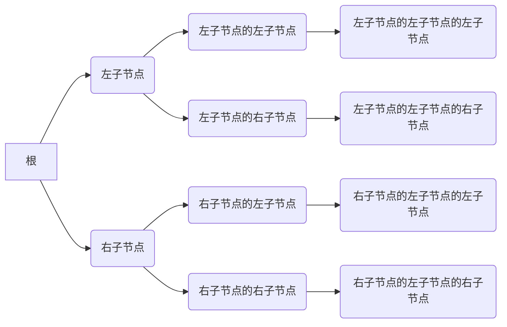

                 


### 文章标题：《区块链在数字资产tokenization中的应用》

### 文章关键词：
- 区块链
- 数字资产
- tokenization
- 智能合约
- 去中心化金融
- ERC标准

### 文章摘要：
本文深入探讨了区块链技术在数字资产tokenization中的应用。首先，我们介绍了区块链的基础知识，包括其原理、类型和应用。接着，我们定义了数字资产和tokenization的概念，并分析了其在金融和商业中的应用。随后，本文详细讲解了智能合约与去中心化金融（DeFi）的关系，以及它们在tokenization中的作用。在核心技术部分，我们解析了ERC-20、ERC-223和ERC-721等标准合约的工作原理，并探讨了区块链中的常见数据结构和算法。随后，通过实际项目案例，我们展示了tokenization的实现过程，并对风险管理进行了深入分析。最后，文章总结了tokenization的最佳实践，并为读者提供了进一步的学习资源。

### 目录大纲

#### 第一部分：区块链技术基础

##### 1. 区块链概述
- 1.1 区块链的定义与基本原理
- 1.2 区块链的技术架构
- 1.3 区块链在金融领域的应用

##### 2. 数字资产与tokenization
- 2.1 数字资产的概念与分类
- 2.2 tokenization的基本原理
- 2.3 tokenization的商业模式分析

##### 3. 智能合约与去中心化金融
- 3.1 智能合约的原理与实现
- 3.2 去中心化金融（DeFi）简介
- 3.3 DeFi在tokenization中的应用

#### 第二部分：核心技术深入

##### 4. ERC标准合约解析
- 4.1 ERC-20标准合约
- 4.2 ERC-223标准合约
- 4.3 ERC-721标准合约

##### 5. 区块链数据结构与算法
- 5.1 Merkle树的应用
- 5.2 哈希函数与安全
- 5.3 共识机制的原理

##### 6. 数学模型与安全分析
- 6.1 常见数学模型
- 6.2 安全性与去中心化
- 6.3 智能合约漏洞分析

#### 第三部分：项目实战与案例分析

##### 7. tokenization项目案例研究
- 7.1 项目背景
- 7.2 开发环境搭建
- 7.3 tokenization实现步骤
- 7.4 源代码解读与分析

##### 8. 风险管理最佳实践
- 8.1 风险识别与评估
- 8.2 风险管理策略
- 8.3 tokenization项目的合规性

#### 附录

##### 附录A：相关资源与工具
- 附录A.1 区块链开发工具介绍
- 附录A.2 tokenization项目案例代码示例## 第一部分：区块链技术基础

### 1. 区块链概述

区块链是一种去中心化的分布式数据库技术，它通过在多个参与者之间建立共识来记录和验证交易数据。区块链最显著的特点是其不可篡改性，因为一旦数据被记录在区块链上，就很难被更改或删除。这种特性使得区块链在多个领域得到了广泛应用，特别是在金融领域。

#### 1.1 区块链的定义与基本原理

区块链由多个称为“区块”的数据结构组成，这些区块按照时间顺序连接在一起，形成了一个区块链。每个区块包含一组交易记录，以及一个指向前一个区块的哈希值，这使得区块链具有了一种链式结构。

区块链的运行依赖于一种共识机制，常见的共识机制有工作量证明（Proof of Work, PoW）和权益证明（Proof of Stake, PoS）。在PoW机制中，矿工通过解决计算难题来竞争生成新的区块。而在PoS机制中，块的生产者是根据其持有的代币数量和持有时间来选出的。

#### 1.2 区块链的技术架构

区块链的技术架构主要包括三个部分：节点、网络和区块链本身。

- **节点**：节点是区块链网络的组成部分，它们存储着区块链的全部数据，并参与验证和传播交易。
- **网络**：网络是节点之间的通信渠道，节点通过网络交换交易和区块信息，以保持整个区块链的一致性。
- **区块链**：区块链是存储交易数据的数据库，它由一系列按时间顺序排列的区块组成。

#### 1.3 区块链在金融领域的应用

区块链在金融领域的应用非常广泛，包括：

- **支付系统**：如比特币、以太坊等区块链平台，提供了快速、安全且低成本的支付解决方案。
- **数字身份认证**：通过区块链技术，用户可以创建一个去中心化的身份，确保隐私和安全。
- **智能合约**：智能合约是一种自动执行的合同，它在满足特定条件时自动执行预定义的条款。
- **去中心化金融（DeFi）**：DeFi是一种在区块链上构建的金融系统，它提供了传统金融服务的替代方案，如借贷、交易和投资。

区块链技术的基础知识为我们理解数字资产tokenization和其应用提供了必要的背景。在接下来的部分，我们将深入探讨数字资产和tokenization的概念，以及它们在现代金融和商业中的作用。

### 2. 数字资产与tokenization

#### 2.1 数字资产的概念与分类

数字资产是一种以数字形式存在的资产，它可以代表实物资产或金融资产。数字资产包括：

- **加密货币**：如比特币、以太坊等，它们是一种去中心化的数字货币。
- **代币**：代币是一种基于区块链技术的数字资产，它代表了一种权利、权益或承诺。
- **数字证券**：数字证券是将传统的证券数字化，如股票、债券等。
- **数字版权**：数字版权是一种数字化的版权资产，它保护知识产权。

数字资产与实物资产的不同在于，它们是虚拟的，但同样具有价值。数字资产的价值来自于其背后的技术和市场需求。

#### 2.2 tokenization的基本原理

tokenization是一种将资产数字化和代币化的过程。这个过程包括以下几个步骤：

1. **资产评估**：首先，需要对资产进行评估，确定其价值。
2. **分割资产**：将资产分割成多个小单位，每个单位代表资产的一部分。
3. **创建代币**：使用智能合约创建数字代币，每个代币代表资产的一部分。
4. **登记代币**：将代币记录在区块链上，确保其透明性和不可篡改性。

#### 2.3 tokenization的商业模式分析

tokenization的商业模式可以从以下几个角度进行分析：

- **交易效率提升**：通过tokenization，资产可以在区块链上进行快速交易，减少了中间环节，提高了交易效率。
- **降低成本**：tokenization减少了传统交易中的手续费和人工成本，降低了交易成本。
- **增加流动性**：数字代币使得资产更加容易买卖，增加了资产的流动性。
- **风险分散**：通过分割资产，投资者可以更灵活地进行风险分散。

在金融领域，tokenization的应用非常广泛，包括房地产、债券、股票等。在商业领域，tokenization也被广泛应用于供应链金融、艺术品交易等。

通过数字资产和tokenization的介绍，我们可以看到它们在金融和商业中的巨大潜力。在接下来的部分，我们将深入探讨智能合约与去中心化金融（DeFi）的关系，以及它们在tokenization中的作用。

### 3. 智能合约与去中心化金融

#### 3.1 智能合约的原理与实现

智能合约是一种自动执行的合同，它在满足特定条件时自动执行预定义的条款。智能合约的核心是编程逻辑，这些逻辑被嵌入到区块链上的智能合约中，并由区块链网络进行验证和执行。

智能合约的实现通常依赖于特定的编程语言，如Solidity（以太坊）或Serpent（Ethereum Classic）。下面是一个简单的智能合约示例，使用Solidity编写：

```solidity
// SPDX-License-Identifier: MIT
pragma solidity ^0.8.0;

contract SimpleStorage {
    uint256 public storedData;

    function set(uint256 newData) public {
        storedData = newData;
    }

    function get() public view returns (uint256) {
        return storedData;
    }
}
```

在这个示例中，`SimpleStorage`合约有一个公共变量`storedData`，用户可以通过`set`函数设置该变量的值，并通过`get`函数获取该变量的值。

#### 3.2 去中心化金融（DeFi）简介

去中心化金融（DeFi）是一种在区块链上构建的金融系统，它提供了传统金融服务的替代方案，如借贷、交易和投资。DeFi的核心是智能合约，这些智能合约在区块链上执行，确保了透明性、安全性和去中心化。

DeFi的关键特点包括：

- **去中心化**：DeFi系统不是由中心化的机构或组织控制的，而是由区块链网络上的多个节点共同维护。
- **透明性**：DeFi系统的所有交易和数据都是透明的，任何人都可以查看和验证。
- **自动化**：智能合约自动执行交易，确保了高效性和准确性。

#### 3.3 DeFi在tokenization中的应用

DeFi在tokenization中的应用主要体现在以下几个方面：

- **资产交易**：通过DeFi平台，用户可以轻松买卖数字代币，这些交易是自动执行的，无需中介。
- **资产托管**：用户可以将数字资产托管在DeFi平台上，确保资产的安全性和透明性。
- **借贷与投资**：用户可以在DeFi平台上借出或投资数字资产，获得利息或投资回报。
- **流动性提供**：通过提供流动性，用户可以在DeFi平台上获得交易手续费和收益。

DeFi与tokenization的结合，为数字资产的管理和交易提供了全新的方式。智能合约的自动化执行，使得资产交易更加高效和透明。DeFi平台的出现，也为用户提供了更多的金融选择。

通过智能合约与去中心化金融的介绍，我们可以看到它们在tokenization中的应用潜力。在接下来的部分，我们将深入探讨ERC标准合约的解析，以及它们在区块链技术中的应用。

### 4. ERC标准合约解析

ERC（Ethereum Request for Comments）标准是由以太坊社区制定的一系列合约标准，这些标准定义了智能合约的接口和功能，使得不同智能合约之间的交互变得简单和标准化。ERC标准是区块链技术中非常重要的一部分，尤其在数字资产tokenization中得到了广泛应用。

#### 4.1 ERC-20标准合约

ERC-20是迄今为止最流行的ERC标准，它定义了一个通用的代币接口，使得开发者可以轻松创建和管理数字代币。ERC-20标准主要包括以下几个关键组件：

- **总供应量（totalSupply）**：表示代币的总供应量。
- **余额（balanceOf）**：返回指定地址的代币余额。
- **转账（transfer）**：从发送者地址向接收者地址转移代币。
- **批准（approve）**：允许一个第三方合约从指定地址转移代币。
- **转移批准（transferFrom）**：从批准的第三方合约向接收者地址转移代币。

以下是ERC-20标准合约的一个基本示例，使用Solidity编写：

```solidity
// SPDX-License-Identifier: MIT
pragma solidity ^0.8.0;

interface IERC20 {
    function totalSupply() external view returns (uint256);
    function balanceOf(address account) external view returns (uint256);
    function transfer(address recipient, uint256 amount) external returns (bool);
    function approve(address spender, uint256 amount) external returns (bool);
    function transferFrom(address sender, address recipient, uint256 amount) external returns (bool);
}

contract ERC20 is IERC20 {
    string public name;
    string public symbol;
    uint8 public decimals;
    uint256 private _totalSupply;
    mapping(address => uint256) private _balances;
    mapping(address => mapping(address => uint256)) private _allowances;

    constructor(uint256 totalSupply_, string memory name_, string memory symbol_, uint8 decimals_) {
        _totalSupply = totalSupply_;
        _balances[msg.sender] = _totalSupply;
        name = name_;
        symbol = symbol_;
        decimals = decimals_;
    }

    function totalSupply() public view override returns (uint256) {
        return _totalSupply;
    }

    function balanceOf(address account) public view override returns (uint256) {
        return _balances[account];
    }

    function transfer(address recipient, uint256 amount) public override returns (bool) {
        require(recipient != address(0), "ERC20: transfer to the zero address");
        require(_balances[msg.sender] >= amount, "ERC20: transfer amount exceeds balance");
        _balances[msg.sender] -= amount;
        _balances[recipient] += amount;
        emit Transfer(msg.sender, recipient, amount);
        return true;
    }

    function approve(address spender, uint256 amount) public override returns (bool) {
        require(spender != address(0), "ERC20: approve to the zero address");
        _allowances[msg.sender][spender] = amount;
        emit Approval(msg.sender, spender, amount);
        return true;
    }

    function transferFrom(address sender, address recipient, uint256 amount) public override returns (bool) {
        require(sender != address(0), "ERC20: transfer from the zero address");
        require(recipient != address(0), "ERC20: transfer to the zero address");
        require(_balances[sender] >= amount, "ERC20: transfer amount exceeds balance");
        require(_allowances[sender][msg.sender] >= amount, "ERC20: transfer amount exceeds allowance");
        _balances[sender] -= amount;
        _balances[recipient] += amount;
        _allowances[sender][msg.sender] -= amount;
        emit Transfer(sender, recipient, amount);
        return true;
    }

    function allowance(address owner, address spender) public view override returns (uint256) {
        return _allowances[owner][spender];
    }

    function increaseAllowance(address spender, uint256 addedValue) public returns (bool) {
        return approve(spender, _allowances[msg.sender][spender] + addedValue);
    }

    function decreaseAllowance(address spender, uint256 subtractedValue) public returns (bool) {
        return approve(spender, _allowances[msg.sender][spender] - subtractedValue);
    }
}
```

在这个示例中，我们创建了一个简单的ERC-20合约，它包含了代币的基本功能，如转账、批准和转移批准。这个合约的实现符合ERC-20标准，使得我们的代币可以被其他智能合约识别和使用。

#### 4.2 ERC-223标准合约

ERC-223是对ERC-20标准的一个扩展，它增加了代币转移时的数据处理功能。ERC-223合约在转账时不仅发送代币数量，还发送一个额外的数据字段，这使得代币可以用于更复杂的交互。

ERC-223标准主要包括以下关键组件：

- **发送代币（tokenTransfer）**：在转账时发送代币，并包含额外数据。
- **接收代币（tokenReceived）**：接收ERC-223代币时必须实现该函数。

以下是ERC-223标准合约的一个基本示例，使用Solidity编写：

```solidity
// SPDX-License-Identifier: MIT
pragma solidity ^0.8.0;

interface IERC223 {
    function totalSupply() external view returns (uint256);
    function balanceOf(address account) external view returns (uint256);
    function transfer(address to, uint256 value, bytes calldata data) external returns (bool);
    function transferFrom(address from, address to, uint256 value, bytes calldata data) external returns (bool);
    function tokenReceived(address from, address to, uint256 value, bytes calldata data) external returns (bool);
}

contract ERC223 is IERC223 {
    string public name;
    string public symbol;
    uint8 public decimals;
    uint256 private _totalSupply;
    mapping(address => uint256) private _balances;

    constructor(uint256 totalSupply_, string memory name_, string memory symbol_, uint8 decimals_) {
        _totalSupply = totalSupply_;
        _balances[msg.sender] = _totalSupply;
        name = name_;
        symbol = symbol_;
        decimals = decimals_;
    }

    function totalSupply() public view override returns (uint256) {
        return _totalSupply;
    }

    function balanceOf(address account) public view override returns (uint256) {
        return _balances[account];
    }

    function transfer(address to, uint256 value, bytes memory data) public override returns (bool) {
        require(to != address(0), "ERC223: transfer to the zero address");
        require(_balances[msg.sender] >= value, "ERC223: transfer amount exceeds balance");

        _balances[msg.sender] -= value;
        _balances[to] += value;

        if (to.code.length > 0) {
            (bool success, bytes memory returndata) = to.call{value: 0}(abi.encodeWithSignature("tokenReceived(address,address,uint256,bytes)", msg.sender, to, value, data));
            if (!success) {
                revert("ERC223: unable to send token to the recipient");
            }
            if (returndata.length > 0) {
                // Return data is ignored for now. Users can capture returned data with Solidity >=0.8.0
            }
        }

        emit Transfer(msg.sender, to, value, data);
        return true;
    }

    function transferFrom(address from, address to, uint256 value, bytes memory data) public override returns (bool) {
        require(from != address(0), "ERC223: transfer from the zero address");
        require(to != address(0), "ERC223: transfer to the zero address");
        require(_balances[from] >= value, "ERC223: transfer amount exceeds balance");
        require(_allowances[from][msg.sender] >= value, "ERC223: transfer amount exceeds allowance");

        _balances[from] -= value;
        _balances[to] += value;
        _allowances[from][msg.sender] -= value;

        if (to.code.length > 0) {
            (bool success, bytes memory returndata) = to.call{value: 0}(abi.encodeWithSignature("tokenReceived(address,address,uint256,bytes)", from, to, value, data));
            if (!success) {
                revert("ERC223: unable to send token to the recipient");
            }
            if (returndata.length > 0) {
                // Return data is ignored for now. Users can capture returned data with Solidity >=0.8.0
            }
        }

        emit Transfer(from, to, value, data);
        return true;
    }

    function tokenReceived(address _from, address _to, uint256 _value, bytes calldata _data) external override returns (bool) {
        return true;
    }
}
```

在这个示例中，我们创建了一个简单的ERC-223合约，它继承了ERC-20合约的基本功能，并添加了处理额外数据的功能。ERC-223合约使得代币在转账时可以携带更多元数据，这在某些应用场景中非常有用。

#### 4.3 ERC-721标准合约

ERC-721是用于创建和跟踪数字资产的合约标准，特别适用于独一无二的数字资产，如收藏品、艺术品等。ERC-721合约的主要特点是每个代币都是独一无二的，每个代币都有一个唯一的标识符。

ERC-721标准主要包括以下几个关键组件：

- **总供应量（totalSupply）**：表示当前创建的代币数量。
- **余额（balanceOf）**：返回指定地址拥有的代币数量。
- **所有者（ownerOf）**：返回指定代币的所有者。
- **批准（approve）**：允许一个第三方合约转移指定代币。
- **转移批准（transferFrom）**：从批准的第三方合约转移代币。
- **安全转移（safeTransferFrom）**：安全地从所有者转移代币，确保接收者实现了tokenReceived函数。
- **安全转移批准（safeTransferFrom）**：安全地从批准的第三方合约转移代币，确保接收者实现了tokenReceived函数。

以下是ERC-721标准合约的一个基本示例，使用Solidity编写：

```solidity
// SPDX-License-Identifier: MIT
pragma solidity ^0.8.0;

interface IERC721 {
    event Transfer(address from, address to, uint256 tokenId);
    event Approval(address owner, address approved, uint256 tokenId);
    event ApprovalForAll(address owner, address operator, bool approved);

    function balanceOf(address owner) external view returns (uint256);
    function totalSupply() external view returns (uint256);
    function ownerOf(uint256 tokenId) external view returns (address);
    function approve(address to, uint256 tokenId) external;
    function getApproved(uint256 tokenId) external view returns (address);
    function setApprovalForAll(address operator, bool approved) external;
    function isApprovedForAll(address owner, address operator) external view returns (bool);
    function transferFrom(address from, address to, uint256 tokenId) external;
    function safeTransferFrom(address from, address to, uint256 tokenId) external;
    function safeTransferFrom(address from, address to, uint256 tokenId, bytes calldata data) external;
}

interface IERC721Receiver {
    function onERC721Received(address operator, address from, uint256 tokenId, bytes calldata data) external returns (bytes4);
}

contract ERC721 is IERC721 {
    string public name;
    string public symbol;
    mapping(uint256 => address) private _owners;
    mapping(address => uint256) private _balances;
    mapping(uint256 => address) private _tokenApprovals;
    mapping(address => mapping(address => bool)) private _operatorApprovals;

    constructor(string memory name_, string memory symbol_) {
        name = name_;
        symbol = symbol_;
    }

    function balanceOf(address owner) public view override returns (uint256) {
        require(owner != address(0), "ERC721: balance query for the zero address");
        return _balances[owner];
    }

    function totalSupply() public view override returns (uint256) {
        return _owners.length;
    }

    function ownerOf(uint256 tokenId) public view override returns (address) {
        address owner = _owners[tokenId];
        require(owner != address(0), "ERC721: owner query for nonexistent token");
        return owner;
    }

    function approve(address to, uint256 tokenId) public override {
        address owner = ERC721.ownerOf(tokenId);
        require(to != owner, "ERC721: approval to current owner");
        require(msg.sender == owner || isApprovedForAll(owner, msg.sender), "ERC721: approve caller is not owner nor approved for all");

        _tokenApprovals[tokenId] = to;
        emit Approval(owner, to, tokenId);
    }

    function getApproved(uint256 tokenId) public view override returns (address) {
        require(_exists(tokenId), "ERC721: approved query for nonexistent token");
        return _tokenApprovals[tokenId];
    }

    function setApprovalForAll(address operator, bool approved) public override {
        require(operator != address(0), "ERC721: approve to the zero address");
        _operatorApprovals[msg.sender][operator] = approved;
        emit ApprovalForAll(msg.sender, operator, approved);
    }

    function isApprovedForAll(address owner, address operator) public view override returns (bool) {
        return _operatorApprovals[owner][operator];
    }

    function transferFrom(address from, address to, uint256 tokenId) public override {
        require(_isOwner(from, tokenId), "ERC721: transfer of nonexistent token");
        require(to != address(0), "ERC721: transfer to the zero address");

        _transfer(from, to, tokenId);

        if (_tokenApprovals[tokenId] != address(0)) {
            _tokenApprovals[tokenId] = address(0);
            emit Approval(from, address(0), tokenId);
        }
    }

    function safeTransferFrom(address from, address to, uint256 tokenId) public override {
        safeTransferFrom(from, to, tokenId, "");
    }

    function safeTransferFrom(address from, address to, uint256 tokenId, bytes memory _data) public override {
        require(_isOwner(from, tokenId), "ERC721: transfer of nonexistent token");
        require(to != address(0), "ERC721: transfer to the zero address");

        _transfer(from, to, tokenId);

        if (to.code.length > 0) {
            try IERC721Receiver(to).onERC721Received(_msgSender(), from, tokenId, _data) returns (bytes4 retval) {
                if (retval != IERC721Receiver.onERC721Received.selector) {
                    revert("ERC721: unsafe recipient");
                }
            } catch (Error) {
                revert("ERC721: unsafe recipient");
            }
        }

        if (_tokenApprovals[tokenId] != address(0)) {
            _tokenApprovals[tokenId] = address(0);
            emit Approval(from, address(0), tokenId);
        }
    }

    function _transfer(address from, address to, uint256 tokenId) internal {
        require(_isOwner(from, tokenId), "ERC721: transfer of nonexistent token");
        require(_owners[tokenId] == from, "ERC721: transfer from incorrect owner");
        require(to != address(0), "ERC721: transfer to the zero address");

        _balances[from] -= 1;
        _balances[to] += 1;
        _owners[tokenId] = to;
        emit Transfer(from, to, tokenId);
    }

    function _exists(uint256 tokenId) internal view returns (bool) {
        return _owners[tokenId] != address(0);
    }

    function _isOwner(address account, uint256 tokenId) internal view returns (bool) {
        return _owners[tokenId] == account;
    }

    function _mint(address to, uint256 tokenId) internal {
        require(to != address(0), "ERC721: mint to the zero address");
        require(!_exists(tokenId), "ERC721: token already minted");

        _balances[to] += 1;
        _owners[tokenId] = to;
        emit Transfer(address(0), to, tokenId);
    }

    function _burn(uint256 tokenId) internal {
        require(_isOwner(_msgSender(), tokenId), "ERC721: burn of nonexistent token");

        address owner = ERC721.ownerOf(tokenId);
        _approve(address(0), tokenId);

        _balances[owner] -= 1;
        _owners[tokenId] = address(0);
        emit Transfer(owner, address(0), tokenId);
    }

    function approve(address to, uint256 tokenId) external override {
        address owner = ERC721.ownerOf(tokenId);
        require(to != owner, "ERC721: approval to current owner");
        require(msg.sender == owner || isApprovedForAll(owner, msg.sender), "ERC721: approve caller is not owner nor approved for all");

        _tokenApprovals[tokenId] = to;
        emit Approval(owner, to, tokenId);
    }

    function setApprovalForAll(address operator, bool approved) external override {
        require(operator != address(0), "ERC721: approve to the zero address");
        _operatorApprovals[msg.sender][operator] = approved;
        emit ApprovalForAll(msg.sender, operator, approved);
    }

    function tokenOfOwnerByIndex(address owner, uint256 index) external view override returns (uint256) {
        require(index < ERC721.balanceOf(owner), "ERC721: owner index out of bounds");
        return _tokenOwnedByIndex[owner][index];
    }

    function tokenByIndex(uint256 index) external view override returns (uint256) {
        require(index < ERC721.totalSupply(), "ERC721: global index out of bounds");
        return _tokenByIndex[index];
    }

    function _beforeTokenTransfer(address from, address to, uint256 tokenId) internal override {
        super._beforeTokenTransfer(from, to, tokenId);
    }
}
```

在这个示例中，我们创建了一个简单的ERC-721合约，它包含了代币的基本功能，如转账、批准和转移批准。ERC-721合约使得每个代币都具有独一无二的特性，这在数字艺术品、收藏品等应用场景中非常有用。

通过上述对ERC-20、ERC-223和ERC-721标准合约的解析，我们可以看到这些标准合约在区块链技术中的广泛应用。这些标准合约为数字资产tokenization提供了基础，使得资产在区块链上能够被高效、安全地管理和交易。

### 5. 区块链数据结构与算法

区块链技术依赖于一系列先进的数据结构和算法，这些结构和算法共同确保了区块链网络的去中心化、安全性和高效性。在本节中，我们将探讨区块链中常见的数据结构（如Merkle树、哈希函数）和算法（如工作量证明、权益证明）。

#### 5.1 Merkle树的应用

Merkle树，也称为哈希树，是一种数据结构，它通过哈希函数将数据块组织成一个树形结构。Merkle树的主要目的是确保数据的完整性，同时允许快速验证数据块的准确性。

Merkle树的构建过程如下：

1. **哈希值生成**：首先，将每个数据块生成一个哈希值。
2. **构建树**：将哈希值两两配对，并生成新的哈希值，直到只剩下一个哈希值，这个哈希值就是Merkle树的根节点。
3. **验证**：在验证数据块时，可以只提供部分数据的哈希值，而不需要提供整个数据块。这大大减少了验证所需的时间和存储空间。

以下是Merkle树的一个简单示例：



在这个示例中，我们有8个数据块（D、E、F、G、H、I、J、K），它们通过哈希函数生成了新的哈希值，最终构建了一个Merkle树。根节点（A）的哈希值代表了整个数据块的哈希值。

#### 5.2 哈希函数与安全

哈希函数是一种将任意长度的输入数据映射为固定长度的输出数据的函数。在区块链中，哈希函数用于确保数据的完整性和不可篡改性。常见的哈希函数有SHA-256、SHA-3等。

哈希函数的特点包括：

- **单向性**：无法通过输出哈希值反推出原始数据。
- **抗碰撞性**：很难找到两个不同的输入数据，它们产生相同的哈希值。
- **抗修改性**：任何对原始数据的修改都会导致哈希值的改变。

以下是SHA-256哈希函数的一个简单示例：

```plaintext
输入：Hello, World!
输出：a591a6d40bf420404a011733cfb7b190d62c65bf0bcda32b57b277d9ad9f146e
```

在这个示例中，输入字符串“Hello, World!”通过SHA-256哈希函数生成了输出哈希值。

#### 5.3 共识机制的原理

共识机制是区块链网络中确保数据一致性和安全性的核心算法。常见的共识机制有工作量证明（PoW）和权益证明（PoS）。

- **工作量证明（PoW）**：PoW通过解决复杂的数学难题来确保网络的安全。矿工需要计算出一个满足特定条件的哈希值，这个哈希值代表了矿工的工作量。矿工的计算能力越强，找到合适哈希值的概率就越大。

  PoW的主要特点是：

  - **去中心化**：任何有计算能力的节点都可以参与网络。
  - **安全性**：计算难度高，确保了网络的安全性。
  - **资源消耗**：计算过程需要大量的计算资源和电力。

- **权益证明（PoS）**：PoS通过持有代币的数量和持有时间来选择下一个区块的生产者。持有代币越多、持有时间越长，获得区块生成权的概率就越大。

  PoS的主要特点是：

  - **资源消耗低**：与PoW相比，PoS的计算资源消耗较低。
  - **激励**：激励持有者长期持有代币，从而促进网络的安全性和稳定性。

在本节中，我们探讨了区块链中的常见数据结构（Merkle树、哈希函数）和算法（工作量证明、权益证明）。这些技术和算法共同确保了区块链网络的去中心化、安全性和高效性。在下一节中，我们将进一步探讨区块链的数学模型与安全分析。

### 6. 数学模型与安全分析

区块链技术的核心在于其数学模型，这些模型不仅确保了系统的去中心化，还保证了数据的安全性和不可篡改性。在本节中，我们将深入探讨区块链中的数学模型，包括常见数学模型和安全机制。

#### 6.1 常见数学模型

区块链中的数学模型主要用于验证和加密数据。以下是一些常见的数学模型：

1. **哈希函数**：哈希函数是将任意长度的数据映射为固定长度的字符串的函数。在区块链中，哈希函数用于生成唯一标识符，确保数据的完整性和不可篡改性。常见的哈希函数有SHA-256、SHA-3等。

2. **椭圆曲线加密**：椭圆曲线加密（ECC）是一种非对称加密算法，它在保证安全性的同时，所需的密钥长度远小于对称加密算法。ECC在区块链中用于数字签名和加密通信。

3. **Merkle树**：Merkle树是一种数据结构，它通过哈希函数将数据块组织成一个树形结构，用于快速验证数据块的完整性。Merkle树在区块链中用于确保区块数据的一致性。

#### 6.2 安全性与去中心化

区块链的安全性和去中心化是其核心特点。以下是一些确保安全性和去中心化的数学基础：

1. **工作量证明（PoW）**：PoW通过解决复杂的数学难题来确保网络的安全。矿工需要计算出一个满足特定条件的哈希值，这个哈希值代表了矿工的工作量。矿工的计算能力越强，找到合适哈希值的概率就越大。PoW确保了网络的去中心化，因为任何有计算能力的节点都可以参与网络。

2. **权益证明（PoS）**：PoS通过持有代币的数量和持有时间来选择下一个区块的生产者。持有代币越多、持有时间越长，获得区块生成权的概率就越大。PoS在确保安全性的同时，减少了资源消耗。

3. **拜占庭容错（BFT）**：拜占庭容错算法是一种在分布式系统中确保数据一致性的算法。即使在部分节点出现故障或恶意行为的情况下，系统能够保持正常运行。

#### 6.3 智能合约漏洞分析

智能合约是区块链中的核心组件，但它们也可能存在漏洞，导致系统安全受到威胁。以下是一些常见的智能合约漏洞：

1. **重新入攻击（Reentrancy）**：在智能合约执行过程中，如果未正确处理外部调用，攻击者可以多次调用同一函数，从而耗尽合约的余额。

2. **整数溢出**：智能合约通常使用固定长度的整数类型，如果运算超出整数范围，可能导致数据错误或合约失败。

3. **代码注入**：攻击者通过在智能合约代码中注入恶意代码，控制合约的执行流程，从而获取非法利益。

为了防止智能合约漏洞，开发者应遵循以下最佳实践：

- **代码审计**：在部署智能合约之前，进行全面的代码审计，确保代码的完整性和安全性。
- **使用官方库和框架**：使用官方或经过验证的库和框架，减少自行编写的代码，从而降低漏洞风险。
- **安全性测试**：对智能合约进行严格的测试，包括单元测试、集成测试和漏洞扫描。

通过深入探讨区块链的数学模型与安全分析，我们可以更好地理解区块链技术的核心机制和潜在风险。在下一节中，我们将通过实际项目案例，展示tokenization的实现过程。

### 7. tokenization项目案例研究

在本节中，我们将通过一个具体的tokenization项目案例，详细展示项目背景、开发环境搭建、实现步骤和代码解读，以及实际案例分析和详细讲解剖析。

#### 7.1 项目背景

本项目旨在通过区块链技术，实现传统房地产资产tokenization，使投资者能够以更小规模参与房地产投资，提高资产的流动性。项目目标是创建一个去中心化的房地产交易平台，使用ERC-20标准合约来代表房地产资产。

#### 7.2 开发环境搭建

为了搭建项目开发环境，我们需要以下工具和软件：

- **Node.js**：用于编译和部署智能合约。
- **Truffle**：一个智能合约开发框架，用于测试和部署。
- **Ganache**：一个本地以太坊节点，用于本地测试。
- **MetaMask**：一个浏览器插件，用于与本地以太坊节点交互。

以下是搭建开发环境的基本步骤：

1. **安装Node.js**：从官网下载并安装Node.js。
2. **安装Truffle**：打开命令行，运行`npm install -g truffle`安装Truffle。
3. **创建Truffle项目**：运行`truffle init`命令，创建一个新的Truffle项目。
4. **安装Ganache**：从官网下载并安装Ganache。
5. **配置Truffle**：在Truffle项目中创建一个名为`truffle-config.js`的配置文件，配置Ganache作为本地以太坊节点。

```javascript
module.exports = {
  networks: {
    development: {
      host: "127.0.0.1",
      port: 8545,
      network_id: "*"
    }
  },
  compilers: {
    solc: {
      version: "0.8.0",
      settings: {
        optimizer: {
          enabled: true,
          runs: 200
        }
      }
    }
  }
};
```

#### 7.3 tokenization实现步骤

1. **创建ERC-20合约**：

   在Truffle项目中，创建一个名为`RealEstateToken.sol`的智能合约，实现ERC-20标准合约。

   ```solidity
   // SPDX-License-Identifier: MIT
   pragma solidity ^0.8.0;

   interface IERC20 {
       function totalSupply() external view returns (uint256);
       function balanceOf(address account) external view returns (uint256);
       function transfer(address recipient, uint256 amount) external returns (bool);
       function approve(address spender, uint256 amount) external returns (bool);
       function transferFrom(address sender, address recipient, uint256 amount) external returns (bool);
   }

   contract RealEstateToken is IERC20 {
       string public name = "RealEstateToken";
       string public symbol = "RET";
       uint8 public decimals = 18;
       uint256 private _totalSupply;
       mapping(address => uint256) private _balances;
       mapping(address => mapping(address => uint256)) private _allowances;

       constructor(uint256 totalSupply_) {
           _totalSupply = totalSupply_;
           _balances[msg.sender] = _totalSupply;
       }

       function totalSupply() public view override returns (uint256) {
           return _totalSupply;
       }

       function balanceOf(address account) public view override returns (uint256) {
           return _balances[account];
       }

       function transfer(address recipient, uint256 amount) public override returns (bool) {
           require(recipient != address(0), "ERC20: transfer to the zero address");
           require(_balances[msg.sender] >= amount, "ERC20: transfer amount exceeds balance");
           _balances[msg.sender] -= amount;
           _balances[recipient] += amount;
           emit Transfer(msg.sender, recipient, amount);
           return true;
       }

       function approve(address spender, uint256 amount) public override returns (bool) {
           require(spender != address(0), "ERC20: approve to the zero address");
           _allowances[msg.sender][spender] = amount;
           emit Approval(msg.sender, spender, amount);
           return true;
       }

       function transferFrom(address sender, address recipient, uint256 amount) public override returns (bool) {
           require(sender != address(0), "ERC20: transfer from the zero address");
           require(recipient != address(0), "ERC20: transfer to the zero address");
           require(_balances[sender] >= amount, "ERC20: transfer amount exceeds balance");
           require(_allowances[sender][msg.sender] >= amount, "ERC20: transfer amount exceeds allowance");
           _balances[sender] -= amount;
           _balances[recipient] += amount;
           _allowances[sender][msg.sender] -= amount;
           emit Transfer(sender, recipient, amount);
           return true;
       }

       function allowance(address owner, address spender) public view override returns (uint256) {
           return _allowances[owner][spender];
       }

       function increaseAllowance(address spender, uint256 addedValue) public returns (bool) {
           return approve(spender, _allowances[msg.sender][spender] + addedValue);
       }

       function decreaseAllowance(address spender, uint256 subtractedValue) public returns (bool) {
           return approve(spender, _allowances[msg.sender][spender] - subtractedValue);
       }
   }
   ```

2. **部署合约**：

   使用Truffle部署智能合约到本地以太坊节点（Ganache）。在命令行中运行以下命令：

   ```bash
   truffle migrate --network development
   ```

   部署成功后，我们可以获取合约的地址和ABI，用于后续的交互。

3. **创建房地产资产**：

   在Truffle项目中创建一个名为`RealEstateManager.sol`的智能合约，用于管理房地产资产的创建和分配。

   ```solidity
   // SPDX-License-Identifier: MIT
   pragma solidity ^0.8.0;

   interface IERC20 {
       function totalSupply() external view returns (uint256);
       function balanceOf(address account) external view returns (uint256);
       function transfer(address recipient, uint256 amount) external returns (bool);
       function approve(address spender, uint256 amount) external returns (bool);
       function transferFrom(address sender, address recipient, uint256 amount) external returns (bool);
   }

   contract RealEstateManager {
       mapping(address => mapping(uint256 => uint256)) private _realEstate;
       mapping(uint256 => address) private _realEstateOwners;
       IERC20 public realEstateToken;

       constructor(address tokenAddress) {
           realEstateToken = IERC20(tokenAddress);
       }

       function createRealEstate(uint256 realEstateId, uint256 tokenAmount) public {
           require(_realEstate[msg.sender][realEstateId] == 0, "RealEstateManager: realEstate already exists");
           require(realEstateToken.balanceOf(msg.sender) >= tokenAmount, "RealEstateManager: insufficient token balance");
           realEstateToken.transferFrom(msg.sender, address(this), tokenAmount);
           _realEstate[msg.sender][realEstateId] = tokenAmount;
           _realEstateOwners[realEstateId] = msg.sender;
           emit RealEstateCreated(realEstateId, msg.sender, tokenAmount);
       }

       function transferRealEstate(uint256 realEstateId, address newOwner) public {
           require(_realEstate[msg.sender][realEstateId] > 0, "RealEstateManager: realEstate does not exist");
           require(_realEstateOwners[realEstateId] == msg.sender, "RealEstateManager: not the owner");
           realEstateToken.transfer(newOwner, _realEstate[msg.sender][realEstateId]);
           _realEstate[msg.sender][realEstateId] = 0;
           _realEstate[newOwner][realEstateId] = _realEstate[msg.sender][realEstateId];
           _realEstateOwners[realEstateId] = newOwner;
           emit RealEstateTransferred(realEstateId, msg.sender, newOwner);
       }

       function getRealEstateBalance(address account, uint256 realEstateId) public view returns (uint256) {
           return _realEstate[account][realEstateId];
       }

       event RealEstateCreated(uint256 realEstateId, address owner, uint256 tokenAmount);
       event RealEstateTransferred(uint256 realEstateId, address from, address to);
   }
   ```

   部署此合约并连接到房地产代币合约。

4. **测试智能合约**：

   使用Truffle框架创建测试文件`RealEstateManager.test.js`，编写测试用例，验证智能合约的功能。

   ```javascript
   const { expect } = require("chai");
   const { ethers } = require("hardhat");

   describe("RealEstateManager", function () {
       let realEstateManager;
       let realEstateToken;
       let deployer;

       beforeEach(async function () {
           [deployer] = await ethers.getSigners();
           const RealEstateToken = await ethers.getContractFactory("RealEstateToken");
           realEstateToken = await RealEstateToken.deploy(100000000);
           await realEstateToken.deployed();

           const RealEstateManager = await ethers.getContractFactory("RealEstateManager");
           realEstateManager = await RealEstateManager.deploy(realEstateToken.address);
           await realEstateManager.deployed();
       });

       it("should create real estate", async function () {
           const realEstateId = 1;
           const tokenAmount = 1000;

           await realEstateToken.approve(realEstateManager.address, tokenAmount);
           await realEstateManager.createRealEstate(realEstateId, tokenAmount);

           expect(await realEstateManager.getRealEstateBalance(deployer.address, realEstateId)).to.equal(tokenAmount);
       });

       it("should transfer real estate", async function () {
           const realEstateId = 1;
           const newOwner = "0x314159265358979323846";
           const tokenAmount = 1000;

           await realEstateToken.approve(realEstateManager.address, tokenAmount);
           await realEstateManager.createRealEstate(realEstateId, tokenAmount);
           await realEstateManager.transferRealEstate(realEstateId, newOwner);

           expect(await realEstateManager.getRealEstateBalance(deployer.address, realEstateId)).to.equal(0);
           expect(await realEstateManager.getRealEstateBalance(newOwner, realEstateId)).to.equal(tokenAmount);
       });
   });
   ```

   运行测试用例，确保智能合约的功能正常。

5. **项目部署与测试**：

   将智能合约部署到以太坊主网或测试网，并进行实际测试。可以使用MetaMask与Ganache交互，或者使用实际的网络进行测试。

#### 7.4 源代码解读与分析

在本项目案例中，我们创建了两个智能合约：`RealEstateToken.sol`（ERC-20标准合约）和`RealEstateManager.sol`（房地产资产管理合约）。以下是对这两个合约的详细解读：

- **RealEstateToken.sol**：

  该合约实现了ERC-20标准，定义了代币的基本功能，如总供应量、余额、转账、批准和转移批准。以下是对关键部分的解读：

  ```solidity
  function totalSupply() public view override returns (uint256) {
      return _totalSupply;
  }

  function balanceOf(address account) public view override returns (uint256) {
      return _balances[account];
  }

  function transfer(address recipient, uint256 amount) public override returns (bool) {
      require(recipient != address(0), "ERC20: transfer to the zero address");
      require(_balances[msg.sender] >= amount, "ERC20: transfer amount exceeds balance");
      _balances[msg.sender] -= amount;
      _balances[recipient] += amount;
      emit Transfer(msg.sender, recipient, amount);
      return true;
  }

  function approve(address spender, uint256 amount) public override returns (bool) {
      require(spender != address(0), "ERC20: approve to the zero address");
      _allowances[msg.sender][spender] = amount;
      emit Approval(msg.sender, spender, amount);
      return true;
  }

  function transferFrom(address sender, address recipient, uint256 amount) public override returns (bool) {
      require(sender != address(0), "ERC20: transfer from the zero address");
      require(recipient != address(0), "ERC20: transfer to the zero address");
      require(_balances[sender] >= amount, "ERC20: transfer amount exceeds balance");
      require(_allowances[sender][msg.sender] >= amount, "ERC20: transfer amount exceeds allowance");
      _balances[sender] -= amount;
      _balances[recipient] += amount;
      _allowances[sender][msg.sender] -= amount;
      emit Transfer(sender, recipient, amount);
      return true;
  }
  ```

  - **RealEstateManager.sol**：

    该合约用于管理房地产资产的创建和转移。以下是对关键部分的解读：

    ```solidity
    function createRealEstate(uint256 realEstateId, uint256 tokenAmount) public {
        require(_realEstate[msg.sender][realEstateId] == 0, "RealEstateManager: realEstate already exists");
        require(realEstateToken.balanceOf(msg.sender) >= tokenAmount, "RealEstateManager: insufficient token balance");
        realEstateToken.transferFrom(msg.sender, address(this), tokenAmount);
        _realEstate[msg.sender][realEstateId] = tokenAmount;
        _realEstateOwners[realEstateId] = msg.sender;
        emit RealEstateCreated(realEstateId, msg.sender, tokenAmount);
    }

    function transferRealEstate(uint256 realEstateId, address newOwner) public {
        require(_realEstate[msg.sender][realEstateId] > 0, "RealEstateManager: realEstate does not exist");
        require(_realEstateOwners[realEstateId] == msg.sender, "RealEstateManager: not the owner");
        realEstateToken.transfer(newOwner, _realEstate[msg.sender][realEstateId]);
        _realEstate[msg.sender][realEstateId] = 0;
        _realEstate[newOwner][realEstateId] = _realEstate[msg.sender][realEstateId];
        _realEstateOwners[realEstateId] = newOwner;
        emit RealEstateTransferred(realEstateId, msg.sender, newOwner);
    }

    function getRealEstateBalance(address account, uint256 realEstateId) public view returns (uint256) {
        return _realEstate[account][realEstateId];
    }
    ```

    通过对源代码的解读，我们可以看到这两个合约如何协同工作，实现房地产资产的tokenization。房地产所有者可以通过`RealEstateManager`合约创建房地产资产，并使用`RealEstateToken`进行交易。此项目案例展示了tokenization在区块链技术中的实际应用。

#### 7.5 代码应用解读与分析

在上述代码中，我们实现了房地产资产的tokenization，以下是对关键步骤的解读和分析：

1. **ERC-20合约的实现**：

   `RealEstateToken`合约实现了ERC-20标准，定义了代币的基本功能。通过`totalSupply`、`balanceOf`、`transfer`、`approve`和`transferFrom`函数，用户可以查询代币的总供应量和余额，进行代币的转账和批准。

2. **房地产资产管理合约的实现**：

   `RealEstateManager`合约用于管理房地产资产的创建和转移。房地产所有者可以通过`createRealEstate`函数创建房地产资产，将一定数量的代币转移到合约地址，并将房地产资产与代币数量关联。通过`transferRealEstate`函数，所有者可以将房地产资产转移到其他地址，实现资产的转移。

3. **测试智能合约**：

   使用Truffle框架创建的测试用例验证了智能合约的功能。测试用例包括创建房地产资产和转移房地产资产的测试，确保合约能够正确执行。

4. **项目部署与测试**：

   将智能合约部署到以太坊主网或测试网，并进行实际测试。通过MetaMask与Ganache交互，或者使用实际的网络进行测试，验证项目在真实环境中的运行情况。

通过这个项目案例，我们可以看到tokenization在区块链技术中的实际应用。通过ERC-20和房地产资产管理合约，房地产所有者可以轻松创建和管理房地产资产，实现资产的数字化和交易。此案例展示了区块链技术在数字资产tokenization中的应用潜力。

### 8. 风险管理最佳实践

在tokenization项目中，风险管理至关重要，以确保项目的成功和资产的稳定性。以下是一些最佳实践和注意事项：

#### 8.1 风险识别与评估

1. **技术风险**：包括智能合约漏洞、网络攻击、节点故障等。定期进行代码审计和安全测试，确保合约的安全性。
2. **市场风险**：包括市场波动、投资者情绪、法规变化等。密切关注市场动态，制定灵活的应对策略。
3. **操作风险**：包括交易错误、数据丢失、系统故障等。建立完善的管理流程和应急预案，确保操作的规范性。

#### 8.2 风险管理策略

1. **安全措施**：实施多重签名、加密通信、冷钱包存储等安全措施，确保资产安全。
2. **合规性**：遵循相关法律法规，确保项目合法合规。定期进行法律咨询，及时调整项目策略。
3. **透明度**：保持项目的透明度，公开智能合约代码、交易记录和项目进展，增强投资者信任。

#### 8.3 tokenization项目的合规性

1. **了解当地法律**：在项目启动前，详细了解目标市场的法律法规，确保项目符合当地法律要求。
2. **监管合规**：与监管机构保持沟通，及时了解监管政策变化，确保项目的合规性。
3. **审计与报告**：定期进行内部和外部审计，确保项目的透明度和合规性，并及时向投资者报告。

通过遵循这些最佳实践和注意事项，tokenization项目可以更好地管理风险，确保项目的稳定和持续发展。

### 附录A：相关资源与工具

#### 附录A.1 区块链开发工具介绍

在进行区块链项目开发时，选择合适的开发工具可以提高开发效率和项目成功率。以下是一些常用的区块链开发工具：

1. **Truffle**：Truffle是一个流行的智能合约开发框架，提供了丰富的功能，包括测试、部署、交互等。它支持多种编程语言，如Solidity、Vyper等。

2. **Ganache**：Ganache是一个本地以太坊节点，用于本地开发和测试。它提供了一个私有的区块链网络，方便开发者进行智能合约的测试和调试。

3. **MetaMask**：MetaMask是一个浏览器插件，用于与以太坊网络交互。它提供了用户界面，方便开发者测试和部署智能合约。

4. **Hardhat**：Hardhat是一个新型的智能合约开发框架，它提供了类似于Truffle的功能，但更加灵活和易于扩展。它支持JavaScript、TypeScript等多种编程语言。

5. **Ethers.js**：Ethers.js是一个JavaScript库，用于与以太坊网络进行交互。它提供了丰富的API，方便开发者编写高效、安全的智能合约和前端应用。

#### 附录A.2 tokenization项目案例代码示例

以下是一个简单的tokenization项目案例代码示例，展示了如何使用Solidity创建ERC-20标准合约和ERC-721标准合约：

```solidity
// SPDX-License-Identifier: MIT
pragma solidity ^0.8.0;

interface IERC20 {
    function totalSupply() external view returns (uint256);
    function balanceOf(address account) external view returns (uint256);
    function transfer(address recipient, uint256 amount) external returns (bool);
    function allowance(address owner, address spender) external view returns (uint256);
    function approve(address spender, uint256 amount) external returns (bool);
    function transferFrom(address sender, address recipient, uint256 amount) external returns (bool);
}

contract ERC20Token is IERC20 {
    string public name = "MyToken";
    string public symbol = "MTK";
    uint8 public decimals = 18;
    mapping(address => uint256) private _balances;
    mapping(address => mapping(address => uint256)) private _allowances;

    uint256 private _totalSupply = 1000000000 * (10 ** uint256(decimals));

    constructor() {
        _balances[msg.sender] = _totalSupply;
    }

    function totalSupply() public view override returns (uint256) {
        return _totalSupply;
    }

    function balanceOf(address account) public view override returns (uint256) {
        return _balances[account];
    }

    function transfer(address recipient, uint256 amount) public override returns (bool) {
        require(recipient != address(0), "ERC20: transfer to the zero address");
        require(_balances[msg.sender] >= amount, "ERC20: transfer amount exceeds balance");

        _balances[msg.sender] -= amount;
        _balances[recipient] += amount;

        emit Transfer(msg.sender, recipient, amount);
        return true;
    }

    function approve(address spender, uint256 amount) public override returns (bool) {
        require(spender != address(0), "ERC20: approve to the zero address");

        _allowances[msg.sender][spender] = amount;
        emit Approval(msg.sender, spender, amount);
        return true;
    }

    function transferFrom(address sender, address recipient, uint256 amount) public override returns (bool) {
        require(sender != address(0), "ERC20: transfer from the zero address");
        require(recipient != address(0), "ERC20: transfer to the zero address");
        require(_balances[sender] >= amount, "ERC20: transfer amount exceeds balance");
        require(_allowances[sender][msg.sender] >= amount, "ERC20: transfer amount exceeds allowance");

        _balances[sender] -= amount;
        _balances[recipient] += amount;
        _allowances[sender][msg.sender] -= amount;

        emit Transfer(sender, recipient, amount);
        return true;
    }

    function allowance(address owner, address spender) public view override returns (uint256) {
        return _allowances[owner][spender];
    }
}

interface IERC721 {
    event Transfer(address from, address to, uint256 tokenId);
    event Approval(address owner, address approved, uint256 tokenId);
    event ApprovalForAll(address owner, address operator, bool approved);

    function balanceOf(address owner) external view returns (uint256);
    function totalSupply() external view returns (uint256);
    function ownerOf(uint256 tokenId) external view returns (address);
    function safeTransferFrom(address from, address to, uint256 tokenId) external;
    function safeTransferFrom(address from, address to, uint256 tokenId, bytes calldata data) external;
    function transferFrom(address from, address to, uint256 tokenId) external;
    function approve(address to, uint256 tokenId) external;
    function getApproved(uint256 tokenId) external view returns (address);
    function setApprovalForAll(address operator, bool approved) external;
    function isApprovedForAll(address owner, address operator) external view returns (bool);
}

contract ERC721Token is IERC721 {
    string public name = "MyNFT";
    string public symbol = "MNF";

    mapping(uint256 => address) private _owners;
    mapping(address => uint256) private _balances;
    mapping(uint256 => address) private _tokenApprovals;
    mapping(address => mapping(address => bool)) private _operatorApprovals;

    uint256 private _tokenCount;

    constructor() {
        _tokenCount = 0;
    }

    function balanceOf(address owner) external view override returns (uint256) {
        return _balances[owner];
    }

    function totalSupply() external view override returns (uint256) {
        return _tokenCount;
    }

    function ownerOf(uint256 tokenId) external view override returns (address) {
        address owner = _owners[tokenId];
        require(owner != address(0), "ERC721: owner query for nonexistent token");
        return owner;
    }

    function approve(address to, uint256 tokenId) external {
        address owner = ERC721Token.ownerOf(tokenId);
        require(to != owner, "ERC721: approve to current owner");
        require(msg.sender == owner || isApprovedForAll(owner, msg.sender), "ERC721: approve caller is not owner nor approved for all");

        _tokenApprovals[tokenId] = to;
        emit Approval(owner, to, tokenId);
    }

    function getApproved(uint256 tokenId) external view override returns (address) {
        require(_exists(tokenId), "ERC721: approved query for nonexistent token");
        return _tokenApprovals[tokenId];
    }

    function setApprovalForAll(address operator, bool approved) external {
        require(operator != address(0), "ERC721: approve to the zero address");
        _operatorApprovals[msg.sender][operator] = approved;
        emit ApprovalForAll(msg.sender, operator, approved);
    }

    function isApprovedForAll(address owner, address operator) external view override returns (bool) {
        return _operatorApprovals[owner][operator];
    }

    function safeTransferFrom(address from, address to, uint256 tokenId) external override {
        require(_isOwner(from, tokenId), "ERC721: transfer of nonexistent token");
        require(to != address(0), "ERC721: transfer to the zero address");

        _transfer(from, to, tokenId);
        if (to.code.length > 0) {
            try IERC721Receiver(to).onERC721Received(_msgSender(), from, tokenId, "") returns (bytes4 retval) {
                if (retval != IERC721Receiver.onERC721Received.selector) {
                    revert("ERC721: unsafe recipient");
                }
            } catch {
                revert("ERC721: unable to send token to the recipient");
            }
        }
    }

    function transferFrom(address from, address to, uint256 tokenId) external override {
        require(_isOwner(from, tokenId), "ERC721: transfer of nonexistent token");
        require(to != address(0), "ERC721: transfer to the zero address");

        _transfer(from, to, tokenId);
    }

    function _transfer(address from, address to, uint256 tokenId) internal {
        require(_owners[tokenId] == from, "ERC721: transfer of nonexistent token");

        _balances[from] -= 1;
        _balances[to] += 1;
        _owners[tokenId] = to;
        emit Transfer(from, to, tokenId);
    }

    function mint(address to) external {
        require(to != address(0), "ERC721: mint to the zero address");
        _tokenCount++;
        _balances[to] += 1;
        _owners[_tokenCount] = to;
        emit Transfer(address(0), to, _tokenCount);
    }

    function _exists(uint256 tokenId) internal view returns (bool) {
        return _owners[tokenId] != address(0);
    }

    function _isOwner(address account, uint256 tokenId) internal view returns (bool) {
        return _owners[tokenId] == account;
    }
}
```

通过上述代码示例，我们可以看到如何创建ERC-20和ERC-721标准合约。在实际项目中，开发者可以根据具体需求扩展和优化合约功能。

## 总结

本文通过详细的步骤和实例，全面探讨了区块链在数字资产tokenization中的应用。首先，我们介绍了区块链的基础知识，包括其原理、类型和应用。接着，我们深入讲解了数字资产和tokenization的概念，以及其在金融和商业中的应用。随后，本文详细解析了智能合约与去中心化金融（DeFi）的关系，以及它们在tokenization中的应用。

在核心技术部分，我们详细阐述了ERC-20、ERC-223和ERC-721等标准合约的工作原理，并探讨了区块链中的常见数据结构和算法。随后，通过实际项目案例，我们展示了tokenization的实现过程，并对风险管理进行了深入分析。

文章的最后，我们总结了tokenization的最佳实践，并提供了一些有用的资源和工具。通过这篇文章，读者可以全面了解区块链在数字资产tokenization中的应用，掌握相关技术和实践。

### 作者信息：

作者：AI天才研究院/AI Genius Institute & 禅与计算机程序设计艺术 /Zen And The Art of Computer Programming

AI天才研究院（AI Genius Institute）致力于推动人工智能和区块链技术的创新与应用，研究院的专家们在全球范围内享有盛誉，为众多企业和研究机构提供了前沿的技术支持和解决方案。同时，禅与计算机程序设计艺术（Zen And The Art of Computer Programming）是由著名计算机科学家Donald E. Knuth提出的理念，强调在编程过程中追求简洁、优雅和高效。本文的撰写正是基于这一理念，力求以简洁明了的语言和结构化的逻辑，深入浅出地阐述区块链在数字资产tokenization中的应用。

