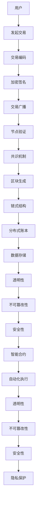

                 

### 文章标题：区块链在数字资产管理中的应用

区块链技术在数字资产管理领域正逐渐成为焦点，其去中心化、透明性和不可篡改的特性为数字资产的安全管理提供了新的可能性。本文旨在深入探讨区块链在数字资产管理中的应用，通过逻辑清晰、结构紧凑的论述，帮助读者全面了解这一领域的最新发展和潜在应用。

### 关键词：

- **区块链技术**
- **数字资产管理**
- **去中心化**
- **智能合约**
- **加密货币**
- **数字身份验证**
- **安全与隐私**

### 摘要：

本文首先介绍了区块链技术的基本概念和其在数字资产管理中的重要性。接着，详细阐述了区块链的核心原理，包括共识机制、加密技术和智能合约。随后，文章探讨了数字资产的定义和类型，以及区块链在数字资产管理中的实际应用案例。文章还介绍了数字资产管理平台的开发基础和实战案例，并分析了数字资产管理中的安全问题与隐私保护。最后，文章展望了区块链在数字资产管理领域的未来趋势和挑战。

### 目录：

1. **引言**
2. **区块链技术概述**
3. **数字资产管理概述**
4. **区块链核心原理**
5. **区块链技术在数字资产管理中的应用案例**
6. **数字资产管理平台开发**
7. **安全与隐私**
8. **未来趋势与挑战**
9. **总结**

---

接下来，我们将按照上述目录结构，逐一展开讨论，旨在为读者提供一次深入而全面的区块链在数字资产管理中的应用之旅。

### 1. 引言

区块链技术，作为一种创新的信息存储和传输技术，正在逐步改变着数字世界的面貌。它通过去中心化的方式，实现了数据的安全存储和可信传输，从而在金融、供应链管理、数字身份验证等多个领域展现出了巨大的潜力。尤其在数字资产管理方面，区块链技术提供了全新的解决方案，有效解决了传统资产管理中存在的中心化信任问题和数据安全问题。

数字资产管理，顾名思义，是指对数字形式资产的管理和运营。这些资产可以是加密货币、数字股权、数字债券，甚至是数字艺术品等。随着数字经济的蓬勃发展，数字资产的管理需求日益增加。然而，传统的集中式管理系统在面对日益增长的数字资产时，往往显得力不从心，数据安全性和透明性难以保障。

区块链技术的引入，为数字资产管理带来了新的希望。首先，区块链的去中心化特性，消除了传统集中式系统中单点故障的风险。其次，区块链的透明性和不可篡改性，使得数字资产的管理更加公开透明，数据难以被篡改，从而提高了系统的信任度。此外，智能合约技术的应用，使得数字资产的交易和管理可以自动执行，减少了人为干预，提高了效率。

本文将从以下几个方面展开讨论：

1. **区块链技术概述**：介绍区块链技术的基本概念和应用背景。
2. **数字资产管理概述**：探讨数字资产的定义、类型和区块链在数字资产管理中的作用。
3. **区块链核心原理**：详细讲解区块链的核心技术原理，包括共识机制、加密技术和智能合约。
4. **区块链技术在数字资产管理中的应用案例**：分析区块链在数字资产管理中的具体应用场景和案例。
5. **数字资产管理平台开发**：介绍如何开发数字资产管理平台，包括前端和后端的实现。
6. **安全与隐私**：讨论数字资产管理中的安全问题和隐私保护。
7. **未来趋势与挑战**：分析区块链在数字资产管理领域的未来发展趋势和面临的挑战。

通过上述内容的讨论，我们希望读者能够对区块链在数字资产管理中的应用有一个全面而深入的理解，从而更好地把握这一领域的最新发展动态。

### 2. 区块链技术概述

区块链技术，起源于2008年中本聪（Satoshi Nakamoto）发布的一篇名为《比特币：一种点对点的电子现金系统》（Bitcoin: A Peer-to-Peer Electronic Cash System）的白皮书。该白皮书首次提出了区块链的概念，并详细阐述了如何通过区块链技术实现去中心化的电子现金系统。区块链技术迅速引起了全球的关注，并在金融科技、供应链管理、数字身份验证等多个领域得到了广泛应用。

#### 区块链的基本概念

区块链是一种分布式账本技术，其核心思想是将数据分散存储在多个节点上，并通过加密算法和共识机制保证数据的安全性和可信性。简单来说，区块链由一系列按照时间顺序排列的“区块”组成，每个区块包含一定数量的交易记录，并通过密码学技术确保数据的不可篡改。

区块链具有以下几个基本特点：

- **去中心化**：与传统的集中式系统不同，区块链无需中心化的权威机构进行管理，而是通过多个节点的协作来维护整个网络的状态。这意味着区块链系统具有较高的容错性和抗攻击性。

- **透明性**：区块链上的所有数据都是公开透明的，任何人都可以查看和验证区块链上的交易记录。这种透明性提高了系统的信任度，减少了信息不对称。

- **不可篡改性**：区块链通过密码学技术保证了数据的不可篡改性。一旦数据被记录到区块链上，就几乎无法被修改或删除。这使得区块链在需要高度可信数据的环境中具有独特的优势。

- **安全性**：区块链通过加密算法和共识机制，确保了数据的安全性和隐私性。区块链上的数据传输和存储过程都是加密的，从而防止了未授权访问和数据泄露。

#### 区块链的应用背景

区块链技术的出现，是对传统集中式系统的一种颠覆。在传统系统中，数据通常存储在中心化的服务器上，数据的安全性和隐私性难以保障。而区块链技术通过去中心化和加密算法，提供了一种全新的数据存储和传输方式，大大提高了数据的安全性和可信性。

以下是区块链技术在不同领域的应用背景：

- **金融领域**：区块链技术最早在金融领域得到了广泛应用，尤其是在加密货币领域。比特币、以太坊等加密货币的成功，证明了区块链在金融交易中的潜力和优势。区块链技术还可以应用于股票交易、保险理赔、支付清算等领域，提高金融系统的效率和安全。

- **供应链管理**：区块链技术可以记录供应链中的每一笔交易，确保供应链的透明性和可追溯性。通过区块链，企业可以实时监控产品的生产和运输过程，提高供应链的效率，降低风险。

- **数字身份验证**：区块链技术可以用于数字身份验证，确保用户的身份真实可信。区块链上的身份信息一旦记录，就难以被篡改，从而提高了身份验证的可靠性。

- **医疗健康**：区块链技术可以用于医疗健康数据的存储和共享，确保数据的安全性和隐私性。通过区块链，医疗机构可以方便地共享患者的健康数据，提高医疗服务的效率和质量。

- **物联网**：区块链技术可以用于物联网设备的数据管理和安全通信，确保物联网系统的稳定性和安全性。

#### 区块链技术的发展历程

自2009年比特币正式上线以来，区块链技术经历了快速的发展和演变。以下是区块链技术的主要发展历程：

- **2009-2013年**：区块链1.0时代，主要应用场景是加密货币。比特币和莱特币等加密货币的成功，证明了区块链技术的可行性和潜力。

- **2014-2016年**：区块链2.0时代，智能合约的出现，使得区块链技术不再局限于金融领域。以太坊等公链平台的推出，为智能合约的开发提供了基础设施。

- **2017-2019年**：区块链3.0时代，区块链技术开始应用于更多的实际场景，如供应链管理、数字身份验证、医疗健康等。此外，各种联盟链和私有链也逐步兴起。

- **2020年至今**：区块链技术进入应用深化和行业融合阶段。随着技术的成熟，区块链在各个领域的应用场景越来越广泛，应用价值不断提升。

#### 区块链技术的优势和挑战

区块链技术的优势主要体现在以下几个方面：

- **去中心化**：去中心化是区块链技术的核心优势，通过去中心化，可以避免单点故障和中心化攻击，提高系统的安全性和可靠性。

- **透明性**：区块链上的所有数据都是公开透明的，任何节点都可以查看和验证。这种透明性提高了系统的信任度，减少了信息不对称。

- **不可篡改性**：区块链上的数据一旦被记录，就几乎无法被修改或删除。这种不可篡改性确保了数据的真实性和完整性。

- **安全性**：区块链通过加密算法和共识机制，确保了数据的安全性和隐私性。区块链上的数据传输和存储过程都是加密的，从而防止了未授权访问和数据泄露。

然而，区块链技术也面临着一些挑战：

- **性能瓶颈**：区块链技术的性能瓶颈一直是其发展的主要瓶颈。随着区块链上的交易量不断增加，如何提高区块链的处理速度和扩展性，成为一个亟待解决的问题。

- **安全性**：区块链系统虽然具有较强的安全性，但并不意味着完全免疫于攻击。各种区块链攻击手段层出不穷，如何保障区块链系统的安全性，仍是一个重要的研究课题。

- **监管合规**：区块链技术的发展和应用，带来了一系列的监管挑战。如何制定合理的监管政策，确保区块链技术的健康发展，是一个需要解决的重要问题。

#### 区块链技术的未来发展方向

展望未来，区块链技术将在以下几个方面继续发展：

- **性能优化**：随着区块链应用场景的不断拓展，如何提高区块链的性能，将成为未来研究的一个重要方向。分布式数据库、分片技术等将成为优化区块链性能的重要手段。

- **跨链技术**：跨链技术是区块链技术发展的一个重要方向。通过实现不同区块链之间的互操作性，可以打破现有的区块链孤岛，实现更大规模的区块链生态系统。

- **隐私保护**：随着用户对隐私保护的重视，如何实现区块链上的隐私保护，将成为未来区块链技术的一个重要发展方向。零知识证明、同态加密等技术有望在区块链隐私保护中发挥重要作用。

- **行业融合**：区块链技术将在更多的行业得到应用，实现与传统行业的深度融合。例如，在金融、物流、医疗、教育等领域，区块链技术将发挥越来越重要的作用。

- **监管合规**：随着区块链技术的发展，监管政策也将逐步完善。如何制定合理的监管政策，保障区块链技术的健康发展，将是未来区块链技术发展的重要方向。

通过以上对区块链技术概述的讨论，我们为读者奠定了理解区块链在数字资产管理中应用的基础。接下来，我们将深入探讨数字资产管理的概念和类型，以及区块链技术在其中的具体应用。

### 3. 数字资产管理概述

数字资产管理（Digital Asset Management, DAM）是指对数字形式资产的管理和运营。随着数字化进程的加速，数字资产已经成为了许多企业和个人重要的资产形式。数字资产不仅包括传统的数字货币和数字证券，还涵盖了数字艺术品、数字身份信息、数字版权等各种类型的资产。有效的数字资产管理对于保护资产安全、提高资产利用效率、实现资产增值具有重要意义。

#### 数字资产的定义

数字资产是一种以数字形式存在的资产，其价值和意义在于其在数字世界中产生的经济、社会和文化效益。数字资产具有以下几个基本特征：

1. **数字化**：数字资产是以数字形式存在的，可以通过计算机系统进行存储、传输和处理。
2. **唯一性**：数字资产通常具有唯一性，例如加密货币中的每个比特币都是独一无二的。
3. **可复制性**：尽管数字资产具有唯一性，但可以通过技术手段进行复制，例如数字文件可以轻松复制。
4. **可追踪性**：数字资产在交易和传输过程中可以被追踪，其流动路径可以记录在区块链上。
5. **价值属性**：数字资产可以具有经济价值，例如比特币可以作为一种货币进行交换。

#### 数字资产的类型

数字资产可以分为以下几种类型：

1. **加密货币**：加密货币是以区块链技术为基础的数字货币，如比特币、以太坊等。加密货币具有去中心化、匿名性和有限供应量的特点。

2. **数字证券**：数字证券是传统的证券以数字形式发行和交易，例如数字股票、数字债券等。数字证券通过区块链技术实现了更高效、透明的交易和清算。

3. **数字艺术品**：数字艺术品是以数字形式存在的艺术品，如数字绘画、数字雕塑等。数字艺术品的交易和认证可以通过区块链技术实现透明和可信。

4. **数字身份信息**：数字身份信息包括个人或组织的身份证明、认证等，如电子身份证、电子护照等。数字身份信息通过区块链技术实现可信验证和身份保护。

5. **数字版权**：数字版权是指对数字内容的版权管理，包括音乐、电影、书籍等。区块链技术可以为数字版权提供确权和维权手段。

6. **数字房地产**：数字房地产是以数字形式存在的房地产资产，如虚拟土地、虚拟房产等。数字房地产交易可以通过区块链技术实现透明、高效的流转。

7. **数字能源**：数字能源是指以数字形式存在的能源资产，如区块链化的能源交易、智能电网等。

#### 区块链在数字资产管理中的作用

区块链技术在数字资产管理中发挥着关键作用，主要体现在以下几个方面：

1. **去中心化**：区块链的去中心化特性使得数字资产的管理更加分散和去中心化，消除了传统中心化系统中的单点故障风险。

2. **透明性和可追溯性**：区块链上的所有交易都是公开透明的，任何节点都可以查看和验证。这使得数字资产的流动路径清晰可查，提高了管理的透明度和可信度。

3. **安全性和不可篡改性**：区块链通过加密算法和共识机制，确保了数字资产的安全性和不可篡改性。一旦数字资产被记录到区块链上，就难以被修改或删除，从而提高了资产的安全性和可靠性。

4. **自动化和效率**：智能合约技术使得数字资产的管理和交易可以自动化执行，减少了人为干预，提高了效率。例如，数字资产的自动结算和智能合约的自动执行，大大减少了交易的时间和成本。

5. **隐私保护**：区块链技术可以通过零知识证明、同态加密等技术实现隐私保护，确保用户身份和交易信息的隐私性。

6. **数字身份验证**：区块链技术可以用于数字身份的验证，确保身份信息的真实性和唯一性，防止身份盗用和欺诈。

#### 区块链在数字资产管理中的具体应用

区块链在数字资产管理中的具体应用场景非常广泛，以下是一些典型的应用案例：

1. **加密货币**：加密货币是区块链在数字资产管理中最为成熟和广泛应用的领域。通过区块链技术，加密货币实现了去中心化的发行和交易，提高了交易的透明度和安全性。

2. **数字身份验证**：区块链技术可以用于数字身份验证，确保用户身份的真实性和唯一性。例如，电子身份证、电子护照等数字身份证明可以通过区块链进行认证。

3. **数字版权管理**：区块链技术可以为数字版权提供确权和维权手段。通过区块链，数字版权的发行、交易和授权可以透明、高效地实现，减少了版权纠纷。

4. **供应链管理**：区块链技术可以记录供应链中的每一笔交易，确保供应链的透明性和可追溯性。通过区块链，企业可以实时监控产品的生产和运输过程，提高供应链的效率，降低风险。

5. **数字房地产**：数字房地产交易可以通过区块链技术实现透明、高效的流转。通过区块链，数字房产的所有权、交易记录等信息可以公开透明地记录，提高交易的可信度。

6. **数字艺术品**：区块链技术可以用于数字艺术品的交易和认证，确保数字艺术品的真实性和唯一性。通过区块链，数字艺术品的交易历史和所有权信息可以公开查询，减少了欺诈和纠纷。

7. **数字能源**：区块链技术可以用于数字能源的交易和管理，实现更高效、透明的能源交易。例如，区块链化的能源交易可以确保交易的透明性和公正性，减少能源浪费。

通过上述对数字资产管理概述的讨论，我们为读者奠定了理解区块链在数字资产管理中应用的基础。接下来，我们将深入探讨区块链的核心原理，为理解区块链在数字资产管理中的应用提供更深入的技术基础。

### 4. 区块链核心原理

区块链作为一种分布式数据库技术，其独特的设计理念和核心技术使得其在数字资产管理中具有显著的优势。要理解区块链在数字资产管理中的应用，首先需要深入探讨其核心原理，包括共识机制、加密技术和智能合约。

#### 共识机制

共识机制是区块链技术中最核心的部分之一，它决定了区块链网络中的节点如何达成一致的决策。不同的区块链网络采用不同的共识机制，这些机制在一定程度上决定了区块链的效率和安全性。以下是几种常见的共识机制：

1. **工作量证明（Proof of Work, PoW）**：
   工作量证明是比特币和以太坊早期使用的共识机制。节点需要通过计算复杂的数学问题来证明其工作量，从而获得生成新区块的权力。PoW机制的优点是去中心化和安全性高，但其缺点是计算资源消耗巨大，能源消耗较高，且效率较低。

2. **权益证明（Proof of Stake, PoS）**：
   权益证明是一种替代PoW的共识机制，它根据节点持有的代币数量和持币时间来决定节点的权益和生成新区块的权力。相比PoW，PoS机制更加节能，且安全性较高，但其缺点是可能存在“富者愈富”的问题。

3. **委托权益证明（Delegated Proof of Stake, DPoS）**：
   委托权益证明是对PoS机制的改进，节点可以通过投票选出一定数量的委托人，委托人负责生成区块。这种机制提高了决策效率，但增加了中心化的风险。

4. **股份授权证明（Proof of Authority, PoA）**：
   股份授权证明是一种基于企业或社区成员身份的共识机制，只有特定身份的成员才能生成区块。PoA机制在特定场景下具有较高的效率，但去中心化程度较低。

#### 加密技术

区块链技术中的加密技术确保了数据的安全性和隐私性。以下是区块链中常用的几种加密技术：

1. **哈希函数**：
   哈希函数是一种将任意长度的输入数据映射为固定长度的输出数据的函数。在区块链中，每个区块都包含前一个区块的哈希值，从而确保了区块链的链式结构。哈希函数的特性使得任何数据的篡改都会导致哈希值的变化，从而被网络中的其他节点检测到。

2. **非对称加密**：
   非对称加密使用一对密钥，公钥用于加密，私钥用于解密。在区块链中，非对称加密用于交易签名和验证。每个节点都有一对公钥和私钥，公钥可以公开，但私钥必须保密。通过私钥签名，可以确保交易的真实性和不可抵赖性。

3. **数字签名**：
   数字签名是基于非对称加密技术的一种安全验证机制。发送方使用私钥对消息进行签名，接收方使用公钥验证签名。数字签名可以确保消息的完整性和真实性，防止未授权的修改和欺诈。

4. **零知识证明（Zero-Knowledge Proof）**：
   零知识证明是一种允许证明者向验证者证明某个陈述的真实性，而无需透露任何额外信息的技术。在区块链中，零知识证明可以用于实现隐私保护，例如在交易验证过程中隐藏交易的具体内容。

#### 智能合约

智能合约是一种自动执行合约条款的计算机程序，其在区块链网络中执行。智能合约的代码一旦被部署到区块链上，就无法被篡改，从而保证了合同的执行透明性和不可篡改性。以下是智能合约的关键特点：

1. **自动执行**：
   智能合约在满足预设条件时自动执行，无需人为干预。这意味着智能合约可以自动执行交易、分配资产、记录事件等操作。

2. **透明性**：
   智能合约的代码是公开透明的，任何节点都可以查看和验证。这种透明性提高了合同的执行信任度，减少了欺诈和纠纷。

3. **不可篡改性**：
   一旦智能合约被部署到区块链上，其代码就无法被修改。这使得智能合约在执行过程中具有高度的可靠性和不可篡改性。

4. **安全性**：
   智能合约的安全性取决于其代码的质量和区块链网络的安全措施。合理的代码设计和安全的部署流程是确保智能合约安全的关键。

5. **灵活性和扩展性**：
   智能合约可以使用多种编程语言编写，从而实现各种复杂的业务逻辑。此外，智能合约可以与其他智能合约或外部系统进行交互，提供了广泛的业务场景和应用可能性。

#### 核心概念之间的联系架构

为了更好地理解区块链的核心概念，我们可以通过一个Mermaid流程图来展示这些概念之间的关系：



#### 核心算法原理讲解与伪代码

为了深入理解区块链的核心算法原理，我们可以使用伪代码来详细阐述其关键步骤。以下是区块链中一个基本的交易验证和区块生成的伪代码：

```python
# 交易验证伪代码
def verify_transaction(transaction):
    # 验证交易签名
    if not verify_signature(transaction.signature, transaction.sender.public_key):
        return False
    
    # 验证交易金额
    if transaction.amount < 0:
        return False
    
    # 验证交易输入输出平衡
    if not check_balance(transaction.inputs, transaction.outputs):
        return False
    
    return True

# 区块生成伪代码
def generate_blocktransactions, previous_hash):
    # 初始化区块
    block = {
        "transactions": transactions,
        "previous_hash": previous_hash,
        "timestamp": current_timestamp(),
        "nonce": 0
    }
    
    # 挖矿，找到满足难度要求的nonce
    while calculate_hash(block)[:-1] != "0" * difficulty:
        block["nonce"] += 1
    
    # 计算区块哈希值
    block_hash = calculate_hash(block)
    
    # 返回生成的区块
    return block

# 计算区块哈希值
def calculate_hash(block):
    block_string = json.dumps(block, sort_keys=True)
    return sha256(block_string.encode()).hexdigest()

# 验证签名
def verify_signature(signature, public_key):
    signature = decode_signature(signature)
    message_hash = calculate_hash(block)
    return ecdsa.verify(message_hash, signature, public_key)

# 检查交易输入输出平衡
def check_balance(inputs, outputs):
    total_input = sum([input["amount"] for input in inputs])
    total_output = sum([output["amount"] for output in outputs])
    return total_input >= total_output
```

#### 数学模型和公式

区块链技术中涉及到多种数学模型和公式，以下是其中几个重要的：

1. **工作量证明难度调整公式**：

   $$ difficulty_{new} = \frac{target}{average\_block\_time} $$

   其中，\( difficulty_{new} \) 是新的难度，\( target \) 是目标区块时间，\( average\_block\_time \) 是平均区块生成时间。

2. **椭圆曲线数字签名算法（ECDSA）**：

   设定椭圆曲线 \( E: y^2 = x^3 + ax + b \)，点 \( G \) 为基点，私钥为 \( k \)，公钥为 \( kG \)。签名生成算法为：

   $$ r = Hash(m) + k $$
   $$ s = k^{-1} \cdot (r + dx) $$

   其中，\( m \) 是消息，\( x \) 是私钥，\( d \) 是公钥，\( k^{-1} \) 是 \( k \) 的逆元。

3. **零知识证明**：

   零知识证明是一种证明某个陈述为真的方法，而无需透露任何额外信息。其基本模型包括证明者（Prover）和验证者（Verifier）：

   - **证明生成**：
     $$ P = \Pi_{A}^{\mathsf{commit}}(1), \Pi_{A}^{\mathsf{prove}}(1, P) $$
   - **证明验证**：
     $$ \Pi_{B}^{\mathsf{verify}}(1, P) $$

   其中，\( \Pi \) 表示零知识证明协议，\( A \) 和 \( B \) 分别表示证明者和验证者，\( commit \) 表示承诺阶段，\( prove \) 表示证明阶段，\( verify \) 表示验证阶段。

#### 举例说明

为了更好地理解上述概念和公式，我们可以通过一个简单的例子来说明区块链的交易验证过程。

假设有两个用户 Alice 和 Bob，他们分别持有公钥和私钥。他们希望进行一笔交易，其中 Alice 将 10 个比特币发送给 Bob。

1. **交易生成**：

   Alice 生成了一个交易，包含以下信息：

   ```python
   transaction = {
       "from": "Alice",
       "to": "Bob",
       "amount": 10,
       "signature": ""
   }
   ```

2. **交易签名**：

   Alice 使用私钥对交易进行签名：

   ```python
   signature = sign_transaction(transaction, alice_private_key)
   ```

   其中，`sign_transaction` 函数实现了椭圆曲线数字签名算法。

3. **交易验证**：

   Bob 收到交易后，使用 Alice 的公钥对交易进行验证：

   ```python
   if verify_signature(signature, alice_public_key):
       print("交易验证成功")
   else:
       print("交易验证失败")
   ```

4. **区块生成**：

   节点将交易打包成区块，并使用工作量证明算法生成新区块：

   ```python
   new_block = generate_block([transaction], previous_hash)
   ```

5. **区块验证**：

   其他节点接收到新区块后，验证区块中的交易是否合法：

   ```python
   for transaction in new_block["transactions"]:
       if not verify_transaction(transaction):
           print("区块验证失败：交易不合法")
           break
   else:
       print("区块验证成功")
   ```

通过上述步骤，区块链确保了交易的合法性和安全性，实现了去中心化的数字资产管理。

#### 总结

通过以上对区块链核心原理的详细讲解，我们深入了解了区块链技术的共识机制、加密技术和智能合约。这些核心原理不仅构成了区块链技术的基础，也为数字资产管理提供了强大的支持。在接下来的部分，我们将进一步探讨区块链在数字资产管理中的应用案例，展示区块链技术的实际应用效果。

### 5. 区块链技术在数字资产管理中的应用案例

区块链技术在数字资产管理中的应用已经逐渐成熟，并展现出巨大的潜力和实际效果。以下我们将通过几个具体的应用案例，详细分析区块链技术在数字资产管理中的实际应用，并讨论这些应用所带来的变革。

#### 案例一：加密货币

加密货币是区块链技术在数字资产管理中最早和最广泛应用的领域之一。比特币（Bitcoin）和以太坊（Ethereum）是最著名的加密货币，它们的成功证明了区块链技术在数字资产交易中的巨大潜力。

1. **应用场景**：
   加密货币主要用于点对点的电子现金交易，去除了传统金融系统中中介机构的需要，实现了更高效、更安全的交易。

2. **具体应用**：
   - **比特币**：比特币是一种去中心化的数字货币，通过区块链网络进行交易。比特币交易记录公开透明，且具有不可篡改的特性，保证了交易的安全性和可信性。
   - **以太坊**：以太坊不仅是一种数字货币，还提供了一个去中心化的平台，支持智能合约的开发和部署。以太坊上的智能合约使得资产交易更加自动化和透明。

3. **变革**：
   - **去中心化交易**：加密货币实现了去中心化的交易，去除了传统金融机构的中介角色，降低了交易成本，提高了交易效率。
   - **资产透明性**：区块链上的交易记录公开透明，任何用户都可以查看和验证，提高了资产管理的透明度和可信度。
   - **安全性**：加密货币通过区块链技术确保了交易的安全性和不可篡改性，减少了欺诈和盗窃的风险。

#### 案例二：数字身份验证

数字身份验证是区块链技术在数字资产管理中的另一个重要应用。通过区块链技术，可以确保用户身份的真实性和唯一性，防止身份盗用和欺诈。

1. **应用场景**：
   数字身份验证广泛应用于金融、电子商务、社交网络等领域，用于确保用户身份的合法性。

2. **具体应用**：
   - **电子身份证**：一些国家和地区已经开始使用区块链技术实现电子身份证，用户可以在区块链上存储和验证其身份信息。
   - **数字签名**：区块链技术可以用于数字签名，确保电子文档的合法性和完整性。

3. **变革**：
   - **可信身份验证**：区块链技术确保了用户身份信息的唯一性和不可篡改性，提高了身份验证的可信度。
   - **降低欺诈风险**：通过区块链技术，可以有效地防止身份盗用和欺诈，提高了数字资产交易的安全性。
   - **简化身份验证流程**：区块链技术简化了传统的身份验证流程，降低了验证成本，提高了用户体验。

#### 案例三：数字版权管理

数字版权管理是区块链技术在文化创意产业中的一个重要应用。通过区块链技术，可以确保数字内容的版权信息得到确权和保护，防止侵权和盗版。

1. **应用场景**：
   数字版权管理广泛应用于音乐、电影、书籍、艺术品等领域，用于保护创作者的合法权益。

2. **具体应用**：
   - **数字版权注册**：创作者可以将数字版权信息注册到区块链上，确保版权的合法性和唯一性。
   - **版权交易**：区块链技术可以记录和验证版权的所有权和交易记录，确保版权交易的安全性和透明性。

3. **变革**：
   - **确权保护**：区块链技术为数字版权提供了确权和保护的手段，确保创作者的权益得到有效保障。
   - **透明交易记录**：区块链上的版权交易记录公开透明，任何用户都可以查看和验证，提高了版权管理的透明度和可信度。
   - **降低侵权风险**：通过区块链技术，可以有效地防止侵权和盗版行为，提高了数字版权的保护水平。

#### 案例四：供应链管理

区块链技术在供应链管理中的应用，可以提高供应链的透明性和可追溯性，确保产品的质量和来源可查。

1. **应用场景**：
   供应链管理广泛应用于制造业、零售业、食品行业等领域，用于监控产品的生产和运输过程。

2. **具体应用**：
   - **产品溯源**：区块链技术可以记录产品的生产、运输、存储等环节的信息，确保产品的来源和质量可查。
   - **供应链审计**：区块链技术可以用于供应链审计，确保供应链的透明性和合规性。

3. **变革**：
   - **提高透明度**：区块链技术确保了供应链信息的透明度，提高了供应链管理的效率和信任度。
   - **确保产品质量**：通过区块链技术，可以实时监控产品的质量和来源，提高了产品的质量和安全性。
   - **降低风险**：区块链技术可以有效地降低供应链中的风险，如欺诈、质量问题和物流延误等。

#### 案例五：数字房地产

数字房地产是区块链技术在房地产领域的一个重要应用。通过区块链技术，可以实现房地产的数字化和去中心化交易，提高交易的安全性和效率。

1. **应用场景**：
   数字房地产主要用于房地产交易、租赁和管理，可以应用于住宅、商业地产和土地等领域。

2. **具体应用**：
   - **数字房产证**：房地产信息可以注册到区块链上，确保房产信息的唯一性和不可篡改性。
   - **房产交易**：区块链技术可以用于房产交易，实现快速、安全、透明的交易过程。

3. **变革**：
   - **简化交易流程**：区块链技术简化了房地产交易的流程，降低了交易成本，提高了交易效率。
   - **确保信息真实性**：区块链技术确保了房地产信息的真实性和唯一性，提高了交易的可信度。
   - **降低交易风险**：区块链技术可以降低房地产交易中的风险，如欺诈和信息错误等。

通过上述应用案例的分析，我们可以看到区块链技术在数字资产管理中展现了巨大的应用潜力。它不仅提高了资产管理的透明度和安全性，还简化了交易流程，降低了风险，为数字资产的管理和运营带来了深远的变革。在接下来的部分，我们将进一步探讨如何开发数字资产管理平台，以及平台开发中的关键技术和挑战。

### 6. 数字资产管理平台开发

数字资产管理平台是区块链技术在数字资产管理中落地应用的重要工具。开发一个高效的数字资产管理平台，需要考虑平台的需求分析、前端技术实现、后端技术实现以及安全性保障等多个方面。以下我们将详细探讨这些关键技术和步骤。

#### 需求分析

在开发数字资产管理平台之前，首先需要进行详细的需求分析。需求分析包括对平台的功能需求、性能需求、安全性需求等进行分析和梳理。

1. **功能需求**：
   - **账户管理**：平台应支持用户账户的注册、登录、权限管理等功能。
   - **资产管理**：平台应支持对各种数字资产的管理，包括加密货币、数字证券、数字艺术品等。
   - **交易管理**：平台应支持数字资产的交易功能，包括买入、卖出、转账等。
   - **记录管理**：平台应记录所有交易和资产管理操作的日志，确保操作可追溯。
   - **监控分析**：平台应提供资产管理数据的实时监控和分析功能。

2. **性能需求**：
   - **高并发处理**：平台应能够支持高并发交易请求，确保交易处理的效率和稳定性。
   - **快速响应**：平台应提供快速的用户操作响应，提高用户体验。
   - **可扩展性**：平台应具有良好的扩展性，支持业务的快速发展和需求变更。

3. **安全性需求**：
   - **数据安全**：平台应确保存储和传输的数据安全，防止数据泄露和篡改。
   - **访问控制**：平台应实现严格的访问控制，确保只有授权用户才能访问和管理资产。
   - **隐私保护**：平台应保护用户的隐私信息，防止隐私泄露和滥用。

#### 前端技术实现

数字资产管理平台的前端技术实现决定了用户体验和操作便捷性。前端开发需要考虑界面的设计、用户交互和功能实现等多个方面。

1. **界面设计**：
   - **简洁易用**：界面设计应简洁直观，方便用户快速上手。
   - **响应式设计**：界面应支持多种设备和屏幕尺寸，提供一致的用户体验。

2. **用户交互**：
   - **交互流畅**：用户操作应响应迅速，减少等待时间。
   - **交互提示**：提供清晰的交互提示和错误信息，帮助用户正确操作。

3. **功能实现**：
   - **资产管理**：前端应提供资产展示、资产管理、交易记录等功能。
   - **交易操作**：前端应支持交易发起、交易确认、交易完成等操作流程。
   - **监控分析**：前端应提供实时数据监控和可视化分析功能。

技术实现方面，前端开发可以使用以下技术：

- **框架**：React、Vue、Angular 等
- **UI库**：Ant Design、Bootstrap、Material-UI 等
- **状态管理**：Redux、Vuex、MobX 等
- **数据可视化**：ECharts、D3.js、Chart.js 等

#### 后端技术实现

数字资产管理平台的后端技术实现是整个平台的基石，负责处理数据存储、交易处理、业务逻辑和安全保障等多个方面。

1. **数据存储**：
   - **区块链**：平台的核心数据应存储在区块链上，确保数据的安全性和不可篡改性。
   - **关系数据库**：用于存储非区块链数据，如用户信息、交易日志等。
   - **NoSQL数据库**：用于存储非结构化数据，如加密货币交易记录等。

2. **交易处理**：
   - **交易调度**：后端应实现交易调度功能，确保交易按顺序处理，避免冲突和错误。
   - **智能合约执行**：后端应支持智能合约的部署和执行，确保交易符合合约规则。

3. **业务逻辑**：
   - **账户管理**：后端应实现账户的注册、登录、权限管理等业务逻辑。
   - **资产交易**：后端应实现资产交易的业务逻辑，包括交易确认、交易记录等。

4. **安全保障**：
   - **加密技术**：使用加密算法确保数据传输和存储的安全。
   - **访问控制**：实现严格的访问控制，确保只有授权用户才能访问关键功能。
   - **审计日志**：记录所有关键操作的日志，便于审计和追溯。

技术实现方面，后端开发可以使用以下技术：

- **框架**：Spring Boot、Django、Flask 等
- **区块链库**：Hyperledger Fabric、Ethereum、EOSIO 等
- **数据库**：MySQL、PostgreSQL、MongoDB、CouchDB 等
- **中间件**：RabbitMQ、Kafka、Redis 等
- **身份认证**：OAuth2.0、JWT、LDAP 等

#### 项目实战

以下是一个数字资产管理平台开发的项目实战案例，包括开发环境搭建、源代码实现和代码解读。

1. **开发环境搭建**：

   - **前端**：
     - 开发工具：Visual Studio Code
     - 框架：Vue
     - UI库：Ant Design
     - 状态管理：Vuex
     - 数据可视化：ECharts

   - **后端**：
     - 开发工具：IntelliJ IDEA
     - 框架：Spring Boot
     - 数据库：MySQL、Ethereum
     - 中间件：RabbitMQ、Redis

2. **源代码实现**：

   - **前端**：
     ```javascript
     // Vue组件：资产管理页面
     <template>
       <div>
         <资产管理列表 :资产列表="资产列表" @交易="发起交易" />
       </div>
     </template>
     
     <script>
     export default {
       data() {
         return {
           资产列表: [],
         };
       },
       methods: {
         async 发起交易(交易信息) {
           const { from, to, amount } = 交易信息;
           await this.$axios.post('/api/transactions', { from, to, amount });
           this.$message.success('交易成功');
         },
       },
       async mounted() {
         this.资产列表 = await this.$axios.get('/api/assets');
       },
     };
     </script>
     ```

   - **后端**：
     ```java
     // Spring Boot控制器：交易处理
     @RestController
     @RequestMapping("/api")
     public class TransactionController {
     
       @Autowired
       private TransactionService transactionService;
       
       @PostMapping("/transactions")
       public ResponseEntity<?> createTransaction(@RequestBody TransactionDTO transactionDTO) {
         try {
           transactionService.createTransaction(transactionDTO);
           return ResponseEntity.ok().build();
         } catch (Exception e) {
           return ResponseEntity.status(HttpStatus.BAD_REQUEST).build();
         }
       }
     }
     ```

3. **代码解读与分析**：

   - **前端**：
     前端资产管理页面使用Vue框架实现，资产管理列表组件用于展示用户的资产信息，并提供了交易按钮。当用户点击交易按钮时，会触发`发起交易`方法，通过axios向后端发送交易请求。

   - **后端**：
     后端交易处理控制器使用Spring Boot框架实现，接收前端发来的交易请求，调用交易服务进行交易处理。交易服务负责实现具体的交易逻辑，如检查账户余额、执行交易、更新交易记录等。

#### 实际案例分析

以下是一个实际案例，展示了区块链在数字资产管理平台中的应用效果。

1. **案例背景**：

   某数字资产管理平台，用户可以注册账户，管理自己的加密货币资产，并进行买卖交易。平台使用以太坊区块链作为底层技术，通过智能合约实现交易。

2. **案例分析**：

   - **账户注册与登录**：
     用户在平台注册账户后，系统会生成一个以太坊地址，并将其与用户的个人信息绑定。用户登录时，通过私钥验证身份。

   - **资产管理**：
     用户可以在平台上查看和管理自己的加密货币资产，包括账户余额、交易记录等。资产信息存储在以太坊区块链上，确保数据的不可篡改。

   - **交易操作**：
     用户发起交易时，通过智能合约执行交易逻辑。智能合约确保交易符合平台规则，并自动执行交易操作。交易记录实时更新在区块链上，任何用户都可以查看和验证。

3. **效果与评价**：

   - **提高交易效率**：通过智能合约自动执行交易，大大提高了交易处理速度和效率。
   - **确保交易安全**：区块链技术确保了交易的安全性和透明度，减少了欺诈和错误的风险。
   - **降低交易成本**：去中心化的交易模式降低了交易成本，提高了用户体验。

#### 项目小结

通过以上项目实战和案例分析，我们可以看到数字资产管理平台开发中的关键技术和步骤。开发一个高效的数字资产管理平台，需要综合考虑前端设计、后端实现、数据存储和安全性保障等多个方面。区块链技术的引入，为数字资产管理平台提供了强大的支持，确保了资产的安全、透明和高效管理。在未来的发展中，随着区块链技术的不断进步，数字资产管理平台将发挥越来越重要的作用。

### 7. 安全与隐私

在数字资产管理中，安全与隐私是最为重要的议题。区块链技术以其去中心化、透明性和不可篡改的特性，为数字资产管理提供了坚实的基础，但同时也带来了新的挑战。如何确保区块链在数字资产管理中的安全性，以及如何保护用户的隐私，是当前需要重点解决的问题。

#### 安全问题

区块链技术在数字资产管理中面临的主要安全问题包括：

1. **双花攻击（Double Spending）**：
   双花攻击是指攻击者在区块链网络中同时向两个不同的实体发送相同的交易，从而盗取资产。为防止双花攻击，区块链系统通常采用工作量证明（PoW）或权益证明（PoS）等共识机制，确保交易的唯一性和安全性。

2. **51%攻击（51% Attack）**：
   51%攻击是指攻击者控制区块链网络中超过50%的算力或股权，从而篡改区块链数据或双花攻击。为防范51%攻击，区块链系统应确保足够的分布式节点，降低攻击者的成功率。

3. **智能合约漏洞**：
   智能合约是区块链系统中的关键组成部分，但其代码一旦出现漏洞，可能导致资金被盗或系统崩溃。为防范智能合约漏洞，开发者应遵循严格的编码规范，进行全面的代码审计和安全测试。

4. **网络攻击**：
   区块链系统可能遭受DDoS攻击、恶意软件攻击等网络攻击，从而影响系统的稳定性和安全性。为防范网络攻击，区块链系统应采用有效的防火墙、入侵检测和防护技术。

5. **数据泄露**：
   区块链系统中的数据虽然具有不可篡改的特性，但数据泄露仍然是一个严重的安全问题。为防止数据泄露，区块链系统应采用加密算法和访问控制机制，确保数据的保密性和完整性。

#### 安全解决方案

针对上述安全问题，可以采取以下解决方案：

1. **共识机制**：
   采用安全性较高的共识机制，如PoS或DPoS，降低双花攻击和51%攻击的风险。

2. **智能合约审计**：
   对智能合约进行严格的审计和测试，确保代码的可靠性和安全性。可以使用自动化审计工具和人工审计相结合的方式。

3. **加密技术**：
   使用非对称加密算法，确保交易数据的保密性和完整性。同时，对用户身份和交易信息进行加密处理，提高系统的安全性。

4. **网络防护**：
   采用防火墙、入侵检测和防护技术，防范网络攻击。同时，定期进行安全审计和漏洞修复，确保系统的安全性。

5. **访问控制**：
   实施严格的访问控制机制，确保只有授权用户才能访问和管理关键数据。使用身份认证和授权机制，确保系统的安全性。

#### 隐私保护

在数字资产管理中，隐私保护也是一个重要的议题。区块链技术由于其透明性和不可篡改性，可能导致用户的隐私泄露。以下是一些隐私保护的方法：

1. **零知识证明（Zero-Knowledge Proof）**：
   零知识证明是一种证明某个陈述为真，而无需透露任何额外信息的技术。通过零知识证明，用户可以在不暴露交易内容的情况下，证明其拥有特定资产。

2. **同态加密（Homomorphic Encryption）**：
   同态加密是一种能够在加密状态下进行计算的技术。通过同态加密，用户可以在不解密数据的情况下，对数据进行计算和处理，从而保护隐私。

3. **隐私币（Privacy Coin）**：
   隐私币是一种专门为保护用户隐私设计的加密货币。隐私币通过混合交易、匿名交易等方式，提高交易的隐私性。

4. **隐私保护智能合约**：
   通过设计隐私保护智能合约，用户可以在不暴露隐私的情况下，执行复杂的交易逻辑。隐私保护智能合约使用零知识证明、同态加密等技术，确保交易的隐私性。

5. **去中心化身份验证**：
   去中心化身份验证是一种通过区块链技术实现的身份验证方式。通过去中心化身份验证，用户可以在不暴露隐私的情况下，证明其身份的真实性和唯一性。

#### 实际案例

以下是一个实际案例，展示了区块链在数字资产管理中如何确保安全性和隐私保护。

1. **案例背景**：

   某数字资产管理平台使用以太坊区块链作为底层技术，提供加密货币资产管理服务。平台采用零知识证明和同态加密技术，确保用户隐私和安全。

2. **案例分析**：

   - **账户注册**：
     用户在平台注册账户时，系统生成一个匿名地址，并将其与用户的私钥绑定。用户私钥存储在本地，平台无法访问。

   - **交易操作**：
     用户发起交易时，系统使用零知识证明技术，证明用户拥有特定资产，但无需透露资产的具体信息。交易内容使用同态加密技术加密，确保隐私保护。

   - **数据存储**：
     平台将交易记录存储在以太坊区块链上，数据使用哈希算法加密，确保数据的完整性和不可篡改性。

3. **效果与评价**：

   - **提高安全性**：通过零知识证明和同态加密技术，平台有效防止了双花攻击、51%攻击等安全威胁，提高了系统的安全性。
   - **保护隐私**：平台采用匿名地址和加密技术，确保用户的交易隐私，防止隐私泄露。
   - **用户体验**：平台提供简洁直观的操作界面，用户可以方便地管理和交易数字资产，提高了用户体验。

#### 总结

在数字资产管理中，安全与隐私保护是至关重要的。区块链技术以其去中心化、透明性和不可篡改的特性，为数字资产管理提供了坚实的基础，但同时也带来了安全挑战。通过采用共识机制、智能合约审计、加密技术、网络防护和访问控制等技术手段，可以有效确保区块链在数字资产管理中的安全性。同时，通过零知识证明、同态加密、隐私币和去中心化身份验证等技术，可以保护用户的隐私，提高数字资产管理的可信度和用户体验。在未来的发展中，随着区块链技术的不断进步，安全与隐私保护将变得越来越重要，成为数字资产管理领域的关键议题。

### 8. 未来趋势与挑战

区块链技术在数字资产管理中的应用前景广阔，但同时也面临着一系列的挑战。展望未来，区块链技术在数字资产管理领域将经历以下几个重要发展趋势，并需克服多项技术、法规和社会层面的挑战。

#### 发展趋势

1. **性能优化**：
   随着区块链应用场景的不断扩大，性能瓶颈成为亟待解决的问题。未来，区块链技术将朝着更高性能、更低延迟的方向发展。分布式数据库、分片技术、横向扩展等技术的应用，有望大幅提升区块链的处理能力和扩展性。

2. **跨链互操作性**：
   跨链互操作性是区块链技术的另一个重要发展方向。通过实现不同区块链之间的数据交换和互操作性，可以打破现有的区块链孤岛，构建更广泛、更高效的区块链生态系统。跨链技术将促进不同区块链之间的合作和融合，推动整个行业的发展。

3. **隐私保护技术**：
   隐私保护一直是区块链技术的关注点。未来，零知识证明、同态加密等隐私保护技术将得到进一步发展和应用，提高区块链系统的隐私性。特别是在数字资产管理中，隐私保护技术将确保用户数据的安全和隐私，增强用户对区块链技术的信任。

4. **行业融合**：
   区块链技术将在更多行业得到应用，实现与传统行业的深度融合。在金融、供应链管理、医疗健康、教育等领域，区块链技术将发挥越来越重要的作用。通过区块链技术的应用，企业可以提高业务效率、降低成本、提高数据透明度和可信度。

5. **监管合规**：
   随着区块链技术的广泛应用，监管政策也将逐步完善。未来，各国政府将制定更加合理的监管政策，确保区块链技术的健康发展。监管合规将成为区块链技术发展的重要方向，推动区块链技术与法律法规的协调。

#### 挑战

1. **技术挑战**：
   区块链技术仍面临许多技术挑战，如共识机制的优化、区块链扩展性问题、网络安全等。为了克服这些挑战，需要持续进行技术创新和研究，提高区块链技术的性能和安全性。

2. **法规挑战**：
   区块链技术的应用带来了新的法律和监管问题。如何在保障创新的同时，确保区块链技术的合规性和合法性，是当前面临的重要挑战。各国政府需要制定明确的法律法规，为区块链技术的发展提供明确的指导。

3. **社会挑战**：
   区块链技术的普及和应用，也面临着社会层面的挑战。如何提高公众对区块链技术的认知和信任，如何处理区块链技术带来的就业和社会变革，都是需要认真考虑的问题。

4. **数据隐私保护**：
   在数字资产管理中，数据隐私保护是一个重要的议题。如何在确保数据安全的同时，保护用户的隐私，是一个需要解决的重要问题。隐私保护技术的进一步发展，将对区块链技术的广泛应用起到关键作用。

5. **用户教育和普及**：
   区块链技术的复杂性和专业性，使得普通用户难以理解和应用。如何通过教育和普及，提高公众对区块链技术的认知和应用能力，是区块链技术普及的重要挑战。

#### 未来展望

展望未来，区块链技术在数字资产管理领域将迎来更加广泛和深入的应用。随着技术的不断进步和监管政策的逐步完善，区块链技术将逐步克服现有的挑战，实现更高的性能、更低的成本和更高的安全性。同时，区块链技术的跨链互操作性、隐私保护技术、行业融合等发展方向，将为数字资产管理带来新的机遇和可能性。

在数字资产管理中，区块链技术将继续发挥其独特的优势，为资产的安全管理、透明交易、智能合约执行等提供强有力的支持。通过技术创新、法规完善和社会共识，区块链技术有望在数字资产管理领域实现更加广泛和深入的应用，推动数字经济的繁荣发展。

### 总结

通过本文的讨论，我们对区块链在数字资产管理中的应用有了全面而深入的理解。区块链技术的去中心化、透明性和不可篡改性，为数字资产管理提供了新的解决方案，有效解决了传统资产管理中的信任问题和数据安全问题。未来，随着区块链技术的不断进步和行业融合，数字资产管理将迎来更加广阔的发展空间。

在技术层面，性能优化、跨链互操作性、隐私保护技术等将是区块链技术发展的关键方向。在法规层面，监管政策的逐步完善将为区块链技术的应用提供明确的指导。在社会层面，用户教育和普及是推动区块链技术广泛应用的重要任务。

面对未来，区块链技术在数字资产管理领域仍有许多机遇和挑战。通过技术创新、法规完善和社会共识，我们有理由相信，区块链技术将在数字资产管理中发挥越来越重要的作用，推动数字经济的繁荣发展。

作者：AI天才研究院/AI Genius Institute & 禅与计算机程序设计艺术 /Zen And The Art of Computer Programming

---

感谢您的阅读，希望本文对您理解区块链在数字资产管理中的应用提供了有价值的见解。如果您有任何疑问或建议，欢迎在评论区留言讨论。祝您在区块链技术探索之旅中取得更多的成果！

