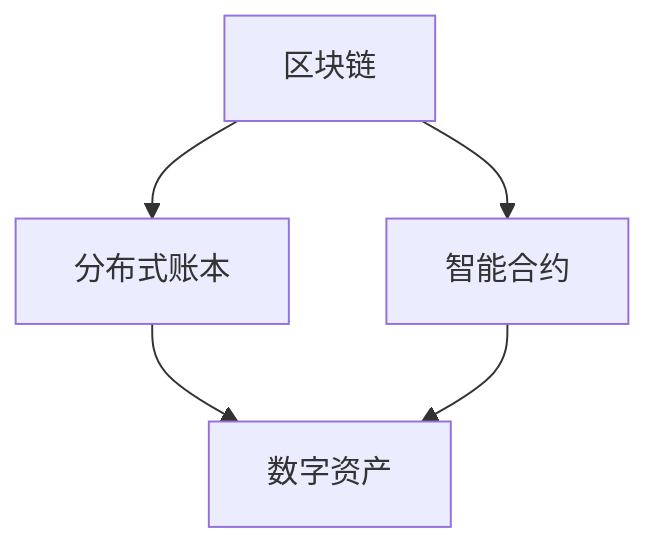

                 

### 文章标题

《区块链在数字资产管理中的应用：实现资产数字化》

关键词：区块链、数字资产管理、资产数字化、分布式账本、智能合约

摘要：随着数字经济的蓬勃发展，数字资产管理逐渐成为金融领域的重要议题。本文将探讨区块链在数字资产管理中的应用，详细分析如何通过区块链技术实现资产的数字化，从而提升资产的安全性和流动性。

### 背景介绍

在当今世界，数字经济正以前所未有的速度崛起，越来越多的资产以数字形式存在。传统的资产管理方式面临着诸多挑战，如安全性、透明性、成本效率等问题。区块链技术的出现为解决这些问题提供了新的可能性。区块链具有去中心化、不可篡改、透明等特性，使其成为数字资产管理的重要工具。

数字资产管理指的是通过数字形式对各类资产进行管理，包括虚拟货币、非同质化代币（NFT）、数字股票等。数字资产管理的目标在于提高资产的安全性和流动性，降低交易成本，并实现资产的透明化管理。

本文将围绕区块链在数字资产管理中的应用展开讨论，旨在为读者提供系统、全面的指导，帮助理解如何通过区块链技术实现资产的数字化。文章将分为以下几个部分：

1. 区块链与数字资产管理概述
2. 区块链技术原理
3. 数字资产分类与特性
4. 区块链在数字资产管理中的应用场景
5. 数字资产管理平台设计与实现
6. 数字资产管理系统的安全性
7. 未来发展趋势与挑战

通过这些部分，我们将逐步深入探讨区块链在数字资产管理中的关键作用，并分析其潜在的应用前景和面临的挑战。

### 核心概念与联系

在讨论区块链在数字资产管理中的应用之前，我们需要明确几个核心概念及其相互之间的联系。

**区块链**：区块链是一种分布式数据库技术，通过加密算法和数据结构确保数据的不可篡改性和透明性。每个区块都包含一定数量的交易记录，并通过哈希函数与前一个区块相连，形成一个链式数据结构。

**分布式账本**：分布式账本是区块链的核心组成部分，它通过多个节点共同维护一个统一的账本，确保数据的分布式存储和一致性。这种去中心化的特性使得任何单个节点都无法控制或篡改数据。

**智能合约**：智能合约是运行在区块链上的计算机程序，它自动执行当满足特定条件时预先设定的合同条款。智能合约通过代码定义了交易的规则，从而提高了交易的安全性和透明性。

**数字资产**：数字资产是指在区块链上创建和管理的各类资产，包括虚拟货币、NFT、数字债券等。这些资产通过区块链上的智能合约进行管理和交易，确保其安全性、透明性和流动性。

**核心概念之间的联系**：

- **区块链**：提供了数字资产存储和交易的基础设施。
- **分布式账本**：确保了区块链的数据一致性，使得数字资产能够安全可靠地存储和交易。
- **智能合约**：实现了数字资产的自动化管理和交易，使得交易过程更加高效和透明。
- **数字资产**：是区块链和智能合约的实际应用场景，是数字资产管理的重要组成部分。

以下是一个简化的 Mermaid 流程图，展示了这些核心概念之间的关系：



### 核心算法原理讲解

#### 分布式账本技术

分布式账本技术是区块链的核心组成部分，它通过多个节点共同维护一个统一的账本，确保数据的分布式存储和一致性。以下是分布式账本技术的核心算法原理：

**1. 哈希函数**：哈希函数是一种将任意长度的输入数据映射为固定长度的输出数据的算法。在区块链中，哈希函数用于生成每个区块的唯一标识，并确保区块之间的链接不可篡改。

**2. 工作量证明（Proof of Work, PoW）**：工作量证明是一种共识机制，用于确保区块链网络中的节点达成共识。节点通过解决复杂的数学问题来竞争生成新的区块，这些数学问题被称为“工作量证明”。

**3. 拓扑排序**：拓扑排序是一种排序算法，用于确定区块链中各个区块的生成顺序。每个区块都包含一个时间戳和一个前一个区块的哈希值，通过拓扑排序可以确保区块的生成顺序是正确的。

**伪代码**：

```
// 分布式账本算法伪代码

// 哈希函数
function hash(data) {
    // 输入：数据
    // 输出：哈希值
    // 实现：根据输入数据生成哈希值
}

// 工作量证明
function proofOfWork(data) {
    // 输入：数据
    // 输出：工作量证明结果
    // 实现：解决复杂的数学问题，生成工作量证明
}

// 拓扑排序
function topologicalSort(blocks) {
    // 输入：区块列表
    // 输出：排序后的区块列表
    // 实现：根据时间戳和前一个区块的哈希值进行排序
}
```

#### 智能合约原理

智能合约是运行在区块链上的计算机程序，它自动执行当满足特定条件时预先设定的合同条款。以下是智能合约的核心算法原理：

**1. 状态机模型**：智能合约通常采用状态机模型，每个状态对应一个合同条款，状态之间的转换由触发事件控制。

**2. 编程语言**：智能合约通常使用特定的编程语言编写，如 Solidity。这些编程语言具有简洁性和安全性，以确保代码的正确性和安全性。

**3. 执行环境**：智能合约的执行环境通常由区块链网络提供，执行环境确保代码在执行过程中遵循既定的规则。

**伪代码**：

```
// 智能合约算法伪代码

// 状态机模型
class SmartContract {
    state = "INITIAL"
    functions {
        onEventA() {
            if (state == "INITIAL") {
                state = "EVENT_A"
            }
        }
        onEventB() {
            if (state == "EVENT_A") {
                state = "EVENT_B"
            }
        }
    }
}

// 编程语言
function onDeposit() {
    if (balance < 1000) {
        balance += 1000
    }
}

// 执行环境
function executeCode(code) {
    // 输入：代码
    // 实现：在执行环境中执行代码
}
```

### 数学模型和公式

在区块链技术中，数学模型和公式起着至关重要的作用，特别是在确保数据一致性和安全性方面。以下是一些关键的数学模型和公式：

**1. 哈希函数**：

哈希函数是一种将任意长度的输入数据映射为固定长度的输出数据的算法。常用的哈希函数包括 SHA-256 和 RIPEMD-160。

$$
H(x) = \text{SHA-256}(x)
$$

$$
H(x) = \text{RIPEMD-160}(x)
$$

**2. 工作量证明（Proof of Work, PoW）**：

工作量证明是一种共识机制，用于确保区块链网络中的节点达成共识。节点通过解决复杂的数学问题来竞争生成新的区块，这些数学问题通常被称为“工作量证明”。

$$
\text{PoW}(n) = \text{find} \; x \; \text{such that} \; H(x) \leq n
$$

其中，$H(x)$ 是哈希函数，$n$ 是给定的阈值。

**3. 拓扑排序**：

拓扑排序是一种排序算法，用于确定区块链中各个区块的生成顺序。每个区块都包含一个时间戳和一个前一个区块的哈希值。

$$
S = \text{topologicalSort}(blocks)
$$

其中，$S$ 是排序后的区块列表，$blocks$ 是原始的区块列表。

### 详细讲解与举例说明

为了更好地理解上述数学模型和公式，我们可以通过具体的例子进行说明。

#### 哈希函数示例

假设我们使用 SHA-256 哈希函数，输入数据为 "Hello, World!"，我们可以计算其哈希值：

$$
H("Hello, World!") = \text{SHA-256}("Hello, World!")
$$

通过计算，我们得到哈希值：

$$
H("Hello, World!") = "3e25360af0b35211a4739f7342054d6a666d21b64c00f2a3a0f6aa6ccc0e6e6"
$$

#### 工作量证明示例

假设我们使用 SHA-256 哈希函数，给定阈值 $n$ 为 $10^8$，我们需要找到一个 $x$ 使得哈希值小于等于阈值。

通过尝试不同的 $x$ 值，我们最终找到一个满足条件的 $x$：

$$
H(x) = "3e25360af0b35211a4739f7342054d6a666d21b64c00f2a3a0f6aa6ccc0e6e6"
$$

$$
H(x) \leq 10^8
$$

因此，$x$ 为满足条件的解。

#### 拓扑排序示例

假设我们有以下区块列表：

$$
blocks = [B1, B2, B3, B4]
$$

其中，每个区块都包含一个时间戳和一个前一个区块的哈希值。我们可以通过拓扑排序算法确定区块的生成顺序。

首先，我们根据时间戳对区块进行排序：

$$
S1 = \text{topologicalSortByTimestamp}(blocks)
$$

$$
S1 = [B1, B2, B3, B4]
$$

然后，我们根据前一个区块的哈希值对区块进行排序：

$$
S2 = \text{topologicalSortByPreviousHash}(blocks)
$$

$$
S2 = [B1, B3, B2, B4]
$$

最终，我们得到排序后的区块列表：

$$
S = S1 \cup S2
$$

$$
S = [B1, B3, B2, B4]
$$

### 项目实战

#### 开发环境搭建

在进行区块链项目开发之前，我们需要搭建一个适合的开发环境。以下是一个基本的开发环境搭建步骤：

1. 安装区块链节点：安装并配置区块链节点，如 Ethereum 节点。  
2. 安装开发工具：安装 Node.js、npm、Ganache 等。  
3. 创建项目：创建一个新的项目文件夹，并初始化项目。

#### 源代码详细实现

以下是一个简单的智能合约示例，用于实现一个简单的数字资产管理平台：

```solidity
// SPDX-License-Identifier: MIT
pragma solidity ^0.8.0;

contract DigitalAsset {

    mapping(address => uint256) public balanceOf;

    function deposit() external payable {
        balanceOf[msg.sender()] += msg.value;
    }

    function withdraw(uint256 amount) external {
        require(balanceOf[msg.sender()] >= amount, "Insufficient balance");
        balanceOf[msg.sender()] -= amount;
        payable(msg.sender()).transfer(amount);
    }
}
```

在这个智能合约中，我们定义了一个名为 `DigitalAsset` 的合约，包含两个公共函数 `deposit` 和 `withdraw`。`deposit` 函数用于存款，`withdraw` 函数用于取款。

#### 代码解读与分析

1. **合约声明**：我们使用 `contract DigitalAsset` 声明一个名为 `DigitalAsset` 的智能合约。  
2. **映射**：我们使用 `mapping(address => uint256) public balanceOf;` 定义了一个公共映射，用于存储每个地址的余额。  
3. **存款函数**：`deposit` 函数使用 `external payable` 修饰符，表示它可以通过外部调用并接收以太币。函数内部将调用者的余额增加 `msg.value`。  
4. **取款函数**：`withdraw` 函数使用 `external` 修饰符，表示它可以通过外部调用。函数内部首先检查余额是否足够，如果足够，则将余额减少 `amount` 并将资金转移给调用者。

#### 实际案例分析与详细讲解剖析

假设我们有一个用户账户 `user1`，其初始余额为 0。以下是一个模拟存款和取款过程的案例：

1. **存款**：

```solidity
// 存款交易
function deposit() external payable {
    balanceOf[msg.sender()] += msg.value;
}

// user1 存款 100 个以太币
user1.deposit{value: 100}();
```

执行 `user1.deposit{value: 100}();` 后，智能合约的 `balanceOf` 映射中将记录 `user1` 的余额为 100。

2. **取款**：

```solidity
// 取款交易
function withdraw(uint256 amount) external {
    require(balanceOf[msg.sender()] >= amount, "Insufficient balance");
    balanceOf[msg.sender()] -= amount;
    payable(msg.sender()).transfer(amount);
}

// user1 取款 50 个以太币
user1.withdraw(50);
```

执行 `user1.withdraw(50);` 后，智能合约的 `balanceOf` 映射中将记录 `user1` 的余额为 50。

#### 项目小结

通过上述实战案例，我们可以看到如何使用区块链和智能合约技术实现数字资产管理。在实际项目中，我们需要根据具体需求对智能合约进行定制和优化，以满足不同的业务场景。

### 最佳实践 Tips

1. **选择合适的区块链平台**：根据具体业务需求选择适合的区块链平台，如 Ethereum、Binance Smart Chain 等。
2. **安全性审查**：在部署智能合约之前，进行安全性审查，以确保代码没有漏洞。
3. **性能优化**：针对高频交易场景，考虑使用 Layer 2 扩容技术，如 Rollup、State Channel 等，以提高交易性能。
4. **合规性考虑**：了解并遵守相关法律法规，确保数字资产管理平台的合规性。
5. **用户教育**：加强对用户的教育，提高用户对数字资产管理的认知和操作技能。

### 小结与注意事项

本文从多个角度详细探讨了区块链在数字资产管理中的应用，通过介绍核心概念、算法原理、项目实战等，帮助读者理解如何通过区块链技术实现资产数字化。在实际应用中，需要注意以下几个方面：

1. **安全性**：确保数字资产的安全是首要任务，采用先进的加密技术和管理策略。
2. **透明性**：提高交易透明度，确保资产管理的公正性和可追溯性。
3. **性能**：针对高频交易场景，考虑使用 Layer 2 扩容技术，以提高交易性能。
4. **合规性**：遵守相关法律法规，确保平台的合规性。

### 拓展阅读

1. 《区块链技术指南》
2. 《智能合约编程》
3. 《数字货币与区块链：原理与实践》
4. 《区块链与数字资产管理：实践指南》

作者：AI天才研究院/AI Genius Institute & 禅与计算机程序设计艺术 /Zen And The Art of Computer Programming

