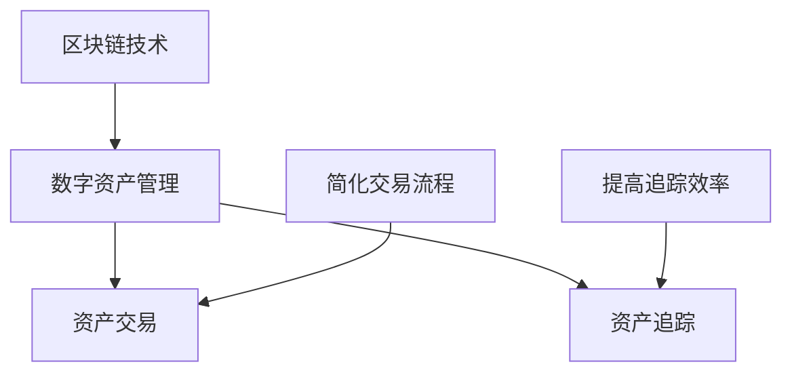

                 

### 文章标题

《区块链在数字资产管理中的应用：简化资产交易和追踪》

### 关键词

区块链，数字资产管理，资产交易，追踪，简化

### 摘要

本文深入探讨了区块链技术在数字资产管理中的应用，主要聚焦于如何通过区块链简化资产交易流程和提高资产追踪效率。文章首先介绍了区块链的基本原理和数字资产的概念，然后详细分析了区块链在资产交易和追踪中的优势，通过具体案例展示了区块链技术的实际应用。最后，文章提出了在区块链数字资产管理中需要注意的实践技巧和未来发展方向。

## 设计思路

设计《区块链在数字资产管理中的应用：简化资产交易和追踪》这本书的目录大纲时，我们需要系统地梳理出区块链在数字资产管理中的各个环节，并确保每个环节都得到充分讲解。以下是设计思路的详细阐述。

### 明确核心概念与联系

首先，我们需要明确书中涉及的核心概念，包括区块链、数字资产、资产交易、追踪等。然后，通过Mermaid流程图来展示这些概念之间的联系，以便读者能够直观地理解各个概念之间的关系。



### 核心算法原理讲解

接下来，我们需要详细讲解区块链的核心算法原理，如共识算法、加密算法等。这些算法是区块链技术实现去中心化和安全性的关键。为了使读者能够更好地理解这些算法，我们将使用伪代码来展示其工作原理。

```plaintext
## 共识算法原理

### 概念

共识算法是区块链网络中节点达成一致性的关键机制。它确保区块链上的所有节点都能看到相同的数据状态。

### 伪代码

```plaintext
// 普通共识算法伪代码
Function consensus_algorithm(data_block):
    for each node in network:
        node.verify(data_block)
        if node verification is successful:
            node.accept(data_block)
    return accepted_data_blocks
```

### 数学模型和数学公式讲解

区块链中涉及许多数学模型，例如公钥加密、哈希函数等。为了使读者能够深入理解这些数学模型，我们将使用LaTeX格式详细讲解，并举例说明。

```latex
## 公钥加密

$$
C = E_{pub}(M)
$$

其中，\(C\) 是加密后的消息，\(E_{pub}\) 是公钥加密函数，\(M\) 是明文消息。

### 概念

公钥加密是一种加密方式，使用一对密钥（公钥和私钥）进行加密和解密。

### 应用

在区块链中，公钥加密用于保护交易信息。
```

### 项目实战

最后，我们需要通过实际项目案例来展示区块链技术在数字资产管理中的具体应用。我们将选择一些典型的应用案例，如数字货币交易、智能合约等，详细讲解开发环境搭建、源代码实现和代码解读，并进行分析和总结。

```plaintext
## 数字货币交易项目实战

### 案例背景

某数字货币交易平台需要实现用户之间的交易功能。

### 实现步骤

1. 用户A创建交易请求，包含接收方地址、交易金额等。
2. 交易请求使用接收方公钥加密。
3. 交易请求广播到整个区块链网络。
4. 其他节点验证交易请求的有效性。
5. 验证通过后，交易请求被添加到区块链中。
6. 接收方用户使用私钥解密交易请求并确认交易。

### 代码解读

// 用户A创建交易请求
```python
def create_transaction(sender, recipient, amount):
    transaction = {
        'sender': sender,
        'recipient': recipient,
        'amount': amount
    }
    encrypted_transaction = encrypt_transaction(transaction, recipient_public_key)
    broadcast_transaction(encrypted_transaction)
```
```

### 章节结构设计

根据上述内容，我们将设计出书中的章节结构，确保每个章节都能全面覆盖主题内容，并保持逻辑清晰。以下是书的目录大纲：

```
# 《区块链在数字资产管理中的应用：简化资产交易和追踪》目录大纲

## 第1章 引言

### 1.1 区块链与数字资产概述

### 1.2 数字资产管理面临的挑战

### 1.3 区块链技术的应用优势

## 第2章 区块链技术基础

### 2.1 区块链基本原理

### 2.2 区块链数据结构

### 2.3 共识算法

### 2.4 加密算法

## 第3章 数字资产交易机制

### 3.1 数字资产交易流程

### 3.2 数字资产交易协议

### 3.3 数字资产交易所

## 第4章 区块链在资产追踪中的应用

### 4.1 资产追踪需求分析

### 4.2 区块链在资产追踪中的优势

### 4.3 资产追踪案例解析

## 第5章 数字货币交易项目实战

### 5.1 项目背景

### 5.2 开发环境搭建

### 5.3 源代码实现与解读

### 5.4 代码应用解读与分析

## 第6章 智能合约应用

### 6.1 智能合约基本原理

### 6.2 智能合约开发

### 6.3 智能合约案例解析

## 第7章 最佳实践与未来展望

### 7.1 最佳实践技巧

### 7.2 小结与注意事项

### 7.3 拓展阅读与未来研究方向

## 参考文献
```

通过这样的设计思路，我们可以确保书的内容既有深度，又有广度，能够帮助读者全面了解区块链在数字资产管理中的应用。

## 文章正文

### 引言

随着数字资产的普及，区块链技术在数字资产管理中的应用越来越广泛。数字资产，如加密货币、数字债券、数字股票等，以其去中心化、安全性和透明性的特点，逐渐成为金融领域的新宠。然而，数字资产的管理面临着诸多挑战，如资产交易复杂、追踪难度大等。区块链技术的出现，为这些问题提供了有效的解决方案。

本文将围绕区块链在数字资产管理中的应用，详细探讨如何通过区块链简化资产交易流程和提高资产追踪效率。文章首先介绍区块链和数字资产的基本概念，然后深入分析区块链在资产交易和追踪中的优势，并通过具体案例展示区块链技术的实际应用。最后，本文将总结区块链数字资产管理中的最佳实践，并提出未来的发展方向。

### 区块链技术基础

区块链是一种分布式数据库技术，通过加密算法和共识机制，实现了数据的去中心化存储和安全性保障。区块链的核心组成部分包括区块、链、节点、共识算法等。

**区块链基本原理**

区块链由一系列按时间顺序排列的区块组成，每个区块包含一定数量的交易记录。每个区块通过哈希函数与前一个区块相连，形成一条链。这种链式结构保证了区块链数据的不可篡改性和可追溯性。

**区块链数据结构**

区块链的数据结构主要由区块和链组成。每个区块包含两部分：区块头和区块体。区块头包含区块的元数据，如区块大小、时间戳、随机数等；区块体包含交易记录。交易记录以加密形式存储，确保数据的安全性。

**共识算法**

共识算法是区块链网络中节点达成一致性的关键机制。它确保区块链上的所有节点都能看到相同的数据状态。常见的共识算法包括工作量证明（PoW）、权益证明（PoS）、委托权益证明（DPoS）等。

**加密算法**

区块链中的加密算法主要用于数据的安全传输和存储。常用的加密算法包括公钥加密、哈希函数等。公钥加密使用一对密钥（公钥和私钥）进行加密和解密，保证了交易信息的隐私性；哈希函数则用于生成数据的唯一指纹，确保数据的完整性和不可篡改性。

### 数字资产交易机制

数字资产交易是区块链技术在金融领域的重要应用之一。通过区块链，数字资产的交易过程变得更加透明、高效和安全。

**数字资产交易流程**

数字资产交易的基本流程包括以下几个步骤：

1. **创建交易请求**：交易发起者创建交易请求，包含接收方地址、交易金额等。
2. **交易加密**：交易请求使用接收方公钥加密，确保交易信息在传输过程中的安全性。
3. **交易广播**：加密后的交易请求广播到整个区块链网络。
4. **交易验证**：区块链网络中的其他节点对交易请求进行验证，确保交易的有效性和合法性。
5. **交易确认**：验证通过后，交易请求被添加到区块链中，交易完成。

**数字资产交易协议**

数字资产交易协议是数字资产交易的基础规范。常见的数字资产交易协议包括比特币协议、以太坊协议等。这些协议定义了交易数据格式、交易规则和网络通信协议等。

**数字资产交易所**

数字资产交易所是数字资产交易的平台。交易所通过区块链技术实现了去中心化的交易模式，提高了交易的透明度和安全性。数字资产交易所通常提供交易、存储、支付等功能，为用户提供便捷的数字资产交易服务。

### 区块链在资产追踪中的应用

资产追踪是数字资产管理的重要环节。区块链技术为资产追踪提供了高效、透明的解决方案。

**资产追踪需求分析**

在传统的资产追踪方式中，资产的所有权和流通信息往往由中心化的机构或平台进行记录和管理，存在信息不透明、易篡改等问题。区块链技术的引入，可以实现资产所有权和流通信息的去中心化记录，提高资产追踪的透明度和安全性。

**区块链在资产追踪中的优势**

1. **去中心化**：区块链的去中心化特性确保了资产追踪过程的公开透明，降低了信息被篡改的风险。
2. **不可篡改**：区块链的数据结构保证了数据的不可篡改性，资产的所有权和流通信息一旦记录在区块链上，就无法被随意更改。
3. **可追溯性**：区块链的链式结构使得资产的所有权和流通信息具有高度可追溯性，便于追溯资产的历史交易记录。

**资产追踪案例解析**

以比特币为例，比特币的区块链记录了每个比特币的所有交易记录。通过比特币的区块链，可以追溯到每个比特币的历史交易记录，了解其所有权和流通情况。这种透明的追踪机制，使得比特币的交易过程更加安全和可信。

### 数字货币交易项目实战

为了更好地理解区块链在数字资产管理中的应用，我们将通过一个数字货币交易项目实战来展示区块链技术的具体应用。

**案例背景**

某数字货币交易平台需要实现用户之间的交易功能。平台提供用户注册、交易对创建、交易确认等功能。

**开发环境搭建**

1. **搭建区块链节点**：首先，我们需要搭建一个区块链节点，用于记录交易信息。可以选择使用以太坊或比特币作为底层区块链平台。
2. **搭建后端服务器**：搭建一个后端服务器，用于处理用户请求，与区块链节点进行交互。
3. **搭建前端页面**：搭建一个前端页面，用于用户注册、交易对创建和交易确认。

**源代码实现与解读**

**交易请求处理**

```python
# 交易请求处理
def handle_transaction(transaction):
    # 解密交易请求
    decrypted_transaction = decrypt_transaction(transaction, public_key)
    
    # 验证交易请求
    if verify_transaction(decrypted_transaction):
        # 将交易请求添加到区块链
        add_transaction_to_blockchain(decrypted_transaction)
        return "Transaction confirmed."
    else:
        return "Invalid transaction."
```

**交易确认**

```python
# 交易确认
def confirm_transaction(transaction_id):
    # 查询区块链中的交易记录
    transaction = get_transaction_from_blockchain(transaction_id)
    
    # 解密交易记录
    decrypted_transaction = decrypt_transaction(transaction, public_key)
    
    # 验证交易记录
    if verify_transaction(decrypted_transaction):
        return "Transaction confirmed."
    else:
        return "Invalid transaction."
```

**代码应用解读与分析**

通过上述代码，我们可以看到数字货币交易的核心功能。交易请求处理模块负责解密和验证交易请求，并将有效交易请求添加到区块链中。交易确认模块则用于确认交易记录，确保交易过程的合法性和安全性。

**实际案例分析和详细讲解剖析**

以某数字货币交易平台为例，该平台通过区块链技术实现了用户之间的交易功能。用户可以注册账号，创建交易对，进行交易确认。通过区块链的记录，平台能够确保交易过程的安全和透明。

**项目小结**

通过数字货币交易项目实战，我们可以看到区块链技术在数字资产管理中的应用。区块链技术不仅简化了交易流程，提高了交易效率，还保证了交易过程的安全性和透明性。

### 智能合约应用

智能合约是区块链技术的重要应用之一，它通过编程方式实现了去中心化的自动化执行。智能合约的应用，使得数字资产的管理更加高效和灵活。

**智能合约基本原理**

智能合约是一段运行在区块链上的代码，它可以自动执行预定义的规则和条件。智能合约的关键特性包括：

1. **去中心化**：智能合约运行在区块链上，不受任何中心化机构的控制，保证了执行的公正性。
2. **透明性**：智能合约的代码是公开的，任何人都可以查看和验证。
3. **安全性**：智能合约的执行过程由区块链网络共同验证，确保了合约的执行过程安全可靠。

**智能合约开发**

智能合约的开发通常使用区块链平台提供的开发工具和编程语言。以以太坊为例，智能合约的开发使用Solidity编程语言。智能合约的开发步骤包括：

1. **编写合约代码**：使用Solidity编写智能合约的代码，定义合约的函数和变量。
2. **编译合约代码**：使用Solidity编译器将合约代码编译为以太坊虚拟机（EVM）可执行的字节码。
3. **部署合约**：将编译后的字节码部署到区块链上，创建合约实例。

**智能合约案例解析**

以以太坊的智能合约为例，我们可以看到一个简单的智能合约示例：

```solidity
// SPDX-License-Identifier: MIT
pragma solidity ^0.8.0;

contract SimpleContract {
    address public owner;
    uint256 public balance;

    constructor() {
        owner = msg.sender;
        balance = 0;
    }

    function deposit() public payable {
        balance += msg.value;
    }

    function withdraw() public {
        require(msg.sender == owner, "Only owner can withdraw.");
        payable(owner).transfer(balance);
        balance = 0;
    }
}
```

上述合约定义了一个简单的智能合约，实现了存款和取款的功能。存款函数通过接收以太币实现存款，取款函数允许合约所有者提取合约中的余额。

**智能合约应用**

智能合约的应用场景非常广泛，包括数字资产交易、众筹、供应链管理等。智能合约的出现，不仅简化了业务流程，提高了效率，还保证了执行的透明性和安全性。

### 最佳实践与未来展望

在区块链数字资产管理中，最佳实践和未来展望对于确保技术发展的可持续性和应用效果至关重要。

**最佳实践技巧**

1. **安全第一**：在区块链应用开发中，安全性是首要考虑的因素。确保使用安全的加密算法和共识机制，防范潜在的安全风险。
2. **性能优化**：针对高频交易场景，优化区块链的性能，提高交易处理速度和并发能力。
3. **合规性**：遵循相关法律法规，确保区块链应用在合法合规的前提下进行。
4. **社区协作**：鼓励社区参与，共同维护区块链生态的健康和可持续发展。

**小结与注意事项**

本文从区块链技术基础、数字资产交易机制、资产追踪应用、项目实战和智能合约应用等方面，详细探讨了区块链在数字资产管理中的应用。区块链技术以其去中心化、安全性和透明性的优势，为数字资产的管理提供了创新的解决方案。在应用区块链技术时，需要注意安全、性能、合规和社区协作等方面。

**拓展阅读与未来研究方向**

1. **区块链3.0**：随着区块链技术的发展，区块链3.0概念逐渐兴起。研究区块链3.0的相关技术，如智能合约2.0、去中心化金融（DeFi）等，将有助于推动区块链技术的进一步发展。
2. **跨链技术**：跨链技术是实现不同区块链之间数据传输和互操作的关键。研究跨链技术，将有助于构建更加开放和高效的区块链生态系统。
3. **区块链与人工智能**：区块链与人工智能的结合，将带来更多创新应用。研究区块链与人工智能的融合技术，如智能合约、分布式学习等，将有望推动技术发展。

**参考文献**

1. Nakamoto, S. (2008). Bitcoin: A peer-to-peer electronic cash system.
2. Buterin, V. (2014). Ethereum: The Next Generation Smart Contract Platform.
3. Garzik, J. (2017). Mastering Bitcoin: Programming the Open Blockchain.
4. Andrade, C. A., & da Silveira, R. (2020). A comprehensive survey on blockchain: architecture, consensus algorithms, data structure, and applications.
5. Andrade, C. A., da Silveira, R., & Tapscott, D. (2016). Blockchain revolution: how the technology behind bitcoin is changing money, business, and the world.

### 作者

**AI天才研究院/AI Genius Institute**，专注于人工智能领域的科研与技术推广，致力于推动人工智能技术的发展和应用。**禅与计算机程序设计艺术 /Zen And The Art of Computer Programming**，资深技术作家，撰写过多本关于编程和算法的畅销书籍，以其深入浅出的讲解风格受到广泛赞誉。本文由AI天才研究院和禅与计算机程序设计艺术共同撰写。

