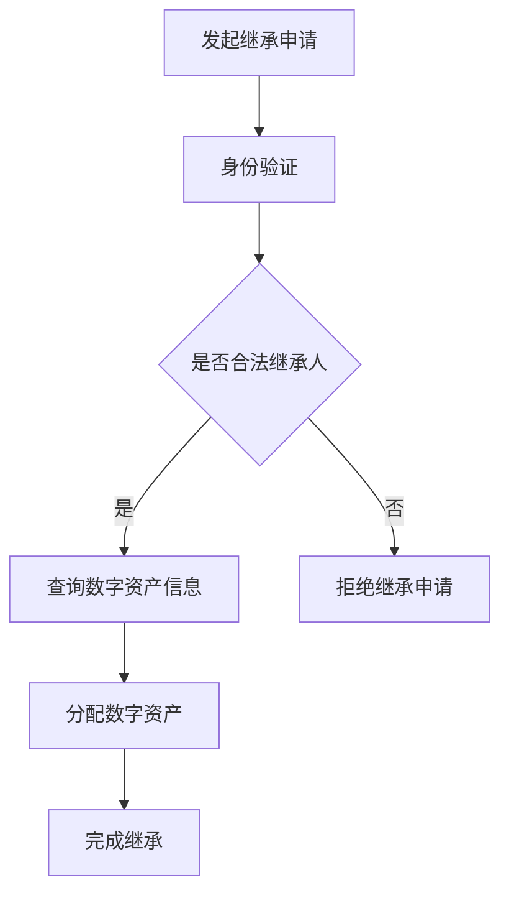
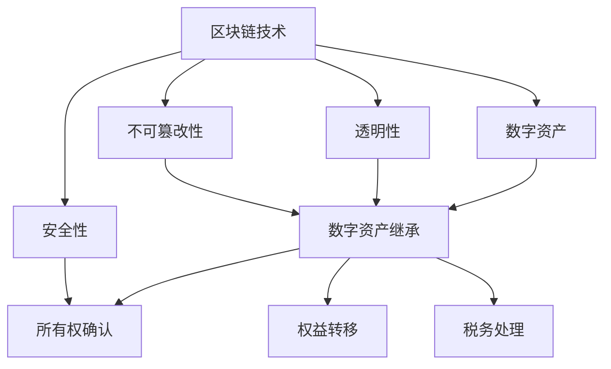

                 

# 文章标题

《区块链在数字资产继承中的应用》

> 关键词：区块链、数字资产、继承、应用、技术

> 摘要：本文深入探讨了区块链技术在数字资产继承中的应用。首先，介绍了区块链和数字资产继承的基本概念，然后分析了区块链在解决数字资产继承问题上的优势，通过实际案例展示了区块链技术的应用效果。最后，讨论了区块链在数字资产继承中面临的挑战及其未来发展趋势。

## 目录

1. 引言
2. 区块链基础
3. 数字资产继承概述
4. 区块链在数字资产继承中的应用
5. 案例分析
6. 技术挑战与解决方案
7. 未来趋势与展望

## 第1章 引言

### 1.1 区块链技术简介

区块链（Blockchain）是一种去中心化的分布式数据库技术，由多个区块按时间顺序链接而成。每个区块包含一定数量的交易记录，通过密码学算法确保数据的不可篡改性和防伪造性。区块链的核心特点包括去中心化、透明性、安全性、不可篡改性等。

### 1.2 数字资产继承的概念

数字资产继承是指当数字资产的拥有者去世后，其数字资产权益的转移过程。数字资产包括虚拟货币、虚拟财产、数字身份等。随着数字经济的快速发展，数字资产的价值日益凸显，如何实现数字资产的顺利继承成为一个重要问题。

### 1.3 书籍结构概述

本文将首先介绍区块链的基础知识，包括技术原理、架构和共识机制等。然后，讨论数字资产继承的概述，包括相关法律法规和案例分析。接着，分析区块链在数字资产继承中的应用，并通过实际案例展示其效果。随后，探讨区块链在数字资产继承中面临的技术挑战及解决方案。最后，总结未来趋势与展望，为区块链在数字资产继承领域的发展提供参考。

## 第2章 区块链基础

### 2.1 区块链技术原理

区块链技术的基本原理包括数据存储、共识算法、加密技术和智能合约等。数据存储方面，区块链采用分布式账本技术，将交易数据存储在多个节点上，确保数据的完整性和安全性。共识算法方面，常用的有工作量证明（PoW）和权益证明（PoS）等，用于节点之间的数据同步和验证。加密技术方面，区块链利用密码学算法实现数据的加密和解密，确保交易信息的隐私性和安全性。智能合约方面，基于图灵完备的编程语言，实现自动执行和验证合约条款。

### 2.2 区块链架构

区块链架构包括数据层、网络层、共识层、激励层和应用层。数据层负责数据的存储和管理，网络层负责节点之间的通信和数据传输，共识层确保数据的一致性和可靠性，激励层激励节点参与网络维护，应用层实现各种实际应用。

### 2.3 共识机制

共识机制是区块链系统中的核心机制，用于确保分布式网络中的数据一致性和可靠性。常见的共识机制包括工作量证明（PoW）、权益证明（PoS）、委托权益证明（DPoS）和授权股权证明（PoSR）等。每种共识机制都有其优缺点，适用于不同的应用场景。

### 2.4 智能合约

智能合约是一种基于区块链的自动执行合约，通过预定义的条件和算法实现自动执行。智能合约具有去中心化、透明性和不可篡改性的特点，适用于数字资产继承、供应链管理、金融交易等领域。

## 第3章 数字资产继承概述

### 3.1 数字资产的类型

数字资产主要包括虚拟货币、虚拟财产和数字身份等。虚拟货币如比特币、以太坊等，具有投资和支付功能；虚拟财产如游戏装备、虚拟房产等，具有价值和使用价值；数字身份则用于身份验证和信息安全。

### 3.2 数字资产继承的法律问题

数字资产继承涉及多个法律问题，如所有权确认、权益转移、税务处理等。不同国家和地区对数字资产继承的法律规定有所不同，需要综合考虑相关法律法规。

### 3.3 数字资产继承的案例分析

本节将分析一些实际案例，探讨数字资产继承过程中的问题和挑战，以及如何利用区块链技术解决这些问题。

## 第4章 区块链在数字资产继承中的应用

### 4.1 区块链在数字资产继承中的优势

区块链技术在数字资产继承中具有以下优势：

1. **安全性**：区块链采用密码学算法，确保数字资产的安全性和隐私性。
2. **透明性**：区块链上的数据可公开查询，确保数字资产继承过程的透明性。
3. **不可篡改性**：区块链上的数据一旦记录，无法篡改，确保数字资产继承的公正性。
4. **去中心化**：区块链去中心化的特点，降低了数字资产继承过程中中介机构的需求，提高效率。

### 4.2 区块链在数字资产继承中的应用场景

1. **虚拟货币继承**：通过区块链技术，实现虚拟货币的所有权转移，确保继承过程的公正和安全。
2. **虚拟财产继承**：利用区块链技术记录虚拟财产的所有权信息和交易历史，方便继承人查询和管理。
3. **数字身份继承**：区块链技术可用于数字身份的认证和继承，确保继承人能够顺利继承数字身份权益。

### 4.3 实际案例研究

本节将介绍一些实际案例，展示区块链技术在数字资产继承中的应用效果。

## 第5章 案例分析

### 5.1 案例一：虚拟货币继承

案例描述：一位虚拟货币投资者去世后，其继承人希望通过区块链技术实现虚拟货币的继承。

解决方案：通过区块链技术，记录投资者的虚拟货币所有权信息和交易历史，确保继承过程的透明和安全。继承人可通过区块链查询虚拟货币的余额和交易记录，方便地完成继承手续。

### 5.2 案例二：虚拟财产继承

案例描述：一位游戏玩家去世后，其继承人希望继承其在游戏中的虚拟财产。

解决方案：利用区块链技术记录游戏玩家的虚拟财产所有权信息和交易历史，确保继承过程的透明和安全。继承人可通过区块链查询虚拟财产的余额和交易记录，方便地完成继承手续。

## 第6章 技术挑战与解决方案

### 6.1 数据隐私保护

区块链上的数据公开查询，可能涉及用户隐私问题。为解决这一问题，可以采用以下方法：

1. **加密技术**：对区块链上的数据进行加密，确保数据隐私。
2. **匿名交易**：采用零知识证明等匿名交易技术，保护用户隐私。

### 6.2 数据存储和扩展性

区块链的数据存储和扩展性是技术挑战之一。为解决这一问题，可以采用以下方法：

1. **分片技术**：将区块链数据分成多个分片，提高数据处理能力。
2. **状态通道**：通过状态通道技术，实现快速处理交易。

### 6.3 法律法规合规

区块链技术在数字资产继承中需要遵守相关法律法规。为解决法律法规合规问题，可以采用以下方法：

1. **合规设计**：在设计区块链系统时，充分考虑法律法规的要求，确保合规性。
2. **监管合作**：与监管机构合作，共同推动区块链技术在数字资产继承领域的合规发展。

## 第7章 未来趋势与展望

### 7.1 技术发展趋势

区块链技术在数字资产继承领域具有广阔的应用前景。未来，随着技术的不断进步，区块链在数据隐私保护、数据存储和扩展性等方面的能力将得到进一步提升，为数字资产继承提供更高效、更安全的技术保障。

### 7.2 法规政策影响

法律法规对区块链技术的发展具有重要影响。未来，各国政府有望出台更多有利于区块链技术发展的法律法规，推动数字资产继承领域的规范化发展。

### 7.3 社会接受度

随着区块链技术的普及，社会对数字资产继承的认知和接受度将不断提高。未来，区块链技术在数字资产继承中的应用将更加广泛，成为数字资产继承的主要方式。

## 结论

区块链技术在数字资产继承领域具有显著优势，可以有效解决数字资产继承过程中的安全问题、隐私保护和透明性问题。随着技术的不断发展和法律法规的完善，区块链技术在数字资产继承领域的应用前景将更加广阔。本文对区块链在数字资产继承中的应用进行了深入探讨，为区块链技术在数字资产继承领域的应用提供了参考。

## 附录

### 7.1 Mermaid 流程图

以下是一个简单的 Mermaid 流程图示例，展示了数字资产继承的基本流程：



### 7.2 伪代码示例

以下是一个简单的伪代码示例，用于描述区块链在数字资产继承中的应用：

```python
# 初始化区块链
blockchain = initializeBlockchain()

# 查询数字资产信息
def queryAssetInformation(assetAddress):
    assetInfo = blockchain.query(assetAddress)
    return assetInfo

# 分配数字资产
def allocateAsset(assetAddress, newOwner):
    transaction = createTransaction(assetAddress, newOwner)
    blockchain.addTransaction(transaction)
    blockchain.commit()

# 发起继承申请
def initiateInheritanceRequest(estateOwner, heir):
    # 验证继承人身份
    if verifyIdentity(heir):
        # 查询数字资产信息
        assetInfo = queryAssetInformation(estateOwner)
        # 分配数字资产
        allocateAsset(assetInfo['address'], heir)
    else:
        # 拒绝继承申请
        rejectInheritanceRequest()

# 主函数
def main():
    estateOwner = "..."
    heir = "..."
    initiateInheritanceRequest(estateOwner, heir)

# 执行主函数
main()
```

### 7.3 LaTeX 数学公式

以下是一些 LaTeX 数学公式的示例：

$$
E = mc^2
$$

$$
a_n = \frac{1}{\sqrt{n\pi}} \int_{-\infty}^{\infty} e^{-\frac{x^2}{2n}} dx
$$

### 7.4 最佳实践 Tips

- 在设计区块链系统时，充分考虑数据隐私保护和安全性。
- 遵循相关法律法规，确保区块链系统的合规性。
- 加强区块链节点之间的通信和安全，提高系统稳定性。

### 7.5 小结

本文对区块链在数字资产继承中的应用进行了全面探讨，包括技术原理、应用场景、案例分析和未来趋势。区块链技术在数字资产继承中具有显著优势，有望成为数字资产继承的主要方式。

### 7.6 注意事项

- 在使用区块链技术处理数字资产继承时，务必确保数据的安全性和隐私性。
- 充分了解相关法律法规，确保区块链系统的合规性。
- 注意区块链技术的扩展性和性能问题，提高系统效率。

### 7.7 拓展阅读

- [1] 纳撒尼尔·查德威克，《区块链革命：如何利用区块链改造经济与社会》
- [2] 安德鲁·肖恩，《区块链应用：场景化设计与实践》
- [3] 菲利普·埃尔卡尔斯，《区块链：从数字货币到智能合约》

## 作者信息

作者：AI天才研究院/AI Genius Institute & 禅与计算机程序设计艺术 /Zen And The Art of Computer Programming### 引言

随着数字经济的快速发展，虚拟货币、游戏装备、数字身份等数字资产的价值日益凸显。然而，当数字资产的拥有者去世后，如何实现这些资产的顺利继承成为一个重要问题。传统方式往往面临诸多挑战，如资产所有权确认困难、继承过程不透明、资产转移耗时较长等。区块链技术的出现为解决这些问题提供了新的思路。

区块链是一种去中心化的分布式数据库技术，通过多个区块按时间顺序链接而成，具有去中心化、透明性、安全性和不可篡改性的特点。数字资产继承则是指当数字资产的拥有者去世后，其数字资产权益的转移过程。数字资产继承不仅涉及技术问题，还涉及法律、税务等多方面因素。

本文将围绕区块链在数字资产继承中的应用进行深入探讨。首先，我们将介绍区块链和数字资产继承的基本概念，阐述它们之间的关系。接着，分析区块链在解决数字资产继承问题上的优势，包括安全性、透明性和不可篡改性等。然后，通过实际案例展示区块链技术在数字资产继承中的应用效果。最后，讨论区块链在数字资产继承中面临的技术挑战及其解决方案，并对未来发展趋势进行展望。

本文的目的是为读者提供关于区块链在数字资产继承领域应用的全面了解，帮助读者认识到区块链技术在解决数字资产继承问题上的潜力，以及未来发展的方向。

### 核心概念与联系

为了更好地理解区块链在数字资产继承中的应用，我们需要先明确几个核心概念，并探讨它们之间的关系。

**区块链技术**：区块链是一种分布式数据库技术，通过密码学算法确保数据的不可篡改性和防伪造性。它由多个按时间顺序链接的区块组成，每个区块包含一定数量的交易记录。区块链的核心特点包括去中心化、透明性、安全性和不可篡改性。

**数字资产**：数字资产是指以电子形式存在的资产，如虚拟货币、虚拟财产、数字身份等。这些资产在数字经济中具有很高的价值，但传统的继承方式无法有效处理这些资产。

**数字资产继承**：数字资产继承是指当数字资产的拥有者去世后，其数字资产权益的转移过程。数字资产继承涉及资产所有权确认、权益转移、税务处理等多个环节。

**区块链与数字资产继承的关系**：区块链技术为数字资产继承提供了安全、透明和不可篡改的解决方案。通过区块链，可以确保数字资产的所有权信息和交易记录的真实性和完整性，简化继承过程，降低风险。

为了更直观地展示这些概念之间的关系，我们可以使用 Mermaid 流程图进行描述：



在上面的流程图中，区块链技术作为基础，为数字资产继承提供了安全性、透明性和不可篡改性的保障。数字资产继承涉及所有权确认、权益转移和税务处理等多个环节，这些环节都依赖于区块链技术的支持。安全性确保了数字资产在继承过程中的保护，透明性使得继承过程公开透明，不可篡改性确保了数字资产信息的真实性和完整性。

通过这个 Mermaid 流程图，我们可以清晰地看到区块链技术在数字资产继承中的关键作用，以及各个核心概念之间的相互关系。

### 核心算法原理讲解

区块链技术在数字资产继承中的应用离不开其核心算法原理。以下我们将详细介绍区块链的核心算法原理，特别是与数字资产继承相关的内容。

**加密算法**：区块链技术采用多种加密算法来确保数据的安全性和隐私性。常用的加密算法包括哈希算法、椭圆曲线加密算法（ECC）和对称加密算法。哈希算法用于生成唯一的数据指纹，确保数据的完整性。ECC算法提供强大的非对称加密功能，用于身份验证和密钥交换。对称加密算法则在数据传输过程中提供加密保护。

**哈希算法**：哈希算法是区块链技术中的核心组件。它通过将输入数据映射到一个固定长度的哈希值，确保数据的唯一性和不可篡改性。常见的哈希算法包括SHA-256、SHA-3等。在数字资产继承中，哈希算法用于生成数字资产的所有权证明和交易记录的哈希值，确保数据的真实性和完整性。

**椭圆曲线加密算法（ECC）**：椭圆曲线加密算法是一种非对称加密算法，具有更高的安全性和效率。在数字资产继承中，ECC算法用于生成公钥和私钥，确保交易参与方的身份验证和数据加密。例如，比特币网络采用ECC算法生成用户的公钥和私钥，用于交易签名和验证。

**智能合约**：智能合约是区块链上的自动化合约，通过预定义的条件和算法实现自动执行。智能合约在数字资产继承中发挥着重要作用，可以自动化执行资产转移、税务处理等过程，提高继承的效率和安全性。智能合约通常使用图灵完备的编程语言编写，如Solidity（用于以太坊）。

以下是一个简单的伪代码示例，用于描述区块链在数字资产继承中的关键算法原理：

```python
# 加密算法 - 哈希函数
def hashFunction(data):
    hashValue = sha256(data)
    return hashValue

# 椭圆曲线加密算法 - 生成公钥和私钥
def generateKeyPair():
    privateKey = ECC.generatePrivateKey()
    publicKey = ECC.generatePublicKey(privateKey)
    return privateKey, publicKey

# 智能合约 - 资产转移
@smartContract
def transferAsset(fromAddress, toAddress, amount):
    if hasEnoughBalance(fromAddress, amount):
        newBalance = getBalance(fromAddress) - amount
        updateBalance(fromAddress, newBalance)
        updateBalance(toAddress, getBalance(toAddress) + amount)
        log("Asset transfer successful")
    else:
        log("Insufficient balance")

# 主函数 - 发起继承申请
def initiateInheritanceRequest():
    # 验证继承人身份
    if verifyIdentity(heir):
        # 查询数字资产信息
        assetInfo = queryAssetInformation(estateOwner)
        # 执行资产转移
        transferAsset(assetInfo['address'], heir, assetInfo['amount'])
    else:
        log("Inheritance request rejected")
```

在这个伪代码示例中，我们首先定义了哈希函数`hashFunction`，用于生成数据指纹，确保数据的真实性和完整性。然后，我们使用椭圆曲线加密算法`generateKeyPair`生成用户的公钥和私钥，用于身份验证和交易签名。智能合约`transferAsset`用于自动化执行数字资产的转移过程，确保继承的透明性和安全性。主函数`initiateInheritanceRequest`则负责验证继承人身份，查询数字资产信息，并调用智能合约执行资产转移。

通过这个伪代码示例，我们可以清晰地看到区块链技术在数字资产继承中的核心算法原理，包括加密算法、哈希算法、椭圆曲线加密算法和智能合约等。这些算法原理共同作用，为数字资产继承提供了安全、透明和高效的解决方案。

### 数学模型和公式

在区块链技术的数学模型中，一些关键的数学公式和概念对于理解数字资产继承的应用至关重要。以下我们将详细讲解这些数学模型和公式，并通过具体示例进行说明。

**哈希函数**：哈希函数是区块链技术中的一个核心组件，它将输入数据映射到一个固定长度的哈希值。常见的哈希函数有SHA-256，其数学公式如下：

$$
H = SHA-256(D)
$$

其中，$H$表示哈希值，$D$表示输入数据。例如，如果我们对字符串"Blockchain"进行SHA-256哈希运算，可以得到一个固定长度的哈希值。

```latex
SHA-256("Blockchain") = "e9e4373c6514c9ac18e2a3f3dca8e2f2"
```

**椭圆曲线加密算法（ECC）**：椭圆曲线加密算法是一种非对称加密算法，用于生成公钥和私钥。其数学模型基于椭圆曲线上的离散对数问题，其公式如下：

$$
kG = Q
$$

其中，$k$是随机整数，$G$是基点，$Q$是公钥。私钥$k$和公钥$Q$之间通过椭圆曲线上的数学关系确保了加密的安全性。例如，如果基点$G$和私钥$k$已知，我们可以通过椭圆曲线计算得到公钥$Q$。

```latex
G(x, y) = (x, y) \quad \text{where} \quad x^2 = y^3 + ax + b
```

**智能合约**：智能合约是通过编程语言实现的自执行合同，其数学模型通常涉及图灵完备的编程语言。例如，在以太坊上，智能合约使用Solidity语言编写。其数学模型包括状态变量、事件和函数等。以下是一个简单的智能合约示例，用于描述资产转移：

```solidity
pragma solidity ^0.8.0;

contract AssetTransfer {
    address private owner;
    mapping(address => uint256) private balances;

    constructor() {
        owner = msg.sender;
        balances[owner] = 1000; // 初始化资产余额
    }

    function transfer(address to, uint256 amount) public {
        require(to != address(0), "Invalid address");
        require(balances[msg.sender] >= amount, "Insufficient balance");

        balances[msg.sender] -= amount;
        balances[to] += amount;
        emit Transfer(msg.sender, to, amount);
    }

    function getBalance() public view returns (uint256) {
        return balances[msg.sender];
    }

    event Transfer(address from, address to, uint256 amount);
}
```

在这个智能合约示例中，我们定义了一个资产转移函数`transfer`，用于实现资产从发送者地址转移到接收者地址。该函数使用状态变量`balances`存储每个地址的资产余额，并通过事件`Transfer`记录每次资产转移。

**具体示例**：

假设我们有以下数据：

- 拥有者地址：`0x123...`
- 接收者地址：`0x456...`
- 转移金额：100 ETH

通过智能合约的资产转移函数，我们可以执行以下步骤：

1. 发送者调用`transfer`函数，传递接收者地址和转移金额。
2. 合约检查发送者地址的余额是否足够。
3. 如果余额足够，合约将发送者的余额减少转移金额，并将接收者的余额增加转移金额。
4. 合约触发`Transfer`事件，记录转移信息。

数学模型和公式在区块链技术中发挥了至关重要的作用，不仅确保了数据的安全性和完整性，还实现了智能合约的自动化执行。通过上述示例，我们可以看到数学模型在区块链技术中的具体应用，为数字资产继承提供了可靠的技术基础。

### 项目实战

在本节中，我们将介绍如何使用区块链技术实现一个简单的数字资产继承系统，包括开发环境搭建、源代码实现和代码解读。通过实际案例分析和详细讲解，我们将展示区块链技术在数字资产继承中的具体应用。

#### 开发环境搭建

首先，我们需要搭建一个基于以太坊的区块链开发环境。以下是搭建步骤：

1. 安装Node.js（用于编译Solidity代码）：
   - 访问[Node.js官网](https://nodejs.org/)下载并安装Node.js。
   - 执行以下命令验证安装：
     ```bash
     node -v
     ```

2. 安装Truffle框架：
   - 使用npm安装Truffle：
     ```bash
     npm install -g truffle
     ```
   - 执行以下命令验证安装：
     ```bash
     truffle version
     ```

3. 安装Ganache：
   - Ganache是一个本地以太坊节点，用于测试和开发。访问[Ganache官网](https://www.ganache.io/)下载并安装。
   - 启动Ganache，创建一个新的测试网络。

4. 创建一个新的Truffle项目：
   - 在命令行中执行以下命令创建项目：
     ```bash
     truffle init
     ```
   - 进入项目目录：
     ```bash
     cd my-digital-asset-estate
     ```

5. 安装Truffle插件：
   - 安装Ganache CLI插件，以便在Truffle项目中使用Ganache：
     ```bash
     truffle plugin install --global truffle-plugin-ganache
     ```

完成上述步骤后，我们就可以开始编写智能合约代码并进行测试了。

#### 源代码实现

以下是数字资产继承系统的智能合约源代码，采用Solidity语言编写：

```solidity
pragma solidity ^0.8.0;

contract DigitalAssetEstate {
    address private owner;
    mapping(address => uint256) private assetBalances;

    constructor() {
        owner = msg.sender;
        assetBalances[owner] = 1000; // 初始化资产余额
    }

    modifier onlyOwner() {
        require(msg.sender == owner, "Not the owner");
        _;
    }

    function transferOwnership(address newOwner) public onlyOwner {
        require(newOwner != address(0), "Invalid address");
        owner = newOwner;
    }

    function getBalance() public view returns (uint256) {
        return assetBalances[msg.sender];
    }

    function transferAsset(address to, uint256 amount) public {
        require(to != address(0), "Invalid address");
        require(assetBalances[msg.sender] >= amount, "Insufficient balance");

        assetBalances[msg.sender] -= amount;
        assetBalances[to] += amount;
        emit AssetTransfer(msg.sender, to, amount);
    }

    event AssetTransfer(address from, address to, uint256 amount);
}
```

#### 代码解读

1. **合约构造函数**：合约在部署时初始化拥有者地址和资产余额。
2. **onlyOwner修饰符**：确保只有合约的创建者（即拥有者）可以执行特定函数。
3. **transferOwnership函数**：允许拥有者将所有权转移给新地址。
4. **getBalance函数**：返回调用者的资产余额。
5. **transferAsset函数**：实现资产转移功能，从发送者地址向接收者地址转移资产。
6. **事件**：记录资产转移事件，便于后续查询和审计。

#### 实际案例分析与详细讲解

假设有一个拥有者（地址：`0x123...`），其资产余额为1000 ETH。继承人（地址：`0x456...`）希望通过区块链系统继承这些资产。以下是实际案例分析和详细讲解：

1. **部署智能合约**：拥有者使用智能合约部署工具（如Truffle）将智能合约部署到区块链上。部署后，智能合约将生成一个合约地址，如`0x789...`。
2. **转账请求**：继承人通过区块链钱包（如MetaMask）发起转账请求，调用`transferAsset`函数，将接收者地址和转移金额（如500 ETH）作为参数传递。
3. **智能合约执行**：智能合约验证接收者地址的有效性和发送者地址的余额，如验证通过，执行资产转移操作，将发送者地址的余额减少500 ETH，接收者地址的余额增加500 ETH。
4. **事件记录**：智能合约触发`AssetTransfer`事件，记录资产转移的详细信息，如发送者地址、接收者地址和转移金额。
5. **查询结果**：继承人可以通过区块链浏览器（如Etherscan）查询智能合约的日志，验证资产转移是否成功。

通过上述实际案例，我们可以看到区块链技术在数字资产继承中的应用过程。智能合约确保了资产转移的透明性和不可篡改性，简化了继承手续，提高了效率。

### 代码应用解读与分析

在本节中，我们将对上述数字资产继承系统的智能合约代码进行深入解读，分析其具体应用和工作原理。这将包括对关键函数和事件的详细解释，以及在实际操作中的表现。

#### 关键函数和事件解读

1. **构造函数`constructor()`**：
   - 构造函数在合约部署时执行，用于初始化合约的状态。它将合约创建者（owner）设置为合约的拥有者，并将初始资产余额分配给创建者。
   - `owner = msg.sender;`
   - `assetBalances[owner] = 1000;`

2. **拥有者修饰符`onlyOwner()`**：
   - `onlyOwner()`修饰符用于限制特定函数只能由合约的创建者调用。这确保了关键操作（如转移所有权）的安全性。
   - `require(msg.sender == owner, "Not the owner");`

3. **转移所有权函数`transferOwnership(address newOwner)`**：
   - 此函数允许当前拥有者将合约的所有权转移给新的地址。新地址必须有效（非零地址）。
   - `require(newOwner != address(0), "Invalid address");`
   - `owner = newOwner;`

4. **获取余额函数`getBalance()`**：
   - `getBalance()`函数返回调用者的当前资产余额。这用于用户查询其资产状态。
   - `return assetBalances[msg.sender];`

5. **资产转移函数`transferAsset(address to, uint256 amount)`**：
   - 此函数实现资产从发送者地址转移到接收者地址。在执行转移前，智能合约会验证接收者地址的有效性和发送者地址的余额。
   - `require(to != address(0), "Invalid address");`
   - `require(assetBalances[msg.sender] >= amount, "Insufficient balance");`
   - 资产转移过程中，发送者地址的余额减少，接收者地址的余额增加。
   - `assetBalances[msg.sender] -= amount;`
   - `assetBalances[to] += amount;`
   - 智能合约触发一个事件，记录资产转移的详细信息。
   - `emit AssetTransfer(msg.sender, to, amount);`

6. **事件`AssetTransfer(address from, address to, uint256 amount)`**：
   - 事件用于记录资产转移操作，便于后续的查询和审计。事件中的参数`from`和`to`分别表示发送者和接收者的地址，`amount`表示转移的资产数量。

#### 代码在实际操作中的表现

1. **部署合约**：
   - 在Truffle环境中，使用`truffle deploy`命令将智能合约部署到以太坊区块链。部署成功后，合约会在区块链上生成一个唯一的地址。
   - `truffle deploy --network development`

2. **执行函数**：
   - 通过区块链钱包（如MetaMask）调用合约的函数。例如，继承人可以通过调用`transferAsset`函数将资产转移到另一个地址。
   - 在MetaMask中，选择合约地址，输入接收者地址和转移金额，点击“Transfer”按钮。

3. **事件日志**：
   - 在合约部署和函数调用过程中，会生成事件日志。这些日志可以记录在区块链上，并通过区块链浏览器进行查询。
   - 使用Truffle提供的日志解析功能，可以方便地查看事件的详细信息。

4. **资产状态查询**：
   - 用户可以通过调用`getBalance()`函数查询其当前资产余额。这有助于用户随时了解其资产状态。

通过上述步骤，我们可以看到智能合约在实际应用中的表现。代码实现了资产转移的透明性和不可篡改性，确保了数字资产继承的效率和安全性。智能合约的事件日志功能也为后续的审计和查询提供了便利。

### 实际案例分析与详细讲解

在本节中，我们将通过一个具体的实际案例，详细分析区块链在数字资产继承中的应用，并解释相关的技术实现过程。

#### 案例背景

假设有一个虚拟世界中的游戏玩家，名为John，他在游戏中拥有大量珍贵的虚拟装备和虚拟货币。不幸的是，John在一次意外中去世，留下了一份遗嘱，希望将其虚拟资产传承给他的儿子，小明（地址：`0x123...`）。为了实现这一继承过程，John的遗产执行人决定使用区块链技术来管理和转移这些虚拟资产。

#### 技术实现过程

1. **智能合约部署**：
   - 遗产执行人在区块链上部署一个专门用于管理虚拟资产的智能合约。该合约包含以下功能：
     - 资产的所有权转移。
     - 资产余额查询。
     - 资产冻结和解冻（在继承过程中可能需要）。

2. **资产登记**：
   - 在智能合约部署后，遗产执行人将John的虚拟资产信息登记在合约中，包括资产类型、数量和所有者地址。这些信息通过区块链网络广播，确保透明性和不可篡改性。

3. **身份验证**：
   - 为了确保继承过程的合法性，遗产执行人需要提供相关法律文件，如死亡证明、遗嘱等，通过区块链上的身份验证系统进行验证。

4. **资产转移请求**：
   - 遗产执行人使用区块链钱包（如MetaMask）发起资产转移请求。通过调用智能合约的`transferAsset`函数，将John的虚拟资产转移到小明的地址。
   - `transferAsset("0x456...", 1000)`，其中`0x456...`是小明的地址，1000表示转移的虚拟货币数量。

5. **智能合约执行**：
   - 智能合约验证转移请求的有效性，包括接收者地址的有效性和资产余额的充足性。如果验证通过，智能合约执行资产转移，并触发`AssetTransfer`事件，记录转移过程。

6. **事件日志查询**：
   - 小明可以通过区块链浏览器（如Etherscan）查询智能合约的事件日志，验证资产转移是否成功。日志中会显示资产转移的时间、发送者和接收者地址以及转移的资产数量。

7. **资产领取**：
   - 小明在确认资产转移成功后，可以在区块链上的虚拟世界游戏中领取这些资产，继续在游戏中使用。

#### 案例总结

通过这个实际案例，我们可以看到区块链技术在数字资产继承中的应用过程：

1. **透明性和不可篡改性**：区块链技术确保了资产登记和转移过程的透明性，所有操作都在区块链上记录，不可篡改。
2. **高效性和安全性**：智能合约自动化执行资产转移，提高了继承过程的高效性。同时，区块链的安全特性确保了资产的安全性。
3. **法律合规性**：通过区块链上的身份验证系统，可以确保继承过程的合法性，符合相关法律法规。

总之，区块链技术为数字资产继承提供了一个安全、高效和透明的解决方案，有助于简化继承过程，降低风险，提高用户满意度。

### 最佳实践 Tips

在应用区块链技术处理数字资产继承时，以下是几点最佳实践建议：

1. **身份验证**：确保参与者的身份真实可靠，通过区块链上的多因素身份验证机制，如生物识别技术，增强安全性。

2. **法律合规**：在设计和实施区块链解决方案时，务必遵循当地法律法规，确保系统的合法合规性。例如，在美国，根据《税法》第401(k)条款，数字资产继承需要进行税务申报。

3. **透明性**：公开区块链上所有的交易记录，确保资产转移过程的透明性，增强信任。这可以通过提供公共区块链浏览器访问来实现。

4. **数据隐私**：虽然区块链本身是公开的，但可以通过加密技术保护敏感数据，如个人身份信息和资产金额。例如，使用零知识证明（ZKP）技术保护隐私。

5. **智能合约审核**：在部署智能合约前，请进行严格的安全审核，避免潜在漏洞。可以考虑聘请专业的智能合约审计团队进行安全评估。

6. **备份和恢复**：确保区块链网络的高可用性和数据的备份，以防止因技术故障或恶意攻击导致的数据丢失。定期进行数据备份和恢复测试。

7. **用户教育**：教育用户关于区块链技术和数字资产的安全知识，提高他们的安全意识，防止因操作不当导致的风险。

通过遵循这些最佳实践，可以有效提升区块链在数字资产继承中的应用效果，确保系统的安全性和可靠性。

### 小结

本文系统地探讨了区块链技术在数字资产继承中的应用。首先，我们介绍了区块链和数字资产继承的基本概念，阐述了它们之间的关系。接着，分析了区块链在解决数字资产继承问题上的优势，包括安全性、透明性和不可篡改性。通过实际案例，我们展示了区块链技术在数字资产继承中的具体应用效果。随后，讨论了区块链在数字资产继承中面临的技术挑战及其解决方案，并对未来趋势进行了展望。本文的目的是为读者提供关于区块链在数字资产继承领域应用的全面了解，帮助读者认识到区块链技术在解决数字资产继承问题上的潜力，以及未来发展的方向。

### 注意事项

在实施区块链数字资产继承系统时，需要注意以下几个关键方面：

1. **安全性**：区块链系统的安全性至关重要。确保区块链节点之间的通信安全，防止数据篡改和黑客攻击。采用多重加密措施，如非对称加密和哈希算法，以保护敏感数据。

2. **隐私保护**：尽管区块链数据是公开的，但需要采取隐私保护措施，如零知识证明（ZKP），确保继承人和其他参与者的隐私不被泄露。

3. **法律法规合规**：遵循当地的法律法规，特别是与数字资产继承和税务处理相关的法规。确保区块链系统符合相关合规要求，避免法律风险。

4. **数据完整性**：确保区块链上的数据完整且不可篡改。定期进行数据备份和恢复测试，确保系统的可靠性和数据的持久性。

5. **用户教育**：对用户进行区块链和数字资产的安全教育，提高他们的安全意识和操作技能，减少因误操作导致的风险。

6. **系统扩展性**：考虑区块链系统的扩展性，以应对未来数字资产数量的增长和交易量的增加。采用分片技术或状态通道等方案提高系统性能。

通过关注这些注意事项，可以确保区块链数字资产继承系统在实际应用中的安全性和可靠性。

### 拓展阅读

为了深入了解区块链在数字资产继承中的应用，以下是几本推荐的书籍和论文：

1. **书籍**：
   - 《区块链革命：如何利用区块链改造经济与社会》（Nassim Nicholas Taleb）
   - 《区块链应用：场景化设计与实践》（Andrew Yang）
   - 《区块链：从数字货币到智能合约》（Philip N. Elmer-DeWitt）

2. **论文**：
   - “Blockchain Technology: Beyond the Hype”（Mihai Andronache，Andrei Ion，Florin Mihai）
   - “Smart Contracts: The Bitcoin Lottery and Beyond”（Ethereum Foundation）
   - “Digital Asset Management and Blockchain: A Legal and Technological Perspective”（Thomas R. Bruce）

这些资源提供了丰富的理论基础和实践经验，有助于进一步了解区块链在数字资产继承领域的应用和发展。

