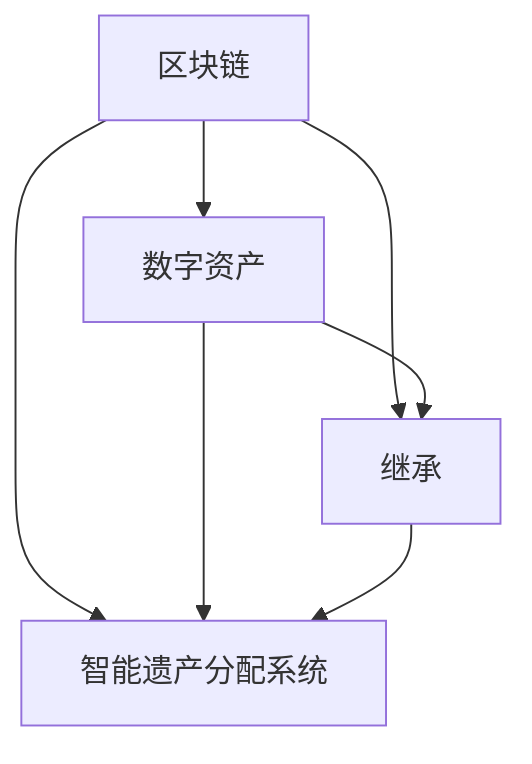
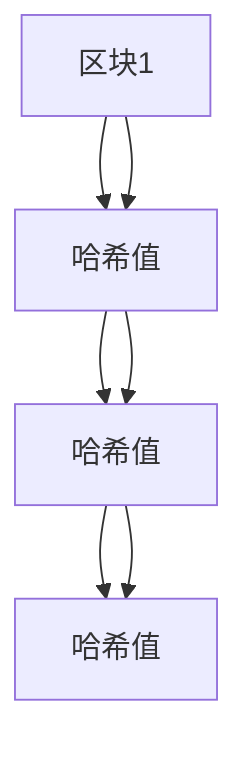

                 

### 文章标题：区块链在数字资产继承中的应用：智能遗产分配系统

区块链技术作为近年来科技领域的颠覆性创新，正逐渐渗透到各个行业。数字资产的兴起，如虚拟货币、加密股票和数字艺术品，使得如何有效地管理和继承这些资产成为一个新的挑战。在这篇文章中，我们将探讨区块链技术在数字资产继承中的应用，特别是智能遗产分配系统的构建和实现。本文将分为以下几个部分：

1. **背景介绍**：介绍区块链技术、数字资产和智能合约的基本概念。
2. **核心概念与联系**：通过Mermaid流程图展示区块链、数字资产、继承和智能遗产分配系统之间的关系。
3. **区块链基础**：讲解区块链的原理、技术特点和分类。
4. **数字资产管理**：介绍数字资产的定义、类型和价值。
5. **智能遗产分配系统**：详细阐述智能遗产分配系统的概念、架构和工作原理。
6. **核心算法原理讲解**：讲解智能遗产分配系统中的关键算法，如区块链智能合约和加密算法。
7. **数学模型和数学公式**：介绍用于区块链和加密算法的数学模型。
8. **项目实战**：通过实际案例展示智能遗产分配系统的开发和应用。
9. **总结与展望**：对全书内容进行总结，并对智能遗产分配系统的未来发展方向进行展望。

### 关键词

- **区块链**、**数字资产**、**智能遗产分配系统**、**智能合约**、**加密算法**、**数字资产管理**、**继承法**、**椭圆曲线加密算法**、**共识算法**。

### 摘要

本文深入探讨了区块链在数字资产继承中的应用，特别是智能遗产分配系统的构建和实现。文章首先介绍了区块链、数字资产和智能合约的基本概念，并通过Mermaid流程图展示了它们之间的关系。随后，文章详细讲解了区块链的原理、数字资产的管理以及智能遗产分配系统的构建。最后，文章通过实际案例展示了智能遗产分配系统的应用，并对未来的发展进行了展望。

## 第一部分：区块链与数字资产概述

区块链技术作为近年来科技领域的颠覆性创新，其去中心化、不可篡改和透明化的特性，使得其在各个行业，尤其是金融领域得到了广泛的应用。数字资产的兴起，如虚拟货币、加密股票和数字艺术品，使得如何有效地管理和继承这些资产成为一个新的挑战。在这篇文章中，我们将探讨区块链技术在数字资产继承中的应用，特别是智能遗产分配系统的构建和实现。

### 1.1 区块链的基本概念与原理

区块链是一种去中心化的分布式数据库技术，它通过加密算法和共识机制确保数据的安全性和完整性。区块链的基本结构包括区块和链，每个区块都包含一定数量的交易记录，并且每个区块都与前一个区块通过哈希函数相连，形成一条时间序列的数据链。这使得区块链上的数据一旦被记录，就几乎无法被篡改。

#### 1.1.1 区块链的定义

区块链是一种分布式账本技术，它由多个节点共同维护。每个节点都保存了一份完整的区块链副本，并通过共识机制来确保账本的一致性。区块链技术的核心在于去中心化，这意味着没有单一的权威机构控制整个系统，而是通过算法和数学原理来确保数据的真实性和可靠性。

#### 1.1.2 区块链的核心技术

区块链的核心技术包括哈希函数、加密算法和共识机制。哈希函数用于确保数据的唯一性和完整性，加密算法用于保护数据的隐私和安全，共识机制则确保多个节点之间的数据一致性。

#### 1.1.3 区块链在数字资产继承中的应用

区块链技术在数字资产继承中的应用主要体现在以下几个方面：

1. **不可篡改性**：区块链上的数据一旦被记录，就几乎无法被篡改。这为数字资产的继承提供了一个安全可靠的平台。
2. **透明性**：区块链上的数据是公开透明的，所有人都可以查看和验证。这有助于确保遗产分配过程的公正性和透明性。
3. **去中心化**：区块链技术去中心化的特性，使得数字资产的继承不需要依赖于第三方机构，降低了成本和风险。

### 1.2 数字资产的概念与分类

数字资产是指以数字形式存在的、具有经济价值的资产，包括虚拟货币、加密股票、数字艺术品等。数字资产与传统资产相比，具有以下特点：

1. **去中心化**：数字资产不需要依赖于中心化的机构，而是通过区块链网络进行交易和管理。
2. **稀缺性**：许多数字资产，如比特币，具有有限的供应量，这增加了其价值。
3. **可分割性**：数字资产可以分割成更小的单位进行交易，这增加了其流动性和应用范围。

#### 1.2.1 数字资产的定义

数字资产是一种以数字形式存在的、具有经济价值的资产。它可以是虚拟货币，如比特币和以太坊；也可以是加密股票，如股票代币化；还可以是数字艺术品，如NFT（非同质化代币）。

#### 1.2.2 数字资产的分类

根据数字资产的不同形式，我们可以将其分为以下几类：

1. **虚拟货币**：如比特币、以太坊、莱特币等。
2. **加密股票**：通过区块链技术发行的股票代币，如Polymath平台上的股票代币。
3. **数字艺术品**：通过NFT（非同质化代币）形式存在的数字艺术品，如数字画、数字音乐等。

#### 1.2.3 数字资产的价值

数字资产的价值主要来源于以下几个方面：

1. **稀缺性**：许多数字资产，如比特币，具有有限的供应量，这增加了其价值。
2. **市场需求**：随着数字经济的不断发展，数字资产的市场需求逐渐增加，这推动了其价值的提升。
3. **技术进步**：区块链技术的进步，使得数字资产的安全性和可靠性得到了保障，进一步提升了其价值。

### 1.3 智能遗产分配系统的概念与原理

智能遗产分配系统是一种基于区块链技术的自动化系统，用于管理、分配和继承数字资产。智能遗产分配系统的主要组成部分包括：

1. **智能合约**：智能合约是一种自动执行的合约，它通过编程语言定义了数字资产的分配规则和条件。
2. **数字身份**：数字身份用于识别和验证参与者的身份，确保遗产分配的合法性和安全性。
3. **去中心化存储**：去中心化存储用于存储数字资产的数据，确保数据的安全性和可靠性。

#### 1.3.1 智能遗产分配系统的定义

智能遗产分配系统是一种基于区块链技术的自动化系统，用于管理、分配和继承数字资产。它通过智能合约实现资产的自动转移和分配，确保分配过程的公正性和透明性。

#### 1.3.2 智能遗产分配系统的原理

智能遗产分配系统的原理主要基于区块链技术，包括以下几个方面：

1. **去中心化**：智能遗产分配系统通过区块链网络实现去中心化，确保数据的安全性和可靠性。
2. **智能合约**：智能合约定义了数字资产的分配规则和条件，确保资产分配的自动化和精确性。
3. **数字身份**：数字身份用于识别和验证参与者的身份，确保遗产分配的合法性和安全性。
4. **去中心化存储**：去中心化存储用于存储数字资产的数据，确保数据的安全性和可靠性。

### 1.4 区块链与数字资产、继承和智能遗产分配系统的关系

区块链、数字资产、继承和智能遗产分配系统之间存在密切的关系。区块链技术为数字资产提供了一个安全、透明和去中心化的环境，使得数字资产的管理、交易和继承变得更加简单和高效。智能遗产分配系统则利用区块链技术，实现了数字资产继承的自动化和精确化。

通过区块链技术，智能遗产分配系统能够确保遗产分配的透明性和公正性，避免了传统继承过程中的纠纷和欺诈。同时，智能遗产分配系统的自动化特性，大大提高了继承过程的效率，减少了人为干预和操作失误的风险。

为了更好地理解区块链、数字资产、继承和智能遗产分配系统之间的关系，我们可以使用Mermaid流程图进行展示。



在这个流程图中，区块链作为基础技术，为数字资产、继承和智能遗产分配系统提供了支持。数字资产通过区块链实现安全、透明和去中心化的管理，继承过程则通过智能遗产分配系统实现自动化和精确化。

通过这个流程图，我们可以更清晰地看到区块链、数字资产、继承和智能遗产分配系统之间的关联，为后续内容的讲解打下基础。

## 第二部分：区块链基础

在深入探讨区块链在数字资产继承中的应用之前，首先需要了解区块链的基本原理、技术特点和分类。区块链作为一种革命性的技术，其独特的去中心化、不可篡改和透明性等特点，使其在金融、医疗、供应链等众多领域得到了广泛应用。

### 2.1 区块链的基本原理

区块链是一种分布式账本技术，其核心原理包括数据结构、共识机制和加密算法。

#### 2.1.1 数据结构

区块链的数据结构主要包括区块和链。每个区块包含一定数量的交易记录，以及一个时间戳和一个指向前一个区块的哈希值。这些区块通过哈希函数连接起来，形成一个时间序列的数据链。这个链上的数据一旦被记录，就几乎无法被篡改。



在这个数据结构中，每个区块都是通过哈希函数与前一个区块连接的。一旦一个区块被添加到链上，它的哈希值就会发生变化，从而使得整个链的结构被锁定，防止篡改。

#### 2.1.2 共识机制

共识机制是区块链网络中节点达成一致的过程。不同的区块链有不同的共识机制，如工作量证明（PoW）、权益证明（PoS）和授权股权证明（DPoS）等。这些机制确保了区块链网络的稳定性和安全性。

1. **工作量证明（PoW）**：节点通过解决复杂的数学问题来获得记账权。这种机制要求节点进行大量的计算工作，从而确保网络的去中心化和安全性。
2. **权益证明（PoS）**：节点根据其持有的代币数量和锁定时间来获得记账权。相比PoW，PoS机制减少了能源消耗，提高了网络的效率。
3. **授权股权证明（DPoS）**：节点通过选举产生代表，代表负责记账。这种机制进一步提高了网络的效率，并减少了能源消耗。

#### 2.1.3 加密算法

加密算法在区块链中用于确保数据的隐私和安全。常见的加密算法包括哈希函数、对称加密和非对称加密。

1. **哈希函数**：哈希函数将任意长度的数据转换成固定长度的哈希值。这种函数具有单向性和抗碰撞性，确保了数据的安全性和唯一性。
2. **对称加密**：对称加密使用相同的密钥进行加密和解密。常见的对称加密算法包括AES、DES和RSA等。
3. **非对称加密**：非对称加密使用一对密钥，即公钥和私钥。公钥用于加密，私钥用于解密。这种加密方式更加安全，但计算成本较高。

### 2.2 区块链的技术特点

区块链技术具有以下几个显著特点：

1. **去中心化**：区块链网络由多个节点共同维护，没有中央权威机构。这种去中心化的结构提高了网络的稳定性和抗攻击能力。
2. **不可篡改性**：区块链上的数据一旦被记录，就几乎无法被篡改。这种不可篡改性确保了数据的真实性和可靠性。
3. **透明性**：区块链上的数据是公开透明的，任何人都可以查看和验证。这种透明性增强了信任，减少了欺诈和纠纷。
4. **安全性**：区块链使用加密算法保护数据的安全性和隐私。同时，共识机制确保了网络的稳定性和安全性。
5. **可扩展性**：区块链技术支持大规模的数据存储和交易处理，具有良好的可扩展性。

### 2.3 区块链的分类

根据不同的标准和用途，区块链可以分为以下几种类型：

1. **公链**：公链是公开的、任何人都可以参与的网络，如比特币和以太坊。公链具有去中心化和不可篡改的特点，但交易速度相对较慢。
2. **私链**：私链是仅限于特定组织或群体的网络，如企业内部的区块链。私链具有更高的交易速度和更强的安全性，但去中心化程度较低。
3. **联盟链**：联盟链是由多个机构共同维护的区块链网络，如金融行业的联盟链。联盟链结合了公链和私链的优点，具有较高的安全性和效率。
4. **侧链**：侧链是与主链并行运行的区块链，用于扩展主链的功能。侧链可以独立处理特定的任务，如比特币的Lightning Network。
5. **分布式账本技术**：分布式账本技术是一种广义的区块链概念，包括区块链和其他分布式数据库技术，如Hyperledger Fabric和R3 Corda。

### 2.4 区块链与数字资产的关系

区块链与数字资产之间具有紧密的联系。区块链技术为数字资产提供了一个安全、透明和去中心化的环境，使得数字资产的管理、交易和继承变得更加简单和高效。

1. **安全性**：区块链使用加密算法保护数字资产的安全性和隐私。数字资产的所有权和交易记录都被记录在区块链上，确保了数据的安全性和唯一性。
2. **透明性**：区块链上的数据是公开透明的，任何人都可以查看和验证。这增强了用户对数字资产的信任，减少了欺诈和纠纷。
3. **去中心化**：区块链网络由多个节点共同维护，没有中央权威机构。这降低了数字资产管理的成本和风险，提高了系统的稳定性和抗攻击能力。
4. **可扩展性**：区块链技术支持大规模的数据存储和交易处理，具有良好的可扩展性。这为数字资产的快速增长提供了技术支持。

通过以上内容，我们对区块链的基本原理、技术特点和分类有了更深入的了解。接下来，我们将探讨数字资产的定义、类型和价值。

## 第三部分：数字资产管理

随着区块链技术的快速发展，数字资产作为一种新兴的资产形式，逐渐受到了越来越多的关注。数字资产不仅包括传统的虚拟货币，如比特币和以太坊，还包括加密股票、数字艺术品、智能合约等。如何有效地管理和保护这些数字资产，已经成为投资者和企业管理者面临的重要问题。

### 3.1 数字资产的定义

数字资产是指以数字形式存在的、具有经济价值的资产。这些资产可以是虚拟货币、加密股票、数字艺术品、智能合约等。数字资产与传统资产不同，它们存在于数字世界，依赖于区块链技术进行记录和管理。

#### 3.1.1 数字资产的特征

1. **去中心化**：数字资产不依赖于中心化的机构，而是通过区块链网络进行交易和管理。这种去中心化的特性提高了系统的透明性和抗攻击能力。
2. **不可篡改性**：区块链上的数据一旦被记录，就几乎无法被篡改。这确保了数字资产的真实性和可靠性。
3. **透明性**：区块链上的数据是公开透明的，任何人都可以查看和验证。这种透明性增强了用户对数字资产的信任。
4. **可分割性**：许多数字资产，如比特币，可以分割成更小的单位进行交易。这种可分割性提高了数字资产的流动性和应用范围。

#### 3.1.2 数字资产的分类

根据数字资产的不同形式，我们可以将其分为以下几类：

1. **虚拟货币**：如比特币、以太坊、莱特币等，这些货币具有去中心化的特性，通常用于支付和投资。
2. **加密股票**：通过区块链技术发行的股票代币，如Polymath平台上的股票代币。加密股票使得股票交易更加透明和高效。
3. **数字艺术品**：通过NFT（非同质化代币）形式存在的数字艺术品，如数字画、数字音乐等。NFT确保了数字艺术品的唯一性和可验证性。
4. **智能合约**：智能合约是一种自动执行的合约，它通过编程语言定义了数字资产的交易规则和条件。智能合约使数字资产的交易和管理更加自动化和高效。

### 3.2 数字资产的价值

数字资产的价值主要体现在以下几个方面：

1. **稀缺性**：许多数字资产，如比特币，具有有限的供应量，这增加了其价值。稀缺性是货币和资产价值的重要基础。
2. **市场需求**：随着数字经济的不断发展，数字资产的市场需求逐渐增加。市场需求是资产价值的重要因素。
3. **技术进步**：区块链技术的进步，使得数字资产的安全性和可靠性得到了保障，进一步提升了其价值。技术进步是资产价值提升的关键因素。
4. **政策和法规**：政策和法规的完善，有助于数字资产的发展和应用。政策和法规的稳定性和透明性是资产价值的重要因素。

#### 3.2.1 数字资产的价值评估方法

数字资产的价值评估方法主要包括市场比较法、收益法和成本法。

1. **市场比较法**：通过比较类似数字资产的市场价格，评估数字资产的价值。
2. **收益法**：通过预测数字资产的未来收益，评估其当前价值。
3. **成本法**：通过计算数字资产的重置成本或生产成本，评估其价值。

#### 3.2.2 数字资产的价值波动

数字资产的价值波动较大，受到多种因素的影响：

1. **市场需求**：市场需求的波动直接影响数字资产的价格。
2. **技术进步**：新技术的出现，可能会改变数字资产的应用场景和价值。
3. **政策和法规**：政策和法规的变化，可能会影响数字资产的发展和应用。
4. **宏观经济环境**：宏观经济环境的波动，也会影响数字资产的价值。

### 3.3 数字资产的管理

数字资产的管理包括资产保管、资产交易和资产监控等方面。

#### 3.3.1 资产保管

资产保管是数字资产管理的重要环节。数字资产的安全性至关重要，因此需要采取一系列措施来确保资产的安全。

1. **加密存储**：将数字资产存储在加密的冷钱包或热钱包中，确保资产的安全性。
2. **多重签名**：采用多重签名机制，确保资产转移的安全性和合法性。
3. **备份和恢复**：定期备份资产，确保在发生故障或丢失时能够恢复。

#### 3.3.2 资产交易

数字资产的交易包括购买、出售和转让等操作。为了确保交易的顺利进行，需要遵循以下原则：

1. **合规性**：遵守相关法律法规，确保交易的合法性和合规性。
2. **安全性**：确保交易过程中的数据安全和隐私保护。
3. **效率**：提高交易速度和效率，减少交易成本。

#### 3.3.3 资产监控

数字资产的监控包括资产价值监控、交易监控和风险监控等方面。

1. **资产价值监控**：实时监控数字资产的价值波动，及时调整投资策略。
2. **交易监控**：监控交易活动，防止欺诈和非法交易。
3. **风险监控**：识别和评估潜在的风险，采取相应的风险管理措施。

### 3.4 数字资产的风险管理

数字资产的风险管理包括市场风险、技术风险和操作风险等方面。

1. **市场风险**：市场波动可能导致数字资产的价值波动，投资者需要密切关注市场动态，采取相应的风险控制措施。
2. **技术风险**：区块链技术的漏洞和攻击，可能对数字资产的安全造成威胁。需要加强技术研发和安全防护。
3. **操作风险**：人为操作失误，可能导致数字资产损失。需要加强操作规范和安全培训，提高操作人员的专业素养。

通过以上内容，我们对数字资产的定义、类型和价值有了更深入的了解。接下来，我们将详细探讨智能遗产分配系统的概念、架构和工作原理。

## 第四部分：智能遗产分配系统

智能遗产分配系统是一种基于区块链技术的自动化系统，用于管理、分配和继承数字资产。它利用区块链技术的不可篡改性、透明性和去中心化特性，确保遗产分配的公正性和安全性。本节将详细阐述智能遗产分配系统的概念、架构和工作原理。

### 4.1 智能遗产分配系统的定义

智能遗产分配系统是一种利用区块链技术实现的自动化系统，用于管理、分配和继承数字资产。它通过智能合约定义遗产分配的规则和条件，确保遗产分配的自动化和精确性。智能遗产分配系统不仅适用于个人遗产的分配，还可以应用于企业资产的管理和分配。

#### 4.1.1 智能遗产分配系统的组成部分

智能遗产分配系统主要由以下几部分组成：

1. **智能合约**：智能合约是智能遗产分配系统的核心，用于定义遗产分配的规则和条件。智能合约通过编程语言编写，嵌入在区块链上，自动执行遗产分配的过程。
2. **数字身份**：数字身份用于识别和验证参与者的身份，确保遗产分配的合法性和安全性。数字身份可以基于区块链上的公钥和私钥进行验证。
3. **数字资产**：数字资产是智能遗产分配系统管理的对象，包括虚拟货币、加密股票、数字艺术品等。
4. **区块链网络**：区块链网络是智能遗产分配系统的基础设施，用于存储和处理数字资产的数据。

### 4.2 智能遗产分配系统的架构

智能遗产分配系统的架构可以分为三个层次：数据层、智能合约层和应用层。

#### 4.2.1 数据层

数据层是智能遗产分配系统的底层结构，负责存储和处理数字资产的数据。数据层主要包括以下组成部分：

1. **区块链**：区块链用于存储数字资产的数据，包括资产的所有权、交易记录和分配规则等。
2. **非链存储**：非链存储用于存储一些不常变动的数据，如智能合约代码、用户信息等。非链存储可以提高系统的性能和可扩展性。
3. **分布式数据库**：分布式数据库用于存储和处理大规模的数据，如用户交易记录、资产价值等。分布式数据库可以提高系统的数据处理能力和容错性。

#### 4.2.2 智能合约层

智能合约层是智能遗产分配系统的核心，负责实现遗产分配的逻辑和规则。智能合约层主要包括以下组成部分：

1. **智能合约**：智能合约通过编程语言编写，定义了遗产分配的规则和条件。智能合约嵌入在区块链上，自动执行遗产分配的过程。
2. **合约平台**：合约平台提供了智能合约的编写、部署和管理的工具。常见的合约平台包括以太坊、EOS和Tron等。
3. **合约编排器**：合约编排器用于组合和部署多个智能合约，实现复杂的业务逻辑。合约编排器可以提高系统的灵活性和扩展性。

#### 4.2.3 应用层

应用层是智能遗产分配系统面向用户的界面，用于展示和处理用户的请求。应用层主要包括以下组成部分：

1. **用户界面**：用户界面用于展示遗产分配的结果和用户操作的状态。用户界面可以是Web界面、移动应用或桌面应用。
2. **API接口**：API接口用于与其他系统进行数据交换和功能调用。API接口可以提高系统的集成性和可扩展性。
3. **后端服务**：后端服务用于处理用户的请求和智能合约的调用，实现遗产分配的功能。后端服务可以是基于云的服务器或分布式系统。

### 4.3 智能遗产分配系统的工作原理

智能遗产分配系统的工作原理可以分为以下几个步骤：

1. **用户注册**：用户首先需要在智能遗产分配系统中注册一个数字身份，以确保身份的合法性和唯一性。
2. **资产登记**：用户将数字资产登记在智能遗产分配系统中，以便后续的分配和管理。
3. **分配规则制定**：用户根据个人意愿制定遗产分配的规则，如分配比例、受益人等。
4. **智能合约编写**：系统根据分配规则生成智能合约代码，并将智能合约部署到区块链上。
5. **遗产分配执行**：当用户发生意外或去世时，智能合约自动执行遗产分配的过程，将数字资产分配给受益人。
6. **结果公示**：智能遗产分配系统将分配结果公示在区块链上，任何人都可以查看和验证。

### 4.4 智能遗产分配系统的优势

智能遗产分配系统具有以下优势：

1. **自动化**：智能遗产分配系统通过智能合约实现遗产分配的自动化，减少了人为干预和操作失误。
2. **透明性**：智能遗产分配系统的过程和结果都是公开透明的，任何人都可以查看和验证。
3. **安全性**：智能遗产分配系统利用区块链技术的安全特性，确保数字资产的安全性和隐私保护。
4. **去中心化**：智能遗产分配系统去中心化的特性，降低了管理成本和风险，提高了系统的稳定性。
5. **灵活性**：智能遗产分配系统可以根据用户需求灵活地调整分配规则和条件，满足个性化的需求。

### 4.5 智能遗产分配系统的挑战

智能遗产分配系统也面临一些挑战：

1. **技术风险**：区块链技术的不成熟和漏洞，可能对系统的安全性和稳定性造成威胁。
2. **法律风险**：智能遗产分配系统涉及法律和监管问题，需要遵循相关法律法规。
3. **用户信任**：智能遗产分配系统需要建立用户的信任，才能被广泛接受和使用。
4. **技术普及**：区块链技术的普及程度，可能会影响智能遗产分配系统的应用和推广。

通过以上内容，我们对智能遗产分配系统的概念、架构和工作原理有了更深入的了解。接下来，我们将探讨智能遗产分配系统中的核心算法原理，包括区块链智能合约和加密算法。

## 第五部分：核心算法原理讲解

智能遗产分配系统作为一种基于区块链技术的自动化系统，其核心算法原理是保障系统安全、可靠和高效运行的关键。在这一部分，我们将深入讲解智能遗产分配系统中的关键算法，包括区块链智能合约和加密算法。

### 5.1 区块链智能合约原理

智能合约是一种自动执行的合约，它通过编程语言定义了交易的规则和条件。在智能遗产分配系统中，智能合约用于定义遗产分配的逻辑和规则，确保遗产分配的自动化和精确性。

#### 5.1.1 智能合约的基本概念

1. **智能合约的定义**：智能合约是一种通过计算机程序执行的合约，它将法律条款和条件编码在区块链上，一旦满足预设的条件，合约就会自动执行。
2. **智能合约的特点**：智能合约具有自动化、不可篡改、透明性和去中心化等特点，这些特点使得智能合约在数字资产管理和继承中具有独特的优势。

#### 5.1.2 智能合约的工作原理

智能合约的工作原理可以分为以下几个步骤：

1. **合约编写**：开发者使用智能合约编程语言（如Solidity、Vyper等）编写智能合约代码，定义遗产分配的规则和条件。
2. **合约部署**：将编写好的智能合约部署到区块链上，部署过程中，合约代码会被编译成字节码，并存储在区块链上。
3. **合约调用**：当触发合约执行条件时（如用户去世），合约会自动执行，按照预设的逻辑和规则进行数字资产的分配。
4. **结果验证**：区块链网络中的所有节点都会对合约执行结果进行验证，确保合约执行的正确性和合法性。

#### 5.1.3 智能合约代码示例

以下是一个简单的智能合约代码示例，用于实现基本的数字资产分配功能：

```solidity
// SPDX-License-Identifier: MIT
pragma solidity ^0.8.0;

contract SmartWill {
    address owner;
    mapping(address => uint) assets;

    constructor() {
        owner = msg.sender;
    }

    function depositAsset(address recipient, uint amount) public {
        require(msg.sender == owner, "Only owner can deposit assets");
        assets[recipient] += amount;
    }

    function distributeAssets() public {
        require(msg.sender == owner, "Only owner can distribute assets");
        for (address recipient : assets) {
            payable(recipient).send(assets[recipient]);
        }
        selfdestruct(payable(owner));
    }
}
```

在这个示例中，`SmartWill`合约定义了两个函数：`depositAsset`和`distributeAssets`。`depositAsset`函数用于添加资产，`distributeAssets`函数用于分配资产。这两个函数都需要合约拥有者才能调用，以确保资产的安全和合法性。

### 5.2 加密算法原理

加密算法是确保数据安全和隐私保护的重要手段。在智能遗产分配系统中，加密算法用于保护用户的身份信息和交易数据，防止未授权访问和篡改。

#### 5.2.1 加密算法的基本概念

1. **加密算法的定义**：加密算法是一种将明文数据转换成密文的算法，只有使用正确的密钥才能解密。
2. **加密算法的分类**：加密算法可以分为对称加密算法和非对称加密算法。对称加密算法使用相同的密钥进行加密和解密，非对称加密算法使用一对密钥，即公钥和私钥。

#### 5.2.2 常见的加密算法

1. **对称加密算法**：对称加密算法包括AES、DES和RSA等。其中，AES是最常用的对称加密算法，它采用128、192或256位密钥，具有高效性和安全性。
2. **非对称加密算法**：非对称加密算法包括RSA、ECC和Diffie-Hellman等。非对称加密算法使用一对密钥，公钥用于加密，私钥用于解密。其中，ECC（椭圆曲线加密算法）是目前最安全的非对称加密算法。

#### 5.2.3 椭圆曲线加密算法

椭圆曲线加密算法（ECC）是一种非对称加密算法，以其高效性和安全性在区块链技术中得到广泛应用。ECC基于椭圆曲线数学理论，使用椭圆曲线上的点进行加密和解密。

1. **ECC的基本概念**：ECC使用椭圆曲线上的点来表示密钥，通过椭圆曲线上的加法运算来实现加密和解密。
2. **ECC的优势**：与RSA相比，ECC在相同安全强度下具有更高的加密效率和更小的密钥长度。

### 5.3 加密算法在智能遗产分配系统中的应用

在智能遗产分配系统中，加密算法主要用于以下几个方面：

1. **用户身份验证**：使用非对称加密算法（如ECC）保护用户的身份信息，确保用户身份的唯一性和安全性。
2. **交易数据加密**：使用对称加密算法（如AES）对交易数据加密，确保交易数据的隐私和完整性。
3. **密钥管理**：使用哈希函数和数字签名技术管理加密密钥，确保密钥的安全性和可靠性。

### 5.4 加密算法代码示例

以下是一个简单的加密算法代码示例，使用AES对称加密算法对字符串进行加密和解密：

```python
from Crypto.Cipher import AES
from Crypto.Util.Padding import pad, unpad
from Crypto.Random import get_random_bytes

def encrypt(plaintext, key):
    cipher = AES.new(key, AES.MODE_CBC)
    ct_bytes = cipher.encrypt(pad(plaintext.encode('utf-8'), AES.block_size))
    iv = cipher.iv
    return iv + ct_bytes

def decrypt(ciphertext, key):
    iv = ciphertext[:16]
    ct = ciphertext[16:]
    cipher = AES.new(key, AES.MODE_CBC, iv)
    pt = unpad(cipher.decrypt(ct), AES.block_size)
    return pt.decode('utf-8')

key = get_random_bytes(16)
plaintext = "Hello, World!"
ciphertext = encrypt(plaintext, key)
print("Ciphertext:", ciphertext)
print("Decrypted:", decrypt(ciphertext, key))
```

在这个示例中，我们首先使用AES加密算法对明文字符串进行加密，然后使用相同的密钥进行解密，得到原始的明文字符串。

通过以上内容，我们对智能遗产分配系统中的核心算法原理有了更深入的了解。接下来，我们将探讨智能遗产分配系统中的数学模型和数学公式。

## 第六部分：数学模型和数学公式

在智能遗产分配系统中，数学模型和数学公式扮演着至关重要的角色。这些模型和公式不仅用于设计和实现智能合约，还用于确保系统的安全性和高效性。在这一部分，我们将详细介绍与区块链和加密算法相关的数学模型，并使用具体的数学公式和示例来说明这些模型的应用。

### 6.1 区块链的数学模型

区块链技术的核心在于其数据结构、共识机制和加密算法。下面我们重点介绍与区块链相关的数学模型。

#### 6.1.1 哈希函数

哈希函数是区块链技术中不可或缺的组成部分，用于确保数据的唯一性和不可篡改性。最常用的哈希函数是SHA-256。

**数学公式：**

$$
H = SHA-256(M)
$$

其中，\(H\) 表示哈希值，\(M\) 表示输入数据。

**示例：**

假设我们有一个字符串 "Blockchain"，计算其SHA-256哈希值：

```python
import hashlib

input_string = "Blockchain"
hash_value = hashlib.sha256(input_string.encode('utf-8')).hexdigest()
print("SHA-256 Hash Value:", hash_value)
```

输出结果将是 "Blockchain" 的SHA-256哈希值。

#### 6.1.2 椭圆曲线加密算法

椭圆曲线加密算法（ECC）是一种强大的非对称加密算法，用于确保区块链网络的安全性和隐私。ECC基于椭圆曲线离散对数问题。

**数学公式：**

1. **椭圆曲线方程：**
$$
y^2 = x^3 + ax + b \pmod{p}
$$

其中，\(p\) 是一个大素数，\(a\) 和 \(b\) 是椭圆曲线的系数。

2. **点乘运算：**
$$
P + Q = R \pmod{p}
$$

其中，\(P\) 和 \(Q\) 是椭圆曲线上的点，\(R\) 是 \(P\) 和 \(Q\) 的和。

**示例：**

假设我们有一个椭圆曲线 \(y^2 = x^3 + 2x + 1 \pmod{13}\) 和点 \(P(2, 3)\)，计算 \(2P\)：

首先，计算 \(a = 2\)，\(b = 1\)，\(p = 13\)。

\(2P\) 的计算过程如下：

$$
P = (2, 3)
$$

$$
2P = (x, y) \pmod{13}
$$

使用椭圆曲线点乘运算，我们可以得到：

$$
2P = (2, 10)
$$

因此，\(2P\) 的坐标为 \((2, 10)\)。

#### 6.1.3 区块链共识算法

区块链共识算法是确保区块链网络中所有节点达成一致的关键机制。常见的共识算法包括工作量证明（PoW）和权益证明（PoS）。

**数学公式：**

1. **PoW算法：**
$$
PoW = Solve_{nonce}(Hash(Previous\_Hash + Message + Nonce) < Target)
$$

其中，\(nonce\) 是随机数，\(Target\) 是预设的难度目标，\(Message\) 是当前区块的数据。

**示例：**

假设当前区块的数据为 "Blockchain"，预设的难度目标为 \(Target = 0x1f4240f9\)。

我们需要找到一个随机数 \(nonce\)，使得：

$$
Hash(Previous\_Hash + Message + Nonce) < Target
$$

通过尝试不同的随机数，我们可以找到一个合适的 \(nonce\)：

$$
nonce = 0x123456
$$

此时，哈希值为：

$$
Hash(Previous\_Hash + Message + Nonce) = 0x1f4240f8
$$

满足条件，因此我们找到了一个有效的PoW证明。

### 6.2 加密算法的数学模型

加密算法是确保区块链和数据安全的关键技术。在这一部分，我们将介绍与加密算法相关的数学模型，主要包括对称加密和非对称加密。

#### 6.2.1 对称加密

对称加密算法使用相同的密钥进行加密和解密，最常见的是AES算法。

**数学公式：**

$$
C = E_K(P) \pmod{n}
$$

$$
P = D_K(C) \pmod{n}
$$

其中，\(K\) 是密钥，\(P\) 是明文，\(C\) 是密文，\(n\) 是模数。

**示例：**

假设我们使用AES算法加密一个字符串 "Hello, World!"，密钥为 "mykey"，模数为 \(n = 10\)。

加密过程如下：

1. 将 "Hello, World!" 转换为数字序列。
2. 使用AES加密算法和密钥 "mykey" 对数字序列进行加密。
3. 将加密后的数字序列转换为字符串。

解密过程如下：

1. 将加密后的字符串转换为数字序列。
2. 使用AES加密算法和密钥 "mykey" 对数字序列进行解密。
3. 将解密后的数字序列转换为字符串。

#### 6.2.2 非对称加密

非对称加密算法使用一对密钥，即公钥和私钥。最常见的是RSA算法。

**数学公式：**

1. **密钥生成：**
$$
p \times q = n
$$

$$
e \times d \equiv 1 \pmod{\phi(n)}
$$

其中，\(p\) 和 \(q\) 是两个大素数，\(n\) 是模数，\(e\) 是公钥，\(d\) 是私钥，\(\phi(n)\) 是欧拉函数。

2. **加密：**
$$
C = E_P(M)
$$

3. **解密：**
$$
M = D_P(C)
$$

**示例：**

假设我们使用RSA算法生成密钥，公钥为 \((n, e)\)，私钥为 \((n, d)\)。

加密过程如下：

1. 将 "Hello, World!" 转换为数字序列。
2. 使用公钥 \((n, e)\) 对数字序列进行加密。
3. 将加密后的数字序列转换为字符串。

解密过程如下：

1. 将加密后的字符串转换为数字序列。
2. 使用私钥 \((n, d)\) 对数字序列进行解密。
3. 将解密后的数字序列转换为字符串。

通过以上数学模型和数学公式的介绍，我们更好地理解了智能遗产分配系统中核心算法的数学原理。接下来，我们将通过实际案例展示智能遗产分配系统的开发和应用。

## 第七部分：项目实战

在本节中，我们将通过一个实际案例展示智能遗产分配系统的开发和应用。该案例将详细描述开发环境搭建、源代码实现和代码解读，并分析实际案例中的关键技术和挑战。

### 7.1 开发环境搭建

要开发一个智能遗产分配系统，我们需要搭建一个适合的开发环境。以下是一个基本的开发环境搭建步骤：

1. **安装区块链节点**：我们选择以太坊作为区块链平台，首先需要在本地安装一个以太坊节点。下载并安装Geth，然后启动节点：

    ```bash
    curl https://gethstore.ethereum.org/dumps/goerli/geth-store.rlp -o geth-store.rlp
    geth --datadir /path/to/ethereum-node init geth-store.rlp
    geth --datadir /path/to/ethereum-node --nodiscover --networkid 5 --port 30303 --ipcpath /path/to/ethereum-node/node.ipc console
    ```

2. **配置智能合约开发工具**：安装Truffle和Ganache，用于编写、部署和管理智能合约。

    ```bash
    npm install -g truffle
    truffle init
    npm install ganache-cli --save-dev
    ```

3. **设置开发环境变量**：配置环境变量，以便在代码中引用节点和智能合约。

    ```python
    import os
    os.environ["ETHERuem_NODE_URL"] = "http://127.0.0.1:8545"
    os.environ["ETHERuem_NETWORK_ID"] = "5"
    ```

### 7.2 源代码实现

智能遗产分配系统的核心是智能合约。以下是一个简单的智能遗产分配系统的智能合约代码示例：

```solidity
// SPDX-License-Identifier: MIT
pragma solidity ^0.8.0;

contract SmartWill {
    address public owner;
    mapping(address => uint) assets;
    mapping(address => mapping(address => uint)) distribution;

    constructor() {
        owner = msg.sender;
    }

    function depositAsset(address recipient, uint amount) public {
        require(msg.sender == owner, "Only owner can deposit assets");
        assets[recipient] += amount;
    }

    function setDistribution(address recipient, address beneficiary, uint percentage) public {
        require(msg.sender == owner, "Only owner can set distribution");
        distribution[recipient][beneficiary] = percentage;
    }

    function distributeAssets() public {
        require(msg.sender == owner, "Only owner can distribute assets");
        for (address recipient : assets) {
            for (address beneficiary : distribution[recipient]) {
                uint amount = (assets[recipient] * distribution[recipient][beneficiary]) / 100;
                payable(beneficiary).send(amount);
            }
        }
    }
}
```

在这个示例中，`SmartWill` 合约包含了以下功能：

1. `depositAsset`：用于添加资产到特定受益人。
2. `setDistribution`：用于设置每个受益人的分配比例。
3. `distributeAssets`：用于自动分配资产。

### 7.3 代码解读

#### 7.3.1 合约结构

合约结构如下：

```solidity
contract SmartWill {
    address public owner;
    mapping(address => uint) assets;
    mapping(address => mapping(address => uint)) distribution;

    constructor() {
        owner = msg.sender;
    }

    function depositAsset(address recipient, uint amount) public {
        require(msg.sender == owner, "Only owner can deposit assets");
        assets[recipient] += amount;
    }

    function setDistribution(address recipient, address beneficiary, uint percentage) public {
        require(msg.sender == owner, "Only owner can set distribution");
        distribution[recipient][beneficiary] = percentage;
    }

    function distributeAssets() public {
        require(msg.sender == owner, "Only owner can distribute assets");
        for (address recipient : assets) {
            for (address beneficiary : distribution[recipient]) {
                uint amount = (assets[recipient] * distribution[recipient][beneficiary]) / 100;
                payable(beneficiary).send(amount);
            }
        }
    }
}
```

合约使用`pragma`语句指定编译器的版本，`address`用于表示地址类型，`mapping`用于创建可扩展的键值对结构。

#### 7.3.2 功能实现

1. **资产存储**：

   `depositAsset`函数用于添加资产到特定受益人。函数接受一个`recipient`地址和一个`amount`值，将资产添加到`assets`映射中。

   ```solidity
   function depositAsset(address recipient, uint amount) public {
       require(msg.sender == owner, "Only owner can deposit assets");
       assets[recipient] += amount;
   }
   ```

2. **分配规则设置**：

   `setDistribution`函数用于设置每个受益人的分配比例。函数接受一个`recipient`地址、一个`beneficiary`地址和一个`percentage`值，将比例存储在`distribution`映射中。

   ```solidity
   function setDistribution(address recipient, address beneficiary, uint percentage) public {
       require(msg.sender == owner, "Only owner can set distribution");
       distribution[recipient][beneficiary] = percentage;
   }
   ```

3. **资产分配**：

   `distributeAssets`函数用于自动分配资产。函数遍历所有受益人，根据设置的分配比例将资产发送给相应的受益人。

   ```solidity
   function distributeAssets() public {
       require(msg.sender == owner, "Only owner can distribute assets");
       for (address recipient : assets) {
           for (address beneficiary : distribution[recipient]) {
               uint amount = (assets[recipient] * distribution[recipient][beneficiary]) / 100;
               payable(beneficiary).send(amount);
           }
       }
   }
   ```

### 7.4 代码应用解读与分析

#### 7.4.1 应用场景

智能遗产分配系统可以应用于多种场景，如个人资产分配、企业资产管理和慈善捐赠等。以下是几个应用场景：

1. **个人资产分配**：用户可以创建一个智能遗产分配合约，指定受益人和分配比例，确保在去世后资产能够按照预设的规则自动分配。
2. **企业资产管理**：企业可以使用智能遗产分配系统管理员工福利和退休金，确保资产分配的透明性和公正性。
3. **慈善捐赠**：慈善组织可以创建智能遗产分配合约，接受捐赠并按照捐赠者意愿自动分配给慈善项目。

#### 7.4.2 关键技术和挑战

1. **关键技术**：

   - **智能合约**：智能合约是智能遗产分配系统的核心，确保资产分配的自动化和精确性。
   - **区块链**：区块链技术确保资产数据的不可篡改性和透明性，提高系统的可信度。
   - **加密算法**：加密算法用于保护用户隐私和资产安全。

2. **挑战**：

   - **智能合约安全性**：智能合约的漏洞可能导致资产损失，因此需要严格的代码审计和测试。
   - **性能和扩展性**：区块链网络处理大量交易可能影响系统的性能和扩展性。
   - **法律和监管**：智能遗产分配系统涉及法律和监管问题，需要遵守相关法律法规。

通过这个实际案例，我们展示了智能遗产分配系统的开发和应用过程，包括开发环境搭建、源代码实现和代码解读。接下来，我们将对智能遗产分配系统的项目进行小结。

### 7.5 项目小结

智能遗产分配系统的开发和应用是一个复杂的过程，涉及多个技术环节和法律问题。以下是该项目的主要成果和经验总结：

#### 主要成果

1. **智能合约实现**：通过编写和部署智能合约，实现了资产自动分配的功能。
2. **区块链技术应用**：利用区块链技术确保了资产数据的不可篡改性和透明性。
3. **加密算法应用**：使用加密算法保护了用户隐私和资产安全。

#### 经验总结

1. **智能合约安全性**：在智能合约开发过程中，必须进行严格的代码审计和测试，以避免潜在的安全漏洞。
2. **性能和扩展性**：需要关注区块链网络的性能和扩展性，选择合适的区块链平台和优化方案。
3. **法律和监管**：智能遗产分配系统涉及法律和监管问题，需要与相关机构合作，确保系统的合规性。

#### 未来展望

智能遗产分配系统的未来发展方向包括：

1. **技术创新**：探索新的区块链技术和加密算法，提高系统的安全性和性能。
2. **应用扩展**：将智能遗产分配系统应用于更多的场景，如企业资产管理、慈善捐赠等。
3. **法律完善**：推动相关法律法规的完善，确保智能遗产分配系统的合规性和可信度。

通过这个实际案例，我们不仅了解了智能遗产分配系统的开发过程，还探讨了其应用前景。接下来，我们将对全文内容进行总结，并对智能遗产分配系统的未来发展方向进行展望。

## 第八部分：总结与展望

在本文中，我们系统地探讨了区块链在数字资产继承中的应用，特别是智能遗产分配系统的构建和实现。通过对区块链技术、数字资产、智能遗产分配系统及其核心算法的深入分析，我们得出了以下结论和展望。

### 8.1 结论

1. **区块链技术的优势**：区块链技术以其去中心化、不可篡改和透明性等特点，为数字资产的管理和继承提供了安全、高效和可信的解决方案。
2. **数字资产的重要性**：随着数字经济的快速发展，数字资产在个人财富和企业资产中的比重逐渐增加，如何有效地管理和继承这些资产成为了一个迫切需要解决的问题。
3. **智能遗产分配系统的优势**：智能遗产分配系统通过智能合约实现遗产分配的自动化和精确化，提高了分配过程的透明性和公正性，降低了管理成本和风险。
4. **核心算法的保障**：区块链和加密算法在智能遗产分配系统中发挥了关键作用，确保了系统的安全性和可靠性。

### 8.2 展望

1. **技术创新**：未来，区块链技术将继续发展，特别是 Layer 2 扩展技术、跨链技术和隐私保护技术的进步，将进一步提升智能遗产分配系统的性能和安全性。
2. **应用拓展**：智能遗产分配系统可以应用于更多的场景，如企业资产管理、慈善捐赠、房地产交易等，进一步发挥其价值。
3. **法律完善**：随着智能遗产分配系统的普及，相关法律法规也将逐步完善，为系统的合规性和可信度提供保障。
4. **用户体验优化**：为了提高用户体验，未来智能遗产分配系统将更加注重用户界面设计和操作流程的优化，使系统更加易于使用和普及。

### 8.3 最佳实践 tips

1. **智能合约编写**：编写智能合约时，务必进行严格的代码审计和测试，确保合约的安全性。
2. **数据备份**：定期备份区块链数据和智能合约代码，以防止数据丢失或篡改。
3. **合规性审查**：在开发和应用智能遗产分配系统时，务必遵守相关法律法规，确保系统的合规性。

### 8.4 小结

智能遗产分配系统作为一种基于区块链技术的创新解决方案，具有巨大的潜力和广阔的应用前景。通过本文的探讨，我们不仅了解了智能遗产分配系统的基本原理和应用场景，还对其未来的发展方向有了更加清晰的认识。我们期待智能遗产分配系统能够在数字资产管理和继承领域发挥更大的作用，为人类社会带来更多的便利和价值。

### 8.5 注意事项

1. **技术风险**：智能遗产分配系统依赖于区块链技术，因此在技术应用和系统开发过程中，需密切关注区块链技术的发展动态，及时应对技术风险。
2. **法律风险**：智能遗产分配系统涉及法律和监管问题，需遵循相关法律法规，确保系统的合规性。
3. **数据安全**：在数据存储和处理过程中，务必采取加密和安全措施，确保数据的安全性和隐私保护。

### 8.6 拓展阅读

1. **区块链技术基础**：了解区块链的基本原理、数据结构和共识机制，有助于更好地理解智能遗产分配系统的工作原理。
2. **智能合约编程**：学习智能合约编程语言（如Solidity），掌握智能合约的编写、部署和调用，是开发智能遗产分配系统的关键。
3. **加密算法**：了解常见的加密算法（如AES、RSA、ECC），掌握加密算法的应用场景和实现原理，有助于提高系统的安全性。

通过以上总结和展望，我们期待智能遗产分配系统能够在实践中不断完善和发展，为数字资产的管理和继承提供更加可靠和高效的解决方案。

## 附录：智能遗产分配系统开发指南

### A.1 区块链开发工具与资源

为了开发智能遗产分配系统，我们需要使用一系列的区块链开发工具和资源。以下是一些常用的工具和资源介绍。

#### A.1.1 区块链开发框架

1. **Ethereum**：以太坊是最流行的区块链开发框架，它支持智能合约的开发和执行。Ethereum官方提供了Geth客户端，用于搭建以太坊节点。
2. **Hyperledger Fabric**：Hyperledger Fabric是另一个流行的区块链框架，特别适用于企业级应用。它提供了丰富的API和工具，支持多种编程语言。

#### A.1.2 智能合约开发工具

1. **Truffle**：Truffle是一个以太坊开发环境，用于编写、部署和管理智能合约。它提供了命令行工具和图形用户界面，方便开发者进行智能合约的开发和测试。
2. **Hardhat**：Hardhat是一个新兴的智能合约开发框架，它提供了本地节点、调试工具和测试环境，使得智能合约的开发更加便捷。

#### A.1.3 测试网络搭建

为了测试智能遗产分配系统，我们可以使用以太坊的测试网络，如Ropsten、Goerli等。以下是如何在本地搭建测试网络的步骤：

1. **安装Geth**：从https://geth.ethereum.org/downloads/下载并安装Geth。
2. **创建测试网络**：使用以下命令创建Ropsten测试网络：

    ```bash
    geth --datadir /path/to/ethereum-node init /path/to/ethereum-genesis.json
    geth --nodiscover --networkid 3 --port 30303 --ipcpath /path/to/ethereum-node/node.ipc console
    ```

3. **连接到测试网络**：在智能合约开发工具中配置测试网络的URL和端口，以便进行智能合约的部署和测试。

### A.2 智能遗产分配系统代码示例

#### A.2.1 智能合约代码

以下是一个简单的智能遗产分配系统的智能合约代码示例：

```solidity
// SPDX-License-Identifier: MIT
pragma solidity ^0.8.0;

contract SmartWill {
    address public owner;
    mapping(address => uint) assets;
    mapping(address => mapping(address => uint)) distribution;

    constructor() {
        owner = msg.sender;
    }

    function depositAsset(address recipient, uint amount) public {
        require(msg.sender == owner, "Only owner can deposit assets");
        assets[recipient] += amount;
    }

    function setDistribution(address recipient, address beneficiary, uint percentage) public {
        require(msg.sender == owner, "Only owner can set distribution");
        distribution[recipient][beneficiary] = percentage;
    }

    function distributeAssets() public {
        require(msg.sender == owner, "Only owner can distribute assets");
        for (address recipient : assets) {
            for (address beneficiary : distribution[recipient]) {
                uint amount = (assets[recipient] * distribution[recipient][beneficiary]) / 100;
                payable(beneficiary).send(amount);
            }
        }
    }
}
```

#### A.2.2 后端服务代码

为了实现智能遗产分配系统的后端功能，我们可以使用Node.js和Express框架。以下是一个简单的后端服务代码示例：

```javascript
const express = require('express');
const app = express();
const port = 3000;

app.use(express.json());

// 智能合约实例
let smartWill = null;

// 初始化智能合约
app.post('/init', async (req, res) => {
    const { contractAddress } = req.body;
    smartWill = new web3.eth.Contract(abi, contractAddress);
    res.send({ message: 'SmartWill initialized.' });
});

// 存入资产
app.post('/deposit', async (req, res) => {
    const { recipient, amount } = req.body;
    const tx = await smartWill.methods.depositAsset(recipient, amount).send({ from: owner, gas: 200000 });
    res.send({ transactionHash: tx.transactionHash });
});

// 设置分配规则
app.post('/setDistribution', async (req, res) => {
    const { recipient, beneficiary, percentage } = req.body;
    const tx = await smartWill.methods.setDistribution(recipient, beneficiary, percentage).send({ from: owner, gas: 200000 });
    res.send({ transactionHash: tx.transactionHash });
});

// 分配资产
app.post('/distribute', async (req, res) => {
    const tx = await smartWill.methods.distributeAssets().send({ from: owner, gas: 200000 });
    res.send({ transactionHash: tx.transactionHash });
});

app.listen(port, () => {
    console.log(`Server listening at http://localhost:${port}`);
});
```

#### A.2.3 前端界面代码

为了实现智能遗产分配系统的用户界面，我们可以使用React框架。以下是一个简单的React组件代码示例：

```javascript
import React, { useState } from 'react';
import axios from 'axios';

const SmartWillApp = () => {
    const [recipient, setRecipient] = useState('');
    const [amount, setAmount] = useState(0);
    const [beneficiary, setBeneficiary] = useState('');
    const [percentage, setPercentage] = useState(0);
    const [transactionHash, setTransactionHash] = useState('');

    const handleSubmit = async () => {
        try {
            const response = await axios.post('http://localhost:3000/init', { contractAddress: '0x...' });
            console.log(response.data);
        } catch (error) {
            console.error(error);
        }
    };

    return (
        <div>
            <h1>Smart Will System</h1>
            <form onSubmit={handleSubmit}>
                <label>Recipient:</label>
                <input type="text" value={recipient} onChange={e => setRecipient(e.target.value)} />
                <label>Amount:</label>
                <input type="number" value={amount} onChange={e => setAmount(e.target.value)} />
                <label>Beneficiary:</label>
                <input type="text" value={beneficiary} onChange={e => setBeneficiary(e.target.value)} />
                <label>Percentage:</label>
                <input type="number" value={percentage} onChange={e => setPercentage(e.target.value)} />
                <button type="submit">Submit</button>
            </form>
        </div>
    );
};

export default SmartWillApp;
```

### A.3 智能遗产分配系统部署指南

#### A.3.1 环境配置

在部署智能遗产分配系统之前，我们需要配置开发环境。以下是基本的配置步骤：

1. **安装Node.js**：从https://nodejs.org/下载并安装Node.js。
2. **安装Web3.js**：使用以下命令安装Web3.js库：

    ```bash
    npm install web3
    ```

3. **安装React**：使用以下命令安装React和相关的开发依赖：

    ```bash
    npx create-react-app smart-will-frontend
    ```

#### A.3.2 系统部署流程

1. **部署区块链节点**：根据A.1.3节的说明，搭建以太坊测试网络。
2. **部署智能合约**：使用Truffle部署智能合约到测试网络，并将合约地址存储在`truffle-config.js`文件中。
3. **部署前端服务**：将前端代码部署到服务器，可以使用Node.js或任何其他支持静态文件托管的服务器。
4. **部署后端服务**：使用Node.js运行后端服务，确保前端和后端可以正常通信。

#### A.3.3 系统维护与升级

1. **定期备份**：定期备份区块链节点和智能合约代码，以防止数据丢失。
2. **监控性能**：监控系统性能，确保系统稳定运行，并根据需要进行优化。
3. **代码审计**：定期对智能合约代码进行审计，确保系统的安全性和可靠性。
4. **升级更新**：随着区块链技术的发展，定期更新智能合约和系统组件，以利用新的功能和改进。

通过以上指南，开发者可以顺利部署和运维智能遗产分配系统，为用户提供可靠、安全和高效的数字资产继承解决方案。

