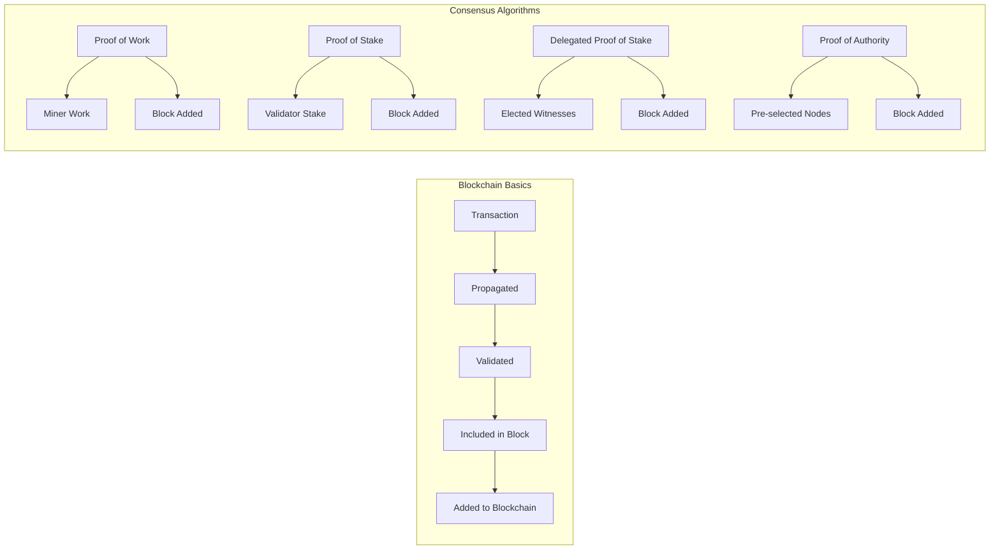
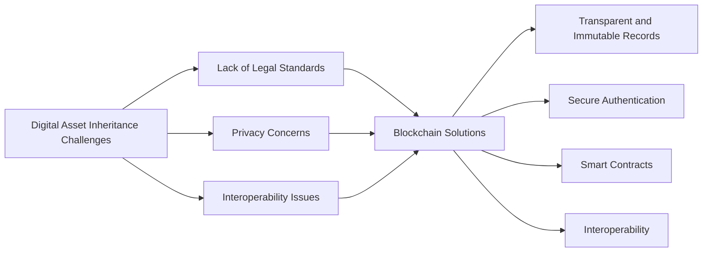
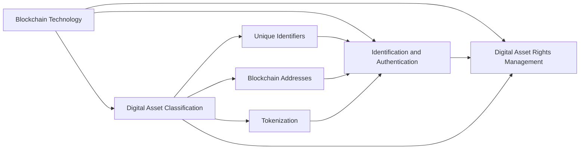
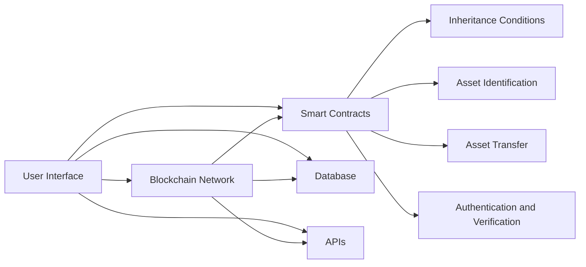
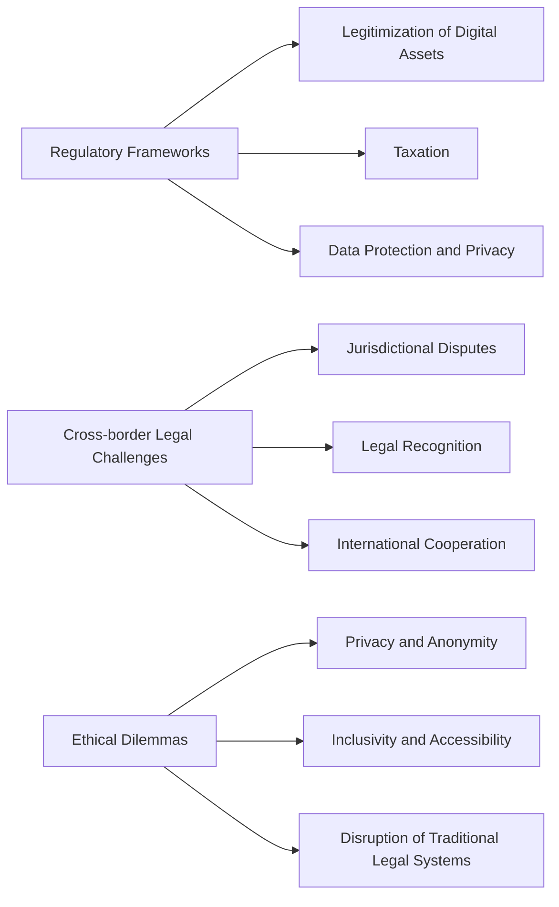

                 

### I. Introduction to Blockchain Technology

#### 1.1 Blockchain Basics

Blockchain is a distributed ledger technology (DLT) that enables the secure and transparent recording of transactions. At its core, a blockchain is a chain of blocks, where each block contains a list of transactions. These blocks are linked together using cryptographic hashes, creating a tamper-proof and immutable record of all transactions.

**Key Components of Blockchain:**

1. **Transactions:** The smallest unit of value in a blockchain, representing a transfer of assets or information from one party to another.
2. **Blocks:** Containers that hold a set of transactions. Once a block is filled, it is added to the blockchain.
3. **Hash Functions:** Used to uniquely identify each block and ensure data integrity.
4. **Consensus Algorithms:** Protocols that ensure all participants in the blockchain network agree on the state of the blockchain.
5. **Nodes:** Devices that participate in the blockchain network, validating transactions and maintaining the blockchain.

#### 1.2 Blockchain Consensus Algorithms

Consensus algorithms are crucial for maintaining the integrity and agreement among blockchain participants. They ensure that all nodes in the network reach a consensus on the valid state of the blockchain. Here are some of the most common consensus algorithms:

1. **Proof of Work (PoW):** In PoW, nodes (miners) compete to solve a complex mathematical puzzle, and the first to solve it gets to add the next block to the blockchain. This process requires significant computational power and energy.
2. **Proof of Stake (PoS):** In PoS, the likelihood of a node validating a block is proportional to its stake in the network (usually measured in cryptocurrency holdings). This reduces energy consumption compared to PoW.
3. **Delegated Proof of Stake (DPoS):** In DPoS, a small group of nodes (delegated witnesses) are elected by token holders to validate transactions and create new blocks.
4. **Proof of Authority (PoA):** In PoA, nodes are pre-selected based on their reputation and authority, and they validate transactions and create new blocks.

#### 1.3 Blockchain Network Operations

Blockchain network operations involve several key steps:

1. **Transaction Propagation:** When a transaction occurs, it is broadcast to the network and received by all nodes.
2. **Transaction Validation:** Nodes validate transactions to ensure they meet the network's rules and are not fraudulent.
3. **Block Creation:** Miners (in PoW) or validators (in PoS) create new blocks by including valid transactions.
4. **Block Addition:** Once a block is created, it is added to the blockchain by reaching a consensus among the network nodes.
5. **Blockchain Maintenance:** Nodes continuously download and update the blockchain, ensuring that all copies are identical and up-to-date.

#### Mermaid Flowchart

Below is a Mermaid flowchart illustrating the basic operations of a blockchain network:

#### Conclusion

Blockchain technology is a revolutionary innovation that has the potential to transform various industries. Understanding its basic components and operations is essential for grasping its full potential in addressing complex problems such as digital asset inheritance. In the next section, we will delve into the challenges associated with digital asset inheritance and explore the need for blockchain solutions.

---

### 2. Challenges in Digital Asset Inheritance

#### 2.1 The Problem of Digital Legacy

The rise of digital assets, including cryptocurrencies, NFTs, and digital documents, has introduced a new set of challenges in the realm of inheritance. Unlike traditional assets such as property or cash, digital assets pose unique problems due to their intangible nature and often lack of standardized ownership structures.

**Key Challenges:**

1. **Identifying Digital Assets:** Many individuals may not be aware of all their digital assets, making it difficult for heirs to locate and claim them.
2. **Access to Digital Assets:** Access to digital wallets or accounts often requires passwords, private keys, or other authentication methods, which can be challenging for heirs to obtain.
3. **Legal Recognition:** Traditional legal systems are often ill-equipped to handle the complexities of digital asset inheritance, leading to disputes and delays.

#### 2.2 Current Legal and Technological Issues

The current legal and technological frameworks for digital asset inheritance are still evolving and face several challenges:

1. **Lack of Legal Standards:** Most jurisdictions have not established clear legal standards for the inheritance of digital assets, leading to inconsistencies and confusion.
2. **Privacy Concerns:** Digital assets, particularly cryptocurrencies, are often tied to private keys and other sensitive information, raising privacy concerns during the inheritance process.
3. **Interoperability Issues:** Different blockchain networks and digital asset platforms may use different standards and protocols, complicating the transfer and management of digital assets.

#### 2.3 The Need for Blockchain Solutions

Blockchain technology offers several potential solutions to the challenges of digital asset inheritance:

1. **Transparent and Immutable Records:** Blockchain's decentralized and immutable nature ensures that digital asset ownership and transfer records are transparent and cannot be altered, reducing the risk of fraud or disputes.
2. **Secure Authentication:** Blockchain can provide secure authentication mechanisms for accessing digital assets, using cryptographic methods such as multi-signature wallets or smart contracts.
3. **Smart Contracts:** Smart contracts can automate the inheritance process, executing predefined rules and conditions for asset transfer without the need for intermediaries or legal intervention.
4. **Interoperability:** Blockchain's interoperability protocols can facilitate the seamless transfer and management of digital assets across different platforms and networks.

#### Mermaid Flowchart

Below is a Mermaid flowchart illustrating the relationship between digital asset inheritance challenges and potential blockchain solutions:

#### Conclusion

The challenges associated with digital asset inheritance highlight the need for innovative solutions. Blockchain technology offers promising solutions to address these challenges by providing transparency, security, and efficiency. In the next section, we will explore how blockchain can be used for digital asset management and the role of smart contracts in inheritance processes.

---

### 3. Blockchain for Digital Asset Management

Blockchain technology has the potential to revolutionize the management of digital assets by providing a secure, transparent, and immutable platform. In this section, we will delve into how blockchain technology can be utilized for digital asset classification, identification, and authentication.

#### 3.1 Blockchain Technology and Digital Asset Classification

Digital assets can be broadly classified into several categories, including:

1. **Cryptocurrencies:** Digital or virtual currencies that use cryptography to secure transactions and control the creation of new units.
2. **Non-Fungible Tokens (NFTs):** Unique digital assets representing ownership or proof of authenticity of a specific item or piece of content.
3. **Digital Shares:** Representation of ownership in a company or other entities, often in the form of digital certificates or tokens.
4. **Digital Documents:** Various types of digital records, such as contracts, wills, and other legal documents.

Blockchain technology enables the classification and management of these assets by creating a unique and immutable record of each asset. Each digital asset can be assigned a unique identifier (such as a hash) and stored securely on the blockchain.

#### 3.2 Digital Asset Identification and Authentication

Identification and authentication are critical components of digital asset management. Blockchain provides several mechanisms for ensuring the authenticity and integrity of digital assets:

1. **Unique Identifiers:** Each digital asset can be assigned a unique identifier (UID) using cryptographic techniques, ensuring that each asset is uniquely identifiable and cannot be duplicated or altered.
2. **Blockchain Addresses:** Blockchain addresses can serve as a way to identify and authenticate digital assets. These addresses are generated using public-private key pairs, providing a secure and decentralized method of verifying ownership.
3. **Smart Contracts:** Smart contracts can be used to define and enforce the rules for identifying and authenticating digital assets. For example, a smart contract can be used to ensure that only authorized individuals can access a particular digital asset.

#### 3.3 Digital Asset Rights Management

Rights management is a crucial aspect of digital asset management, especially when dealing with intellectual property and sensitive information. Blockchain can facilitate effective rights management through the following mechanisms:

1. **Permissioned Access:** Blockchain platforms can implement permissioned access controls, allowing only authorized individuals or entities to access specific digital assets.
2. **Tokenization:** Digital assets can be tokenized, representing ownership or rights to a specific asset. These tokens can be transferred or traded on the blockchain, enabling a transparent and secure rights management system.
3. **Revocation and Transfer:** Blockchain allows for the revocation of rights and transfer of ownership of digital assets. Smart contracts can be used to define the conditions under which rights can be revoked or transferred, ensuring that the process is secure and transparent.

#### Mermaid Flowchart

Below is a Mermaid flowchart illustrating the relationship between blockchain technology, digital asset classification, identification, authentication, and rights management:

#### Conclusion

Blockchain technology offers a robust and secure platform for managing digital assets, addressing key challenges such as identification, authentication, and rights management. In the next section, we will explore how blockchain can be used to design a digital asset inheritance system, including the role of smart contracts in automating the inheritance process.

---

### 4. Designing a Blockchain-Based Digital Asset Inheritance System

In this section, we will delve into the design of a blockchain-based digital asset inheritance system. We will explore the system architecture, the implementation of smart contracts for digital asset transfer, and the critical considerations for privacy and security.

#### 4.1 System Architecture

The architecture of a blockchain-based digital asset inheritance system can be divided into several key components:

1. **User Interface (UI):** The user interface allows users to interact with the system, including creating digital asset profiles, managing inheritance settings, and accessing their digital assets.
2. **Blockchain Network:** The blockchain network is the core component of the system, providing the decentralized and immutable ledger for recording digital asset transactions and inheritance events.
3. **Smart Contracts:** Smart contracts are self-executing contracts with the terms of the agreement directly written into code. They play a crucial role in automating the inheritance process and ensuring the secure transfer of digital assets.
4. **Database:** The database stores additional information related to digital assets, such as user profiles, asset classifications, and transaction histories.
5. **APIs:** Application Programming Interfaces (APIs) enable communication between the user interface, smart contracts, and external services, such as identity verification systems or legal documentation platforms.

#### 4.2 Smart Contracts for Digital Asset Transfer

Smart contracts are the backbone of a blockchain-based digital asset inheritance system. They automate the process of transferring digital assets from the deceased to their heirs, ensuring that the transfer is executed according to the terms specified in the contract.

**Key Components of Smart Contracts:**

1. **Inheritance Conditions:** Smart contracts can define specific conditions for the transfer of digital assets, such as the age or health status of the heir, ensuring that the transfer only occurs under certain circumstances.
2. **Asset Identification:** The smart contract must identify the digital assets to be transferred, using unique identifiers or blockchain addresses to ensure accuracy and prevent fraud.
3. **Asset Transfer:** The smart contract executes the transfer of digital assets from the deceased's account to the heir's account, updating the blockchain to reflect the new ownership.
4. **Authentication and Verification:** Smart contracts can integrate with external systems, such as identity verification services, to authenticate the heirs and ensure that only authorized individuals receive the assets.

#### 4.3 Privacy and Security Considerations

Designing a secure and private blockchain-based digital asset inheritance system is paramount to protecting sensitive information and preventing unauthorized access. Here are some key considerations:

1. **Encryption:** All sensitive data, including private keys and transaction details, should be encrypted to prevent unauthorized access.
2. **Access Control:** Implement robust access control mechanisms to ensure that only authorized individuals can access specific functions or information within the system.
3. **Multi-Signature Wallets:** Multi-signature wallets require multiple signatures to authorize a transaction, providing an additional layer of security against theft or unauthorized access.
4. **Regular Audits:** Conduct regular audits and security assessments to identify and address potential vulnerabilities.
5. **Compliance with Regulations:** Ensure that the system complies with relevant legal and regulatory requirements, including data protection and privacy laws.

#### Mermaid Flowchart

Below is a Mermaid flowchart illustrating the architecture of a blockchain-based digital asset inheritance system, including user interface, blockchain network, smart contracts, database, and APIs:

#### Conclusion

Designing a blockchain-based digital asset inheritance system requires careful consideration of system architecture, smart contract implementation, and privacy and security. In the next section, we will delve into the legal and ethical implications of blockchain in digital asset inheritance and explore the challenges and opportunities that arise from its use.

---

### 5. Legal and Ethical Issues in Blockchain and Digital Asset Inheritance

The integration of blockchain technology into digital asset inheritance brings both opportunities and challenges from a legal and ethical perspective. As blockchain technology continues to evolve, it is essential to address the legal and ethical considerations to ensure its successful implementation and acceptance.

#### 5.1 Regulatory Frameworks for Digital Assets

The legal landscape for digital assets is complex and varies significantly across jurisdictions. Governments and regulatory bodies are still in the process of developing appropriate frameworks to govern digital assets and blockchain-based transactions. Key regulatory challenges include:

1. **Legitimization of Digital Assets:** Many jurisdictions are still grappling with the legitimacy of digital assets as tangible property, which affects their legal standing and enforceability.
2. **Taxation:** The taxation of digital assets, especially cryptocurrencies, is a complex issue. Different jurisdictions have different tax treatments, leading to inconsistencies and potential legal disputes.
3. **Data Protection and Privacy:** Blockchain networks, by design, are transparent and immutable, which raises concerns about data privacy and protection. Ensuring compliance with data protection laws, such as the General Data Protection Regulation (GDPR), is crucial.

#### 5.2 Cross-border Legal Challenges

Digital asset inheritance often involves cross-border transactions, which add another layer of complexity to the legal framework. Cross-border legal challenges include:

1. **Jurisdictional Disputes:** Conflicts between different jurisdictions can arise when digital assets are held in multiple countries. Determining which jurisdiction's laws apply can be contentious.
2. **Legal Recognition:** The recognition and enforcement of digital asset transfers across different jurisdictions may be inconsistent, leading to legal disputes and delays.
3. **International Cooperation:** Effective international cooperation and harmonization of legal standards are essential to address cross-border legal challenges in digital asset inheritance.

#### 5.3 Ethical Dilemmas in Digital Asset Management

The ethical implications of blockchain and digital asset management involve several critical issues:

1. **Privacy and Anonymity:** The transparency of blockchain technology conflicts with the need for privacy and anonymity in inheritance processes. Balancing these objectives is a significant ethical challenge.
2. **Inclusivity and Accessibility:** The adoption of blockchain technology for digital asset inheritance must ensure inclusivity and accessibility for all individuals, regardless of their technical expertise or financial resources.
3. **Disruption of Traditional Legal Systems:** The integration of blockchain technology may disrupt traditional legal systems and practices, raising ethical questions about the appropriate role of technology in legal processes.

#### Mermaid Flowchart

Below is a Mermaid flowchart illustrating the legal and ethical challenges in blockchain and digital asset inheritance:

#### Conclusion

The legal and ethical considerations of blockchain and digital asset inheritance are complex and multifaceted. Addressing these challenges requires a collaborative effort between policymakers, technologists, and legal experts to create a balanced and effective regulatory framework. In the next section, we will explore real-world examples of blockchain-based digital asset inheritance and examine the challenges and solutions encountered in these cases.

---

### 6. Blockchain in Action: Real-world Examples of Digital Asset Inheritance

To better understand the practical application of blockchain technology in digital asset inheritance, let's explore several real-world examples that highlight the challenges faced and the innovative solutions implemented.

#### 6.1 Case Study 1: Blockchain in Digital Asset Inheritance

**Background:**
A young tech entrepreneur, John, passed away unexpectedly at the age of 30, leaving behind a substantial amount of digital assets, including cryptocurrencies, NFTs, and digital documents. John's estate included detailed instructions on how his digital assets should be distributed among his heirs.

**Challenges:**
The primary challenge for John's heirs was accessing and managing his digital assets, as traditional legal methods were not designed to handle digital inheritances. They also faced the issue of identifying all his digital assets, as some were stored in accounts and platforms he had not previously disclosed.

**Solution:**
John's heirs decided to use a blockchain-based digital asset inheritance system to manage and distribute his assets. They chose a platform that utilized smart contracts to automate the inheritance process based on John's pre-defined instructions.

**Implementation:**
1. **Digital Asset Inventory:** John's heirs created a comprehensive inventory of all his digital assets, including their unique identifiers and ownership details.
2. **Smart Contract Creation:** They worked with a legal expert to draft a smart contract that specified the conditions for asset distribution, including the identity of the heirs and the proportion of assets each would receive.
3. **Blockchain Integration:** The smart contract was deployed on a public blockchain network, ensuring transparency and immutability. The heirs used the platform's user interface to trigger the smart contract execution.
4. **Asset Transfer:** The smart contract automatically executed the asset transfer, releasing the specified amounts to each heir's designated wallet addresses.

**Outcome:**
The blockchain-based inheritance system successfully distributed John's digital assets according to his wishes, without the need for extensive legal procedures. The transparency and security of the blockchain ensured that the process was tamper-proof and trustworthy.

#### 6.2 Case Study 2: Challenges and Solutions

**Background:**
Alice, a well-known artist, passed away at the age of 65, leaving behind a collection of valuable NFTs representing her digital art. Alice had not specified any inheritance plan for her NFTs, leading to disputes among her heirs.

**Challenges:**
The primary challenge was determining the rightful owners of Alice's NFTs, as the traditional legal system was not equipped to handle the unique characteristics of digital assets. There was also a concern about the value and provenance of the NFTs, as some were considered highly valuable and others less so.

**Solution:**
Alice's heirs sought the help of a blockchain legal expert to develop a solution that would ensure a fair and transparent distribution of her NFTs.

**Implementation:**
1. **NFT Inventory and Valuation:** The heirs conducted a thorough inventory of Alice's NFTs, identifying their unique identifiers, creators, and market values.
2. **Smart Contract Creation:** They drafted a smart contract that specified the rules for the distribution of NFTs, taking into account the different values and characteristics of each asset.
3. **Blockchain Integration:** The smart contract was deployed on a blockchain network, ensuring that the distribution process was transparent and immutable.
4. **Audit and Verification:** The heirs engaged a third-party blockchain auditor to verify the integrity of the NFTs and the smart contract implementation.
5. **Asset Transfer:** The smart contract executed the asset transfer based on the predefined rules, distributing the NFTs to the heirs according to their shares.

**Outcome:**
The blockchain-based solution successfully resolved the disputes among Alice's heirs, ensuring that the distribution of her NFTs was fair and transparent. The use of blockchain technology provided a reliable and tamper-proof record of the asset transfer, eliminating concerns about fraud and manipulation.

#### 6.3 Emerging Trends and Future Directions

As blockchain technology continues to evolve, several emerging trends and future directions are shaping the future of digital asset inheritance:

1. **Smart Contract Standardization:** Efforts are being made to develop standardized smart contract templates for digital asset inheritance, simplifying the process for both legal professionals and individuals.
2. **Interoperability:** Blockchain interoperability protocols are being developed to facilitate seamless integration between different blockchain networks and platforms, enhancing the transferability and management of digital assets.
3. **Cross-border Solutions:** Blockchain-based platforms are being developed to address the challenges of cross-border digital asset inheritance, ensuring compliance with international legal standards.
4. **Decentralized Autonomous Organizations (DAOs):** DAOs, which are decentralized organizations governed by smart contracts, are emerging as a new paradigm for managing digital assets, providing a transparent and participatory approach to inheritance.

In conclusion, blockchain technology has proven to be a valuable tool for addressing the challenges of digital asset inheritance. By providing transparency, security, and automation, blockchain enables a more efficient and trustworthy process for transferring digital assets. As the technology continues to evolve, it will likely play an increasingly significant role in the management and inheritance of digital assets.

---

### 7. Technical Challenges and Solutions in Blockchain-Based Digital Asset Inheritance

Implementing a blockchain-based digital asset inheritance system involves addressing several technical challenges to ensure the system's scalability, performance, and security. In this section, we will explore these challenges and discuss potential solutions.

#### 7.1 Blockchain Scalability and Performance

One of the primary technical challenges in blockchain-based digital asset inheritance is scalability and performance. Blockchain networks can become congested with high transaction volumes, leading to delays and increased transaction fees. Here are some potential solutions:

1. **Sharding:** Sharding is a technique that divides the blockchain network into smaller segments (shards), allowing multiple nodes to process transactions in parallel. This can significantly increase transaction throughput and reduce latency.
2. **Layer 2 Solutions:** Layer 2 scaling solutions, such as the Lightning Network for Bitcoin or the optimistic rollups for Ethereum, offload some of the transaction processing to secondary layers, reducing the load on the main blockchain and improving scalability.
3. **Interoperability Protocols:** Developing interoperability protocols between different blockchain networks can enable the seamless transfer of digital assets across multiple networks, distributing the load and improving overall performance.

#### 7.2 Data Privacy and Security

Data privacy and security are critical considerations in digital asset inheritance, as sensitive information, such as private keys and transaction histories, must be protected. Here are some potential solutions:

1. **Zero-Knowledge Proofs (ZKPs):** ZKPs allow parties to prove the validity of a statement without revealing any underlying information. Implementing ZKPs in blockchain-based inheritance systems can ensure that private information is protected while maintaining transparency and trust.
2. **Distributed Ledgers for Private Data:** Using a distributed ledger system for managing private data can provide a secure and decentralized storage solution. This can be combined with privacy-preserving techniques such as homomorphic encryption and secure multiparty computation to protect sensitive information.
3. **Multi-Signature Wallets:** Multi-signature wallets require multiple private keys to authorize a transaction, providing an additional layer of security. Implementing multi-signature wallets can prevent unauthorized access and protect against theft or fraud.

#### 7.3 Smart Contract Security

Smart contracts are a fundamental component of blockchain-based digital asset inheritance systems, and ensuring their security is paramount. Here are some potential solutions:

1. **Formal Verification:** Formal verification involves mathematically proving that a smart contract complies with its specifications and does not contain any vulnerabilities. While time-consuming, formal verification can provide high-confidence assurances about the security of smart contracts.
2. **Code Audits:** Conducting thorough code audits by experienced security experts can identify potential vulnerabilities and bugs in smart contracts. Implementing best practices and following secure coding guidelines can further reduce the risk of security breaches.
3. **Decentralized Oracles:** Decentralized oracles provide external data feeds to smart contracts, ensuring that the contracts have access to accurate and reliable information. Implementing decentralized oracles can help prevent smart contract exploits caused by manipulated data.

#### 7.4 Interoperability and Standardization

Interoperability and standardization are crucial for the seamless transfer and management of digital assets across different blockchain networks and platforms. Here are some potential solutions:

1. **Cross-Chain Protocols:** Developing cross-chain protocols, such as Polkadot's parachains or Cosmos' interoperability framework, can enable the seamless transfer of digital assets between different blockchain networks.
2. **Common Data Standards:** Establishing common data standards for digital assets can facilitate interoperability and simplify the process of integrating different platforms. Standards such as the Decentralized Identity (DID) standard can help achieve interoperability for user identification and authentication.
3. **Blockchain Aggregators:** Blockchain aggregators can provide a centralized service for managing and routing digital assets across multiple blockchain networks. These aggregators can help simplify the complexity of interoperability for end-users.

In conclusion, implementing a blockchain-based digital asset inheritance system involves addressing several technical challenges related to scalability, performance, data privacy, security, smart contract vulnerabilities, and interoperability. By adopting innovative solutions and best practices, developers can build robust and secure systems that enable efficient and trustworthy digital asset inheritance.

---

### Conclusion

Blockchain technology has emerged as a transformative force in the digital asset inheritance landscape, addressing long-standing challenges related to security, transparency, and efficiency. Through its decentralized and immutable nature, blockchain provides a robust foundation for managing and transferring digital assets, ensuring that the inheritance process is tamper-proof and transparent.

In this article, we have explored the key concepts, technologies, and challenges associated with blockchain-based digital asset inheritance. We began with an introduction to blockchain technology, including its basic components, consensus algorithms, and network operations. We then discussed the challenges of digital asset inheritance and the need for blockchain solutions. Subsequent sections delved into blockchain's role in digital asset management, the design of blockchain-based inheritance systems, legal and ethical considerations, real-world case studies, and technical challenges.

As blockchain technology continues to evolve, it will likely play an increasingly significant role in managing digital assets and ensuring the seamless transfer of digital inheritances. Future research and development should focus on improving scalability, enhancing data privacy and security, and establishing standardized protocols for interoperability. By addressing these challenges, blockchain can become an even more powerful tool for digital asset management, benefiting individuals, legal professionals, and the broader economy.

### Authors

**Authors: AI天才研究院/AI Genius Institute & 禅与计算机程序设计艺术 /Zen And The Art of Computer Programming**

AI天才研究院致力于推动人工智能技术的创新和应用，培养世界级人工智能专家和研究者。禅与计算机程序设计艺术则强调通过禅修和哲学思考来提升计算机编程的智慧和艺术性。两位作者共同探讨了区块链技术在数字资产继承中的应用，为读者提供了一篇具有深度和洞见的技术博客文章。

