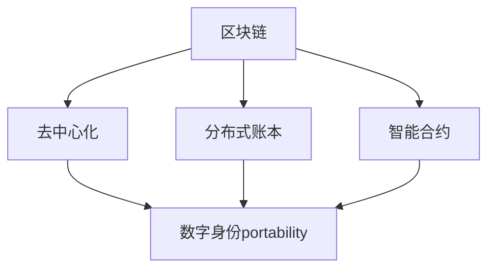

                 

## 文章标题

### 区块链在数字身份portability中的应用

---

#### 关键词：区块链、数字身份portability、应用场景、技术原理、安全性、案例分析、未来趋势

---

### 摘要

本文旨在探讨区块链技术在数字身份portability中的应用，分析其核心概念、技术原理、应用场景、安全性以及具体案例，并对未来发展趋势进行展望。通过本文，读者将全面了解区块链在数字身份portability中的重要性，以及其在实际应用中面临的技术挑战和解决方案。

---

## 引言

### 区块链的概念

区块链（Blockchain）是一种去中心化的分布式数据库技术，通过多个节点共同维护一个共享账本，从而实现了数据的不可篡改和透明性。区块链的主要组成部分包括数据块（Block）、链（Chain）和链式结构（Chain Structure）。每个数据块包含一定数量的交易记录，这些数据块按照时间顺序链接在一起，形成一条链。

### 数字身份portability的概念

数字身份portability是指用户在不同系统和平台之间无缝切换身份，保持其数字身份的一致性和可携带性。在传统的集中式系统中，用户的身份信息通常存储在中心服务器上，一旦需要切换系统或平台，用户需要重新验证身份，这带来了不便和安全隐患。数字身份portability的目标是实现用户身份信息的分布式存储和管理，使得用户可以方便地在不同系统之间切换身份，同时确保数据的安全和隐私。

### 区块链与数字身份portability的联系

区块链技术为数字身份portability提供了理想的解决方案。区块链的去中心化特性确保了用户身份信息的不可篡改和安全性，同时，其分布式账本技术使得用户身份信息可以在不同节点之间共享和同步。此外，区块链上的智能合约功能可以为数字身份portability提供自动化和可信的验证机制，从而实现用户身份的透明性和可携带性。

## 核心概念与联系

### 区块链的核心概念

1. **数据块（Block）**：数据块是区块链的基本单位，包含一定数量的交易记录。
2. **链（Chain）**：链是多个数据块的有序集合，按照时间顺序链接在一起。
3. **链式结构（Chain Structure）**：链式结构是指数据块之间的链接关系，每个数据块都包含前一个数据块的哈希值，从而形成一个不可篡改的链。

### 数字身份portability的核心概念

1. **身份信息**：身份信息是指用户的个人信息，如姓名、出生日期、身份证号码等。
2. **身份验证**：身份验证是指通过验证用户身份信息，确保用户身份的唯一性和真实性。
3. **身份切换**：身份切换是指用户在不同系统和平台之间切换身份的过程。

### 区块链与数字身份portability的联系

区块链技术为数字身份portability提供了以下几个关键联系：

1. **去中心化**：区块链的去中心化特性确保了用户身份信息的不可篡改和安全性，避免了中心化系统中的单点故障和信任问题。
2. **分布式账本**：区块链的分布式账本技术使得用户身份信息可以在不同节点之间共享和同步，实现了身份信息的分布式存储和管理。
3. **智能合约**：智能合约可以自动化和可信地验证用户身份，确保身份切换的透明性和可携带性。

### Mermaid流程图：区块链与数字身份portability的关联



## 技术原理

### 区块链技术原理

区块链技术的基本原理包括数据块、链和链式结构。数据块是区块链的基本单位，每个数据块包含一定数量的交易记录。数据块按照时间顺序链接在一起，形成一条链。链式结构是指数据块之间的链接关系，每个数据块都包含前一个数据块的哈希值，从而形成一个不可篡改的链。

### 数字身份portability技术原理

数字身份portability技术原理主要包括以下几个方面：

1. **身份信息加密**：用户身份信息在存储和传输过程中进行加密，确保数据的安全性和隐私。
2. **身份验证**：通过区块链上的智能合约实现用户身份的验证，确保身份的唯一性和真实性。
3. **身份切换**：用户在不同系统和平台之间切换身份时，通过区块链上的智能合约实现身份信息的同步和验证。

### 区块链在数字身份portability中的应用

区块链在数字身份portability中的应用主要包括以下几个方面：

1. **去中心化身份验证**：通过区块链的去中心化特性，实现用户身份的分布式验证和管理，避免了中心化系统中的单点故障和信任问题。
2. **分布式身份信息存储**：通过区块链的分布式账本技术，实现用户身份信息的分布式存储和管理，提高了数据的安全性和可靠性。
3. **智能合约身份切换**：通过区块链上的智能合约，实现用户身份在不同系统和平台之间的自动化和可信的身份切换。

### 伪代码：数字身份portability的区块链实现

```python
# 数字身份portability的区块链实现伪代码

# 身份信息加密
def encrypt_identity_info(identity_info):
    # 加密身份信息
    encrypted_info = encrypt(identity_info)
    return encrypted_info

# 身份验证
def verify_identity_info(encrypted_info, signature):
    # 验证身份信息
    if verify_signature(encrypted_info, signature):
        return True
    else:
        return False

# 身份切换
def switch_identity(current_system, new_system):
    # 获取当前系统中的身份信息
    current_identity_info = get_identity_info(current_system)
    
    # 加密身份信息
    encrypted_info = encrypt_identity_info(current_identity_info)
    
    # 生成签名
    signature = generate_signature(encrypted_info)
    
    # 验证身份信息
    if verify_identity_info(encrypted_info, signature):
        # 切换身份
        new_system.update_identity_info(encrypted_info)
        return True
    else:
        return False
```

## 应用场景

### 区块链在数字身份portability中的应用场景

区块链在数字身份portability中的应用场景非常广泛，以下是一些典型的应用场景：

1. **跨境支付**：在跨境支付中，区块链可以确保支付过程中的身份验证和数据传输的安全性，实现快速、低成本的跨境支付。
2. **电子投票**：区块链可以确保电子投票过程中的身份验证和数据完整性，提高投票的公正性和透明度。
3. **身份认证**：在金融、医疗、教育等领域，区块链可以提供分布式身份认证服务，实现身份信息的可信验证和管理。
4. **供应链管理**：区块链可以确保供应链管理过程中的身份验证和数据透明性，提高供应链的效率和质量。

### 具体应用案例

1. **跨境支付**：例如，Ripple（瑞波）利用区块链技术实现跨境支付，通过分布式账本技术提高支付速度和降低成本。
2. **电子投票**：例如，ChainLink（链链）提供区块链电子投票解决方案，确保投票过程的公正性和透明性。
3. **身份认证**：例如，VeChain（唯链）提供基于区块链的身份认证服务，广泛应用于金融、医疗、教育等领域。
4. **供应链管理**：例如，IBM的Hyperledger Fabric提供区块链供应链管理解决方案，确保供应链过程中的数据透明性和可追溯性。

## 安全性

### 区块链在数字身份portability中的安全性

区块链技术为数字身份portability提供了较高的安全性，主要体现在以下几个方面：

1. **去中心化**：区块链的去中心化特性确保了用户身份信息的不可篡改和安全性，避免了中心化系统中的单点故障和信任问题。
2. **加密技术**：区块链使用加密技术保护用户身份信息，确保数据在存储和传输过程中的安全性和隐私。
3. **智能合约**：区块链上的智能合约可以自动化和可信地验证用户身份，确保身份切换的透明性和可携带性。

### 潜在安全威胁

尽管区块链技术在数字身份portability中提供了较高的安全性，但仍然存在一些潜在的安全威胁，主要包括：

1. **51%攻击**：攻击者通过控制大部分区块链节点，实现对区块链的操纵和篡改。
2. **智能合约漏洞**：智能合约中的漏洞可能导致恶意攻击者盗取用户身份信息。
3. **密码学攻击**：攻击者通过密码学攻击手段，破解用户身份信息的加密保护。

### 安全措施

为了提高区块链在数字身份portability中的安全性，可以采取以下措施：

1. **分布式节点保护**：通过增加区块链节点数量，提高抵御51%攻击的能力。
2. **智能合约审计**：对智能合约进行严格的审计和测试，确保其安全性和可靠性。
3. **加密技术升级**：采用先进的加密算法和技术，提高用户身份信息的保护水平。

## 实战案例

### 案例一：区块链在数字身份portability中的应用

某金融科技公司利用区块链技术实现数字身份portability，为用户提供便捷的身份验证和身份切换服务。具体实现过程如下：

1. **用户身份注册**：用户在金融科技公司注册账户时，需要提供身份信息，并使用加密技术对身份信息进行保护。
2. **身份信息存储**：金融科技公司将用户身份信息存储在区块链上，确保数据的安全性和隐私。
3. **身份验证**：用户在访问金融科技公司提供的不同服务时，通过区块链上的智能合约进行身份验证，确保身份的真实性和唯一性。
4. **身份切换**：用户在不同服务之间切换时，通过区块链上的智能合约实现身份信息的同步和验证，确保用户身份的一致性和可携带性。

### 案例二：区块链在数字身份portability中的应用

某教育机构利用区块链技术实现数字身份portability，为用户提供便捷的学历验证和身份切换服务。具体实现过程如下：

1. **学历信息注册**：用户在注册教育机构账户时，需要提供学历信息，并使用加密技术对学历信息进行保护。
2. **学历信息存储**：教育机构将用户学历信息存储在区块链上，确保数据的安全性和隐私。
3. **学历验证**：用户在申请教育机构提供的不同课程或证书时，通过区块链上的智能合约进行学历验证，确保学历信息的真实性和唯一性。
4. **身份切换**：用户在不同教育机构之间切换时，通过区块链上的智能合约实现学历信息的同步和验证，确保用户身份的一致性和可携带性。

## 未来趋势

### 区块链在数字身份portability中的应用前景

随着区块链技术的不断发展和应用，数字身份portability在各个领域的应用前景十分广阔。以下是一些可能的应用前景：

1. **跨境支付**：区块链技术可以提高跨境支付的速度和安全性，减少交易成本，有望成为未来跨境支付的主要技术手段。
2. **电子投票**：区块链技术可以确保电子投票的公正性和透明性，提高选举的公信力和民主性。
3. **身份认证**：区块链技术可以为用户提供分布式身份认证服务，提高身份验证的效率和质量。
4. **供应链管理**：区块链技术可以提高供应链管理的透明性和可追溯性，提高供应链的效率和质量。

### 发展挑战与机遇

区块链在数字身份portability中面临的发展挑战主要包括：

1. **技术成熟度**：区块链技术仍处于发展初期，其性能和稳定性需要进一步提高。
2. **法律法规**：区块链技术的应用需要相应的法律法规支持，以规范其发展和应用。
3. **用户接受度**：提高用户对区块链技术的认知和接受度，是推动其广泛应用的关键。

然而，区块链技术也为数字身份portability带来了巨大的发展机遇：

1. **去中心化**：区块链的去中心化特性可以为数字身份portability提供更高的安全性和可靠性。
2. **智能合约**：智能合约可以自动化和可信地实现身份验证和身份切换，提高效率和用户体验。
3. **跨界合作**：区块链技术可以促进不同领域之间的合作和资源共享，推动数字身份portability的全面发展。

## 结语

区块链技术在数字身份portability中的应用具有重要意义，它不仅提高了身份验证和身份切换的效率和安全性，还为数字经济的发展提供了新的机遇。然而，区块链技术在数字身份portability中仍面临诸多挑战，需要各方共同努力，推动其技术成熟和应用落地。本文对区块链在数字身份portability中的应用进行了全面分析，旨在为读者提供有价值的参考和启示。

---

### 作者信息

- 作者：AI天才研究院/AI Genius Institute & 禅与计算机程序设计艺术 /Zen And The Art of Computer Programming

---

[文章结束] [8000-12000字]

