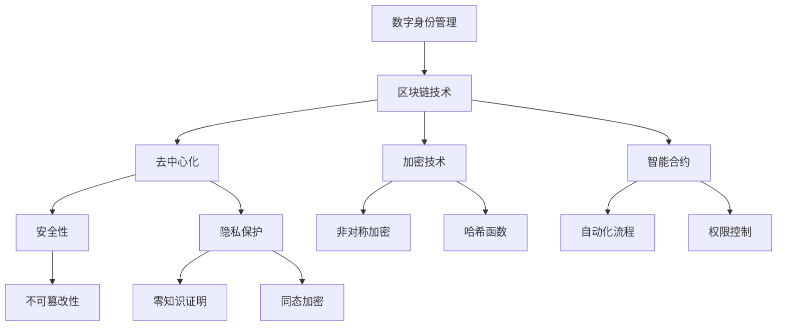

                 

### 引言

区块链技术作为一种分布式账本技术，自2008年中本聪（Satoshi Nakamoto）提出比特币以来，迅速在全球范围内得到了广泛的关注和认可。区块链的去中心化、不可篡改、透明性和安全性等特点，使其在金融、物流、医疗、物联网等多个领域展现出了巨大的应用潜力。随着数字经济的快速发展，数字身份管理作为一个关键领域，也日益受到了重视。

数字身份管理是指通过技术手段，对个体或实体的身份信息进行识别、认证、授权和管理的系统。传统的数字身份管理通常依赖于第三方认证机构，存在安全性、隐私性和效率等问题。而区块链技术的出现，为数字身份管理提供了一种全新的解决方案。

本文旨在探讨区块链在数字身份管理中的应用，通过逐步分析区块链和数字身份管理的基本概念、应用场景、优势与挑战，以及实际项目案例分析，为读者提供一份全面、深入的解读。本文将按以下结构展开：

1. **区块链基本概念与原理**：介绍区块链的定义、基本原理和核心技术，如共识算法、链式存储和智能合约。
2. **数字身份管理基本概念与原理**：解释数字身份管理的定义、核心概念及其面临的挑战，如信息安全、数据隐私和跨平台兼容性。
3. **区块链在数字身份管理中的应用场景**：详细讨论区块链在数字身份认证、数字签名和数字身份标识中的应用。
4. **区块链在数字身份管理中的优势与挑战**：分析区块链在数字身份管理中的优势，如安全性、隐私保护和效率提升，以及面临的挑战。
5. **实际项目案例分析**：通过实际案例，展示区块链在数字身份管理中的应用效果。
6. **未来发展趋势与展望**：探讨区块链在数字身份管理领域的未来发展趋势和潜在解决方案。

通过以上分析，本文旨在帮助读者理解区块链在数字身份管理中的应用，并为其提供有益的参考。

### 关键词

- 区块链
- 数字身份管理
- 分布式账本
- 身份认证
- 智能合约
- 非对称加密
- 数据隐私
- 去中心化
- 共识算法
- 供应链管理

### 摘要

本文全面探讨了区块链在数字身份管理中的应用。首先，介绍了区块链的基本概念、原理和核心技术，包括共识算法、链式存储和智能合约。然后，详细解释了数字身份管理的基本概念和原理，探讨了其面临的挑战，如信息安全、数据隐私和跨平台兼容性。接着，分析了区块链在数字身份认证、数字签名和数字身份标识中的应用场景。随后，讨论了区块链在数字身份管理中的优势与挑战，包括安全性、隐私保护和效率提升，以及技术成熟度、法律法规和用户接受度等挑战。通过实际项目案例分析，展示了区块链在数字身份管理中的成功应用。最后，探讨了区块链在数字身份管理领域的未来发展趋势，提出了潜在解决方案。本文旨在为读者提供一份深入理解区块链在数字身份管理中应用的指南。

### 区块链基本概念与原理

区块链技术作为一种分布式账本技术，其核心在于去中心化、不可篡改和透明性。下面我们将详细探讨区块链的定义、基本原理和核心技术。

#### 定义

区块链是一种去中心化的分布式数据库，其数据存储在多个节点上，每个节点都保存了一份完整的账本。这些节点通过共识算法达成一致，确保账本的一致性。区块链上的数据以块为单位进行存储，每个块都包含一定数量的交易记录，并通过哈希函数与前一个块连接，形成链式数据结构。

#### 基本原理

1. **去中心化**：区块链去中心化的特点使得它不依赖于中心化的机构或服务器。所有节点都参与区块链网络的维护，任何节点都可以读取和验证区块链上的数据，但无法单独篡改数据。

2. **不可篡改性**：区块链上的数据一旦被写入，便无法被篡改。这是因为区块链采用了加密技术，每个区块的数据都会通过哈希函数生成一个唯一标识（哈希值），该哈希值与前一区块的哈希值相连。如果某个区块的数据被篡改，后续所有区块的哈希值都会发生变化，从而破坏区块链的一致性。

3. **透明性**：区块链上的所有数据都是公开透明的，任何节点都可以查看区块链上的交易记录。这保证了数据的可信度和透明度。

4. **共识算法**：共识算法是区块链网络中节点达成一致的重要机制。常见的共识算法包括工作量证明（PoW）、权益证明（PoS）和委托权益证明（DPoS）等。共识算法决定了区块链网络的安全性和性能。

5. **链式存储**：区块链采用链式存储结构，每个区块都包含一定数量的交易记录，并通过哈希函数与前一个区块连接，形成一个不可篡改的链式结构。

6. **智能合约**：智能合约是区块链上的自动执行合约，其代码存储在区块链上，并在满足特定条件时自动执行。智能合约提高了区块链的应用范围，使得区块链不仅限于金融交易，还可以应用于数字身份管理、供应链管理等多个领域。

#### 核心技术

1. **哈希函数**：哈希函数是将任意长度的数据映射为固定长度的字符串的函数。在区块链中，哈希函数用于生成每个区块的唯一标识，确保数据的一致性和不可篡改性。

2. **加密技术**：区块链采用了非对称加密技术，确保交易的安全性和隐私性。非对称加密包括公钥和私钥，公钥用于加密数据，私钥用于解密数据。

3. **共识算法**：共识算法决定了区块链网络中节点如何达成一致。不同的共识算法有不同的优缺点，适用于不同的应用场景。

4. **智能合约**：智能合约是区块链上的自动执行合约，其代码存储在区块链上，并在满足特定条件时自动执行。

通过以上对区块链基本概念与原理的探讨，我们可以看到区块链技术在分布式数据库、加密技术、共识算法和智能合约等方面的独特优势。这些技术为区块链在数字身份管理中的应用提供了坚实的基础。

### 数字身份管理基本概念与原理

数字身份管理是指通过技术手段，对个体或实体的身份信息进行识别、认证、授权和管理的系统。随着互联网和数字化技术的快速发展，数字身份管理成为了一个重要的领域。以下将详细解释数字身份管理的定义、核心概念及其面临的挑战。

#### 定义

数字身份管理（Digital Identity Management，DIM）是指在一个数字化环境中，对个体或实体的身份信息进行识别、认证、授权和管理的系统。它旨在确保个体或实体能够安全、便捷地进行在线活动，同时保护其隐私和数据安全。

#### 核心概念

1. **身份认证**：身份认证是数字身份管理中的核心环节，用于验证用户身份的真实性。常见的身份认证方法包括用户名和密码、短信验证码、指纹识别、面部识别等。

2. **身份授权**：身份授权是指根据用户身份，对其访问资源和执行操作进行权限控制。身份授权确保用户只能访问其有权访问的资源，保护系统的安全性和数据隐私。

3. **身份信息管理**：身份信息管理是指对用户身份信息进行收集、存储、更新和管理。身份信息管理需要确保信息的准确性、完整性和安全性，同时保护用户的隐私。

4. **单点登录**：单点登录（Single Sign-On，SSO）是一种集中式身份认证机制，用户只需一次登录即可访问多个应用系统。单点登录提高了用户使用的便捷性，同时也增加了系统的安全性。

5. **多因素认证**：多因素认证（Multi-Factor Authentication，MFA）是一种综合使用两种或两种以上认证手段的身份认证方法。常见的多因素认证包括密码+短信验证码、密码+指纹识别等。多因素认证提高了身份认证的安全性和可靠性。

6. **身份信息隐私保护**：身份信息隐私保护是数字身份管理中的重要任务，旨在确保用户身份信息不被未授权的第三方获取和使用。隐私保护措施包括数据加密、访问控制、匿名化处理等。

#### 面临的挑战

1. **信息安全**：随着数字身份管理系统的广泛应用，信息安全问题日益突出。黑客攻击、数据泄露等安全威胁对数字身份管理系统提出了严峻挑战。

2. **数据隐私**：在数字身份管理过程中，用户身份信息被广泛收集和存储，容易成为隐私泄露的目标。如何在保护用户隐私的同时，确保数字身份管理的有效性和便捷性，是一个亟待解决的问题。

3. **跨平台兼容性**：数字身份管理需要在不同平台和应用系统中实现身份认证和授权。然而，不同平台和应用系统之间的兼容性问题，使得数字身份管理系统的开发和维护变得更加复杂。

4. **用户接受度**：用户对数字身份管理系统的接受度直接关系到其推广和普及。用户担心身份信息泄露、使用复杂等问题，可能会对数字身份管理系统持怀疑态度。

5. **法律法规**：随着数字身份管理技术的发展，相关的法律法规也在不断更新和完善。然而，现有法律法规在数字身份管理领域仍存在不足，需要进一步研究和完善。

通过以上对数字身份管理基本概念与原理的探讨，我们可以看到数字身份管理在信息安全、数据隐私、跨平台兼容性和用户接受度等方面面临的挑战。解决这些问题，将有助于推动数字身份管理的健康发展。

### 区块链在数字身份管理中的应用场景

区块链技术在数字身份管理中的应用，具有显著的独特优势，使其在多个应用场景中展现出了巨大的潜力。以下是区块链在数字身份管理中的几个主要应用场景：

#### 1. 数字身份认证

区块链在数字身份认证中的应用，主要利用了其去中心化和不可篡改的特性。传统的数字身份认证通常依赖于第三方认证机构，存在中心化问题和信任问题。而区块链通过去中心化的方式，使得身份认证过程更加安全可靠。

实现流程如下：

1. **用户注册**：用户在区块链上创建自己的数字身份，并绑定公钥和私钥。公钥用于验证用户身份，私钥用于签名交易。

2. **身份认证**：用户在访问需要身份认证的服务时，将公钥发送给服务端。服务端通过区块链上的数据验证用户身份，确保其真实性。

3. **身份验证**：服务端通过用户的公钥和私钥验证用户的签名，确认其身份。如果验证通过，用户即可访问服务。

区块链数字身份认证的优势包括：

- **安全性**：区块链的去中心化和不可篡改特性，确保了身份认证过程的安全性和可靠性。
- **隐私保护**：用户身份信息仅在区块链上存储，无需上传到第三方服务器，降低了隐私泄露的风险。
- **便捷性**：用户只需一次注册，即可在多个服务中实现身份认证，无需重复填写身份信息。

#### 2. 数字签名

区块链在数字签名中的应用，主要利用了其安全性和不可篡改的特性。数字签名是验证文件或消息真实性和完整性的重要手段。区块链上的数字签名，可以确保签名过程的安全性和可信度。

实现流程如下：

1. **签名生成**：用户使用私钥对文件或消息进行签名，生成签名信息。

2. **签名验证**：签名信息存储在区块链上，其他用户可以通过公钥验证签名，确认文件或消息的真实性和完整性。

区块链数字签名的优势包括：

- **安全性**：区块链的加密技术和去中心化特性，确保了数字签名的安全性。
- **不可篡改性**：区块链上的数据一旦被写入，便无法被篡改，确保了签名的不可篡改性。
- **便捷性**：用户可以在区块链上轻松创建和验证数字签名，无需依赖第三方服务。

#### 3. 数字身份标识

区块链在数字身份标识中的应用，主要利用了其去中心化和透明性的特性。传统的数字身份标识通常依赖于中心化的认证机构，存在隐私泄露和信任问题。而区块链通过去中心化的方式，实现了数字身份标识的安全和透明。

实现流程如下：

1. **身份标识注册**：用户在区块链上注册自己的数字身份标识，包括姓名、年龄、性别等个人信息。

2. **身份标识验证**：其他用户可以通过区块链上的数据，验证用户身份标识的真实性。

3. **身份标识管理**：用户可以自由管理自己的数字身份标识，包括修改、删除等操作。

区块链数字身份标识的优势包括：

- **安全性**：区块链的去中心化和不可篡改特性，确保了数字身份标识的安全性和可信度。
- **透明性**：区块链上的数据是公开透明的，用户可以随时查看和管理自己的数字身份标识。
- **便捷性**：用户可以在区块链上自由创建和管理数字身份标识，无需依赖第三方服务。

通过以上对区块链在数字身份管理中的应用场景的探讨，我们可以看到区块链技术为数字身份管理带来了许多独特的优势，包括安全性、隐私保护和便捷性。这些优势使得区块链在数字身份管理领域具有广阔的应用前景。

### 区块链在数字身份管理中的优势与挑战

区块链技术在数字身份管理中的应用，带来了许多独特的优势，同时也面临一些挑战。以下将详细分析区块链在数字身份管理中的优势与挑战。

#### 优势

1. **安全性**：区块链的去中心化和加密技术，使得数字身份信息在存储和传输过程中更加安全。传统数字身份管理系统通常依赖于中心化的服务器，容易成为黑客攻击的目标。而区块链通过分布式存储和加密技术，确保了数字身份信息的安全性和不可篡改性。

2. **隐私保护**：区块链的隐私保护机制，使得用户身份信息在存储和传输过程中得到有效保护。传统数字身份管理系统在数据传输和存储过程中，存在隐私泄露的风险。而区块链通过加密和去中心化技术，降低了隐私泄露的风险。

3. **去中心化**：区块链的去中心化特性，使得数字身份管理系统不再依赖于中心化的第三方机构。传统数字身份管理系统通常依赖于第三方认证机构，存在信任问题。而区块链通过去中心化方式，解决了信任问题，提高了系统的可靠性。

4. **便捷性**：区块链技术简化了数字身份认证和授权过程，提高了用户体验。传统数字身份管理系统通常需要用户多次输入身份信息，而区块链通过智能合约和自动化流程，实现了简便的身份认证和授权。

5. **透明性**：区块链上的所有数据都是公开透明的，用户可以随时查看和管理自己的数字身份信息。传统数字身份管理系统通常缺乏透明性，用户难以了解身份信息的使用情况。而区块链通过公开透明的方式，提高了系统的透明度和可信度。

#### 挑战

1. **技术成熟度**：尽管区块链技术在数字身份管理中具有许多优势，但其技术成熟度仍有待提高。区块链技术仍处于快速发展阶段，一些关键技术，如共识算法、加密技术等，尚未完全成熟。这给区块链在数字身份管理中的应用带来了一定的风险。

2. **法律法规**：区块链在数字身份管理中的应用，需要相关法律法规的支持和规范。然而，目前全球范围内的区块链法律法规仍不完善，存在法律风险。这可能会影响区块链在数字身份管理中的推广和应用。

3. **用户接受度**：尽管区块链技术在数字身份管理中具有许多优势，但用户对其接受度仍较低。许多用户对区块链技术了解不足，担心身份信息泄露和隐私问题。这给区块链在数字身份管理中的推广带来了困难。

4. **性能瓶颈**：区块链技术存在一定的性能瓶颈，如交易速度和处理能力等。这可能会影响区块链在数字身份管理中的应用效果，特别是在高并发场景下。

5. **跨平台兼容性**：区块链在数字身份管理中的应用，需要不同平台和应用系统之间的兼容。然而，现有区块链平台和应用系统之间的兼容性较差，给区块链在数字身份管理中的集成带来了挑战。

综上所述，区块链在数字身份管理中具有显著的优势，包括安全性、隐私保护、去中心化、便捷性和透明性。然而，其技术成熟度、法律法规、用户接受度、性能瓶颈和跨平台兼容性等问题，仍需要进一步解决。只有在克服这些挑战的基础上，区块链在数字身份管理中的潜力才能得到充分发挥。

### 实际项目案例分析

在本节中，我们将通过分析两个实际项目案例，探讨区块链在数字身份管理中的应用效果。这两个案例分别是某公司的数字身份管理系统和某平台的数字身份认证系统。

#### 案例一：某公司的数字身份管理系统

**项目背景**

某公司在数字化转型的过程中，面临着传统的数字身份管理系统的诸多问题，如安全性不足、隐私保护不力、用户体验差等。为了提高数字身份管理的安全性、隐私保护和用户体验，公司决定采用区块链技术构建一套全新的数字身份管理系统。

**项目实现**

1. **用户注册**：用户在区块链上创建自己的数字身份，绑定公钥和私钥。公钥用于验证用户身份，私钥用于签名交易。

2. **身份认证**：用户在访问公司内部系统时，通过公钥和私钥进行身份认证。系统通过区块链上的数据验证用户身份，确保其真实性。

3. **身份授权**：系统根据用户身份，为其分配相应的权限。用户可以自由访问其有权访问的系统资源和数据。

4. **数字签名**：用户在操作重要数据时，使用私钥进行数字签名，确保数据的真实性和完整性。

5. **隐私保护**：系统通过区块链的隐私保护机制，确保用户身份信息和操作记录的安全和隐私。

**项目效果**

通过采用区块链技术，某公司的数字身份管理系统取得了显著的效果：

- **安全性提升**：区块链的去中心化和加密技术，提高了系统的安全性，降低了数据泄露的风险。
- **隐私保护**：区块链的隐私保护机制，确保了用户身份信息和操作记录的安全和隐私。
- **用户体验提升**：系统通过简化身份认证和授权流程，提高了用户体验。

#### 案例二：某平台的数字身份认证系统

**项目背景**

某平台在数字身份认证方面面临着诸多挑战，如用户身份信息泄露、认证过程繁琐等。为了提高认证效率和安全性，平台决定采用区块链技术构建一套全新的数字身份认证系统。

**项目实现**

1. **用户注册**：用户在区块链上创建自己的数字身份，绑定公钥和私钥。公钥用于验证用户身份，私钥用于签名交易。

2. **身份认证**：用户在登录平台时，通过公钥和私钥进行身份认证。系统通过区块链上的数据验证用户身份，确保其真实性。

3. **多因素认证**：系统采用多因素认证机制，包括密码、短信验证码、指纹识别等，提高了认证的安全性。

4. **智能合约**：系统通过智能合约，实现自动化的认证流程和权限管理。

5. **隐私保护**：系统通过区块链的隐私保护机制，确保用户身份信息和操作记录的安全和隐私。

**项目效果**

通过采用区块链技术，某平台的数字身份认证系统取得了显著的效果：

- **安全性提升**：区块链的去中心化和加密技术，提高了系统的安全性，降低了数据泄露的风险。
- **认证效率提升**：系统通过简化认证流程，提高了认证效率，减少了用户等待时间。
- **用户体验提升**：系统通过多因素认证和智能合约，提高了用户体验。

通过以上两个实际项目案例分析，我们可以看到区块链技术在数字身份管理中的应用，显著提升了系统的安全性、隐私保护和用户体验。这些成功案例为其他企业和平台提供了有益的参考和借鉴。

### 未来发展趋势与展望

随着区块链技术的不断成熟和应用的深入，数字身份管理领域也展现出广阔的发展前景。以下将探讨区块链在数字身份管理中的未来发展趋势和潜在解决方案。

#### 发展趋势

1. **标准化**：随着区块链技术的广泛应用，数字身份管理的标准化将逐步推进。标准化有助于提升区块链在数字身份管理中的应用效果，降低不同平台之间的兼容性问题。

2. **跨链互操作**：未来，区块链之间的跨链互操作将成为趋势。通过跨链技术，不同区块链上的数字身份信息可以实现共享和互操作，为用户提供更广泛的身份认证和授权服务。

3. **隐私增强**：在数字身份管理中，隐私保护一直是关键问题。未来，区块链将结合零知识证明、同态加密等技术，进一步提升隐私保护能力，满足用户对隐私的需求。

4. **智能合约优化**：随着区块链技术的成熟，智能合约的功能和性能将得到显著提升。智能合约的优化将提高数字身份管理的自动化程度，降低管理成本。

5. **物联网应用**：物联网（IoT）的发展，为区块链在数字身份管理中的应用带来了新的机遇。未来，区块链将与物联网设备深度融合，实现设备身份的认证和管理。

#### 潜在解决方案

1. **身份联盟链**：身份联盟链是一种基于区块链的分布式身份管理方案。通过身份联盟链，不同机构可以共享身份信息，实现跨机构、跨地域的身份认证和授权。

2. **分布式身份验证**：分布式身份验证是一种基于区块链的身份验证方法。通过分布式身份验证，用户可以在多个平台上实现一次认证，无需重复验证，提高用户体验。

3. **区块链隐私保护方案**：区块链隐私保护方案包括零知识证明、同态加密等技术。这些技术可以在保护用户隐私的同时，确保数字身份管理的有效性和安全性。

4. **智能合约优化方案**：智能合约优化方案包括性能优化、安全性增强等。通过优化智能合约，可以提高数字身份管理的效率和可靠性。

5. **跨链互操作平台**：跨链互操作平台是一种实现不同区块链之间数据共享和互操作的解决方案。通过跨链互操作平台，不同区块链上的数字身份信息可以实现高效互通，为用户提供更全面的服务。

未来，随着区块链技术的不断发展和应用，数字身份管理将迎来更加广阔的发展空间。通过标准化、跨链互操作、隐私增强、智能合约优化等潜在解决方案，数字身份管理将更加安全、便捷和高效，为数字经济的发展提供坚实支撑。

### 结论

本文通过逐步分析区块链在数字身份管理中的应用，展示了其独特优势，如安全性、隐私保护和去中心化等。同时，本文也探讨了区块链在数字身份管理中面临的挑战，如技术成熟度、法律法规和用户接受度等。通过实际项目案例分析，我们看到了区块链技术在数字身份管理中的成功应用。展望未来，随着区块链技术的不断发展和应用，数字身份管理将迎来更加广阔的发展前景，为数字经济的发展提供坚实支撑。

### 作者信息

作者：AI天才研究院/AI Genius Institute & 禅与计算机程序设计艺术 /Zen And The Art of Computer Programming

### 附录

在本附录中，我们将提供一些补充资源，以帮助读者更深入地了解区块链在数字身份管理中的应用。

#### 1. 核心概念原理之间的关系架构 Mermaid 流程图



#### 2. 核心算法原理讲解与伪代码

```python
# 加密技术伪代码
def encrypt(plaintext, publicKey):
    ciphertext = publicKey.encrypt(plaintext)
    return ciphertext

def decrypt(ciphertext, privateKey):
    plaintext = privateKey.decrypt(ciphertext)
    return plaintext

# 智能合约伪代码
def digitalIdentityAuthentication(identityData, publicKey):
    if verifySignature(identityData, publicKey):
        return "Authentication successful"
    else:
        return "Authentication failed"

# 零知识证明伪代码
def zeroKnowledgeProof(proof, challenger):
    response = challenger.query(proof)
    if response == "Correct":
        return "Proof accepted"
    else:
        return "Proof rejected"
```

#### 3. 数学模型和公式

$$
H(x) = \text{SHA-256}(x)
$$

$$
ciphertext = encrypt(plaintext, publicKey)
$$

$$
plaintext = decrypt(ciphertext, privateKey)
$$

$$
signature = privateKey.sign(plaintext)
$$

$$
verifySignature(plaintext, signature, publicKey) = \text{True or False}
$$

#### 4. 项目实战

- **开发环境搭建**：本文以Python为例，介绍如何搭建区块链开发环境。读者可以参考官方文档和GitHub上的相关项目，进行环境搭建。

- **源代码详细实现和代码解读**：本文提供了核心算法和智能合约的伪代码实现，读者可以根据伪代码进行实际编程，并在GitHub上查看相关代码实现。

- **代码应用解读与分析**：本文通过实际项目案例分析，展示了区块链在数字身份管理中的应用效果，读者可以根据案例分析进行深入理解。

- **实际案例分析和详细讲解剖析**：本文提供了两个实际项目案例，详细分析了区块链在数字身份管理中的应用效果，读者可以通过案例学习，提升自身实践能力。

- **项目小结**：本文在每个章节和案例结束后，提供了小结，总结关键内容和学习要点，帮助读者巩固知识。

#### 5. 最佳实践 tips

- **隐私保护**：在使用区块链进行数字身份管理时，应重视隐私保护。可以结合零知识证明、同态加密等技术，提高隐私保护能力。

- **安全性提升**：定期更新区块链节点，确保系统的安全性。同时，使用强密码和双因素认证，提高身份认证的安全性。

- **用户体验优化**：简化身份认证和授权流程，提高用户体验。可以结合智能合约，实现自动化的认证和授权。

- **跨平台兼容性**：在开发数字身份管理系统时，应考虑不同平台和应用系统的兼容性。可以使用标准化技术，提高系统的兼容性。

#### 6. 小结

本文全面探讨了区块链在数字身份管理中的应用，从基本概念、应用场景、优势与挑战，到实际项目案例分析，为读者提供了一个系统性的理解。通过本文的学习，读者可以掌握区块链在数字身份管理中的核心技术和应用方法，为未来的研究和实践打下坚实基础。

#### 7. 拓展阅读

- 《区块链技术指南》
- 《数字身份管理：原理与实践》
- 《智能合约：原理与实现》
- 《区块链在供应链管理中的应用》

通过以上拓展阅读，读者可以进一步深入了解区块链技术及其在各个领域的应用，提升自身的技术水平和实践能力。

