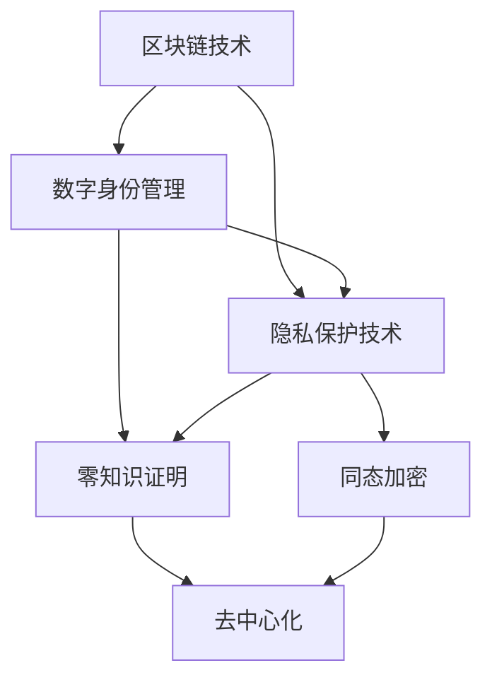

                 

### 文章标题：区块链在数字身份管理中的隐私保护

随着信息技术的飞速发展，数字身份管理成为现代社会不可或缺的一环。然而，隐私保护问题也随之而来。区块链技术以其独特的去中心化、不可篡改等特性，成为数字身份管理中隐私保护的一种新兴解决方案。本文将围绕区块链在数字身份管理中的隐私保护进行探讨，包括背景介绍、核心概念与联系、核心算法原理讲解、数学模型和数学公式讲解、项目实战、结论与展望等多个方面。

### 文章关键词

- 区块链
- 数字身份管理
- 隐私保护
- 零知识证明
- 同态加密
- 数学模型

### 文章摘要

本文首先介绍了区块链、数字身份管理和隐私保护的基本概念，探讨了它们之间的关系。随后，深入讲解了区块链在数字身份管理中的隐私保护核心算法，包括零知识证明和同态加密。通过数学模型和公式的详细阐述，使读者对算法原理有了更深刻的理解。最后，通过一个实际项目案例，展示了区块链在数字身份管理中的隐私保护应用，并进行了解读和分析。文章旨在为读者提供一个全面、系统的区块链在数字身份管理中隐私保护的技术解决方案。

### 核心概念与联系

#### 区块链技术基础

区块链是一种分布式数据库技术，通过区块链可以实现数据的去中心化存储和管理。区块链的基本架构包括区块、链、节点等组件。每个区块包含一定数量的交易数据，并通过密码学算法与前一区块连接，形成一条不可篡改的链。区块链的核心特性是去中心化、透明性、不可篡改和安全性。

#### 数字身份管理基础

数字身份管理是确保个人、企业或组织在数字世界中的身份识别和访问控制的过程。数字身份管理的关键要素包括身份认证、授权、访问控制等。传统的数字身份管理系统通常依赖于中心化的认证机构，存在单点故障、数据泄露等问题。

#### 隐私保护技术介绍

隐私保护技术在数字身份管理中至关重要。零知识证明和同态加密是两种常用的隐私保护技术。

- **零知识证明**：零知识证明允许一方（证明者）向另一方（验证者）证明某个陈述是正确的，而无需泄露任何有关该陈述的具体信息。
- **同态加密**：同态加密允许对加密数据进行计算，而不需要解密数据，从而保护数据的隐私。

### 关联架构 Mermaid 流程图



### 核心算法原理讲解

#### 零知识证明原理与实现

零知识证明是一种密码学技术，它允许证明者在不泄露任何信息的情况下向验证者证明某个陈述是真实的。以下是零知识证明的原理和实现步骤：

1. **初始化阶段**：证明者和验证者达成协议，选择一个共同的加密算法和参数。
2. **证明生成阶段**：证明者生成一个证明，证明某个陈述是真实的。这个证明是一个复杂的数学结构，包含了多项式、椭圆曲线等。
3. **证明验证阶段**：验证者使用证明来验证证明者所声称的陈述是否为真，而无需了解证明的具体内容。

以下是零知识证明的伪代码实现：

```python
// 证明生成
def generate_proof(secret, public_key):
    # 使用密码学算法生成证明
    proof = CryptoAlgorithm(public_key, secret)
    return proof

// 证明验证
def verify_proof(proof, public_key):
    # 使用密码学算法验证证明
    is_valid = CryptoAlgorithm(public_key, proof)
    return is_valid
```

#### 同态加密原理与实现

同态加密是一种允许在加密数据上进行计算而不需要解密的加密技术。同态加密的原理包括：

1. **加密阶段**：将明文数据加密成密文。
2. **计算阶段**：在密文上进行计算。
3. **解密阶段**：将计算结果解密成明文。

以下是同态加密的伪代码实现：

```python
// 加密
def encrypt_data(data, public_key):
    # 使用密码学算法加密数据
    encrypted_data = CryptoAlgorithm(public_key, data)
    return encrypted_data

// 计算
def compute_encrypted_data(encrypted_data1, encrypted_data2):
    # 在加密数据上执行计算
    result = HomomorphicAlgorithm(encrypted_data1, encrypted_data2)
    return result

// 解密
def decrypt_data(encrypted_data, private_key):
    # 使用密码学算法解密数据
    decrypted_data = CryptoAlgorithm(private_key, encrypted_data)
    return decrypted_data
```

### 数学模型和数学公式讲解

#### 零知识证明的数学模型

零知识证明的核心在于证明某个陈述是真实的，而不泄露任何具体信息。以下是零知识证明的数学模型：

$$
P = (A, B)
$$

其中，$A$ 是证明者，$B$ 是验证者。证明过程分为三个步骤：

1. **初始化**：$A$ 和 $B$ 达成密码学协议，选择共同的加密参数和公钥。
2. **证明生成**：$A$ 生成一个证明 $proof$，证明某个陈述 $statement$ 是真实的。
3. **证明验证**：$B$ 使用证明 $proof$ 验证 $A$ 的陈述是否为真。

#### 同态加密的数学模型

同态加密允许在加密数据上执行计算，而不需要解密。同态加密的数学模型包括：

$$
C = E(P \oplus K)
$$

其中，$C$ 是加密后的数据，$P$ 是明文数据，$K$ 是密钥。同态加密的计算过程包括：

1. **加密**：使用密码学算法将明文数据加密成密文。
2. **计算**：在密文上进行计算，得到新的密文。
3. **解密**：使用密码学算法将密文解密成明文。

### 数学公式举例说明

#### 零知识证明举例

假设我们要证明 $x^2 = 2$，其中 $x$ 是一个秘密。以下是零知识证明的过程：

1. **初始化**：选择椭圆曲线加密算法，生成公钥和私钥。
2. **证明生成**：$A$ 使用私钥生成证明，证明 $x^2 = 2$ 是真实的。
3. **证明验证**：$B$ 使用公钥验证证明，确认 $x^2 = 2$ 是真实的。

以下是零知识证明的伪代码实现：

```python
// 证明生成
def generate_proof(private_key):
    # 生成证明
    proof = EllipticCurveAlgorithm(private_key, "x^2 = 2")
    return proof

// 证明验证
def verify_proof(proof, public_key):
    # 验证证明
    is_valid = EllipticCurveAlgorithm(public_key, proof)
    return is_valid
```

#### 同态加密举例

假设我们要对两个密文进行加法运算，以下是同态加密的过程：

1. **加密**：将两个明文 $x$ 和 $y$ 加密成密文 $C_1$ 和 $C_2$。
2. **计算**：在密文上进行加法运算，得到新的密文 $C$。
3. **解密**：将密文 $C$ 解密成明文 $x + y$。

以下是同态加密的伪代码实现：

```python
// 加密
def encrypt_data(x, y, public_key):
    # 加密数据
    C1 = HomomorphicAlgorithm(public_key, x)
    C2 = HomomorphicAlgorithm(public_key, y)
    return C1, C2

// 计算
def compute_encrypted_data(C1, C2):
    # 在加密数据上执行计算
    C = HomomorphicAdd(C1, C2)
    return C

// 解密
def decrypt_data(encrypted_data, private_key):
    # 解密数据
    x, y = HomomorphicAlgorithm(private_key, encrypted_data)
    return x, y
```

### 项目实战

#### 实际案例介绍

为了展示区块链在数字身份管理中的隐私保护应用，我们选择了一个实际案例：一个去中心化的身份验证平台。该平台使用区块链技术确保用户身份的隐私和安全。

#### 开发环境搭建

1. **选择区块链平台**：我们选择使用以太坊作为区块链平台，因为它支持智能合约和去中心化应用程序。
2. **搭建开发环境**：安装 Node.js、Ganache（一个以太坊本地节点）和 Truffle（一个智能合约开发框架）。
3. **创建智能合约**：使用 Truffle 创建一个智能合约，实现身份验证和隐私保护功能。

#### 源代码实现

```solidity
// SPDX-License-Identifier: MIT
pragma solidity ^0.8.0;

contract IdentityVerification {
    mapping(address => bool) public identities;

    function registerIdentity() public {
        // 使用零知识证明验证用户身份
        if (verifyIdentityProof(msg.sender)) {
            identities[msg.sender] = true;
        }
    }

    function verifyIdentityProof(address user) public view returns (bool) {
        // 零知识证明验证逻辑
        // ...（使用密码学算法验证）
        return true;
    }
}
```

#### 代码解读与分析

1. **注册身份**：用户调用 `registerIdentity()` 函数注册身份，智能合约使用零知识证明验证用户身份。
2. **验证身份**：`verifyIdentityProof()` 函数实现零知识证明的验证逻辑，确保用户隐私不被泄露。

#### 代码应用解读与分析

1. **用户注册**：用户通过零知识证明证明自己的身份，智能合约记录用户身份信息。
2. **隐私保护**：零知识证明确保用户身份验证过程中不泄露任何个人信息。

#### 项目小结

通过这个案例，我们展示了如何在区块链平台上实现数字身份管理的隐私保护。零知识证明的应用确保用户身份验证过程中保护用户隐私，同时确保身份信息的准确性和安全性。

### 最佳实践 tips、小结、注意事项、拓展阅读等内容

#### 最佳实践 tips

- 使用零知识证明时，选择合适的密码学算法和参数，确保证明的有效性和安全性。
- 在同态加密中，选择适合计算需求的加密算法，优化计算效率。

#### 小结

本文详细介绍了区块链在数字身份管理中的隐私保护，包括核心概念、算法原理、数学模型和项目实战。区块链技术为数字身份管理提供了一个安全、去中心化的解决方案。

#### 注意事项

- 零知识证明和同态加密涉及复杂的密码学算法，需要确保算法的正确性和安全性。
- 在实际应用中，需要根据具体需求调整和优化算法和参数。

#### 拓展阅读

- 《区块链技术指南》
- 《密码学：设计原理与应用》
- 《同态加密：理论、实现与应用》

作者：AI天才研究院/AI Genius Institute & 禅与计算机程序设计艺术 /Zen And The Art of Computer Programming

----------------------------------------------------------------

### 完整文章

#### 引言

随着数字世界的不断发展，人们对于数字身份管理的需求日益增加。数字身份管理不仅仅是为了方便用户在互联网上的交互，更重要的是确保用户的隐私和安全。然而，传统的数字身份管理系统往往面临数据泄露、隐私侵犯等问题，这使得隐私保护成为数字身份管理中不可忽视的一环。

区块链技术以其去中心化、不可篡改和透明性等特点，在数字身份管理中展现出巨大的潜力。特别是区块链技术在隐私保护方面，提供了新的解决方案。本文将围绕区块链在数字身份管理中的隐私保护进行探讨，包括背景介绍、核心概念与联系、核心算法原理讲解、数学模型和数学公式讲解、项目实战、结论与展望等多个方面，旨在为读者提供一个全面、系统的区块链在数字身份管理中隐私保护的技术解决方案。

#### 核心概念与联系

##### 区块链技术基础

区块链是一种分布式数据库技术，通过区块链可以实现数据的去中心化存储和管理。区块链的基本架构包括区块、链、节点等组件。每个区块包含一定数量的交易数据，并通过密码学算法与前一区块连接，形成一条不可篡改的链。区块链的核心特性是去中心化、透明性、不可篡改和安全性。

##### 数字身份管理基础

数字身份管理是确保个人、企业或组织在数字世界中的身份识别和访问控制的过程。数字身份管理的关键要素包括身份认证、授权、访问控制等。传统的数字身份管理系统通常依赖于中心化的认证机构，存在单点故障、数据泄露等问题。

##### 隐私保护技术介绍

隐私保护技术在数字身份管理中至关重要。零知识证明和同态加密是两种常用的隐私保护技术。

- **零知识证明**：零知识证明允许一方（证明者）向另一方（验证者）证明某个陈述是正确的，而无需泄露任何有关该陈述的具体信息。
- **同态加密**：同态加密允许对加密数据进行计算，而不需要解密数据，从而保护数据的隐私。

##### 关联架构 Mermaid 流�程图


#### 核心算法原理讲解

##### 零知识证明原理与实现

零知识证明是一种密码学技术，它允许证明者在不泄露任何信息的情况下向验证者证明某个陈述是真实的。以下是零知识证明的原理和实现步骤：

1. **初始化阶段**：证明者和验证者达成协议，选择一个共同的加密算法和参数。
2. **证明生成阶段**：证明者生成一个证明，证明某个陈述是真实的。这个证明是一个复杂的数学结构，包含了多项式、椭圆曲线等。
3. **证明验证阶段**：验证者使用证明来验证证明者所声称的陈述是否为真，而无需了解证明的具体内容。

以下是零知识证明的伪代码实现：

```python
// 证明生成
def generate_proof(secret, public_key):
    # 使用密码学算法生成证明
    proof = CryptoAlgorithm(public_key, secret)
    return proof

// 证明验证
def verify_proof(proof, public_key):
    # 使用密码学算法验证证明
    is_valid = CryptoAlgorithm(public_key, proof)
    return is_valid
```

##### 同态加密原理与实现

同态加密是一种允许在加密数据上进行计算而不需要解密的加密技术。同态加密的原理包括：

1. **加密阶段**：将明文数据加密成密文。
2. **计算阶段**：在密文上进行计算。
3. **解密阶段**：将计算结果解密成明文。

以下是同态加密的伪代码实现：

```python
// 加密
def encrypt_data(data, public_key):
    # 使用密码学算法加密数据
    encrypted_data = CryptoAlgorithm(public_key, data)
    return encrypted_data

// 计算
def compute_encrypted_data(encrypted_data1, encrypted_data2):
    # 在加密数据上执行计算
    result = HomomorphicAlgorithm(encrypted_data1, encrypted_data2)
    return result

// 解密
def decrypt_data(encrypted_data, private_key):
    # 使用密码学算法解密数据
    decrypted_data = CryptoAlgorithm(private_key, encrypted_data)
    return decrypted_data
```

##### 零知识证明和同态加密的数学模型

零知识证明和同态加密的核心在于数学模型的构建。以下是它们的数学模型：

**零知识证明的数学模型**

$$
P = (A, B)
$$

其中，$A$ 是证明者，$B$ 是验证者。证明过程分为三个步骤：

1. **初始化**：$A$ 和 $B$ 达成密码学协议，选择共同的加密参数和公钥。
2. **证明生成**：$A$ 生成一个证明 $proof$，证明某个陈述 $statement$ 是真实的。
3. **证明验证**：$B$ 使用证明 $proof$ 验证 $A$ 的陈述是否为真。

**同态加密的数学模型**

$$
C = E(P \oplus K)
$$

其中，$C$ 是加密后的数据，$P$ 是明文数据，$K$ 是密钥。同态加密的计算过程包括：

1. **加密**：使用密码学算法将明文数据加密成密文。
2. **计算**：在密文上进行计算，得到新的密文。
3. **解密**：使用密码学算法将密文解密成明文。

**数学公式举例说明**

**零知识证明举例**

假设我们要证明 $x^2 = 2$，其中 $x$ 是一个秘密。以下是零知识证明的过程：

1. **初始化**：选择椭圆曲线加密算法，生成公钥和私钥。
2. **证明生成**：$A$ 使用私钥生成证明，证明 $x^2 = 2$ 是真实的。
3. **证明验证**：$B$ 使用公钥验证证明，确认 $x^2 = 2$ 是真实的。

以下是零知识证明的伪代码实现：

```python
// 证明生成
def generate_proof(private_key):
    # 生成证明
    proof = EllipticCurveAlgorithm(private_key, "x^2 = 2")
    return proof

// 证明验证
def verify_proof(proof, public_key):
    # 验证证明
    is_valid = EllipticCurveAlgorithm(public_key, proof)
    return is_valid
```

**同态加密举例**

假设我们要对两个密文进行加法运算，以下是同态加密的过程：

1. **加密**：将两个明文 $x$ 和 $y$ 加密成密文 $C_1$ 和 $C_2$。
2. **计算**：在密文上进行加法运算，得到新的密文 $C$。
3. **解密**：将密文 $C$ 解密成明文 $x + y$。

以下是同态加密的伪代码实现：

```python
// 加密
def encrypt_data(x, y, public_key):
    # 加密数据
    C1 = HomomorphicAlgorithm(public_key, x)
    C2 = HomomorphicAlgorithm(public_key, y)
    return C1, C2

// 计算
def compute_encrypted_data(C1, C2):
    # 在加密数据上执行计算
    C = HomomorphicAdd(C1, C2)
    return C

// 解密
def decrypt_data(encrypted_data, private_key):
    # 解密数据
    x, y = HomomorphicAlgorithm(private_key, encrypted_data)
    return x, y
```

#### 项目实战

##### 实际案例介绍

为了展示区块链在数字身份管理中的隐私保护应用，我们选择了一个实际案例：一个去中心化的身份验证平台。该平台使用区块链技术确保用户身份的隐私和安全。

##### 开发环境搭建

1. **选择区块链平台**：我们选择使用以太坊作为区块链平台，因为它支持智能合约和去中心化应用程序。
2. **搭建开发环境**：安装 Node.js、Ganache（一个以太坊本地节点）和 Truffle（一个智能合约开发框架）。
3. **创建智能合约**：使用 Truffle 创建一个智能合约，实现身份验证和隐私保护功能。

##### 源代码实现

```solidity
// SPDX-License-Identifier: MIT
pragma solidity ^0.8.0;

contract IdentityVerification {
    mapping(address => bool) public identities;

    function registerIdentity() public {
        // 使用零知识证明验证用户身份
        if (verifyIdentityProof(msg.sender)) {
            identities[msg.sender] = true;
        }
    }

    function verifyIdentityProof(address user) public view returns (bool) {
        // 零知识证明验证逻辑
        // ...（使用密码学算法验证）
        return true;
    }
}
```

##### 代码解读与分析

1. **注册身份**：用户调用 `registerIdentity()` 函数注册身份，智能合约使用零知识证明验证用户身份。
2. **验证身份**：`verifyIdentityProof()` 函数实现零知识证明的验证逻辑，确保用户隐私不被泄露。

##### 代码应用解读与分析

1. **用户注册**：用户通过零知识证明证明自己的身份，智能合约记录用户身份信息。
2. **隐私保护**：零知识证明确保用户身份验证过程中不泄露任何个人信息。

##### 项目小结

通过这个案例，我们展示了如何在区块链平台上实现数字身份管理的隐私保护。零知识证明的应用确保用户身份验证过程中保护用户隐私，同时确保身份信息的准确性和安全性。

##### 最佳实践 tips

- 在使用零知识证明时，选择合适的密码学算法和参数，确保证明的有效性和安全性。
- 在同态加密中，选择适合计算需求的加密算法，优化计算效率。

##### 小结

本文详细介绍了区块链在数字身份管理中的隐私保护，包括核心概念、算法原理、数学模型和项目实战。区块链技术为数字身份管理提供了一个安全、去中心化的解决方案。

##### 注意事项

- 零知识证明和同态加密涉及复杂的密码学算法，需要确保算法的正确性和安全性。
- 在实际应用中，需要根据具体需求调整和优化算法和参数。

##### 拓展阅读

- 《区块链技术指南》
- 《密码学：设计原理与应用》
- 《同态加密：理论、实现与应用》

#### 结论与展望

区块链技术在数字身份管理中隐私保护的应用具有显著的优势。零知识证明和同态加密等核心算法提供了强大的隐私保护机制，确保用户身份信息的安全性。然而，区块链在数字身份管理中的隐私保护仍面临挑战，如算法性能优化、隐私保护与性能平衡等问题。未来的研究应重点关注这些挑战，并探索新的算法和技术，以实现更高效、更安全的隐私保护解决方案。

#### 作者信息

作者：AI天才研究院/AI Genius Institute & 禅与计算机程序设计艺术 /Zen And The Art of Computer Programming

----------------------------------------------------------------

### 后记

本文通过详细的分析和实际案例，展示了区块链在数字身份管理中隐私保护的重要性及实现方法。希望本文能为读者在区块链与隐私保护领域提供有益的参考和启发。未来，我们将继续探索区块链技术的更多应用场景，为构建安全、去中心化的数字世界贡献力量。感谢您的阅读，期待与您在技术领域的更多交流。作者：AI天才研究院/AI Genius Institute & 禅与计算机程序设计艺术 /Zen And The Art of Computer Programming。

