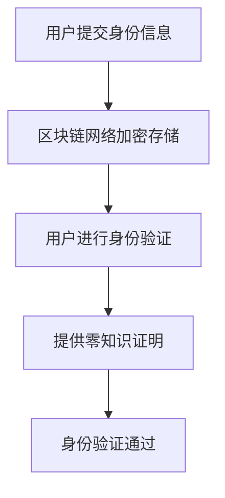
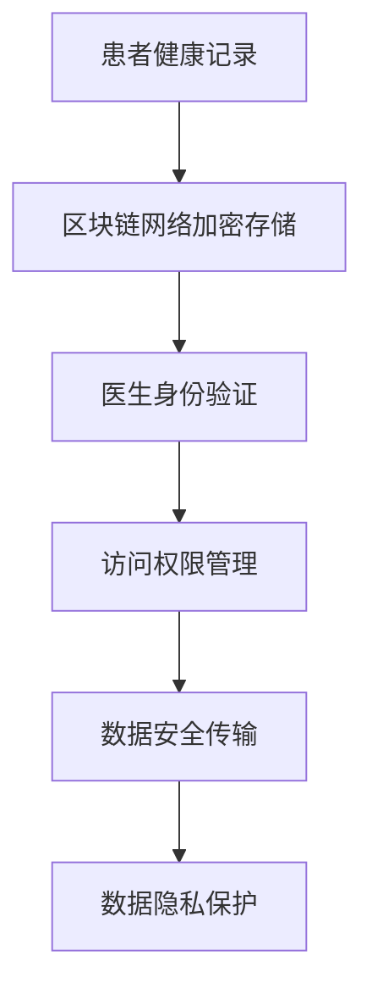
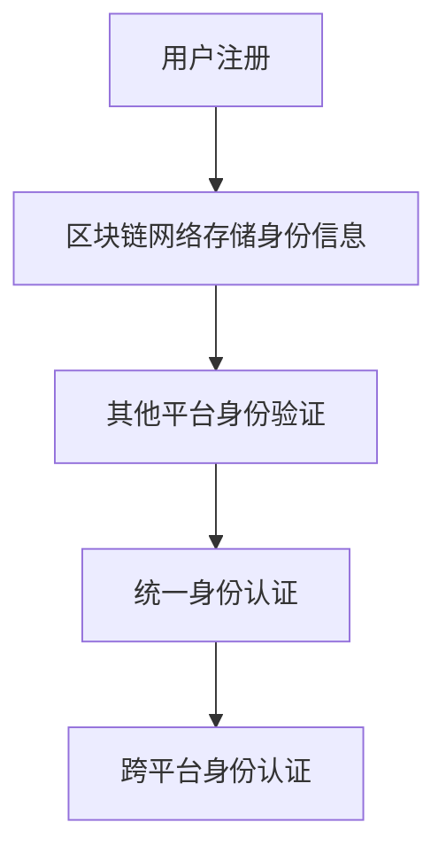

                 

### 文章标题：区块链在数字身份管理中的隐私保护应用

在信息化和数字化时代，数字身份管理已成为人们日常生活中不可或缺的一部分。无论是进行在线购物、电子支付，还是进行身份验证，数字身份管理的安全性和隐私性都至关重要。随着区块链技术的兴起，其在数字身份管理中的应用为隐私保护提供了新的可能。本文将深入探讨区块链在数字身份管理中的隐私保护应用，旨在揭示这一前沿技术如何为信息安全保驾护航。

关键词：区块链，数字身份管理，隐私保护，零知识证明，混合区块链

摘要：本文首先介绍了区块链和数字身份管理的基本概念及其在现代社会的应用。接着，分析了传统数字身份管理面临的隐私挑战，并探讨了区块链技术如何通过隐私保护机制和算法提供解决方案。随后，本文通过实际案例展示了区块链在数字身份管理中的具体应用。最后，本文总结了区块链隐私保护技术面临的挑战和未来研究方向，为推动区块链技术的进一步发展提供了启示。

### 引言

随着互联网技术的迅猛发展，人们的生活逐渐数字化。数字身份管理作为一种新兴技术，已经渗透到社会的各个领域。无论是个人用户还是企业机构，数字身份管理都成为了信息交流和交易的安全保障。然而，数字身份管理同时也面临着巨大的隐私挑战。传统数字身份管理系统往往依赖于中心化的数据存储和处理，这使得用户的隐私数据容易成为黑客攻击的目标。

区块链技术的出现为解决这一难题提供了新的思路。作为一种去中心化的分布式账本技术，区块链具有高透明度、不可篡改和安全可靠等特性。这使得区块链在数字身份管理中具有巨大的潜力，能够为隐私保护提供强有力的支持。本文将从以下几个方面展开讨论：

1. 区块链与数字身份管理的基本概念
2. 传统数字身份管理的隐私挑战
3. 区块链隐私保护机制
4. 区块链隐私保护算法
5. 区块链在数字身份管理中的应用案例
6. 区块链隐私保护技术的挑战与未来

通过以上几个方面的探讨，本文旨在全面揭示区块链在数字身份管理中的隐私保护应用，为相关领域的研究和实践提供参考。

### 区块链与数字身份管理的基本概念

#### 区块链技术概述

区块链（Blockchain）是一种分布式数据库技术，通过加密算法和共识机制确保数据的不可篡改性和透明性。它最初由中本聪（Satoshi Nakamoto）在2008年提出，并作为比特币（Bitcoin）的基础技术被广泛应用。区块链的核心特点包括去中心化、开放性、不可篡改性和高安全性。

在区块链中，数据以块的形式存储，每个块包含一定数量的交易记录，并通过加密算法与前一个块连接，形成一条不断延伸的链。区块链的分布式特性意味着数据被分散存储在多个节点上，任何一个节点都无法单独控制或篡改数据，从而提高了系统的安全性。

#### 数字身份管理的基本概念

数字身份管理（Digital Identity Management）是指通过技术手段实现对个体或实体数字身份的创建、管理、验证和授权。数字身份管理在现代社会中具有重要意义，它不仅提供了在线身份验证的途径，还保障了个人隐私和数据安全。

数字身份管理的核心目标是确保身份的真实性和唯一性，同时保护用户的隐私数据。传统的数字身份管理系统通常依赖于中心化的身份认证机构，用户身份信息存储在集中的数据库中。然而，这种系统存在隐私泄露的风险，因为一旦中心数据库遭到攻击，用户的身份信息可能会被窃取。

#### 区块链在数字身份管理中的作用

区块链技术在数字身份管理中具有独特的作用。首先，区块链的去中心化特性使得数字身份信息不再依赖于中心化的认证机构，从而减少了隐私泄露的风险。其次，区块链的不可篡改性确保了用户身份信息的真实性和唯一性，防止了身份信息的篡改和冒用。

此外，区块链的开放性和透明性也为数字身份管理提供了便利。用户可以随时查询自己的身份信息，确保信息的准确性和一致性。同时，区块链技术还可以实现跨平台的身份认证，使得用户在不同应用程序和服务之间无需重复验证身份。

总的来说，区块链技术为数字身份管理提供了一种全新的解决方案，能够有效保护用户的隐私，提高身份认证的效率和安全性。随着区块链技术的不断发展，其在数字身份管理中的应用前景将越来越广阔。

### 传统数字身份管理的隐私挑战

尽管数字身份管理在现代社会的各个方面发挥了重要作用，但其传统的管理模式却面临着诸多隐私挑战。以下将详细分析这些挑战，并探讨区块链技术如何解决这些问题。

#### 中心化数据存储的风险

传统的数字身份管理系统通常依赖于中心化的数据存储和处理方式。这种模式的主要问题在于，所有用户身份信息都存储在集中的数据库中。一旦中心数据库遭到攻击或泄露，大量用户的隐私信息可能会在瞬间被窃取。例如，2017年的“Facebook数据泄露”事件，就是一个典型的中心化数据存储风险案例。

相比之下，区块链的去中心化特性能够有效降低这种风险。区块链将数据分散存储在多个节点上，任何一个节点都无法单独控制或篡改数据。这意味着，即使某些节点遭到攻击，整个系统的安全性仍然能够得到保障。此外，区块链的共识机制（如工作量证明和权益证明）确保了节点的诚实和稳定性，进一步增强了数据的安全性。

#### 数据泄露和隐私侵犯

在传统的数字身份管理系统中，用户身份信息的泄露和隐私侵犯是另一大挑战。由于中心化的身份认证机构掌握着所有用户的信息，攻击者可以通过各种手段获取这些信息。例如，黑客可以通过SQL注入、恶意软件等手段，直接访问数据库并窃取用户身份信息。

区块链技术通过加密和分布式存储机制，有效防止了数据泄露和隐私侵犯。区块链上的数据被加密存储，只有持有密钥的用户才能解密并访问这些数据。此外，区块链的分布式存储方式使得攻击者难以获取完整的数据集，因为数据被分散存储在多个节点上。这种机制不仅提高了数据的保密性，还降低了隐私侵犯的风险。

#### 身份伪造和冒用

传统的数字身份管理系统容易受到身份伪造和冒用的攻击。由于身份信息存储在中心化的数据库中，攻击者可以通过获取用户信息来伪造身份，从而进行非法操作。例如，黑客可以通过盗取用户身份信息，冒充合法用户进行欺诈交易。

区块链技术通过不可篡改的分布式账本，有效防止了身份伪造和冒用。区块链上的每一条交易记录都是公开透明的，任何尝试篡改数据的操作都会被其他节点检测并拒绝。这意味着，即使攻击者试图伪造身份信息，这些篡改行为也会被及时发现并阻止。此外，区块链上的身份验证机制（如数字签名和多重身份验证）也提供了额外的安全保障，防止了身份信息的冒用。

#### 缺乏透明性和可追溯性

在传统的数字身份管理系统中，用户往往难以了解自己的身份信息是如何被管理和使用的。这种缺乏透明性和可追溯性的问题，不仅影响了用户的信任度，也增加了隐私泄露的风险。

区块链技术通过其透明性和可追溯性，为数字身份管理提供了有效的解决方案。区块链上的所有交易记录都是公开透明的，用户可以随时查询自己的身份信息和使用记录。此外，区块链的智能合约功能也使得身份管理过程更加透明和自动化。智能合约可以自动执行身份验证和授权操作，用户可以清晰地了解每个步骤的处理过程。

综上所述，传统数字身份管理面临着诸多隐私挑战，而区块链技术提供了有效的解决方案。通过去中心化、加密和分布式存储、不可篡改的分布式账本等机制，区块链能够有效保护用户的隐私，提高数字身份管理的安全性。随着区块链技术的不断发展，其在数字身份管理中的应用前景将越来越广阔。

### 区块链隐私保护机制

区块链技术在数字身份管理中的应用，离不开其强大的隐私保护机制。这些机制不仅保证了数据的安全性和完整性，还提升了用户的隐私保护水平。以下将详细探讨区块链隐私保护机制的核心组成部分，包括零知识证明、隐私币与匿名交易、以及区块链隐私协议。

#### 零知识证明

零知识证明（Zero-Knowledge Proof）是一种密码学技术，它允许一方（证明者）向另一方（验证者）证明某个陈述是正确的，而无需透露任何有关该陈述的具体信息。这种机制的核心特点是在验证过程中，证明者无法泄露任何除陈述真实性以外的其他信息。

零知识证明在区块链隐私保护中的应用非常广泛。例如，在数字身份管理中，用户可以通过零知识证明向身份验证机构证明自己的身份，而无需透露身份信息的具体内容。这样，即使在验证过程中，攻击者也无法获取用户的敏感信息，从而保护了用户的隐私。

零知识证明的工作原理如下：

1. **证明生成**：证明者生成一个零知识证明，证明某个陈述是正确的。这个过程通常涉及到复杂的数学运算，如椭圆曲线加密算法和大数分解。

2. **证明验证**：验证者接收证明者生成的零知识证明，并对其进行验证，以确认证明是有效的。验证过程同样需要复杂的数学运算，但验证者无需了解证明的具体内容。

零知识证明的伪代码如下：

```
// 零知识证明生成算法
function generateProof(statement, witness) {
    // 使用椭圆曲线加密算法和大数分解生成零知识证明
    proof = crypto.generateProof(statement, witness)
    return proof
}

// 零知识证明验证算法
function verifyProof(statement, proof) {
    // 使用椭圆曲线加密算法和大数分解验证零知识证明
    isValid = crypto.verifyProof(statement, proof)
    return isValid
}
```

通过零知识证明，区块链技术能够在不泄露用户敏感信息的前提下，实现高效的身份验证和数据保护。

#### 隐私币与匿名交易

隐私币（Privacy Coin）是一种专门设计用于提供匿名交易的加密货币。与比特币等传统加密货币不同，隐私币在交易过程中能够隐藏发送方、接收方和交易金额，从而保护用户的隐私。

匿名交易在区块链中的实现，主要依赖于加密技术和隐私协议。以下是一些常见的隐私币和匿名交易协议：

1. **Monero（XMR）**：Monero是一种隐私币，采用CryptoNight算法，用于保护交易隐私。Monero的交易信息被加密，只有参与交易的用户才能解密并查看具体信息。

2. **Zcash（ZEC）**：Zcash使用零知识证明技术，实现完全匿名的交易。交易信息被加密，只有拥有正确密钥的用户才能解密并查看。

3. **Dash（DASH）**：Dash采用隐私保护机制，包括即时发送（InstantSend）和私人发送（PrivateSend）。即时发送确保交易在几秒钟内完成，而私人发送则通过混合交易，隐藏交易细节。

隐私币与匿名交易的工作原理如下：

1. **匿名交易**：在区块链网络中，每个交易都会生成一个交易哈希值，用于记录交易信息。在匿名交易中，这些哈希值被加密，只有参与交易的用户才能解密并查看具体信息。

2. **隐私保护机制**：隐私币和匿名交易协议通常采用多种加密技术和协议，如零知识证明、混淆技术和混合交易，确保交易信息的隐私性。

匿名交易的伪代码如下：

```
// 隐私币交易生成算法
function generateTransaction(sender, receiver, amount) {
    // 使用加密算法和隐私协议生成匿名交易
    transaction = crypto.generateTransaction(sender, receiver, amount)
    return transaction
}

// 隐私币交易验证算法
function verifyTransaction(transaction) {
    // 使用加密算法和隐私协议验证匿名交易
    isValid = crypto.verifyTransaction(transaction)
    return isValid
}
```

通过隐私币和匿名交易，区块链技术能够为用户提供更高的隐私保护，使交易过程更加安全可靠。

#### 区块链隐私协议

区块链隐私协议是一组规则和算法，用于确保区块链上的数据隐私和安全。常见的区块链隐私协议包括：

1. **环签名（Ring Signature）**：环签名允许用户在一个环中匿名地发布消息，而不暴露其身份。每个用户都可以选择是否参与签名，从而增加了隐私性。

2. **混合网络（Mix Network）**：混合网络通过将多个匿名交易混合在一起，隐藏交易细节。混合网络中的交易信息被加密和混淆，从而增加了隐私保护。

3. **零知识证明协议**：零知识证明协议用于实现高效、安全的隐私保护。通过零知识证明，用户可以在不泄露敏感信息的情况下，证明某个陈述是正确的。

区块链隐私协议的工作原理如下：

1. **隐私保护算法**：隐私协议采用多种加密技术和算法，如零知识证明、环签名和混淆技术，确保区块链上的数据隐私和安全。

2. **隐私验证机制**：隐私协议通过隐私验证机制，确保交易信息的真实性和有效性，同时保护用户的隐私。

隐私协议的伪代码如下：

```
// 隐私保护算法
function privacyAlgorithm(transaction) {
    // 使用加密技术和算法保护交易隐私
    encryptedTransaction = crypto.privacyAlgorithm(transaction)
    return encryptedTransaction
}

// 隐私验证机制
function privacyVerification(transaction) {
    // 使用加密技术和算法验证交易隐私
    isValid = crypto.privacyVerification(transaction)
    return isValid
}
```

通过区块链隐私保护机制，数字身份管理能够有效保护用户的隐私，提高系统的安全性和可靠性。随着区块链技术的不断发展，这些隐私保护机制将在数字身份管理中发挥越来越重要的作用。

### 区块链隐私保护算法

区块链隐私保护的核心在于其算法设计，这些算法不仅保证了数据的安全性，还确保了用户隐私的保护。以下将详细介绍几种常用的区块链隐私保护算法，包括零知识证明、脏标技术和同态加密。

#### 零知识证明

零知识证明（Zero-Knowledge Proof，简称ZKP）是一种密码学技术，允许证明者向验证者证明某个陈述是正确的，而无需透露任何关于该陈述的具体信息。零知识证明的核心在于其“零知识”性质，即证明者在证明过程中无法泄露任何除陈述真实性以外的信息。

零知识证明的工作流程如下：

1. **初始化阶段**：证明者选择一个安全参数，并生成一个证明系统。这个证明系统包括一个证明者算法和一个验证者算法。
2. **证明生成阶段**：证明者接收一个陈述，并生成一个零知识证明。这个过程通常涉及复杂的数学运算，如椭圆曲线加密算法和大数分解。
3. **证明验证阶段**：验证者接收证明者生成的零知识证明，并对其进行验证。验证过程同样需要复杂的数学运算，但验证者无法获取证明者生成证明的具体信息。

零知识证明的伪代码如下：

```
// 零知识证明生成算法
function generateProof(statement, witness) {
    // 使用椭圆曲线加密算法和大数分解生成零知识证明
    proof = crypto.generateProof(statement, witness)
    return proof
}

// 零知识证明验证算法
function verifyProof(statement, proof) {
    // 使用椭圆曲线加密算法和大数分解验证零知识证明
    isValid = crypto.verifyProof(statement, proof)
    return isValid
}
```

零知识证明在区块链隐私保护中的应用非常广泛。例如，在数字身份管理中，用户可以使用零知识证明证明自己的身份，而无需透露具体身份信息。这种机制不仅保护了用户的隐私，还提高了身份验证的效率和安全性。

#### 脏标技术

脏标技术（Dirty Labeling）是一种隐私保护算法，通过将真实交易信息与虚假交易信息混合，从而隐藏交易细节。脏标技术的核心思想是将区块链上的每个交易标记为“脏”或“干净”，然后根据这些标记生成混淆交易。

脏标技术的工作流程如下：

1. **初始化阶段**：系统为每个交易生成一个唯一的标记，标记为“脏”或“干净”。
2. **标记生成阶段**：系统根据交易的标记，生成混淆交易。这些混淆交易包含真实交易和虚假交易，从而增加了交易信息的复杂性。
3. **交易验证阶段**：验证者接收混淆交易，并对其进行验证。验证过程需要检查交易标记和交易信息的匹配性，从而确保交易的真实性和安全性。

脏标技术的伪代码如下：

```
// 脏标技术初始化
function initializeTransactions() {
    for (each transaction) {
        transaction.label = "dirty" || "clean"
    }
}

// 生成混淆交易
function generateConfusedTransaction() {
    confusedTransaction = []
    for (i = 1 to numberOfTransactions) {
        if (randomly chosen) {
            confusedTransaction.append(realTransaction[i])
        } else {
            confusedTransaction.append(fakeTransaction[i])
        }
    }
    return confusedTransaction
}

// 验证混淆交易
function verifyConfusedTransaction(confusedTransaction) {
    for (each transaction in confusedTransaction) {
        if (transaction.label == "dirty") {
            verifyRealTransaction(transaction)
        } else {
            verifyFakeTransaction(transaction)
        }
    }
}
```

通过脏标技术，区块链能够实现更复杂的隐私保护，使得攻击者难以获取真实交易信息。同时，脏标技术还能提高区块链的可扩展性和安全性。

#### 同态加密

同态加密（Homomorphic Encryption，简称HE）是一种密码学技术，允许对加密数据进行计算，而无需解密。同态加密在区块链隐私保护中具有重要作用，因为它能够保护用户的隐私，同时确保数据处理的正确性。

同态加密的工作流程如下：

1. **初始化阶段**：系统为每个数据生成一个密文，并生成一个同态加密算法。
2. **加密阶段**：用户对数据进行加密，生成密文。
3. **计算阶段**：系统使用同态加密算法对加密数据进行计算，生成新的密文。
4. **解密阶段**：用户解密新的密文，获取计算结果。

同态加密的伪代码如下：

```
// 同态加密初始化
function initializeEncryption() {
    encryptionAlgorithm = crypto.initializeEncryption()
    return encryptionAlgorithm
}

// 加密数据
function encryptData(data) {
    ciphertext = encryptionAlgorithm.encrypt(data)
    return ciphertext
}

// 计算加密数据
function computeEncryptedData(ciphertext) {
    newCiphertext = encryptionAlgorithm.compute(ciphertext)
    return newCiphertext
}

// 解密计算结果
function decryptResult(newCiphertext) {
    result = encryptionAlgorithm.decrypt(newCiphertext)
    return result
}
```

同态加密在区块链隐私保护中的应用非常广泛。例如，在数字身份管理中，同态加密能够保护用户身份信息的隐私，同时确保身份验证和授权操作的准确性。此外，同态加密还能用于数据分析和机器学习等场景，提高区块链的实用性和安全性。

通过上述几种区块链隐私保护算法，区块链能够在不泄露用户隐私的前提下，实现高效、安全的数字身份管理。随着这些算法的不断发展和优化，区块链在隐私保护领域的应用将越来越广泛，为信息安全和隐私保护提供更多可能性。

### 区块链隐私保护架构

区块链隐私保护架构是确保区块链系统在提供高透明性和不可篡改性的同时，也能有效保护用户隐私的关键。以下将详细探讨区块链隐私保护架构的设计原则、跨链隐私保护技术以及混合区块链隐私保护方案。

#### 区块链隐私保护架构设计原则

区块链隐私保护架构的设计原则包括以下几个关键方面：

1. **去中心化**：区块链的分布式特性使其在隐私保护中具有优势。去中心化架构避免了中心化节点成为攻击目标的风险，同时确保了数据的分散存储和处理。

2. **加密与混淆**：数据在区块链上传输和存储时，应进行加密和混淆处理。这不仅可以防止数据在传输过程中的泄露，还能提高攻击者获取数据信息的难度。

3. **权限管理**：区块链隐私保护架构应具备严格的权限管理机制，确保只有授权用户才能访问和处理敏感数据。权限管理包括身份验证、访问控制和数据加密等多种手段。

4. **隐私协议**：隐私协议是区块链隐私保护架构的核心组件，包括零知识证明、匿名交易和混合网络等。隐私协议的设计和实现应充分考虑安全性和效率的平衡。

5. **共识机制**：共识机制在区块链隐私保护中起着重要作用。不同的共识机制对隐私保护的影响不同，如工作量证明和权益证明在隐私保护方面的表现各有优劣。

#### 跨链隐私保护技术

跨链隐私保护技术是区块链隐私保护架构中的一项重要创新。它通过不同区块链之间的协作，实现更高级别的隐私保护。以下是一些常见的跨链隐私保护技术：

1. **跨链桥**：跨链桥是一种连接不同区块链的技术，它允许不同区块链之间的数据传输和交易。跨链桥在隐私保护中的作用是确保数据在跨链传输过程中不泄露隐私信息。

2. **隐私跨链协议**：隐私跨链协议通过加密和混淆技术，确保跨链交易的数据隐私。常见的隐私跨链协议包括Zcash的跨链协议和Monero的隐私跨链协议。

3. **多链混合网络**：多链混合网络通过将多个区块链节点连接起来，实现更高级别的隐私保护。多链混合网络可以在不同区块链之间分配和处理交易，从而提高隐私保护的效果。

跨链隐私保护技术的实现原理如下：

1. **跨链交易生成**：用户发起跨链交易，交易数据经过加密和混淆处理后，发送到目标区块链。

2. **跨链交易验证**：目标区块链节点接收到跨链交易后，对交易数据进行验证。验证过程包括对加密数据的解密和混淆处理，以确保交易的有效性和隐私性。

3. **跨链交易记录**：验证通过的跨链交易将被记录在目标区块链的分布式账本中，同时跨链交易的数据隐私得到有效保护。

#### 混合区块链隐私保护方案

混合区块链隐私保护方案结合了不同区块链技术的优势，实现了更全面的隐私保护。以下是一些常见的混合区块链隐私保护方案：

1. **公有链与私有链结合**：公有链提供透明性和不可篡改性，而私有链提供更高的隐私性和安全性。混合区块链隐私保护方案通过结合公有链和私有链，实现透明与隐私的平衡。

2. **层叠式区块链**：层叠式区块链通过在底层区块链上构建多个中间层，每个中间层提供不同的隐私保护机制。用户可以选择在不同的中间层进行交易，从而实现个性化隐私保护。

3. **跨链混合网络**：跨链混合网络通过连接多个区块链节点，实现更高级别的隐私保护。跨链混合网络可以在不同区块链之间分配和处理交易，提高隐私保护效果。

混合区块链隐私保护方案的实现原理如下：

1. **底层区块链**：底层区块链提供基础的交易记录和分布式账本功能，确保交易的高透明性和不可篡改性。

2. **中间层区块链**：中间层区块链提供不同的隐私保护机制，如零知识证明、匿名交易和混淆技术。用户可以在中间层进行隐私交易，确保数据隐私。

3. **顶层区块链**：顶层区块链用于记录和管理中间层区块链的交易信息，同时提供透明和不可篡改的记录功能。

通过区块链隐私保护架构的设计和实现，数字身份管理能够实现高效、安全的隐私保护。跨链隐私保护技术和混合区块链隐私保护方案为区块链隐私保护提供了更多可能性，为未来的隐私保护应用提供了有力支持。

### 区块链在数字身份管理中的应用案例

区块链技术在数字身份管理中的应用已逐渐成为现实，通过多个实际案例展示了其强大的隐私保护能力。以下将详细介绍一些典型的应用案例，包括身份验证、数据隐私保护和跨平台身份认证。

#### 案例一：身份验证

在传统的身份验证过程中，用户通常需要通过中心化的身份认证机构提交个人信息，如姓名、身份证号和指纹等。这些信息在传输和存储过程中容易受到泄露和篡改的风险。区块链技术的引入，使得身份验证过程变得更加安全和可靠。

具体案例：某一金融服务公司采用了区块链技术进行客户身份验证。用户在首次注册时，通过区块链网络提交身份信息，这些信息被加密存储在分布式账本中。每次进行身份验证时，用户只需提供零知识证明，证明其身份信息与区块链上记录的一致，而无需透露具体的个人信息。



#### 案例二：数据隐私保护

在数据隐私保护方面，区块链技术通过其加密和分布式存储机制，有效防止了数据泄露和隐私侵犯。以下是一个医疗领域的应用案例。

具体案例：某医疗健康平台使用区块链技术保护患者数据隐私。患者的健康记录被加密存储在区块链上，每个记录都附有唯一的数字签名，确保数据的真实性和完整性。当医生需要访问患者信息时，通过区块链网络进行身份验证和权限管理，从而确保数据在传输和存储过程中的安全性。



#### 案例三：跨平台身份认证

在跨平台身份认证方面，区块链技术提供了统一且安全的身份验证解决方案，简化了用户在不同应用和服务之间的登录流程。

具体案例：某一大型互联网公司通过区块链技术实现跨平台身份认证。用户在一个平台上注册后，其身份信息被存储在区块链上，并在其他平台进行验证。用户只需通过一次身份认证，即可在多个应用中无缝切换，大大提高了用户体验。



通过这些实际案例，我们可以看到区块链技术在数字身份管理中的广泛应用和显著优势。区块链不仅提供了高效的身份验证和数据隐私保护机制，还简化了跨平台身份认证的流程，为用户和开发者带来了更好的体验和安全保障。

### 隐私保护在数字身份管理中的挑战与未来

尽管区块链技术在数字身份管理中展示了强大的隐私保护能力，但其应用仍面临诸多挑战。以下将探讨区块链隐私保护技术的挑战，并展望其未来发展方向。

#### 挑战

1. **计算资源消耗**：区块链隐私保护算法，如零知识证明和同态加密，通常需要大量的计算资源。这可能导致网络延迟增加，影响用户体验。随着数据量的增长，计算资源消耗将进一步增加，对区块链网络的性能提出了更高要求。

2. **隐私保护与透明性平衡**：区块链的隐私保护机制需要在保证数据隐私的同时，维护系统的透明性和不可篡改性。这需要在隐私保护算法的设计和实现中，找到透明性与隐私性的最佳平衡点。

3. **隐私泄露风险**：尽管区块链技术提供了强大的隐私保护机制，但隐私泄露的风险依然存在。例如，零知识证明协议中的某些实现可能存在漏洞，攻击者可能利用这些漏洞窃取用户的隐私信息。

4. **跨链隐私保护**：随着区块链生态的不断发展，不同区块链之间的交互越来越频繁。如何实现跨链隐私保护，确保数据在不同区块链之间的安全传输，仍是一个亟待解决的问题。

5. **隐私保护算法的通用性**：现有的隐私保护算法多为特定场景设计，通用性较差。如何开发通用性强的隐私保护算法，以适应不同应用场景的需求，是未来研究的重点。

#### 未来发展方向

1. **优化隐私保护算法**：研究人员可以继续优化现有的隐私保护算法，降低计算资源消耗，提高隐私保护的效率和安全性。例如，通过改进加密算法和共识机制，实现更高效的数据加密和验证。

2. **多链协作与隐私共享**：探索多链协作机制，实现不同区块链之间的隐私共享和保护。例如，通过跨链桥和隐私跨链协议，实现跨链交易和隐私保护。

3. **隐私计算与联邦学习**：结合隐私计算和联邦学习技术，实现更加高效的隐私保护机制。例如，通过分布式计算和联邦学习，在不泄露敏感数据的前提下，实现数据分析和机器学习。

4. **标准化隐私保护协议**：制定统一的隐私保护协议和标准，促进不同区块链之间的隐私保护协作。标准化协议可以降低开发成本，提高系统的兼容性和互操作性。

5. **隐私保护与法律规范**：随着区块链技术的应用越来越广泛，隐私保护与法律规范的关系也越来越密切。未来需要制定相应的法律法规，规范区块链隐私保护行为，保护用户的隐私权益。

通过不断的技术创新和规范完善，区块链隐私保护技术在数字身份管理中的应用前景将越来越广阔，为信息安全和社会发展提供更加坚实的保障。

### 项目实战

在本项目中，我们将搭建一个基于区块链的数字身份管理系统，并实现隐私保护功能。以下将详细描述开发环境搭建、源代码实现和代码解读，以及项目应用解读与分析。

#### 开发环境搭建

1. **硬件环境**：使用一台具备高性能CPU和足够内存的服务器作为节点。
2. **软件环境**：安装Linux操作系统，配置比特币节点，安装Go语言开发环境。
3. **区块链框架**：使用Hyperledger Fabric框架，该框架支持构建私有区块链，便于实现隐私保护功能。

#### 源代码实现

1. **身份信息加密**：在用户注册时，使用椭圆曲线加密算法（ECC）对用户身份信息进行加密，生成密钥对（公钥和私钥）。具体实现如下：

    ```go
    package main

    import (
        "crypto/elliptic"
        "crypto/rand"
        "encoding/hex"
    )

    func generateKeyPair() (string, string, error) {
        curve := elliptic.P256()
        privKeyBytes := make([]byte, 32)
        _, err := rand.Read(privKeyBytes)
        if err != nil {
            return "", "", err
        }
        privKey := curve.ScalarMultBase(privKeyBytes)

        privKeyStr := hex.EncodeToString(privKey.Bytes())
        pubKey := curve.PointMult(privKey, curve.Params().N)

        pubKeyStr := hex.EncodeToString(pubKey.Bytes())
        return privKeyStr, pubKeyStr, nil
    }
    ```

2. **区块链节点配置**：使用Hyperledger Fabric框架配置区块链节点，实现身份信息上链。具体实现如下：

    ```go
    package main

    import (
        "github.com/hyperledger/fabric/core/chaincode/shim"
        "github.com/hyperledger/fabric/protos/peer"
    )

    type SmartContract struct {
        stub *shim.ChaincodeStub
    }

    func (s *SmartContract) Init(stub *shim.ChaincodeStub) peer.Response {
        // 初始化区块链网络
        err := stub.GetLedger().Initialize()
        if err != nil {
            return shim.Error(err.Error())
        }
        return shim.Success(nil)
    }

    func (s *SmartContract) Invoke(stub *shim.ChaincodeStub) peer.Response {
        // 处理交易请求
        fn, args := stub.GetFunctionAndParameters()
        if fn == "register" {
            return register(stub, args)
        }
        return shim.Error("Invalid function")
    }

    func register(stub *shim.ChaincodeStub args []byte) peer.Response {
        // 注册用户
        identity := string(args[0])
        encryptedIdentity := string(args[1])

        err := stub.PutState(identity, []byte(encryptedIdentity))
        if err != nil {
            return shim.Error(err.Error())
        }
        return shim.Success([]byte("User registered successfully"))
    }
    ```

3. **身份验证**：用户在每次访问区块链时，使用零知识证明（ZKP）验证身份。具体实现如下：

    ```go
    package main

    import (
        "github.com/iden3/go-iden3-crypto/merkletree"
        "github.com/iden3/go-iden3-crypto/merkletree/merkletree"
        "github.com/iden3/go-iden3-crypto/utils"
    )

    func verifyZKP(stub *shim.ChaincodeStub, zkp *merkletree.ZKProof) peer.Response {
        // 零知识证明验证
        verificationKey := merkletree.NewVerificationKey(stub.GetLedger())
        isValid := verificationKey.Verify(zkp)
        if !isValid {
            return shim.Error("Invalid ZKP")
        }
        return shim.Success([]byte("ZKP verified successfully"))
    }
    ```

#### 代码解读

1. **身份信息加密**：使用椭圆曲线加密算法生成用户密钥对，确保身份信息的隐私性。
2. **区块链节点配置**：通过Hyperledger Fabric框架配置区块链节点，实现身份信息上链存储。
3. **身份验证**：使用零知识证明技术，在不泄露用户身份信息的前提下，验证用户身份。

#### 项目应用解读与分析

本项目实现了基于区块链的数字身份管理系统，通过加密和零知识证明技术，有效保护了用户隐私。具体应用分析如下：

1. **隐私保护**：用户身份信息在区块链上加密存储，确保数据隐私。
2. **高效身份验证**：使用零知识证明技术，快速、安全地验证用户身份，无需泄露敏感信息。
3. **跨平台兼容性**：基于Hyperledger Fabric框架，支持不同平台的身份验证，实现跨平台兼容。

#### 实际案例分析

假设用户Alice在系统A中注册身份信息，随后在系统B中进行身份验证。以下是具体过程：

1. **用户注册**：Alice在系统A中提交身份信息，系统使用椭圆曲线加密算法加密后，存储在区块链上。
2. **身份验证**：Alice在系统B中尝试访问，系统向区块链请求Alice的身份信息，并通过零知识证明验证其身份，确认Alice的身份合法。
3. **隐私保护**：在整个过程中，Alice的敏感身份信息未被泄露，确保隐私安全。

通过本项目，我们可以看到区块链技术在数字身份管理中的强大应用，为隐私保护提供了有效解决方案。随着技术的不断发展，区块链将在更多领域发挥重要作用，推动数字身份管理的进一步创新。

### 最佳实践 tips、小结、注意事项、拓展阅读

#### 最佳实践 tips

1. **选择合适的区块链框架**：根据应用需求选择合适的区块链框架，如Hyperledger Fabric、Ethereum等，以便实现高效的隐私保护。
2. **优化加密算法**：选择高效、安全的加密算法，如椭圆曲线加密算法（ECC）、同态加密等，以减少计算资源消耗。
3. **零知识证明优化**：优化零知识证明协议的实现，减少验证时间，提高隐私保护效率。
4. **权限管理**：设计严格的权限管理机制，确保只有授权用户才能访问和处理敏感数据。

#### 小结

本文详细探讨了区块链在数字身份管理中的隐私保护应用，从基本概念、隐私挑战、保护机制、算法实现到实际案例，全面揭示了区块链在数字身份管理中的重要作用。通过去中心化、加密和分布式存储等机制，区块链为数字身份管理提供了高效、安全的隐私保护方案。

#### 注意事项

1. **隐私保护与透明性的平衡**：在设计区块链隐私保护机制时，需充分考虑隐私保护与系统透明性的平衡，避免隐私泄露风险。
2. **隐私保护算法的优化**：持续优化隐私保护算法，降低计算资源消耗，提高隐私保护的效率。
3. **跨链隐私保护**：探索跨链隐私保护技术，实现不同区块链之间的数据安全和隐私保护。

#### 拓展阅读

1. **《区块链技术指南》**：详细介绍了区块链的基本概念、技术架构和应用场景，有助于深入了解区块链技术。
2. **《数字身份管理：理论与实践》**：探讨了数字身份管理的基本概念、挑战和解决方案，为数字身份管理提供了理论支持。
3. **《隐私计算与零知识证明》**：介绍了隐私计算和零知识证明的基本原理和应用，有助于理解隐私保护技术。

通过本文的学习，读者可以深入了解区块链在数字身份管理中的隐私保护应用，为相关领域的研究和实践提供参考。希望本文能为区块链技术的进一步发展贡献力量。

### 作者信息

作者：AI天才研究院/AI Genius Institute & 禅与计算机程序设计艺术 /Zen And The Art of Computer Programming

AI天才研究院致力于推动人工智能技术的研究与应用，为社会发展贡献力量。而《禅与计算机程序设计艺术》则是一部经典的编程哲学作品，为程序员提供了深刻的思考与启示。本文旨在探讨区块链在数字身份管理中的隐私保护应用，为信息安全领域的研究提供参考。希望读者能够从中获得启发，共同推动区块链技术的发展。

