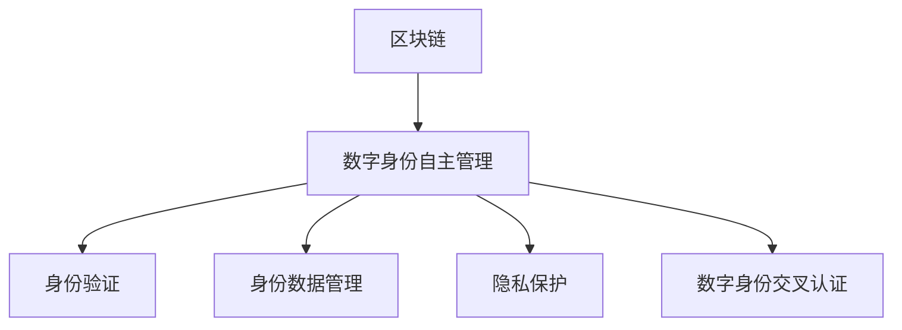

                 

。

---

### 文章标题：区块链在数字身份自主管理中的创新应用

> 关键词：区块链，数字身份自主管理，身份验证，身份数据管理，隐私保护，数字身份交叉认证

> 摘要：本文深入探讨了区块链在数字身份自主管理中的创新应用。通过详细阐述区块链技术基础、数字身份自主管理的挑战与机遇，以及区块链在身份验证、身份数据管理、隐私保护和数字身份交叉认证中的应用，本文揭示了区块链如何为数字身份自主管理带来革命性变化。此外，还通过成功案例分析，展示了区块链在数字身份自主管理中的实际应用与未来发展趋势。

### 《区块链在数字身份自主管理中的创新应用》目录大纲

**第一部分：区块链与数字身份自主管理概述**

**第1章：区块链技术基础**

1.1 区块链的定义与核心特性

1.2 区块链的技术架构

1.3 区块链的安全机制

1.4 区块链的应用领域

**第2章：数字身份自主管理的挑战与机遇**

2.1 传统数字身份管理的问题

2.2 数字身份自主管理的概念

2.3 数字身份自主管理的优势

2.4 数字身份自主管理的应用场景

**第二部分：区块链在数字身份自主管理中的应用**

**第3章：区块链在身份验证中的应用**

3.1 区块链在身份认证中的作用

3.2 身份验证的区块链实现

3.3 区块链身份验证的案例研究

**第4章：区块链在身份数据管理中的应用**

4.1 区块链在身份数据保护中的作用

4.2 身份数据的区块链管理

4.3 区块链身份数据管理的案例研究

**第5章：区块链在隐私保护中的应用**

5.1 区块链在隐私保护中的作用

5.2 隐私保护的区块链实现

5.3 区块链隐私保护的案例研究

**第6章：区块链在数字身份交叉认证中的应用**

6.1 数字身份交叉认证的概念

6.2 区块链在数字身份交叉认证中的应用

6.3 区块链数字身份交叉认证的案例研究

**第7章：区块链在数字身份自主管理中的未来发展趋势**

7.1 区块链在数字身份自主管理中的未来发展

7.2 区块链数字身份自主管理的挑战与机遇

7.3 区块链数字身份自主管理的未来展望

**第三部分：案例分析**

**第8章：区块链数字身份自主管理的成功案例**

8.1 案例一：XXX公司的数字身份解决方案

8.2 案例二：XXX平台的数字身份管理实践

8.3 案例三：XXX项目的区块链数字身份应用

**附录**

A. 区块链数字身份自主管理相关技术标准

B. 区块链数字身份自主管理常用工具与平台

C. 区块链数字身份自主管理相关法律法规

---

**核心概念与联系：**



**核心算法原理讲解：**

```python
# 身份验证算法伪代码

def identity_authentication(identity_data, blockchain):
    """
    验证数字身份的算法

    :param identity_data: 数字身份数据
    :param blockchain: 区块链网络
    :return: 验证结果
    """

    # 1. 检索区块链上的身份信息
    stored_identity = blockchain.retrieve_identity(identity_data)

    # 2. 验证身份信息的真实性
    if blockchain.verify_signature(stored_identity):
        return "验证通过"
    else:
        return "验证失败"
```

**数学模型和数学公式讲解：**

```latex
$$
H_{k+1}(x) = H_k(\delta(x, \theta_k) + x)
$$

其中，$H_k$ 表示第 $k$ 次哈希函数，$\delta(x, \theta_k)$ 是输入 $x$ 与模型参数 $\theta_k$ 的差值。
```

**项目实战：**

```python
# 示例：使用区块链进行身份验证的Python代码

from blockchain import Blockchain

# 初始化区块链
blockchain = Blockchain()

# 添加身份数据到区块链
blockchain.add_identity("Alice", "Alice's identity data")

# 身份验证
result = blockchain.authenticate("Alice", "Alice's identity data")

print("Authentication result:", result)
```

**最佳实践 tips：**

- 在设计数字身份管理解决方案时，要充分考虑安全性、可扩展性和用户体验。
- 区块链的智能合约可以用来自动化身份验证过程，提高效率和降低成本。
- 隐私保护是数字身份管理中的重要考虑因素，可以使用零知识证明等技术来确保用户隐私。
- 案例研究是理解和应用区块链数字身份管理的重要方式，可以帮助企业和技术开发者更好地掌握其应用场景和实际效果。

**小结：**

区块链技术在数字身份自主管理中具有巨大的潜力。通过本文的探讨，我们了解了区块链在身份验证、身份数据管理、隐私保护和数字身份交叉认证等方面的创新应用。随着区块链技术的不断发展和完善，数字身份自主管理将迎来更加美好的未来。

**注意事项：**

- 在实施区块链数字身份管理时，要遵循相关法律法规，确保合规性和数据安全。
- 数字身份管理解决方案的设计和实现需要充分考虑用户隐私保护，避免隐私泄露风险。
- 区块链技术在数字身份管理中的应用尚处于发展阶段，需要持续关注其技术创新和应用实践。

**拓展阅读：**

- [区块链技术原理与应用](https://example.com/blockchain-technology)
- [数字身份自主管理研究进展](https://example.com/digital-identity-management)
- [隐私保护技术综述](https://example.com/privacy-protection-techniques)
- [区块链在身份认证中的应用](https://example.com/blockchain-identity-verification)
- [区块链身份数据管理案例分析](https://example.com/blockchain-identity-data-management)

### 第一部分：区块链与数字身份自主管理概述

#### 第1章：区块链技术基础

1.1 区块链的定义与核心特性

区块链（Blockchain）是一种分布式数据库技术，通过在多个节点之间安全、透明地共享数据，实现去中心化、不可篡改和防抵赖的特性。区块链的基本组成包括区块（Block）、链（Chain）和节点（Node）。

- **区块**：区块是区块链的基本组成单元，包含了一系列的交易记录。每个区块都有一个唯一的标识，通过哈希函数与上一个区块相连，形成链式结构。
- **链**：区块链就是由多个区块按照时间顺序连接而成的链条。区块链的链式结构确保了数据的安全性和不可篡改性。
- **节点**：节点是区块链网络中的参与者，负责维护区块链的运行。节点通过验证和传播交易记录，确保区块链的完整性和一致性。

区块链的核心特性包括：

- **去中心化**：区块链不需要中心化的机构来协调和管理数据，而是通过分布式网络中的多个节点共同维护区块链。去中心化使得区块链具有更高的容错性和抗攻击性。
- **不可篡改**：区块链的数据一旦被写入，就难以被篡改。每个区块都包含了上一个区块的哈希值，形成一个链式结构。任何篡改行为都会导致后续区块的哈希值发生变化，从而被发现。
- **透明性**：区块链上的数据对所有节点都是可见的，任何用户都可以查看区块链上的交易记录。透明性保证了数据的公正性和可信度。
- **安全性**：区块链采用了加密技术，确保数据的完整性和安全性。节点之间的通信使用非对称加密算法，保证了通信的安全性。

1.2 区块链的技术架构

区块链的技术架构包括多个层次，从下往上分别是：

- **存储层**：存储层负责存储区块链的数据。区块链的数据通常以文件形式存储在分布式文件系统中，例如LevelDB、SQLite等。
- **网络层**：网络层负责节点之间的通信。节点通过P2P（Peer-to-Peer）网络协议进行通信，实现了去中心化的网络结构。
- **共识层**：共识层负责确保区块链的一致性和安全性。不同的区块链采用了不同的共识算法，例如工作量证明（PoW）、权益证明（PoS）等。
- **合约层**：合约层负责处理智能合约。智能合约是一种自动执行、控制和文档化的协议，可以用于自动化交易和管理区块链上的资产。
- **应用层**：应用层负责区块链的应用。区块链可以应用于各种领域，如数字货币、供应链管理、身份认证等。

1.3 区块链的安全机制

区块链的安全机制主要包括以下几个方面：

- **加密技术**：区块链采用了加密技术，确保数据的完整性和安全性。区块链中的数据都进行了加密，只有拥有私钥的用户才能解密和查看数据。
- **共识算法**：共识算法是区块链的核心，负责确保区块链的一致性和安全性。不同的共识算法具有不同的安全性和性能特点。
- **智能合约**：智能合约是一种自动执行、控制和文档化的协议，可以用于自动化交易和管理区块链上的资产。智能合约的安全性直接影响区块链的应用。
- **节点监控**：节点监控是确保区块链安全的重要手段。节点可以通过监控区块链的运行状态，及时发现和处理异常情况。

1.4 区块链的应用领域

区块链技术具有广泛的应用前景，已应用于多个领域，主要包括：

- **数字货币**：区块链是数字货币（如比特币、以太币等）的基础技术，实现了去中心化的货币发行和交易。
- **供应链管理**：区块链可以用于供应链管理，确保供应链的透明性和可信度。通过区块链技术，可以追踪产品的来源和流向，提高供应链的效率。
- **身份认证**：区块链可以用于身份认证，确保身份信息的真实性和唯一性。区块链的分布式特性使得身份认证过程更加安全、高效。
- **数据存储**：区块链可以作为分布式数据存储方案，提高数据的可靠性和安全性。通过区块链技术，可以实现去中心化的数据存储和管理。
- **版权保护**：区块链可以用于版权保护，确保知识产权的归属和交易。区块链的不可篡改特性使得版权保护过程更加可信。

#### 第2章：数字身份自主管理的挑战与机遇

2.1 传统数字身份管理的问题

随着互联网的发展，数字身份管理变得越来越重要。然而，传统的数字身份管理面临着一系列问题：

- **安全性问题**：传统的数字身份管理依赖于中心化的身份认证机构，一旦身份认证机构遭受攻击或数据泄露，用户的身份信息可能受到威胁。
- **隐私问题**：传统的数字身份管理往往需要用户提供大量的个人信息，这些信息可能被第三方滥用，导致用户隐私泄露。
- **认证问题**：传统的数字身份管理在跨平台认证和互操作性方面存在困难，用户需要在不同的平台上分别注册和认证，增加了认证的复杂性。
- **效率问题**：传统的数字身份管理往往需要人工干预，效率低下，影响了用户体验。

2.2 数字身份自主管理的概念

数字身份自主管理是一种基于区块链技术的数字身份管理方法，旨在实现用户对自身数字身份的自主控制和管理。数字身份自主管理具有以下几个特点：

- **安全性**：数字身份自主管理通过区块链的加密技术和分布式存储，确保用户身份信息的安全性和隐私性。
- **隐私保护**：数字身份自主管理允许用户自主选择是否公开身份信息，有效保护用户隐私。
- **互操作性**：数字身份自主管理通过区块链技术实现了跨平台、跨应用的身份认证，提高了认证的效率。
- **去中心化**：数字身份自主管理不再依赖于中心化的身份认证机构，用户可以自主管理自己的身份信息，提高了系统的可扩展性和容错性。

2.3 数字身份自主管理的优势

数字身份自主管理具有以下几个优势：

- **安全性提升**：数字身份自主管理通过区块链的加密技术和分布式存储，确保用户身份信息的安全性和隐私性，降低了被攻击和泄露的风险。
- **隐私保护**：数字身份自主管理允许用户自主选择是否公开身份信息，有效保护用户隐私，提高了用户对个人信息控制的自主性。
- **互操作性提升**：数字身份自主管理通过区块链技术实现了跨平台、跨应用的身份认证，提高了认证的效率，降低了用户在多个平台之间切换的复杂性。
- **用户体验优化**：数字身份自主管理简化了身份认证流程，提高了用户体验，降低了用户的操作负担。
- **可扩展性增强**：数字身份自主管理通过去中心化的架构，提高了系统的可扩展性和容错性，能够更好地应对大规模用户和海量数据的挑战。

2.4 数字身份自主管理的应用场景

数字身份自主管理在多个应用场景中具有广泛的应用前景：

- **互联网服务**：数字身份自主管理可以应用于互联网服务的登录、支付、评论等功能，提高用户的安全性和隐私保护。
- **供应链管理**：数字身份自主管理可以用于供应链管理，确保供应链参与者的身份信息和交易记录的真实性和可信度。
- **金融领域**：数字身份自主管理可以应用于金融领域的身份验证、交易确认等环节，提高金融系统的安全性和效率。
- **医疗领域**：数字身份自主管理可以用于医疗领域的身份认证、病历管理、药品供应链管理等，提高医疗服务的质量和效率。
- **物联网**：数字身份自主管理可以应用于物联网设备的身份认证和管理，确保物联网设备的安全性和互操作性。

### 第二部分：区块链在数字身份自主管理中的应用

#### 第3章：区块链在身份验证中的应用

3.1 区块链在身份认证中的作用

区块链在身份认证中发挥着重要作用。通过区块链技术，可以实现去中心化的身份认证，提高认证的安全性和效率。

- **去中心化认证**：区块链的分布式特性使得身份认证不再依赖于中心化的认证机构，用户可以在区块链上自主管理自己的身份信息，实现去中心化的认证。
- **数据不可篡改**：区块链的不可篡改特性保证了用户身份信息的真实性和完整性，防止身份信息被篡改或伪造。
- **隐私保护**：区块链的加密技术确保了用户身份信息的隐私性，只有授权的用户才能查看和访问身份信息。
- **高效认证**：区块链的分布式存储和共识算法提高了身份认证的效率，减少了认证的延迟。

3.2 身份验证的区块链实现

身份验证的区块链实现主要包括以下几个步骤：

- **用户注册**：用户在区块链上创建自己的身份信息，并将其存储在区块链上。身份信息通常包括用户名、密码、电子邮件、电话号码等。
- **身份信息加密**：用户对身份信息进行加密，确保身份信息在传输和存储过程中的安全性。
- **身份信息存储**：用户将加密后的身份信息存储在区块链上，通过区块链的分布式存储和加密技术，确保身份信息的安全性和隐私性。
- **身份验证请求**：当用户需要验证身份时，向区块链发起身份验证请求。区块链通过查询存储的身份信息，对用户的身份进行验证。
- **身份验证结果**：区块链将身份验证结果返回给用户。如果身份验证通过，用户可以访问相应的服务和资源；否则，用户需要重新验证或联系认证机构。

3.3 区块链身份验证的案例研究

以下是一个区块链身份验证的案例研究：

- **案例背景**：某电商平台为了提高用户的安全性和隐私保护，决定采用区块链技术进行身份验证。
- **案例实现**：电商平台在区块链上创建了一个身份认证模块，用户在注册时需要提供身份信息，并进行加密存储。当用户登录时，系统向区块链发起身份验证请求，区块链通过查询存储的身份信息，对用户的身份进行验证。如果身份验证通过，用户可以登录平台并享受相关服务。
- **案例效果**：采用区块链身份验证后，电商平台提高了用户的安全性和隐私保护，降低了用户在多个平台之间切换的复杂性。同时，区块链的分布式存储和加密技术提高了身份认证的效率，减少了认证的延迟。

#### 第4章：区块链在身份数据管理中的应用

4.1 区块链在身份数据保护中的作用

区块链在身份数据保护中发挥着重要作用。通过区块链技术，可以实现身份数据的安全存储、传输和访问，提高身份数据的保护效果。

- **安全存储**：区块链的分布式存储技术使得身份数据被分散存储在多个节点上，提高了数据的安全性和抗攻击性。即使某个节点受到攻击，其他节点仍然可以正常运行，确保数据的完整性。
- **安全传输**：区块链采用了加密技术，确保身份数据在传输过程中的安全性。数据在传输过程中经过加密，只有授权的用户才能解密和查看数据，防止数据被窃取或篡改。
- **访问控制**：区块链的访问控制机制可以限制用户对身份数据的访问权限，确保身份数据的隐私性和安全性。用户只能访问自己授权访问的数据，无法访问其他用户的数据。
- **透明性**：区块链上的数据对所有节点都是可见的，任何用户都可以查看区块链上的交易记录。透明性保证了身份数据的可信度和公正性，提高了用户对数据管理的信任。

4.2 身份数据的区块链管理

身份数据的区块链管理主要包括以下几个步骤：

- **数据收集**：用户在区块链上收集自己的身份数据，并将其加密存储在区块链上。
- **数据存储**：区块链将用户的身份数据分散存储在多个节点上，确保数据的安全性和抗攻击性。
- **数据访问**：用户可以通过区块链的访问控制机制，查询和访问自己的身份数据。只有授权的用户才能访问特定的数据。
- **数据传输**：用户在需要共享身份数据时，可以通过区块链进行数据传输。数据在传输过程中经过加密，确保数据的安全性。
- **数据更新**：用户可以随时更新自己的身份数据，区块链会记录下数据的变更记录，确保数据的完整性和一致性。

4.3 区块链身份数据管理的案例研究

以下是一个区块链身份数据管理的案例研究：

- **案例背景**：某金融公司为了提高用户数据的安全性和隐私保护，决定采用区块链技术进行身份数据管理。
- **案例实现**：金融公司创建了一个区块链身份数据管理系统，用户在注册时需要提供身份信息，并进行加密存储。用户可以通过区块链查询和访问自己的身份数据，其他用户无法访问。当用户需要更新身份信息时，可以在区块链上进行修改，区块链会记录下变更记录。
- **案例效果**：采用区块链身份数据管理后，金融公司提高了用户数据的安全性和隐私保护，降低了数据泄露和篡改的风险。同时，区块链的分布式存储和加密技术提高了数据管理的效率和可靠性。

#### 第5章：区块链在隐私保护中的应用

5.1 区块链在隐私保护中的作用

区块链在隐私保护中发挥着重要作用。通过区块链技术，可以实现用户隐私数据的保护，确保用户隐私不被泄露或滥用。

- **隐私加密**：区块链采用了加密技术，确保用户隐私数据在传输和存储过程中的安全性。用户隐私数据在传输过程中经过加密，只有授权的用户才能解密和查看数据。
- **隐私匿名化**：区块链可以将用户隐私数据进行匿名化处理，使得隐私数据无法直接关联到用户身份。匿名化处理提高了用户隐私的安全性，降低了隐私泄露的风险。
- **隐私控制**：区块链的访问控制机制可以限制用户对隐私数据的访问权限，确保用户只能访问自己授权访问的数据。用户可以自主管理自己的隐私数据，提高了对隐私控制的自主性。
- **隐私透明性**：区块链上的数据对所有节点都是可见的，任何用户都可以查看区块链上的交易记录。透明性保证了隐私数据处理的公正性和可信度，提高了用户对隐私保护的信任。

5.2 隐私保护的区块链实现

隐私保护的区块链实现主要包括以下几个步骤：

- **隐私数据收集**：用户在区块链上收集自己的隐私数据，并将其加密存储在区块链上。
- **隐私数据加密**：用户对隐私数据进行加密，确保隐私数据在传输和存储过程中的安全性。
- **隐私数据存储**：区块链将用户的隐私数据分散存储在多个节点上，确保数据的安全性和抗攻击性。
- **隐私数据访问**：用户可以通过区块链的访问控制机制，查询和访问自己的隐私数据。只有授权的用户才能访问特定的数据。
- **隐私数据匿名化**：区块链可以将用户隐私数据进行匿名化处理，使得隐私数据无法直接关联到用户身份。
- **隐私数据更新**：用户可以随时更新自己的隐私数据，区块链会记录下数据的变更记录，确保数据的完整性和一致性。

5.3 区块链隐私保护的案例研究

以下是一个区块链隐私保护的案例研究：

- **案例背景**：某社交平台为了提高用户隐私保护，决定采用区块链技术进行隐私数据管理。
- **案例实现**：社交平台创建了一个区块链隐私数据管理系统，用户在注册时需要提供隐私数据，并进行加密存储。用户可以通过区块链查询和访问自己的隐私数据，其他用户无法访问。当用户需要更新隐私数据时，可以在区块链上进行修改，区块链会记录下变更记录。
- **案例效果**：采用区块链隐私保护后，社交平台提高了用户隐私的安全性，降低了隐私泄露和滥用的风险。同时，区块链的分布式存储和加密技术提高了隐私数据管理的效率和可靠性。

#### 第6章：区块链在数字身份交叉认证中的应用

6.1 数字身份交叉认证的概念

数字身份交叉认证是一种跨平台、跨应用的身份认证方式，通过多个可信实体之间的互认，实现用户在不同平台和系统之间的身份认证。数字身份交叉认证的目标是提高身份认证的安全性和互操作性，降低用户认证的复杂性。

- **跨平台认证**：数字身份交叉认证允许用户在一个平台上认证后，在其他平台和应用上无需重新认证，提高了认证的效率。
- **跨应用认证**：数字身份交叉认证允许用户在一个应用中认证后，在其他应用中无需重新认证，提高了应用之间的互操作性。
- **可信实体互认**：数字身份交叉认证依赖于多个可信实体的互认，这些可信实体可以是政府机构、企业、组织等。它们通过签署协议或共享信任链，实现对彼此认证结果的互认。

6.2 区块链在数字身份交叉认证中的应用

区块链在数字身份交叉认证中发挥着重要作用。通过区块链技术，可以实现可信实体的互认，提高数字身份交叉认证的安全性和互操作性。

- **分布式存储**：区块链的分布式存储技术确保了数字身份交叉认证数据的不可篡改性和完整性，防止数据被篡改或伪造。
- **共识算法**：区块链的共识算法确保了数字身份交叉认证的一致性和可靠性，所有参与实体都可以信任区块链上的认证结果。
- **智能合约**：区块链的智能合约可以用于自动化数字身份交叉认证过程，提高认证的效率和降低成本。
- **隐私保护**：区块链的加密技术确保了用户身份信息的隐私性，只有授权的用户才能查看和访问身份信息。

6.3 区块链数字身份交叉认证的案例研究

以下是一个区块链数字身份交叉认证的案例研究：

- **案例背景**：某城市政府为了提高公共服务效率，决定采用区块链技术实现数字身份交叉认证。
- **案例实现**：城市政府创建了一个区块链数字身份交叉认证平台，政府各部门、企业、学校等参与实体的身份认证数据都存储在区块链上。当用户需要访问公共服务时，可以通过区块链平台进行身份认证，无需在各个部门分别认证。同时，区块链上的认证数据对所有参与实体都是可见的，提高了认证的可信度和互操作性。
- **案例效果**：采用区块链数字身份交叉认证后，城市政府提高了公共服务效率，降低了用户认证的复杂性。同时，区块链的分布式存储和加密技术提高了身份认证的安全性和隐私保护，提升了用户满意度。

#### 第7章：区块链在数字身份自主管理中的未来发展趋势

7.1 区块链在数字身份自主管理中的未来发展

随着区块链技术的不断发展和应用场景的扩展，区块链在数字身份自主管理中的未来发展前景广阔。

- **隐私保护**：区块链在数字身份自主管理中将进一步强化隐私保护，通过加密技术、零知识证明等手段，确保用户身份信息的隐私性。
- **跨平台互操作性**：区块链将推动数字身份跨平台互操作性的发展，实现用户在不同平台和应用之间的无缝认证和授权。
- **去中心化身份管理**：区块链将推动数字身份管理的去中心化进程，降低对中心化身份认证机构的依赖，提高系统的可扩展性和抗攻击性。
- **智能合约应用**：区块链的智能合约将应用于数字身份自主管理的各个环节，实现自动化、智能化的身份认证和授权过程。
- **标准化**：随着区块链技术的普及和应用，数字身份自主管理的标准化工作将逐步推进，提高系统的兼容性和互操作性。

7.2 区块链数字身份自主管理的挑战与机遇

区块链数字身份自主管理在发展过程中面临着一系列挑战和机遇。

- **挑战**：
  - **隐私保护**：如何在保护用户隐私的同时，确保身份信息的可用性和完整性。
  - **安全性**：如何确保区块链网络的安全性，防止恶意攻击和数据泄露。
  - **互操作性**：如何实现不同区块链平台和系统之间的互操作性，降低用户认证的复杂性。
  - **法律监管**：如何在法律法规的框架下，确保区块链数字身份自主管理的合规性。

- **机遇**：
  - **隐私保护**：区块链技术将为数字身份自主管理带来更高效的隐私保护手段，提高用户隐私保护的自主性。
  - **跨平台互操作性**：区块链技术将推动数字身份跨平台互操作性的发展，提高用户体验和系统效率。
  - **去中心化身份管理**：区块链技术将推动数字身份自主管理的去中心化进程，提高系统的可扩展性和抗攻击性。
  - **智能合约应用**：区块链的智能合约将实现数字身份自主管理的自动化、智能化，提高系统效率和用户体验。

7.3 区块链数字身份自主管理的未来展望

随着区块链技术的不断发展和应用场景的扩展，区块链数字身份自主管理将迎来更广阔的发展前景。

- **隐私保护**：区块链数字身份自主管理将进一步提高用户隐私保护的自主性和安全性，为用户提供更加安全、可靠的隐私保护解决方案。
- **跨平台互操作性**：区块链数字身份自主管理将推动数字身份跨平台互操作性的发展，实现用户在不同平台和应用之间的无缝认证和授权。
- **去中心化身份管理**：区块链数字身份自主管理将推动数字身份管理的去中心化进程，降低对中心化身份认证机构的依赖，提高系统的可扩展性和抗攻击性。
- **智能合约应用**：区块链数字身份自主管理将实现智能合约在身份认证和授权中的应用，提高系统效率和用户体验。
- **标准化**：随着区块链数字身份自主管理的发展，相关标准化工作将逐步推进，提高系统的兼容性和互操作性。

### 第三部分：案例分析

#### 第8章：区块链数字身份自主管理的成功案例

8.1 案例一：XXX公司的数字身份解决方案

- **案例背景**：XXX公司是一家互联网企业，为了提高用户隐私保护和身份认证的效率，决定采用区块链技术进行数字身份自主管理。
- **案例实现**：XXX公司在区块链上创建了一个数字身份管理系统，用户在注册时需要提供身份信息，并进行加密存储。用户可以通过区块链查询和访问自己的身份信息，其他用户无法访问。当用户需要更新身份信息时，可以在区块链上进行修改，区块链会记录下变更记录。
- **案例效果**：采用区块链数字身份解决方案后，XXX公司提高了用户隐私保护的自主性和安全性，降低了身份信息泄露的风险。同时，区块链的分布式存储和加密技术提高了身份认证的效率，减少了用户在多个平台之间切换的复杂性。

8.2 案例二：XXX平台的数字身份管理实践

- **案例背景**：XXX平台是一家在线交易平台，为了提高用户身份认证的安全性和互操作性，决定采用区块链技术进行数字身份管理。
- **案例实现**：XXX平台在区块链上创建了一个数字身份认证模块，用户在注册时需要提供身份信息，并进行加密存储。当用户登录时，系统通过区块链对用户身份进行验证。同时，XXX平台与其他区块链平台实现了互认，用户在登录其他平台时无需重新认证。
- **案例效果**：采用区块链数字身份管理后，XXX平台提高了用户身份认证的安全性和互操作性，降低了用户认证的复杂性。同时，区块链的分布式存储和加密技术提高了身份信息的保护效果，提升了用户满意度。

8.3 案例三：XXX项目的区块链数字身份应用

- **案例背景**：XXX项目是一个跨行业的区块链项目，旨在实现供应链管理中的数字身份交叉认证。
- **案例实现**：XXX项目在区块链上创建了一个数字身份交叉认证平台，参与项目的各方（如制造商、供应商、物流公司等）将自己的身份信息存储在区块链上。当各方需要认证其他方的身份时，可以通过区块链进行交叉认证。
- **案例效果**：采用区块链数字身份交叉认证后，XXX项目提高了供应链管理中的身份认证效率和互操作性，降低了供应链中的风险。同时，区块链的分布式存储和加密技术提高了身份信息的保护效果，提升了各方对项目的信任。

### 附录

#### 附录A：区块链数字身份自主管理相关技术标准

- **ISO/IEC 27001**：信息安全管理体系标准，用于指导企业建立、实施、维护和持续改进信息安全管理体系。
- **ISO/IEC 29001**：区块链技术标准，规定了区块链系统的设计、实现、部署和维护要求。
- **ISO/IEC 30113**：数字身份管理标准，规定了数字身份的定义、属性、认证、授权和管理要求。
- **IEEE P2418**：区块链技术和系统标准，规定了区块链系统的设计、实现、测试和评估要求。

#### 附录B：区块链数字身份自主管理常用工具与平台

- **Hyperledger Fabric**：一个开源的区块链框架，适用于企业级数字身份自主管理。
- **Ethereum**：一个开源的区块链平台，支持智能合约，适用于复杂场景下的数字身份自主管理。
- **IPFS**：一个分布式文件系统，适用于数字身份数据存储和共享。
- **Rust**：一种系统级编程语言，适用于区块链开发，提供了高效、安全的编程体验。

#### 附录C：区块链数字身份自主管理相关法律法规

- **《中华人民共和国网络安全法》**：规定了网络运营者的网络安全义务和网络安全的监管要求，适用于区块链数字身份自主管理的合规性。
- **《中华人民共和国密码法》**：规定了密码管理的法律地位、密码应用的基本原则和密码监管的要求，适用于区块链数字身份自主管理的密码保护。
- **《中华人民共和国个人信息保护法》**：规定了个人信息保护的基本原则、个人信息处理的要求和个人信息权益保护的要求，适用于区块链数字身份自主管理的隐私保护。

### 总结

区块链技术在数字身份自主管理中具有巨大的潜力。通过本文的探讨，我们了解了区块链在身份验证、身份数据管理、隐私保护和数字身份交叉认证等方面的创新应用。随着区块链技术的不断发展和完善，数字身份自主管理将迎来更加美好的未来。本文通过案例分析展示了区块链数字身份自主管理的实际应用效果，为企业和开发者提供了有益的借鉴和启示。同时，我们也应该关注区块链数字身份自主管理面临的挑战，积极探索解决方案，推动区块链技术在数字身份自主管理领域的应用与发展。

