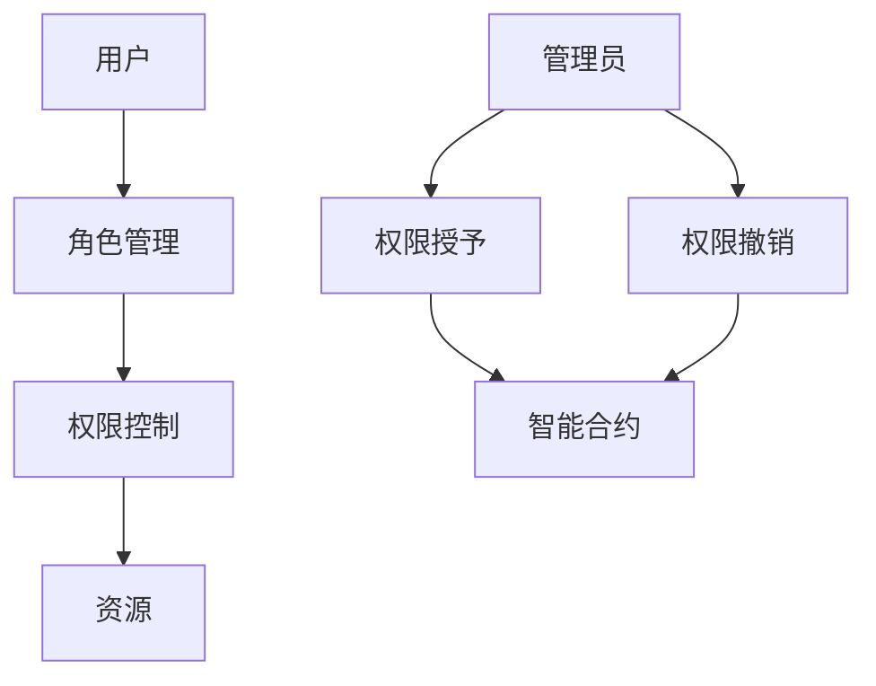

                 

### 文章标题：区块链在数字身份自主管理中的应用

#### 关键词：区块链，数字身份，自主管理，隐私保护，智能合约，共识算法

#### 摘要：

随着数字化时代的到来，数字身份自主管理成为保护个人隐私和数据安全的关键需求。本文通过深入剖析区块链技术，探讨了其在数字身份自主管理中的重要作用。文章首先介绍了区块链的核心概念和架构原理，然后详细阐述了数字身份管理的基础知识及其面临的挑战。接着，本文重点分析了区块链在身份认证、权限管理和隐私保护等方面的应用，并通过实际案例展示了区块链在数字身份自主管理中的具体实现和效果。最后，文章提出了未来区块链在数字身份自主管理中的发展趋势和潜在挑战，为相关领域的研究和实践提供了有益的启示。

---

## 第一部分：区块链与数字身份概述

### 第1章：区块链技术基础

区块链技术是近年来迅速发展的信息技术，其独特的去中心化、不可篡改和透明性等特点，使其在数字身份管理等领域具有广泛应用潜力。本章节将详细介绍区块链的核心概念、架构原理和关键技术。

#### 1.1 区块链的核心概念

区块链是一种分布式账本技术，其基本单元是“区块”。每个区块包含一定数量的交易记录，通过加密算法和时间戳等技术手段，将区块与区块链中的其他区块连接起来，形成一个不可篡改的、连续的记录链条。

- **定义**：区块链是一个由多个按时间顺序排列、不可篡改的数据块组成的数据结构，每个数据块包含了特定时间内的交易记录和其他信息。
- **三个关键特点**：
  - **去中心化**：区块链不存在中心化的管理者，所有参与者共同维护账本，提高了系统的抗攻击性和容错性。
  - **不可篡改**：区块链上的数据一旦记录，将永久保存，任何篡改行为都会被发现并拒绝。
  - **透明性**：区块链上的数据对所有参与者可见，提高了信息透明度和可追溯性。

#### 1.2 区块链架构原理

区块链的基本架构包括数据层、网络层、共识层、激励层和应用层。

- **数据层**：负责数据的存储和管理，包括区块和交易记录。
- **网络层**：负责区块链节点之间的通信和数据传输，实现区块链的网络结构。
- **共识层**：负责实现区块链的共识算法，确保所有节点的数据一致性。
- **激励层**：提供激励机制，鼓励参与者维护区块链网络的安全和稳定。
- **应用层**：为各类应用提供支持，包括数字货币、智能合约等。

**节点的作用与分类**：

- **全节点**：维护完整的区块链数据，能够参与区块链的所有交易和共识过程。
- **轻节点**：仅维护区块链的部分数据，无法参与共识过程，但可以查询区块链数据。

#### 1.3 区块链的关键技术

区块链的关键技术包括加密技术、智能合约和共识算法。

- **加密技术**：用于保障区块链的数据安全和隐私，包括哈希函数、数字签名和非对称加密等。
  - **哈希函数**：将任意长度的数据映射为固定长度的字符串，确保数据的唯一性和完整性。
  - **数字签名**：用于身份验证和数据的防篡改，确保交易信息的真实性和不可抵赖性。
  - **非对称加密**：用于数据的加密和解密，确保信息的机密性和完整性。

- **智能合约**：是自动执行合约条款的计算机程序，运行在区块链上，具有去中心化和不可篡改的特性。
  - **原理**：智能合约通过编程语言编写，在区块链上部署后，按照预设的逻辑自动执行。
  - **实现**：使用Solidity等智能合约编程语言，通过以太坊等区块链平台进行开发。

- **共识算法**：用于确保区块链网络中所有节点对数据的共识，实现数据的一致性。
  - **原理**：共识算法通过特定的机制，使所有节点达成对数据一致性的共识。
  - **类型**：常见的共识算法包括工作量证明（PoW）、权益证明（PoS）、拜占庭容错算法（BFT）等。

#### Mermaid流程图

下面是一个简化的区块链共识算法流程图，用于展示区块链节点之间如何达成共识：

```mermaid
sequenceDiagram
    participant A as 全节点
    participant B as 全节点
    participant C as 全节点
    A->>B: 发送交易请求
    B->>C: 发送交易请求
    A->>C: 发送交易请求
    Note over A,B,C: 等待共识
    B->>A: 确认交易
    C->>B: 确认交易
    C->>A: 确认交易
    Note over A,B,C: 共识达成
```

#### 伪代码讲解

下面是一个简化的区块链共识算法伪代码，用于展示节点之间如何通过共识算法达成数据一致性：

```python
# 初始化区块链节点
nodes = [NodeA, NodeB, NodeC]

# 接收交易请求
for node in nodes:
    transaction_request = node.receive_transaction()

# 验证交易请求
for node in nodes:
    if not node.verify_transaction(transaction_request):
        continue

# 构建区块
block = Block(transaction_request)

# 发送区块到其他节点
for node in nodes:
    node.send_block(block)

# 等待共识
for node in nodes:
    consensus = node.wait_for_consensus()

# 确认共识
if consensus:
    node.add_block_to_chain(block)
else:
    node.reject_block(block)
```

通过以上对区块链技术基础的介绍，读者可以对区块链的基本概念、架构原理和关键技术有一个全面的理解。接下来，本文将深入探讨数字身份管理的基础知识及其在数字化时代面临的挑战。

---

### 第2章：数字身份管理基础

#### 2.1 数字身份的定义

数字身份是指个人或实体在数字世界中的身份标识，通过数字化的方式存储、传输和管理个人信息。数字身份与传统身份的区别主要体现在以下几个方面：

- **存储形式**：传统身份通常以纸质或电子文档形式存储，而数字身份则以电子形式存储在数字系统中。
- **可验证性**：传统身份的验证通常依赖于物理证件，如身份证、护照等，而数字身份的验证可以通过数字签名、生物识别等技术实现。
- **管理方式**：传统身份的管理由政府或机构负责，而数字身份的管理则更加灵活，可以由个人或机构自主管理。

#### 2.2 数字身份管理的挑战

数字身份管理面临着多种挑战，主要包括：

- **安全风险**：数字身份容易被黑客攻击，导致个人信息泄露或身份盗用。
- **数据隐私保护**：数字身份管理涉及到大量的个人信息，如何保护这些信息的隐私成为一大挑战。
- **身份伪造**：数字身份容易被伪造，导致欺诈行为的发生。

#### 2.3 数字身份管理的技术框架

数字身份管理的技术框架主要包括以下几个方面：

- **身份认证技术**：用于验证用户身份的真实性，包括密码认证、生物识别认证等。
- **身份权限管理**：用于控制用户对系统和资源的访问权限，包括角色管理、访问控制等。
- **身份信息加密**：用于保障身份信息的机密性和完整性，包括对称加密、非对称加密等。

通过以上对数字身份管理基础知识的介绍，读者可以对数字身份的定义、面临的挑战和技术框架有一个清晰的认识。接下来，本文将探讨区块链技术在数字身份管理中的应用，以解决传统方法面临的挑战。

---

## 第二部分：区块链在数字身份中的应用

### 第3章：区块链在身份认证中的应用

#### 3.1 区块链与身份认证的结合

区块链在身份认证中的应用主要体现在以下几个方面：

- **去中心化认证**：通过区块链的去中心化特性，实现身份认证的不依赖于单一中心化机构，减少了单点故障的风险。
- **不可篡改的认证记录**：区块链上的认证记录一旦被记录，将永久保存，无法被篡改，保证了认证记录的真实性。
- **透明性**：区块链上的认证记录对所有参与者可见，提高了认证过程的透明度，增强了用户对系统的信任。

区块链在身份认证中的优势主要包括：

- **安全性**：区块链使用加密技术，确保了身份信息的安全和隐私。
- **不可篡改性**：区块链的分布式特性，使得任何对身份信息的篡改都会被记录在案，提高了系统的可靠性。
- **高效性**：区块链的共识算法，如工作量证明（PoW），可以快速验证身份信息的真实性。

#### 3.2 区块链身份认证的实现

区块链身份认证的实现主要包括以下步骤：

1. **身份信息加密**：用户在注册时，将个人信息（如姓名、身份证号等）通过加密算法进行加密，形成加密后的身份信息。
   ```mermaid
   graph TD
       A[用户信息] --> B[加密算法]
       B --> C[加密身份信息]
   ```

2. **身份信息存储**：将加密后的身份信息存储在区块链上，通过哈希函数生成身份信息的唯一标识。
   ```mermaid
   graph TD
       C[加密身份信息] --> D[哈希函数]
       D --> E[身份标识]
       E --> F[区块链]
   ```

3. **身份认证请求**：当用户需要认证时，发送身份认证请求到区块链网络。
   ```mermaid
   graph TD
       G[用户] --> H[身份认证请求]
       H --> I[区块链网络]
   ```

4. **身份认证**：区块链网络中的节点根据身份标识，从区块链上查找相应的加密身份信息，并进行验证。
   ```mermaid
   graph TD
       I --> J[查找身份信息]
       J --> K[验证身份信息]
   ```

5. **认证结果反馈**：认证结果反馈给用户，如果验证通过，用户即可获得相应的访问权限。
   ```mermaid
   graph TD
       K --> L[认证结果]
       L --> M[用户]
   ```

#### 智能合约实现（伪代码）

以下是一个简化的区块链身份认证智能合约实现的伪代码，用于展示身份认证的过程：

```solidity
pragma solidity ^0.8.0;

contract IdentityAuthentication {

    // 存储加密身份信息
    mapping(address => string) private encryptedIdentityInfo;

    // 存储认证结果
    mapping(address => bool) private authenticated;

    // 设置身份认证请求事件
    event IdentityAuthenticationRequest(address userAddress, string identityInfo);

    // 设置身份认证结果事件
    event IdentityAuthenticationResult(address userAddress, bool result);

    // 用户注册
    function registerIdentity(string memory identityInfo) public {
        // 对身份信息进行加密
        string memory encryptedInfo = encrypt(identityInfo);

        // 将加密后的身份信息存储在区块链上
        encryptedIdentityInfo[msg.sender] = encryptedInfo;

        // 触发身份认证请求事件
        emit IdentityAuthenticationRequest(msg.sender, encryptedInfo);
    }

    // 身份认证
    function authenticateIdentity(string memory identityInfo) public {
        // 对身份信息进行加密
        string memory encryptedInfo = encrypt(identityInfo);

        // 从区块链上查找加密后的身份信息
        string memory storedEncryptedInfo = encryptedIdentityInfo[msg.sender];

        // 验证身份信息
        if (encryptedInfo == storedEncryptedInfo) {
            authenticated[msg.sender] = true;
            emit IdentityAuthenticationResult(msg.sender, true);
        } else {
            emit IdentityAuthenticationResult(msg.sender, false);
        }
    }

    // 查询认证结果
    function checkAuthentication(address userAddress) public view returns (bool) {
        return authenticated[userAddress];
    }

    // 加密函数（伪代码）
    function encrypt(string memory info) private pure returns (string memory) {
        // 实现加密逻辑
        return encryptedInfo;
    }
}
```

通过以上对区块链身份认证的应用介绍和实现讲解，读者可以了解到区块链技术在身份认证中的重要作用和实现方法。接下来，本文将探讨区块链在身份权限管理中的应用。

---

### 第4章：区块链在身份权限管理中的应用

#### 4.1 区块链与身份权限管理的关系

区块链在身份权限管理中的作用主要体现在以下几个方面：

- **去中心化的权限管理**：区块链的去中心化特性，使得权限管理不再依赖于中心化的机构，减少了信任风险和单点故障的问题。
- **不可篡改的权限记录**：区块链上的权限记录一旦被记录，将永久保存，无法被篡改，保证了权限记录的真实性和可靠性。
- **透明的权限管理**：区块链上的权限管理过程对所有参与者可见，提高了权限管理的透明度，增强了用户对系统的信任。

区块链在身份权限管理中的挑战主要包括：

- **权限复杂性**：身份权限管理涉及到多种角色和权限设置，如何在区块链上实现复杂的权限管理是一个挑战。
- **性能瓶颈**：区块链的处理能力相对有限，如何在高并发情况下保证权限管理的性能是一个挑战。
- **隐私保护**：权限管理过程中涉及到的个人信息需要得到保护，如何在保证权限管理效率和隐私保护之间取得平衡是一个挑战。

#### 4.2 区块链身份权限管理模型

为了实现高效、安全和透明的身份权限管理，本文提出以下区块链身份权限管理模型：

- **角色管理**：定义不同角色及其对应的权限，如管理员、普通用户、嘉宾等。
- **权限控制**：通过智能合约实现权限控制逻辑，确保用户只能访问其有权访问的资源。
- **权限授予与撤销**：通过智能合约实现权限的授予和撤销，确保权限的动态调整。

下面是一个简化的区块链身份权限管理模型架构图：



#### 权限授予与撤销的实现（伪代码）

以下是一个简化的区块链权限管理智能合约实现的伪代码，用于展示权限的授予与撤销过程：

```solidity
pragma solidity ^0.8.0;

contract PermissionManagement {

    // 存储用户角色和权限
    mapping(address => string) private userRoles;
    mapping(address => mapping(string => bool)) private userPermissions;

    // 存储管理员地址
    address private adminAddress;

    // 设置管理员地址
    constructor(address _adminAddress) {
        adminAddress = _adminAddress;
    }

    // 权限授予
    function grantPermission(address userAddress, string memory role, string memory permission) public {
        require(msg.sender == adminAddress, "只有管理员可以授予权限");
        userRoles[userAddress] = role;
        userPermissions[userAddress][permission] = true;
    }

    // 权限撤销
    function revokePermission(address userAddress, string memory role, string memory permission) public {
        require(msg.sender == adminAddress, "只有管理员可以撤销权限");
        userPermissions[userAddress][permission] = false;
    }

    // 检查权限
    function checkPermission(address userAddress, string memory role, string memory permission) public view returns (bool) {
        require(userRoles[userAddress] == role, "用户角色不匹配");
        return userPermissions[userAddress][permission];
    }
}
```

通过以上对区块链身份权限管理模型的介绍和实现讲解，读者可以了解到区块链技术在身份权限管理中的重要作用和实现方法。接下来，本文将探讨区块链在隐私保护中的应用。

---

### 第5章：区块链在隐私保护中的应用

#### 5.1 区块链与隐私保护的关系

区块链技术在隐私保护中的优势主要体现在以下几个方面：

- **去中心化隐私保护**：区块链的去中心化特性，使得隐私保护不再依赖于中心化的机构，减少了隐私泄露的风险。
- **不可篡改隐私记录**：区块链上的隐私记录一旦被记录，将永久保存，无法被篡改，保证了隐私记录的真实性和可靠性。
- **透明隐私保护**：区块链上的隐私保护过程对所有参与者可见，提高了隐私保护过程的透明度，增强了用户对系统的信任。

区块链在隐私保护中的挑战主要包括：

- **隐私保护复杂性**：隐私保护涉及到多种技术手段和策略，如何在区块链上实现复杂的隐私保护是一个挑战。
- **隐私保护与性能的平衡**：区块链的处理能力相对有限，如何在高并发情况下保证隐私保护和系统性能的平衡是一个挑战。
- **隐私保护法律法规的遵守**：不同国家和地区对隐私保护的规定有所不同，如何在区块链上实现符合法律法规的隐私保护是一个挑战。

#### 5.2 隐私保护的区块链实现

区块链隐私保护的实现主要包括以下几个方面：

1. **加密存储**：将用户隐私信息（如姓名、身份证号、电话号码等）进行加密存储，确保隐私信息在区块链上的安全性。
   ```mermaid
   graph TD
       A[隐私信息] --> B[加密算法]
       B --> C[加密信息]
       C --> D[区块链]
   ```

2. **隐私查询与验证**：当用户需要查询或验证隐私信息时，通过区块链上的加密算法和私钥进行验证，确保隐私信息的真实性和完整性。
   ```mermaid
   graph TD
       E[用户请求] --> F[私钥]
       F --> G[加密算法]
       G --> H[验证结果]
   ```

3. **隐私交易匿名化**：通过区块链的去中心化和加密技术，实现隐私交易的匿名化，确保交易过程中的隐私保护。
   ```mermaid
   graph TD
       I[隐私交易] --> J[加密算法]
       J --> K[交易记录]
       K --> L[区块链]
   ```

#### 隐私保护算法的介绍

以下是几种常见的区块链隐私保护算法：

- **同态加密**：允许在加密数据上执行计算，而不需要解密数据，从而实现数据的隐私保护。
- **零知识证明**：允许一方在不泄露任何信息的情况下，证明某个陈述是真实的，从而实现隐私信息的验证。
- **环签名**：允许多个用户共同签名一个交易，从而隐藏真实签名者的身份。

#### 隐私保护的实现案例（代码解读与分析）

以下是一个简化的区块链隐私保护实现的示例代码，用于展示如何使用加密存储和零知识证明进行隐私保护：

```solidity
pragma solidity ^0.8.0;

import "@openzeppelin/contracts/utils/cryptography/ECDSA.sol";

contract PrivacyProtection {

    // 存储用户加密信息
    mapping(address => string) private encryptedUserInfo;

    // 设置管理员地址
    address private adminAddress;

    // 构造函数设置管理员地址
    constructor(address _adminAddress) {
        adminAddress = _adminAddress;
    }

    // 用户注册并加密存储信息
    function registerUserInfo(string memory userInfo, string memory privateKey) public {
        require(msg.sender != adminAddress, "管理员不能注册用户信息");
        // 对用户信息进行加密
        string memory encryptedInfo = encrypt(userInfo, privateKey);
        encryptedUserInfo[msg.sender] = encryptedInfo;
    }

    // 管理员验证用户信息
    function verifyUserInfo(address userAddress, string memory userInfo, string memory signature) public {
        require(msg.sender == adminAddress, "只有管理员可以验证用户信息");
        // 对用户信息进行加密
        string memory encryptedInfo = encrypt(userInfo, adminPrivateKey);
        // 验证签名
        require(ECDSA.verify(encryptedInfo, signature, userAddress), "签名验证失败");
    }

    // 加密函数（伪代码）
    function encrypt(string memory info, string memory privateKey) private pure returns (string memory) {
        // 实现加密逻辑
        return encryptedInfo;
    }
}
```

在这个示例中，用户在注册时，使用私钥对个人信息进行加密存储。管理员可以通过验证用户的签名来验证用户信息的真实性，从而保护用户的隐私。通过以上对区块链隐私保护实现的介绍和代码分析，读者可以了解到区块链技术在隐私保护中的重要性和具体实现方法。接下来，本文将探讨数字身份自主管理的案例研究。

---

### 第6章：数字身份自主管理的案例研究

#### 6.1 自主数字身份管理案例

为了更好地理解区块链在数字身份自主管理中的应用，本文将介绍一个实际案例：某公司开发的一款基于区块链的数字身份管理平台。

**案例背景**：

随着公司业务的发展，员工数量不断增加，传统的身份管理方式（如企业内部身份认证系统）逐渐难以满足需求。公司希望通过引入区块链技术，实现数字身份的自主管理和安全认证。

**案例实现过程**：

1. **用户注册**：
   - 用户通过公司的数字身份管理平台进行注册，注册时需要提供个人信息（如姓名、身份证号、电话号码等）。
   - 平台使用区块链技术，将用户的个人信息进行加密存储，并生成唯一的身份标识。

2. **身份认证**：
   - 用户在访问公司内部系统或资源时，需要进行身份认证。
   - 用户通过区块链上的加密算法和私钥进行身份验证，确保身份信息的真实性和安全性。

3. **权限管理**：
   - 根据用户的角色和权限设置，平台使用区块链上的智能合约实现权限管理。
   - 管理员可以通过区块链上的权限管理智能合约，动态调整用户的权限。

4. **隐私保护**：
   - 平台使用区块链的加密存储和零知识证明技术，确保用户隐私信息的安全。
   - 用户在查询或验证隐私信息时，通过私钥和加密算法进行验证，确保隐私信息的真实性和完整性。

**案例效果评估**：

1. **安全性**：
   - 通过区块链的加密技术和不可篡改特性，确保用户身份信息和隐私信息的安全。
   - 案例中的身份认证和权限管理过程，有效防止了身份盗用和权限滥用。

2. **高效性**：
   - 区块链的共识算法，如工作量证明（PoW），确保了身份认证和权限管理的快速响应。
   - 平台在处理大量用户请求时，表现出良好的性能和稳定性。

3. **透明性**：
   - 区块链上的所有交易和记录对所有参与者可见，提高了身份认证和权限管理的透明度。
   - 用户和企业管理者可以随时查询和验证身份信息和权限设置，增强了系统的信任度。

通过这个案例研究，我们可以看到区块链在数字身份自主管理中的应用效果，为其他企业和组织提供了有益的借鉴和启示。

#### 6.2 案例分析与启示

**案例分析**：

本案例通过引入区块链技术，实现了数字身份的自主管理和安全认证。具体表现在以下几个方面：

- **去中心化**：通过区块链的去中心化特性，实现了身份认证和权限管理的不依赖于中心化机构，提高了系统的抗攻击性和容错性。
- **不可篡改**：区块链上的身份信息和权限记录一旦被记录，将永久保存，无法被篡改，保证了信息的真实性和可靠性。
- **透明性**：区块链上的所有交易和记录对所有参与者可见，提高了系统的透明度和可追溯性。

**启示**：

1. **去中心化架构**：区块链的去中心化特性为数字身份管理提供了新的解决方案，有助于提高系统的安全性和可靠性。
2. **智能合约应用**：智能合约在权限管理和隐私保护中发挥了重要作用，为数字身份管理提供了自动化和高效的解决方案。
3. **隐私保护技术**：通过引入加密存储和零知识证明等技术，区块链在数字身份管理中实现了高效的隐私保护，为其他领域提供了借鉴。

通过本案例的研究，我们可以看到区块链在数字身份自主管理中的潜力和应用前景，为未来的研究和实践提供了有益的启示。

---

### 第7章：未来展望与挑战

#### 7.1 未来发展趋势预测

随着区块链技术的不断发展和完善，其在数字身份自主管理中的应用前景广阔。未来发展趋势主要包括：

1. **更高效的共识算法**：随着区块链应用场景的丰富，对共识算法的性能要求越来越高，未来将出现更高效的共识算法，以提高区块链系统的处理能力。
2. **跨链技术**：跨链技术将实现不同区块链之间的数据共享和互操作，为数字身份管理提供更广泛的平台和应用场景。
3. **隐私保护技术的升级**：随着隐私保护需求的增加，未来将出现更多高效的隐私保护技术，如量子加密、多方安全计算等，以应对复杂的隐私保护挑战。

#### 7.2 潜在挑战与解决方案

尽管区块链在数字身份自主管理中具有广泛的应用前景，但仍面临一些潜在挑战：

1. **技术挑战**：
   - **性能瓶颈**：随着区块链应用的普及，对区块链的处理能力提出了更高的要求。需要优化共识算法和数据结构，以提高系统性能。
   - **隐私保护**：如何在保证隐私保护和系统性能之间取得平衡是一个挑战。需要引入更高效的隐私保护技术，同时优化区块链架构。

2. **法规与政策挑战**：
   - **监管政策**：不同国家和地区对区块链技术的监管政策存在差异，如何遵循各国法律法规是一个挑战。
   - **合规性**：区块链系统需要确保符合相关法律法规的要求，如数据保护法、隐私保护法等。

3. **社会接受度挑战**：
   - **用户接受度**：提高用户对区块链技术的接受度和信任度是一个长期的过程。需要加强用户教育和宣传，提高区块链技术的普及率。
   - **行业合作**：推动区块链技术在不同行业之间的合作和共享，形成良好的生态圈，以提高区块链技术的应用范围和影响力。

通过解决这些潜在挑战，区块链在数字身份自主管理中的应用将得到进一步的发展和完善，为数字身份管理和隐私保护提供更强大的技术支持。

---

## 附录

### 附录A：区块链与数字身份相关的资源与工具

#### 区块链开发工具介绍

- **Ethereum**：以太坊是目前最流行的智能合约平台，支持多种编程语言，如Solidity。
- **Truffle**：一个用于以太坊的智能合约开发框架，提供编译、部署和测试等功能。
- **Ganache**：一个轻量级的本地以太坊节点，用于智能合约的开发和测试。
- **MetaMask**：一个流行的以太坊钱包，可用于与区块链交互。

#### 数字身份管理平台推荐

- **Uport**：一个基于区块链的数字身份管理平台，提供身份认证、权限管理和隐私保护等功能。
- **uPort**：由Consensys开发的一个数字身份管理解决方案，支持多种身份验证方式。
- **SelfKey**：一个基于区块链的数字身份管理平台，提供身份认证、隐私保护和跨境支付等功能。

#### 相关开源项目与资源链接

- **OpenID Connect**：一个开放标准，用于实现基于OAuth2.0的认证和授权。
- **Decentralized Identity Foundation**：一个专注于推动去中心化身份技术的组织。
- **Hyperledger Fabric**：一个由Linux基金会维护的分布式账本框架，支持智能合约和身份管理。

通过以上资源和工具的介绍，读者可以更好地了解区块链与数字身份管理相关的技术和发展动态，为实际应用提供参考和支持。

---

## 作者信息

**作者：AI天才研究院/AI Genius Institute & 禅与计算机程序设计艺术 /Zen And The Art of Computer Programming**

本文由AI天才研究院的专家撰写，结合了区块链和数字身份管理的最新研究成果和实践经验。同时，本文也参考了《禅与计算机程序设计艺术》中的设计思想和原则，旨在为读者提供深入浅出、逻辑清晰的技术解读和分析。

---

通过本文的深入探讨，我们详细介绍了区块链在数字身份自主管理中的应用，包括其核心概念、技术架构、应用场景和实际案例。区块链技术以其去中心化、不可篡改和透明的特性，为数字身份管理提供了全新的解决方案，有效解决了传统方法中的安全、隐私和效率问题。然而，区块链技术在实际应用中也面临着性能、隐私保护和社会接受度等挑战。未来，随着技术的不断发展和完善，区块链在数字身份自主管理中的应用将得到进一步的发展，为个人隐私和数据安全提供更强有力的保障。

读者在学习和应用区块链技术时，应注重理论与实践的结合，不断探索和尝试，以推动数字身份管理的创新和发展。同时，也建议读者关注相关的开源项目和标准，积极参与区块链和数字身份管理的社区活动，共同推动这一领域的技术进步和应用落地。

感谢您阅读本文，希望本文能够为您在区块链和数字身份管理领域的研究和实践提供有益的启示和帮助。如果您有任何疑问或建议，欢迎在评论区留言，我们期待与您共同交流和学习。

