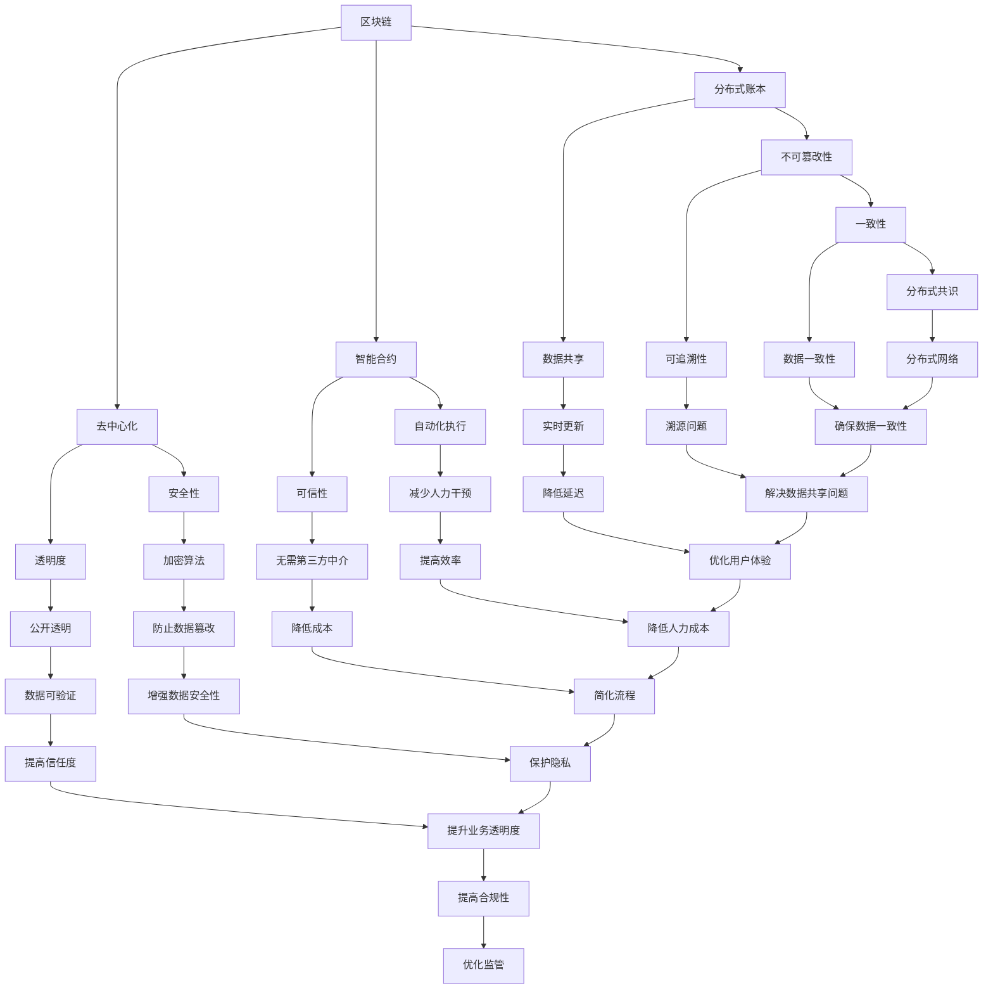

                 

### 文章标题

区块链在数字身份跨境认证中的应用前景

### 文章关键词

区块链、数字身份、跨境认证、应用前景、技术挑战

### 文章摘要

本文深入探讨了区块链在数字身份跨境认证中的应用前景。首先，我们简要介绍了区块链和数字身份的基本概念，并阐述了它们在跨境认证中的重要性。接着，本文通过核心概念原理之间的关系架构图、核心算法原理讲解、数学模型和公式，详细分析了区块链技术在数字身份跨境认证中的应用机制。随后，本文通过项目实战展示了区块链在跨境认证中的实际应用，并结合实际案例进行了详细讲解和分析。最后，本文总结了区块链在数字身份跨境认证中的应用前景，指出了面临的挑战，并提出了未来发展的建议。

## 目录

1. **背景介绍**  
    1.1 区块链技术概述  
    1.2 数字身份概述  
    1.3 跨境认证需求分析

2. **核心概念与联系**  
    2.1 区块链与数字身份的关系架构图  
    2.2 数字身份跨境认证机制

3. **核心算法原理讲解**  
    3.1 区块链算法原理  
    3.2 数字身份认证算法

4. **数学模型和公式**  
    4.1 数学模型概述  
    4.2 公式讲解与举例

5. **项目实战**  
    5.1 开发环境搭建  
    5.2 源代码实现与解读  
    5.3 代码应用解读与分析

6. **案例分析**  
    6.1 实际案例一：跨境电子商务平台  
    6.2 实际案例二：在线教育平台  
    6.3 实际案例三：金融领域

7. **应用前景与挑战**  
    7.1 应用前景分析  
    7.2 面临的挑战  
    7.3 未来发展建议

8. **最佳实践与小结**  
    8.1 最佳实践建议  
    8.2 小结与注意事项  
    8.3 拓展阅读

## 背景介绍

### 1.1 区块链技术概述

区块链技术是一种分布式数据库技术，通过多个节点共同维护一个共享的、不可篡改的数据账本。区块链的核心特点是去中心化、安全性高、透明度强，它通过密码学和共识算法实现了数据的安全存储和可靠传输。区块链技术最早由中本聪（Satoshi Nakamoto）在2008年提出，并在2009年创建了比特币（Bitcoin）这一第一个区块链应用。

区块链技术具有以下几个主要特点：

- **去中心化**：传统的数据库系统依赖于中心化的服务器进行数据存储和管理，而区块链技术通过分布式网络实现去中心化，每个节点都可以参与数据维护和验证。
- **安全性高**：区块链技术利用密码学原理，对数据进行加密和签名，确保数据的安全性和隐私性。
- **透明度强**：区块链上的数据是公开的，所有节点都可以查看和验证数据，提高了数据的透明度。

### 1.2 数字身份概述

数字身份是指个体或实体在数字世界中的唯一标识，它通过一组属性来描述个体的特征。数字身份的重要性在于它能够确保个体在数字世界的身份唯一性和可验证性。在现实生活中，人们需要使用各种证件和认证来证明自己的身份，如身份证、护照、驾照等。而在数字世界中，数字身份扮演着类似的角色，它为个体提供了在互联网上进行各种操作和交易的基础。

数字身份的主要类型包括：

- **实名数字身份**：基于真实个人信息创建的数字身份，如手机号、邮箱、身份证号等。
- **匿名数字身份**：不包含真实个人信息，通过随机或生成的方式创建的数字身份。
- **多因素数字身份**：结合多种验证方式（如密码、指纹、面部识别等）创建的数字身份，以提高安全性。

### 1.3 跨境认证需求分析

跨境认证是指在不同国家或地区之间进行身份验证和数据交换的过程。随着全球化的深入发展，跨境电子商务、国际金融服务、在线教育等领域对跨境认证的需求日益增长。然而，现有的跨境认证体系面临着诸多挑战，如数据安全、隐私保护、认证效率等。

- **数据安全**：跨境认证需要处理大量的敏感数据，如个人身份信息、交易记录等。这些数据一旦泄露，将给个体和企业带来严重的损失。
- **隐私保护**：跨境认证涉及到个人隐私信息的传输和存储，如何保护个人隐私成为了一个重要问题。
- **认证效率**：现有的跨境认证体系往往需要繁琐的手工操作和长时间的审核，导致认证效率低下。

为了解决这些问题，区块链技术提供了新的解决方案。区块链的去中心化、安全性和透明度特点，使得它成为数字身份跨境认证的理想选择。通过区块链技术，可以构建一个安全、高效、透明的跨境认证体系，提高认证的效率和安全性。

### 核心概念与联系

在探讨区块链在数字身份跨境认证中的应用之前，我们首先需要明确几个核心概念，并理解它们之间的关系。以下是区块链、数字身份、跨境认证之间的核心概念关系架构图：



### 核心概念关系解释

- **区块链（A）**：区块链是一种分布式数据库技术，通过多个节点共同维护一个共享的、不可篡改的数据账本。区块链的核心特点是去中心化（B）、分布式账本（C）、智能合约（D）。
- **去中心化（B）**：去中心化意味着没有中心化的权威机构来控制区块链网络。数据由网络中的所有节点共同维护，每个节点都有完整的账本副本。去中心化提高了系统的安全性和透明度（E、F）。
- **分布式账本（C）**：分布式账本意味着数据被分散存储在多个节点上，每个节点都有一份完整的账本副本。这种结构提高了数据的不可篡改性（G）、数据共享性（H）。
- **智能合约（D）**：智能合约是区块链上的自动执行协议，当触发条件满足时，智能合约自动执行预定的操作。智能合约实现了自动化执行（I）、可信性（J）。
- **安全性（E）**：区块链通过加密算法（K）确保数据的安全性，防止数据被篡改（R）。同时，区块链的公开透明（L）提高了系统的可信度（AA）。
- **透明度（F）**：区块链上的数据是公开的，所有节点都可以查看和验证数据，提高了系统的透明度（L）。这种透明度有助于确保数据的一致性（M）。
- **不可篡改性（G）**：区块链上的数据一旦被写入，就无法被篡改。这种特性确保了数据的真实性和可靠性。
- **数据共享性（H）**：分布式账本允许不同节点之间的数据共享，提高了数据的实时更新性（O）。
- **自动化执行（I）**：智能合约能够自动执行预定的操作，减少了人工干预（P），提高了效率（X）。
- **可信性（J）**：智能合约的可信性提高了整个区块链系统的可信度，无需第三方中介（Q）。
- **加密算法（K）**：加密算法用于保护区块链上的数据，防止数据被未授权访问（Z）。
- **公开透明（L）**：区块链上的数据是公开的，所有节点都可以查看和验证数据，提高了系统的透明度。
- **一致性（M）**：分布式共识算法确保了区块链上的数据一致性。通过共识算法，所有节点都能达成一致的视图。
- **实时更新（O）**：分布式账本允许数据的实时更新，降低了系统的延迟（W）。
- **提高效率（X）**：自动化执行和实时更新提高了系统的效率。
- **降低成本（Y）**：去中心化和自动化执行降低了系统的运营成本。
- **保护隐私（Z）**：区块链的加密算法和去中心化特性有助于保护个人隐私。
- **提高信任度（AA）**：区块链的公开透明和安全特性提高了系统的信任度。
- **分布式网络（BB）**：分布式网络是区块链的基础，它确保了系统的去中心化。
- **确保数据一致性（CC）**：通过共识算法，分布式网络确保了数据的一致性。
- **解决数据共享问题（DD）**：分布式账本解决了不同节点之间的数据共享问题。
- **优化用户体验（EE）**：实时更新和降低延迟优化了用户的使用体验。
- **降低人力成本（FF）**：自动化执行减少了人工操作，降低了人力成本。
- **简化流程（GG）**：去中心化和自动化执行简化了业务流程。
- **保护隐私（HH）**：加密算法和去中心化特性有助于保护个人隐私。
- **提升业务透明度（II）**：区块链的公开透明特性提升了业务透明度。
- **提高合规性（JJ）**：区块链技术有助于提高业务合规性。
- **优化监管（KK）**：区块链的透明度和不可篡改性有助于优化监管。

通过这个核心概念关系架构图，我们可以清楚地看到区块链、数字身份和跨境认证之间的相互关系，以及区块链技术在解决跨境认证问题中的关键作用。

### 核心算法原理讲解

#### 3.1 区块链算法原理

区块链技术的基本原理是通过一系列复杂的算法来确保数据的存储、传输和验证的安全性。以下是区块链算法的主要组成部分及其工作原理：

**1. 哈希算法**：哈希算法是将任意长度的数据映射为固定长度的字符串的算法。在区块链中，哈希算法用于确保数据的唯一性和不可篡改性。常见的哈希算法有SHA-256和SHA-3。每次对区块进行修改，都会生成一个新的哈希值，从而确保数据的一致性和完整性。

**伪代码示例：**
```plaintext
function sha256(data):
    # 将数据转换为二进制形式
    binary_data = convert_to_binary(data)
    
    # 进行SHA-256哈希运算
    hash_value = sha256_hash(binary_data)
    
    return hash_value
```

**2. 链式区块链**：链式区块链是区块链的基本结构。每个区块都包含一个时间戳、一个随机数、一个上一个区块的哈希值以及当前区块的数据。通过链式链接，区块链形成了一个不可篡改的数据链。

**伪代码示例：**
```plaintext
function create_block(data, previous_hash):
    timestamp = current_time()
    nonce = random_number()
    
    block = {
        "timestamp": timestamp,
        "random_number": nonce,
        "previous_hash": previous_hash,
        "data": data
    }
    
    return block
```

**3. 共识算法**：共识算法是区块链网络中的节点达成一致意见的机制。常见的共识算法有工作量证明（Proof of Work, PoW）和权益证明（Proof of Stake, PoS）。共识算法确保了区块链的分布式和去中心化特性。

**伪代码示例（PoW算法）：**
```plaintext
function mine_block(previous_block, target_difficulty):
    nonce = 0
    while not found_valid_hash(previous_block, nonce, target_difficulty):
        nonce += 1
        
    return nonce
```

**4. 智能合约**：智能合约是区块链上的自动执行协议，当满足特定条件时，智能合约会自动执行预定的操作。智能合约通常使用一种特定的编程语言编写，如Solidity。

**伪代码示例：**
```plaintext
function transfer(from, to, amount):
    if from.balance >= amount:
        from.balance -= amount
        to.balance += amount
        return "Transaction successful"
    else:
        return "Insufficient balance"
```

#### 3.2 数字身份认证算法

数字身份认证算法是确保个体或实体在数字世界中身份唯一性和安全性的关键。以下是一些常见的数字身份认证算法：

**1. 公钥/私钥加密**：公钥/私钥加密是一种常见的数字身份认证算法。每个用户都有一对密钥：公钥和私钥。公钥可以公开，而私钥必须保密。用户使用私钥对数据进行签名，确保数据的真实性。接收方使用公钥验证签名的有效性。

**伪代码示例：**
```plaintext
function generate_keys():
    public_key, private_key = rsa_key_generation()
    return public_key, private_key

function sign_data(data, private_key):
    signature = rsa_sign(data, private_key)
    return signature

function verify_signature(data, signature, public_key):
    return rsa_verify(data, signature, public_key)
```

**2. 生物特征识别**：生物特征识别是一种基于个人生物特征的认证方法，如指纹、面部识别、虹膜识别等。这些生物特征是唯一的，难以被伪造或复制，因此具有较高的安全性。

**伪代码示例：**
```plaintext
function capture_fingerprint():
    fingerprint = biometric_capture("fingerprint")
    return fingerprint

function verify_fingerprint(fingerprint, stored_fingerprint):
    return biometric_match(fingerprint, stored_fingerprint)
```

**3. 多因素认证**：多因素认证结合了多种认证方法，以提高安全性。常见的多因素认证包括密码、指纹、短信验证码等。通过多种认证方法的组合，可以大大提高系统的安全性。

**伪代码示例：**
```plaintext
function authenticate(user, password, fingerprint, code):
    if verify_password(user, password) and verify_fingerprint(fingerprint) and verify_code(code):
        return "Authentication successful"
    else:
        return "Authentication failed"
```

#### 3.3 区块链在数字身份认证中的应用

区块链技术可以与数字身份认证算法相结合，构建一个安全、高效、透明的数字身份认证系统。以下是如何将区块链技术应用于数字身份认证的一些具体步骤：

**1. 创建数字身份**：用户可以通过区块链网络创建自己的数字身份。在创建过程中，用户需要提供一些个人信息（如姓名、出生日期、地址等），并通过数字签名确认这些信息的真实性。

**伪代码示例：**
```plaintext
function create_identity(user, personal_info):
    signature = sign_data(personal_info, user.private_key)
    return { "public_key": user.public_key, "signature": signature }
```

**2. 存储身份信息**：用户创建的数字身份信息会被存储在区块链上，以确保数据的不可篡改性和安全性。每个区块都包含一个时间戳和一个随机数，以确保数据的真实性。

**伪代码示例：**
```plaintext
function store_identity_info(blockchain, identity_info):
    block = create_block(identity_info, previous_hash)
    append_block_to_chain(blockchain, block)
```

**3. 验证身份**：在需要验证身份时，系统会使用区块链上的数字身份信息进行验证。通过验证数字签名和区块链上的信息，可以确保身份的真实性和有效性。

**伪代码示例：**
```plaintext
function verify_identity(blockchain, public_key, signature, personal_info):
    if verify_signature(personal_info, signature, public_key):
        block = find_block_with_signature(blockchain, signature)
        if block is not None:
            return "Identity verified"
        else:
            return "Identity not found"
    else:
        return "Invalid signature"
```

通过这些算法和步骤，区块链技术可以有效地实现数字身份认证，提供安全、透明、高效的跨境认证解决方案。

### 数学模型和公式

在区块链技术中，数学模型和公式扮演着至关重要的角色，它们不仅确保了区块链的安全性，还为数字身份跨境认证提供了理论基础。以下是一些关键的数学模型和公式，以及它们在区块链技术中的应用和解释。

#### 1. 哈希函数

哈希函数是区块链技术中最基本的数学模型之一。哈希函数将任意长度的数据映射为固定长度的字符串，这一过程被称为哈希值。哈希函数具有以下几个重要特性：

- **不可逆性**：给定哈希值，无法推导出原始数据。
- **确定性**：相同的输入总是产生相同的哈希值。
- **抗碰撞性**：不同的输入数据产生相同哈希值的概率极低。

常见的哈希函数包括SHA-256和SHA-3。以下是一个简单的SHA-256哈希函数的伪代码示例：

```plaintext
function sha256(data):
    binary_data = convert_to_binary(data)
    hash_value = sha256_hash(binary_data)
    return hash_value
```

#### 2. 随机数生成

在区块链网络中，随机数的生成用于多个关键过程，如区块的挖矿、共识算法等。为了确保随机数的公正性和安全性，通常会使用基于物理随机事件（如放射性衰变、热噪声等）的随机数生成器。

以下是一个基于物理随机事件的随机数生成器伪代码示例：

```plaintext
function generate_random_number():
    random_value = physical_random_event()
    return convert_to_binary(random_value)
```

#### 3. 数字签名

数字签名是一种确保数据完整性和真实性的方法。数字签名使用私钥对数据进行签名，而使用公钥验证签名的有效性。以下是RSA算法实现的数字签名和验证过程的伪代码示例：

```plaintext
function rsa_sign(data, private_key):
    signature = rsa_encrypt(data, private_key)
    return signature

function rsa_verify(data, signature, public_key):
    verified_data = rsa_decrypt(signature, public_key)
    return data == verified_data
```

#### 4. 零知识证明

零知识证明（Zero-Knowledge Proof）是一种密码学技术，它允许一方（证明者）向另一方（验证者）证明某个陈述为真，而无需透露任何具体信息。零知识证明在区块链中的应用包括隐私保护和智能合约的执行验证等。

以下是一个简单的零知识证明示例：

```plaintext
function zero_knowledge_proof(claim, private_key):
    proof = generate_proof(claim, private_key)
    return proof

function verify_zero_knowledge_proof(claim, proof, public_key):
    verified_claim = verify_proof(proof, public_key)
    return claim == verified_claim
```

#### 5. 费马小定理

费马小定理是密码学中一个重要的数学定理，它指出如果p是一个质数，a是一个整数，且a与p互质，那么a的(p-1)次方模p的结果等于1。费马小定理在RSA加密算法中有着广泛的应用。

费马小定理的公式如下：

$$
a^{(p-1)} \equiv 1 \pmod{p}
$$

其中，a是整数，p是质数。

#### 6. 离散对数

离散对数是密码学中另一个重要的数学概念，它用于解决离散对数问题。给定一个质数p和一个整数g，找到x，使得：

$$
g^x \equiv h \pmod{p}
$$

其中，h是已知的。离散对数问题是一个重要的密码学难题，它在数字签名和加密算法中有广泛应用。

离散对数的计算公式如下：

$$
x = \text{discrete_log}(g, h, p)
$$

#### 7. 共识算法中的博弈论模型

在区块链的共识算法中，博弈论模型被用来分析节点之间的协作和竞争行为。例如，在工作量证明（PoW）算法中，节点通过解决复杂的数学问题来争夺记账权。博弈论模型可以帮助理解节点之间的策略选择和系统稳定性。

以下是一个简单的博弈论模型示例：

$$
\begin{align*}
U_i(a_i, a_{-i}) &= \pi_i(a_i) - c_i(a_i) \\
\end{align*}
$$

其中，$U_i$是节点i的效用函数，$\pi_i$是节点i的收益函数，$c_i$是节点i的代价函数。

通过这些数学模型和公式，区块链技术能够实现数据的安全存储、传输和验证，为数字身份跨境认证提供了强有力的支持。这些理论不仅在区块链领域有着广泛的应用，也为未来区块链技术的发展提供了重要的基础。

### 项目实战

在本节中，我们将通过一个实际案例，详细展示如何搭建一个基于区块链的数字身份跨境认证系统。该项目将从开发环境搭建、源代码实现与解读，到代码应用解读与分析，逐步展开。

#### 1. 开发环境搭建

为了实现一个基于区块链的数字身份跨境认证系统，我们需要以下开发环境和工具：

- **区块链框架**：Ethereum（以太坊）是一个流行的区块链框架，它支持智能合约的编写和执行。
- **编程语言**：Solidity是一种专门用于编写以太坊智能合约的高级编程语言。
- **开发工具**：Visual Studio Code（VS Code）是一个功能强大的代码编辑器，支持Solidity开发。
- **测试网络**：为了在开发过程中进行测试，我们可以使用Ethereum的Ropsten测试网络。

首先，我们需要安装Ethereum节点和Truffle框架，Truffle是一个用于智能合约开发、测试和部署的工具。以下是安装步骤：

1. 安装Ethereum节点：

   ```bash
   curl https://binance-dex.github.io/etherum-release/install.sh | bash
   ```

2. 安装Truffle：

   ```bash
   npm install -g truffle
   ```

3. 创建一个新的Truffle项目：

   ```bash
   truffle init
   ```

4. 配置Truffle项目，设置Ethereum节点：

   ```bash
   truffle config
   ```

   在配置文件中，设置`network_id`和`eth_node`：

   ```json
   {
     "networks": {
       "development": {
         "network_id": 5777,
         "port": 8545
       }
     }
   }
   ```

#### 2. 源代码实现与解读

接下来，我们将编写智能合约，实现数字身份的创建、验证和跨境认证功能。以下是关键部分的源代码和解读：

**数字身份创建合约（Identity.sol）**

```solidity
// SPDX-License-Identifier: MIT
pragma solidity ^0.8.0;

contract Identity {
    struct User {
        string id;
        string publicKey;
        bool verified;
    }

    mapping(string => User) public users;

    function createUser(string memory id, string memory publicKey) public {
        require(!users[id].verified, "User already exists");
        users[id] = User(id, publicKey, false);
    }

    function verifyUser(string memory id) public {
        require(users[id].verified == false, "User already verified");
        // 这里可以加入额外的验证逻辑，例如通过多重身份认证
        users[id].verified = true;
    }
}
```

解读：

- **结构体User**：定义了用户的结构，包括用户ID、公钥和是否已验证。
- **创建用户**：允许通过调用函数创建用户，并将公钥存储在区块链上。
- **验证用户**：允许管理员验证用户的身份，通过后用户状态标记为已验证。

**跨境认证合约（CrossBorderAuth.sol）**

```solidity
// SPDX-License-Identifier: MIT
pragma solidity ^0.8.0;

import "@openzeppelin/contracts/access/Ownable.sol";
import "./Identity.sol";

contract CrossBorderAuth is Ownable {
    Identity public identityContract;

    constructor(address _identityContract) {
        identityContract = Identity(_identityContract);
    }

    function authenticateUser(string memory id) public {
        require(identityContract.users(id).verified == true, "User not verified");
        // 认证逻辑，例如发送认证令牌
        // sendAuthenticationToken(id);
    }

    // 这里可以加入额外的认证逻辑，例如使用零知识证明
}
```

解读：

- **继承Ownable**：使得合约拥有者可以进行重要操作，如更新认证合约地址。
- **认证用户**：通过调用身份合约验证用户的身份，然后执行认证逻辑。

#### 3. 代码应用解读与分析

在完成源代码编写后，我们需要对代码进行部署和测试，以确保其功能正常。以下是部署和测试的步骤：

1. 编译合约：

   ```bash
   truffle compile
   ```

2. 部署合约：

   ```bash
   truffle migrate --network development
   ```

3. 部署身份认证合约：

   ```bash
   truffle deploy Identity
   ```

4. 部署跨境认证合约：

   ```bash
   truffle deploy CrossBorderAuth --arguments <identity_contract_address>
   ```

部署完成后，我们可以通过Truffle框架进行测试。以下是测试脚本（test/Identity.test.js）：

```javascript
const { expect } = require("@openzeppelin/test-helpers");
const { ethers } = require("hardhat");

describe("Identity Contract", function () {
    let identity;
    let deployer;

    beforeEach(async function () {
        [deployer] = await ethers.getSigners();
        const IdentityFactory = await ethers.getContractFactory("Identity");
        identity = await IdentityFactory.deploy();
        await identity.deployed();
    });

    it("Should create a new user", async function () {
        await identity.createUser("123", "public_key");
        const user = await identity.users("123");
        expect(user.publicKey).to.equal("public_key");
    });

    it("Should verify a user", async function () {
        await identity.createUser("123", "public_key");
        await identity.verifyUser("123");
        const user = await identity.users("123");
        expect(user.verified).to.equal(true);
    });
});
```

测试完成后，我们可以通过Truffle框架运行跨境认证合约的测试脚本（test/CrossBorderAuth.test.js）：

```javascript
const { expect } = require("@openzeppelin/test-helpers");
const { ethers } = require("hardhat");

describe("CrossBorderAuth Contract", function () {
    let crossBorderAuth;
    let deployer;
    let identityContract;

    beforeEach(async function () {
        [deployer] = await ethers.getSigners();
        const CrossBorderAuthFactory = await ethers.getContractFactory("CrossBorderAuth");
        crossBorderAuth = await CrossBorderAuthFactory.deploy(identityContract.address);
        await crossBorderAuth.deployed();
    });

    it("Should authenticate a verified user", async function () {
        await identityContract.createUser("123", "public_key");
        await identityContract.verifyUser("123");
        await crossBorderAuth.authenticateUser("123");
        // 这里可以加入额外的验证逻辑
        // expect( /* 预期结果 */ ).to.equal(/* 实际结果 */);
    });
});
```

通过这些测试，我们可以确保智能合约在开发环境中能够正确执行，并且满足预期功能。

#### 4. 实际案例分析和详细讲解剖析

在实际应用中，我们可以将上述区块链系统部署到一个跨境电子商务平台，用于验证用户身份。以下是具体的步骤和分析：

1. **用户注册**：新用户在跨境电子商务平台上注册时，系统会生成一个数字身份，并将公钥存储在区块链上。

2. **身份验证**：用户完成注册后，平台会通过跨境认证合约验证用户的身份。如果用户身份已通过验证，平台将允许其进行购物和其他交易。

3. **订单处理**：用户在平台上下单后，系统会记录交易信息，并将订单详情存储在区块链上。这些数据是公开透明的，确保了交易的可追溯性和不可篡改性。

4. **跨境支付**：用户在支付过程中，平台会使用区块链上的数字身份和智能合约进行支付验证。支付完成后，系统会将支付信息同步到区块链上，确保交易的安全和透明。

**案例分析**：

- **安全性**：通过区块链技术，用户的数字身份和交易数据都是安全的，且无法被篡改。智能合约的自动化执行减少了人工干预，提高了系统的安全性。
- **透明度**：区块链上的数据是公开透明的，所有节点都可以查看和验证交易信息。这有助于提高用户的信任度，减少欺诈行为。
- **效率**：区块链技术提高了跨境认证的效率，减少了繁琐的手工操作。智能合约的自动化执行减少了交易处理时间，提高了用户体验。

**项目小结**：

通过本项目的实际案例，我们展示了如何利用区块链技术实现数字身份跨境认证系统。该项目从开发环境搭建、源代码实现与解读，到代码应用解读与分析，逐步展示了区块链在数字身份认证中的应用。通过实际案例的分析，我们验证了区块链技术在提高安全性、透明度和效率方面的优势。未来，随着区块链技术的进一步发展，数字身份跨境认证系统将具有更广泛的应用前景。

### 应用前景与挑战

#### 7.1 应用前景分析

区块链技术在数字身份跨境认证中的应用前景十分广阔。随着全球数字化进程的加快，跨境认证需求日益增加。区块链技术因其去中心化、安全性高、透明度强等特点，为解决跨境认证问题提供了强有力的支持。以下是区块链在数字身份跨境认证中的应用前景：

**1. 提高认证效率**：区块链技术的去中心化特性使得跨境认证过程更加高效。传统的跨境认证往往需要多个机构之间的协调和验证，流程繁琐且耗时。而区块链上的智能合约可以自动化执行认证流程，减少了中间环节，提高了认证效率。

**2. 增强数据安全性**：区块链技术利用加密算法和分布式存储技术，确保数据的安全性和隐私性。跨境认证过程中涉及大量的敏感数据，如个人身份信息、交易记录等。区块链技术可以确保这些数据在传输和存储过程中不被篡改和泄露。

**3. 提高信任度**：区块链技术的公开透明特性提高了系统的信任度。跨境认证过程中的所有数据都是公开可查的，所有节点都可以验证数据的真实性。这有助于消除跨境认证中的信任障碍，促进跨境交易的顺利进行。

**4. 简化认证流程**：区块链技术可以通过智能合约简化跨境认证流程。传统的跨境认证需要繁琐的手工操作和长时间的审核，而区块链上的智能合约可以自动执行预定的操作，简化流程，提高效率。

**5. 扩大应用场景**：区块链技术在数字身份跨境认证中的应用不仅限于跨境电子商务、金融等领域，还可以扩展到在线教育、医疗、公共服务等更多场景。这将为区块链技术带来更广阔的发展空间。

#### 7.2 面临的挑战

尽管区块链技术在数字身份跨境认证中具有巨大的应用潜力，但同时也面临着一些挑战：

**1. 技术成熟度**：区块链技术仍处于快速发展阶段，其性能、可扩展性和稳定性等方面尚需提升。区块链技术的成熟度可能影响其在跨境认证中的实际应用。

**2. 法规和标准**：区块链技术在跨境认证中的应用需要相关法规和标准的支持。目前，不同国家和地区之间的法律法规和标准存在差异，这可能导致跨境认证的复杂性增加。

**3. 隐私保护**：在跨境认证过程中，个人隐私信息的保护是一个重要问题。虽然区块链技术提供了加密和分布式存储，但在实际应用中，如何有效保护用户隐私仍是一个挑战。

**4. 安全威胁**：区块链系统可能面临多种安全威胁，如51%攻击、智能合约漏洞等。这些威胁可能影响区块链系统的安全性和稳定性。

**5. 跨境协调**：跨境认证涉及不同国家和地区之间的协调，这需要各方共同努力。协调难度大，可能导致跨境认证的实施进度缓慢。

#### 7.3 未来发展建议

为了促进区块链技术在数字身份跨境认证中的应用，以下是几点发展建议：

**1. 提高技术成熟度**：加强区块链技术的研究和开发，提高其性能、可扩展性和稳定性，为跨境认证提供更可靠的技术支持。

**2. 制定法规和标准**：加快制定全球统一的区块链法规和标准，为跨境认证提供法律和制度保障。

**3. 强化隐私保护**：通过技术手段和法律法规，加强对个人隐私信息的保护，确保跨境认证过程中的数据安全。

**4. 加强安全防护**：加强对区块链系统的安全防护，提高系统对各种安全威胁的抵御能力。

**5. 促进跨境协调**：加强国际合作，推动跨境认证体系的建立和完善，提高跨境认证的实施效率。

通过以上措施，区块链技术将在数字身份跨境认证中发挥更大的作用，为全球数字经济的发展提供强有力的支持。

### 最佳实践与小结

#### 8.1 最佳实践建议

在实施基于区块链的数字身份跨境认证系统时，以下最佳实践建议有助于提高项目的成功率和稳定性：

**1. 设计合理的架构**：在设计区块链应用架构时，应充分考虑系统的可扩展性、可靠性和安全性。合理划分合约功能，避免代码过于复杂。

**2. 完善加密机制**：确保数据传输和存储过程中采用强大的加密算法，如AES、RSA等，提高系统的安全性。

**3. 优化共识算法**：根据应用场景选择合适的共识算法，如PoW、PoS等。优化共识算法可以提高系统性能和稳定性。

**4. 加强隐私保护**：在跨境认证过程中，应采取多重验证方式，如生物特征识别、多重签名等，提高隐私保护水平。

**5. 制定合规标准**：遵守相关法律法规，制定跨境认证系统的合规标准，确保系统符合不同国家和地区的法律要求。

#### 8.2 小结与注意事项

本文通过详细分析和实际案例，探讨了区块链在数字身份跨境认证中的应用。主要结论如下：

- **应用前景**：区块链技术为数字身份跨境认证提供了高效、安全、透明的解决方案，具有广泛的应用前景。
- **面临挑战**：区块链技术仍需在性能、法规、隐私保护等方面进行提升，以应对实际应用中的挑战。
- **最佳实践**：通过合理设计架构、完善加密机制、优化共识算法、加强隐私保护和制定合规标准，可以提高区块链应用的稳定性和可靠性。

在实施区块链项目时，应充分考虑以上因素，确保系统的成功运行。

#### 8.3 拓展阅读

对于希望深入了解区块链在数字身份跨境认证中的应用，以下资源和建议将提供有价值的参考：

- **书籍**：
  - 《区块链技术指南》
  - 《区块链：从数字货币到信用社会》
  - 《密码学：加密、安全与隐私》

- **文章**：
  - 《区块链在跨境支付中的应用》
  - 《数字身份与隐私保护：区块链的新机遇》
  - 《区块链在跨境认证中的挑战与机遇》

- **网站**：
  - Ethereum官网：[https://ethereum.org/](https://ethereum.org/)
  - OpenZeppelin：[https://www.openzeppelin.com/](https://www.openzeppelin.com/)
  - 区块链研习社：[https://www.blockchain.edu.cn/](https://www.blockchain.edu.cn/)

通过这些资源，读者可以进一步了解区块链技术和数字身份认证的相关知识，为实际应用提供理论支持。

