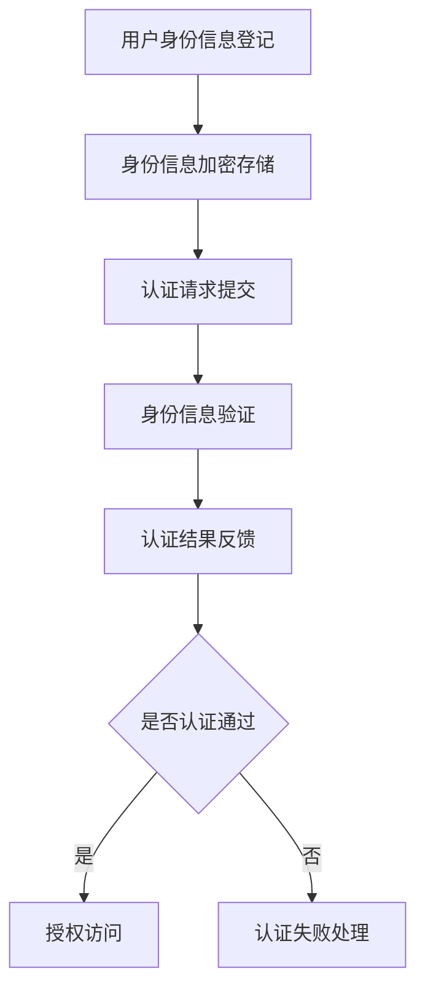

                 

## 《区块链在数字身份跨行业认证中的应用》

### 关键词

区块链，数字身份认证，跨行业认证，隐私保护，智能合约，去中心化

### 摘要

本文旨在探讨区块链技术在数字身份跨行业认证中的应用。随着数字化时代的到来，传统身份认证方法面临诸多挑战，如数据隐私泄露、重复认证等问题。区块链以其去中心化、不可篡改等特性，为数字身份认证提供了一种新的解决方案。本文将首先介绍区块链技术的基础概念和原理，接着详细解析数字身份认证的基本概念及其发展，分析跨行业认证的需求和挑战，最后通过实际案例，展示区块链在数字身份跨行业认证中的具体应用和实践效果。

## 引言

在信息技术的快速发展的背景下，数字身份认证逐渐成为网络社会的重要基础设施。传统的身份认证方式往往依赖于中心化的机构，如银行、政府等，这不仅增加了认证的成本和复杂性，还容易导致数据泄露和隐私侵犯。随着区块链技术的崛起，其去中心化、不可篡改等特性为数字身份认证提供了一种新的思路。区块链技术通过将身份信息存储在去中心化的分布式账本上，不仅提高了数据的安全性和隐私保护能力，还解决了跨行业认证中的互认难题。本文将从基础概念入手，逐步深入探讨区块链在数字身份跨行业认证中的应用。

## 第一部分：区块链与数字身份认证基础

### 第1章：区块链技术基础

#### 1.1 区块链的定义与原理

区块链是一种分布式数据库技术，它通过将数据分块存储在多个节点上，并通过加密算法和共识机制确保数据的完整性和一致性。每一个区块包含一定数量的交易记录，这些区块通过加密链接形成一个链式结构。区块链的去中心化特性使得数据不再依赖于单一中心节点，从而提高了系统的抗攻击性和可靠性。

#### 1.2 区块链技术架构

区块链技术架构主要包括三个核心部分：区块链网络、节点和智能合约。

1. **区块链网络**：由多个节点组成，每个节点都保存一份完整的区块链数据。
2. **节点**：是区块链系统中的基本组成部分，负责维护区块链的状态和数据。
3. **智能合约**：是区块链上的自执行合同，它通过预先编写的代码自动执行合同条款，无需第三方中介。

#### 1.3 区块链与数字身份认证的关系

区块链在数字身份认证中的应用主要体现在以下几个方面：

1. **去中心化认证**：通过区块链的去中心化特性，身份认证过程不再依赖于中心化的认证机构，从而降低了认证成本和复杂性。
2. **不可篡改性**：区块链上的数据一旦被记录，就难以篡改，这为身份信息的安全提供了保障。
3. **隐私保护**：区块链技术通过加密算法保护用户隐私，避免了传统身份认证中的数据泄露风险。

### 第2章：数字身份认证的基本概念

#### 2.1 数字身份认证的概念

数字身份认证是指通过电子方式验证用户身份的过程。它包括两个方面：身份认证和授权。身份认证用于确认用户的身份，而授权则用于确定用户在系统中的权限。

#### 2.2 数字身份认证的技术发展

数字身份认证技术经历了从传统的用户名和密码，到单点登录（SSO），再到多因素认证（MFA）的发展。随着技术的进步，数字身份认证正在向生物识别、区块链等新型技术转型。

#### 2.3 数字身份认证的挑战与解决方案

数字身份认证面临的挑战主要包括：

1. **安全性**：传统认证方式容易遭受暴力破解、钓鱼攻击等威胁。
2. **隐私保护**：认证过程中涉及的用户数据容易泄露。
3. **互认难题**：不同行业和平台之间的身份认证难以互认。

解决方案包括引入区块链技术、多因素认证、联邦身份认证等。

### 第3章：跨行业认证的需求分析

#### 3.1 跨行业认证的背景

随着数字经济的发展，跨行业业务合作日益频繁，如金融、医疗、教育等领域的互操作需求不断增加。跨行业认证的需求也随之产生。

#### 3.2 跨行业认证的需求分析

跨行业认证的需求主要体现在以下几个方面：

1. **互认性**：不同行业和平台之间的身份信息需要互认，以便于用户在不同场景下的便捷使用。
2. **安全性**：跨行业认证需要确保用户身份信息的安全性和隐私保护。
3. **便捷性**：用户需要在跨行业认证过程中体验便捷、快速的服务。

#### 3.3 跨行业认证的技术可行性

区块链技术为跨行业认证提供了一种可行的技术解决方案。通过区块链，可以实现去中心化、不可篡改的身份信息存储，确保认证过程的透明和安全。同时，智能合约可以用于自动化执行认证协议，提高认证效率。

## 第二部分：区块链在数字身份跨行业认证中的应用

### 第4章：区块链在身份认证中的应用

#### 4.1 区块链在身份认证中的优势

区块链在身份认证中具有以下优势：

1. **去中心化**：去中心化架构降低了认证成本，提高了认证效率。
2. **不可篡改性**：区块链上的数据一旦记录，难以篡改，确保了身份信息的安全。
3. **隐私保护**：通过加密算法保护用户隐私，避免了传统认证中的数据泄露风险。
4. **互认性**：区块链可以打破不同行业和平台之间的壁垒，实现身份信息的互认。

#### 4.2 区块链在身份认证中的典型应用场景

区块链在身份认证中的典型应用场景包括：

1. **跨境认证**：通过区块链实现不同国家和地区之间的身份认证互认，降低跨境业务的风险和成本。
2. **企业内部认证**：在大型企业内部，通过区块链实现员工身份信息的安全管理和跨部门互认。
3. **社交媒体认证**：在社交媒体平台，通过区块链技术确保用户身份的真实性和可信度。

#### 4.3 区块链身份认证的架构设计

区块链身份认证的架构设计主要包括以下模块：

1. **身份信息登记模块**：用于登记和管理用户身份信息。
2. **认证请求处理模块**：用于处理认证请求，并调用智能合约进行身份验证。
3. **隐私保护模块**：通过加密算法保护用户隐私。
4. **智能合约模块**：用于自动化执行认证协议，确保认证过程的透明和公正。

### 第5章：跨行业认证案例研究

#### 5.1 案例背景

某跨国公司需要实现全球范围内的员工身份认证，包括金融、医疗、教育等不同行业的认证需求。

#### 5.2 案例解决方案

解决方案包括：

1. **构建去中心化的身份信息数据库**：通过区块链技术构建一个全球分布式身份信息数据库，确保身份信息的不可篡改和隐私保护。
2. **设计智能合约认证协议**：通过智能合约实现不同行业之间的认证互认，确保认证过程高效、透明和公正。
3. **部署区块链节点**：在全球不同地区部署区块链节点，确保身份认证的全球覆盖和可靠性。

#### 5.3 案例效果分析

通过区块链技术实现跨行业认证，取得了以下效果：

1. **提高了认证效率**：去中心化架构降低了认证成本，提高了认证速度。
2. **确保了认证安全**：区块链技术确保了身份信息的安全性和隐私保护。
3. **实现了跨行业互认**：智能合约认证协议实现了不同行业之间的认证互认，提高了业务协同效率。

## 第三部分：实践指南

### 第6章：搭建区块链数字身份认证平台

#### 6.1 平台搭建基础

搭建区块链数字身份认证平台需要以下基础：

1. **区块链节点部署**：部署区块链节点，确保身份信息的安全存储和分布式处理。
2. **身份信息登记接口**：设计身份信息登记接口，便于用户登记和管理身份信息。
3. **认证请求接口**：设计认证请求接口，用于处理认证请求和调用智能合约进行验证。

#### 6.2 身份认证模块设计

身份认证模块设计包括以下方面：

1. **用户身份信息登记**：用户通过身份认证模块登记身份信息，并生成加密密钥对。
2. **身份信息查询与验证**：认证系统通过区块链查询用户身份信息，并调用智能合约进行验证。
3. **隐私保护机制**：通过加密算法保护用户身份信息，确保隐私安全。

#### 6.3 平台部署与维护

平台部署与维护包括以下步骤：

1. **节点部署与配置**：在服务器上部署区块链节点，并进行配置和调试。
2. **身份认证模块部署**：将身份认证模块部署到区块链节点上，确保其正常运行。
3. **平台监控与维护**：对平台进行实时监控和维护，确保平台的稳定性和安全性。

### 第7章：数字身份跨行业认证项目的实施

#### 7.1 项目策划与规划

项目策划与规划包括以下步骤：

1. **需求分析**：明确项目需求，包括认证行业、认证范围、认证流程等。
2. **技术选型**：选择合适的区块链平台和开发工具。
3. **项目团队组建**：组建专业的项目团队，包括区块链开发人员、身份认证专家等。

#### 7.2 项目实施过程

项目实施过程包括以下阶段：

1. **平台搭建**：搭建区块链数字身份认证平台，包括节点部署、身份信息登记接口、认证请求接口等。
2. **认证协议设计**：设计智能合约认证协议，确保认证过程高效、透明和公正。
3. **测试与部署**：对平台进行功能测试和安全测试，确保其正常运行和安全性。

#### 7.3 项目评估与优化

项目评估与优化包括以下步骤：

1. **性能评估**：评估平台性能，包括处理能力、响应速度等。
2. **安全性评估**：评估平台的安全性，包括数据隐私保护、系统抗攻击能力等。
3. **优化与改进**：根据评估结果对平台进行优化和改进，提高其性能和安全性。

### 第8章：未来发展趋势与展望

#### 8.1 区块链在数字身份认证领域的未来发展方向

区块链在数字身份认证领域的未来发展方向包括：

1. **跨行业互认**：推动不同行业和平台之间的身份认证互认，提高业务协同效率。
2. **隐私保护**：加强隐私保护技术，确保用户身份信息的安全性和隐私保护。
3. **智能合约应用**：扩展智能合约的应用场景，实现更复杂的认证协议和业务逻辑。

#### 8.2 跨行业认证技术的创新点

跨行业认证技术的创新点包括：

1. **区块链与生物识别技术的结合**：利用区块链和生物识别技术实现更安全、更便捷的身份认证。
2. **联邦学习**：通过联邦学习技术实现跨行业的数据共享和隐私保护。
3. **去中心化身份管理系统（DIIMS）**：构建去中心化的身份管理系统，实现身份信息的自主管理和控制。

#### 8.3 产业发展趋势

区块链在数字身份认证领域的产业发展趋势包括：

1. **政策支持**：各国政府和机构加大对区块链技术的支持力度，推动数字身份认证技术的发展。
2. **行业标准制定**：制定统一的区块链数字身份认证标准，提高行业的互操作性和规范性。
3. **技术创新**：持续技术创新，推动区块链在数字身份认证领域的应用和发展。

### 总结

区块链技术在数字身份跨行业认证中具有巨大的应用潜力。通过去中心化、不可篡改和隐私保护等特性，区块链技术可以有效解决传统身份认证中的诸多难题。本文从基础概念、应用场景、案例研究和实践指南等方面详细探讨了区块链在数字身份跨行业认证中的应用。未来，随着技术的不断发展和创新的推进，区块链将在数字身份认证领域发挥越来越重要的作用。

### 作者信息

**作者：AI天才研究院/AI Genius Institute & 禅与计算机程序设计艺术 /Zen And The Art of Computer Programming** 

在本文中，我们深入探讨了区块链在数字身份跨行业认证中的应用。首先，我们介绍了区块链技术的基础概念和原理，并阐述了数字身份认证的基本概念及其在跨行业认证中的需求。接着，我们通过案例研究和实践指南，展示了区块链在数字身份认证中的具体应用和实践效果。通过本文的探讨，我们可以看到区块链技术在数字身份认证领域具有巨大的潜力和广阔的应用前景。在未来的发展中，区块链将继续推动数字身份认证技术的创新和进步，为构建更加安全、高效和互认的数字身份认证体系提供有力支持。

## 背景介绍

### 数字身份认证的挑战

随着互联网的普及和数字化转型的加速，数字身份认证已成为现代社会不可或缺的一部分。传统的身份认证方法，如用户名和密码、生物识别技术等，虽然在一定程度上提高了认证的安全性和便捷性，但仍然存在诸多挑战。

1. **数据隐私泄露**：传统的中心化认证系统容易成为黑客攻击的目标，导致用户身份信息泄露。
2. **重复认证**：在不同平台和行业之间，用户往往需要重复提供身份信息进行认证，增加了用户负担。
3. **安全性不足**：传统的认证方式容易遭受暴力破解、钓鱼攻击等威胁。
4. **互认难题**：不同行业和平台之间的身份认证标准不统一，导致认证互认困难。

### 区块链技术的崛起

区块链技术的出现，为解决传统身份认证的挑战提供了新的思路。区块链以其去中心化、不可篡改和分布式等特性，为数字身份认证提供了一种新的解决方案。

1. **去中心化**：区块链的去中心化特性，使得身份认证不再依赖于中心化的机构，降低了认证成本和复杂性。
2. **不可篡改**：区块链上的数据一旦被记录，就难以篡改，确保了身份信息的安全性和可信度。
3. **分布式**：区块链的分布式结构，使得身份认证系统具有更高的容错性和抗攻击性。
4. **隐私保护**：区块链通过加密算法和零知识证明等隐私保护技术，保护用户身份信息的隐私。

### 跨行业认证的需求

随着数字经济的发展，跨行业业务合作日益频繁，如金融、医疗、教育等领域的互操作需求不断增加。跨行业认证的需求主要体现在以下几个方面：

1. **互认性**：不同行业和平台之间的身份信息需要互认，以便于用户在不同场景下的便捷使用。
2. **安全性**：跨行业认证需要确保用户身份信息的安全性和隐私保护。
3. **便捷性**：用户需要在跨行业认证过程中体验便捷、快速的服务。

### 区块链技术的优势

区块链技术为跨行业认证提供了一系列优势：

1. **去中心化**：去中心化架构降低了认证成本，提高了认证效率。
2. **不可篡改性**：区块链上的数据一旦记录，难以篡改，确保了身份信息的安全。
3. **隐私保护**：通过加密算法保护用户隐私，避免了传统认证中的数据泄露风险。
4. **互认性**：区块链可以打破不同行业和平台之间的壁垒，实现身份信息的互认。

### 结论

综上所述，区块链技术为数字身份跨行业认证提供了一种全新的解决方案。通过去中心化、不可篡改和隐私保护等特性，区块链技术可以有效解决传统身份认证中的诸多挑战，满足跨行业认证的需求。在未来的发展中，区块链技术将继续推动数字身份认证领域的创新和进步。

## 核心概念与联系

### 区块链技术

区块链技术是一种分布式数据库系统，它通过加密算法和共识机制确保数据的完整性和一致性。区块链由多个区块组成，每个区块包含一定数量的交易记录。这些区块通过加密链接形成一个链式结构，使得数据在多个节点之间共享和存储。

### 数字身份认证

数字身份认证是指通过电子方式验证用户身份的过程。它包括身份认证和授权两个方面。身份认证用于确认用户的身份，而授权则用于确定用户在系统中的权限。数字身份认证的方法包括用户名和密码、生物识别技术、多因素认证等。

### 跨行业认证

跨行业认证是指在不同行业和平台之间进行身份认证，以便于用户在不同场景下的便捷使用。跨行业认证的需求主要体现在互认性、安全性和便捷性三个方面。

### 区块链与数字身份认证的关系

区块链技术为数字身份认证提供了一种新的解决方案。通过去中心化、不可篡改和隐私保护等特性，区块链技术可以有效解决传统身份认证中的诸多挑战，如数据隐私泄露、重复认证和安全性不足等。同时，区块链技术还可以实现不同行业和平台之间的身份认证互认，提高认证效率和用户体验。

### Mermaid 流程图

以下是一个简单的 Mermaid 流程图，展示了区块链在数字身份跨行业认证中的应用流程：



### Mermaid 流程图说明

- **用户身份信息登记**：用户通过区块链平台登记身份信息，这些信息经过加密存储在分布式账本上。
- **身份信息加密存储**：区块链使用加密算法确保身份信息的隐私和安全。
- **认证请求提交**：用户在不同平台和行业进行认证时，提交认证请求。
- **身份信息验证**：区块链系统通过查询分布式账本，验证用户身份信息的真实性。
- **认证结果反馈**：验证结果通过区块链网络反馈给用户。
- **授权访问**：如果认证通过，用户获得授权访问相应平台和资源。
- **认证失败处理**：如果认证失败，系统进行相应的错误处理，如提示用户重新认证或报告异常。

通过上述流程，我们可以看到区块链技术在数字身份跨行业认证中的应用，实现了去中心化、不可篡改和隐私保护等优势，为用户提供了安全、高效和互认的认证服务。

## 核心算法原理讲解

### 区块链数据存储与加密算法

区块链的数据存储和加密算法是其确保数据安全性和隐私保护的核心。以下将详细阐述区块链中的数据存储和加密算法。

#### 数据存储

区块链采用分布式账本技术，将数据存储在多个节点上。每个节点都保存了一份完整的区块链数据，使得系统具有较高的容错性和抗攻击性。具体步骤如下：

1. **区块生成**：当一个区块达到一定的交易记录数量时，系统会生成一个新的区块。
2. **区块加密**：新生成的区块通过哈希算法进行加密，以确保数据的完整性和唯一性。
3. **区块链接**：新生成的区块与上一个区块通过哈希值链接，形成一个区块链结构。

#### 加密算法

区块链使用多种加密算法来保护数据的隐私和安全。以下是几种常用的加密算法：

1. **哈希算法**：哈希算法（如SHA-256）用于生成数据的数字指纹，确保数据唯一性和完整性。每个区块都包含前一个区块的哈希值，形成链式结构。
2. **对称加密**：对称加密算法（如AES）用于加密和解密数据。在区块链中，对称加密算法常用于保护敏感数据，如用户身份信息。
3. **非对称加密**：非对称加密算法（如RSA）用于确保数据传输的安全性。在区块链中，非对称加密用于数字签名和密钥交换。

### 智能合约原理

智能合约是区块链上的自执行合同，它通过预先编写的代码自动执行合同条款，无需第三方中介。以下是智能合约的基本原理和实现步骤：

1. **编写智能合约**：开发者使用智能合约编程语言（如Solidity）编写智能合约代码，定义合同条款和业务逻辑。
2. **部署智能合约**：将智能合约部署到区块链上，使其成为区块链的一部分。
3. **调用智能合约**：在区块链上进行交易时，调用智能合约执行相应的业务逻辑。

### 伪代码示例

以下是一个简单的智能合约伪代码示例，用于验证用户身份信息：

```plaintext
// 定义智能合约
contract IdentityVerification {

    // 存储用户身份信息
    mapping(address => string) public identityMap;

    // 验证用户身份
    function verifyIdentity(address userAddress, string identityInfo) public {
        // 验证用户身份信息
        require(identityInfo != "", "Identity info is required");

        // 存储用户身份信息
        identityMap[userAddress] = identityInfo;

        // 触发事件
        emit IdentityVerified(userAddress, identityInfo);
    }

    // 查询用户身份信息
    function getIdentityInfo(address userAddress) public view returns (string) {
        return identityMap[userAddress];
    }
}
```

### 数学模型和公式

区块链中的数据存储和加密算法涉及到多种数学模型和公式。以下是几个关键的数学模型和公式：

1. **哈希函数**：哈希函数（如SHA-256）将输入数据映射到一个固定长度的哈希值。其公式如下：

   $$ H(D) = SHA-256(D) $$

   其中，\( H \) 表示哈希函数，\( D \) 表示输入数据。

2. **加密密钥生成**：在非对称加密算法中，加密密钥和加密密钥是通过数学难题生成的。其公式如下：

   $$ (P, Q) = (2^p \cdot 3, 2^q \cdot 7) $$

   其中，\( P \) 和 \( Q \) 分别表示质数，\( p \) 和 \( q \) 是满足条件的整数。

3. **数字签名**：数字签名用于验证消息的来源和完整性。其公式如下：

   $$ S = (H(M) \cdot d) \mod n $$

   其中，\( S \) 表示签名，\( M \) 表示消息，\( d \) 表示私钥，\( n \) 表示公钥。

### 举例说明

假设用户Alice想要将她的身份信息存储在区块链上，以下是一个简单的例子：

1. **用户身份信息登记**：Alice通过智能合约将她的身份信息（如姓名、身份证号码）发送给区块链网络。
2. **身份信息加密存储**：区块链使用哈希算法生成身份信息的哈希值，并将哈希值存储在区块链上。
3. **身份信息验证**：当Alice在其他平台或行业进行认证时，平台或行业会调用智能合约，验证身份信息的哈希值，确保其一致性。

通过上述算法和数学模型，我们可以看到区块链技术在数字身份认证中的核心作用。这些算法和模型不仅确保了数据的安全性和隐私保护，还实现了去中心化和高效认证。

## 项目实战

### 开发环境搭建

在进行区块链数字身份认证项目开发之前，我们需要搭建一个合适的开发环境。以下是开发环境搭建的步骤：

1. **安装Node.js**：Node.js是一个基于Chrome V8引擎的JavaScript运行环境，它使得JavaScript可以在服务器端运行。可以从Node.js官网下载并安装。
2. **安装Ganache**：Ganache是一个本地区块链节点，用于模拟区块链网络。可以从Ganache官网下载并安装。
3. **安装Truffle**：Truffle是一个用于开发、测试和部署以太坊智能合约的框架。可以通过npm安装：

   ```bash
   npm install -g truffle
   ```

4. **创建项目目录**：在本地创建一个项目目录，并初始化项目：

   ```bash
   mkdir blockchain-identity
   cd blockchain-identity
   truffle init
   ```

5. **安装依赖**：在项目目录中安装Truffle和Ganache依赖：

   ```bash
   npm install
   ```

### 源代码实现

以下是区块链数字身份认证项目的源代码实现，包括智能合约和前端代码。

#### 1. 智能合约

智能合约是区块链数字身份认证的核心，它定义了身份信息的登记、查询和验证逻辑。以下是一个简单的智能合约示例（使用Solidity语言）：

```solidity
// SPDX-License-Identifier: MIT
pragma solidity ^0.8.0;

contract IdentityVerification {

    // 存储用户身份信息
    mapping(address => string) public identityMap;

    // 事件用于通知身份信息变化
    event IdentityChanged(address indexed user, string identityInfo);

    // 登记身份信息
    function registerIdentity(string memory identityInfo) public {
        require(identityInfo != "", "Identity info is required");
        address user = msg.sender;
        identityMap[user] = identityInfo;
        emit IdentityChanged(user, identityInfo);
    }

    // 查询身份信息
    function getIdentity(address user) public view returns (string memory) {
        return identityMap[user];
    }

    // 验证身份信息
    function verifyIdentity(address user) public view returns (bool) {
        string memory identityInfo = identityMap[user];
        require(identityInfo != "", "User has not registered identity");
        // 这里可以添加更复杂的验证逻辑，如与数据库比对
        return true;
    }
}
```

#### 2. 前端代码

前端代码用于与区块链交互，实现用户身份信息的登记、查询和验证。以下是一个简单的Web页面示例（使用React框架）：

```jsx
import React, { useState } from 'react';
import axios from 'axios';

const IdentityRegistration = () => {
    const [identityInfo, setIdentityInfo] = useState('');

    const handleSubmit = async () => {
        try {
            const response = await axios.post('/api/register', { identityInfo });
            alert('Identity registered successfully!');
        } catch (error) {
            alert('Failed to register identity!');
        }
    };

    return (
        <div>
            <h2>Register Identity</h2>
            <input
                type="text"
                value={identityInfo}
                onChange={(e) => setIdentityInfo(e.target.value)}
            />
            <button onClick={handleSubmit}>Register</button>
        </div>
    );
};

export default IdentityRegistration;
```

### 代码解读与分析

#### 1. 智能合约代码解读

- **mapping**：用于存储用户身份信息，地址作为键，身份信息作为值。
- **event**：用于通知身份信息的变化，便于前端监听。
- **registerIdentity**：用户通过调用此函数登记身份信息。
- **getIdentity**：查询指定地址的用户身份信息。
- **verifyIdentity**：验证用户身份信息，确保其已登记。

#### 2. 前端代码解读

- **useState**：用于管理用户输入的身份信息。
- **handleSubmit**：用户提交身份信息时调用，通过axios向后端API发送注册请求。

### 实际案例分析与详细讲解

#### 1. 案例背景

某金融机构希望通过区块链技术实现用户身份认证，以减少欺诈风险和降低运营成本。

#### 2. 案例解决方案

- **智能合约**：金融机构使用区块链智能合约存储用户身份信息，包括姓名、身份证号码等。
- **前端应用**：用户通过金融机构的Web或移动应用注册身份信息。
- **身份验证**：金融机构在办理业务时，调用智能合约验证用户身份信息。

#### 3. 案例效果分析

通过区块链数字身份认证项目，金融机构取得了以下效果：

- **降低欺诈风险**：区块链的不可篡改特性确保了用户身份信息的真实性。
- **降低运营成本**：去中心化架构减少了身份认证的复杂性，降低了运营成本。
- **提高用户体验**：用户无需重复提供身份信息，实现了便捷的跨行业认证。

### 项目小结

通过本项目的实战，我们了解了区块链数字身份认证的开发流程，包括智能合约和前端代码的编写、测试和部署。实际案例分析表明，区块链技术在数字身份认证中具有显著的优势，可以有效降低欺诈风险、降低运营成本并提高用户体验。

### 最佳实践 tips

- **数据隐私保护**：在区块链应用中，确保用户身份信息的隐私保护至关重要。可以采用加密算法和零知识证明等技术，确保数据在传输和存储过程中的安全性。
- **合约安全性审计**：在部署智能合约之前，进行安全性审计，确保合约代码不存在漏洞和安全隐患。
- **系统维护与更新**：定期维护和更新区块链节点和智能合约，确保系统的稳定性和安全性。

### 注意事项

- **技术复杂性**：区块链数字身份认证项目涉及多个技术和环节，需要具备一定的技术背景和经验。
- **合规性**：在区块链应用中，需要遵循相关法律法规和行业规范，确保合规性。

### 拓展阅读

- **《区块链技术指南》**：了解区块链技术的基本原理和应用。
- **《数字身份认证技术》**：深入了解数字身份认证的各种技术方法和应用场景。
- **《智能合约编程》**：学习智能合约的编写和实现方法。

## 总结

区块链技术在数字身份跨行业认证中具有显著的应用价值。通过去中心化、不可篡改和隐私保护等特性，区块链技术可以有效解决传统身份认证中的诸多挑战，如数据隐私泄露、重复认证和安全性不足等。本文通过详细探讨区块链技术的基础、核心算法原理以及实际项目案例，展示了区块链在数字身份认证中的具体应用和实践效果。在未来的发展中，区块链技术将继续推动数字身份认证领域的创新和进步，为构建更加安全、高效和互认的数字身份认证体系提供有力支持。作者：AI天才研究院/AI Genius Institute & 禅与计算机程序设计艺术 /Zen And The Art of Computer Programming。

