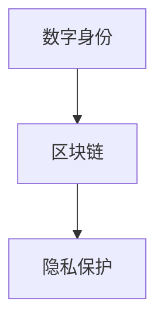

                 

# 《区块链在数字身份隐私保护中的创新应用》

## 关键词

- 区块链
- 数字身份
- 隐私保护
- 加密算法
- 哈希算法
- 零知识证明
- 智能合约
- 差分隐私

## 摘要

本文深入探讨了区块链技术在数字身份隐私保护中的应用。首先，我们从区块链的基本概念和数字身份的定义出发，阐述了隐私保护在数字身份管理中的重要性。接着，我们通过加密算法、哈希算法和零知识证明等核心算法原理，详细介绍了区块链实现数字身份隐私保护的技术基础。随后，我们利用数学模型和公式，深入分析了差分隐私等隐私保护技术。最后，通过一个实际的区块链智能合约项目，展示了如何将上述理论应用到实践中，从而实现数字身份的安全管理和隐私保护。本文旨在为读者提供区块链在数字身份隐私保护领域的全面理解和应用指南。

## 第一部分：区块链与数字身份基础

### 1.1 区块链概述

#### 1.1.1 区块链的定义与特点

区块链是一种去中心化的分布式数据库技术，其核心特点是数据不可篡改和去中心化。区块链通过加密算法和共识机制，确保数据的真实性和安全性。每个区块包含一定数量的交易记录，通过哈希函数与前后区块链接，形成一个链式数据结构。区块链技术的这些特点使其在数据存储和管理方面具有显著优势。

#### 1.1.2 区块链的架构与技术

区块链的架构包括数据层、网络层、共识层、激励层和应用层。数据层主要处理数据的存储和传输，网络层负责节点间的通信，共识层确保数据的可靠性和一致性，激励层激励节点参与网络维护，应用层则实现具体的应用场景。这些层共同构成了区块链系统的整体架构。

#### 1.1.3 区块链的发展与应用

区块链技术自2008年比特币问世以来，经历了快速的发展。目前，区块链已在金融、供应链管理、数字身份等领域得到广泛应用。未来，随着技术的不断进步，区块链将在更多领域展现其潜力，为人类社会带来更高效、更安全的数据管理解决方案。

### 1.2 数字身份的概念与重要性

#### 1.2.1 数字身份的定义与分类

数字身份是通过各种认证手段构建的与个人或实体相关联的唯一标识。根据不同的认证方式和用途，数字身份可分为个人数字身份、企业数字身份和匿名数字身份等类型。

#### 1.2.2 数字身份的安全挑战

随着互联网的发展，数字身份面临诸多安全挑战，包括身份盗窃、隐私泄露和假冒身份等。这些挑战使得数字身份的安全管理成为亟待解决的问题。

#### 1.2.3 数字身份的发展趋势

数字身份的发展趋势主要体现在以下几个方面：一是多因素认证的普及，二是生物识别技术的应用，三是区块链技术的引入，四是隐私保护的加强。这些趋势将为数字身份的安全管理提供有力支持。

### 1.3 隐私保护的数学模型与算法

#### 1.3.1 加密算法

加密算法是保护数据隐私的关键技术，分为对称加密和非对称加密两种。对称加密使用相同的密钥进行加密和解密，非对称加密则使用一对密钥，一个用于加密，一个用于解密。常见的加密算法有AES和RSA等。

#### 1.3.2 哈希算法

哈希算法用于生成数据的指纹，确保数据的完整性和不可篡改性。常见的哈希算法有MD5、SHA-1和SHA-256等。哈希算法的核心思想是将任意长度的数据映射为固定长度的哈希值。

#### 1.3.3 零知识证明

零知识证明是一种密码学技术，用于在不泄露任何信息的情况下，证明某个陈述是真实的。零知识证明在数字身份隐私保护中具有重要的应用价值。

### 1.4 Mermaid流程图：区块链与数字身份的关系



### 1.5 区块链在数字身份隐私保护中的应用案例

#### 1.5.1 智能合约：数字身份注册与验证

智能合约是区块链上的自动化协议，用于实现数字身份的管理和验证。智能合约通过编程逻辑，确保数字身份信息的真实性和安全性。

#### 1.5.2 分布式身份管理：隐私保护与数据共享

区块链技术可以实现分布式身份管理，保护个人隐私的同时，实现数据共享。通过区块链网络，用户可以自主管理自己的数字身份信息，无需依赖第三方机构。

## 第二部分：区块链数字身份隐私保护算法详解

### 2.1 加密算法在数字身份隐私保护中的应用

#### 2.1.1 对称加密与非对称加密

对称加密和非对称加密是加密算法的两种基本形式。对称加密使用相同的密钥进行加密和解密，非对称加密则使用一对密钥，一个用于加密，一个用于解密。对称加密速度较快，但密钥管理复杂；非对称加密安全性高，但计算复杂度较大。

#### 2.1.2 公钥加密与私钥加密

公钥加密与私钥加密是非对称加密的核心技术。公钥加密使用公钥进行加密，私钥加密使用私钥进行解密。这种加密方式确保了数据传输的安全，防止中间人攻击等安全威胁。

#### 2.1.3 RSA算法的原理

RSA算法是一种著名的非对称加密算法，基于大整数分解的难度。RSA算法包括公钥加密、私钥加密和解密三个过程，具有高效、安全的特点。

### 2.2 哈希算法在数字身份隐私保护中的应用

#### 2.2.1 哈希算法的特点

哈希算法具有以下特点：一是将任意长度的数据映射为固定长度的哈希值；二是哈希值具有唯一性，相同的输入数据生成相同的哈希值；三是哈希值无法反推原始数据。

#### 2.2.2 哈希算法在数字身份隐私保护中的应用

哈希算法在数字身份隐私保护中的应用主要包括数据完整性验证和身份认证。通过哈希算法，可以确保数据的完整性和真实性，防止数据篡改和假冒身份。

### 2.3 零知识证明在数字身份隐私保护中的应用

#### 2.3.1 零知识证明的定义

零知识证明是一种密码学技术，用于在不泄露任何信息的情况下，证明某个陈述是真实的。零知识证明的核心思想是，证明者可以证明某个陈述是真实的，而观察者无法获取任何关于陈述的具体信息。

#### 2.3.2 零知识证明在数字身份隐私保护中的应用

零知识证明在数字身份隐私保护中的应用主要包括身份验证和隐私保护。通过零知识证明，用户可以在不泄露任何个人信息的情况下，证明自己的身份，实现隐私保护。

### 2.4 差分隐私在数字身份隐私保护中的应用

#### 2.4.1 差分隐私的定义

差分隐私是一种隐私保护技术，通过在数据集中加入噪声来保护个体的隐私。差分隐私的核心思想是，对原始数据进行扰动，使得单个数据点的信息无法被单独提取，从而保护个体的隐私。

#### 2.4.2 差分隐私在数字身份隐私保护中的应用

差分隐私在数字身份隐私保护中的应用主要包括数据共享和隐私保护。通过差分隐私技术，可以在保护个体隐私的同时，实现数据的共享和分析。

## 第三部分：项目实战

### 3.1 区块链智能合约开发环境搭建

#### 3.1.1 Node.js安装

首先，需要在计算机上安装Node.js。Node.js是一个基于Chrome V8引擎的JavaScript运行环境，用于在服务器端运行JavaScript代码。可以通过官方网站（https://nodejs.org/）下载并安装Node.js。

#### 3.1.2 npm安装

安装Node.js后，会自带npm（Node Package Manager）。npm是一个用于管理Node.js模块的工具，通过npm可以轻松地安装和管理各种Node.js模块。

#### 3.1.3 Truffle框架安装

Truffle是一个用于开发以太坊智能合约的框架，可以通过npm安装。首先，在命令行中运行以下命令：
```bash
npm install -g truffle
```

#### 3.1.4 配置区块链节点

Truffle需要连接到一个以太坊节点，可以通过Geth客户端来配置。首先，下载并安装Geth（https://geth.ethereum.org/docs/getting-started），然后启动Geth节点：
```bash
geth --datadir /path/to/your/datadir --networkid 1337 --port 30303 --nodiscover --rpc --rpcaddr 0.0.0.0 --rpcport 8545 --rpccorsdomain "*" --gcmode=archive --docroot /path/to/your/docs
```

### 3.2 源代码实现

以下是一个简单的数字身份注册和验证的智能合约示例：

```solidity
// SPDX-License-Identifier: MIT
pragma solidity ^0.8.0;

contract IdentityManager {
    mapping(address => string) public identities;

    function registerIdentity(string memory id) public {
        identities[msg.sender] = id;
    }

    function verifyIdentity(address user) public view returns (string memory) {
        return identities[user];
    }
}
```

### 3.3 代码解读与分析

#### 3.3.1 智能合约概述

该智能合约名为`IdentityManager`，用于管理数字身份。合约包含一个`identities`映射，用于存储用户地址与数字身份的对应关系。合约提供了两个函数：`registerIdentity`用于注册数字身份，`verifyIdentity`用于验证数字身份。

#### 3.3.2 registerIdentity函数解析

`registerIdentity`函数是一个公共（`public`）函数，接受一个字符串参数`id`，表示用户的数字身份。函数使用`msg.sender`获取当前调用者的地址，并将数字身份存储在`identities`映射中。

```solidity
function registerIdentity(string memory id) public {
    identities[msg.sender] = id;
}
```

#### 3.3.3 verifyIdentity函数解析

`verifyIdentity`函数也是一个公共（`public`）函数，接受一个地址参数`user`，用于查询指定地址的数字身份。函数使用`identities`映射返回指定地址的数字身份。

```solidity
function verifyIdentity(address user) public view returns (string memory) {
    return identities[user];
}
```

### 3.4 实际案例分析和详细讲解剖析

#### 3.4.1 案例背景

假设有一个在线购物平台，用户需要在平台上进行购物。为了确保交易的安全和信任，平台引入了区块链技术，实现了基于区块链的数字身份管理系统。

#### 3.4.2 案例分析

1. **用户注册**：用户在注册时，通过区块链智能合约的`registerIdentity`函数，将自己的数字身份（如用户名）注册到区块链上。注册过程是公开透明的，任何用户都可以验证数字身份的真实性。

2. **身份验证**：在购物过程中，平台需要验证用户的身份。平台通过调用`verifyIdentity`函数，查询区块链上的数字身份映射，验证用户身份的真实性。这确保了交易的安全性，防止假冒身份进行非法交易。

3. **隐私保护**：区块链技术确保了用户数字身份信息的不可篡改性和安全性。用户无需担心个人信息泄露，因为数字身份信息是加密存储的，且只能在授权情况下进行查询和修改。

#### 3.4.3 案例剖析

通过该案例，我们可以看到区块链技术在数字身份隐私保护中的重要作用。区块链智能合约实现了用户数字身份的注册和验证，确保了交易的安全和信任。同时，区块链的去中心化特性，避免了单点故障和中心化风险，进一步增强了数字身份管理的安全性和可靠性。

### 3.5 项目小结

本项目通过区块链智能合约实现了数字身份的注册和验证，展示了区块链技术在数字身份隐私保护中的应用。项目的成功实施，不仅提高了交易的安全性，还为用户提供了隐私保护的数字身份管理方案。未来，随着区块链技术的不断发展，数字身份隐私保护将变得更加成熟和完善，为人类社会带来更多价值。

### 3.6 最佳实践 tips、小结、注意事项、拓展阅读

#### 3.6.1 最佳实践 tips

1. **智能合约安全性**：在开发智能合约时，要注重安全性，避免代码漏洞。可以使用形式化验证工具对智能合约进行安全性分析。

2. **隐私保护策略**：在实现数字身份隐私保护时，要结合实际需求，选择合适的隐私保护策略，如零知识证明、差分隐私等。

3. **多因素认证**：为了提高数字身份的安全性，建议采用多因素认证，结合密码、生物识别等多种认证方式。

#### 3.6.2 小结

区块链技术在数字身份隐私保护中具有重要作用。通过智能合约和分布式存储技术，区块链实现了数字身份的安全管理和隐私保护。未来，随着技术的不断发展，区块链在数字身份隐私保护中的应用将更加广泛和深入。

#### 3.6.3 注意事项

1. **区块链性能**：区块链的性能可能无法满足高并发场景，需要在实际应用中合理设计数据结构和交易流程。

2. **隐私保护强度**：选择合适的隐私保护技术，确保隐私保护强度满足实际需求。

3. **法律法规**：在数字身份隐私保护中，要遵循相关法律法规，确保合规性。

#### 3.6.4 拓展阅读

1. 《区块链：从数字货币到智能合约》
2. 《密码学：理论与实践》
3. 《零知识证明：密码学中的秘密》

## 结论

区块链技术在数字身份隐私保护中展现了巨大的潜力。通过智能合约和分布式存储技术，区块链实现了数字身份的安全管理和隐私保护。未来，随着区块链技术的不断发展，数字身份隐私保护将变得更加成熟和完善，为人类社会带来更多价值。让我们期待区块链技术在数字身份隐私保护领域的更多创新和应用。作者：AI天才研究院/AI Genius Institute & 禅与计算机程序设计艺术 /Zen And The Art of Computer Programming。

