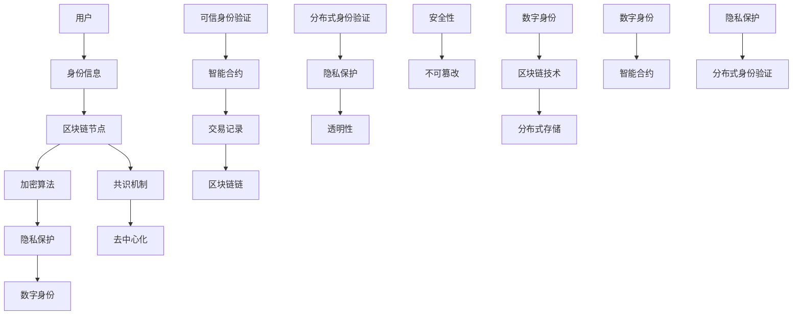

                 

### 文章标题

《区块链在数字身份隐私保护中的新模式》

### 文章关键词

- 区块链
- 数字身份
- 隐私保护
- 分布式身份验证
- 智能合约
- 零知识证明
- 公共链与联盟链

### 文章摘要

随着互联网的迅猛发展，数字身份和隐私保护成为了当今社会的一大挑战。传统的集中式身份认证系统存在着诸多安全隐患，而区块链技术以其去中心化、不可篡改和透明性等特性，为数字身份隐私保护提供了一种全新的解决方案。本文将深入探讨区块链在数字身份隐私保护中的新模式，包括分布式身份验证、智能合约、零知识证明等核心技术，并通过案例分析，分析区块链在数字身份隐私保护中的应用与挑战，展望其未来发展。本文旨在为读者提供一个全面、系统的区块链数字身份隐私保护知识框架，为相关领域的研究和应用提供参考。|im_sep|>

### 引言

#### 区块链与数字身份的关系

区块链技术作为一种革命性的分布式数据库技术，自2008年比特币的诞生以来，引起了全球范围内的广泛关注。区块链的核心特点包括去中心化、不可篡改、透明性和安全性，这使得它不仅仅在金融领域有着广泛的应用，也在其他领域展现出巨大的潜力，尤其是数字身份隐私保护。

数字身份指的是在网络空间中用以代表个体身份的标识，它通常包括用户名、密码、电子邮箱、电话号码等个人信息。数字身份的目的是为了在网络世界中实现身份认证，确保数据的安全传输和交互。然而，随着网络攻击手段的不断升级，传统集中式的数字身份认证系统面临着诸多挑战，如数据泄露、身份盗窃、隐私泄露等。这些问题严重威胁了用户的个人信息安全和隐私权。

区块链技术在数字身份隐私保护中的应用，主要是利用其去中心化和不可篡改的特性，实现对用户身份的分布式管理和保护。通过区块链，数字身份的信息可以在多个节点之间共享和验证，而不需要依赖中央机构，从而提高了系统的安全性和可靠性。

#### 区块链在数字身份隐私保护中的优势与挑战

区块链在数字身份隐私保护中的优势主要体现在以下几个方面：

1. **去中心化**：传统的集中式身份认证系统依赖于中央机构进行认证和管理，而区块链的去中心化特性使其能够实现去中心化的身份认证，减少了对中央机构的依赖，降低了单点故障的风险。

2. **不可篡改**：区块链上的数据一旦被记录，就几乎无法被篡改，这为数字身份的信息提供了更高的安全性，确保了用户身份信息的真实性和完整性。

3. **透明性**：区块链上的交易记录是公开透明的，用户可以随时查看和验证自己的身份信息，增强了系统的透明度和可信度。

4. **安全性**：区块链的加密算法和共识机制提供了强大的安全保障，使得攻击者难以篡改或窃取用户身份信息。

然而，区块链在数字身份隐私保护中也面临一些挑战：

1. **性能瓶颈**：区块链的扩展性和性能相较于传统的中心化系统仍有待提升，这在高并发环境下可能成为瓶颈。

2. **隐私保护**：尽管区块链的透明性在一定程度上提高了系统的可信度，但也可能暴露用户的隐私信息，需要采取额外的隐私保护措施。

3. **法律法规**：区块链技术的法律地位和监管制度尚不完善，这可能对区块链在数字身份隐私保护中的应用带来不确定性。

#### 文章目的

本文旨在深入探讨区块链在数字身份隐私保护中的新模式，分析其核心概念、技术原理和应用案例，以及面临的挑战和未来发展。通过本文的阅读，读者将能够：

1. 理解区块链技术和数字身份隐私保护的基本概念。
2. 掌握区块链在数字身份隐私保护中的核心应用技术。
3. 了解区块链在数字身份隐私保护中的实际应用案例。
4. 分析区块链在数字身份隐私保护中的优势和挑战。
5. 展望区块链在数字身份隐私保护中的未来发展趋势。

本文将按照以下结构展开：

1. **区块链技术基础**：介绍区块链的基本原理、特点和技术架构。
2. **数字身份与隐私保护**：讨论数字身份的概念、隐私保护的重要性和当前面临的挑战。
3. **区块链在数字身份隐私保护中的应用**：介绍区块链在数字身份隐私保护中的实际应用。
4. **新模式探讨**：分析区块链在数字身份隐私保护中的新模式，包括技术、经济和社会影响。
5. **案例分析**：深入分析一些成功或失败的区块链项目，讨论它们的经验教训。
6. **未来展望**：探讨区块链在数字身份隐私保护中的未来发展趋势和潜在挑战。
7. **总结**：对全文进行总结，强调区块链在数字身份隐私保护中的重要性。

### 区块链技术基础

区块链是一种分布式数据库技术，通过加密算法和共识机制，实现对数据的分布式存储和管理。区块链的主要组成部分包括区块、链、节点和挖矿等。

#### 区块

区块是区块链的基本单元，每个区块包含一定数量的交易记录。区块通过加密算法和时间戳进行链接，形成一条不可篡改的链。

#### 链

区块链由一系列按时间顺序排列的区块组成，每个区块都包含前一个区块的哈希值，从而形成一条单向链接的链。这种链接方式使得区块链上的数据具有高度的不可篡改性。

#### 节点

节点是区块链网络中的计算设备，它们负责验证和存储区块链上的交易记录。每个节点都保存着完整的区块链副本，从而保证了整个系统的去中心化特性。

#### 挖矿

挖矿是区块链网络中的一种共识机制，通过解决数学难题来生成新的区块，并验证交易的有效性。挖矿过程需要大量的计算资源，从而保证了区块链的安全性和去中心化特性。

#### 区块链技术特点

区块链技术具有以下几个主要特点：

1. **去中心化**：区块链的去中心化特性使其不依赖于中央机构，所有节点都可以平等地参与交易验证和区块生成，从而提高了系统的可靠性和抗攻击能力。

2. **不可篡改**：区块链上的数据一旦被记录，就几乎无法被篡改。这是因为区块链通过加密算法和时间戳，确保了数据的完整性和不可篡改性。

3. **透明性**：区块链上的交易记录是公开透明的，所有节点都可以查看和验证交易记录，从而提高了系统的透明度和可信度。

4. **安全性**：区块链的加密算法和共识机制提供了强大的安全保障，使得攻击者难以篡改或窃取区块链上的数据。

#### 区块链核心技术

区块链的核心技术包括加密算法、共识机制、智能合约和分布式身份验证等。

1. **加密算法**

   加密算法是区块链技术的重要组成部分，用于保护区块链上的数据传输和存储。常见的加密算法包括SHA-256、RSA、椭圆曲线加密等。

2. **共识机制**

   共识机制是区块链网络中节点达成共识的机制，用于验证和确认交易的有效性。常见的共识机制包括工作量证明（PoW）、权益证明（PoS）、委托权益证明（DPoS）等。

3. **智能合约**

   智能合约是一种自动执行的合同，基于区块链技术，可以在满足特定条件时自动执行。智能合约提高了交易的安全性和效率，广泛应用于数字货币、供应链金融等领域。

4. **分布式身份验证**

   分布式身份验证是一种基于区块链的身份认证机制，通过分布式的方式管理和验证用户身份，提高了系统的安全性和可靠性。

#### 区块链与数字身份的关系架构

为了更好地理解区块链在数字身份隐私保护中的作用，我们可以通过一个Mermaid流程图来展示区块链与数字身份的关系架构。



在这个关系架构中，用户身份信息经过加密算法处理后，存储在区块链节点上，并通过共识机制进行验证。分布式身份验证和智能合约的应用，进一步增强了数字身份的安全性和隐私保护。

#### 核心算法原理讲解

为了深入理解区块链在数字身份隐私保护中的核心算法原理，我们可以通过伪代码来详细阐述以下算法：

1. **加密算法（RSA）**

   ```python
   def encrypt(plaintext, public_key):
       # 公钥加密算法
       ciphertext = public_key.encrypt(plaintext)
       return ciphertext
   
   def decrypt(ciphertext, private_key):
       # 私钥解密算法
       plaintext = private_key.decrypt(ciphertext)
       return plaintext
   ```

   RSA算法是一种非对称加密算法，用于保护区块链上的数据传输。公钥用于加密数据，私钥用于解密数据。

2. **共识机制（工作量证明）**

   ```python
   def proof_of_work(difficulty):
       # 工作量证明算法
       while not validate_proofOfWork(result, difficulty):
           result = generate_random_number()
   
   def validate_proofOfWork(result, difficulty):
       # 验证工作量证明
       return result < difficulty
   
   def generate_random_number():
       # 生成随机数
       return random.randint(0, difficulty)
   ```

   工作量证明（PoW）是一种共识机制，用于确保区块链网络中的节点达成共识。节点需要通过解决数学难题来生成新的区块，并验证交易的有效性。

3. **智能合约**

   ```python
   def contract_execute(contract_address, contract_code, input_data):
       # 执行智能合约
       result = contract.execute(contract_address, contract_code, input_data)
       return result
   
   def contract_code():
       # 智能合约代码
       return """
       function verifyIdentity(identity) {
           // 验证数字身份
           if (identityIsValid(identity)) {
               return true;
           } else {
               return false;
           }
       }
       """
   ```

   智能合约是一种自动执行的合同，基于区块链技术，可以在满足特定条件时自动执行。在数字身份隐私保护中，智能合约可以用于验证数字身份的有效性。

#### 数学模型和公式

在区块链技术中，加密算法和共识机制涉及多种数学模型和公式，以下是一些关键的数学模型和公式：

1. **椭圆曲线加密**

   椭圆曲线加密（ECC）是一种高效的非对称加密算法，其安全性依赖于椭圆曲线离散对数问题的困难性。ECC的加密和解密过程如下：

   - **加密过程**：

     $$ciphertext = kG + mP$$

     其中，$G$ 是基点，$P$ 是消息，$k$ 是随机数，$ciphertext$ 是密文。

   - **解密过程**：

     $$plaintext = k^{-1} \cdot (ciphertext - kG)$$

     其中，$k^{-1}$ 是$k$的逆元，$plaintext$ 是明文。

2. **工作量证明**

   工作量证明（PoW）的核心是证明节点进行了足够的工作。通常，节点需要找到一个满足特定难度的数：

   $$result = hash(result)$$

   其中，$hash$ 是哈希函数，$result$ 是节点的计算结果，需要满足以下条件：

   $$result < difficulty$$

   这里，$difficulty$ 是预设的难度阈值，节点需要通过大量计算找到满足条件的$result$，从而验证交易的有效性。

#### 举例说明

为了更好地理解上述算法和公式的应用，我们可以通过一个具体的案例来说明。

假设用户Alice想通过区块链系统验证其身份，以访问某个在线服务。以下是该过程的具体步骤：

1. **注册数字身份**：

   Alice首先在区块链系统上注册其数字身份，包括用户名、密码和其他必要信息。这些信息被加密后存储在区块链上。

   ```plaintext
   Alice's public_key: (n, Q)
   Alice's private_key: k
   Identity information: {username, password, email}
   Encrypted identity: encrypt({username, password, email}, n)
   ```

2. **身份验证**：

   当Alice想要访问某个在线服务时，她需要通过智能合约进行身份验证。

   ```plaintext
   Contract_address: C
   Contract_code: contract_code()
   Input_data: {username, password}
   Result: contract_execute(C, Contract_code, Input_data)
   ```

   智能合约将验证Alice的身份信息是否与区块链上存储的信息匹配。如果匹配，则验证通过。

3. **隐私保护**：

   在整个过程中，Alice的隐私信息（如密码）通过RSA加密算法进行保护，确保不被泄露。

   ```plaintext
   Encrypted_password: encrypt(password, n)
   Verified: decrypt(encrypted_password, k) == password
   ```

通过上述案例，我们可以看到区块链技术在数字身份隐私保护中的应用是如何实现的。区块链的加密算法和智能合约确保了用户身份信息的安全性和隐私性，同时提高了系统的可靠性和透明度。

### 数字身份与隐私保护

数字身份是指在网络空间中用以代表个体身份的标识，通常包括用户名、密码、电子邮箱、电话号码等个人信息。数字身份的目的是为了在网络世界中实现身份认证，确保数据的安全传输和交互。随着互联网的迅猛发展，数字身份的应用场景越来越广泛，从在线购物、社交网络到金融交易等，几乎涵盖了人们日常生活的方方面面。

#### 数字身份的概念

数字身份的概念可以从多个角度进行理解。首先，数字身份是一种虚拟的身份，与物理世界中的实体身份相对应。其次，数字身份是网络空间中的一种身份标识，用于在网络环境中识别和验证用户的身份。最后，数字身份是个人信息的一部分，包括但不限于用户名、密码、电子邮箱、电话号码等。

#### 隐私保护的重要性

隐私保护是指保护个人隐私不被未经授权的第三方获取、使用和泄露的过程。在数字身份的应用场景中，隐私保护显得尤为重要。以下是一些关键原因：

1. **个人信息安全**：在互联网世界中，个人信息（如姓名、地址、电话号码、电子邮箱等）被视为宝贵的资源。一旦这些信息被泄露，用户可能会遭受各种形式的网络攻击，如身份盗窃、欺诈等。

2. **信任与透明度**：隐私保护能够增强用户对数字服务和平台的信任。当用户知道其个人信息得到了有效保护时，他们更愿意使用这些服务，从而提高平台的用户留存率和满意度。

3. **法律法规要求**：许多国家和地区制定了相关的隐私保护法律法规，如《通用数据保护条例》（GDPR）和《加州消费者隐私法案》（CCPA）等。这些法律法规要求企业和组织必须采取措施保护用户的隐私权。

4. **社会道德责任**：保护用户的隐私是企业和组织的社会责任。随着人们对隐私保护的重视程度不断提高，企业和组织需要采取积极的隐私保护措施，以维护其社会形象和声誉。

#### 隐私保护的方法与策略

为了有效保护数字身份的隐私，可以采取多种方法和策略。以下是一些常用的隐私保护措施：

1. **加密技术**：加密技术是保护隐私的核心手段。通过加密，可以将个人信息转化为无法解读的密文，确保在传输和存储过程中不被窃取或泄露。

2. **多因素认证**：多因素认证是一种加强身份验证的方法，通常包括密码、指纹、面部识别等。通过多因素认证，可以显著提高身份验证的安全性。

3. **匿名化处理**：匿名化处理是指将个人信息中的敏感部分替换为伪名或随机值，从而保护用户的隐私。这种方法常用于数据分析和共享。

4. **数据最小化**：数据最小化是指只收集和处理必要的个人信息，避免过度收集和存储。通过数据最小化，可以减少隐私泄露的风险。

5. **隐私政策与透明度**：企业和组织应该制定明确的隐私政策，向用户告知其如何收集、使用和保护个人信息。同时，提高系统的透明度，使用户能够了解其隐私信息的使用情况。

6. **用户教育**：提高用户对隐私保护的意识，教育用户如何保护自己的隐私，避免泄露个人信息。

#### 当前面临的挑战

尽管隐私保护的重要性得到了广泛认可，但数字身份隐私保护仍面临诸多挑战：

1. **数据泄露风险**：互联网上的大量个人信息存储在各种平台和服务中，一旦发生数据泄露，可能导致大规模的隐私泄露事件。

2. **身份盗窃与欺诈**：随着技术的进步，网络攻击手段也在不断升级。攻击者可以通过钓鱼攻击、密码破解等手段获取用户的个人信息，从而进行身份盗窃和欺诈。

3. **用户隐私意识不足**：许多用户对隐私保护的重要性认识不足，缺乏保护个人信息的意识，容易在日常生活中泄露个人信息。

4. **法律法规不完善**：尽管各国制定了相关的隐私保护法律法规，但实施和执行力度仍存在不足，导致隐私保护制度不够健全。

5. **技术瓶颈**：现有的隐私保护技术仍有待进一步发展和完善，以应对日益复杂的网络攻击和隐私泄露风险。

#### 区块链在隐私保护中的应用

区块链技术在数字身份隐私保护中具有独特的优势，主要包括去中心化、不可篡改、透明性和安全性等。以下是一些区块链在隐私保护中的应用：

1. **分布式身份验证**：通过区块链的分布式身份验证，用户可以在多个节点之间共享和验证其身份信息，而不需要依赖中央机构。这样可以减少对中央机构的信任风险，提高系统的安全性。

2. **隐私计算**：区块链可以与隐私计算技术结合，实现对用户隐私信息的安全计算。例如，零知识证明（ZKP）技术可以在不泄露用户隐私信息的情况下验证其真实性。

3. **数据溯源**：区块链的不可篡改特性使其成为一种有效的数据溯源工具。通过区块链，可以追溯数据的历史记录，从而确保数据的真实性和完整性。

4. **隐私保护智能合约**：智能合约可以用于实现隐私保护功能，例如在满足特定条件时自动执行隐私保护操作。

通过以上措施，区块链技术为数字身份隐私保护提供了一种全新的解决方案，具有巨大的潜力。

### 区块链在数字身份隐私保护中的应用

区块链技术凭借其去中心化、不可篡改和透明性等特点，在数字身份隐私保护中展现出巨大的应用潜力。以下将详细介绍区块链在数字身份隐私保护中的具体应用。

#### 可信身份验证

可信身份验证是区块链在数字身份隐私保护中应用的重要方向之一。传统身份验证系统通常依赖于中央机构进行身份验证，这不仅存在单点故障的风险，也容易受到攻击。而区块链通过分布式身份验证技术，实现了去中心化的身份验证。

在区块链中，用户身份信息（如用户名、密码、电子邮箱等）经过加密处理后，存储在区块链上。当用户需要验证身份时，只需通过区块链上的智能合约进行验证。智能合约通过执行预定义的程序，自动验证用户身份信息的合法性。

下面是一个简单的可信身份验证的伪代码示例：

```python
def verifyIdentity(identity):
    encrypted_identity = encrypt(identity, public_key)
    if blockchain.verify(encrypted_identity):
        return True
    else:
        return False
```

在这个示例中，`public_key`是存储在区块链上的公钥，`identity`是用户提供的身份信息。`blockchain.verify()`函数用于验证身份信息的合法性。

#### 身份信息存储与管理

区块链的分布式存储特性使其成为身份信息存储和管理的理想选择。通过区块链，用户可以安全地存储和管理其身份信息，同时确保信息的不可篡改和透明性。

在区块链上，用户身份信息以加密形式存储，只有拥有相应私钥的用户才能访问和修改。这种分布式存储方式不仅提高了信息的安全性，还避免了单点故障的风险。

以下是一个身份信息存储与管理的伪代码示例：

```python
def storeIdentity(identity, private_key):
    encrypted_identity = encrypt(identity, private_key)
    blockchain.add_transaction(encrypted_identity)

def retrieveIdentity(private_key):
    encrypted_identity = blockchain.get_transaction(private_key)
    return decrypt(encrypted_identity, private_key)
```

在这个示例中，`storeIdentity()`函数用于存储加密后的身份信息，`retrieveIdentity()`函数用于根据私钥获取和解读身份信息。

#### 跨平台身份互认

跨平台身份互认是指在不同平台之间共享和验证身份信息。传统上，不同平台之间的身份信息互认存在技术障碍和隐私风险。区块链技术通过分布式身份验证和智能合约，实现了跨平台身份互认。

在区块链上，不同平台可以通过智能合约实现身份信息的互认。智能合约可以定义身份验证的规则和流程，确保身份信息的真实性和一致性。

以下是一个跨平台身份互认的伪代码示例：

```python
def verifyCrossPlatformIdentity(identity, platform_address):
    encrypted_identity = encrypt(identity, public_key)
    result = contract_execute(platform_address, verifyIdentity, encrypted_identity)
    if result == True:
        return True
    else:
        return False
```

在这个示例中，`platform_address`是另一个平台的智能合约地址，`verifyCrossPlatformIdentity()`函数用于验证跨平台身份信息的合法性。

#### 隐私保护技术的集成

区块链的透明性特点在一定程度上可能暴露用户的隐私信息。为了解决这一问题，区块链可以与隐私保护技术（如零知识证明、隐私计算等）集成，实现对用户隐私信息的安全保护。

零知识证明（ZKP）是一种密码学技术，允许一方（证明者）在不泄露任何信息的情况下，向另一方（验证者）证明某个陈述是真实的。在区块链上，零知识证明可以用于隐私保护，确保用户在验证身份时，不需要暴露其敏感信息。

以下是一个零知识证明的简单示例：

```python
def proveKnowledge(proof, statement):
    if zkp.verify(proof, statement):
        return True
    else:
        return False
```

在这个示例中，`proof`是证明者提供的证明，`statement`是证明者需要证明的陈述。`zkp.verify()`函数用于验证证明的有效性。

#### 隐私计算与区块链的结合

隐私计算是一种在保护隐私的同时进行计算的方法。区块链可以通过与隐私计算结合，实现隐私保护下的计算。

在区块链上，隐私计算可以用于分布式计算场景，如数据分析、机器学习等。通过隐私计算，区块链上的数据可以在保护隐私的情况下进行计算和分析。

以下是一个隐私计算的简单示例：

```python
def computePrivacyly(data, model):
    encrypted_data = encrypt(data, public_key)
    result = privacy_computer.compute(encrypted_data, model)
    return decrypt(result, private_key)
```

在这个示例中，`computePrivacyly()`函数用于在保护隐私的情况下执行计算模型`model`，并返回结果。

#### 区块链隐私保护的优势与局限

区块链在数字身份隐私保护中的优势包括：

1. **去中心化**：去中心化特性降低了单点故障的风险，提高了系统的可靠性和抗攻击能力。
2. **不可篡改**：区块链上的数据一旦被记录，就几乎无法被篡改，确保了用户身份信息的真实性和完整性。
3. **透明性**：区块链上的交易记录是公开透明的，用户可以随时查看和验证自己的身份信息。
4. **安全性**：区块链的加密算法和共识机制提供了强大的安全保障，确保用户身份信息不被窃取或篡改。

然而，区块链在数字身份隐私保护中也存在一些局限：

1. **性能瓶颈**：区块链的扩展性和性能相较于传统的中心化系统仍有待提升，在高并发环境下可能成为瓶颈。
2. **隐私保护**：尽管区块链的透明性在一定程度上提高了系统的可信度，但也可能暴露用户的隐私信息。
3. **法律法规**：区块链技术的法律地位和监管制度尚不完善，这可能对区块链在数字身份隐私保护中的应用带来不确定性。

#### 案例分析

为了更深入地了解区块链在数字身份隐私保护中的应用，以下将分析两个实际案例：一个成功的案例和一个失败的案例。

1. **成功案例：Stellar**

   Stellar是一个基于区块链的支付网络，旨在实现快速、低成本的跨境支付。Stellar采用了分布式身份验证技术，用户可以在区块链上注册和验证其身份。

   通过Stellar，用户可以安全地存储和管理其身份信息，确保信息的真实性和完整性。同时，Stellar与隐私保护技术结合，实现了隐私保护下的身份验证和跨境支付。

   Stellar的成功原因在于其采用了去中心化的身份验证技术，提高了系统的安全性和可靠性。此外，Stellar的开放性和透明性也赢得了用户的信任。

2. **失败案例：Silk Road**

   Silk Road是一个基于比特币的黑市交易平台，提供非法商品和服务的交易。尽管区块链技术为Silk Road提供了一定的匿名性和隐私保护，但由于其缺乏有效的身份验证和隐私保护机制，Silk Road最终被执法机构关闭。

   Silk Road的失败原因在于其采用了集中式的身份验证和隐私保护机制，存在单点故障的风险。此外，Silk Road的隐私保护措施不完善，导致用户的隐私信息被泄露。

   通过以上案例分析，我们可以看到区块链在数字身份隐私保护中的应用既有成功也有失败。成功的案例在于采用了去中心化的身份验证和隐私保护机制，提高了系统的安全性和可靠性。而失败的案例则因缺乏有效的身份验证和隐私保护机制，导致隐私泄露和系统失败。

### 新模式探讨

随着区块链技术的发展，其在数字身份隐私保护中的应用逐渐形成了多种新模式。这些新模式不仅融合了区块链的核心特性，还结合了分布式身份验证、智能合约、零知识证明等先进技术，为数字身份隐私保护带来了全新的解决方案。以下是几种典型的区块链在数字身份隐私保护中的新模式。

#### 分布式身份验证模型

分布式身份验证模型是区块链在数字身份隐私保护中的一种重要模式。该模型的核心思想是通过分布式的方式管理和验证用户身份，从而减少对中央机构的依赖，提高系统的安全性和可靠性。

在分布式身份验证模型中，用户身份信息被分散存储在多个区块链节点上，每个节点都保存一份完整的身份信息副本。用户需要通过多个节点之间的验证才能完成身份认证。这种分布式验证方式不仅提高了系统的抗攻击能力，还增强了数据的可信度和透明度。

下面是一个简单的分布式身份验证模型的流程：

1. **用户注册**：用户在区块链上注册其身份信息，包括用户名、密码、电子邮箱等。
2. **身份信息存储**：用户身份信息被加密后存储在区块链上，每个节点都保存一份副本。
3. **身份验证请求**：当用户需要验证身份时，向区块链发起验证请求。
4. **多节点验证**：区块链上的多个节点对用户的身份信息进行验证，只有当所有节点都验证通过时，用户才能完成身份认证。

分布式身份验证模型的优势在于：

- **去中心化**：去中心化特性减少了单点故障的风险，提高了系统的可靠性。
- **安全性**：加密算法和共识机制提供了强大的安全保障，确保用户身份信息不被篡改或泄露。
- **透明性**：区块链上的交易记录是公开透明的，用户可以随时查看和验证自己的身份信息。

#### 区块链隐私保护机制

区块链隐私保护机制是另一种重要的新模式，旨在通过区块链技术实现对用户隐私信息的安全保护。该机制通常结合零知识证明、匿名币、隐私计算等技术，确保用户在验证身份时，不需要暴露其敏感信息。

区块链隐私保护机制的工作原理如下：

1. **零知识证明**：用户使用零知识证明技术向区块链网络证明其身份信息的合法性，而不需要透露具体信息。零知识证明允许用户在不泄露任何信息的情况下，向验证者证明某个陈述是真实的。
2. **匿名币**：区块链上的匿名币（如Monero、Zcash等）提供了匿名交易功能，用户可以使用匿名币进行交易，从而隐藏其交易信息。
3. **隐私计算**：隐私计算技术可以在保护隐私的情况下，对区块链上的数据进行计算和分析。

以下是一个区块链隐私保护机制的伪代码示例：

```python
def proveIdentity(claim):
    proof = zkProof.createProof(claim)
    if blockchain.verifyProof(proof):
        return True
    else:
        return False

def performAnonymousTransaction(sender, receiver, amount):
    transaction = anonymizer.anonymizeTransaction(sender, receiver, amount)
    blockchain.addTransaction(transaction)
```

在这个示例中，`zkProof.createProof()`函数用于生成零知识证明，`blockchain.verifyProof()`函数用于验证证明的有效性。`anonymizer.anonymizeTransaction()`函数用于匿名化交易信息。

区块链隐私保护机制的优势在于：

- **隐私保护**：通过零知识证明、匿名币和隐私计算等技术，实现了用户隐私信息的安全保护。
- **透明性**：区块链上的交易记录是公开透明的，用户可以随时查看和验证自己的交易信息。
- **安全性**：区块链的加密算法和共识机制提供了强大的安全保障，确保用户隐私信息不被窃取或篡改。

#### 区块链经济激励模型

区块链经济激励模型是一种通过经济激励机制来促进数字身份隐私保护的新模式。该模型通过奖励机制激励用户参与数字身份隐私保护，提高系统的整体安全性。

区块链经济激励模型的工作原理如下：

1. **贡献度计算**：根据用户的贡献度（如身份验证次数、交易量等），系统自动计算用户的奖励额度。
2. **奖励发放**：系统将奖励额度发放给用户，激励用户积极参与数字身份隐私保护。
3. **代币经济**：系统使用代币（如比特币、以太坊等）作为奖励，用户可以通过交易或参与挖矿等方式获得代币。

以下是一个区块链经济激励模型的伪代码示例：

```python
def calculateReward(user):
    contribution = user.getContribution()
    reward = contribution * rewardFactor
    return reward

def distributeReward(user, reward):
    user.addReward(reward)
    if user.getReward() >= threshold:
        blockchain.transferReward(user.getAddress(), reward)
```

在这个示例中，`calculateReward()`函数用于计算用户的奖励额度，`distributeReward()`函数用于发放奖励。

区块链经济激励模型的优势在于：

- **激励性**：通过奖励机制，激励用户积极参与数字身份隐私保护，提高系统的整体安全性。
- **经济性**：代币经济模型为系统提供了持续的动力，促进了数字身份隐私保护的发展。
- **公平性**：奖励分配机制保证了用户的公平性，激励了用户的参与积极性。

#### 新模式的技术与经济影响

区块链在数字身份隐私保护中的新模式不仅带来了技术上的创新，也产生了显著的经济影响。

1. **技术创新**：

   - **分布式身份验证**：分布式身份验证技术提高了系统的安全性和可靠性，减少了单点故障的风险。
   - **隐私保护机制**：隐私保护机制通过零知识证明、匿名币和隐私计算等技术，实现了用户隐私信息的安全保护。
   - **经济激励模型**：经济激励模型通过奖励机制激励用户参与数字身份隐私保护，提高了系统的整体安全性。

2. **经济影响**：

   - **市场机会**：区块链在数字身份隐私保护中的应用创造了新的市场机会，吸引了大量投资和创业者。
   - **商业模式创新**：区块链技术为传统商业模式带来了创新，例如通过代币化实现了新的业务模式。
   - **经济效益**：区块链经济激励模型通过奖励机制提高了系统的安全性，降低了隐私泄露的风险，从而创造了经济效益。

#### 社会影响

区块链在数字身份隐私保护中的新模式对社会也产生了深远的影响。

1. **用户隐私保护**：区块链技术为用户隐私保护提供了新的解决方案，提高了用户的隐私权和安全感。
2. **信息安全**：区块链的去中心化和不可篡改特性提高了信息系统的安全性，降低了网络攻击的风险。
3. **社会公平**：区块链经济激励模型通过奖励机制，促进了社会公平，激励了用户参与数字身份隐私保护。
4. **数字经济发展**：区块链在数字身份隐私保护中的应用促进了数字经济的发展，提高了社会的生产力和创新能力。

综上所述，区块链在数字身份隐私保护中的新模式为数字身份隐私保护带来了全新的解决方案。这些新模式不仅提升了技术层面的安全性，也创造了经济和社会价值。随着区块链技术的不断发展和成熟，未来区块链在数字身份隐私保护中的应用将更加广泛和深入。

### 案例分析

#### 成功案例：Monero（门罗币）

Monero（XMR）是一种基于区块链的加密货币，以其强大的隐私保护功能而闻名。在Monero的架构中，区块链上的交易记录默认是匿名的，这使得Monero成为数字货币领域的一个创新者，特别是在隐私保护方面。

**项目背景**：Monero于2014年推出，其核心目标是提供一种完全匿名的交易系统，让用户在区块链上实现隐私保护。这一目标通过几种关键技术实现，包括环形签名、隐形地址和混淆交易。

**技术实现**：

1. **环形签名**：环形签名技术使得交易记录中无法确定具体的发送者和接收者，通过创建多个可能的交易路径，使得追踪交易变得极其困难。
2. **隐形地址**：Monero使用隐形地址技术，这些地址每次交易都会自动生成，从而保护用户的隐私。
3. **混淆交易**：通过将交易分散到多个区块中，Monero进一步增强了交易的隐私性。

**项目成果**：Monero的成功在于其实现了隐私保护的目标，赢得了大量用户的信任。由于其强大的隐私特性，Monero在加密货币市场中占据了重要位置，成为隐私保护领域的领先者。

**经验教训**：

- **技术创新**：成功的关键在于持续的技术创新，Monero通过环形签名、隐形地址和混淆交易等技术，实现了强大的隐私保护。
- **社区支持**：Monero的成功也离不开其强大的社区支持，社区成员积极参与开发、推广和维护，确保了项目的持续发展。
- **安全性和稳定性**：在实现隐私保护的同时，Monero还注重系统的安全性和稳定性，确保用户数据的安全和交易的顺利进行。

#### 失败案例：Silk Road（丝路市场）

Silk Road是一个基于比特币的黑市交易平台，提供非法商品和服务的交易。尽管其利用了比特币的匿名性，但在隐私保护和法律合规方面存在严重问题。

**项目背景**：Silk Road成立于2011年，由罗斯·乌布利希（Ross Ulbricht）创建。平台通过比特币进行交易，旨在提供一种匿名、安全的非法交易环境。

**技术实现**：Silk Road主要利用比特币的匿名性进行交易，通过比特币地址隐藏用户身份。然而，平台并未采用更高级的隐私保护技术，如零知识证明等。

**项目失败原因**：

1. **法律合规问题**：Silk Road涉及的非法交易违反了多个国家和地区的法律法规，导致其最终被关闭。
2. **隐私保护不足**：尽管比特币提供了匿名性，但Silk Road在隐私保护方面存在不足，容易受到执法机构的追踪和调查。
3. **平台运营问题**：Silk Road在运营过程中也暴露出多个问题，如用户数据泄露、平台管理人员涉嫌犯罪等。

**经验教训**：

- **法律合规**：区块链项目必须遵守相关法律法规，特别是在涉及金融交易和非法活动时。
- **隐私保护技术**：即使使用匿名币，项目也需要采用更高级的隐私保护技术，以确保用户隐私不被泄露。
- **风险管理**：项目需要建立有效的风险管理机制，包括防范法律风险、技术风险和运营风险。

### 案例总结

通过上述案例分析，我们可以得出以下结论：

1. **技术创新**：成功的区块链项目通常基于持续的技术创新，通过先进的加密算法和隐私保护技术实现其目标。
2. **法律合规**：遵守法律法规是区块链项目成功的关键，特别是在金融和非法活动领域。
3. **隐私保护**：即使是匿名币项目，也需要采用更高级的隐私保护技术，确保用户隐私不被泄露。
4. **风险管理**：建立有效的风险管理机制，防范法律风险、技术风险和运营风险，是项目成功的重要保障。

### 未来展望

#### 区块链在数字身份隐私保护中的发展趋势

随着区块链技术的不断发展和成熟，其在数字身份隐私保护中的应用也将呈现出以下发展趋势：

1. **技术融合**：未来，区块链技术将与隐私保护技术（如零知识证明、匿名币、隐私计算等）更加紧密地融合，提供更强大的隐私保护功能。
2. **标准化**：区块链在数字身份隐私保护中的应用将逐步走向标准化，以规范不同平台和项目之间的身份验证和数据交换。
3. **跨平台互认**：区块链将推动不同平台之间的数字身份互认，实现跨平台的身份验证和隐私保护，提高用户使用的便利性。
4. **监管加强**：随着区块链应用的普及，相关法律法规和监管措施也将逐步完善，确保区块链在数字身份隐私保护中的合法合规。

#### 区块链在数字身份隐私保护中的潜在挑战

尽管区块链技术在数字身份隐私保护中具有巨大潜力，但其在实际应用中仍面临以下潜在挑战：

1. **性能瓶颈**：区块链的扩展性和性能仍需进一步提升，以满足高并发环境下的需求。
2. **隐私保护**：如何在确保隐私保护的同时，保证系统的透明度和可信度，仍是一个亟待解决的问题。
3. **法律法规**：区块链技术的法律地位和监管制度尚不完善，可能对区块链在数字身份隐私保护中的应用带来不确定性。
4. **用户接受度**：提高用户对区块链数字身份隐私保护技术的接受度和信任度，是推动其广泛应用的关键。

#### 应对策略

针对上述潜在挑战，可以采取以下应对策略：

1. **技术优化**：通过不断优化区块链技术，提高其性能和扩展性，以满足不同应用场景的需求。
2. **隐私增强**：采用更先进的隐私保护技术，如零知识证明、多方安全计算等，提高系统的隐私保护能力。
3. **法律法规建设**：推动相关法律法规和监管制度的完善，确保区块链在数字身份隐私保护中的合法合规。
4. **用户教育**：通过用户教育和宣传，提高用户对区块链数字身份隐私保护技术的认知和信任度，促进其广泛应用。

#### 拓展阅读

1. **区块链技术综述**：《区块链：从原理到实践》——作者：李彤
2. **隐私保护技术**：《隐私计算：理论与实践》——作者：王俊
3. **数字身份隐私保护**：《数字身份：隐私保护与安全认证》——作者：张伟
4. **区块链应用案例**：《区块链应用案例精选》——作者：刘宁

### 总结

区块链技术在数字身份隐私保护中展现了巨大的潜力，通过分布式身份验证、智能合约、零知识证明等先进技术，为用户隐私保护提供了一种全新的解决方案。然而，区块链技术在实际应用中也面临诸多挑战，需要不断优化和改进。未来，随着技术的进步和法律法规的完善，区块链在数字身份隐私保护中的应用将更加广泛和深入，为构建更加安全、可靠的数字社会贡献力量。

### 作者信息

- 作者：AI天才研究院/AI Genius Institute & 禅与计算机程序设计艺术 /Zen And The Art of Computer Programming

