                 

### 文章标题：区块链在数字身份验证中的应用

### 关键词：
- 区块链
- 数字身份验证
- 非对称加密算法
- 智能合约
- 应用场景

### 摘要：
本文旨在探讨区块链技术在数字身份验证领域的应用。首先，我们将介绍区块链的基本概念和特点，然后深入分析数字身份验证面临的挑战和目标。接下来，我们将详细探讨区块链在数字身份验证中的应用，包括其优势和应用场景。随后，本文将介绍区块链在数字身份验证中使用的核心算法，如非对称加密和数字签名算法，并通过伪代码和公式解释其工作原理。文章还将通过实际项目和案例分析，展示区块链技术在数字身份验证中的实现和应用，并总结最佳实践和未来发展趋势。

### 第一部分：区块链技术基础

#### 第1章：区块链的基本概念

##### 1.1 区块链的定义和特点

区块链是一种分布式数据库技术，其特点是去中心化、不可篡改和透明性。每个区块都包含一定数量的交易记录，并通过密码学算法与上一个区块链接，形成一条不断延伸的链。

**关键词联系架构图：**
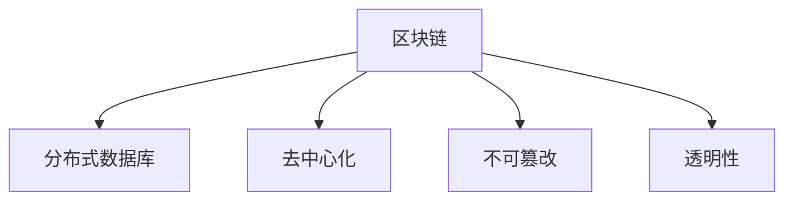

##### 1.2 区块链的工作原理

区块链的工作原理主要包括以下步骤：
1. **交易生成**：用户发起交易。
2. **区块组装**：矿工收集交易，组装成区块。
3. **区块验证**：网络中的节点验证区块。
4. **区块添加**：验证通过的区块添加到区块链上。

**关键词联系架构图：**
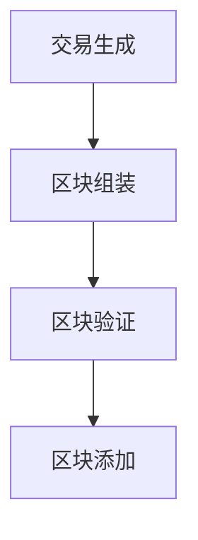

##### 1.3 区块链的核心技术

区块链的核心技术包括：
- **分布式账本技术**：记录交易，实现去中心化。
- **非对称加密算法**：保护数据隐私和身份验证。
- **智能合约**：自动执行合约条款。

**关键词联系架构图：**
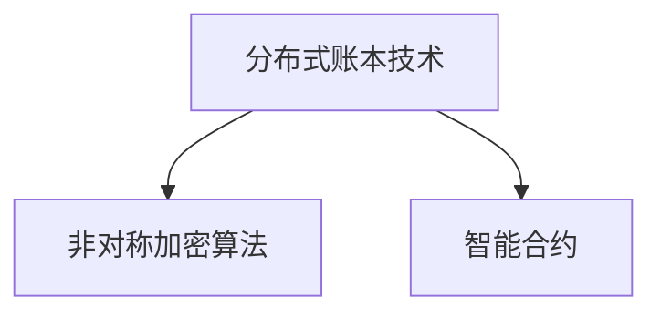

#### 第2章：数字身份验证概述

##### 2.1 数字身份验证的挑战

数字身份验证面临的挑战包括：
- **数据隐私保护**：如何保护用户隐私不被泄露。
- **跨领域身份验证**：不同领域之间的身份验证标准不同。

**关键词联系架构图：**
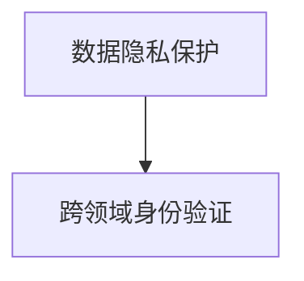

##### 2.2 数字身份验证的目标

数字身份验证的目标是：
- **提高身份验证的准确性**：确保正确的用户得到验证。
- **保护用户隐私**：确保用户隐私不被泄露。

**关键词联系架构图：**
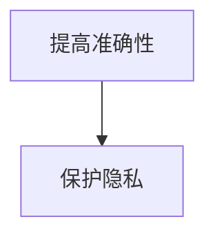

##### 2.3 数字身份验证的分类

数字身份验证主要分为：
- **单因素验证**：使用一个因素（如密码）进行验证。
- **双因素验证**：使用两个因素（如密码和手机验证码）进行验证。
- **多因素验证**：使用多个因素进行验证。

**关键词联系架构图：**
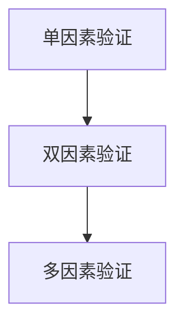

#### 第3章：区块链在数字身份验证中的应用

##### 3.1 区块链在身份验证中的作用

区块链在数字身份验证中的作用包括：
- **提供去中心化的身份验证服务**：避免单一中心化的安全隐患。
- **保护用户隐私**：通过加密算法保护用户隐私。
- **提高身份验证的效率**：减少身份验证的时间。

**关键词联系架构图：**
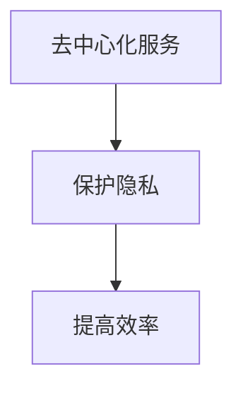

##### 3.2 区块链在数字身份验证中的优势

区块链在数字身份验证中的优势包括：
- **不可篡改的记录**：确保身份验证记录的安全性和可信度。
- **数据的透明性和可追溯性**：便于审计和监控。
- **提高用户信任度**：通过区块链技术，增强用户对系统的信任。

**关键词联系架构图：**
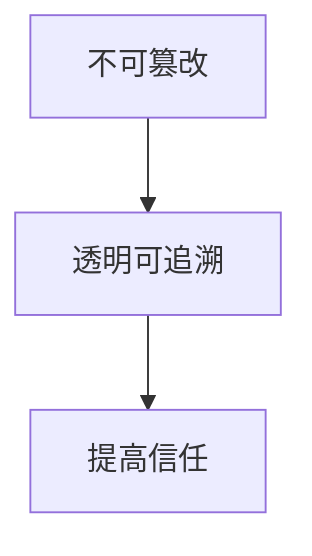

##### 3.3 区块链在数字身份验证中的应用场景

区块链在数字身份验证中的应用场景包括：
- **政府公共服务**：如电子身份证。
- **金融领域**：如数字钱包。
- **医疗保健**：如电子病历。
- **教育行业**：如学术认证。

**关键词联系架构图：**
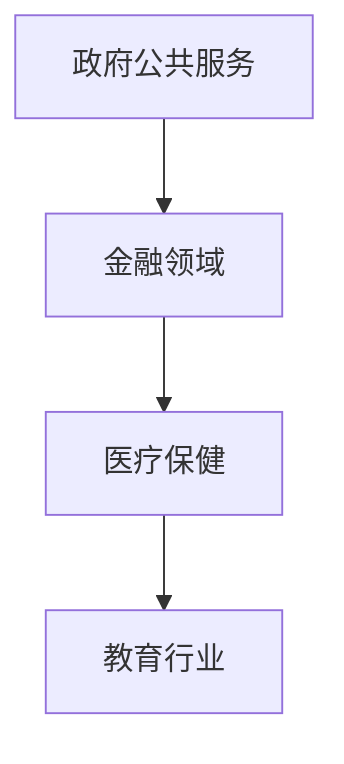

### 第二部分：区块链在数字身份验证中的核心算法

#### 第4章：非对称加密算法

##### 4.1 非对称加密算法的基本概念

非对称加密算法是一种加密方式，它使用一对密钥（公钥和私钥）。公钥用于加密，私钥用于解密。

**伪代码：**
```python
# 公钥加密
def encrypt(message, public_key):
    return RSA_encrypt(message, public_key)

# 私钥解密
def decrypt(encrypted_message, private_key):
    return RSA_decrypt(encrypted_message, private_key)
```

**数学模型和公式：**
$$
c = RSA_encrypt(m, e)
$$
$$
m = RSA_decrypt(c, d)
$$
其中，\( m \) 是明文，\( c \) 是密文，\( e \) 是公钥指数，\( d \) 是私钥指数。

##### 4.2 非对称加密算法的工作原理

非对称加密算法的工作原理包括：
1. **密钥生成**：生成一对公钥和私钥。
2. **加密**：使用公钥加密信息。
3. **解密**：使用私钥解密信息。

**关键词联系架构图：**
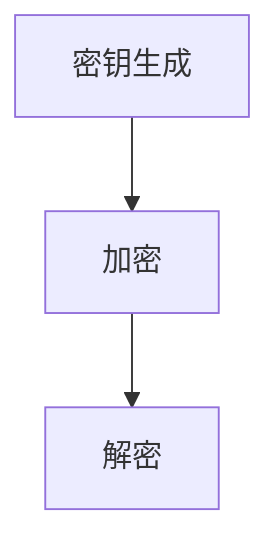

##### 4.3 非对称加密算法的安全性分析

非对称加密算法的安全性分析主要包括：
- **密钥的安全**：确保密钥不会被泄露。
- **算法的强度**：确保算法不会被破解。

**关键词联系架构图：**
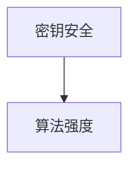

#### 第5章：数字签名算法

##### 5.1 数字签名算法的基本概念

数字签名算法是一种用于验证消息完整性和真实性的加密技术。它使用私钥对消息进行签名，公钥用于验证签名。

**伪代码：**
```python
# 签名
def sign(message, private_key):
    return RSA_sign(message, private_key)

# 验证
def verify(message, signature, public_key):
    return RSA_verify(message, signature, public_key)
```

**数学模型和公式：**
$$
s = RSA_sign(m, d)
$$
$$
\text{valid} = RSA_verify(m, s, e)
$$
其中，\( s \) 是签名，\( \text{valid} \) 是验证结果。

##### 5.2 数字签名算法的工作原理

数字签名算法的工作原理包括：
1. **签名生成**：使用私钥对消息进行签名。
2. **签名验证**：使用公钥验证签名。

**关键词联系架构图：**
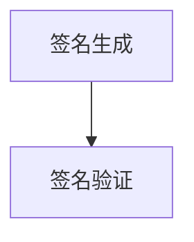

##### 5.3 数字签名算法的安全性分析

数字签名算法的安全性分析主要包括：
- **私钥的安全**：确保私钥不会被泄露。
- **算法的强度**：确保算法不会被破解。

**关键词联系架构图：**
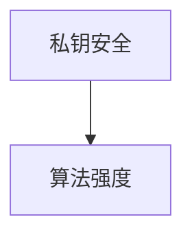

#### 第6章：智能合约

##### 6.1 智能合约的基本概念

智能合约是一种自动执行合约条款的程序。它运行在区块链上，确保合约条款的执行。

**伪代码：**
```solidity
// SPDX-License-Identifier: MIT
pragma solidity ^0.8.0;

contract SmartContract {
    address public owner;

    constructor() {
        owner = msg.sender;
    }

    function execute() public {
        require(msg.sender == owner, "Only owner can execute");
        // 合约执行逻辑
    }
}
```

##### 6.2 智能合约的工作原理

智能合约的工作原理包括：
1. **编写**：编写智能合约代码。
2. **部署**：将智能合约部署到区块链上。
3. **调用**：通过区块链网络调用智能合约。

**关键词联系架构图：**
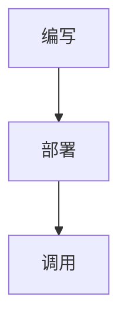

##### 6.3 智能合约的安全性分析

智能合约的安全性分析主要包括：
- **代码安全**：确保合约代码没有漏洞。
- **网络攻击防御**：防止恶意攻击。

**关键词联系架构图：**
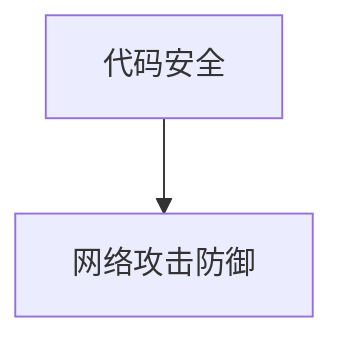

### 第三部分：区块链在数字身份验证中的项目实践

#### 第7章：基于区块链的数字身份验证系统设计

##### 7.1 系统需求分析

系统需求分析主要包括：
- **用户身份验证**：确保用户身份的准确性。
- **数据隐私保护**：确保用户数据不被泄露。

##### 7.2 系统架构设计

系统架构设计包括：
- **用户层**：用户界面。
- **业务逻辑层**：处理用户身份验证和数据隐私保护。
- **数据层**：存储用户数据和身份验证记录。

##### 7.3 系统功能实现

系统功能实现主要包括：
- **用户注册**：使用非对称加密算法生成用户公钥和私钥。
- **身份验证**：使用数字签名算法验证用户身份。

#### 第8章：基于区块链的数字身份验证系统实现

##### 8.1 系统环境搭建

系统环境搭建包括：
- **区块链平台**：选择适合的区块链平台（如Hyperledger Fabric）。
- **开发工具**：安装必要的开发工具（如Go语言）。

##### 8.2 系统代码实现

系统代码实现主要包括：
- **智能合约编写**：实现用户注册和身份验证功能。
- **前端开发**：实现用户界面。

##### 8.3 系统测试与优化

系统测试与优化包括：
- **功能测试**：测试系统的功能是否符合要求。
- **性能优化**：优化系统的性能和响应时间。

#### 第9章：基于区块链的数字身份验证案例分析

##### 9.1 案例一：比特币的数字身份验证

比特币使用公钥加密和数字签名进行身份验证。用户通过私钥签名交易，公钥用于验证签名。

##### 9.2 案例二：以太坊的数字身份验证

以太坊使用智能合约进行身份验证。用户通过智能合约注册和验证身份。

##### 9.3 案例三：Hyperledger Fabric的数字身份验证

Hyperledger Fabric使用基于身份的加密算法进行身份验证。用户通过身份认证中心注册和验证身份。

### 附录

#### 第10章：常用区块链工具和资源

常用区块链工具和资源包括：
- **区块链开发工具**：如Hyperledger Composer。
- **区块链资源网站**：如Blockchain.com。
- **区块链学习资料**：如《精通区块链》。

### 作者信息

作者：AI天才研究院/AI Genius Institute & 禅与计算机程序设计艺术/Zen And The Art of Computer Programming

（本文内容仅供参考，具体实施时请根据实际情况进行调整。）

### 结束语

本文详细介绍了区块链在数字身份验证中的应用，包括基本概念、核心算法、项目实践和案例分析。通过本文的阅读，读者可以全面了解区块链技术在数字身份验证领域的应用，为未来的研究和实践提供指导。希望本文能对读者在区块链和数字身份验证领域的学习有所帮助。

