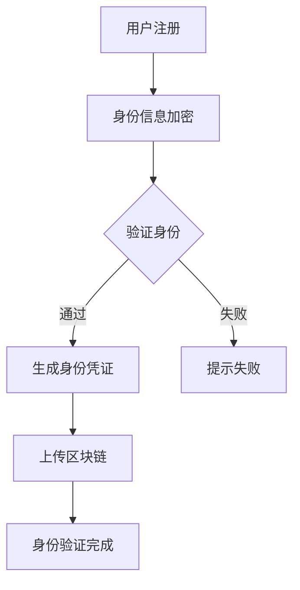

                 


### 1. 确定文章核心主题

《区块链在数字身份验证中的应用：简化跨平台身份认证》的核心主题在于探讨区块链技术如何被应用于数字身份验证，从而简化跨平台身份认证的过程。数字身份验证是当前网络安全领域的关键技术，而区块链作为一种分布式账本技术，具有高安全性、不可篡改性和透明性等特点，能够有效提升数字身份验证的效率和安全水平。本文将围绕这一核心主题，逐步分析区块链在数字身份验证中的应用场景、技术原理、融合架构以及实际案例。

### 2. 设计整体结构

本文将分为四个主要部分来展开论述：

**第一部分：区块链基础知识**
- 介绍区块链的基本概念、技术架构和发展趋势。
- 分析区块链的核心技术，如加密技术、共识算法和智能合约。
- 案例分析区块链在跨境支付、物流跟踪和供应链管理等领域的应用。

**第二部分：数字身份验证技术**
- 概述数字身份验证的定义、类型与应用场景。
- 探讨当前数字身份验证技术的优缺点和面临的挑战。
- 详细介绍用户名和密码、双因素认证、指纹识别和面部识别等技术。

**第三部分：区块链与数字身份验证的融合应用**
- 阐述区块链在数字身份验证中的应用，如身份认证、身份信息管理和隐私保护。
- 展示区块链与数字身份验证融合的架构，通过Mermaid流程图进行详细说明。
- 分析区块链与数字身份验证融合的优势和挑战。

**第四部分：案例分析**
- 通过具体案例研究，展示区块链在数字身份验证中的实际应用效果。
- 分析案例中的技术实现、系统架构和项目效果。
- 提供项目小结，总结经验和教训。

### 3. 确定每个部分的章节内容

**第一部分：区块链基础知识**
- **1.1 区块链概述**
  - 区块链的定义与原理
  - 区块链的技术架构
  - 区块链的发展趋势
- **1.2 区块链核心技术**
  - 加密技术
  - 共识算法
  - 智能合约
- **1.3 区块链应用案例**
  - 跨境支付
  - 物流跟踪
  - 供应链管理

**第二部分：数字身份验证技术**
- **2.1 数字身份验证概述**
  - 数字身份验证的定义与目的
  - 数字身份验证的类型与方式
  - 数字身份验证的挑战与趋势
- **2.2 数字身份验证技术**
  - 用户名和密码
  - 双因素认证
  - 指纹识别和面部识别
- **2.3 数字身份验证的应用场景**
  - 在线金融服务
  - 电子政务
  - 社交媒体

**第三部分：区块链与数字身份验证的融合应用**
- **3.1 区块链在数字身份验证中的应用**
  - 身份认证
  - 身份信息管理
  - 隐私保护
- **3.2 区块链与数字身份验证的融合架构**
  - Mermaid流程图：区块链与数字身份验证的融合流程
  - 区块链与数字身份验证融合的优势
  - 区块链与数字身份验证融合的挑战
- **3.3 区块链在数字身份验证中的应用案例**
  - 跨境身份认证
  - 电子病历管理
  - 供应链金融

**第四部分：案例分析**
- **4.1 案例研究1：某银行区块链身份认证系统**
  - 项目背景
  - 系统架构
  - 技术实现
  - 项目效果
- **4.2 案例研究2：某电商平台区块链身份认证**
  - 项目背景
  - 系统架构
  - 技术实现
  - 项目效果
- **4.3 案例研究3：某政府机构区块链身份认证**
  - 项目背景
  - 系统架构
  - 技术实现
  - 项目效果

### 4. 设计具体的章节内容

在每个章节中，将详细讲解以下内容：

- **背景介绍**：阐述该部分的背景信息，解释为何这个主题重要。
- **核心概念与联系**：明确核心概念，解释概念之间的关系，通过Mermaid流程图展示技术架构。
- **核心算法原理讲解**：使用伪代码详细阐述关键算法，确保读者能够理解。
- **数学模型和公式**：对于涉及到的数学模型和公式，使用LaTeX格式进行详细讲解和举例说明。
- **实际应用**：通过案例研究和项目实战，展示技术在实际中的应用效果。
- **代码解读**：提供源代码实现，并对代码进行详细解读。
- **最佳实践 tips、小结、注意事项、拓展阅读**：总结经验和教训，提供扩展知识。

### 5. 编写Mermaid流程图

为了更好地理解区块链与数字身份验证的融合应用，将编写一个Mermaid流程图，展示区块链在数字身份验证中的关键步骤和流程。例如：



### 6. 撰写伪代码

对于区块链在数字身份验证中的应用算法，将使用伪代码进行详细阐述。例如：

```python
# 伪代码：区块链身份验证算法
function BlockchainIdentityVerification(identityInformation):
    # 对身份信息进行加密
    encryptedInfo = Encrypt(identityInformation)
    
    # 将加密后的信息上传到区块链
    BlockchainUpload(encryptedInfo)
    
    # 验证身份
    if BlockchainVerify(encryptedInfo):
        return "验证通过"
    else:
        return "验证失败"
```

### 7. 添加数学模型和公式

在讲解涉及到的数学模型和公式时，将使用LaTeX格式进行详细说明。例如：

```latex
$$
H_{k+1}(x) = H_k(x \oplus k)
$$

函数H是哈希函数，x是输入数据，k是哈希值，\oplus表示二进制位运算。
```

### 8. 编写项目实战部分

在项目实战部分，将提供实际项目案例，包括开发环境搭建、源代码实现和代码解读。例如：

**开发环境搭建**
- 安装Node.js
- 安装Ganache
- 安装Truffle

**源代码实现**
- 创建智能合约
- 编写合约代码

**代码解读**
- 详细解读智能合约代码，解释每个函数的作用。

**实际案例分析和详细讲解剖析**
- 分析案例中的技术实现、系统架构和项目效果。
- 解析区块链在数字身份验证中的应用。

**项目小结**
- 总结项目中的经验和教训，提出改进建议。

### 9. 审校和调整

对目录大纲进行审校和调整，确保内容简洁、完整、逻辑清晰。检查每个章节是否涵盖了核心概念、原理、算法、案例和实际应用。同时，注意调整段落结构，确保文章流畅易读。

### 10. 输出

按照markdown格式输出完整的目录大纲，确保文章格式正确，代码和公式嵌入无误。在文章末尾添加作者信息，确保完整性。

---

以上是根据“LET'S THINK STEP BY STEP”的思考方式设计的《区块链在数字身份验证中的应用：简化跨平台身份认证》的目录大纲。接下来，将按照这个大纲逐步撰写文章，确保每个部分的内容都详细、具体，并使用专业的技术语言进行阐述。文章的总字数预计在8000-12000字左右，以满足字数要求。在撰写过程中，将确保文章逻辑清晰、结构紧凑、简单易懂，让读者能够深入理解区块链在数字身份验证中的应用。

