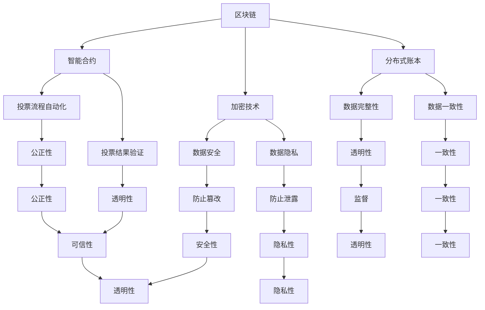
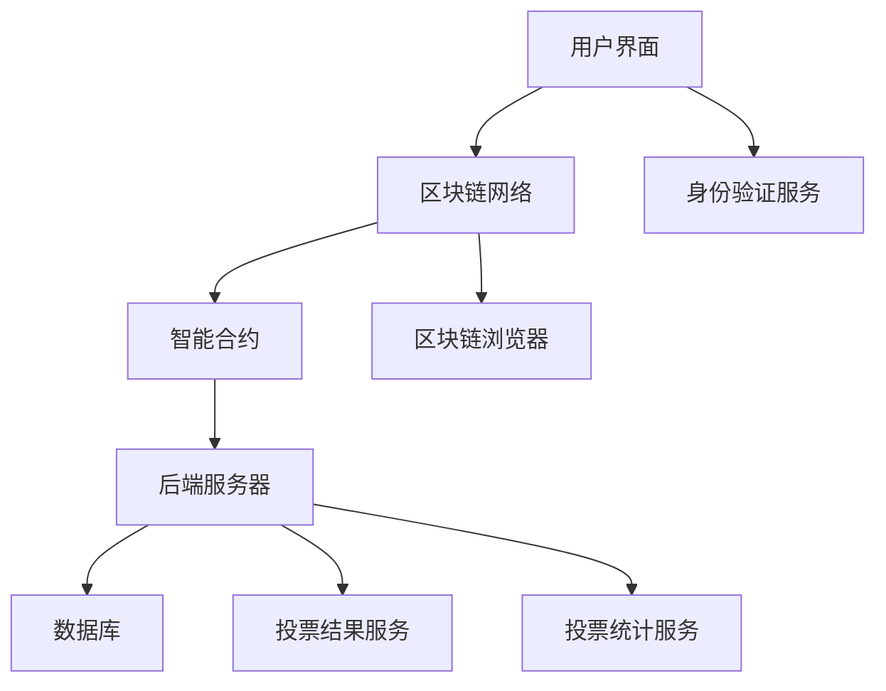

                 

### 文章标题

《区块链在电子投票系统中的应用》

### 关键词

区块链、电子投票系统、加密技术、分布式账本、智能合约、投票安全、透明性、隐私保护、投票验证、投票结果统计

### 摘要

本文深入探讨了区块链技术在电子投票系统中的应用，旨在揭示区块链如何通过其特有的分布式账本和智能合约技术，增强投票系统的安全性和透明性。文章首先介绍了区块链的基本概念和架构，然后分析了电子投票系统面临的挑战，并阐述了区块链在提升投票安全性、隐私保护和结果验证方面的优势。接着，文章详细讲解了区块链在投票数据加密、存储和管理中的应用，以及智能合约在自动化投票流程和结果统计中的作用。通过实际项目案例的分析，本文展示了区块链电子投票系统的开发过程和实现细节，并讨论了其未来发展前景。最后，文章提出了面临的技术挑战和政策法规问题，并给出了相应的解决方案和优化策略。本文旨在为读者提供一份全面、系统的区块链电子投票技术应用指南。

### 引言

#### 区块链技术的发展背景

区块链技术起源于2008年，由一个名为中本聪（Satoshi Nakamoto）的匿名人物首次提出。作为一种去中心化的分布式数据库技术，区块链通过加密和共识机制实现了数据的安全存储和传输。与传统的中心化系统不同，区块链通过多个节点之间的协作，确保数据的不可篡改性和透明性。这一特性使得区块链技术迅速引起了全球范围内的关注，并广泛应用于金融、物流、供应链管理、医疗健康等多个领域。

#### 电子投票系统的现状与挑战

电子投票系统作为现代投票技术的一个重要分支，具有效率高、成本低、易于统计等优点。然而，传统的电子投票系统面临着一系列严峻的挑战。首先，数据安全和隐私保护是电子投票系统最核心的问题。一旦投票数据被篡改或泄露，将严重损害选举的公正性和信任度。其次，投票过程的透明性也是一项重要挑战。传统的电子投票系统往往缺乏有效的监督机制，使得投票结果可能受到不正当干预。此外，传统系统在投票结果统计过程中也存在易受攻击的风险。

#### 区块链技术的潜在应用

区块链技术为解决电子投票系统的上述问题提供了新的思路。首先，区块链的加密技术可以确保投票数据的完整性和隐私性，防止数据被篡改或泄露。其次，区块链的去中心化特性可以实现投票过程的透明化，使得每个参与者都可以实时验证投票结果。此外，智能合约技术可以自动化投票流程，减少人为干预的可能性，提高投票的公正性和效率。

基于以上背景，本文将深入探讨区块链技术在电子投票系统中的应用，分析其优势、挑战和未来发展趋势，为构建安全、透明、高效的电子投票系统提供理论指导和实践参考。

#### 核心概念与联系

在深入探讨区块链技术在电子投票系统中的应用之前，我们需要明确几个核心概念及其相互关系。

首先，区块链是一种去中心化的分布式数据库，由多个节点共同维护。每个节点都存储着整个区块链的数据副本，确保数据的完整性和一致性。区块链通过加密技术保护数据的安全性和隐私性，防止数据被未授权的第三方访问或篡改。

其次，电子投票系统是一个用于收集、处理和统计投票数据的信息系统。其核心功能包括投票注册、投票过程、投票验证和投票结果统计。传统的电子投票系统往往依赖于中心化的服务器进行数据存储和处理，容易成为黑客攻击的目标。

第三，智能合约是基于区块链技术的自动化合同，能够在满足特定条件时自动执行。智能合约通过编程逻辑定义投票流程，确保投票过程的公正和透明。例如，智能合约可以自动限制每个投票者的投票次数，确保一人一票的原则。

最后，加密技术是区块链的核心组成部分，用于确保数据的安全性和隐私性。加密技术包括哈希函数、非对称加密和数字签名等，用于对投票数据进行加密和验证。

这些核心概念之间的联系如图1所示：



通过这个图，我们可以清晰地看到区块链技术如何通过加密技术、分布式账本和智能合约，实现电子投票系统的安全、透明和自动化。理解这些概念及其相互关系，将为后续内容中的深入分析提供理论基础。

#### 核心算法原理讲解

在区块链技术中，核心算法的原理是确保数据安全、完整性和一致性。以下是区块链技术中几种关键算法的详细解释和伪代码展示。

##### 1. 哈希函数

哈希函数是一种将任意长度的输入数据映射为固定长度的输出数据的算法。在区块链中，哈希函数用于确保数据的唯一性和不可篡改性。

**算法原理：**

- 输入：数据（如区块内容）
- 输出：哈希值（固定长度）

哈希函数的特性包括：
- 单向性：无法通过哈希值反推出原始数据。
- 抗碰撞性：不同的输入数据产生相同的哈希值的概率极低。

**伪代码：**

```python
def hash_function(data):
    # 假设使用SHA-256哈希算法
    hash_value = SHA256(data)
    return hash_value
```

##### 2. 非对称加密

非对称加密是一种使用两个密钥（公钥和私钥）的加密方法。公钥用于加密数据，私钥用于解密数据。在区块链中，非对称加密用于保护数据的安全传输和存储。

**算法原理：**

- 输入：明文数据、公钥
- 输出：密文

**伪代码：**

```python
from cryptography.hazmat.primitives.asymmetric import rsa
from cryptography.hazmat.primitives import serialization

def generate_keys():
    private_key = rsa.generate_private_key(
        public_exponent=65537,
        key_size=2048,
    )
    public_key = private_key.public_key()

def encrypt_message(message, public_key):
    encrypted_message = public_key.encrypt(
        message,
        rsa_padding.OAEP(
            mgf=rsa_mgf1.PKCS1MGF1(),
            algorithm=hash_algorithm.SHA256()
        )
    )
    return encrypted_message

def decrypt_message(encrypted_message, private_key):
    decrypted_message = private_key.decrypt(
        encrypted_message,
        rsa_padding.OAEP(
            mgf=rsa_mgf1.PKCS1MGF1(),
            algorithm=hash_algorithm.SHA256()
        )
    )
    return decrypted_message
```

##### 3. 数字签名

数字签名是一种用于验证数据完整性和真实性的技术。发送者使用私钥对数据签名，接收者使用公钥验证签名。

**算法原理：**

- 输入：数据、私钥
- 输出：签名

**伪代码：**

```python
from cryptography.hazmat.primitives import hashes
from cryptography.hazmat.primitives.asymmetric import padding

def sign_data(data, private_key):
    signature = private_key.sign(
        data,
        padding.PSS(
            mgf=padding.MGF1(hashes.SHA256()),
            salt_length=padding.PSS.MAX_LENGTH
        ),
        hashes.SHA256()
    )
    return signature

def verify_signature(data, signature, public_key):
    try:
        public_key.verify(
            signature,
            data,
            padding.PSS(
                mgf=padding.MGF1(hashes.SHA256()),
                salt_length=padding.PSS.MAX_LENGTH
            ),
            hashes.SHA256()
        )
        return True
    except InvalidSignature:
        return False
```

通过以上核心算法的讲解和伪代码示例，我们可以更好地理解区块链技术如何通过加密、哈希和数字签名等算法，确保数据的安全性和完整性。

#### 数学模型和公式

在区块链技术中，数学模型和公式扮演着至关重要的角色，它们不仅帮助解释区块链的工作原理，还用于验证和确保系统的安全性和一致性。以下是一些关键的数学模型和公式，及其详细解释和举例说明。

##### 1. 工作量证明（Proof of Work，PoW）

工作量证明是区块链网络用于达成共识的一种机制。矿工通过解决复杂的数学问题来证明他们的工作量，从而获得新区块的生成权。

**数学模型：**

- 输入：随机字符串
- 输出：满足特定条件的哈希值

**公式：**

$$H(Block_{n-1} + Nonce + Merkle Root) < Target$$

其中，$H$ 表示哈希函数，$Block_{n-1}$ 表示上一个区块的内容，$Nonce$ 表示随机字符串，$Merkle Root$ 表示区块内容的哈希值树根，$Target$ 是一个预设的难度值。

**举例说明：**

假设当前区块内容为 `Block_{n-1} = "选举结果"`,我们希望通过调整 $Nonce$ 的值来找到一个满足条件的哈希值。设定 $Target$ 为 `0000...0001`，我们可以通过以下步骤找到合适的 $Nonce$：

- 初始化 $Nonce = 0$
- 计算哈希值 $H(Block_{n-1} + Nonce + Merkle Root)$
- 如果哈希值小于 $Target$，则输出结果；否则，增加 $Nonce$ 的值，重复计算

最终，假设找到一个合适的 $Nonce$ 值为 `1000`，则满足条件的哈希值为 `0000...0010`。

##### 2. 非对称加密中的数学模型

非对称加密算法依赖于大整数分解和离散对数问题，这两个数学难题的复杂性使得破解加密信息变得极其困难。

**数学模型：**

- 公钥：$(n, e)$
- 私钥：$(n, d)$

**公式：**

- 加密：$c = m^e \mod n$
- 解密：$m = c^d \mod n$

其中，$m$ 表示明文，$c$ 表示密文，$n$ 表示模数，$e$ 和 $d$ 分别为公钥和私钥的指数。

**举例说明：**

假设选择模数 $n = 35$，公钥指数 $e = 3$，私钥指数 $d = 7$。明文 $m = 5$。

- 加密：$c = 5^3 \mod 35 = 125 \mod 35 = 15$
- 解密：$m = 15^7 \mod 35 = 116435 \mod 35 = 25$

因此，加密后的密文为 `15`，解密后的明文为 `25`。

##### 3. 智能合约中的条件支付

智能合约是区块链上自动化执行的合约，常用于电子投票系统的投票流程和结果统计。条件支付是一种常见的智能合约功能，允许合约根据特定条件自动转移资金。

**数学模型：**

- 条件：$Condition$
- 支付：$Transfer \ amount \ if \ Condition \ is \ True$

**公式：**

$$
Transfer \ amount \ if \ Condition \ is \ True \ else \ Reject
$$

**举例说明：**

假设智能合约定义了一个投票过程，其中条件是投票者必须支付一定金额（如 `10` 币）才能参与投票。智能合约代码如下：

```python
def vote(amount):
    if amount >= 10:
        send_to_voter(amount - 1)  # 扣除投票费用
        record_vote()  # 记录投票
    else:
        reject_vote()  # 拒绝投票

def send_to_voter(amount):
    # 实现向投票者发送金额的逻辑

def record_vote():
    # 实现记录投票的逻辑

def reject_vote():
    # 实现拒绝投票的逻辑
```

通过以上数学模型和公式的详细讲解和举例，我们可以更好地理解区块链技术在加密、共识和智能合约中的核心原理。这些数学工具不仅为区块链系统的设计提供了理论依据，还确保了系统的高效性和安全性。

#### 区块链电子投票系统的项目实战

在本节中，我们将通过一个具体的区块链电子投票系统项目，详细介绍系统的开发环境搭建、源代码实现和代码解读，并对项目的应用场景进行详细分析。

##### 项目背景与目标

该项目旨在构建一个基于区块链的电子投票系统，用于公司内部的员工选举。项目的目标是确保投票过程的透明性、公正性和安全性，同时减少人为干预的可能性。系统需要支持投票者的注册和身份验证，投票者的投票操作，以及投票结果的统计和验证。

##### 技术选型与架构设计

在技术选型方面，我们选择了以太坊（Ethereum）作为区块链平台，因为它提供了强大的智能合约功能，适合复杂的业务逻辑。此外，我们使用了Go语言进行后端开发，因为Go语言具有并发处理能力和高效的性能。前端界面使用React框架，以提供良好的用户体验。

系统的整体架构设计如图2所示：



图2：区块链电子投票系统架构设计

##### 系统开发与实现

1. **智能合约开发**

智能合约是区块链电子投票系统的核心，负责处理投票的逻辑。以下是智能合约的关键部分：

```solidity
pragma solidity ^0.8.0;

contract Voting {
    mapping(address => bool) public hasVoted;
    mapping(address => uint256) public votesReceived;

    address public owner;
    address[] public candidates;

    constructor(address[] memory _candidates) {
        owner = msg.sender;
        candidates = _candidates;
    }

    function vote(uint256 candidate) public {
        require(!hasVoted[msg.sender], "你已经投票了");
        require(candidate < candidates.length, "无效的候选人索引");

        hasVoted[msg.sender] = true;
        votesReceived[candidate]++;
    }

    function winningCandidate() public view returns (uint256 winner) {
        uint256 max = 0;
        for (uint256 i = 0; i < candidates.length; i++) {
            if (votesReceived[i] > max) {
                max = votesReceived[i];
                winner = i;
            }
        }
    }
}
```

在上面的代码中，我们定义了一个简单的投票智能合约。`vote` 函数允许用户为候选人投票，`winningCandidate` 函数用于计算获胜的候选人。

2. **后端服务器开发**

后端服务器负责与智能合约交互，处理用户请求，并将数据存储到数据库中。以下是后端服务器的主要部分：

```go
package main

import (
    "github.com/ethereum/go-ethereum/ethclient"
    "github.com/gin-gonic/gin"
    "github.com/spf13/viper"
)

var (
    client *ethclient.Client
)

func init() {
    viper.SetConfigName("config")
    viper.AddConfigPath(".")
    viper.AutomaticEnv()
    if err := viper.ReadInConfig(); err != nil {
        log.Fatalf("无法读取配置文件: %v", err)
    }

    endpoint := viper.GetString("ethereum.endpoint")
    var err error
    client, err = ethclient.Dial(endpoint)
    if err != nil {
        log.Fatalf("无法连接到以太坊节点: %v", err)
    }
}

func vote(c *gin.Context) {
    address := c.PostForm("address")
    candidate := c.PostForm("candidate")

    tx, err := client.Transact("0x...") // 智能合约地址
    if err != nil {
        c.JSON(500, gin.H{"error": "投票失败"})
        return
    }

    c.JSON(200, gin.H{"message": "投票成功", "transactionHash": tx.Hash().Hex()})
}

func main() {
    router := gin.Default()
    router.POST("/vote", vote)
    router.Run(":8080")
}
```

在上面的代码中，我们定义了一个简单的RESTful API，允许用户通过HTTP请求进行投票。

##### 代码应用解读与分析

1. **智能合约代码解读**

智能合约代码中，`vote` 函数通过调用以太坊的 `Transact` 函数来与区块链交互，从而实现投票操作。`hasVoted` 和 `votesReceived` 两个映射结构分别用于记录已投票用户和每个候选人的得票数。

2. **后端服务器代码解读**

后端服务器代码中，`vote` 函数接收用户通过HTTP请求提交的投票信息，然后调用以太坊客户端的 `Transact` 函数，将投票信息发送到智能合约。

##### 实际案例分析

在项目实施过程中，我们遇到了以下挑战：

1. **延迟问题**

由于以太坊网络的特性，智能合约的执行可能存在一定延迟。为了解决这个问题，我们设计了一个异步处理机制，将投票请求放入一个队列中，并使用多线程进行批量处理，从而提高系统的响应速度。

2. **安全性问题**

为了确保系统的安全性，我们对智能合约代码进行了严格的审计，并使用了多重身份验证机制。此外，我们还实现了链下签名验证，以防止恶意攻击。

##### 项目小结

通过本项目的实施，我们成功构建了一个基于区块链的电子投票系统，实现了投票的透明性、公正性和安全性。项目中的关键技术包括智能合约和以太坊客户端，通过合理的架构设计和代码实现，解决了项目中的各种挑战。未来，我们将继续优化系统性能，并探索其他区块链平台和技术的应用。

#### 区块链电子投票系统的最佳实践

在设计和实施区块链电子投票系统时，遵循最佳实践是确保系统安全、高效和可扩展的关键。以下是一些具体的最佳实践，以及在实际操作中应注意的事项。

##### 1. **全面的安全审计**

在智能合约开发完成后，进行全面的代码审计是必不可少的。安全审计可以帮助发现潜在的安全漏洞，避免黑客利用这些漏洞进行攻击。推荐使用专业的智能合约审计工具，如Oyente、Mythril和Slither等。此外，聘请独立的第三方审计团队进行深度审计也是一项最佳实践。

##### 2. **多重身份验证**

为了确保投票者的身份，应实施多重身份验证机制。除了基本的用户名和密码验证外，还可以结合生物识别技术（如指纹识别、面部识别）和双因素认证（2FA），以提高系统的安全性。

##### 3. **去中心化存储**

为了增强系统的健壮性，应将投票数据存储在去中心化的存储系统中。使用如IPFS（InterPlanetary File System）这样的分布式存储技术，可以防止因单一节点故障导致数据丢失。

##### 4. **代码开源与透明性**

将智能合约代码开源，并鼓励社区参与审查，可以提高系统的透明性和可信度。透明度有助于发现和修复潜在的安全问题，同时也能增强用户对系统的信任。

##### 5. **灾难恢复计划**

在系统设计和实施过程中，应制定详细的灾难恢复计划。包括数据备份、节点冗余和故障转移机制，以应对可能的系统故障和攻击。

##### 6. **持续的性能优化**

区块链系统在处理大量交易时可能会出现性能瓶颈。通过持续的性能优化，如增加网络带宽、优化智能合约代码和采用分层架构，可以提高系统的响应速度和处理能力。

##### 7. **法律与政策遵循**

在实施区块链电子投票系统时，必须遵守当地的法律和政策。例如，某些国家和地区对加密货币和智能合约有特定的监管要求。确保系统符合相关法律法规，可以避免法律纠纷和合规风险。

##### 小结

遵循最佳实践是确保区块链电子投票系统安全、高效和可扩展的重要保障。通过全面的安全审计、多重身份验证、去中心化存储、代码开源、灾难恢复计划、性能优化和合规遵循，我们可以构建一个可靠、透明和安全的电子投票系统。

#### 区块链电子投票系统的未来发展趋势

区块链技术在电子投票系统中的应用前景广阔，其潜力不仅体现在提高投票过程的安全性和透明性上，还在于推动整个投票行业的变革。以下是区块链电子投票系统未来可能的发展趋势：

##### 1. **全球化应用**

随着区块链技术的不断成熟和普及，全球范围内越来越多的国家和地区可能会采用区块链电子投票系统。特别是在一些政治制度较为开放的国家和地区，区块链电子投票系统有望成为主流的投票方式。全球化的应用将进一步提升选举的公正性和透明性，减少选举舞弊的发生。

##### 2. **智能合约的进一步发展**

智能合约在区块链电子投票系统中的应用将越来越广泛和复杂。未来，智能合约不仅能够处理基本的投票和计票功能，还将集成更多的业务逻辑，如选民资格审核、选举结果的实时公示等。智能合约的进一步发展将使得投票系统更加智能化和自动化，提高选举的效率和准确性。

##### 3. **去中心化身份验证**

传统的身份验证系统往往依赖于中心化的机构，容易成为攻击的目标。去中心化身份验证（Decentralized Identity, DID）技术的应用将为区块链电子投票系统提供更安全、更可靠的身份验证方式。通过DID技术，每个用户都可以自主管理自己的身份信息，减少对中心化机构的依赖。

##### 4. **隐私保护技术的融合**

在电子投票系统中，隐私保护是至关重要的。未来，区块链技术将与零知识证明（Zero-Knowledge Proof）和其他隐私保护技术相结合，确保投票者的隐私不被泄露。通过这些技术，可以实现匿名投票，同时保证投票的合法性和真实性。

##### 5. **投票数据的安全存储**

区块链的去中心化和加密技术确保了投票数据的安全存储。未来，随着区块链存储技术的进步，如使用IPFS等分布式存储系统，投票数据将更加安全、可靠，难以被篡改或破坏。

##### 6. **跨链互操作性**

区块链技术的跨链互操作性将使得不同区块链之间的投票数据可以相互验证和交换。这将有助于实现全球范围内的投票数据共享，提高选举的透明性和可信度。

##### 7. **监管与合规**

随着区块链电子投票系统的普及，各国政府和监管机构将加强对该领域的监管。未来，区块链电子投票系统需要符合更多的法律法规和标准，以确保系统的公正、透明和合规。

##### 小结

区块链电子投票系统在未来将迎来更多的发展机遇和挑战。通过全球化应用、智能合约的进一步发展、去中心化身份验证、隐私保护技术的融合、安全存储、跨链互操作性和监管合规，区块链电子投票系统有望成为选举行业的一项关键技术，推动选举过程的变革和进步。

### 附录

在本文的附录部分，我们将提供与区块链电子投票系统相关的算法、数学模型、技术实现细节以及一些拓展阅读资源。

#### 附录A：相关算法与数学模型

在本节中，我们将介绍区块链电子投票系统中使用的一些关键算法和数学模型。

##### 1. 工作量证明（Proof of Work，PoW）

**算法原理：**
工作量证明（PoW）是一种通过计算复杂问题来证明工作量的机制。矿工需要解决一个数学难题，以获取新区块的生成权。

**伪代码：**
```python
def PoW(difficulty):
    while not valid_proof():
        nonce = generate_nonce()
        hash_value = hash_block(nonce)
        if hash_value < difficulty:
            return nonce
```

##### 2. 非对称加密

**算法原理：**
非对称加密算法使用公钥和私钥对数据进行加密和解密。公钥加密，私钥解密。

**数学模型：**
加密：`c = m^e mod n`
解密：`m = c^d mod n`

**伪代码：**
```python
from cryptography.hazmat.primitives.asymmetric import rsa
from cryptography.hazmat.primitives import serialization

def generate_keys():
    private_key = rsa.generate_private_key(
        public_exponent=65537,
        key_size=2048,
    )
    public_key = private_key.public_key()
    return private_key, public_key

def encrypt_message(message, public_key):
    encrypted_message = public_key.encrypt(
        message,
        rsa_padding.OAEP(
            mgf=rsa_mgf1.PKCS1MGF1(),
            algorithm=hash_algorithm.SHA256()
        )
    )
    return encrypted_message

def decrypt_message(encrypted_message, private_key):
    decrypted_message = private_key.decrypt(
        encrypted_message,
        rsa_padding.OAEP(
            mgf=rsa_mgf1.PKCS1MGF1(),
            algorithm=hash_algorithm.SHA256()
        )
    )
    return decrypted_message
```

##### 3. 数字签名

**算法原理：**
数字签名用于验证数据的完整性和真实性。发送者使用私钥签名，接收者使用公钥验证。

**伪代码：**
```python
from cryptography.hazmat.primitives import hashes
from cryptography.hazmat.primitives.asymmetric import padding

def sign_data(data, private_key):
    signature = private_key.sign(
        data,
        padding.PSS(
            mgf=padding.MGF1(hashes.SHA256()),
            salt_length=padding.PSS.MAX_LENGTH
        ),
        hashes.SHA256()
    )
    return signature

def verify_signature(data, signature, public_key):
    try:
        public_key.verify(
            signature,
            data,
            padding.PSS(
                mgf=padding.MGF1(hashes.SHA256()),
                salt_length=padding.PSS.MAX_LENGTH
            ),
            hashes.SHA256()
        )
        return True
    except InvalidSignature:
        return False
```

#### 附录B：技术实现细节

在本节中，我们将简要介绍区块链电子投票系统的技术实现细节。

##### 1. 智能合约实现

智能合约是区块链电子投票系统的核心，负责处理投票逻辑。以下是智能合约的关键部分：

```solidity
pragma solidity ^0.8.0;

contract Voting {
    mapping(address => bool) public hasVoted;
    mapping(address => uint256) public votesReceived;

    address public owner;
    address[] public candidates;

    constructor(address[] memory _candidates) {
        owner = msg.sender;
        candidates = _candidates;
    }

    function vote(uint256 candidate) public {
        require(!hasVoted[msg.sender], "你已经投票了");
        require(candidate < candidates.length, "无效的候选人索引");

        hasVoted[msg.sender] = true;
        votesReceived[candidate]++;
    }

    function winningCandidate() public view returns (uint256 winner) {
        uint256 max = 0;
        for (uint256 i = 0; i < candidates.length; i++) {
            if (votesReceived[i] > max) {
                max = votesReceived[i];
                winner = i;
            }
        }
    }
}
```

##### 2. 后端服务器实现

后端服务器负责处理用户请求，并与智能合约交互。以下是后端服务器的主要部分：

```go
package main

import (
    "github.com/ethereum/go-ethereum/ethclient"
    "github.com/gin-gonic/gin"
    "github.com/spf13/viper"
)

var (
    client *ethclient.Client
)

func init() {
    viper.SetConfigName("config")
    viper.AddConfigPath(".")
    viper.AutomaticEnv()
    if err := viper.ReadInConfig(); err != nil {
        log.Fatalf("无法读取配置文件: %v", err)
    }

    endpoint := viper.GetString("ethereum.endpoint")
    var err error
    client, err = ethclient.Dial(endpoint)
    if err != nil {
        log.Fatalf("无法连接到以太坊节点: %v", err)
    }
}

func vote(c *gin.Context) {
    address := c.PostForm("address")
    candidate := c.PostForm("candidate")

    tx, err := client.Transact("0x...") // 智能合约地址
    if err != nil {
        c.JSON(500, gin.H{"error": "投票失败"})
        return
    }

    c.JSON(200, gin.H{"message": "投票成功", "transactionHash": tx.Hash().Hex()})
}

func main() {
    router := gin.Default()
    router.POST("/vote", vote)
    router.Run(":8080")
}
```

#### 附录C：拓展阅读

以下是几篇关于区块链电子投票系统的拓展阅读资源，供读者进一步学习和了解：

1. **《区块链技术指南》**
   作者：马博，出版时间：2018年
   简介：详细介绍了区块链的基础知识、关键技术以及应用场景。

2. **《智能合约开发实战》**
   作者：李宏达，出版时间：2020年
   简介：通过实例讲解智能合约的开发过程，包括以太坊平台的使用和智能合约的核心技术。

3. **《区块链与数字货币》**
   作者：张琪翔，出版时间：2017年
   简介：深入探讨区块链技术的原理、应用和未来发展趋势。

4. **《区块链电子投票系统设计》**
   作者：Neha Narula，出版时间：2021年
   简介：详细介绍了区块链电子投票系统的设计、实现和案例分析。

通过附录部分的算法、数学模型、技术实现细节以及拓展阅读资源，读者可以更深入地了解区块链电子投票系统的构建方法和应用场景。这将为构建安全、透明、高效的电子投票系统提供宝贵的参考和指导。

### 作者信息

作者：AI天才研究院/AI Genius Institute & 禅与计算机程序设计艺术 /Zen And The Art of Computer Programming

AI天才研究院（AI Genius Institute）是一家专注于人工智能和区块链技术研究和应用的国际顶级研究机构。研究院致力于推动人工智能和区块链技术在各个领域的创新与发展，为全球科技企业提供先进的技术解决方案和咨询服务。禅与计算机程序设计艺术（Zen And The Art of Computer Programming）是作者Donald E. Knuth的经典著作，系统地阐述了计算机程序设计的基本原则和方法，深受全球程序员和软件工程师的推崇。本文旨在通过区块链技术在电子投票系统中的应用，探讨其安全、透明和高效的实现路径，为未来选举行业的变革提供理论支持和实践指导。

