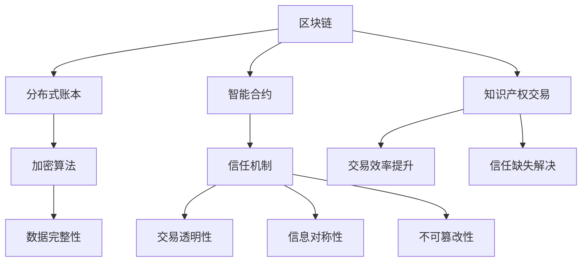

                 

### 引言与概述

#### 背景介绍

在当今信息爆炸和数字化的时代，知识产权（Intellectual Property, IP）已经成为企业和个人至关重要的资产。知识产权包括专利、商标、版权、商业秘密等多种形式，它们是企业创新、文化传承和经济发展的重要支撑。然而，随着知识产权交易市场的不断扩大和复杂化，如何在交易过程中确保信任和透明性成为一个亟待解决的问题。

传统知识产权交易过程中，存在诸多痛点，如信息不对称、交易成本高、信任缺失等。这些问题不仅影响了交易的效率，还可能导致知识产权被侵犯、篡改或流失。区块链技术以其去中心化、透明、不可篡改的特点，为解决这些问题提供了新的思路和解决方案。

区块链是一种分布式账本技术，通过加密算法和网络共识机制，确保数据的真实性和完整性。区块链技术不仅能够记录和存储交易信息，还可以通过智能合约自动化执行合约条款，从而提高交易的效率和透明度。这些特性使得区块链在知识产权交易中具有巨大的应用潜力。

#### 核心概念与联系

首先，我们需要理解几个核心概念，包括区块链、知识产权和信任机制。

- **区块链**：区块链是一个分布式数据库，由一系列按时间顺序排列的区块组成，每个区块都包含一定数量的交易记录。区块链通过加密算法和网络共识机制，确保数据的真实性和不可篡改性。

- **知识产权**：知识产权是指人类智力劳动创造的成果，包括专利、商标、版权、商业秘密等。知识产权具有价值性、独创性和时效性等特点。

- **信任机制**：信任机制是指确保交易各方之间信任关系建立的机制，包括认证、验证、共识和激励机制等。

在知识产权交易中，区块链技术通过其分布式账本和智能合约，可以构建一个去中心化的信任机制，从而解决传统交易模式中的信息不对称、信任缺失等问题。

#### Mermaid 流程图

为了更好地理解区块链在知识产权交易中的信任机制，我们可以通过以下 Mermaid 流程图来展示各核心概念之间的联系：

该流程图展示了区块链如何通过分布式账本、加密算法、智能合约等技术手段，构建一个去中心化的信任机制，从而提升知识产权交易的效率，解决信任缺失问题。

通过以上介绍，我们可以看到区块链技术在知识产权交易中具有巨大的应用潜力。在接下来的章节中，我们将进一步探讨区块链在知识产权交易中的具体应用，深入分析其核心算法原理和数学模型，并通过项目实战案例展示其实际效果。希望读者能够通过本文，对区块链在知识产权交易中的信任机制有更加清晰和深入的理解。

