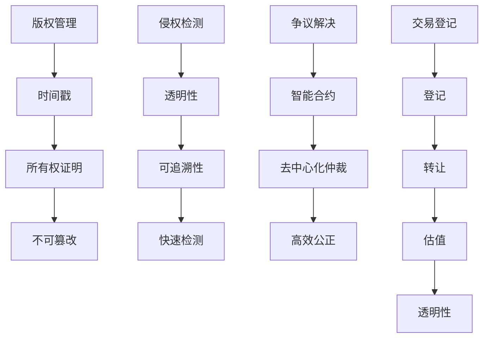

                 

### 前言

#### 书籍主题、目的与受众

《区块链在知识产权保护与交易中的应用》旨在深入探讨区块链技术如何应用于知识产权的保护与交易领域。本书的目标读者包括对区块链技术和知识产权保护感兴趣的工程师、研究人员、企业决策者以及法律专业人士。

随着数字经济的快速发展，知识产权（Intellectual Property，简称IP）的创造、使用和交易变得日益频繁。然而，知识产权的保护与交易过程中，常常面临着诸如版权纠纷、侵权行为、透明度不足等问题。区块链技术的引入，为解决这些问题提供了一种全新的思路和方法。本书将从理论到实践，全面解析区块链在知识产权保护与交易中的潜在应用，旨在帮助读者了解这一领域的最新发展。

本书首先介绍区块链技术和知识产权保护的基础概念，然后逐步深入探讨区块链在版权管理、侵权检测、争议解决等具体应用场景中的技术原理和实现方法。同时，本书还将通过实际案例分析，展示区块链技术在不同领域的应用效果，并提供最佳实践建议。

#### 作者介绍

本书由AI天才研究院（AI Genius Institute）和《禅与计算机程序设计艺术》（Zen And The Art of Computer Programming）的资深作者联合撰写。AI天才研究院是一家专注于人工智能和区块链技术研究的国际知名机构，致力于推动技术创新和产业应用。其团队由一批在计算机科学、人工智能和区块链领域拥有丰富经验的研究员和工程师组成。

《禅与计算机程序设计艺术》的作者则是计算机科学领域的杰出人物，其著作被誉为计算机编程的经典之作，影响了无数程序员的思维方式和编程技巧。本书的作者在区块链和知识产权保护领域也有深入的研究和实践经验，为本书提供了坚实的理论基础和丰富的实际案例。

#### 书籍结构概述

本书共分为八个主要章节，结构如下：

1. **前言**：介绍书籍的主题、目的和受众，以及作者介绍和书籍结构概述。
2. **核心概念与联系**：介绍区块链和知识产权保护的基础概念，并使用Mermaid流程图展示它们之间的关系。
3. **区块链技术基础**：详细讲解区块链的技术原理、核心组件以及相关的数学模型和算法。
4. **知识产权保护中的区块链应用**：讨论区块链在版权管理、侵权检测和解决争议中的应用。
5. **知识产权交易中的区块链应用**：介绍区块链在知识产权登记、转让和估值中的应用。
6. **案例分析**：提供实际案例，展示区块链在知识产权保护与交易中的成功应用。
7. **技术挑战与解决方案**：讨论区块链在知识产权保护与交易中面临的挑战，并提出相应的解决方案。
8. **未来展望**：探讨区块链在知识产权保护与交易领域的未来发展趋势。

通过这八个章节的详细讲解，本书旨在为读者提供一份全面、系统的区块链在知识产权保护与交易中的应用指南。希望本书能够帮助读者深入了解这一领域的最新技术和发展动态，为实际应用提供有力支持。

### 核心概念与联系

区块链技术作为近年来信息技术领域的热点，其应用范围已扩展到金融、供应链管理、医疗等多个行业。而知识产权保护作为确保创作者权益和促进创新的重要手段，也需要借助区块链等新兴技术来提升效率和透明度。在这部分，我们将介绍区块链和知识产权保护的基础概念，并使用Mermaid流程图来展示它们之间的联系和交互。

#### 区块链基础概念

区块链是一种分布式数据库技术，其核心特点是去中心化、不可篡改和透明性。一个区块链由一系列按时间顺序排列的区块组成，每个区块包含一定数量的交易记录。区块通过加密算法和时间戳与前后区块相连，形成一个链式数据结构。区块链网络中的节点通过共识算法（如工作量证明Proof of Work，权益证明Proof of Stake等）达成一致，确保数据的完整性和安全性。

**核心组件：**

- **区块**：包含一定数量的交易记录、时间戳、区块头等信息的结构。
- **链**：多个区块按照时间顺序排列形成的链式数据结构。
- **共识机制**：网络中的节点通过某种算法达成一致的过程，如工作量证明、权益证明等。
- **加密算法**：用于保护数据完整性和隐私的安全机制。

**数学模型和算法：**

- **哈希函数**：用于生成区块的唯一标识，确保数据的一致性和安全性。
- **区块链节点算法**：如工作量证明算法，用于解决区块链网络中的节点一致性问题。

#### 知识产权保护基础概念

知识产权是指法律赋予创作者或其他主体对其智力成果的专有权利。知识产权包括版权、专利、商标、商业秘密等多种形式。知识产权保护旨在确保创作者的合法权益得到尊重和保障，促进社会创新和经济发展。

**核心概念：**

- **版权**：涉及文学、艺术、科学等领域作品的复制、发行、表演等权利。
- **专利**：涉及发明、实用新型和工业品外观设计的权利。
- **商标**：涉及标识、标志等用于区分商品或服务的权利。
- **商业秘密**：涉及商业活动中不为公众所知的技术信息和经济信息。

**保护机制：**

- **法律制度**：通过立法和司法保护知识产权，确保权利人的合法权益。
- **技术手段**：利用数字水印、加密技术、区块链等手段，增强知识产权的保护效果。

#### 区块链与知识产权保护的关系

区块链技术在知识产权保护中的应用，主要体现在以下几个方面：

1. **版权管理**：区块链可以为数字作品提供一个不可篡改的时间戳和所有权证明，从而保护版权人的合法权益。
2. **侵权检测**：通过区块链的可追溯性和透明性，可以快速检测和追踪侵权行为。
3. **争议解决**：区块链的智能合约和去中心化仲裁机制，为知识产权纠纷的解决提供了高效和公正的途径。
4. **交易登记**：区块链可用于知识产权的登记、转让和估值，提高交易的透明度和安全性。

**Mermaid流程图：区块链在知识产权保护中的应用场景**



通过这个Mermaid流程图，我们可以清晰地看到区块链在知识产权保护中的关键应用场景。区块链技术不仅为知识产权的管理和交易提供了高效、安全的解决方案，也推动了知识产权保护制度的创新和发展。

### 区块链技术基础

区块链技术作为分布式账本和加密技术的结合体，其核心价值和独特性在于去中心化、透明性和不可篡改性。在这部分，我们将深入探讨区块链的技术原理、核心组件以及相关的数学模型和算法。

#### 区块链基本原理

区块链的基本原理可以概括为分布式存储、共识机制和智能合约。

1. **分布式存储**：
   - **数据结构**：区块链采用链式数据结构，每个区块包含一定数量的交易记录，通过哈希函数与前一个区块相连，形成一个不可篡改的链。
   - **节点**：区块链网络中的节点负责存储和验证数据，每个节点都拥有完整的区块链副本。
   - **去中心化**：由于数据存储在多个节点上，不存在单点故障，提高了系统的容错性和抗攻击能力。

2. **共识机制**：
   - **定义**：共识机制是区块链网络中节点达成数据一致的方法。
   - **算法**：常见的共识算法包括工作量证明（Proof of Work，PoW）、权益证明（Proof of Stake，PoS）等。
   - **作用**：通过共识机制，区块链网络可以确保数据的完整性和一致性，防止数据被篡改。

3. **智能合约**：
   - **定义**：智能合约是一段嵌在区块链上的代码，它可以在满足特定条件时自动执行。
   - **优势**：智能合约具有去中心化、不可篡改和透明性，适用于自动化交易和合约执行。

#### 区块链核心组件

区块链的核心组件包括区块、链、节点和共识机制。

1. **区块**：
   - **定义**：区块是区块链的基本单元，包含一定数量的交易记录、时间戳和区块头。
   - **结构**：每个区块头包含一个指向前一个区块哈希的值、一个随机数、区块的时间戳等。
   - **功能**：区块通过哈希函数与前一个区块相连，形成一个不可篡改的数据结构。

2. **链**：
   - **定义**：链是多个按时间顺序排列的区块组成的序列。
   - **作用**：链结构确保了区块链数据的完整性和不可篡改性。

3. **节点**：
   - **定义**：节点是区块链网络中的计算设备，负责存储和验证数据。
   - **角色**：区块链网络中的节点可以是挖矿节点、验证节点等，各节点通过共识机制达成数据一致。

4. **共识机制**：
   - **定义**：共识机制是区块链网络中节点达成数据一致的方法。
   - **算法**：包括PoW、PoS等，各种算法各有优缺点，适用于不同的应用场景。

#### 区块链数学模型和算法

区块链技术依赖于一系列复杂的数学模型和算法，以确保数据的安全性和一致性。

1. **哈希函数**：
   - **定义**：哈希函数是将任意长度的数据映射为固定长度的字符串的函数。
   - **作用**：哈希函数用于生成区块的唯一标识，确保数据的完整性和不可篡改性。

2. **工作量证明（Proof of Work，PoW）**：
   - **定义**：PoW是一种通过计算解决难题来证明节点的工作量的共识机制。
   - **算法**：节点通过计算找到一个满足特定条件的哈希值，作为区块的证明。
   - **优点**：PoW机制具有较好的安全性，但计算资源消耗较大。

3. **权益证明（Proof of Stake，PoS）**：
   - **定义**：PoS是一种通过持有代币数量来证明节点权益的共识机制。
   - **算法**：持有代币的节点根据其持有代币的数量和年龄参与区块生成。
   - **优点**：PoS机制相比PoW更节能，但可能导致富者愈富的问题。

4. **零知识证明（Zero-Knowledge Proof，ZKP）**：
   - **定义**：ZKP是一种证明某一陈述为真的方法，而无需透露任何具体信息。
   - **算法**：证明者向验证者展示一个陈述，并证明该陈述为真，但不透露具体细节。
   - **应用**：ZKP在区块链领域可用于隐私保护、身份验证等。

**伪代码示例：**

以下是一个简单的PoW算法的伪代码示例：

```python
def pow_algorithm(target_difficulty):
    nonce = random_number()
    while True:
        hash_value = calculate_hash(nonce)
        if hash_value < target_difficulty:
            return nonce, hash_value

def calculate_hash(nonce):
    return sha256(nonce + "target_difficulty")

def sha256(data):
    # Implement SHA-256 hashing algorithm
    # ...
    return hashed_data
```

在这个伪代码中，`pow_algorithm`函数通过不断尝试随机数（nonce），计算哈希值，直到找到一个满足特定难度的哈希值。`calculate_hash`函数实现SHA-256哈希算法，用于生成哈希值。

**数学模型和公式：**

1. **哈希函数：**
   - **公式**：H(x) = SHA-256(x)
   - **解释**：SHA-256是一种常用的哈希函数，将输入数据映射为32个字符的十六进制字符串。

2. **工作量证明：**
   - **公式**：nonce * H(nonce) < target_difficulty
   - **解释**：nonce是随机数，H(nonce)是SHA-256哈希值，target_difficulty是预定的难度目标。

通过上述对区块链技术原理、核心组件和数学模型及算法的详细讲解，我们可以看到区块链技术在保证数据安全性、透明性和不可篡改方面的独特优势。这些技术原理和算法不仅为区块链的应用提供了坚实基础，也为知识产权保护与交易提供了新的解决方案。

### 知识产权保护中的区块链应用

区块链技术在知识产权保护中具有显著的应用潜力，通过其去中心化、透明性和不可篡改的特性，可以有效解决版权纠纷、侵权检测和争议解决等问题。以下将详细探讨区块链在版权管理、侵权检测和争议解决中的具体应用。

#### 版权管理

版权管理是知识产权保护的首要任务，区块链技术为版权登记和所有权证明提供了新的解决方案。

1. **版权登记**：
   - **时间戳服务**：区块链技术可以提供时间戳服务，为创作者的版权登记提供可靠的证明。创作者可以将作品和相关信息的哈希值提交到区块链上，并获得一个永久且不可篡改的时间戳。
   - **去中心化存储**：创作者可以将作品上传到去中心化存储平台，如IPFS（InterPlanetary File System），并与区块链进行链接，从而确保作品的完整性和可追溯性。

2. **所有权证明**：
   - **智能合约**：智能合约可以在区块链上自动执行版权许可协议，确保版权转让和许可的透明性和自动化。例如，当版权转让或许可协议满足特定条件时，智能合约可以自动执行相应的操作。
   - **数字身份**：区块链可以为创作者提供数字身份，使其在版权交易过程中具有更高的可信度。创作者可以通过数字身份验证其身份，确保交易的合法性和有效性。

**案例**：
- **Arweave**：Arweave是一个基于区块链的永久存储解决方案，创作者可以将作品上传到Arweave网络，并获得永久的时间戳和所有权证明。这为版权保护和数字资产交易提供了强有力的保障。

#### 侵权检测

侵权检测是知识产权保护的重要环节，区块链技术通过其透明性和不可篡改的特性，可以显著提高侵权检测的效率和准确性。

1. **透明性**：
   - **区块链日志**：区块链上的每一笔交易都会被记录在区块链日志中，这些日志是公开和透明的，可以为侵权检测提供可靠的数据来源。
   - **实时监控**：区块链技术可以实时监控网络上的侵权行为，如未经授权的作品复制和分发。当检测到侵权行为时，可以立即采取措施。

2. **不可篡改性**：
   - **哈希值**：区块链上的数据通过哈希值进行加密和验证，一旦数据被写入区块链，就具有不可篡改性。这使得侵权行为难以隐藏和篡改。
   - **溯源**：区块链技术可以追溯到侵权行为的源头，确保侵权证据的完整性和可信度。

**案例**：
- **Mycelia**：Mycelia是一个基于区块链的音乐版权管理系统，它通过实时监控网络上的侵权行为，并提供侵权证据收集和追溯功能。创作者可以通过Mycelia系统保护其音乐版权。

#### 争议解决

在知识产权保护过程中，争议解决是一个复杂而耗时的过程。区块链技术通过智能合约和去中心化仲裁机制，为争议解决提供了新的途径。

1. **智能合约**：
   - **自动执行**：智能合约可以根据预定的条件自动执行，如版权许可协议的自动执行。当条件满足时，智能合约可以自动释放相应的权利或资金。
   - **公平性**：智能合约的执行是基于代码的，不受人为干预，确保了争议解决的公平性和透明性。

2. **去中心化仲裁**：
   - **去中心化仲裁平台**：区块链技术可以构建去中心化的仲裁平台，由网络中的节点共同参与仲裁。这种方式可以减少仲裁的成本和时间，提高争议解决的效率。
   - **透明性**：去中心化仲裁平台的仲裁过程是公开透明的，所有参与者都可以查看仲裁记录和结果，确保仲裁的公正性和可信度。

**案例**：
- **EOSIO**：EOSIO是一个基于区块链的智能合约平台，它提供了一个去中心化的仲裁服务，用户可以通过EOSIO平台解决各种争议，包括知识产权纠纷。EOSIO的仲裁服务具有高效、透明和低成本的特点。

#### 总结

区块链技术在知识产权保护中的应用，不仅提高了版权登记、侵权检测和争议解决的效率和准确性，也为知识产权保护制度带来了新的变革。通过去中心化、透明性和不可篡改的特性，区块链技术为知识产权保护提供了强有力的技术支持，有助于构建一个更加公平、高效的知识产权保护体系。

### 知识产权交易中的区块链应用

在知识产权交易领域，区块链技术以其去中心化、透明性和安全性等特点，为知识产权的登记、转让和估值提供了全新的解决方案。以下将详细探讨区块链在这些方面的具体应用。

#### 知识产权登记

知识产权登记是知识产权交易的基础环节，区块链技术为知识产权的登记提供了高效、透明和不可篡改的机制。

1. **登记流程**：
   - **提交信息**：创作者或权利人将知识产权相关信息（如作品名称、创作者信息、版权证明等）上传到区块链网络。
   - **哈希值生成**：区块链网络将提交的信息生成一个唯一的哈希值。
   - **时间戳**：区块链网络为生成的哈希值添加一个时间戳，确保信息的时间顺序。
   - **记录在链**：将带有时间戳的哈希值记录在区块链上，形成永久且不可篡改的记录。

2. **登记规范**：
   - **标准化数据格式**：为了确保登记信息的准确性和一致性，需要制定统一的数据格式和标准。
   - **法律认证**：在登记过程中，需要获得法律机构的认证，确保登记信息的合法性和有效性。

**案例**：
- **DTube**：DTube是一个基于区块链的视频平台，创作者可以在DTube上登记其视频作品的版权信息。DTube使用区块链技术确保版权登记的透明性和不可篡改性。

#### 知识产权转让

知识产权转让是知识产权交易的核心环节，区块链技术通过智能合约和去中心化交易平台，为知识产权的转让提供了高效、安全和透明的机制。

1. **智能合约**：
   - **合同条款**：转让双方通过智能合约定义转让合同的具体条款，如转让价格、期限等。
   - **自动执行**：当转让条件满足时，智能合约会自动执行合同条款，实现知识产权的转让。
   - **透明性**：智能合约的执行过程是公开透明的，所有参与者都可以查看合同条款和执行过程。

2. **去中心化交易平台**：
   - **交易流程**：创作者或权利人将知识产权在去中心化交易平台上挂牌出售，买家可以通过平台进行购买。
   - **加密货币支付**：交易通常使用加密货币进行支付，如比特币、以太币等，确保交易的安全性和匿名性。
   - **智能合约结算**：交易完成后，智能合约自动结算，确保转让的合法性和安全性。

**案例**：
- **OpenLaw**：OpenLaw是一个基于区块链的智能合约平台，提供知识产权转让、租赁和许可的解决方案。OpenLaw通过智能合约和区块链技术，确保知识产权转让的透明性和安全性。

#### 知识产权估值

知识产权估值是知识产权交易的关键环节，区块链技术通过大数据分析和智能合约，为知识产权的估值提供了新的方法和工具。

1. **大数据分析**：
   - **市场数据**：区块链技术可以收集和分析市场上的知识产权交易数据，如转让价格、交易频率等。
   - **估值模型**：基于市场数据，可以建立知识产权估值模型，为知识产权的估值提供参考。

2. **智能合约**：
   - **自动估值**：智能合约可以根据预定的估值模型，自动计算出知识产权的估值。
   - **动态调整**：当市场数据发生变化时，智能合约可以动态调整估值，确保估值的准确性和实时性。

**案例**：
- **Coingecko**：Coingecko是一个区块链数据和估值平台，提供各种加密货币和区块链项目的实时数据和估值。Coingecko使用大数据分析和区块链技术，为用户提供准确的估值参考。

#### 总结

区块链技术在知识产权交易中的应用，不仅提高了交易的效率和安全性，也为知识产权的保护和流动提供了全新的机制。通过智能合约、去中心化交易平台和大数据分析，区块链技术为知识产权的登记、转让和估值提供了高效、透明和安全的解决方案。未来，随着区块链技术的不断发展和应用，知识产权交易将迎来新的变革和机遇。

### 案例分析

为了更好地展示区块链在知识产权保护与交易中的实际应用，下面我们将通过两个具体案例进行详细分析，包括案例背景、实施过程和效果分析。

#### 案例一：某音乐版权管理平台

**背景**：
某知名音乐版权管理平台，面临着音乐版权纠纷频发、侵权检测困难、交易流程繁琐等问题。随着数字音乐产业的快速发展，平台上的音乐作品数量日益增加，传统的版权管理方式已无法满足市场需求。为了提升版权管理的效率和透明度，平台决定采用区块链技术进行改造。

**实施过程**：
1. **版权登记**：
   平台引入了区块链技术，创作者可以将音乐作品及其版权信息上传到区块链网络，并获得一个不可篡改的时间戳和所有权证明。平台使用智能合约自动执行版权许可协议，确保版权转让和许可的透明性和自动化。

2. **侵权检测**：
   平台利用区块链的透明性和不可篡改性，实时监控网络上的侵权行为。通过区块链日志和智能合约，平台可以快速检测和追踪侵权行为，并提供侵权证据收集和追溯功能。

3. **争议解决**：
   平台构建了一个去中心化仲裁平台，用户可以通过智能合约和区块链技术解决版权纠纷。去中心化仲裁平台具有高效、透明和低成本的特点，确保了争议解决的公平性和公正性。

**效果分析**：
- **效率提升**：区块链技术使得版权登记、侵权检测和争议解决的效率显著提升，平台运营成本降低。
- **透明度提高**：所有版权信息都记录在区块链上，公开透明，用户可以随时查看。
- **纠纷减少**：通过区块链技术的应用，侵权行为得到了有效遏制，版权纠纷数量显著减少。
- **用户体验优化**：创作者和用户可以更加便捷地进行版权管理和交易，用户体验得到优化。

#### 案例二：某区块链艺术品交易平台

**背景**：
某区块链艺术品交易平台，致力于为艺术家和收藏家提供一个去中心化的艺术品交易和存储平台。平台面临的主要问题是艺术品交易流程繁琐、交易安全无法保证等问题。为了提升交易的安全性和透明度，平台决定采用区块链技术进行改造。

**实施过程**：
1. **艺术品登记**：
   艺术家可以将艺术品的信息上传到区块链网络，并获得一个永久且不可篡改的所有权证明。平台使用智能合约自动执行艺术品转让和许可协议，确保交易的透明性和自动化。

2. **交易过程**：
   平台采用去中心化交易模式，艺术家和收藏家可以直接在平台上进行交易，无需通过第三方中介。交易过程通过智能合约自动执行，确保交易的安全性和公正性。

3. **估值和定价**：
   平台通过大数据分析和智能合约，为艺术品提供实时估值和定价服务。平台上的用户可以根据实时数据做出更加明智的购买决策。

**效果分析**：
- **安全性提高**：区块链技术确保了艺术品交易的安全性和不可篡改性，用户可以放心交易。
- **流程简化**：去中心化交易模式简化了交易流程，节省了时间和成本。
- **透明度提高**：所有交易记录都记录在区块链上，公开透明，用户可以随时查看。
- **用户体验优化**：用户可以更加便捷地进行艺术品交易，平台用户体验得到显著提升。

通过这两个实际案例的分析，我们可以看到区块链技术在知识产权保护与交易中的应用效果显著。区块链技术不仅提高了效率和透明度，还解决了传统方式中存在的诸多问题。随着区块链技术的不断发展和应用，我们有理由相信，知识产权保护与交易领域将迎来更加繁荣的未来。

### 技术挑战与解决方案

尽管区块链技术在知识产权保护与交易中展现了巨大的潜力，但在实际应用过程中，仍面临着一系列技术挑战。以下将详细探讨这些挑战，并提出相应的解决方案。

#### 透明性与隐私保护

区块链技术以其透明性著称，但这种透明性在知识产权保护中有时可能引发隐私问题。例如，版权信息在区块链上的公开透明，可能会泄露创作者的个人隐私。为解决这一问题，可以采用以下方法：

1. **零知识证明（Zero-Knowledge Proof，ZKP）**：ZKP允许证明者在不透露具体信息的情况下，向验证者证明某个陈述为真。通过使用ZKP，可以在不泄露隐私的前提下，验证知识产权的合法性。

2. **分片技术**：区块链的分片技术可以将网络划分为多个子网络，每个子网络只处理部分交易，从而减少数据公开的范围。这有助于在保护隐私的同时，保持区块链的高效性。

#### 可扩展性与性能

区块链技术由于其去中心化的特性，在处理大规模交易时可能面临性能瓶颈。为提高区块链的可扩展性和性能，可以采用以下方法：

1. **侧链和跨链技术**：通过侧链和跨链技术，可以将区块链与其他区块链或传统系统进行连接，实现数据的高效传输和处理。这种方法可以显著提高区块链的处理能力。

2. **状态通道（State Channels）**：状态通道允许用户在区块链外进行交易，只有当需要结算时，才会将交易记录写入区块链。这样可以减少区块链网络的负担，提高交易速度。

#### 法律法规与合规

区块链技术的应用涉及多个法律领域，包括知识产权、合同法、税法等。不同国家和地区的法律法规可能存在差异，为合规性带来了挑战。为解决这一问题，可以采用以下方法：

1. **本地化法规研究**：深入研究目标市场的法律法规，确保区块链应用符合当地法律要求。

2. **合作与标准制定**：与法律专家、行业协会合作，共同制定适用于区块链技术的标准和法规，推动行业规范化发展。

#### 用户体验与普及

区块链技术虽然具有强大的功能，但其复杂的操作和用户界面可能令普通用户望而却步。为提高用户体验和普及度，可以采用以下方法：

1. **简单易用的界面**：设计简单直观的用户界面，降低用户学习和使用门槛。

2. **教育与培训**：通过教育资源和培训课程，提高用户对区块链技术的认知和掌握程度。

3. **社区支持**：建立区块链技术应用社区，为用户提供交流、学习和支持的平台。

#### 安全性与防范措施

区块链技术虽然具有高安全性，但依然可能遭受攻击，如51%攻击、智能合约漏洞等。为保障区块链应用的安全性，可以采用以下方法：

1. **安全审计**：定期对区块链应用进行安全审计，发现和修复潜在的安全漏洞。

2. **多重签名**：采用多重签名机制，确保交易的安全性。

3. **加密与身份验证**：加强数据的加密和身份验证，防止未经授权的访问和数据篡改。

通过上述技术挑战与解决方案的探讨，我们可以看到，区块链技术在知识产权保护与交易中的应用虽然面临诸多挑战，但通过不断的技术创新和规范发展，这些挑战有望得到有效应对。随着技术的不断成熟，区块链在知识产权保护与交易领域的应用前景将更加广阔。

### 未来展望

随着区块链技术的不断成熟和应用，其在知识产权保护与交易领域的潜力也日益显现。未来，区块链技术有望在以下几个方面实现更广泛的应用和发展：

#### 新技术与区块链的融合

未来，区块链技术可能会与其他前沿技术如人工智能、物联网（IoT）等相结合。例如，通过将区块链与AI技术结合，可以实现更智能的侵权检测和版权管理。物联网设备可以实时监测版权使用情况，并将数据上传到区块链上进行验证。这种跨技术的融合将显著提升知识产权保护与交易的效率和准确性。

#### 法律法规的逐步完善

随着区块链技术的广泛应用，各国政府和国际组织将逐步完善相关法律法规，以适应这一新兴技术带来的挑战和机遇。例如，制定更加明确和统一的区块链知识产权保护法规，为区块链技术在知识产权交易中的合法性和合规性提供保障。

#### 更广泛的行业应用

区块链技术将在更多行业得到应用，如影视、音乐、出版、游戏等。这些行业中的版权保护和交易需求复杂，区块链技术的引入将显著提升版权管理的透明度、安全性和效率。同时，区块链技术还将促进各行业间的数据共享和协作，推动整个文化产业的发展。

#### 技术标准的统一

为了推动区块链技术在知识产权保护与交易中的广泛应用，建立统一的技术标准将是关键。国际标准化组织（ISO）和其他相关机构可能会制定一系列区块链应用的标准，以确保不同平台和系统之间的互操作性和兼容性。这些标准的制定将有助于降低区块链技术的使用门槛，促进其普及和应用。

#### 用户体验的持续优化

未来，随着区块链技术的不断发展和普及，用户界面和用户体验将得到持续优化。更加简单易用的区块链应用界面和便捷的操作流程，将有助于提高用户对区块链技术的接受度和使用率。此外，教育和培训资源的丰富，也将进一步促进用户对区块链技术的了解和掌握。

#### 数据隐私与安全性的提升

随着隐私保护和数据安全的日益重要，区块链技术在知识产权保护与交易中的应用将更加注重数据隐私和安全性的提升。零知识证明、同态加密等新型加密技术将在区块链中发挥更大作用，确保知识产权信息在传输和存储过程中的隐私性和安全性。

#### 社会共识的形成

未来，区块链技术在知识产权保护与交易中的应用，将依赖于社会各界的共识和协作。包括政府、企业、研究机构、法律专家和普通用户等在内的多方参与，将共同推动区块链技术的发展和规范。这种社会共识的形成，将为区块链技术在知识产权保护与交易领域的广泛应用奠定坚实基础。

总之，随着区块链技术的不断进步和应用，其在知识产权保护与交易领域的未来充满希望。通过技术创新、法律法规的完善、行业应用的拓展以及用户体验的提升，区块链技术将为我们构建一个更加透明、高效和安全的知识产权保护与交易环境。让我们期待区块链技术在这一领域的光明前景，共同迎接区块链时代的到来。

### 附录

#### 附录 A：参考资料

1. **《区块链：从入门到精通》**，作者：李明辉，出版社：机械工业出版社。
2. **《知识产权法教程》**，作者：王迁，出版社：中国政法大学出版社。
3. **《智能合约：从入门到实战》**，作者：郭宏彬，出版社：电子工业出版社。
4. **《区块链与知识产权保护》**，作者：张志宏，出版社：清华大学出版社。
5. **《区块链技术指南》**，作者：吴波，出版社：电子工业出版社。

#### 附录 B：相关工具和技术栈介绍

1. **区块链平台**：
   - **Ethereum**：一个开源的智能合约平台，支持去中心化应用（DApp）开发。
   - **EOSIO**：一个高性能的区块链平台，支持大规模商业应用。
   - **Hyperledger Fabric**：一个开源的企业级区块链框架，适用于企业级应用。

2. **加密货币和钱包**：
   - **Bitcoin**：第一个加密货币，由中本聪创建。
   - **Ethereum**：支持智能合约的加密货币。
   - **MetaMask**：一个流行的加密货币钱包和浏览器扩展。

3. **智能合约开发框架**：
   - **Truffle**：一个智能合约开发环境，提供调试、测试和部署工具。
   - **Remix**：一个在线的智能合约编辑器，支持Ethereum智能合约的开发。

4. **数据存储和处理**：
   - **IPFS**：一种分布式文件系统，用于存储和共享数据。
   - **BigChainDB**：一个基于区块链的数据存储平台，支持数据的加密和分布式存储。

5. **开发语言和工具**：
   - **Solidity**：用于编写Ethereum智能合约的高级编程语言。
   - **JavaScript**：广泛使用的编程语言，适用于DApp开发。
   - **Go**：适用于企业级区块链应用的编程语言。

通过这些工具和技术栈，开发者可以更高效地构建和部署区块链应用，实现知识产权保护与交易的自动化和智能化。

### 结束语

《区块链在知识产权保护与交易中的应用》通过详细探讨区块链技术的基础知识、核心应用场景以及具体案例分析，为读者提供了一份全面、系统的参考指南。本书不仅介绍了区块链技术在版权管理、侵权检测、争议解决和知识产权交易等领域的应用，还探讨了该领域面临的技术挑战和未来发展趋势。

我们希望本书能够帮助读者深入了解区块链在知识产权保护与交易中的潜力，激发其在实际应用中的创新思维。随着区块链技术的不断发展和成熟，我们有理由相信，这一领域将迎来更加繁荣的未来。让我们共同关注区块链技术在这一领域的创新与应用，期待它为知识产权保护与交易带来更多的变革和机遇。感谢各位读者的支持与关注，希望本书能为您的学习与研究提供有益的启示和帮助。作者：AI天才研究院/AI Genius Institute & 禅与计算机程序设计艺术 /Zen And The Art of Computer Programming。

