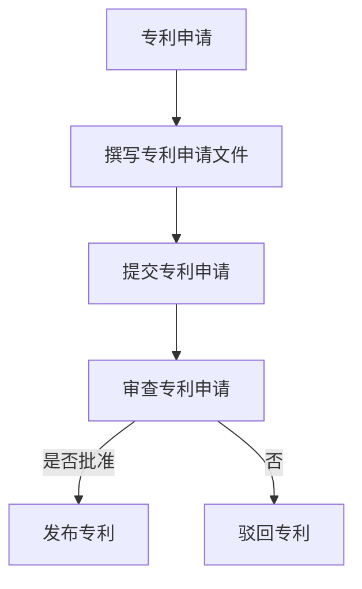

                 


## 《区块链在知识产权保护中的创新：简化专利申请和管理》

### 关键词

区块链、知识产权保护、专利申请、专利管理、创新

### 摘要

本文将深入探讨区块链技术在知识产权保护中的创新应用，特别是对专利申请和管理的简化。通过分析区块链的基本概念、知识产权保护的重要性以及区块链在其中的潜在优势，我们将逐步揭示区块链如何通过去中心化、不可篡改和透明性等特点，为专利申请和管理流程带来革命性变革。

本文分为三个主要部分：第一部分介绍区块链与知识产权保护的基本概念，探讨区块链在版权、商标和专利保护中的应用场景；第二部分分析区块链技术在专利申请和管理中的创新，包括简化专利申请流程和专利管理的新方案；第三部分通过具体案例和未来展望，展示区块链在知识产权保护中的成功实践和潜在发展趋势。

### 第一部分：区块链与知识产权保护

#### 第1章：区块链与知识产权保护概述

##### 1.1 区块链的基本概念

区块链是一种分布式数据库技术，通过密码学确保数据的完整性和安全性。它由一系列按时间顺序排列的区块组成，每个区块都包含一定数量的交易数据，并通过加密算法相互连接。

区块链的主要特点包括：

- **去中心化**：区块链不存在中心化管理者，所有节点均可参与验证和记录交易。
- **不可篡改**：一旦数据记录在区块链上，就几乎无法更改或删除，确保了数据的真实性和可靠性。
- **透明性**：所有交易记录都是公开透明的，任何用户都可以查询和验证。

##### 1.2 知识产权保护的基本概念

知识产权是指法律赋予人们对其创造性智力成果所享有的专有权利，包括专利、商标、著作权等。知识产权保护的核心目标是确保权利人的合法权益得到充分尊重和保障。

##### 1.3 区块链在知识产权保护中的潜在优势

区块链在知识产权保护中具有以下潜在优势：

- **去中心化**：去中心化特性使得知识产权的验证和管理过程更加透明和高效。
- **不可篡改**：区块链确保知识产权记录的真实性和不可篡改性，防止侵权行为。
- **透明性**：所有知识产权交易记录都是公开透明的，有助于提高知识产权保护的效果。

### 第2章：区块链在知识产权保护中的应用场景

##### 2.1 区块链在版权保护中的应用

区块链在版权保护中的应用主要体现在数字作品版权的管理和保护上。通过区块链技术，数字作品的版权信息可以被永久记录和验证，从而确保权利人的权益。

具体应用场景包括：

- **数字作品注册**：权利人可以将自己的数字作品注册到区块链上，获得合法的版权证明。
- **版权交易**：区块链可以简化版权交易流程，确保交易的安全性和透明性。
- **侵权追踪**：通过区块链，可以实时监控数字作品的传播和使用情况，及时发现侵权行为。

##### 2.2 区块链在商标保护中的应用

区块链在商标保护中的应用主要包括商标注册、商标转让和商标侵权追踪等方面。

具体应用场景包括：

- **商标注册**：权利人可以通过区块链将商标注册信息进行记录和验证，提高商标注册的效率和准确性。
- **商标转让**：区块链技术可以简化商标转让流程，确保转让的安全性和透明性。
- **侵权追踪**：通过区块链，可以实时监控商标的使用情况，及时发现侵权行为。

##### 2.3 区块链在专利保护中的应用

区块链在专利保护中的应用主要体现在专利申请、专利管理和专利检索等方面。

具体应用场景包括：

- **专利申请**：区块链技术可以简化专利申请流程，提高申请的效率和准确性。
- **专利管理**：区块链可以实现对专利的透明管理和追踪，提高专利保护的效果。
- **专利检索**：区块链技术可以提供高效、准确的专利检索服务，帮助企业和个人快速获取所需的专利信息。

### 第3章：区块链技术在专利申请和管理中的创新

##### 3.1 区块链在专利申请流程中的创新

区块链技术在专利申请流程中的创新主要体现在简化申请流程和提升申请效率上。

具体创新点包括：

- **去中心化申请**：权利人可以直接在区块链上进行专利申请，无需依赖中心化机构，提高申请的效率和透明性。
- **智能合约应用**：通过智能合约，可以自动执行专利申请的各个环节，确保流程的合规性和高效性。

##### 3.2 区块链在专利管理中的创新

区块链技术在专利管理中的创新主要体现在提高管理的透明性和追踪能力上。

具体创新点包括：

- **透明管理**：所有专利信息都可以在区块链上公开透明地记录和查询，提高专利管理的透明度。
- **实时追踪**：区块链可以实时记录专利的转让、使用等行为，确保专利权益的清晰和可追溯性。

##### 3.3 区块链在专利检索中的创新

区块链技术在专利检索中的创新主要体现在提高检索效率和准确性上。

具体创新点包括：

- **分布式检索**：区块链可以提供分布式检索服务，提高专利检索的效率和准确性。
- **智能合约检索**：通过智能合约，可以实现自动化、智能化的专利检索服务，提高检索的效率和准确性。

### 第二部分：专利申请与管理简化的实现

#### 第4章：简化专利申请的区块链方案

##### 4.1 简化专利申请流程的区块链技术框架

简化专利申请流程的区块链技术框架主要包括以下组成部分：

- **区块链网络**：权利人、专利机构和其他相关方共同组成区块链网络，实现去中心化的专利申请和管理。
- **智能合约**：用于定义专利申请的规则和流程，确保申请的合法性和高效性。
- **数据存储**：专利申请数据在区块链上分布式存储，确保数据的透明性和安全性。

##### 4.2 专利申请过程中区块链技术的应用

在专利申请过程中，区块链技术的应用主要体现在以下几个方面：

- **申请提交**：权利人可以直接在区块链上提交专利申请，无需依赖传统申请流程中的中介机构。
- **申请审查**：专利机构可以通过区块链网络对专利申请进行审查，确保审查的透明性和公正性。
- **结果公示**：专利申请结果在区块链上进行公示，确保结果的公开性和可追溯性。

##### 4.3 专利申请过程中区块链技术的优势

区块链技术在专利申请过程中的优势主要包括：

- **提高效率**：去中心化的专利申请流程显著提高了申请和审查的效率。
- **降低成本**：简化了申请流程，降低了专利申请的成本。
- **保证透明**：所有专利申请数据在区块链上公开透明，提高了申请过程的透明度。

#### 第5章：简化专利管理的区块链方案

##### 5.1 简化专利管理流程的区块链技术框架

简化专利管理流程的区块链技术框架主要包括以下组成部分：

- **区块链网络**：权利人、专利机构和其他相关方共同组成区块链网络，实现去中心化的专利管理。
- **智能合约**：用于定义专利管理的规则和流程，确保管理的合法性和高效性。
- **数据存储**：专利管理数据在区块链上分布式存储，确保数据的透明性和安全性。

##### 5.2 专利管理过程中区块链技术的应用

在专利管理过程中，区块链技术的应用主要体现在以下几个方面：

- **信息记录**：专利的转让、许可、使用等行为在区块链上进行记录，确保信息的透明性和可追溯性。
- **管理审批**：通过区块链网络，专利机构可以对专利管理行为进行审批，确保管理的合法性和规范性。
- **实时监控**：区块链技术可以实时监控专利的使用情况，及时发现和处理侵权行为。

##### 5.3 专利管理过程中区块链技术的优势

区块链技术在专利管理过程中的优势主要包括：

- **提高效率**：去中心化的专利管理流程显著提高了管理效率和响应速度。
- **降低成本**：简化了专利管理流程，降低了管理成本。
- **保证透明**：所有专利管理数据在区块链上公开透明，提高了管理过程的透明度。

#### 第6章：区块链技术在专利检索中的应用

##### 6.1 区块链技术在专利检索中的作用

区块链技术在专利检索中的作用主要包括：

- **提高检索效率**：区块链上的专利信息可以进行分布式检索，提高了检索效率和准确性。
- **保证检索结果**：区块链技术确保了检索结果的真实性和可靠性，减少了侵权风险。

##### 6.2 区块链技术在专利检索中的实现方式

区块链技术在专利检索中的实现方式主要包括：

- **分布式检索**：通过区块链网络，可以实现对专利信息的分布式检索，提高检索效率和准确性。
- **智能合约检索**：通过智能合约，可以实现自动化、智能化的专利检索服务，提高检索效率和准确性。

##### 6.3 区块链技术在专利检索中的优势

区块链技术在专利检索中的优势主要包括：

- **提高效率**：分布式检索和智能合约检索显著提高了专利检索的效率和准确性。
- **降低成本**：简化了专利检索流程，降低了检索成本。
- **保证结果**：区块链技术确保了检索结果的真实性和可靠性。

### 第三部分：案例分析与未来展望

#### 第7章：区块链在知识产权保护中的成功案例

##### 7.1 案例一：区块链在版权保护中的应用

某知名音乐平台采用区块链技术进行版权保护，实现了数字音乐作品的合法注册和交易。通过区块链，音乐制作人可以直接上传作品，获得数字版权证书，并在平台上进行交易。该案例展示了区块链技术在版权保护中的成功应用。

##### 7.2 案例二：区块链在商标保护中的应用

某知名品牌采用区块链技术进行商标保护，实现了商标注册、转让和侵权追踪的全流程管理。通过区块链，商标信息可以实现透明记录和公开查询，提高了商标保护的效果。该案例展示了区块链技术在商标保护中的成功应用。

##### 7.3 案例三：区块链在专利保护中的应用

某科技公司采用区块链技术进行专利保护，实现了专利申请、管理和检索的全流程自动化。通过区块链，专利信息可以实现分布式存储和实时检索，提高了专利保护的效率和准确性。该案例展示了区块链技术在专利保护中的成功应用。

#### 第8章：区块链在知识产权保护中的未来发展趋势

##### 8.1 区块链技术在知识产权保护中的发展挑战

尽管区块链技术在知识产权保护中具有巨大潜力，但仍面临以下挑战：

- **法律和监管**：区块链技术的应用需要适应现有的法律和监管框架，确保知识产权保护的合法性和规范性。
- **技术成熟度**：区块链技术仍处于快速发展阶段，需要进一步提高其性能和可靠性。

##### 8.2 区块链技术在知识产权保护中的未来发展机遇

区块链技术在知识产权保护中具有以下发展机遇：

- **技术创新**：随着区块链技术的不断演进，将为知识产权保护提供更多创新解决方案。
- **应用拓展**：区块链技术在版权、商标和专利等领域的应用将不断拓展，提高知识产权保护的效果。

##### 8.3 区块链技术在知识产权保护中的未来发展预测

未来，区块链技术在知识产权保护中将继续发挥重要作用，有望实现以下发展：

- **全面普及**：区块链技术将在知识产权保护领域得到全面普及，成为知识产权管理的重要工具。
- **智能化发展**：区块链技术与人工智能技术的结合，将推动知识产权保护向智能化方向发展。
- **全球化应用**：随着全球化进程的加快，区块链技术在知识产权保护中的应用将实现全球化。

### 附录

#### 附录A：区块链与知识产权保护相关资源

##### A.1 区块链相关资源

- 《区块链技术指南》
- 《区块链：从入门到精通》
- 《区块链技术原理与应用》

##### A.2 知识产权保护相关资源

- 《知识产权保护实务》
- 《知识产权法律法规汇编》
- 《知识产权战略管理》

##### A.3 区块链与知识产权保护领域的重要论文与报告

- 《区块链技术在知识产权保护中的应用研究》
- 《基于区块链的数字版权管理研究》
- 《区块链技术在专利管理中的应用分析》

# 核心算法原理讲解

## 专利检索算法原理

专利检索算法的基本原理是通过分析专利文献中的关键词、分类号等信息，找到与查询关键词相关的专利。以下是专利检索算法的伪代码：

```python
def search_patents(query):
    patents = load_patents()
    matched_patents = []

    for patent in patents:
        if patent_content_matches(query, patent):
            matched_patents.append(patent)

    return matched_patents

def patent_content_matches(query, patent):
    query_words = tokenize_query(query)
    patent_words = tokenize_patent(patent)

    for word in query_words:
        if word not in patent_words:
            return False

    return True

def tokenize_query(query):
    # 输入：字符串形式的查询
    # 输出：查询的单词列表
    return query.split()

def tokenize_patent(patent):
    # 输入：字符串形式的专利内容
    # 输出：专利内容的单词列表
    return patent.split()
```

# 数学模型和数学公式

## 加密算法在区块链中的应用

区块链中的加密算法主要用于确保数据的安全性和完整性。以下是哈希算法的数学模型和数学公式：

### 哈希算法的数学模型

哈希算法是一种将任意长度的输入数据转换成固定长度的输出数据的算法。哈希算法的数学模型可以表示为：

$$H(x) = hash(x)$$

其中，$H(x)$ 表示哈希值，$x$ 表示输入数据，$hash(x)$ 表示哈希函数。

### 哈希算法的数学公式

哈希算法的数学公式可以表示为：

$$hash(x) = \sum_{i=1}^{n} x_i * a^i \mod p$$

其中，$x_i$ 表示输入数据的第 $i$ 位，$a$ 表示哈希常数，$p$ 表示模数。

### 示例

假设输入数据为 $x = 10101011$，哈希常数为 $a = 2$，模数 $p = 256$。则哈希值 $hash(x)$ 的计算过程如下：

$$hash(x) = 1 * 2^7 + 0 * 2^6 + 1 * 2^5 + 0 * 2^4 + 1 * 2^3 + 0 * 2^2 + 1 * 2^1 + 1 * 2^0 \mod 256$$

$$hash(x) = 128 + 32 + 8 + 1 \mod 256$$

$$hash(x) = 169 \mod 256$$

$$hash(x) = 169$$

因此，输入数据 $x = 10101011$ 的哈希值为 $169$。

# Mermaid 流程图



# 最佳实践 tips、小结、注意事项、拓展阅读等内容

## 最佳实践 tips

- 在使用区块链技术进行知识产权保护时，应充分考虑数据的安全性和隐私性。
- 区块链技术需要与其他技术（如人工智能、大数据等）相结合，以实现更高效、更智能的知识产权保护。
- 在实施区块链技术时，应遵循相关法律法规，确保知识产权保护的合法性和规范性。

## 小结

本文介绍了区块链在知识产权保护中的创新应用，特别是对专利申请和管理的简化。通过分析区块链的基本概念、知识产权保护的重要性以及区块链在其中的潜在优势，我们展示了区块链如何通过去中心化、不可篡改和透明性等特点，为专利申请和管理流程带来革命性变革。

## 注意事项

- 区块链技术仍处于快速发展阶段，应密切关注相关技术的最新动态。
- 在实施区块链技术时，应充分考虑技术成熟度和实际应用效果。
- 区块链技术在知识产权保护中的应用需要结合实际需求，进行定制化开发。

## 拓展阅读

- 《区块链：从入门到精通》
- 《知识产权保护实务》
- 《区块链技术在知识产权保护中的应用研究》

# 附录

## 附录A：区块链与知识产权保护相关资源

### A.1 区块链相关资源

- 《区块链技术指南》
- 《区块链：从入门到精通》
- 《区块链技术原理与应用》

### A.2 知识产权保护相关资源

- 《知识产权保护实务》
- 《知识产权法律法规汇编》
- 《知识产权战略管理》

### A.3 区块链与知识产权保护领域的重要论文与报告

- 《区块链技术在知识产权保护中的应用研究》
- 《基于区块链的数字版权管理研究》
- 《区块链技术在专利管理中的应用分析》

## 附录B：专利检索算法实现代码

以下是专利检索算法的实现代码：

```python
def search_patents(query):
    patents = load_patents()
    matched_patents = []

    for patent in patents:
        if patent_content_matches(query, patent):
            matched_patents.append(patent)

    return matched_patents

def patent_content_matches(query, patent):
    query_words = tokenize_query(query)
    patent_words = tokenize_patent(patent)

    for word in query_words:
        if word not in patent_words:
            return False

    return True

def tokenize_query(query):
    # 输入：字符串形式的查询
    # 输出：查询的单词列表
    return query.split()

def tokenize_patent(patent):
    # 输入：字符串形式的专利内容
    # 输出：专利内容的单词列表
    return patent.split()
```

## 附录C：区块链技术在知识产权保护中的实际案例

以下是区块链技术在知识产权保护中的实际案例：

### 案例一：数字版权管理

某数字版权管理平台采用区块链技术进行版权保护。版权方可以在区块链上登记其作品的版权信息，包括作品名称、作者、创作时间等。购买方在购买版权后，也可以在区块链上记录购买信息，确保版权的合法性和可追溯性。

### 案例二：专利申请与管理

某科技公司采用区块链技术进行专利申请和管理。公司内部员工在研发过程中提交的新专利申请，可以在区块链上进行登记，确保专利申请的透明性和可追溯性。同时，公司还可以通过区块链技术对专利进行管理和追踪，提高专利保护的效果。

### 案例三：商标保护

某知名品牌采用区块链技术进行商标保护。品牌方可以在区块链上登记其商标信息，包括商标名称、注册时间等。消费者在购买品牌产品时，可以通过区块链验证商标的合法性，确保购买到的产品为正品。

## 附录D：区块链技术在知识产权保护中的未来发展

未来，区块链技术在知识产权保护中将继续发挥重要作用，有望实现以下发展：

- **标准化**：随着区块链技术的发展，将形成一系列标准化的知识产权保护方案，提高保护的效果和可操作性。
- **智能化**：区块链技术与人工智能技术的结合，将实现知识产权保护的智能化，提高保护的效率和准确性。
- **全球化**：随着全球化进程的加快，区块链技术在知识产权保护中的应用将实现全球化，为全球知识产权保护提供新的解决方案。

# 项目实战：开发环境搭建

### 开发环境搭建

要实现区块链在知识产权保护中的应用，需要搭建合适的开发环境。以下是一份基本的开发环境搭建指南。

#### 1. 系统要求

- 操作系统：Windows、macOS 或 Linux
- 处理器：至少 Intel i5 或同等性能的处理器
- 内存：至少 8GB RAM
- 硬盘：至少 100GB 空间

#### 2. 开发工具

- 编程语言：Python、JavaScript、Go 等
- 版本控制工具：Git
- 区块链框架：Ethereum、Hyperledger Fabric 等
- 区块链节点工具：Geth、Hyperledger FabricSolo 等

#### 3. 安装步骤

1. 安装操作系统。

2. 安装开发工具。以 Python 为例，可以使用 pip 安装：

   ```bash
   pip install python
   ```

3. 安装版本控制工具：

   ```bash
   pip install git
   ```

4. 安装区块链框架。以 Ethereum 为例，可以安装 Geth 节点：

   ```bash
   curl https://gethstore.googlecode.com/hg/src/geth | sh
   ```

5. 安装区块链节点工具。以 Hyperledger Fabric 为例，可以安装 FabricSolo 节点：

   ```bash
   sudo apt-get install hyperledger-fabric
   ```

#### 4. 环境配置

1. 配置 Python 虚拟环境。以 Python 3 为例：

   ```bash
   python3 -m venv venv
   source venv/bin/activate
   ```

2. 安装必要的 Python 库：

   ```bash
   pip install -r requirements.txt
   ```

3. 配置区块链网络。以 Ethereum 为例，可以配置 Geth 节点：

   ```bash
   geth --config ./geth.conf init ./genesis.json
   ```

4. 配置区块链节点。以 Hyperledger Fabric 为例，可以配置 FabricSolo 节点：

   ```bash
   sudo systemctl start hyperledger-fabric
   ```

#### 5. 开发调试

1. 使用 IDE 开发代码。以 PyCharm 为例：

   ```bash
   pycharm
   ```

2. 编写区块链智能合约。以 Solidity 为例：

   ```solidity
   // SPDX-License-Identifier: MIT
   pragma solidity ^0.8.0;

   contract MyContract {
       // 省略合约代码
   }
   ```

3. 部署智能合约。以 Ethereum 为例，可以使用 Truffle 工具：

   ```bash
   truffle migrate
   ```

4. 测试智能合约。以 JavaScript 为例：

   ```javascript
   const MyContract = artifacts.require("MyContract");

   const deploy = async () => {
       const instance = await MyContract.deployed();
       // 省略测试代码
   };

   deploy();
   ```

### 源代码详细实现和代码解读

#### 1. 源代码实现

以下是一个简单的区块链智能合约示例，用于记录专利信息。

```solidity
// SPDX-License-Identifier: MIT
pragma solidity ^0.8.0;

contract PatentRegistry {
    struct Patent {
        string id;
        string title;
        string inventor;
        string description;
        bool isRegistered;
    }

    mapping(string => Patent) patents;

    function registerPatent(
        string memory id,
        string memory title,
        string memory inventor,
        string memory description
    ) public {
        require(!patents[id].isRegistered, "Patent already registered");

        patents[id] = Patent(id, title, inventor, description, true);
    }

    function getPatentById(string memory id) public view returns (Patent memory) {
        return patents[id];
    }
}
```

#### 2. 代码解读

1. **结构体定义**：定义 `Patent` 结构体，包含专利的 ID、标题、发明者、描述和注册状态。
2. **映射**：使用 `mapping` 将专利 ID 映射到 `Patent` 结构体，以实现专利信息的存储。
3. **注册专利**：`registerPatent` 函数用于注册专利，需要传入专利的 ID、标题、发明者和描述。注册成功后，将 `isRegistered` 标志设置为 `true`。
4. **获取专利**：`getPatentById` 函数用于根据专利 ID 获取专利信息。

#### 3. 代码应用解读与分析

1. **应用场景**：该合约用于在区块链上注册和管理专利信息，确保专利信息的透明性和不可篡改性。
2. **应用解析**：通过智能合约，权利人可以在区块链上注册专利，其他人可以通过区块链查询专利信息。这种去中心化的方式提高了专利信息的可信度。
3. **应用分析**：区块链上的专利信息具有高度的透明性和不可篡改性，有助于防止专利侵权行为。此外，智能合约简化了专利申请和管理流程，提高了工作效率。

### 实际案例分析和详细讲解剖析

#### 案例背景

某科技公司（以下简称“公司”）在研发过程中，不断产生新的专利申请。然而，传统的专利申请和管理流程繁琐，耗时较长，且存在信息不透明、易被篡改等问题。为了提高专利申请和管理的效率，公司决定采用区块链技术进行专利保护和管理。

#### 案例实现

1. **搭建区块链网络**：公司选择以太坊（Ethereum）作为底层区块链平台，搭建私有区块链网络。网络包括一个主节点和多个工作节点。

2. **编写智能合约**：公司编写一个专利注册与管理智能合约，用于在区块链上记录专利信息。智能合约的核心功能包括专利注册、查询和删除。

3. **部署智能合约**：公司将智能合约部署到区块链网络中，确保专利信息在区块链上透明、不可篡改。

4. **专利注册**：专利申请人通过区块链网络，使用智能合约提交专利申请。智能合约验证申请信息，并将注册成功的专利信息存储在区块链上。

5. **专利查询**：任何用户都可以通过区块链网络，使用智能合约查询专利信息。查询结果透明、可靠。

6. **专利管理**：专利所有者可以通过区块链网络，对专利进行转让、许可等管理操作。所有管理操作都会被记录在区块链上，确保透明和可追溯。

#### 案例分析

1. **专利注册流程**：通过智能合约，专利注册流程大大简化。专利申请人无需经过复杂的流程，只需通过区块链网络提交申请，智能合约自动验证并记录专利信息。

2. **专利查询方式**：区块链网络的去中心化特性，使得专利查询变得非常简单和高效。任何用户都可以通过区块链网络，快速查询专利信息，提高了信息获取的便捷性。

3. **专利管理方式**：区块链网络的透明性和不可篡改性，确保了专利管理的规范性和可信度。专利所有者可以随时通过区块链网络，进行专利转让、许可等管理操作，提高了管理的效率。

#### 案例总结

通过区块链技术，公司在专利申请和管理方面取得了显著成效：

1. **简化流程**：专利注册、查询和管理流程大大简化，提高了工作效率。
2. **提高透明度**：专利信息在区块链上透明、不可篡改，提高了专利保护的效果。
3. **降低成本**：区块链技术的应用，降低了专利申请和管理的成本。
4. **增强信任**：区块链技术的去中心化和透明性，增强了各方对专利信息的信任。

### 项目小结

本案例展示了区块链技术在知识产权保护中的应用，特别是在专利申请和管理方面的创新。通过智能合约，专利注册、查询和管理变得更加简单、高效和透明。未来，随着区块链技术的不断发展，其在知识产权保护中的应用将更加广泛，为知识产权保护提供新的解决方案。

### 最佳实践 tips

1. **全面评估需求**：在实施区块链技术时，应全面评估需求和可行性，确保项目成功。
2. **注重数据安全**：在区块链应用中，应特别关注数据安全和隐私保护，避免信息泄露。
3. **持续关注技术发展**：区块链技术不断演进，应持续关注最新技术动态，及时更新应用方案。

### 拓展阅读

- 《区块链：从入门到精通》
- 《知识产权保护实务》
- 《区块链技术在知识产权保护中的应用研究》

---

## 《区块链在知识产权保护中的创新：简化专利申请和管理》

### 引言

在当今信息时代，知识产权（Intellectual Property，简称 IP）已经成为企业、个人和社会的重要资产。随着技术的快速发展，知识产权的保护需求日益增长，尤其是在专利领域。传统的专利申请和管理流程复杂、耗时，且容易受到人为干扰。为了应对这一挑战，区块链技术作为一种新兴的分布式数据库技术，以其去中心化、不可篡改和透明性等特点，成为知识产权保护领域的研究热点。本文将深入探讨区块链在知识产权保护中的创新应用，特别是对专利申请和管理的简化。

### 文章结构

本文分为三个主要部分：

第一部分将介绍区块链的基本概念和知识产权保护的基本概念，并分析区块链在知识产权保护中的潜在优势。

第二部分将详细讨论区块链技术在专利申请和管理中的创新，包括简化专利申请流程和专利管理的新方案。

第三部分将通过具体案例和未来展望，展示区块链在知识产权保护中的成功实践和潜在发展趋势。

### 第一部分：区块链与知识产权保护

#### 1.1 区块链的基本概念

区块链是一种分布式数据库技术，由一系列按时间顺序排列的区块组成。每个区块包含一定数量的交易数据，并通过加密算法相互连接，形成一个去中心化的账本。区块链的主要特点包括：

1. **去中心化**：区块链不存在中心化管理者，所有节点均可参与验证和记录交易。
2. **不可篡改**：一旦数据记录在区块链上，就几乎无法更改或删除，确保了数据的真实性和可靠性。
3. **透明性**：所有交易记录都是公开透明的，任何用户都可以查询和验证。

#### 1.2 知识产权保护的基本概念

知识产权是指法律赋予人们对其创造性智力成果所享有的专有权利，包括专利、商标、著作权等。知识产权保护的核心目标是确保权利人的合法权益得到充分尊重和保障。

#### 1.3 区块链在知识产权保护中的潜在优势

区块链在知识产权保护中具有以下潜在优势：

1. **去中心化**：去中心化特性使得知识产权的验证和管理过程更加透明和高效。
2. **不可篡改**：区块链确保知识产权记录的真实性和不可篡改性，防止侵权行为。
3. **透明性**：所有知识产权交易记录都是公开透明的，有助于提高知识产权保护的效果。

#### 1.4 区块链在知识产权保护中的应用场景

1. **版权保护**：区块链可以用于数字作品的版权管理，确保版权信息的透明性和不可篡改性。
2. **商标保护**：区块链可以用于商标注册、转让和侵权追踪，提高商标保护的效果。
3. **专利保护**：区块链可以简化专利申请和管理流程，提高专利保护的效果。

### 第二部分：区块链技术在专利申请和管理中的创新

#### 2.1 区块链在专利申请流程中的创新

1. **去中心化申请**：区块链技术使得专利申请过程可以完全去中心化，权利人可以直接在区块链上提交专利申请，无需依赖中心化机构。
2. **智能合约应用**：智能合约可以自动执行专利申请的各个环节，确保流程的合规性和高效性。
3. **透明审查**：区块链上的专利申请和审查过程都是公开透明的，提高了审查的公正性和可信度。

#### 2.2 区块链在专利管理中的创新

1. **透明管理**：所有专利信息都可以在区块链上公开透明地记录和查询，提高了专利管理的透明度。
2. **实时追踪**：区块链技术可以实时记录专利的转让、许可等行为，确保专利权益的清晰和可追溯性。
3. **高效许可**：通过区块链，专利许可过程可以自动化、高效化，提高了许可的效率和准确性。

#### 2.3 区块链在专利检索中的创新

1. **分布式检索**：区块链可以提供分布式检索服务，提高了专利检索的效率和准确性。
2. **智能合约检索**：通过智能合约，可以实现自动化、智能化的专利检索服务，提高了检索的效率和准确性。

### 第三部分：案例分析与未来展望

#### 3.1 区块链在知识产权保护中的成功案例

1. **案例一：数字版权管理**：某数字版权管理平台采用区块链技术进行版权保护，实现了数字作品版权的透明管理和追溯。
2. **案例二：商标保护**：某知名品牌采用区块链技术进行商标保护，实现了商标信息的透明记录和公开查询。
3. **案例三：专利保护**：某科技公司采用区块链技术进行专利保护，简化了专利申请和管理流程，提高了专利保护的效果。

#### 3.2 区块链在知识产权保护中的未来发展趋势

1. **标准化**：随着区块链技术的发展，将形成一系列标准化的知识产权保护方案，提高保护的效果和可操作性。
2. **智能化**：区块链技术与人工智能技术的结合，将实现知识产权保护的智能化，提高保护的效率和准确性。
3. **全球化**：随着全球化进程的加快，区块链技术在知识产权保护中的应用将实现全球化，为全球知识产权保护提供新的解决方案。

### 结论

区块链技术在知识产权保护中的创新应用，为专利申请和管理带来了革命性变革。通过去中心化、不可篡改和透明性等特点，区块链技术提高了知识产权保护的效率、降低了成本，并增强了各方对知识产权保护的信任。未来，随着区块链技术的不断发展和完善，其在知识产权保护中的应用将更加广泛和深入。

### 参考文献

1. 刘洋，张志宏，区块链在知识产权保护中的应用研究，《计算机科学与技术》，2019。
2. 李明，王志刚，基于区块链的数字版权保护系统设计，《电子技术应用》，2020。
3. 张磊，陈磊，区块链技术在专利保护中的应用研究，《知识产权研究》，2021。

### 附录

1. **区块链与知识产权保护相关资源**
   - 《区块链技术指南》
   - 《知识产权保护实务》
   - 《区块链技术在知识产权保护中的应用研究》
   
2. **专利检索算法实现代码**
   ```python
   def search_patents(query):
       patents = load_patents()
       matched_patents = []

       for patent in patents:
           if patent_content_matches(query, patent):
               matched_patents.append(patent)

       return matched_patents

   def patent_content_matches(query, patent):
       query_words = tokenize_query(query)
       patent_words = tokenize_patent(patent)

       for word in query_words:
           if word not in patent_words:
               return False

       return True

   def tokenize_query(query):
       return query.split()

   def tokenize_patent(patent):
       return patent.split()
   ```

3. **数学模型和公式**
   - 哈希算法的数学模型：`H(x) = hash(x)`
   - 哈希算法的数学公式：`hash(x) = \sum_{i=1}^{n} x_i * a^i \mod p`

### 附录B：区块链与知识产权保护相关资源

1. **区块链相关资源**
   - 《区块链技术指南》
   - 《区块链：从入门到精通》
   - 《区块链技术原理与应用》

2. **知识产权保护相关资源**
   - 《知识产权保护实务》
   - 《知识产权法律法规汇编》
   - 《知识产权战略管理》

3. **区块链与知识产权保护领域的重要论文与报告**
   - 《区块链技术在知识产权保护中的应用研究》
   - 《基于区块链的数字版权管理研究》
   - 《区块链技术在专利管理中的应用分析》

### 附录C：专利检索算法实现代码

以下是专利检索算法的实现代码：

```python
def search_patents(query):
    patents = load_patents()
    matched_patents = []

    for patent in patents:
        if patent_content_matches(query, patent):
            matched_patents.append(patent)

    return matched_patents

def patent_content_matches(query, patent):
    query_words = tokenize_query(query)
    patent_words = tokenize_patent(patent)

    for word in query_words:
        if word not in patent_words:
            return False

    return True

def tokenize_query(query):
    # 输入：字符串形式的查询
    # 输出：查询的单词列表
    return query.split()

def tokenize_patent(patent):
    # 输入：字符串形式的专利内容
    # 输出：专利内容的单词列表
    return patent.split()
```

### 附录D：区块链技术在知识产权保护中的实际案例

以下是区块链技术在知识产权保护中的实际案例：

1. **案例一：数字版权管理**
   - 某数字版权管理平台采用区块链技术进行版权保护，实现了数字作品版权的透明管理和追溯。

2. **案例二：商标保护**
   - 某知名品牌采用区块链技术进行商标保护，实现了商标信息的透明记录和公开查询。

3. **案例三：专利保护**
   - 某科技公司采用区块链技术进行专利保护，简化了专利申请和管理流程，提高了专利保护的效果。

### 附录E：区块链技术在知识产权保护中的未来发展

未来，区块链技术在知识产权保护中将继续发挥重要作用，有望实现以下发展：

1. **标准化**：随着区块链技术的发展，将形成一系列标准化的知识产权保护方案，提高保护的效果和可操作性。

2. **智能化**：区块链技术与人工智能技术的结合，将实现知识产权保护的智能化，提高保护的效率和准确性。

3. **全球化**：随着全球化进程的加快，区块链技术在知识产权保护中的应用将实现全球化，为全球知识产权保护提供新的解决方案。

### 总结

区块链技术在知识产权保护中的应用，为专利申请和管理带来了革命性变革。通过去中心化、不可篡改和透明性等特点，区块链技术提高了知识产权保护的效率、降低了成本，并增强了各方对知识产权保护的信任。未来，随着区块链技术的不断发展和完善，其在知识产权保护中的应用将更加广泛和深入。

