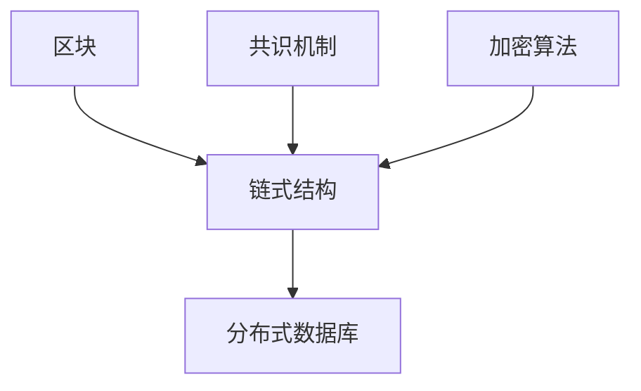
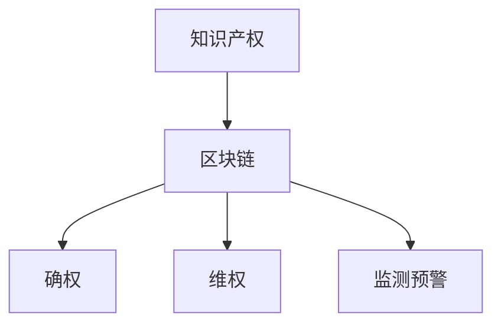

                 

：

### 概述：区块链与知识产权保护的融合背景

在当今数字经济迅速发展的背景下，知识产权保护面临着前所未有的挑战。随着互联网的普及和数字化的加速，知识产品和信息内容的传播速度大幅提升，但随之而来的侵权行为也日益猖獗。传统的知识产权保护手段，如法律诉讼、版权登记等，由于效率低、成本高且难以溯源，已经无法满足现代社会的需求。区块链技术的出现，为知识产权保护提供了一种全新的思路和解决方案。

#### 1.1 区块链技术概述

区块链是一种去中心化的分布式数据库技术，通过加密算法和时间戳技术，确保数据的不可篡改性和透明性。区块链的核心组成部分包括区块、链式结构、共识机制和加密算法。

- **Mermaid 流程图：**


区块链通过去中心化的方式，将数据分散存储在不同的节点上，从而避免了单点故障和中心化的风险。同时，加密算法和时间戳技术确保了数据的完整性和可信度，使得篡改和伪造行为难以实现。

#### 1.2 区块链与知识产权保护的关系

区块链在知识产权保护中的应用主要体现在以下几个方面：

1. **确权**：通过区块链技术，可以实现对知识产权的永久性和不可篡改的确权，确保知识产权的归属明确。
2. **维权**：区块链技术可以提供证据链，方便权利人在侵权发生时迅速取证和维权。
3. **监测与预警**：通过区块链技术，可以实现对知识产权的实时监测和预警，提前发现潜在的侵权行为。

#### 1.3 核心概念与联系

- **知识产权**：知识产权是指人们就其智力劳动成果所依法享有的专有权利，通常包括专利、商标、著作权、商业秘密等。
- **区块链**：区块链是一种分布式数据库技术，通过加密算法和时间戳技术确保数据的不可篡改性和透明性。

- **核心概念联系 Mermaid 流程图：**


通过区块链技术，可以实现对知识产权的全生命周期管理，从而提高知识产权的保护水平。

#### 1.4 核心算法原理讲解

- **知识产权确权算法伪代码：**
```python
def intellectual_property_jwt(owner, content, timestamp):
    # 使用JSON Web Token (JWT) 进行确权
    token = jwt.encode({
        'owner': owner,
        'content': content,
        'timestamp': timestamp
    }, 'secret_key')
    return token
```

- **详细讲解：**
该算法使用 JSON Web Token（JWT）进行知识产权确权。JWT 是一种用于传输声明（assertion）的开放标准（RFC 7519），通常使用JWT对知识产权内容进行签名，确保其归属和创建时间。

- **数学模型和公式：**
$$
\text{知识产权确权强度} = \log_2(\text{加密算法安全性} \times \text{区块链网络规模})
$$

- **举例说明：**
假设使用 SHA-256 算法进行签名，区块链网络规模为 1000 个节点，则知识产权确权强度为：
$$
\text{知识产权确权强度} = \log_2(2^{256} \times 1000) \approx 377.5
$$

#### 1.5 项目实战：区块链知识产权保护系统

- **开发环境搭建：**
  - 使用 Node.js 搭建区块链节点
  - 使用 Solidity 编写智能合约
  - 使用 Web3.js 实现与区块链的交互

- **源代码详细实现和代码解读：**
  - 区块链节点代码解读
  - 智能合约代码解读

- **代码应用解读与分析：**
  - 智能合约如何处理知识产权交易
  - 系统如何实现知识产权的监测与预警

- **实际案例分析和详细讲解剖析：**
  - 区块链在版权保护中的应用案例
  - 区块链在商标侵权纠纷中的应用案例

- **项目小结：**
  - 项目中遇到的问题与解决方案
  - 区块链在知识产权保护中的潜在价值

#### 1.6 最佳实践 tips

- **小结：**
  - 区块链技术在知识产权保护中的应用具有巨大潜力，但仍需克服技术、法律等方面的挑战。

- **注意事项：**
  - 确保区块链网络的稳定性和安全性
  - 关注法律法规的动态变化，及时调整保护策略

- **拓展阅读：**
  - 《区块链：从数字货币到知识产权保护》
  - 《知识产权保护与区块链技术》

### 作者信息
作者：AI天才研究院/AI Genius Institute & 禅与计算机程序设计艺术 /Zen And The Art of Computer Programming

