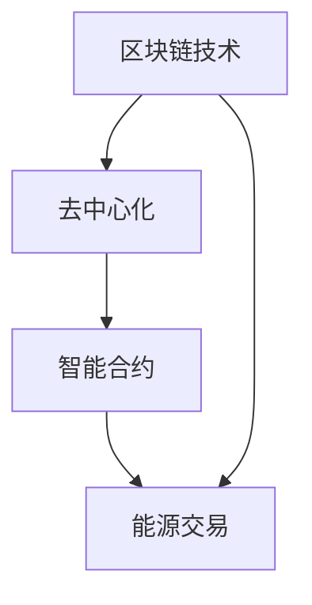

                 


### 1. 背景介绍

在过去的几年里，区块链技术以其独特的去中心化特性、透明性和不可篡改性在全球范围内引起了广泛关注。随着能源行业的不断发展和对可持续能源需求的增长，区块链技术在能源交易中的应用逐渐成为了一个热门话题。

能源交易是能源行业的重要环节，涵盖了能源的生产、分配和消费。传统的能源交易依赖于中心化的机构或平台进行协调，这不仅导致了高成本、低效率和透明度不足的问题，而且也容易成为恶意攻击和欺诈的温床。为了解决这些问题，去中心化的区块链技术被提出作为一种潜在解决方案。

去中心化的能源交易利用区块链技术，实现了能源交易的去中心化、透明化和自动化。在区块链网络中，所有的交易数据都是公开透明的，每个参与者都可以查看和验证交易信息。此外，智能合约技术的引入，使得能源交易可以在无需第三方中介的情况下自动执行，从而降低了交易成本和风险。

目前，许多国家和地区已经开始尝试将区块链技术应用于能源交易领域。例如，荷兰的Energiesprong项目利用区块链技术实现了智能家居的能源交易，而澳大利亚的Power Ledger则通过区块链平台实现了可再生能源的买卖。

### 2. 核心概念与联系

在探讨区块链在能源交易中的应用之前，我们首先需要理解一些核心概念，并探讨它们之间的联系。

**区块链技术**：区块链是一种分布式账本技术，它通过加密算法和共识机制保证了数据的安全性和不可篡改性。区块链由多个区块组成，每个区块都包含了若干交易记录，这些区块按照时间顺序链接在一起，形成了一条不断增长的链。

**去中心化**：去中心化是指网络中没有中心化的控制节点，所有节点都有平等的地位，共同维护网络的安全和运行。与传统的中心化系统相比，去中心化系统具有更高的可靠性和透明性。

**智能合约**：智能合约是区块链上的自动执行合约，它通过编程语言编写，可以在满足特定条件时自动执行。智能合约的出现，使得交易可以在无需人工干预的情况下进行，从而提高了效率和减少了风险。

**能源交易**：能源交易是指能源的生产者、消费者和分销商之间进行能源交换的过程。传统的能源交易依赖于中心化的市场进行协调，而区块链技术可以提供一种去中心化的解决方案。

**核心概念之间的关系**：区块链技术实现了数据的去中心化存储，智能合约则实现了交易的自动化执行。通过将区块链与智能合约结合起来，我们可以实现能源交易的去中心化、透明化和自动化。具体来说，区块链用于存储能源交易的数据，而智能合约则用于自动执行交易规则。

下面是一个简化的 Mermaid 流程图，展示了核心概念之间的联系：



### 3. 核心算法原理讲解

区块链技术中的核心算法主要包括加密算法、共识机制和智能合约编程语言。

**加密算法**：区块链采用加密算法来保护数据的完整性和隐私性。常用的加密算法包括哈希算法（如SHA-256）和椭圆曲线加密算法（如ECDSA）。哈希算法用于生成数据摘要，确保数据在传输过程中不被篡改。椭圆曲线加密算法则用于数字签名和身份验证。

**共识机制**：共识机制是区块链网络中所有节点达成共识的一种算法。常见的共识机制包括工作量证明（PoW）、权益证明（PoS）和委托权益证明（DPoS）。这些机制通过竞争或投票的方式，确保区块链网络中的数据一致性和安全性。

**智能合约编程语言**：智能合约是区块链上的自动执行合约，其编程语言通常是基于图灵完备的。目前常用的智能合约编程语言包括Solidity（用于以太坊）和NeoVM（用于NEO）。下面是一个简单的智能合约伪代码示例：

```solidity
pragma solidity ^0.8.0;

contract EnergyTrade {
    mapping(address => uint256) public balances;

    function deposit() public payable {
        balances[msg.sender()] += msg.value;
    }

    function trade(address receiver, uint256 amount) public {
        require(balances[msg.sender()] >= amount, "Insufficient balance");
        balances[msg.sender()] -= amount;
        balances[receiver] += amount;
    }
}
```

这个智能合约定义了一个简单的能源交易平台，用户可以通过`deposit`函数存款，并通过`trade`函数与其他用户进行能源交易。在交易时，智能合约会检查发送方的余额是否足够，然后自动执行交易并更新双方的余额。

### 4. 数学模型和公式

在区块链和智能合约中，数学模型和公式被广泛应用于数据加密、共识机制和智能合约逻辑的验证。以下是一些常见的数学模型和公式：

**哈希函数**：哈希函数是一种将任意长度的数据映射为固定长度数据的函数。在区块链中，常用的哈希函数包括SHA-256和SHA-3。

$$
H = SHA-256(D)
$$

其中，$H$ 是生成的哈希值，$D$ 是原始数据。

**椭圆曲线加密算法**：椭圆曲线加密算法是一种基于椭圆曲线离散对数问题的密码学算法。椭圆曲线加密算法的密钥生成和签名验证可以使用以下数学公式：

$$
kG = Q
$$

$$
r = s = 0
$$

$$
r = zGx
$$

$$
s = zGy
$$

其中，$G$ 是椭圆曲线基点，$k$ 是私钥，$Q$ 是公钥，$r$ 和 $s$ 是签名，$x$ 和 $y$ 是椭圆曲线上点的坐标。

**工作量证明**：工作量证明（PoW）是一种共识机制，要求节点解决一个计算难题，以证明其工作量。常用的PoW算法包括比特币的SHA-256算法。

$$
Proof\_of\_Work = hash(nonce, previous\_hash, etc.) < target
$$

其中，$nonce$ 是随机数，$previous\_hash$ 是前一区块的哈希值，$target$ 是目标值。

**权益证明**：权益证明（PoS）是一种替代PoW的共识机制，要求节点根据其在区块链上的权益（如持有的代币数量）参与共识。权益证明可以使用以下数学模型：

$$
Probability = \frac{Stake}{Total\_Stake}
$$

其中，$Stake$ 是节点的权益，$Total\_Stake$ 是所有节点的权益总和。

通过这些数学模型和公式，区块链和智能合约可以实现数据的安全存储、交易的自动化执行和网络的共识。

### 5. 项目实战

为了更好地理解区块链在能源交易中的应用，我们来看一个实际的项目案例：一个基于区块链的太阳能发电交易平台。

**项目目标**：该项目旨在通过区块链技术实现太阳能发电的自动化交易，降低交易成本，提高交易效率。

**开发环境**：使用以太坊区块链和Solidity语言进行开发。环境包括Node.js、Truffle、Ganache等工具。

**源代码实现**：

```solidity
pragma solidity ^0.8.0;

contract SolarTrade {
    mapping(address => uint256) public balances;

    function deposit() public payable {
        balances[msg.sender()] += msg.value;
    }

    function trade(address receiver, uint256 amount) public {
        require(balances[msg.sender()] >= amount, "Insufficient balance");
        balances[msg.sender()] -= amount;
        balances[receiver] += amount;
        emit TradeEvent(msg.sender(), receiver, amount);
    }

    event TradeEvent(address sender, address receiver, uint256 amount);
}
```

在这个智能合约中，用户可以通过`deposit`函数存款，并通过`trade`函数与其他用户进行能源交易。每次交易都会触发一个事件`TradeEvent`，便于追踪和审计。

**代码解读**：

- `mapping(address => uint256) public balances;`：定义一个地址到余额的映射，用于存储用户的余额。
- `function deposit() public payable { ... }`：存款函数，接收以太币并更新用户的余额。
- `function trade(address receiver, uint256 amount) public { ... }`：交易函数，检查发送方的余额是否足够，然后执行交易并更新双方的余额。
- `event TradeEvent(address sender, address receiver, uint256 amount);`：定义一个事件，用于记录交易信息。

**应用解读与分析**：

- 通过区块链和智能合约，用户可以安全地存储和转移能源，无需依赖第三方中介。
- 交易记录公开透明，便于追踪和审计。
- 交易过程自动化，减少了人工干预，提高了效率。

**项目小结**：

通过这个实际项目，我们可以看到区块链在能源交易中的应用具有很大的潜力。它不仅降低了交易成本，提高了交易效率，而且通过智能合约实现了交易的自动化和透明化。未来，随着区块链技术的进一步发展和成熟，能源交易领域的去中心化应用将更加广泛和深入。

### 6. 最佳实践 Tips、小结、注意事项

**最佳实践 Tips**：

1. 在设计去中心化能源交易平台时，确保系统的安全性。使用强加密算法保护数据，并定期进行安全审计。
2. 采用可靠的共识机制，以保障网络的稳定性和安全性。
3. 设计易于使用的用户界面，提高用户体验。
4. 与现有能源交易平台和标准进行整合，以实现更广泛的互操作性。

**小结**：

区块链技术在能源交易中具有巨大的应用潜力，通过去中心化、透明化和自动化的特点，可以有效降低交易成本和风险。然而，实现这一目标需要解决安全性、稳定性和互操作性等挑战。

**注意事项**：

1. 在引入区块链技术时，需要充分考虑法律法规和监管要求。
2. 区块链技术并非万能，某些传统中心化系统在特定场景下可能更加适合。
3. 设计和实施区块链应用时，需要充分考虑性能和可扩展性。

**拓展阅读**：

- 《区块链：从技术到实践》
- 《智能合约与去中心化应用开发》
- 《能源互联网：技术、经济与政策》

通过以上内容，我们可以看到区块链在能源交易中的去中心化应用具有广阔的前景。未来，随着技术的不断发展和成熟，区块链将在能源领域发挥更大的作用。

