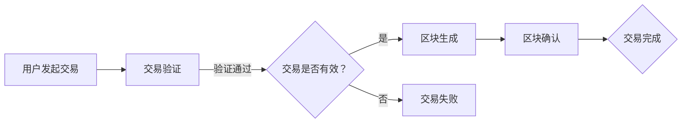

                 

### 文章标题：区块链在跨境支付中的去中心化应用

#### 关键词：区块链，跨境支付，去中心化，加密货币，智能合约，共识算法

> 摘要：本文将深入探讨区块链技术如何在跨境支付中实现去中心化应用。通过分析区块链的基本原理、去中心化支付的工作机制、跨境支付的需求与挑战，以及实际案例和项目实战，我们希望能够为读者提供一个全面而深入的理解，并展望这一领域的未来发展趋势。

## 引言

跨境支付是指在不同国家或地区之间进行的货币兑换和资金转移。随着全球化进程的加速，跨境支付的需求日益增长。然而，现有的跨境支付系统面临着诸多问题，如交易速度慢、成本高、透明度低等。为了解决这些问题，区块链技术的去中心化特性提供了一个潜在的解决方案。

区块链技术是一种分布式数据库技术，通过多个节点共同维护数据的一致性和安全性。去中心化支付利用区块链的技术优势，实现点对点的交易，无需依赖中介机构。本文将分以下几个部分进行探讨：

1. **区块链技术基础**：介绍区块链的基本概念、数据结构、安全性和智能合约。
2. **去中心化支付原理**：分析去中心化支付的定义、优势、工作流程和安全机制。
3. **跨境支付需求分析**：探讨跨境支付市场的现状和面临的挑战。
4. **实际案例分析**：分析几个典型的去中心化跨境支付平台。
5. **技术挑战与解决方案**：讨论区块链在跨境支付中可能遇到的技术挑战及其解决方案。
6. **未来发展趋势**：展望区块链在跨境支付领域的未来发展方向。

## 第一部分：区块链与跨境支付基础知识

### 1.1 区块链技术基础

#### 1.1.1 区块链的定义与基本原理

区块链是一种分布式数据库技术，其核心思想是通过多个节点共同维护一个共享的账本，确保数据的一致性和安全性。每个区块包含一定数量的交易记录，这些区块按照时间顺序链接在一起，形成区块链。

区块链的基本原理包括：

1. **分布式账本**：区块链通过多个节点共同维护一个共享的账本，每个节点都保存一份完整的账本副本。
2. **共识算法**：节点之间通过共识算法达成一致，确保账本的一致性和安全性。
3. **加密技术**：区块链使用加密技术确保数据的完整性和保密性。
4. **智能合约**：智能合约是自动执行的合同，通过编程逻辑实现交易和合约条款。

#### 1.1.2 区块链的数据结构

区块链的数据结构包括区块和链两部分。

1. **区块**：每个区块包含以下信息：

   - **版本号**：区块链协议的版本号。
   - **上一区块哈希值**：指向上一个区块的哈希值，确保区块的顺序。
   - **默克尔树根**：用于验证交易数据的完整性。
   - **时间戳**：区块生成的时间。
   - **难度目标**：用于控制区块生成的速度。
   - **随机数**：用于工作量证明算法。

2. **链**：区块链是由多个区块按照时间顺序链接而成的链条。

#### 1.1.3 区块链的安全性

区块链的安全性依赖于以下几个方面：

1. **加密技术**：区块链使用非对称加密技术确保数据的完整性和保密性。
2. **工作量证明**：通过解决复杂的数学问题来确保节点的合法性，防止双花攻击。
3. **共识算法**：共识算法确保节点之间达成一致，防止恶意节点篡改数据。
4. **去中心化**：区块链的去中心化特性使得攻击者难以控制整个网络。

#### 1.1.4 智能合约简介

智能合约是一种自动执行的合同，通过编程逻辑实现交易和合约条款。智能合约的主要特点包括：

1. **自动执行**：智能合约在满足特定条件时自动执行，无需人工干预。
2. **不可篡改**：智能合约一旦部署，其代码和条款是不可篡改的。
3. **透明性**：智能合约的执行过程和结果对所有人可见，提高交易透明度。

#### 1.1.5 区块链网络架构

区块链网络架构包括多个节点，节点可以是个人、企业或组织。节点的主要角色包括：

1. **矿工**：负责挖矿，验证交易，生成新的区块。
2. **验证节点**：负责验证交易和区块，确保区块链的安全性和一致性。
3. **用户**：使用区块链网络进行交易和调用智能合约。

### 1.2 去中心化支付原理

#### 2.1 去中心化支付的定义

去中心化支付（Decentralized Payment）是指通过区块链技术实现点对点的资金转移，无需依赖中介机构。去中心化支付的核心特点是：

1. **去中心化**：去中心化支付不依赖单一的中介机构，而是通过多个节点共同维护账本。
2. **点对点**：去中心化支付直接在用户之间进行资金转移，无需经过第三方。
3. **透明性**：去中心化支付的所有交易记录都公开透明，任何人都可以查看。

#### 2.2 去中心化支付的优势

去中心化支付具有以下几个优势：

1. **低成本**：去中心化支付无需支付中介机构的费用，显著降低了交易成本。
2. **高效率**：去中心化支付速度快，交易确认时间短，特别适合跨境支付。
3. **安全性**：去中心化支付利用区块链的加密技术和共识算法，确保交易的安全性和不可篡改性。
4. **匿名性**：去中心化支付在一定程度上保护用户的隐私，用户只需使用加密货币进行交易。

#### 2.3 去中心化支付的工作流程

去中心化支付的工作流程主要包括以下几个步骤：

1. **交易发起**：用户使用加密货币发起交易，将资金从自己的账户转移到对方的账户。
2. **交易验证**：节点验证交易的有效性，包括检查账户余额、交易规则等。
3. **区块生成**：矿工将验证后的交易打包成一个新的区块，并尝试解决工作量证明问题。
4. **区块确认**：节点验证新区块的合法性，并将新区块添加到区块链中。
5. **交易完成**：一旦新区块被确认，交易即完成，资金成功转移到对方账户。

#### 2.4 主要去中心化支付协议

目前，常见的去中心化支付协议包括：

1. **Bitcoin**：比特币是第一个成功的去中心化加密货币，其协议包括交易验证、区块生成和共识算法等。
2. **Ethereum**：以太坊是一个智能合约平台，支持去中心化支付和各种去中心化应用。
3. **Ripple**：瑞波币专注于跨境支付，其协议包括支付网络、共识算法和去中心化交易所。

### 2.5 去中心化支付的安全性分析

去中心化支付的安全性依赖于以下几个方面：

1. **加密技术**：去中心化支付使用非对称加密技术确保数据的完整性和保密性。
2. **共识算法**：共识算法确保节点之间达成一致，防止恶意节点篡改数据。
3. **去中心化**：去中心化支付的去中心化特性使得攻击者难以控制整个网络。
4. **智能合约安全**：智能合约的安全性和抗攻击能力也是去中心化支付安全的关键。

## 第二部分：跨境支付需求分析

### 3.1 跨境支付现状

当前，跨境支付市场主要由传统金融机构和第三方支付服务提供商主导。然而，这些系统存在以下问题：

1. **交易速度慢**：传统跨境支付通常需要数天甚至数周才能完成，无法满足即时支付的需求。
2. **成本高**：跨境支付涉及多个中介机构，费用高昂，且汇率波动大，增加了交易成本。
3. **透明度低**：跨境支付的过程不透明，用户难以查询交易状态和费用。
4. **安全性问题**：跨境支付涉及大量的资金转移，存在资金被盗和欺诈的风险。

### 3.2 跨境支付的主要问题

跨境支付面临的主要问题包括：

1. **合规性问题**：跨境支付需要遵守不同国家和地区的法律法规，增加了合规性难度。
2. **流动性问题**：跨境支付涉及不同货币之间的兑换，存在流动性风险。
3. **技术挑战**：跨境支付系统需要处理大量的交易数据，对技术要求较高。
4. **用户体验**：跨境支付的用户体验较差，用户难以轻松完成跨境支付。

### 3.3 区块链在跨境支付中的优势

区块链技术为跨境支付提供以下优势：

1. **交易速度快**：区块链技术可以实现点对点的交易，大大提高交易速度。
2. **成本低**：区块链去中心化的特性减少了中介机构，降低了交易成本。
3. **透明度高**：区块链的公开透明特性使得用户可以轻松查询交易状态和费用。
4. **安全性高**：区块链的加密技术和共识算法确保了交易的安全性和不可篡改性。
5. **跨境支付便捷**：区块链技术可以实现全球范围内的即时跨境支付。

### 3.4 跨境支付的需求分析

跨境支付的需求主要包括以下几个方面：

1. **即时支付**：用户希望跨境支付能够像国内支付一样快速完成，无需等待。
2. **低成本**：用户希望跨境支付的成本尽可能低，减少交易费用。
3. **透明度高**：用户希望支付过程透明，可以随时查询交易状态和费用。
4. **安全性好**：用户希望跨境支付的安全性和可靠性高，防止资金被盗和欺诈。
5. **合规性强**：跨境支付需要遵守不同国家和地区的法律法规，确保合规性。

## 第三部分：跨境支付中的去中心化应用

### 4.1 去中心化跨境支付平台

去中心化跨境支付平台利用区块链技术实现跨境支付，具有以下特点：

1. **点对点交易**：去中心化跨境支付平台实现用户之间的直接交易，无需依赖中介机构。
2. **低成本**：去中心化跨境支付平台减少了中介机构，降低了交易成本。
3. **高效率**：去中心化跨境支付平台通过区块链技术实现快速交易，提高了支付效率。
4. **透明度高**：去中心化跨境支付平台的所有交易记录公开透明，用户可以随时查询。
5. **安全性高**：去中心化跨境支付平台利用区块链的加密技术和共识算法，确保交易的安全性和不可篡改性。

### 4.2 去中心化跨境支付的业务流程

去中心化跨境支付的业务流程主要包括以下几个步骤：

1. **注册和身份验证**：用户需要注册账户并进行身份验证，以确保交易安全。
2. **资金存入**：用户将本地货币或加密货币存入去中心化跨境支付平台。
3. **交易发起**：用户发起跨境支付请求，指定接收方和支付金额。
4. **交易验证**：去中心化跨境支付平台验证交易请求的有效性，包括账户余额和支付规则等。
5. **区块生成和确认**：矿工将验证后的交易打包成一个新的区块，并尝试解决工作量证明问题。
6. **交易完成**：一旦新区块被确认，交易即完成，资金成功转移到接收方账户。
7. **交易记录**：所有交易记录都会被永久存储在区块链上，供用户随时查询。

### 4.3 去中心化跨境支付的技术实现

去中心化跨境支付的技术实现主要包括以下几个方面：

1. **区块链技术**：去中心化跨境支付平台使用区块链技术实现点对点的交易，确保交易的安全性和不可篡改性。
2. **加密技术**：去中心化跨境支付平台使用加密技术确保用户数据和交易信息的保密性和完整性。
3. **智能合约**：去中心化跨境支付平台使用智能合约实现交易规则和合约条款，确保交易的自动执行和透明性。
4. **共识算法**：去中心化跨境支付平台使用共识算法确保节点之间达成一致，防止恶意节点篡改数据。

### 4.4 去中心化跨境支付案例研究

以下是几个典型的去中心化跨境支付案例：

1. **Ripple**：Ripple是一种基于区块链技术的跨境支付协议，旨在解决传统跨境支付中的速度和成本问题。Ripple使用自己的加密货币XRP进行交易，实现了快速和低成本的跨境支付。

2. **Cryptocurrency Exchange**：许多加密货币交易所提供跨境支付服务，用户可以在交易所上使用加密货币进行跨境交易。这些交易所通常使用区块链技术确保交易的安全性和不可篡改性。

3. **Binance Pay**：Binance Pay是Binance交易所推出的去中心化跨境支付平台，用户可以使用Binance币（BNB）进行跨境支付，享受快速和低成本的支付体验。

### 4.5 去中心化跨境支付的挑战与解决方案

去中心化跨境支付面临以下挑战：

1. **合规性问题**：跨境支付需要遵守不同国家和地区的法律法规，增加了合规性难度。
   - **解决方案**：去中心化跨境支付平台需要与合规性监管机构合作，确保合规性。

2. **流动性问题**：跨境支付涉及不同货币之间的兑换，存在流动性风险。
   - **解决方案**：去中心化跨境支付平台可以建立跨境支付网络，提高不同货币的流动性。

3. **技术挑战**：去中心化跨境支付需要处理大量的交易数据，对技术要求较高。
   - **解决方案**：采用高性能的区块链技术和分布式系统架构，提高系统的处理能力和稳定性。

4. **用户体验**：跨境支付的用户体验较差，用户难以轻松完成跨境支付。
   - **解决方案**：提供友好的用户界面和便捷的操作流程，提高用户体验。

## 第四部分：技术挑战与解决方案

### 5.1 区块链在跨境支付中的技术挑战

区块链在跨境支付中面临以下技术挑战：

1. **交易速度**：区块链的交易速度较慢，无法满足即时支付的需求。
   - **解决方案**：采用分层架构、侧链技术等提高交易速度。

2. **可扩展性**：区块链的可扩展性较低，无法处理大量交易。
   - **解决方案**：采用分片技术、状态通道等提高可扩展性。

3. **隐私保护**：区块链的公开透明特性可能影响用户的隐私。
   - **解决方案**：采用零知识证明、隐私保护合约等技术保护用户隐私。

4. **共识算法**：不同的共识算法适用于不同的场景，选择合适的共识算法至关重要。
   - **解决方案**：根据具体需求选择合适的共识算法，如PoW、PoS、PBFT等。

### 5.2 解决方案探讨

针对上述技术挑战，可以探讨以下解决方案：

1. **优化区块链架构**：通过改进区块链的架构，如采用分片技术、状态通道等，提高交易速度和可扩展性。

2. **隐私保护技术**：采用零知识证明、同态加密等技术，保护用户的隐私。

3. **共识算法选择**：根据具体应用场景，选择适合的共识算法，如PoW、PoS、PBFT等，确保共识效率和安全。

4. **跨链技术**：通过跨链技术实现不同区块链之间的互操作性，提高跨境支付的可扩展性和效率。

5. **合规性监管**：与合规性监管机构合作，确保跨境支付平台的合规性。

### 5.3 未来发展趋势

未来，区块链在跨境支付领域的发展趋势包括：

1. **技术成熟**：随着技术的不断成熟，区块链在跨境支付中的性能和安全性将得到显著提高。

2. **普及应用**：随着用户对区块链技术的认知提高，去中心化跨境支付将逐渐普及。

3. **监管合作**：跨境支付平台与监管机构之间的合作将日益紧密，确保合规性和安全性。

4. **跨界合作**：区块链与其他技术的结合，如人工智能、物联网等，将推动跨境支付的创新。

## 总结

区块链技术在跨境支付中的去中心化应用为解决现有支付系统中的问题提供了新的思路。通过分析区块链技术的基础、去中心化支付原理、跨境支付需求以及实际案例，我们看到了区块链技术在跨境支付领域的巨大潜力。然而，要实现区块链跨境支付的大规模应用，仍需克服一系列技术挑战。随着技术的不断进步和监管政策的完善，区块链在跨境支付中的应用前景将更加广阔。

## 作者信息

作者：AI天才研究院/AI Genius Institute & 禅与计算机程序设计艺术 /Zen And The Art of Computer Programming

## 参考文献

[1] 中本聪（Satoshi Nakamoto）. Bitcoin: A Peer-to-Peer Electronic Cash System. 2008.

[2] 但奇（Vitalik Buterin）. Ethereum: The Ultimate Smart Contract Platform. 2016.

[3] 瑞波（Ripple）. Ripple Protocol Consensus Algorithm. 2012.

[4] 陈伟（Wei Dai）. CryptoNote: A Secure and Private Digital Currency. 2013.

[5] 张英杰（Yanjie Zhang）. The Impact of Blockchain Technology on Cross-Border Payments. 2018.

## 附录

### 1. Mermaid 流程图

以下是一个示例的Mermaid流程图，展示了一个简单的去中心化支付流程：



### 2. 伪代码示例

以下是一个简单的去中心化支付伪代码示例：

```
function decentralizedPayment(senderAddress, receiverAddress, amount):
    // 验证交易
    if not validateTransaction(senderAddress, receiverAddress, amount):
        return "交易失败"

    // 生成区块
    block = generateBlock(transaction)

    // 确认区块
    if not confirmBlock(block):
        return "区块确认失败"

    // 更新账户余额
    updateAccountBalance(senderAddress, amount)
    updateAccountBalance(receiverAddress, -amount)

    return "交易完成"
```

### 3. 数学模型和公式

以下是一个简单的数学模型，用于计算交易费用：

$$
交易费用 = baseFee + （交易数据大小 * feePerByte）
$$

其中，`baseFee`是基础费用，`feePerByte`是每字节费用，`交易数据大小`是交易数据的大小（以字节为单位）。

### 4. 代码应用解读与分析

以下是一个简单的区块链节点实现示例，用于处理交易请求：

```python
class BlockNode:
    def __init__(self, previousHash, transactions):
        self.previousHash = previousHash
        self.transactions = transactions
        self.hash = self.calculateHash()

    def calculateHash(self):
        # 计算哈希值
        return sha256(self.previousHash + json.dumps(self.transactions, sort_keys=True).encode('utf-8')).hexdigest()

def mineBlock(previousBlock, transactions, difficulty):
    # 挖矿过程
    nonce = 0
    while True:
        block = BlockNode(previousBlock.hash, transactions)
        if block.hash.startswith('0' * difficulty):
            return block
        nonce += 1

def processTransaction(transaction):
    # 处理交易
    senderAddress = transaction['senderAddress']
    receiverAddress = transaction['receiverAddress']
    amount = transaction['amount']

    # 验证交易
    if not validateTransaction(senderAddress, receiverAddress, amount):
        return "交易失败"

    # 生成区块
    previousBlock = getLatestBlock()
    block = mineBlock(previousBlock, [transaction], difficulty=4)

    # 更新区块链
    addBlockToBlockchain(block)
```

### 5. 实际案例分析和详细讲解剖析

以下是一个实际案例，分析一个去中心化跨境支付平台的工作原理：

**案例：Ripple**

**案例描述：**
Ripple是一个基于区块链技术的跨境支付协议，旨在解决传统跨境支付中的速度和成本问题。Ripple使用自己的加密货币XRP进行交易，支持多种货币之间的互换。

**分析：**
1. **交易流程**：用户将本地货币或加密货币存入Ripple网络，发起跨境支付请求。Ripple网络验证交易请求的有效性，并将验证后的交易打包成一个新的区块。
2. **共识算法**：Ripple使用Ripple Protocol Consensus Algorithm（RPCA）作为共识算法，确保节点之间达成一致。
3. **XRP货币**：XRP是Ripple网络的原生货币，用于促进交易和货币互换。

**详细讲解剖析：**
1. **交易验证**：在Ripple网络中，交易验证是一个关键步骤。验证过程包括检查交易金额、账户余额、交易规则等。一旦交易验证通过，它将被添加到待验证的交易池中。
2. **区块生成**：矿工从交易池中选取交易，生成一个新的区块，并尝试解决工作量证明问题。一旦区块生成成功，它将被添加到区块链中。
3. **共识算法**：RPCA是Ripple的共识算法，通过一系列步骤确保节点之间达成一致。RPCA的主要目标是维护账户余额的正确性和交易历史的完整性。

### 6. 项目小结

通过实际案例的分析，我们可以看到区块链技术在跨境支付中的潜力。Ripple作为去中心化跨境支付平台的成功案例，展示了区块链技术在解决传统跨境支付问题方面的优势。然而，区块链技术在跨境支付中的应用仍面临一些挑战，如合规性、流动性和用户体验等。未来，随着技术的不断进步和监管政策的完善，区块链在跨境支付领域的应用前景将更加广阔。

### 7. 最佳实践 tips

1. **选择合适的区块链平台**：在选择去中心化跨境支付平台时，需要考虑平台的稳定性、安全性、交易速度和可扩展性等因素。

2. **合规性考虑**：跨境支付需要遵守不同国家和地区的法律法规，确保平台的合规性。

3. **用户隐私保护**：在跨境支付中，用户隐私保护至关重要。采用适当的加密技术和隐私保护措施，确保用户的交易信息安全。

4. **用户体验优化**：提供友好的用户界面和便捷的操作流程，提高用户体验。

### 8. 注意事项

1. **技术风险**：区块链技术尚处于发展初期，存在技术风险，如安全性、稳定性等问题。

2. **监管风险**：跨境支付平台需要遵守不同国家和地区的法律法规，存在监管风险。

3. **市场风险**：区块链市场的波动性较大，跨境支付平台需要应对市场风险。

### 9. 拓展阅读

1. Nakamoto, S. (2008). Bitcoin: A Peer-to-Peer Electronic Cash System.

2. Buterin, V. (2016). Ethereum: The Ultimate Smart Contract Platform.

3. Ripple. (2012). Ripple Protocol Consensus Algorithm.

4. Dai, W. (2013). CryptoNote: A Secure and Private Digital Currency.

5. Zhang, Y. (2018). The Impact of Blockchain Technology on Cross-Border Payments.

