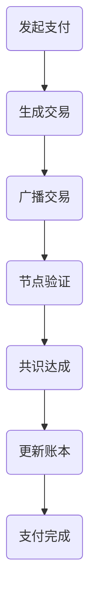

                 


### 引言

随着全球化的加速，跨境支付在促进国际贸易和金融交流中发挥着越来越重要的作用。然而，传统跨境支付系统面临诸多挑战，如交易速度慢、手续费高、监管困难等。区块链技术的兴起，为解决这些问题提供了新的可能性。本文将深入探讨区块链在跨境支付中的应用，通过逻辑清晰、结构紧凑的分析，揭示区块链技术的优势以及其在跨境支付中的实际应用案例。

关键词：区块链、跨境支付、共识机制、智能合约、加密技术

摘要：本文首先介绍了跨境支付的现状和区块链技术的概述，随后详细分析了区块链在跨境支付中的潜在优势。接着，我们讨论了区块链与跨境支付的核心概念、网络架构以及支付流程。然后，我们深入讲解了区块链在跨境支付中的核心算法，包括共识机制、智能合约和加密技术。接下来，我们通过实际案例分析了区块链跨境支付的优势与挑战。最后，我们对区块链跨境支付的未来发展进行了展望，并提供了实践指南。

## 第1章 引言

### 1.1 跨境支付背景与现状

跨境支付是指在不同国家或地区之间的货币转移和支付过程。随着全球经济的互联互通，跨境支付的需求日益增长。传统的跨境支付系统主要依赖于银行和支付服务提供商，这些系统通常存在以下问题：

- **交易速度慢**：传统跨境支付通常需要数天时间才能完成，这限制了资金流动的效率。

- **手续费高**：银行和支付服务提供商通常会收取较高的手续费，这增加了企业的成本。

- **监管困难**：跨境支付涉及多个国家和地区的监管法规，合规成本高，监管难度大。

- **透明度低**：传统跨境支付系统的交易记录不透明，难以追踪和审计。

### 1.2 区块链技术概述

区块链技术是一种分布式账本技术，其核心特点是去中心化、不可篡改和透明性。区块链由一系列按时间顺序排列的数据块组成，每个数据块包含一定数量的交易记录。区块链网络中的节点共同维护账本的一致性，通过共识算法达成一致。

### 1.3 区块链在跨境支付中的潜在优势

区块链技术在跨境支付中的应用具有显著的优势：

- **提高交易速度**：区块链技术可以实现实时支付，大大缩短了交易时间。

- **降低手续费**：去中心化的特性减少了中间环节，降低了交易成本。

- **增强安全性**：区块链的加密技术和共识算法确保了支付的安全性和不可篡改性。

- **提升透明度**：区块链的透明性使得交易记录可追溯，提高了监管的透明度。

## 第2章 区块链与跨境支付

### 2.1 区块链的核心概念

区块链的核心概念包括：

- **区块**：区块是区块链的基本单位，包含一定数量的交易记录。

- **链**：区块链是由一系列按时间顺序排列的区块组成的数据结构。

- **共识算法**：共识算法是区块链网络中节点达成一致的方法，如PoW、PoS等。

- **加密技术**：区块链使用加密技术保护交易的安全性和隐私性。

### 2.2 区块链网络架构

区块链网络通常包括以下组成部分：

- **节点**：节点是区块链网络中的参与方，负责维护账本的一致性。

- **矿工**：矿工是区块链网络中的特殊节点，负责验证交易和创建新区块。

- **区块链浏览器**：区块链浏览器是一种工具，用于查看和追踪区块链上的交易记录。

### 2.3 跨境支付流程中的区块链应用

区块链在跨境支付中的应用流程如下：

- **发起支付**：用户发起跨境支付请求。

- **生成交易**：支付系统将请求转换为交易，并将交易添加到区块链网络中。

- **广播交易**：交易在网络中广播，所有节点接收并处理交易。

- **节点验证**：节点验证交易的有效性，确保交易未被重复发送。

- **共识达成**：节点通过共识算法达成一致，确定交易是否被加入到区块中。

- **更新账本**：交易被加入到区块中，节点更新本地账本。

- **支付完成**：交易确认后，支付完成。

## 第3章 区块链在跨境支付中的核心算法

### 3.1 共识机制原理

共识机制是区块链网络中节点达成一致的方法，常见的共识机制包括：

- **PoW（工作量证明）**：节点通过解决数学难题来证明其工作量，率先解决难题的节点获得生成区块的权利。

- **PoS（权益证明）**：节点根据其在区块链中的权益（如持有币龄、币量）获得生成区块的权利。

- **其他共识机制**：如DPoS（委托权益证明）、PBFT（实用拜占庭容错）等。

### 3.2 智能合约原理与应用

智能合约是一种自动执行的合约，其代码存储在区块链上，并按照预定的条件自动执行。智能合约在跨境支付中的应用包括：

- **支付确认**：通过智能合约实现自动支付确认，无需人工干预。

- **跨境结算**：智能合约可以自动处理跨境结算，减少人工操作。

- **交易执行**：智能合约可以自动执行交易，确保交易的准确性和安全性。

### 3.3 区块链加密技术

区块链加密技术包括：

- **非对称加密**：使用一对密钥（公钥和私钥）实现数据的加密和解密。

- **对称加密**：使用相同的密钥实现数据的加密和解密。

- **消息摘要算法**：用于生成数据的摘要，确保数据的完整性和一致性。

## 第4章 区块链跨境支付案例分析

### 4.1 案例一：比特币支付

#### 4.1.1 案例背景

比特币是一种去中心化的数字货币，其交易通过区块链网络进行验证和确认。比特币支付是一种基于区块链技术的跨境支付方式。

#### 4.1.2 支付流程

比特币支付流程如下：

1. 发起支付：用户通过比特币钱包发起支付请求。

2. 生成交易：支付系统将请求转换为交易，并将交易广播到区块链网络。

3. 节点验证：区块链网络中的节点验证交易的有效性。

4. 共识达成：节点通过共识算法达成一致，确定交易是否被加入到区块中。

5. 更新账本：交易被加入到区块中，节点更新本地账本。

6. 支付完成：交易确认后，支付完成。

#### 4.1.3 案例分析

比特币支付具有以下优点：

- **去中心化**：比特币支付不依赖于任何中央机构，确保了交易的自主性和安全性。

- **高效性**：比特币交易通常在数分钟内完成，大大提高了交易速度。

- **低成本**：比特币支付的手续费相对较低，降低了交易成本。

### 4.2 案例二：Ripple跨境支付

#### 4.2.1 案例背景

Ripple是一种基于区块链技术的支付协议，其目标是实现快速、低成本的跨境支付。

#### 4.2.2 支付流程

Ripple跨境支付流程如下：

1. 发起支付：用户通过Ripple钱包发起支付请求。

2. 生成交易：支付系统将请求转换为交易，并将交易发送到Ripple网络。

3. 网络验证：Ripple网络中的节点验证交易的有效性。

4. 智能合约执行：智能合约自动执行交易，确保交易的准确性和安全性。

5. 更新账本：交易被确认后，节点更新本地账本。

6. 支付完成：交易完成。

#### 4.2.3 案例分析

Ripple跨境支付具有以下优点：

- **高效性**：Ripple网络可以实现秒级支付，大大提高了交易速度。

- **低成本**：Ripple的交易费用相对较低，降低了交易成本。

- **灵活性**：Ripple支持多种货币之间的直接兑换，提高了交易的灵活性。

## 第5章 区块链跨境支付的优势与挑战

### 5.1 区块链跨境支付的优势

区块链跨境支付的优势包括：

- **降低成本**：去中心化的特性减少了中间环节，降低了交易成本。

- **提高效率**：实时支付和自动化处理提高了交易效率。

- **增强安全性**：加密技术和共识算法确保了支付的安全性和不可篡改性。

- **提升透明度**：区块链的透明性提高了监管的透明度。

### 5.2 区块链跨境支付的挑战

区块链跨境支付面临的挑战包括：

- **法律法规问题**：跨境支付涉及多个国家和地区的法律法规，合规难度大。

- **技术挑战**：区块链技术仍在发展过程中，存在一定的技术瓶颈。

- **用户体验问题**：区块链技术的使用门槛较高，用户体验有待提升。

## 第6章 区块链跨境支付的未来发展

### 6.1 区块链跨境支付的趋势

区块链跨境支付的未来发展趋势包括：

- **技术创新**：随着区块链技术的发展，跨境支付将更加高效、安全和低成本。

- **政策监管**：各国政府和监管机构将逐步完善区块链跨境支付的法律法规。

- **市场竞争**：传统金融机构和新兴区块链支付平台将展开激烈的市场竞争。

### 6.2 区块链跨境支付的商业模式

区块链跨境支付的商业模式包括：

- **传统金融机构的转型**：传统金融机构将利用区块链技术优化跨境支付服务。

- **新兴区块链支付平台的崛起**：新兴区块链支付平台将提供更加高效、安全的跨境支付服务。

- **跨境电商的机遇**：区块链技术将提高跨境电商的支付效率和用户体验。

## 第7章 区块链跨境支付的实践指南

### 7.1 跨境支付项目开发流程

跨境支付项目的开发流程包括：

- **需求分析**：明确跨境支付的需求和目标。

- **技术选型**：选择合适的区块链技术和开发工具。

- **项目实施与测试**：实施项目并进行全面的测试。

### 7.2 跨境支付项目的风险管理

跨境支付项目的风险管理包括：

- **风险识别**：识别项目可能面临的风险。

- **风险评估**：评估风险的可能性和影响。

- **风险应对策略**：制定并实施风险应对策略。

## 第8章 附录

### 8.1 常用区块链开发工具与资源

- **区块链开发框架**：如Ethereum、Hyperledger Fabric等。

- **区块链浏览器**：如Block Explorer、Etherscan等。

- **区块链支付API**：如Ripple API、比特币支付API等。

### 8.2 相关法律法规介绍

- **国际支付法规**：如SWIFT规则、跨境支付监管等。

- **区块链相关法规**：如各国关于数字货币的法律法规。

- **跨境支付监管趋势**：各国政府和监管机构的监管政策和趋势。

## 原理与联系

### Mermaid 流程图：区块链在跨境支付中的流程



### 算法原理讲解

#### 伪代码：共识机制

```plaintext
Function consensusMechanism(交易列表)
    初始化节点列表N
    对于每个节点n ∈ N：
        n.验证交易列表中的交易
        如果n.验证通过：
            添加交易到n.本地账本
            广播交易到其他节点
        否则：
            拒绝交易并广播拒绝信息到其他节点
    循环执行以下步骤，直到共识达成：
        对于每个节点n ∈ N：
            如果n.本地账本与其他节点一致：
                合并本地账本到全局账本
            否则：
                根据共识规则重新达成共识
    返回全局账本
```

### 数学模型与公式

#### 数学模型：区块链交易验证

$$
验证交易（T）= 验证签名（T.Sig） \land 验证金额（T.Amt）
$$

### 详细讲解与举例

假设有一个交易 $T$，其中 $T.Sig$ 为交易签名，$T.Amt$ 为交易金额。验证交易需要同时满足以下两个条件：

1. **验证签名**：确保交易签名是由交易发起方的私钥生成，并与公钥匹配。

2. **验证金额**：确保交易金额符合协议规定的范围。

通过以上验证，交易才能被区块链网络接受和确认。

## 第9章 区块链跨境支付的案例实战

### 9.1 案例一：比特币支付

#### 9.1.1 案例背景

比特币作为一种去中心化的数字货币，其交易过程不依赖于任何中央机构，而是通过区块链网络进行验证和确认。比特币支付为跨境支付提供了一种新的解决方案，具有高效、低成本的特性。

#### 9.1.2 案例实现

以下是比特币支付的基本实现过程：

1. **创建钱包**：用户首先需要创建一个比特币钱包，钱包包含公钥和私钥。公钥用于接收比特币，私钥用于发送比特币。

2. **发起支付**：用户在比特币钱包中输入收款方的比特币地址，以及支付金额，发起支付请求。

3. **生成交易**：支付系统将用户的支付请求转换为比特币交易，并将交易信息广播到区块链网络。

4. **节点验证**：区块链网络中的节点接收交易信息，对其进行验证。验证过程包括确认交易金额、签名以及交易的有效性。

5. **共识达成**：节点通过共识算法（如PoW）达成一致，确定交易是否被加入到区块中。

6. **更新账本**：交易被加入到区块中，节点更新本地账本。

7. **支付完成**：交易确认后，支付完成。

#### 9.1.3 代码实现

以下是比特币支付交易的一个简化伪代码示例：

```plaintext
Function generateTransaction(senderAddress, receiverAddress, amount)
    transaction = new Transaction(senderAddress, receiverAddress, amount)
    transaction.sign(senderPrivateKey)
    transaction.broadcast()
End Function
```

其中，`Transaction` 类负责生成交易，并使用 `sign` 方法对交易进行签名。`broadcast` 方法将交易广播到区块链网络。

#### 9.1.4 案例分析

比特币支付具有以下优点：

- **去中心化**：比特币支付不依赖于任何中央机构，确保了交易的自主性和安全性。

- **高效性**：比特币交易通常在数分钟内完成，大大提高了交易速度。

- **低成本**：比特币支付的手续费相对较低，降低了交易成本。

然而，比特币支付也存在一定的挑战，如价格波动、匿名性等。

### 9.2 案例二：Ripple跨境支付

#### 9.2.1 案例背景

Ripple是一种基于区块链技术的支付协议，其目标是实现快速、低成本的跨境支付。Ripple网络由多个参与方组成，包括银行、支付服务提供商和用户。

#### 9.2.2 案例实现

以下是Ripple跨境支付的基本实现过程：

1. **注册Ripple账户**：用户需要在Ripple网络上注册一个账户，并获得一个Ripple地址。

2. **发起支付**：用户通过Ripple钱包发起支付请求，输入收款方的Ripple地址以及支付金额。

3. **生成交易**：支付系统将用户的支付请求转换为Ripple交易，并将交易信息发送到Ripple网络。

4. **节点验证**：Ripple网络中的节点接收交易信息，并使用智能合约进行验证。智能合约负责确保交易金额、接收方地址以及交易的有效性。

5. **共识达成**：节点通过共识算法（如Raft）达成一致，确定交易是否被加入到区块中。

6. **更新账本**：交易被加入到区块中，节点更新本地账本。

7. **支付完成**：交易确认后，支付完成。

#### 9.2.3 代码实现

以下是Ripple交易的一个简化伪代码示例：

```plaintext
Function generateTransaction(senderAddress, receiverAddress, amount)
    transaction = new Transaction(senderAddress, receiverAddress, amount)
    transaction.sign(senderPrivateKey)
    transaction.sendToRippleNetwork()
End Function
```

其中，`Transaction` 类负责生成交易，并使用 `sign` 方法对交易进行签名。`sendToRippleNetwork` 方法将交易发送到Ripple网络。

#### 9.2.4 案例分析

Ripple跨境支付具有以下优点：

- **高效性**：Ripple交易可以在数秒内完成，大大提高了交易速度。

- **低成本**：Ripple的交易费用相对较低，降低了交易成本。

- **灵活性**：Ripple支持多种货币之间的直接兑换，提高了交易的灵活性。

然而，Ripple跨境支付也存在一定的挑战，如监管合规、安全性问题等。

## 第10章 区块链跨境支付的最佳实践与注意事项

### 10.1 最佳实践

1. **合规性**：在进行区块链跨境支付项目时，确保遵守相关国家和地区的法律法规，避免合规风险。

2. **安全性**：加强区块链系统的安全性，包括加密技术、共识算法和节点保护措施。

3. **用户体验**：优化用户界面和交互流程，提高用户的使用体验。

4. **技术选型**：根据项目需求选择合适的区块链技术和开发工具，确保项目的可行性和效率。

### 10.2 注意事项

1. **网络稳定性**：确保区块链网络的高可用性和稳定性，以避免交易延迟或失败。

2. **隐私保护**：在区块链跨境支付中，注意保护用户的隐私信息，避免泄露风险。

3. **风险控制**：建立完善的风险控制机制，对潜在风险进行识别、评估和应对。

4. **技术更新**：紧跟区块链技术的发展趋势，定期更新技术和系统，以保持竞争力。

## 第11章 总结与展望

### 11.1 总结

本文全面探讨了区块链在跨境支付中的应用，分析了区块链技术的优势以及其在跨境支付中的实际应用案例。通过本文，读者可以了解到区块链在提高交易速度、降低手续费、增强安全性和提升透明度等方面的显著优势。

### 11.2 展望

随着区块链技术的不断发展，未来区块链跨境支付有望实现更高效、更安全的支付体验。同时，政策监管和技术创新也将进一步推动区块链跨境支付的发展。我们可以期待，区块链跨境支付将为全球金融领域带来更多的机遇和挑战。

## 附录

### 11.3 常用区块链开发工具与资源

- **区块链开发框架**：Ethereum、Hyperledger Fabric等。

- **区块链浏览器**：Block Explorer、Etherscan等。

- **区块链支付API**：Ripple API、比特币支付API等。

### 11.4 相关法律法规介绍

- **国际支付法规**：SWIFT规则、跨境支付监管等。

- **区块链相关法规**：各国关于数字货币的法律法规。

- **跨境支付监管趋势**：各国政府和监管机构的监管政策和趋势。

### 11.5 拓展阅读

- **《区块链技术详解》**：对区块链技术的基本概念和原理进行了深入讲解。

- **《智能合约编程》**：介绍智能合约的编程技术和应用场景。

- **《区块链在金融领域的应用》**：探讨区块链技术在金融领域的创新应用。

作者：AI天才研究院/AI Genius Institute & 禅与计算机程序设计艺术 /Zen And The Art of Computer Programming

