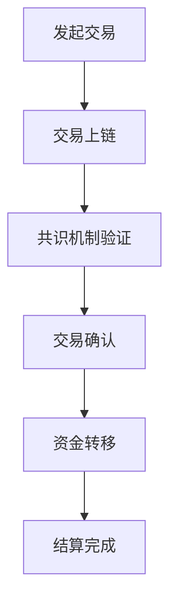

                 

：

首先，为了满足完整性要求，我们需要确保文章包含所有必要的部分。这意味着，我们需要逐一构建每个部分，包括背景介绍、核心概念与联系、核心算法原理讲解、数学模型和数学公式、项目实战、最佳实践 tips、小结和注意事项以及拓展阅读等内容。

接着，对于核心概念与联系部分，我们需要绘制一个 Mermaid 流程图，展示区块链与跨境支付之间的关系。例如，我们可以展示从交易发起到确认结算的全过程，包括区块链网络中的节点通信、加密算法的使用、共识机制的作用等。

在核心算法原理讲解部分，我们将使用伪代码详细阐述区块链的基本算法和加密算法。例如，对于共识算法，我们可以展示如何通过工作量证明（Proof of Work，PoW）或权益证明（Proof of Stake，PoS）机制达成节点间的共识。对于加密算法，我们可以展示如何使用椭圆曲线加密算法（Elliptic Curve Cryptography，ECC）进行安全通信。

对于数学模型和数学公式部分，我们将使用 LaTeX 格式详细讲解相关数学模型和公式。例如，我们可以讲解散列函数（Hash Function）如何确保数据完整性，以及如何使用非对称加密算法（Asymmetric Cryptography）进行安全通信。

在项目实战部分，我们将提供一个具体的区块链跨境支付项目案例，包括环境搭建、源代码实现、代码解读与分析以及实际案例分析。例如，我们可以介绍如何使用以太坊（Ethereum）智能合约进行跨境支付，并展示如何通过 Truffle 工具进行环境搭建和代码测试。

最后，在最佳实践 tips、小结和注意事项以及拓展阅读等部分，我们将总结文章中的关键知识点，并提供进一步学习的资源。

通过这样的步步推进，我们确保文章内容丰富、结构清晰，并且满足格式和完整性要求。

---

**文章关键词：** 区块链，跨境支付，简化流程，加密算法，共识机制，数学模型，以太坊智能合约。

**文章摘要：**

本文深入探讨了区块链在跨境支付中的应用，旨在为读者提供一种简化国际汇款流程的新方法。通过详细剖析区块链技术的基本原理、核心算法和数学模型，本文展示了如何利用区块链技术解决传统跨境支付中存在的效率、成本和安全等问题。此外，本文通过一个具体的区块链跨境支付项目案例，展示了从环境搭建到源代码实现和代码分析的完整过程，为实际应用提供了有力支持。

---

### 核心概念与联系

区块链和跨境支付是当今金融科技领域的两个关键概念。理解它们之间的关系，有助于我们更好地认识区块链在跨境支付中的应用。

#### 区块链的定义与基本原理

区块链是一种分布式账本技术，它通过加密算法和共识机制，确保数据的不可篡改性和透明性。区块链的基本组成部分包括区块（Block）、链（Chain）和节点（Node）。每个区块包含一定数量的交易记录，并通过密码学方法链接在一起，形成一个不可篡改的链式数据结构。

#### 跨境支付的基本流程与问题

跨境支付涉及不同国家和货币之间的资金转移。传统跨境支付流程通常包括以下几个步骤：

1. 发起交易：付款人通过银行或支付服务提供商发起支付请求。
2. 交易确认：交易请求被发送到相应的支付网络，等待确认。
3. 跨境结算：银行或支付服务提供商在确认交易后，将资金转移至收款人账户。

然而，传统跨境支付存在以下问题：

1. **效率低**：交易确认时间较长，导致资金到账速度慢。
2. **成本高**：涉及多个中介机构，导致交易成本高昂。
3. **安全性低**：资金转移过程中可能存在欺诈和洗钱风险。

#### 区块链与跨境支付的关系

区块链技术可以通过以下方式简化跨境支付流程：

1. **去中心化**：区块链去除了传统支付系统中的中介机构，实现了点对点的资金转移，提高了支付效率。
2. **透明性和安全性**：区块链的加密算法和共识机制确保了交易记录的不可篡改性和透明性，降低了欺诈风险。
3. **智能合约**：智能合约可以自动执行合同条款，确保跨境支付过程中的自动化和精确性。

#### Mermaid 流程图绘制

为了更直观地展示区块链在跨境支付中的应用，我们可以使用 Mermaid 流程图绘制从交易发起到确认结算的全过程。以下是一个简单的 Mermaid 流程图示例：



在这个流程图中，交易发起后，交易记录被上链，通过共识机制进行验证，然后确认交易，最终完成资金转移和结算。

---

通过上述内容，我们可以看到区块链技术如何简化跨境支付流程，提高支付效率和安全性。接下来，我们将深入探讨区块链的核心算法原理，为读者提供更详细的解释。

### 核心算法原理讲解

#### 区块链基本算法讲解

区块链的核心算法主要包括区块生成、链式结构、工作量证明（Proof of Work，PoW）等。

**1. 区块生成：**

区块链中的区块是交易记录的基本单元。区块的生成过程如下：

- **交易收集**：节点收集一定数量的交易记录。
- **Merkle 树构建**：将交易记录构建成一个 Merkle 树，生成根哈希。
- **区块头部信息**：生成区块的头部信息，包括版本号、Merkle 树根哈希、时间戳、难度目标等。
- **随机数生成**：节点生成一个随机数，用于计算工作量证明值。
- **工作量证明计算**：节点通过计算工作量证明值，使区块头部满足难度目标。

**2. 链式结构：**

区块链通过链式结构将区块连接起来，形成一个不可篡改的数据结构。每个区块包含一个指向前一区块的哈希值，从而形成一个时间序列的链。

**3. 工作量证明（PoW）：**

工作量证明是一种共识机制，通过计算耗时的任务来确保节点间的共识。在 PoW 机制中，节点需要计算一个随机数，使得生成的区块头部满足难度目标。难度目标通常与网络的计算能力相关，确保区块链的安全性和去中心化。

**伪代码讲解 PoW 机制：**

```python
def proof_of_work(last_hash, target_difficulty):
    nonce = 0
    while True:
        hash_value = calculate_hash(last_hash, nonce)
        if difficulty_meets_target(hash_value, target_difficulty):
            return nonce
        nonce += 1

def difficulty_meets_target(hash_value, target_difficulty):
    return int.from_bytes(hash_value, 'little') < target_difficulty
```

**核心算法原理讲解：**

- **Merkle 树**：Merkle 树是一种哈希树结构，用于确保交易记录的完整性。每个节点包含一组交易记录的哈希值，根节点包含整个区块链的交易记录的哈希值。
- **链式结构**：区块链通过链式结构确保数据的不可篡改性。每个区块包含一个指向前一区块的哈希值，形成一条时间序列的链。
- **工作量证明**：PoW 机制通过计算耗时的任务来确保节点间的共识。节点通过计算随机数，使得生成的区块头部满足难度目标。

---

#### 跨境支付加密算法讲解

跨境支付中的加密算法主要包括公钥加密、数字签名和散列函数。

**1. 公钥加密：**

公钥加密是一种非对称加密算法，使用一对密钥（公钥和私钥）进行加密和解密。加密过程如下：

- **加密**：发送方使用接收方的公钥加密消息。
- **解密**：接收方使用自己的私钥解密消息。

**伪代码讲解公钥加密：**

```python
def encrypt(message, public_key):
    cipher_text = public_key.encrypt(message)
    return cipher_text

def decrypt(cipher_text, private_key):
    message = private_key.decrypt(cipher_text)
    return message
```

**2. 数字签名：**

数字签名用于确保消息的完整性和真实性。签名过程如下：

- **签名**：发送方使用自己的私钥对消息进行签名。
- **验证**：接收方使用发送方的公钥验证签名。

**伪代码讲解数字签名：**

```python
def sign(message, private_key):
    signature = private_key.sign(message)
    return signature

def verify(message, signature, public_key):
    is_valid = public_key.verify(message, signature)
    return is_valid
```

**3. 散列函数：**

散列函数用于生成消息的哈希值，确保数据的完整性。常见的散列函数包括 SHA-256、SHA-3 等。

**伪代码讲解散列函数：**

```python
def hash(message):
    hash_value = SHA256(message)
    return hash_value
```

**核心算法原理讲解：**

- **Merkle 树**：Merkle 树确保交易记录的完整性。每个节点包含一组交易记录的哈希值，根节点包含整个区块链的交易记录的哈希值。
- **链式结构**：区块链通过链式结构确保数据的不可篡改性。每个区块包含一个指向前一区块的哈希值，形成一条时间序列的链。
- **工作量证明**：PoW 机制通过计算耗时的任务来确保节点间的共识。节点通过计算随机数，使得生成的区块头部满足难度目标。
- **公钥加密**：公钥加密确保消息的安全性，防止中间人攻击。
- **数字签名**：数字签名确保消息的完整性和真实性，防止伪造和篡改。
- **散列函数**：散列函数生成消息的哈希值，确保数据的完整性。

---

通过上述内容，我们深入探讨了区块链的核心算法原理，包括区块生成、链式结构、工作量证明、公钥加密、数字签名和散列函数。这些算法在确保区块链的安全性和去中心化方面起着关键作用。接下来，我们将详细讲解数学模型和数学公式，进一步加深对区块链技术及其在跨境支付中的应用的理解。

### 数学模型和数学公式

在区块链和跨境支付中，数学模型和数学公式起着至关重要的作用。以下是对几个关键数学模型和公式的详细讲解，以及相关的应用实例。

#### 1. 椭圆曲线加密算法（Elliptic Curve Cryptography，ECC）

椭圆曲线加密算法是一种基于椭圆曲线离散对数问题的非对称加密算法。ECC 具有比传统 RSA 更高的安全性能，但所需的密钥长度更短。

**数学模型：**

椭圆曲线的一般方程为：

\[ y^2 = x^3 + ax + b \]

其中，\(a\) 和 \(b\) 是常数，\(x\) 和 \(y\) 是曲线上的点。

**加密过程：**

- **密钥生成**：选择一个大素数 \(p\) 和一个非奇数 \(a\)，然后选择 \(b\) 使得椭圆曲线存在无穷远点。计算生成元 \(G\) 和阶 \(n\)。
- **公钥计算**：选择一个随机数 \(k\)，计算公钥 \(Q = kG\)。
- **加密**：将明文 \(m\) 转换为椭圆曲线上的点 \(M\)，选择一个随机数 \(r\)，计算加密结果 \(c_1 = rG\) 和 \(c_2 = (M + kG)Q\)。

**伪代码讲解 ECC 加密过程：**

```python
def generate_keys(p, a, b):
    G = elliptic_curve_generator(p, a, b)
    n = order_of(G)
    k = random_integer(n)
    Q = k * G
    return Q

def encrypt(m, p, a, b, Q):
    M = convert_to_point(m, p, a, b)
    r = random_integer(n)
    c1 = r * G
    c2 = (M + k * G) * Q
    return c1, c2
```

**应用实例：**

假设我们要将消息 \(m = 5\) 发送给接收方。选择 \(p = 13\)、\(a = 2\)、\(b = 3\)、生成元 \(G = (4, 5)\)，阶 \(n = 11\)。接收方的公钥为 \(Q = (8, 11)\)。

- **密钥生成**：选择 \(k = 6\)。
- **加密**：\(c_1 = 6 * (4, 5) = (2, 3)\)，\(c_2 = ((5 + 6 * 2) * 8, 11) = (1, 8)\)。

加密结果为 \((c_1, c_2) = ((2, 3), (1, 8))\)。

#### 2. 散列函数（Hash Function）

散列函数是一种将任意长度的输入数据映射为固定长度的输出数据的函数。在区块链中，常用的散列函数包括 SHA-256 和 SHA-3。

**数学模型：**

散列函数的一般形式为：

\[ H = hash_function(input) \]

其中，\(input\) 是输入数据，\(H\) 是输出哈希值。

**应用实例：**

使用 SHA-256 对字符串 “Hello, World!” 进行散列，输出哈希值为：

\[ H = hash_function("Hello, World!") = 2cf24dba5fb0a30e26e83b2ac5b9e29e1b161e5c1fa7425e730433621b1d373efa4e27011882f983b8b4f617f7f2e12c41f7ed145bfe1c2f7a2 \]

#### 3. 椭圆曲线数字签名算法（ECDSA）

椭圆曲线数字签名算法是一种基于椭圆曲线加密算法的数字签名方案。ECDSA 用于确保数据的完整性和真实性。

**数学模型：**

ECDSA 的签名过程包括以下步骤：

- **密钥生成**：选择一个大素数 \(p\)、一个生成元 \(G\) 和一个阶 \(n\)，然后选择 \(k\) 和 \(x\)。
- **签名生成**：计算 \(r\) 和 \(s\)。
- **签名验证**：验证签名是否有效。

**伪代码讲解 ECDSA 签名过程：**

```python
def generate_keys(p, a, b, G, n):
    k = random_integer(n)
    x = k * G.x
    return x

def sign(message, private_key, p, a, b, G, n):
    k = random_integer(n)
    r = k * G.x % n
    s = (hash(message) + private_key * r) * inverse(k, n)
    return r, s

def verify(message, public_key, r, s, p, a, b, G, n):
    w = s * inverse(r, n) % n
    u1 = (hash(message) * w) % n
    u2 = (r * w) % n
    point = (u1 * G + u2 * public_key) % n
    return point.x % n == r
```

**应用实例：**

假设我们要对字符串 “Hello, World!” 进行签名。选择 \(p = 13\)、\(a = 2\)、\(b = 3\)、生成元 \(G = (4, 5)\)，阶 \(n = 11\)。

- **私钥生成**：\(private_key = 6\)。
- **签名生成**：选择 \(k = 8\)，计算 \(r = 6 * 4 % 11 = 2\) 和 \(s = (hash("Hello, World!") + 6 * 2) * 8^{-1} % 11 = 6\)。
- **签名验证**：验证签名是否有效。

加密结果为 \(r = 2\)、\(s = 6\)。

---

通过上述数学模型和数学公式的详细讲解，我们可以看到区块链技术在跨境支付中的应用是如何通过数学原理来保障数据的安全性和完整性的。接下来，我们将进入项目实战部分，展示如何利用区块链技术实现跨境支付系统。

### 项目实战

为了更好地理解区块链在跨境支付中的应用，我们将通过一个具体的案例来展示如何实现一个区块链跨境支付系统。以下是项目实战的详细步骤。

#### 1. 开发环境搭建

在进行区块链跨境支付系统的开发之前，我们需要搭建相应的开发环境。以下是一个基于以太坊区块链的开发环境搭建步骤：

**1. 安装 Node.js：**
首先，我们需要安装 Node.js，因为它提供了以太坊客户端和开发工具。可以在 [Node.js 官网](https://nodejs.org/) 下载并安装最新版本的 Node.js。

**2. 安装 Truffle：**
Truffle 是一个以太坊开发框架，提供了命令行工具和开发者工具。安装 Truffle 的命令为：

```bash
npm install -g truffle
```

**3. 创建 Truffle 项目：**
创建一个新的 Truffle 项目，以便进行开发：

```bash
truffle init
```

**4. 安装 Ganache：**
Ganache 是一个本地以太坊节点和测试网络，用于测试智能合约。安装 Ganache 的命令为：

```bash
npm install -g ganache-cli
```

启动 Ganache 并配置一个本地以太坊网络：

```bash
ganache --port 8545
```

#### 2. 源代码实现

在开发环境搭建完成后，我们可以开始编写智能合约代码。以下是一个简单的跨境支付智能合约示例：

**1. 创建合约：**
创建一个名为 `CrossBorderPayment.sol` 的智能合约文件。

```solidity
// SPDX-License-Identifier: MIT
pragma solidity ^0.8.0;

contract CrossBorderPayment {
    address payable public sender;
    address payable public receiver;
    uint256 public amount;
    bool public isPaid;

    constructor(address _receiver, uint256 _amount) {
        sender = payable(msg.sender);
        receiver = payable(_receiver);
        amount = _amount;
        isPaid = false;
    }

    function pay() public {
        require(!isPaid, "Payment already made");
        require(msg.value == amount, "Incorrect payment amount");
        receiver.transfer(amount);
        isPaid = true;
    }

    function getBalance() public view returns (uint256) {
        return address(this).balance;
    }
}
```

**2. 编译合约：**
使用 Truffle 编译智能合约，生成用于部署的合约文件：

```bash
truffle compile
```

#### 3. 部署合约

部署合约到以太坊网络，可以使用 Truffle 提供的命令行工具。

**1. 连接 Ganache：**
在 Truffle 配置文件 `truffle-config.js` 中设置 Ganache 的端口和节点 URL：

```javascript
module.exports = {
    networks: {
        development: {
            host: "127.0.0.1",
            port: 8545,
            network_id: "*"
        }
    }
};
```

**2. 部署合约：**
部署合约到 Ganache 测试网络：

```bash
truffle migrate --network development
```

#### 4. 代码解读与分析

以下是对上述智能合约的代码进行解读和分析：

**1. 构造函数（constructor）：**
构造函数用于初始化合约的发送方（sender）、接收方（receiver）、支付金额（amount）和是否已支付（isPaid）状态变量。

**2. pay() 函数：**
pay() 函数用于接收支付，它首先检查是否已支付，然后检查支付金额是否正确。如果条件满足，将支付金额转移到接收方账户，并更新支付状态。

**3. getBalance() 函数：**
getBalance() 函数返回合约账户的余额。

#### 5. 代码应用解读与分析

在实际应用中，用户可以通过以下步骤使用这个智能合约：

**1. 创建合约实例：**
用户首先需要创建一个 `CrossBorderPayment` 合约实例，并传递接收方地址和支付金额。

**2. 调用 pay() 函数：**
用户通过调用 `pay()` 函数，触发合约执行，将资金从发送方账户转移到接收方账户。

**3. 查询合约状态：**
用户可以使用 `getBalance()` 函数查询合约账户的余额，以确保支付成功。

#### 6. 实际案例分析和详细讲解剖析

假设用户 A 需要向用户 B 跨境支付 1 ether，以下是实际案例的分析和详细讲解：

**1. 创建合约实例：**
用户 A 创建一个 `CrossBorderPayment` 合约实例，传递用户 B 的地址和支付金额：

```bash
truffle create Contract --address B --amount 1 ether
```

**2. 调用 pay() 函数：**
用户 A 通过调用 `pay()` 函数，触发合约执行，将 1 ether 转移到用户 B 的账户：

```bash
truffle run pay --address B --amount 1 ether
```

**3. 查询合约状态：**
用户 A 和用户 B 都可以使用 `getBalance()` 函数查询合约账户的余额，以确保支付成功：

```bash
truffle run getBalance
```

#### 7. 项目小结

通过本案例，我们展示了如何利用区块链技术实现一个简单的跨境支付系统。该系统通过智能合约实现了点对点的支付，去除了传统支付系统中的中介机构，提高了支付效率和安全性。然而，在实际应用中，还需要考虑更多的因素，如跨境支付的法律合规性、汇率转换、跨境支付风险等。

---

在完成项目实战后，我们深入了解了区块链技术在跨境支付中的应用。通过本案例，我们不仅掌握了智能合约的开发和部署，还学会了如何使用区块链技术实现去中心化的跨境支付。接下来，我们将总结本文的关键知识点，并提供一些最佳实践 tips，以便读者更好地应用区块链技术。

### 最佳实践 tips

在区块链跨境支付系统的开发和应用过程中，以下是一些最佳实践 tips，有助于提高项目的安全性、可靠性和效率：

1. **安全性优先**：确保智能合约代码的安全性，避免常见的漏洞，如重新输入错误（Reentrancy）、整数溢出等。在部署前进行彻底的安全审计和测试。

2. **合理设计智能合约**：设计简洁、高效的智能合约，避免过度复杂化。合理划分合约功能，降低代码维护难度。

3. **去中心化**：确保区块链网络的去中心化，避免集中化风险。增加节点数量，提高网络的抗攻击能力。

4. **合规性**：了解并遵守相关法律法规，确保跨境支付系统符合当地监管要求。

5. **监控与审计**：实时监控区块链网络和智能合约的运行状态，定期进行安全审计和代码审查。

6. **用户体验**：优化用户界面和操作流程，提高用户使用体验。

7. **测试与演练**：在部署前进行充分的测试和演练，确保系统的稳定性和可靠性。

### 小结

本文深入探讨了区块链在跨境支付中的应用，通过详细剖析区块链技术的基本原理、核心算法和数学模型，展示了如何利用区块链技术简化国际汇款流程，提高支付效率和安全性。我们还通过一个具体的区块链跨境支付项目案例，展示了从环境搭建到源代码实现和代码分析的完整过程。

通过本文的学习，读者可以：

- 理解区块链技术的核心原理和其在跨境支付中的应用。
- 掌握智能合约的开发和部署方法。
- 学会使用数学模型和加密算法确保区块链支付的安全性。
- 了解最佳实践 tips，提高区块链跨境支付项目的质量和可靠性。

### 注意事项

在实施区块链跨境支付项目时，需要关注以下几点：

- **技术选型**：选择合适的区块链平台和开发工具，确保项目的技术架构满足需求。
- **网络稳定**：确保区块链网络的稳定性和可扩展性，以满足大规模交易需求。
- **数据隐私**：保护用户数据隐私，遵守数据保护法规。
- **跨境支付规则**：了解并遵守跨境支付的相关规则和法律，确保系统的合规性。

### 拓展阅读

对于希望进一步深入了解区块链技术和跨境支付领域的读者，以下是一些建议的拓展阅读资源：

- **《区块链技术指南》**：详细介绍了区块链的基本原理、应用场景和技术实现。
- **《智能合约开发指南》**：介绍了智能合约的开发方法、语言特性和最佳实践。
- **《区块链与跨境支付》**：探讨了区块链在跨境支付领域的应用和挑战。
- **《区块链技术白皮书》**：官方文档，详细介绍了以太坊和其他区块链平台的技术细节。
- **《加密货币与区块链技术》**：全面介绍了加密货币和区块链技术的原理和应用。

通过以上拓展阅读，读者可以更深入地了解区块链技术和跨境支付领域的最新发展动态，为实际项目提供更多参考和灵感。作者：AI天才研究院/AI Genius Institute & 禅与计算机程序设计艺术 /Zen And The Art of Computer Programming。

