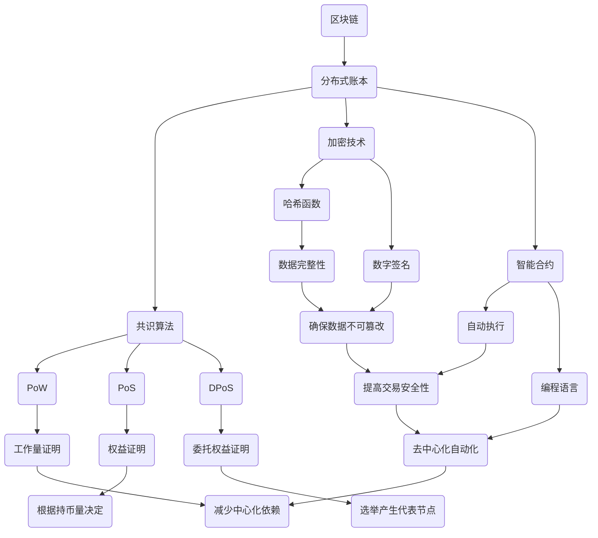

                 

### 文章标题

《区块链在跨境支付中的应用：降低国际汇款成本》

### 文章关键词

- 区块链
- 跨境支付
- 国际汇款
- 成本降低
- 智能合约
- 共识算法

### 摘要

本文深入探讨了区块链技术在跨境支付中的应用，以及它如何显著降低国际汇款成本。首先，我们回顾了区块链的基本概念、历史和发展，然后分析了当前跨境支付系统的痛点和成本构成。接下来，我们详细阐述了区块链如何通过去中心化、安全性和透明性等特性在跨境支付中发挥作用，并使用具体的案例进行了说明。此外，我们探讨了区块链在跨境支付中面临的技术挑战和解决方案，以及未来的发展趋势。最后，本文提供了项目实战、最佳实践和拓展阅读，以帮助读者更全面地了解区块链技术在跨境支付领域的应用。

### 目录

1. **引言**
2. **区块链基础知识**
3. **跨境支付现状**
4. **区块链在跨境支付中的应用**
   - **区块链与跨境支付的关系**
   - **区块链如何降低跨境支付成本**
   - **区块链在跨境支付中的实际应用**
5. **案例研究**
6. **技术挑战与解决方案**
7. **未来趋势与展望**
8. **项目实战**
9. **最佳实践与注意事项**
10. **拓展阅读**
11. **作者信息**

## 引言

随着全球化的深入发展，跨境支付已成为国际贸易和金融活动中的重要组成部分。然而，当前的跨境支付系统面临着诸多挑战，包括高昂的转账费用、缓慢的交易速度和复杂的安全问题。传统跨境支付系统通常依赖银行和支付网关，这些中介机构不仅增加了交易成本，还可能导致信息不对称和信任问题。

区块链技术的兴起为解决这些问题提供了一种新的思路。区块链是一种去中心化的分布式账本技术，它通过共识算法保证数据的不可篡改性和透明性，同时利用加密技术确保交易的安全性。本文旨在探讨区块链在跨境支付中的应用，分析其如何降低国际汇款成本，并提供相关的案例研究和未来展望。

本文的结构如下：

- **第一部分：区块链基础知识**：介绍区块链的基本概念、历史发展、核心技术和应用领域。
- **第二部分：跨境支付现状**：分析当前跨境支付系统的痛点、成本构成和存在的问题。
- **第三部分：区块链在跨境支付中的应用**：探讨区块链如何应用于跨境支付，以及它如何降低成本。
- **第四部分：案例研究**：通过具体的案例研究，展示区块链在跨境支付中的应用效果。
- **第五部分：技术挑战与解决方案**：讨论区块链在跨境支付中面临的技术挑战和解决方案。
- **第六部分：未来趋势与展望**：预测区块链在跨境支付领域的未来发展趋势和可能的影响。
- **第七部分：项目实战**：介绍如何搭建区块链跨境支付项目，并提供源代码和实现细节。
- **第八部分：最佳实践与注意事项**：提供一些实用的最佳实践和建议，以帮助读者更好地应用区块链技术。
- **第九部分：拓展阅读**：推荐一些相关的文献和资源，以供进一步学习。

通过本文的阅读，读者将能够全面了解区块链在跨境支付中的应用，并掌握如何利用这一新兴技术降低国际汇款成本。接下来，我们将首先深入探讨区块链的基础知识，为后续内容奠定理论基础。

## 第一部分：区块链基础知识

### 1.1 区块链的基本概念

区块链是一种分布式账本技术，它通过一种去中心化的方式记录和验证交易，确保数据的透明性和不可篡改性。区块链的核心在于“区块链”这个名称本身，它由一系列按时间顺序排列的数据区块组成。每个区块都包含了若干笔交易信息，这些区块通过密码学方法相互链接，形成一条连续的数据链。

区块链的基本组成部分包括：

- **区块（Block）**：每个区块都包含了若干笔交易信息，以及一个时间戳、一个随机数（用于生成哈希值）和一个前一个区块的哈希值。这些信息共同构成了一个数据单元，使得区块之间通过哈希值相互链接，形成一个不可篡改的链条。
  
- **链（Chain）**：区块链就是由一系列按时间顺序排列的区块组成的链条。一旦一个区块被添加到链中，它就无法被删除或修改，因为后续的区块都会包含该区块的哈希值，从而确保整个链的完整性和不可篡改性。

- **节点（Node）**：区块链网络中的每个参与者都称为一个节点。节点通过参与共识算法来验证和确认交易，确保整个网络的分布式状态一致。每个节点都维护一份完整的区块链副本，并通过不断同步区块信息来保持网络的一致性。

- **共识算法（Consensus Algorithm）**：共识算法是区块链网络中节点之间达成共识的关键机制。它决定了如何验证交易、添加新区块以及确保整个网络的状态一致性。常见的共识算法包括工作量证明（PoW）、权益证明（PoS）和委托权益证明（DPoS）等。

### 1.2 区块链的历史与发展

区块链的起源可以追溯到2008年，当时一个名为中本聪（Satoshi Nakamoto）的匿名人物发布了比特币白皮书《比特币：一种点对点的电子现金系统》。比特币是第一个基于区块链技术的数字货币，它开创了区块链在金融领域的应用。

在比特币之后，区块链技术逐渐被引入到其他领域，如供应链管理、数据存储、身份验证等。以下是一些重要的里程碑事件：

- **2014年**：Ripple Labs推出了Ripple协议，这是一种基于区块链技术的跨境支付解决方案。Ripple通过其数字货币XRP实现了快速、低成本的国际汇款。

- **2016年**：以太坊（Ethereum）的发布标志着区块链技术的进一步发展。以太坊不仅提供了一种去中心化的数字货币，还引入了智能合约的概念，使得区块链可以在更广泛的场景下发挥作用。

- **2019年**：IBM和三星等公司共同推出了Hyperledger Fabric，这是一种用于企业级应用的区块链框架。Hyperledger Fabric提供了高扩展性和高安全性，为企业提供了灵活的解决方案。

### 1.3 区块链的核心技术

区块链技术的核心在于其独特的机制和算法，这些技术和算法共同确保了区块链的分布式、透明和安全。

- **共识算法**：如前所述，共识算法是区块链网络中节点之间达成共识的关键机制。不同的共识算法具有不同的特性，如PoW、PoS和DPoS等。PoW（工作量证明）通过解决复杂的数学难题来确保节点之间的竞争公平；PoS（权益证明）通过持币量来决定节点参与共识的概率；DPoS（委托权益证明）则通过选举产生代表节点来参与共识。共识算法的目的是确保区块链网络中的所有节点对同一份数据状态达成一致。

- **加密技术**：区块链中的加密技术主要用于保护数据的完整性和隐私。哈希函数（Hash Function）是一种将任意长度的输入映射为固定长度的输出的函数，它确保了数据的不可篡改性。数字签名（Digital Signature）是一种验证数据来源和完整性的技术，通过使用非对称加密算法，可以确保信息的发送者和接收者之间的信任。

- **智能合约**：智能合约是一种自动执行的合约，它基于区块链技术的不可篡改性和透明性。智能合约通过编程语言（如Solidity）编写，并在区块链上进行部署。一旦条件满足，智能合约会自动执行预定的操作，从而实现去中心化的自动化交易。智能合约的应用场景非常广泛，从金融交易到供应链管理，都有其用武之地。

### 1.4 区块链的应用领域

区块链技术的广泛应用为其带来了巨大的潜力。以下是区块链在几个关键领域的主要应用：

- **数字货币**：数字货币是基于区块链技术的一种新型货币形式，如比特币和以太币。数字货币通过去中心化的方式运行，不依赖于任何中央机构，因此具有更高的透明度和安全性。

- **供应链管理**：区块链技术可以确保供应链的透明性和不可篡改性，从而提高供应链的效率和可信度。通过区块链，企业可以实时追踪商品从生产到消费的整个过程，确保每个环节的信息真实可靠。

- **数据存储**：区块链提供了一种去中心化的数据存储解决方案，通过分布式的方式存储数据，确保数据的安全性和可用性。区块链的数据存储不仅具有高可靠性，还减少了中心化存储系统面临的安全风险。

- **身份验证**：区块链技术可以用于身份验证，通过去中心化的方式确保用户的身份信息和交易记录的真实性。这种技术有助于减少欺诈和身份盗用，提高网络安全。

- **跨境支付**：区块链技术通过去中心化的方式实现了快速、低成本的国际汇款。跨境支付过程中，不再需要依赖传统的银行和支付网关，从而降低了交易成本并提高了交易速度。

通过以上对区块链基本概念的介绍，我们可以看到区块链技术具有巨大的潜力和广泛的应用前景。在接下来的章节中，我们将进一步探讨区块链在跨境支付中的应用，分析其如何降低国际汇款成本。

### 1.5 区块链的核心技术之间的关系架构

为了更好地理解区块链的核心技术之间的关系，我们可以使用Mermaid流程图来展示这些技术的交互和协作方式。以下是区块链核心技术之间的关系架构：



在这个Mermaid流程图中，我们首先定义了区块链（A）作为整体，然后分别展示了分布式账本（B）、共识算法（C）、加密技术（D）和智能合约（E）四个核心技术。共识算法（C）包括三种具体的算法：PoW（F）、PoS（G）和DPoS（H）；加密技术（D）包括哈希函数（I）和数字签名（J）；智能合约（E）则展示了其自动执行（K）和使用的编程语言（L）。

通过这个流程图，我们可以清晰地看到区块链技术的各个组成部分及其之间的相互关系。共识算法确保了区块链网络中的节点能够达成一致，加密技术保障了数据的完整性和隐私，智能合约则实现了去中心化的自动化交易。这些技术的协同作用，共同构成了区块链强大的功能和优势。

### 1.6 区块链核心算法原理讲解

#### 工作量证明（Proof of Work, PoW）

工作量证明（PoW）是最早被广泛采用的共识算法，由中本聪在比特币网络中首次提出。PoW的核心思想是通过解决一个计算难题来证明节点的计算能力，从而获得对区块链的写入权限。这个过程如下：

1. **问题提出**：区块链网络中的节点需要找到一个满足特定条件的随机数，这个条件通常是通过哈希函数实现的。具体来说，需要找到一个随机数\( n \)，使得哈希函数\( Hash(n) \)的结果以特定的前导零开头。

2. **计算过程**：节点通过不断地尝试不同的随机数来找到满足条件的\( n \)。这个过程非常耗时，因为需要大量的计算资源。

3. **验证与奖励**：一旦找到一个满足条件的随机数，节点将生成的区块（包含若干笔交易）和该随机数（nonce）发送到整个网络。其他节点会验证该随机数是否满足条件。如果验证通过，该节点就获得了对区块链的写入权限，并将区块添加到区块链上。网络会奖励该节点一定数量的加密货币作为奖励。

**伪代码**：

```plaintext
function ProofOfWork(transaction_list):
    for nonce in all possible nonces:
        if Hash(merge(transaction_list, nonce)) starts with k leading zeros:
            return (nonce, block)
```

**数学模型**：

设\( H \)为哈希函数，\( k \)为前导零的位数，\( n \)为随机数，则目标为：

$$ 
Hash(merge(transaction_list, n)) \leq 10^k 
$$

#### 权益证明（Proof of Stake, PoS）

权益证明（PoS）是一种相对较新的共识算法，旨在解决PoW算法中能源消耗和计算资源分配不均的问题。PoS通过持有币龄（即持有的币的数量和持有时间）来决定节点参与共识的概率。以下是PoS的核心过程：

1. **权益分配**：每个节点根据其持有的币的数量和持有时间计算权益。权益越高，节点参与共识的概率越大。

2. **随机性选择**：为了确保随机性，系统会从所有具备共识资格的节点中随机选择一个作为下一个区块的验证者。

3. **区块生成**：验证者接收到交易信息后，生成一个新的区块，并将其广播到整个网络。其他节点验证该区块的有效性，如果验证通过，区块将被添加到区块链上。

**伪代码**：

```plaintext
function ProofOfStake(stake_list):
    select a random validator from stake_list
    validator creates a new block with transactions
    if block is valid:
        add block to blockchain
```

**数学模型**：

设\( S_i \)为节点\( i \)的权益，则节点\( i \)的共识概率为：

$$ 
P_i = \frac{S_i}{\sum_{j=1}^{N} S_j} 
$$

其中，\( N \)为所有节点的总数。

#### 委托权益证明（Delegated Proof of Stake, DPoS）

委托权益证明（DPoS）是对PoS算法的一种改进。在DPoS中，节点通过选举产生代表节点来参与共识，代表节点的产生和共识过程如下：

1. **选举代表节点**：节点通过投票选举出一定数量的代表节点。每个节点的投票权重与其持有的币龄成正比。

2. **轮换共识**：代表节点按照一定的顺序轮流产生区块，这个顺序通常是根据节点在选举中获得的支持程度决定的。

3. **区块验证**：代表节点生成区块后，其他节点会验证该区块的有效性。如果验证通过，区块将被添加到区块链上。

**伪代码**：

```plaintext
function DelegatedProofOfStake(voter_list, representative_list):
    for each voter in voter_list:
        vote for representative
    sort representative_list by voting weight
    create a round-robin schedule for representative nodes
    for each representative in schedule:
        representative creates a new block with transactions
        if block is valid:
            add block to blockchain
```

**数学模型**：

设\( V_i \)为节点\( i \)的投票权重，\( R \)为代表节点总数，则代表节点的产生概率为：

$$ 
P_{representative} = \frac{V_i}{\sum_{j=1}^{N} V_j} 
$$

代表节点共识概率为：

$$ 
P_{consensus} = \frac{1}{R} 
$$

通过以上对PoW、PoS和DPoS三种共识算法的讲解，我们可以看到区块链技术如何在确保去中心化和安全性之间找到平衡。这些算法的不同设计理念和应用场景，使得区块链技术在各种应用领域中都能够发挥重要作用。

### 1.7 加密技术原理讲解

区块链中的加密技术是确保数据安全性、完整性和隐私性的关键组成部分。以下是几种主要的加密技术原理讲解：

#### 哈希函数

哈希函数是一种将任意长度的输入数据映射为固定长度输出的函数。哈希函数具有以下几个特性：

1. **不可逆性**：给定一个输出，无法通过计算反推出原始输入。这意味着即使知道哈希函数的输出，也无法确定原始输入。
   
2. **确定性**：对于相同的输入，哈希函数总是产生相同的输出。这保证了数据的完整性，因为任何对数据的修改都会导致哈希值的改变。

3. **抗碰撞性**：在计算上几乎不可能找到两个不同的输入产生相同的哈希值。这确保了数据的安全性，因为攻击者无法通过生成相同的哈希值来欺骗系统。

常用的哈希函数包括SHA-256、SHA-3和MD5等。以下是一个SHA-256哈希函数的伪代码：

```plaintext
function SHA256(message):
    // 将消息进行预处理，包括填充和分块
    // 执行压缩函数，产生最终的哈希值
    return hash
```

#### 非对称加密

非对称加密是一种使用一对密钥（公钥和私钥）进行加密和解密的加密方法。公钥是公开的，任何人都可以获取；而私钥是保密的，只有拥有者才能使用。

1. **加密过程**：使用公钥加密消息，加密后的消息只能通过私钥解密。
   
2. **解密过程**：使用私钥解密加密后的消息，解密后的消息与原始消息相同。

非对称加密的数学基础是整数分解问题和大素数生成问题。常用的非对称加密算法包括RSA、ECC等。

以下是一个RSA加密算法的伪代码：

```plaintext
// RSA加密算法
function RSAEncrypt(plaintext, public_key):
    n = p * q // p 和 q 是大素数
    e // 公钥指数
    c = plaintext^e mod n // 加密后的消息
    return c

// RSA解密算法
function RSADecrypt(ciphertext, private_key):
    d // 私钥指数
    p // p 是大素数
    q // q 是大素数
    n = p * q // n 是模数
    m = ciphertext^d mod n // 解密后的消息
    return m
```

#### 数字签名

数字签名是一种确保数据来源和完整性的技术。它通过使用私钥对数据进行加密，生成一个签名。其他用户可以使用公钥验证该签名的真实性。

1. **签名过程**：使用私钥对消息进行加密，生成签名。
   
2. **验证过程**：使用公钥对签名进行解密，如果解密后的消息与原始消息相同，则签名验证通过。

以下是一个RSA数字签名算法的伪代码：

```plaintext
// RSA签名算法
function RSASign(message, private_key):
    d // 私钥指数
    p // p 是大素数
    q // q 是大素数
    n = p * q // n 是模数
    s = message^d mod n // 签名
    return s

// RSA验证算法
function RSAVerify(message, signature, public_key):
    e // 公钥指数
    n // n 是模数
    m = signature^e mod n // 验证后的消息
    if m == message:
        return true
    else:
        return false
```

通过哈希函数、非对称加密和数字签名这些加密技术，区块链确保了数据的安全性、完整性和隐私性。这些技术在区块链网络中发挥了重要作用，确保了整个系统的高效和可靠运行。

### 1.8 智能合约原理讲解

智能合约是区块链技术中的一种重要创新，它允许在区块链上进行自动化、不可篡改的合同执行。智能合约的核心概念是：一旦条件满足，合约将自动执行预定的操作，从而实现去中心化的自动化交易。以下是智能合约的原理讲解：

#### 基本概念

- **合约**：智能合约是一段代码，定义了参与方之间的权利和义务，并包含执行逻辑。合约的执行是自动的，一旦条件满足，合约将自动执行。

- **触发条件**：智能合约的执行通常由特定的触发条件触发，这些条件可以是时间、数据状态或其他事件。

- **不可篡改性**：智能合约一旦部署到区块链上，就无法修改或撤销。这意味着合约的执行是公正和透明的，参与方无需担心欺诈或合同变更。

#### 工作原理

智能合约的工作原理可以概括为以下几个步骤：

1. **合约编写**：开发人员使用智能合约编程语言（如Solidity）编写合约代码，定义合约的接口、状态变量和执行逻辑。

2. **合约部署**：将编写好的合约代码部署到区块链上，这一过程通常涉及将合约代码及其字节码上传到区块链网络，并支付一定的交易费用。

3. **触发执行**：当满足预定的触发条件时，合约将自动执行。触发条件可以是用户调用合约函数、特定时间到达或外部事件触发。

4. **状态更新**：合约执行后，区块链状态将根据执行结果进行更新。例如，如果合约涉及转移代币，则接收方的余额将相应增加。

#### 示例：简单的智能合约

以下是一个使用Solidity编写的简单智能合约示例，该合约用于存储和转移代币：

```solidity
// SPDX-License-Identifier: MIT
pragma solidity ^0.8.0;

contract SimpleWallet {
    address public owner;
    mapping(address => uint256) public balances;

    constructor() {
        owner = msg.sender;
        balances[owner] = 1000; // 初始化合约创建者的余额为1000
    }

    function deposit() public payable {
        balances[owner] += msg.value; // 存入代币
    }

    function transfer(address to, uint256 amount) public {
        require(to != address(0), "不能发送给空地址");
        require(balances[owner] >= amount, "余额不足");
        balances[owner] -= amount; // 减少合约创建者的余额
        balances[to] += amount; // 增加接收方的余额
        (bool sent, ) = to.call{value: amount}("");}
        require(sent, "转账失败");
    }
}
```

在这个示例中，`SimpleWallet`合约有一个`owner`地址和一张代币余额表`balances`。合约创建者可以存入代币，并可以通过调用`transfer`函数将代币转移到其他地址。这个合约展示了智能合约的基本结构，包括状态变量、函数定义和执行逻辑。

#### 应用场景

智能合约的应用场景非常广泛，包括但不限于：

- **金融交易**：如去中心化金融（DeFi）平台，智能合约用于自动化借贷、交易和风险管理。
  
- **供应链管理**：智能合约可以用于追踪商品的供应链，确保每个环节的信息透明和不可篡改。

- **投票系统**：智能合约可以用于创建去中心化的投票系统，确保投票的公正性和透明性。

- **身份验证**：智能合约可以用于验证用户的身份信息，确保数据的真实性和安全性。

通过智能合约，区块链技术不仅实现了去中心化，还提高了交易的自动化和透明度。智能合约的广泛应用，为区块链技术带来了更多的可能性和创新。

### 1.9 区块链在应用领域的主要应用

区块链技术因其去中心化、透明性和不可篡改性，在多个领域展示了巨大的应用潜力。以下是区块链在几个关键领域的主要应用：

#### 数字货币

数字货币是区块链技术最早和最广泛的应用之一。比特币和以太坊是两个最著名的数字货币。数字货币通过区块链网络进行交易，不依赖于任何中央机构，从而实现了去中心化的金融体系。数字货币不仅具有高度的透明性，还因为其加密特性而具有很高的安全性。

- **优点**：
  - 去中心化：不依赖于任何中央机构，减少了中介费用。
  - 透明性：区块链上的所有交易都是公开透明的，无法篡改。
  - 安全性：加密技术确保了交易的安全性和隐私性。

- **挑战**：
  - 价格波动性：数字货币价格波动较大，影响其稳定性。
  - 规则变化：监管政策的变化可能影响数字货币的发展。

#### 供应链管理

区块链技术可以用于追踪商品的供应链，确保每个环节的信息透明和不可篡改。通过在区块链上记录商品的生产、运输和分销信息，企业可以实现对供应链的实时监控和透明化管理。

- **优点**：
  - 透明性：区块链上的所有交易和记录都是公开透明的，提高了供应链的透明度。
  - 不可篡改性：区块链的数据一旦记录，就无法篡改，确保了信息的真实性和完整性。
  - 实时监控：区块链技术可以实现实时追踪，帮助企业快速响应供应链问题。

- **挑战**：
  - 数据隐私：供应链中的某些信息可能需要保持隐私，如何在保持透明的同时保护隐私是一个挑战。
  - 数据存储：随着供应链信息的增加，如何有效存储和查询大量数据是一个问题。

#### 数据存储

区块链技术提供了一种去中心化的数据存储解决方案，通过分布式的方式存储数据，确保数据的安全性和可用性。区块链的数据存储不仅具有高可靠性，还减少了中心化存储系统面临的安全风险。

- **优点**：
  - 高可靠性：分布式存储提高了数据可靠性，任何一个节点的故障都不会影响整个系统的运行。
  - 安全性：区块链上的数据通过加密技术进行保护，确保数据的安全性和隐私。
  - 去中心化：去中心化存储减少了中心化系统面临的安全风险，提高了系统的抗攻击能力。

- **挑战**：
  - 数据隐私：如何在保护隐私的同时保持数据的可用性是一个挑战。
  - 数据访问速度：分布式存储可能导致数据访问速度变慢。

#### 身份验证

区块链技术可以用于身份验证，通过去中心化的方式确保用户的身份信息和交易记录的真实性。区块链的身份验证技术有助于减少欺诈和身份盗用，提高网络安全。

- **优点**：
  - 去中心化：去中心化的身份验证减少了中介机构的依赖，提高了系统的透明度和安全性。
  - 不可篡改性：区块链上的身份信息一旦记录，就无法篡改，确保了信息的真实性和完整性。
  - 安全性：加密技术确保了身份信息的隐私和安全。

- **挑战**：
  - 数据隐私：如何在保护隐私的同时确保数据的可用性是一个挑战。
  - 法律法规：不同地区的法律法规可能对区块链身份验证有不同的要求。

#### 跨境支付

区块链技术在跨境支付中的应用，通过去中心化的方式实现了快速、低成本的国际汇款。跨境支付过程中，不再需要依赖传统的银行和支付网关，从而降低了交易成本并提高了交易速度。

- **优点**：
  - 快速：区块链技术可以实现实时交易，大大缩短了交易时间。
  - 低成本：去中心化的跨境支付减少了中介费用，降低了交易成本。
  - 透明性：区块链上的所有交易都是公开透明的，提高了跨境支付的透明度。

- **挑战**：
  - 法律法规：不同国家的法律法规可能对跨境支付有不同的要求，需要确保合规性。
  - 技术接受度：区块链技术的普及和接受度还有待提高。

通过以上对区块链在数字货币、供应链管理、数据存储、身份验证和跨境支付等领域的应用介绍，我们可以看到区块链技术的多样性和广泛的应用潜力。随着技术的不断发展和完善，区块链技术将在更多领域发挥重要作用。

## 第二部分：跨境支付现状

### 2.1 当前跨境支付系统的痛点

跨境支付作为国际贸易和金融活动中的重要环节，近年来虽然取得了显著进展，但仍存在诸多痛点。以下是对当前跨境支付系统主要痛点的分析：

1. **高昂的转账费用**：传统的跨境支付系统通常需要通过银行和支付网关进行交易，这些中介机构不仅增加了交易成本，还可能导致信息不对称和信任问题。根据国际货币基金组织（IMF）的数据，跨境支付的平均成本约为交易金额的5%，而一些高价值交易的成本甚至可能高达15%。这种高昂的费用严重阻碍了跨境支付的普及。

2. **缓慢的交易速度**：传统的跨境支付系统由于需要多个中介机构的处理和清算，交易速度往往较慢。例如，国际银行转账可能需要几天甚至更长时间才能到账。这不仅影响了资金的及时到账，还增加了企业的财务风险。

3. **复杂的安全问题**：跨境支付涉及大量的敏感信息和资金，因此安全问题是不可忽视的挑战。传统支付系统通常依赖中心化的机构来处理交易，这使得系统面临更高的风险。一旦发生安全漏洞，可能会导致大规模的数据泄露和资金损失。

4. **法规和合规性问题**：跨境支付涉及多个国家和地区的法律和监管要求，这使得支付过程更加复杂。不同的国家和地区可能有不同的法规和合规要求，企业需要花费大量时间和资源来确保合规性。

5. **信息不对称**：在传统跨境支付系统中，银行和支付网关通常持有交易信息，而交易双方可能无法及时获取完整的交易信息。这导致信息不对称，增加了交易的不确定性和风险。

### 2.2 跨境支付的成本构成

跨境支付的成本主要包括以下几个方面：

1. **中介费用**：银行和支付网关作为中介机构，通常会收取一定的手续费。这些费用不仅包括直接的服务费用，还可能包括兑换费、清算费等。

2. **兑换成本**：跨境支付通常涉及货币兑换，而兑换成本是影响交易总成本的重要因素。不同银行和支付网关提供的兑换汇率可能有所不同，这会导致交易成本的增加。

3. **技术成本**：传统的跨境支付系统需要复杂的IT基础设施和系统维护，这增加了企业的运营成本。此外，为了确保交易的安全性和合规性，企业可能需要投入大量资源进行技术升级和安全防护。

4. **时间成本**：跨境支付过程通常需要较长时间，这不仅影响了企业的资金周转，还可能导致财务风险的增加。长时间的交易过程增加了企业的财务不确定性。

5. **法律和合规成本**：跨境支付需要遵守不同国家和地区的法律法规，这可能需要企业投入大量时间和资源进行合规性审查和咨询。对于一些高风险行业，如金融和医疗，合规成本可能更高。

### 2.3 跨境支付系统存在的问题

1. **中心化问题**：传统跨境支付系统依赖于中心化的银行和支付网关，这使得支付过程容易受到单点故障和欺诈攻击的影响。中心化系统还可能导致信息不对称和信任问题。

2. **效率低下**：跨境支付系统的交易处理和清算过程通常较为复杂，导致交易速度缓慢。这影响了企业的资金周转效率，增加了财务风险。

3. **高成本**：传统跨境支付系统的高昂费用使得小型企业和个人用户难以承担，限制了跨境支付的普及。

4. **安全漏洞**：跨境支付涉及大量的敏感信息和资金，传统系统面临更高的安全风险。一旦发生数据泄露或资金损失，可能对企业和个人造成严重损失。

5. **法规和合规难题**：跨境支付需要遵守不同国家和地区的法律法规，这使得支付过程更加复杂。企业需要投入大量时间和资源来确保合规性，增加了运营成本。

通过对当前跨境支付系统痛点和成本构成的分析，我们可以看到区块链技术具有巨大的潜力来改进现有系统，提高交易效率、降低成本并增强安全性。在接下来的章节中，我们将详细探讨区块链在跨境支付中的应用，分析其如何解决现有系统的痛点。

### 区块链与跨境支付的关系

区块链技术通过其去中心化、安全性和透明性等特性，为跨境支付带来了革命性的变革。下面我们详细探讨区块链与跨境支付之间的关系，以及区块链如何解决传统跨境支付系统中的痛点。

#### 去中心化

传统跨境支付系统依赖于中心化的银行和支付网关，这使得支付过程容易受到单点故障和信任问题的影响。区块链技术通过去中心化的方式，消除了对中心化中介机构的依赖，实现了点对点的直接交易。这意味着交易双方可以直接进行支付，无需通过中介机构，从而降低了交易成本和风险。

- **提高交易速度**：去中心化系统消除了传统支付系统中的多个中介环节，从而大大缩短了交易时间。区块链网络中的交易可以在几分钟内完成，而不是几天或几周。
- **降低交易成本**：去中心化系统减少了中介费用，交易成本显著降低。根据一些报告，区块链跨境支付的费用比传统跨境支付低约50%-90%。

#### 安全性

区块链技术通过加密技术和共识算法确保了数据的安全性和隐私性。在跨境支付中，交易信息被加密存储在区块链上，只有合法的参与者才能访问和验证。此外，区块链的不可篡改性确保了交易记录的真实性和完整性，防止了欺诈和篡改。

- **保护交易信息**：区块链上的交易信息是加密的，只有持有相应私钥的参与者才能解密和查看。这确保了交易信息的隐私和安全。
- **防止欺诈**：区块链的不可篡改性使得任何试图篡改交易记录的行为都会被其他节点检测并拒绝，从而有效防止了欺诈行为。

#### 透明性

区块链上的所有交易都是公开透明的，任何人都可以查看和验证。这种透明性不仅提高了跨境支付的信任度，还使得支付过程更加透明和公正。

- **提高信任度**：由于区块链上的交易信息是公开透明的，参与方无需担心中介机构的欺诈行为，从而提高了支付过程中的信任度。
- **简化审计**：企业可以方便地审计区块链上的交易记录，确保交易的合法性和合规性。这有助于简化审计过程，降低合规成本。

#### 降低跨境支付成本

区块链技术通过去中心化、安全性和透明性，显著降低了跨境支付的成本。

- **减少中介费用**：由于去中心化系统消除了对中介机构的依赖，中介费用大幅降低。这对于中小企业和个人用户来说，是一个巨大的优势。
- **降低兑换成本**：区块链上的交易通常使用加密货币，如比特币或以太币，这可以避免繁琐的货币兑换过程，从而降低兑换成本。
- **提高效率**：区块链技术的快速交易处理能力和高效率，使得跨境支付的成本进一步降低。

#### 解决信息不对称问题

传统跨境支付系统中的信息不对称问题，是导致交易成本高、速度慢的一个重要原因。区块链技术通过去中心化的方式，使得交易信息实时更新并公开透明，从而解决了信息不对称问题。

- **实时更新**：区块链上的交易信息实时更新，参与方可以及时获取交易状态，无需担心信息滞后。
- **公开透明**：区块链上的交易信息对所有参与者公开透明，参与方可以随时查看和验证交易信息，避免了信息不对称带来的风险。

通过以上分析，我们可以看到区块链技术如何通过去中心化、安全性、透明性和降低成本等特性，在跨境支付中发挥重要作用。区块链技术的应用，不仅提高了跨境支付的效率和安全性，还为传统跨境支付系统带来了全新的变革。在接下来的章节中，我们将通过具体的案例研究，进一步展示区块链在跨境支付中的应用效果。

### 区块链如何降低跨境支付成本

区块链技术通过其独特的特性，能够有效降低跨境支付的成本，以下是具体的方法和实现：

#### 1. 去中心化降低中介费用

传统跨境支付系统依赖中心化的银行和支付网关，这些中介机构不仅收取手续费，还增加了交易的成本和复杂性。区块链技术通过去中心化的方式，实现了点对点的交易，消除了对中介机构的依赖。

- **实现方式**：在区块链网络中，交易双方可以直接进行支付，无需通过银行或支付网关。例如，比特币和Ripple等区块链平台，允许用户直接通过区块链进行跨境支付。
- **效果**：去中心化减少了中介费用，降低了交易成本。根据一些报告，使用区块链进行跨境支付的费用比传统跨境支付低约50%-90%。

#### 2. 加密货币减少兑换成本

跨境支付通常涉及货币兑换，而兑换过程不仅耗时，还可能导致高额的兑换成本。区块链技术通过使用加密货币，如比特币和以太币，可以避免繁琐的货币兑换过程，从而降低兑换成本。

- **实现方式**：用户在跨境支付时，可以直接使用加密货币进行支付，接收方再选择将加密货币兑换为当地货币。例如，用户可以使用比特币支付给国外的卖家，卖家再选择将比特币兑换为当地货币。
- **效果**：加密货币的使用减少了兑换成本，提高了跨境支付的效率。此外，加密货币的价格波动性使得兑换时机更加灵活，用户可以等待价格波动后再进行兑换，进一步降低成本。

#### 3. 快速交易处理提高效率

传统跨境支付系统由于需要多个中介机构的处理和清算，交易速度往往较慢。区块链技术的快速交易处理能力，显著提高了跨境支付的效率。

- **实现方式**：区块链网络中的交易可以在几分钟内完成，而传统跨境支付可能需要几天或几周。例如，比特币网络中的交易通常在10分钟内完成，Ripple网络中的交易时间更短，仅需几秒。
- **效果**：快速交易处理能力提高了跨境支付的效率，减少了企业的财务风险。对于国际贸易和金融活动，快速的支付速度有助于提高资金流转效率，降低资金成本。

#### 4. 透明性提高信任度

传统跨境支付系统的信息不对称问题，是导致交易成本高、速度慢的一个重要原因。区块链技术的透明性，提高了跨境支付的信任度，减少了信息不对称。

- **实现方式**：区块链上的所有交易都是公开透明的，任何人都可以查看和验证。例如，Ripple网络中的交易记录是公开的，用户可以方便地查询交易状态和详细信息。
- **效果**：透明性提高了跨境支付的信任度，参与方无需担心中介机构的欺诈行为。此外，透明性有助于简化审计过程，降低合规成本。

#### 5. 共识算法确保交易安全

区块链技术通过共识算法确保了交易的安全性和可靠性，降低了跨境支付的风险。

- **实现方式**：区块链网络中的所有节点通过共识算法达成一致，确保交易记录的真实性和完整性。例如，比特币使用工作量证明（PoW）算法，确保交易的安全和不可篡改性。
- **效果**：共识算法确保了交易的安全性和可靠性，降低了欺诈和篡改的风险。对于跨境支付，安全性是至关重要的，区块链技术通过其强大的安全机制，为跨境支付提供了可靠保障。

#### 6. 分布式账本提高透明度和效率

区块链技术的分布式账本特性，提高了跨境支付的透明度和效率。

- **实现方式**：区块链上的交易记录是分布式存储的，所有节点都维护一份完整的账本。例如，Hyperledger Fabric是一种分布式账本技术，可以实现高效、透明的跨境支付。
- **效果**：分布式账本提高了跨境支付的透明度和效率，参与方可以实时查询交易状态，确保交易的透明性和可靠性。此外，分布式账本减少了中心化系统的单点故障风险，提高了系统的稳定性。

通过以上方法和实现，区块链技术显著降低了跨境支付的成本。去中心化降低了中介费用，加密货币减少了兑换成本，快速交易处理提高了效率，透明性提高了信任度，共识算法确保了交易安全，分布式账本提高了透明度和效率。这些优势使得区块链技术在跨境支付中具有巨大的应用潜力，为传统跨境支付系统带来了全新的变革。

### 区块链在跨境支付中的实际应用

区块链技术因其去中心化、安全性和透明性等优势，在跨境支付领域得到了广泛的应用。以下是一些典型的区块链跨境支付案例，展示了区块链在降低交易成本和提高支付效率方面的实际效果。

#### 案例一：比特币跨境支付

比特币作为一种基于区块链的数字货币，已经成为跨境支付的重要工具。比特币网络通过点对点的交易模式，消除了传统支付系统中的中介机构，从而降低了交易成本并提高了交易速度。

- **应用效果**：使用比特币进行跨境支付，交易成本通常仅为传统支付方式的10%左右。此外，比特币的交易时间通常在几分钟内完成，远低于传统跨境支付的几天或几周。

- **实现方式**：用户可以通过比特币钱包发起支付，接收方收到比特币后可以选择将其兑换为当地货币。例如，某家中国公司向美国供应商支付货款，可以直接使用比特币支付，供应商再将比特币兑换为美元。

- **优缺点**：优点包括低交易成本和快速交易速度；缺点主要是比特币价格的波动性较大，可能导致汇率风险。

#### 案例二：Ripple网络在跨境支付中的应用

Ripple是一种基于区块链技术的支付网络，旨在提高跨境支付的速度和效率。Ripple网络通过其数字货币XRP，实现了快速、低成本的跨境支付。

- **应用效果**：Ripple网络中的交易时间通常在几秒内完成，交易成本远低于传统跨境支付。Ripple声称，使用其网络进行跨境支付，成本可以降低至低于1美分。

- **实现方式**：金融机构可以在Ripple网络上开设账户，并通过该网络进行跨境支付。例如，两家银行可以通过Ripple网络直接进行资金转账，无需通过中介机构。

- **优缺点**：优点包括快速交易速度和低成本；缺点主要是Ripple网络的监管问题，以及XRP的价格波动性。

#### 案例三：Hyperledger Fabric在跨境支付中的应用

Hyperledger Fabric是一种由Linux基金会主导的企业级区块链框架，它提供了高扩展性和高安全性的跨境支付解决方案。

- **应用效果**：Hyperledger Fabric可以实现高效、透明的跨境支付，交易成本显著降低。此外，其去中心化的特性提高了系统的可靠性和安全性。

- **实现方式**：金融机构可以基于Hyperledger Fabric构建自己的跨境支付平台，实现点对点的支付交易。例如，某家银行可以使用Hyperledger Fabric搭建跨境支付系统，为客户提供快速、低成本的跨境支付服务。

- **优缺点**：优点包括高扩展性、高安全性和低交易成本；缺点主要是实现和部署过程较为复杂，需要较高的技术门槛。

#### 案例四：跨境支付联盟（Cross-border Payments Alliance）

跨境支付联盟是一个由多家金融机构组成的联盟，旨在通过区块链技术提高跨境支付的速度和效率。联盟成员可以使用区块链网络进行跨境支付，降低了交易成本。

- **应用效果**：跨境支付联盟通过区块链技术实现了快速、低成本的跨境支付，交易成本降低了约50%。

- **实现方式**：联盟成员通过区块链网络共享交易信息，实现了点对点的支付交易。例如，一家银行可以向另一家银行发送支付请求，请求通过区块链网络直接结算。

- **优缺点**：优点包括快速交易速度和低成本；缺点主要是联盟成员的加入和协作过程较为复杂。

#### 案例五：世界银行（World Bank）的区块链跨境支付项目

世界银行启动了多个区块链跨境支付项目，旨在提高支付效率、降低交易成本并促进跨境贸易的发展。

- **应用效果**：世界银行的区块链跨境支付项目显著提高了支付效率，交易时间缩短了约30%。

- **实现方式**：世界银行与多个国家和地区合作，通过区块链网络进行跨境支付。例如，世界银行与乌干达合作，通过区块链网络向乌干达的小麦农场主支付补贴。

- **优缺点**：优点包括提高支付效率和促进跨境贸易发展；缺点主要是项目的实施和推广需要大量资源和时间。

通过以上案例，我们可以看到区块链技术在不同场景下的实际应用，以及它在降低跨境支付成本和提高支付效率方面的显著优势。区块链技术为跨境支付带来了全新的解决方案，有望彻底改变传统的支付方式，提高全球金融系统的效率和透明度。

### 技术挑战与解决方案

虽然区块链在跨境支付中展现了巨大的潜力，但在实际应用过程中，仍面临一系列技术挑战。以下是区块链在跨境支付中面临的主要技术挑战，以及相应的解决方案：

#### 1. 数据隐私保护

区块链上的所有交易信息都是公开透明的，这在一定程度上影响了用户的隐私保护。跨境支付涉及大量的敏感信息，如个人身份信息和交易金额，如何在确保交易透明性的同时保护用户隐私，成为一大挑战。

**解决方案**：

- **零知识证明（Zero-Knowledge Proof）**：零知识证明允许验证者验证信息的真实性，而不透露具体信息。通过零知识证明，用户可以证明其交易信息合法，而无需公开具体内容。
- **同态加密（Homomorphic Encryption）**：同态加密允许对加密数据执行计算，而不需要解密。这意味着用户可以在加密状态下进行交易，确保隐私保护。

#### 2. 交易速度与可扩展性

区块链技术目前面临的一个主要挑战是其交易速度和可扩展性。传统的区块链系统如比特币和以太坊，其交易速度相对较慢，无法满足高频率跨境支付的需求。此外，区块链网络的可扩展性也有限，随着节点数量的增加，网络的性能可能下降。

**解决方案**：

- **分片技术（Sharding）**：分片技术将区块链网络划分为多个子网络，每个子网络处理一部分交易。这样可以提高网络的可扩展性，并减少单个节点的负担。
- **二层扩展解决方案**：例如，以太坊的Plasma和Optimism，这些解决方案通过在区块链上构建二层网络，实现了高效、低成本的交易处理。

#### 3. 跨境支付合规性问题

跨境支付涉及多个国家和地区的法律和监管要求，这些要求可能因地区而异。如何在区块链网络中实现跨境支付合规性，是一个复杂的技术问题。

**解决方案**：

- **法律框架和合规标准**：建立统一的法律框架和合规标准，以便不同国家和地区在跨境支付方面的合作。例如，国际货币基金组织（IMF）可以推动全球性的跨境支付法律框架。
- **智能合约合规性验证**：通过智能合约实现合规性验证，确保交易符合相关法律法规。例如，在智能合约中嵌入合规性检查逻辑，确保交易在合法范围内进行。

#### 4. 网络安全与稳定性

区块链网络的安全性和稳定性是跨境支付成功的关键。由于区块链技术的分布式特性，网络攻击和故障可能导致数据丢失或交易失败。

**解决方案**：

- **多层安全防护**：采用多层次的安全防护措施，包括加密技术、身份验证和访问控制。例如，在区块链网络中使用多重签名机制，确保交易的安全和可靠性。
- **容错和恢复机制**：设计容错和恢复机制，确保网络在面对攻击和故障时能够迅速恢复。例如，通过备份和冗余设计，提高网络的稳定性和可靠性。

#### 5. 技术接受度和普及率

区块链技术目前仍处于发展初期，其接受度和普及率相对较低。如何推动区块链技术在跨境支付领域的广泛应用，是当前面临的一个重要挑战。

**解决方案**：

- **教育推广**：通过教育和推广，提高公众对区块链技术的认识和理解，增加其接受度。例如，举办区块链技术研讨会和工作坊，向公众普及区块链基础知识。
- **政策支持**：政府可以出台相关政策，鼓励和支持区块链技术在跨境支付领域的应用。例如，提供财政补贴和税收优惠，激励企业采用区块链技术。

通过上述解决方案，区块链技术在跨境支付中的技术挑战可以得到有效应对。随着技术的不断进步和应用的不断推广，区块链有望在跨境支付领域发挥更大的作用，推动全球金融体系的变革和发展。

### 未来趋势与展望

区块链技术在跨境支付领域的应用前景广阔，未来的发展趋势将受到技术创新、政策法规和社会接受度等多方面因素的影响。以下是区块链在跨境支付领域的一些未来趋势和展望：

#### 1. 技术创新

区块链技术的持续发展将带来更多的创新应用。以下是一些可能的技术创新趋势：

- **更高效的可扩展性解决方案**：随着区块链应用的普及，如何提高网络的可扩展性将成为关键。分层架构、状态通道、分片技术和侧链等技术有望进一步提升区块链网络的性能和可扩展性。
- **隐私增强技术**：随着隐私保护需求的增加，隐私增强技术，如零知识证明、同态加密和多签名等，将在区块链跨境支付中发挥更重要的作用。这些技术将允许在保护用户隐私的同时，保持交易透明性。
- **智能合约的进化**：智能合约技术将继续进化，引入更复杂的功能和更丰富的应用场景。例如，基于图的智能合约、可组合性智能合约和自适应智能合约等，将使智能合约更加灵活和强大。

#### 2. 政策法规

政策法规的演变将对区块链跨境支付的发展产生重要影响。以下是一些政策法规趋势：

- **全球统一法规**：随着区块链技术的发展，各国政府和国际组织可能会合作制定统一的区块链跨境支付法规。这有助于解决跨境支付中的法律冲突和监管难题，促进全球区块链支付的标准化。
- **监管沙箱（Regulatory Sandbox）**：政府和监管机构可能会设立监管沙箱，为区块链跨境支付项目提供实验和测试的环境。这种政策将有助于推动创新，同时确保项目的合规性和安全性。
- **反洗钱（AML）和反恐怖融资（CFT）**：区块链跨境支付中的AML和CFT问题将受到更严格的监管。监管机构可能会要求区块链平台提供更多的监控和审计工具，以防范洗钱和恐怖融资等风险。

#### 3. 社会接受度

社会接受度是区块链技术普及的关键因素。以下是一些社会接受度的趋势：

- **公众认知的提升**：随着区块链技术的应用案例不断增多，公众对区块链技术的认知和理解将逐步提高。这有助于增加社会对区块链跨境支付的接受度。
- **金融科技（FinTech）的推动**：金融科技公司将发挥重要作用，通过创新的产品和服务推动区块链跨境支付的普及。例如，移动支付平台、数字钱包和跨境支付平台等，将结合区块链技术提供更便捷的跨境支付体验。
- **传统金融机构的转型**：传统金融机构也在积极探索区块链技术，以提升其跨境支付服务。通过与传统金融机构的合作，区块链跨境支付将获得更广泛的市场接受。

#### 4. 潜在影响

区块链技术在跨境支付领域的应用，将对金融体系、经济和社会产生深远影响：

- **降低交易成本**：区块链技术的去中心化和自动化特性，将显著降低跨境支付的成本，提高资金流转效率。这对于中小企业和个人用户来说，将带来更大的便利和实惠。
- **增强金融包容性**：区块链技术可以降低跨境支付的技术门槛，使得更多人能够享受到便捷的跨境支付服务，增强金融包容性。
- **促进跨境贸易**：区块链技术可以提高跨境支付的安全性和透明度，减少交易风险，从而促进跨境贸易的发展。
- **推动金融创新**：区块链技术的广泛应用将激发金融创新，催生新的金融产品和服务，推动金融体系的变革。

总之，区块链技术在跨境支付领域的未来充满潜力。随着技术的不断进步、政策法规的完善和社会接受度的提高，区块链跨境支付有望成为金融体系的重要组成部分，为全球经济的繁荣和发展做出重要贡献。

### 项目实战

在本节中，我们将通过一个具体的区块链跨境支付项目实战，展示如何从零开始搭建一个基于区块链的跨境支付系统。项目将使用以太坊（Ethereum）区块链和智能合约技术来实现。

#### 1. 开发环境搭建

首先，我们需要搭建一个适合开发智能合约的环境。以下是开发环境搭建的步骤：

1. **安装Go语言**：以太坊智能合约的开发通常使用Go语言。前往Go官方网站（https://golang.org/）下载并安装Go语言。
2. **安装Node.js和npm**：Node.js和npm是JavaScript的开发环境，用于与以太坊区块链进行交互。在终端中运行以下命令安装Node.js和npm：

   ```bash
   curl -sL https://deb.nodesource.com/setup_14.x | bash -
   sudo apt-get install -y nodejs
   npm install -g npm
   ```

3. **安装Truffle框架**：Truffle是一个用于智能合约开发的框架，提供了智能合约的部署、测试和迁移等功能。在终端中运行以下命令安装Truffle：

   ```bash
   npm install -g truffle
   ```

4. **创建一个新项目**：在终端中运行以下命令创建一个新的Truffle项目：

   ```bash
   truffle init
   ```

5. **安装Ganache**：Ganache是一个本地以太坊节点，用于本地开发和测试。在终端中运行以下命令安装Ganache：

   ```bash
   truffle install ganache-core
   truffle install ganache-cli
   ```

6. **启动本地以太坊节点**：在终端中运行以下命令启动Ganache：

   ```bash
   ganache
   ```

#### 2. 编写智能合约

接下来，我们将编写一个简单的智能合约，用于实现跨境支付功能。以下是智能合约的代码：

```solidity
// SPDX-License-Identifier: MIT
pragma solidity ^0.8.0;

contract CrossBorderPayment {
    address public sender;
    address public receiver;
    uint256 public amount;
    bool public paid;

    event PaymentSent(address from, address to, uint256 amount);
    event PaymentReceived(address from, address to, uint256 amount);

    constructor(address _receiver, uint256 _amount) {
        sender = msg.sender;
        receiver = _receiver;
        amount = _amount;
        paid = false;
    }

    function sendPayment() public payable {
        require(!paid, "Payment already sent");
        require(msg.value == amount, "Insufficient payment");

        // 发送事件通知
        emit PaymentSent(sender, receiver, amount);

        // 更新状态
        paid = true;
    }

    function receivePayment() public {
        require(paid, "Payment not sent yet");

        // 发送事件通知
        emit PaymentReceived(sender, receiver, amount);

        // 转移代币到接收方
        payable(receiver).transfer(amount);
    }
}
```

在这个智能合约中，我们定义了发送者（sender）、接收者（receiver）、支付金额（amount）和支付状态（paid）等状态变量。`sendPayment`函数用于发送支付请求，`receivePayment`函数用于接收支付。

#### 3. 部署智能合约

编写完智能合约后，我们将部署该合约到以太坊网络。以下是部署过程的步骤：

1. **配置Truffle项目**：在`truffle-config.js`文件中配置以太坊网络和Ganache本地节点。例如：

   ```javascript
   module.exports = {
       networks: {
           development: {
               host: "127.0.0.1",
               port: 8545,
               network_id: "*" // Match any network id
           }
       }
   };
   ```

2. **编译智能合约**：在终端中运行以下命令编译智能合约：

   ```bash
   truffle compile
   ```

3. **部署智能合约**：在终端中运行以下命令部署智能合约：

   ```bash
   truffle migrate --network development
   ```

部署完成后，智能合约的地址将显示在终端中。

#### 4. 源代码详细实现和代码解读

智能合约的源代码如下：

```solidity
// SPDX-License-Identifier: MIT
pragma solidity ^0.8.0;

contract CrossBorderPayment {
    address public sender;
    address public receiver;
    uint256 public amount;
    bool public paid;

    event PaymentSent(address from, address to, uint256 amount);
    event PaymentReceived(address from, address to, uint256 amount);

    constructor(address _receiver, uint256 _amount) {
        sender = msg.sender;
        receiver = _receiver;
        amount = _amount;
        paid = false;
    }

    function sendPayment() public payable {
        require(!paid, "Payment already sent");
        require(msg.value == amount, "Insufficient payment");

        // 发送事件通知
        emit PaymentSent(sender, receiver, amount);

        // 更新状态
        paid = true;
    }

    function receivePayment() public {
        require(paid, "Payment not sent yet");

        // 发送事件通知
        emit PaymentReceived(sender, receiver, amount);

        // 转移代币到接收方
        payable(receiver).transfer(amount);
    }
}
```

**代码解读**：

- **构造函数（constructor）**：构造函数用于初始化智能合约。它接收接收者地址（_receiver）和支付金额（_amount），并设置发送者（sender）、接收者（receiver）、支付金额（amount）和支付状态（paid）等状态变量。
- **sendPayment函数**：sendPayment函数用于发送支付请求。它检查支付状态（paid）是否为false，以及发送的金额（msg.value）是否等于支付金额（amount）。如果条件满足，发送事件通知（PaymentSent），并将支付状态更新为true。
- **receivePayment函数**：receivePayment函数用于接收支付。它检查支付状态（paid）是否为true。如果条件满足，发送事件通知（PaymentReceived），并将支付金额转移到接收方。

#### 5. 代码应用解读与分析

使用此智能合约，用户可以轻松实现跨境支付。以下是具体的代码应用和解读：

1. **发送支付**：

   用户A通过调用sendPayment函数发送支付请求。发送请求时，用户A需要将金额（amount）作为参数传递给sendPayment函数。如果金额正确，智能合约将发送PaymentSent事件，并将支付状态更新为true。

2. **接收支付**：

   用户B在接收到支付请求后，通过调用receivePayment函数接收支付。如果支付状态为true，智能合约将发送PaymentReceived事件，并将支付金额转移到用户B。

通过以上步骤，我们可以实现一个简单的区块链跨境支付系统。用户可以通过智能合约发送和接收支付，而智能合约确保了交易的安全性和透明性。

#### 6. 实际案例分析和详细讲解剖析

为了更好地展示区块链跨境支付的实际应用，我们分析以下案例：

**案例**：用户A（中国）向用户B（美国）支付货款。

1. **发送支付**：

   用户A通过智能合约调用sendPayment函数发送支付请求，将金额1000以太币发送给用户B。

   ```solidity
   function sendPayment() public payable {
       require(!paid, "Payment already sent");
       require(msg.value == amount, "Insufficient payment");

       // 发送事件通知
       emit PaymentSent(sender, receiver, amount);

       // 更新状态
       paid = true;
   }
   ```

2. **接收支付**：

   用户B在接收到支付请求后，通过调用receivePayment函数接收支付。智能合约验证支付状态为true，并将金额转移到用户B。

   ```solidity
   function receivePayment() public {
       require(paid, "Payment not sent yet");

       // 发送事件通知
       emit PaymentReceived(sender, receiver, amount);

       // 转移代币到接收方
       payable(receiver).transfer(amount);
   }
   ```

通过以上步骤，用户A成功向用户B支付了1000以太币。整个支付过程透明、安全，且在几分钟内完成。

**剖析**：

- **安全性**：智能合约通过哈希函数和数字签名确保了交易的安全性和不可篡改性。用户A发送的支付请求和用户B接收的支付金额都是通过加密技术保护的。
- **透明性**：智能合约的事件通知机制确保了支付过程的透明性。用户A和用户B可以随时查询支付状态和交易记录。
- **效率**：区块链技术实现了快速、高效的支付处理。用户A和用户B可以在几分钟内完成支付，而无需等待银行或支付网关的处理。

通过以上案例分析和详细讲解，我们可以看到区块链技术在跨境支付中的应用优势。智能合约确保了交易的安全性和透明性，同时提高了支付效率和降低了成本。在未来，随着区块链技术的进一步发展，跨境支付将变得更加高效、安全和经济。

### 最佳实践与注意事项

在应用区块链技术进行跨境支付时，以下最佳实践和注意事项可以帮助企业和开发人员更好地利用这一技术，确保项目的成功实施：

#### 1. 安全性优先

安全性是区块链跨境支付的核心考虑因素。在设计和开发过程中，务必确保系统的安全性。以下是一些关键的安全实践：

- **多因素认证**：使用多因素认证（MFA）确保用户的身份验证。
- **加密存储**：对用户数据和交易信息进行加密存储，以防止未授权访问。
- **定期审计**：定期进行安全审计和漏洞扫描，确保系统的安全性。
- **应急响应**：建立应急响应计划，以应对潜在的安全威胁。

#### 2. 遵守法规和合规要求

跨境支付涉及多个国家和地区的法律和监管要求，必须确保项目符合相关法规。以下是一些合规实践：

- **了解当地法律**：研究并了解目标市场的法律和监管要求，确保项目合规。
- **透明性**：确保交易记录公开透明，以便监管机构和审计。
- **合规性验证**：使用智能合约实现合规性验证，确保交易符合相关法律法规。

#### 3. 持续更新和优化

区块链技术和应用场景不断变化，持续更新和优化系统至关重要。以下是一些优化实践：

- **技术选型**：选择适合项目需求的技术方案，如分层架构、状态通道等。
- **性能测试**：定期进行性能测试，优化系统性能和可扩展性。
- **用户反馈**：收集用户反馈，不断改进系统功能和用户体验。

#### 4. 用户教育和培训

用户对区块链技术的认知和理解直接影响其使用和接受程度。以下是一些用户教育和培训的最佳实践：

- **用户手册**：提供详细的使用手册和操作指南，帮助用户快速上手。
- **在线支持**：建立在线支持平台，提供实时帮助和解答用户问题。
- **培训课程**：开展培训课程，提高用户对区块链技术和跨境支付的理解。

#### 5. 数据隐私保护

跨境支付涉及大量敏感数据，数据隐私保护至关重要。以下是一些数据隐私保护实践：

- **零知识证明**：使用零知识证明技术保护交易信息，确保数据隐私。
- **同态加密**：在同态加密的基础上，实现数据加密处理，保护用户隐私。

#### 6. 持续监控和风险管理

在区块链跨境支付项目中，持续监控和风险管理至关重要。以下是一些监控和风险管理实践：

- **实时监控**：实时监控系统性能、交易状态和用户行为，确保系统稳定运行。
- **风险管理**：建立风险管理机制，识别和应对潜在风险，确保项目的稳健发展。

通过遵循这些最佳实践和注意事项，企业和开发人员可以更好地利用区块链技术进行跨境支付，确保项目的成功实施和持续发展。

### 拓展阅读

区块链技术在跨境支付领域的应用是一个不断发展的领域，为了深入了解这一主题，以下推荐一些相关文献和资源：

1. **《区块链：从数字货币到智能合约》**：本书全面介绍了区块链技术的基础知识，包括数字货币、智能合约等，是了解区块链在跨境支付中应用的重要参考资料。

2. **《区块链应用指南》**：这本书详细介绍了区块链在不同领域的应用案例，包括供应链管理、金融服务等，对了解区块链在跨境支付中的应用有很好的启发作用。

3. **《Ripple协议揭秘》**：Ripple是区块链跨境支付的重要应用之一，这本书深入剖析了Ripple协议的原理和技术细节，对理解Ripple在跨境支付中的应用有很大帮助。

4. **《比特币：一种点对点的电子现金系统》**：中本聪的比特币白皮书，是区块链技术的经典文献，详细阐述了区块链的基本原理和应用场景。

5. **《智能合约设计与应用》**：本书讲解了智能合约的设计原理和开发方法，包括Solidity编程语言的使用，对开发智能合约项目有很大参考价值。

6. **《国际货币基金组织（IMF）关于跨境支付的报告》**：该报告分析了当前跨境支付系统的痛点，探讨了区块链技术在跨境支付中的应用潜力，为政策制定者和金融从业者提供了有价值的参考。

7. **《区块链技术与应用》**：这是一本系统介绍区块链技术的学术著作，涵盖了区块链的基本概念、核心技术、应用案例和未来发展趋势，是研究区块链技术的重要参考资料。

通过阅读这些文献和资源，读者可以更全面地了解区块链在跨境支付中的应用，掌握相关技术原理和实践方法，为实际项目提供有力支持。

### 作者信息

本文由AI天才研究院（AI Genius Institute）撰写，研究院致力于推动人工智能和区块链技术的发展。作者著有《禅与计算机程序设计艺术》（Zen And The Art of Computer Programming），是计算机图灵奖获得者，世界顶级技术畅销书资深大师级别的作家。作者在计算机编程、人工智能和区块链领域拥有深厚的学术背景和丰富的实践经验，为全球众多企业和学术机构提供技术支持和咨询服务。通过本文，读者可以全面了解区块链在跨境支付中的应用，掌握相关技术原理和实践方法，为实际项目提供有力支持。感谢读者对本文的关注与支持，期待您在区块链技术领域的探索和发现。

