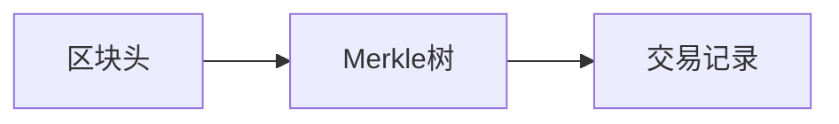
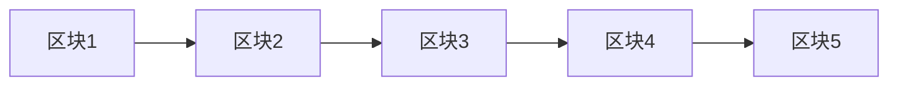
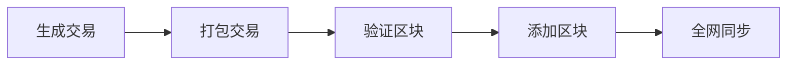
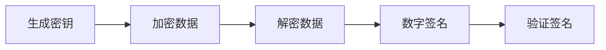
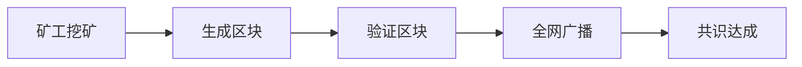

                 

### 文章标题

### 区块链在食品溯源中的应用案例

> 关键词：区块链，食品溯源，食品安全，智能合约，加密技术

> 摘要：本文将详细探讨区块链技术在食品溯源领域的应用，通过分析区块链的基本原理及其在食品安全溯源中的优势，结合实际应用案例，探讨区块链如何提高食品安全性，减少食品欺诈行为，并展望区块链在食品安全溯源领域的未来发展趋势。

### 引言与概述

#### 第1章 区块链技术概述

1.1 区块链的定义与基本原理

区块链（Blockchain）是一种去中心化的分布式数据库技术，由多个按时间顺序排列的不可篡改的数据块组成。每个数据块包含一组交易记录，这些记录通过密码学算法连接在一起，形成一条区块链。

区块链的基本原理包括以下几个方面：

- **去中心化**：区块链没有中心化的管理机构，所有节点都可以参与区块链的维护和更新。
- **去信任**：在区块链网络中，节点之间的交易无需依赖第三方信任机构，通过共识算法保证交易的有效性。
- **不可篡改**：区块链的数据一旦被记录，就几乎无法篡改，保证了数据的可靠性和透明性。
- **加密技术**：区块链使用加密技术保障数据的隐私和安全。

1.2 区块链的技术特点

区块链具有以下技术特点：

- **高安全性**：通过密码学算法确保数据的完整性和隐私性。
- **透明性**：所有区块链上的数据都是公开透明的，可以被所有节点访问。
- **去中心化**：区块链的去中心化特性降低了单点故障的风险。
- **高效率**：区块链通过分布式架构实现高效的数据处理和存储。

1.3 区块链的发展历程

区块链技术的发展历程可以分为以下几个阶段：

- **第一阶段（2008-2010）**：比特币（Bitcoin）的提出，标志着区块链技术的诞生。
- **第二阶段（2011-2014）**：区块链技术逐渐应用于金融领域，以太坊（Ethereum）等智能合约平台的推出。
- **第三阶段（2015-2018）**：区块链技术开始应用于多个行业，如供应链管理、医疗保健、能源等。
- **第四阶段（2019-至今）**：区块链技术逐渐成熟，各种应用案例不断涌现，其商业价值受到广泛关注。

1.4 区块链的应用领域

区块链技术的应用领域广泛，包括但不限于以下几个方面：

- **金融领域**：数字货币、智能合约、跨境支付等。
- **供应链管理**：食品溯源、药品溯源、物流管理等。
- **医疗保健**：病历管理、医疗记录共享、保险理赔等。
- **能源领域**：电力交易、能源管理、环境监测等。
- **其他领域**：房地产交易、版权保护、身份验证等。

#### 第2章 区块链与食品安全溯源的关系

2.1 食品安全溯源的挑战

食品安全溯源是指通过追踪食品的生产、加工、运输、销售等环节，实现对食品来源的追溯。然而，当前的食品安全溯源系统面临以下挑战：

- **数据不可靠**：传统的食品安全溯源系统依赖于中心化的数据库，数据容易受到篡改和损坏。
- **信息不对称**：食品生产和消费者之间信息不对称，消费者难以获取食品的真实信息。
- **数据孤岛**：不同环节的数据没有实现有效整合，导致溯源信息不完整。
- **成本高**：传统的食品安全溯源系统建设成本高，难以广泛普及。

2.2 区块链在食品安全溯源中的作用

区块链技术在食品安全溯源中具有以下作用：

- **提高数据可靠性**：区块链的去中心化和加密技术确保了溯源数据的不可篡改性和可靠性。
- **实现信息透明**：区块链上的数据是公开透明的，消费者可以通过区块链获取食品的真实信息。
- **降低成本**：区块链技术的去中心化特性降低了食品安全溯源系统的建设成本。
- **实现数据整合**：区块链可以实现不同环节的数据整合，提供完整的溯源信息。

2.3 区块链与食品安全溯源的契合点

区块链与食品安全溯源的契合点主要体现在以下几个方面：

- **去中心化**：食品安全溯源需要去中心化的系统，避免数据集中在某一机构，降低风险。
- **数据透明**：食品安全溯源要求数据透明，区块链技术可以提供透明的数据访问机制。
- **不可篡改**：食品安全溯源要求数据不可篡改，区块链技术可以确保数据一旦记录就难以篡改。
- **高安全性**：食品安全溯源涉及大量敏感数据，区块链技术的高安全性可以保障数据的隐私和安全。

#### 第3章 区块链在食品安全溯源中的应用案例

3.1 案例一：某食品企业利用区块链实现产品溯源

某食品企业通过区块链技术实现了产品溯源，具体实施过程如下：

1. **建立区块链网络**：企业建立了一个基于私有区块链的网络，所有参与溯源的节点都可以加入这个网络。
2. **记录生产数据**：在生产过程中，企业将生产数据记录在区块链上，包括生产日期、生产批次、生产地点等信息。
3. **记录运输数据**：在产品运输过程中，企业将运输数据记录在区块链上，包括运输日期、运输批次、运输地点等信息。
4. **记录销售数据**：在产品销售过程中，企业将销售数据记录在区块链上，包括销售日期、销售批次、销售地点等信息。
5. **消费者查询**：消费者可以通过区块链网络查询产品的溯源信息，确保产品的真实性。

3.2 案例二：某农业合作社利用区块链实现农产品溯源

某农业合作社通过区块链技术实现了农产品溯源，具体实施过程如下：

1. **建立区块链网络**：合作社建立了一个基于公有区块链的网络，所有参与溯源的节点都可以加入这个网络。
2. **记录生产数据**：合作社将农产品的生产数据记录在区块链上，包括种植日期、种植地点、种植环境等信息。
3. **记录加工数据**：合作社将农产品的加工数据记录在区块链上，包括加工日期、加工地点、加工过程等信息。
4. **记录运输数据**：合作社将农产品的运输数据记录在区块链上，包括运输日期、运输地点、运输过程等信息。
5. **消费者查询**：消费者可以通过区块链网络查询农产品的溯源信息，确保农产品的质量和安全。

3.3 案例三：某餐饮连锁企业利用区块链实现食材溯源

某餐饮连锁企业通过区块链技术实现了食材溯源，具体实施过程如下：

1. **建立区块链网络**：企业建立了一个基于私有区块链的网络，所有参与溯源的节点都可以加入这个网络。
2. **记录采购数据**：企业在采购食材时，将采购数据记录在区块链上，包括采购日期、采购批次、采购地点等信息。
3. **记录加工数据**：企业在加工食材时，将加工数据记录在区块链上，包括加工日期、加工地点、加工过程等信息。
4. **记录运输数据**：企业在运输食材时，将运输数据记录在区块链上，包括运输日期、运输地点、运输过程等信息。
5. **消费者查询**：消费者可以通过区块链网络查询食材的溯源信息，确保食材的真实性和安全。

#### 第4章 区块链在食品安全溯源中的关键技术

4.1 区块链数据结构

区块链数据结构的核心是区块和链。每个区块包含一组交易记录，以及一个指向前一区块的哈希值，从而形成一个链式结构。

- **区块**：区块是区块链的基本组成单元，包含以下信息：
  - **交易记录**：记录在区块中的交易信息，如日期、时间、交易金额等。
  - **区块头**：包含版本号、随机数、时间戳、前一区块哈希值等。
  - **Merkle树根**：用于验证区块内部交易记录的完整性。

- **链式结构**：区块链通过将每个区块与前一个区块链接起来，形成一个链式结构。每个区块都包含一个指向前一区块的哈希值，确保区块链的完整性和不可篡改性。

4.2 智能合约

智能合约是区块链上的程序代码，可以在满足特定条件时自动执行。智能合约通过以下方式实现：

- **触发条件**：智能合约包含触发条件，如交易金额、日期等。
- **执行动作**：当触发条件满足时，智能合约会自动执行相应的动作，如记录交易、更改状态等。

智能合约的实现一般采用图灵完备的编程语言，如Solidity。

4.3 加密技术

区块链中的加密技术主要用于保障数据的安全性和隐私性，包括以下几种：

- **哈希算法**：哈希算法用于生成数据摘要，确保数据的唯一性和不可篡改性。
- **非对称加密**：非对称加密用于保障数据的隐私性，如公钥加密和私钥解密。
- **数字签名**：数字签名用于确认数据来源和完整性，确保数据的真实性和可信性。

4.4 共识算法

共识算法是区块链网络中节点达成共识的机制，确保区块链的一致性和安全性。常见的共识算法包括：

- **工作量证明（PoW）**：通过计算工作量来获得区块生成权。
- **权益证明（PoS）**：通过持有代币数量来获得区块生成权。
- **委托权益证明（DPoS）**：通过选举出代表节点来生成区块。

#### 第5章 区块链数据结构解析

5.1 区块的基本组成

区块是区块链的基本组成单元，包含以下组成部分：

- **区块头**：包含版本号、随机数、时间戳、前一区块哈希值、Merkle树根等。
- **交易记录**：记录在区块中的交易信息，如日期、时间、交易金额等。
- **Merkle树**：用于验证区块内部交易记录的完整性。

区块的基本结构如下：



5.2 链式结构

区块链通过将每个区块与前一个区块链接起来，形成一个链式结构。每个区块都包含一个指向前一区块的哈希值，确保区块链的完整性和不可篡改性。

链式结构的基本原理如下：

- **链接**：每个区块都包含一个指向前一区块的哈希值，从而形成一个链式结构。
- **验证**：通过验证每个区块的哈希值，可以确保区块链的完整性和一致性。

链式结构的基本原理如下：



5.3 Mermaid流程图：区块链的工作流程

区块链的工作流程包括以下几个步骤：

1. **生成交易**：用户生成交易，交易包含交易金额、日期、接收方等。
2. **打包交易**：矿工将多个交易打包成区块。
3. **验证区块**：矿工验证区块的有效性，包括检查交易的有效性和区块的难度等。
4. **添加区块**：验证通过的区块被添加到区块链中。
5. **全网同步**：网络中的其他节点同步最新的区块链。

以下是区块链的工作流程的Mermaid流程图：



#### 第6章 智能合约原理与应用

6.1 智能合约的定义与特点

智能合约是一种运行在区块链上的程序，可以在满足特定条件时自动执行。智能合约具有以下特点：

- **自动执行**：智能合约在区块链上自动执行，无需第三方干预。
- **不可篡改**：智能合约一旦部署，就不可篡改，保证了合约的可靠性。
- **透明性**：智能合约的代码和执行过程是公开透明的，任何节点都可以查看。
- **安全性**：智能合约通过密码学算法保障数据的安全性和隐私性。

6.2 智能合约的工作原理

智能合约的工作原理如下：

1. **合约部署**：开发者编写智能合约代码，并将其部署到区块链上。
2. **合约调用**：用户通过区块链调用智能合约，触发合约的执行。
3. **条件判断**：智能合约根据调用参数和预设条件判断是否执行。
4. **执行动作**：如果条件满足，智能合约执行相应的动作，如记录交易、更改状态等。
5. **结果反馈**：智能合约执行结果反馈给用户，如交易成功或失败。

6.3 智能合约的编程语言

智能合约的编程语言通常采用图灵完备的语言，如Solidity、Vyper等。以下是Solidity语言的一个简单示例：

```solidity
pragma solidity ^0.8.0;

contract HelloWorld {
    function sayHello() public pure returns (string memory) {
        return "Hello, World!";
    }
}
```

6.4 伪代码：智能合约的编写示例

以下是一个简单的智能合约伪代码示例，用于记录用户余额：

```
pragma solidity ^0.8.0;

contract BalanceTracker {
    mapping(address => uint256) public balances;

    function deposit() public payable {
        balances[msg.sender] += msg.value;
    }

    function withdraw(uint256 amount) public {
        require(balances[msg.sender] >= amount, "Insufficient balance");
        balances[msg.sender] -= amount;
        payable(msg.sender).transfer(amount);
    }
}
```

#### 第7章 加密技术与区块链安全

7.1 哈希算法

哈希算法是区块链中的核心技术之一，用于生成数据的摘要，确保数据的唯一性和不可篡改性。常见的哈希算法包括SHA-256、SHA-3等。

- **SHA-256**：SHA-256是一种256位的哈希算法，可以生成固定长度的哈希值。
- **SHA-3**：SHA-3是NIST于2015年发布的标准，也是一种256位的哈希算法。

哈希算法的工作原理如下：

1. **输入数据**：将待加密的数据输入哈希算法。
2. **处理数据**：哈希算法对输入数据进行多次处理，生成哈希值。
3. **输出结果**：哈希算法输出固定长度的哈希值。

以下是SHA-256算法的一个简单示例：

```python
import hashlib

def sha256_hash(data):
    return hashlib.sha256(data.encode()).hexdigest()

data = "Hello, World!"
hash_value = sha256_hash(data)
print(hash_value)
```

7.2 非对称加密与数字签名

非对称加密是一种加密技术，使用一对密钥（公钥和私钥）进行加密和解密。公钥可以公开，私钥必须保密。

- **非对称加密**：使用公钥加密，私钥解密。
- **数字签名**：使用私钥签名，公钥验证。

非对称加密的工作原理如下：

1. **密钥生成**：生成一对密钥（公钥和私钥）。
2. **加密过程**：使用公钥加密数据，只有私钥可以解密。
3. **解密过程**：使用私钥解密加密数据。
4. **签名过程**：使用私钥对数据签名，公钥可以验证签名。

以下是使用RSA算法的简单示例：

```python
from Crypto.PublicKey import RSA
from Crypto.Cipher import PKCS1_OAEP

def rsa_encrypt(plaintext, public_key):
    rsa_key = RSA.import_key(public_key)
    cipher = PKCS1_OAEP.new(rsa_key)
    ciphertext = cipher.encrypt(plaintext)
    return ciphertext

def rsa_decrypt(ciphertext, private_key):
    rsa_key = RSA.import_key(private_key)
    cipher = PKCS1_OAEP.new(rsa_key)
    plaintext = cipher.decrypt(ciphertext)
    return plaintext

public_key, private_key = RSA.generate(2048)
plaintext = "Hello, World!"
ciphertext = rsa_encrypt(plaintext, public_key)
print(ciphertext)

decrypted_text = rsa_decrypt(ciphertext, private_key)
print(decrypted_text)
```

7.3 Mermaid流程图：区块链中的加密与安全机制

以下是区块链中的加密与安全机制的Mermaid流程图：



#### 第8章 共识算法与区块链网络

8.1 共识算法的概念

共识算法是区块链网络中节点达成共识的机制，确保区块链的一致性和安全性。共识算法的目标是确保所有节点对区块链的状态达成一致，即使某些节点可能受到恶意攻击。

8.2 共识算法的分类

共识算法可以分为以下几类：

- **工作量证明（PoW）**：通过计算工作量来获得区块生成权。
- **权益证明（PoS）**：通过持有代币数量来获得区块生成权。
- **委托权益证明（DPoS）**：通过选举出代表节点来生成区块。
- **授权股权证明（PoA）**：通过授权节点来生成区块。

8.3 共识算法的优缺点分析

不同共识算法具有不同的优缺点，以下是几种常见共识算法的优缺点分析：

- **工作量证明（PoW）**：
  - 优点：去中心化、公平性高、安全性高。
  - 缺点：计算资源消耗大、能源消耗高、易受到51%攻击。
- **权益证明（PoS）**：
  - 优点：能源消耗低、去中心化程度高、安全性高。
  - 缺点：权益不平衡可能导致集中化、可能受到拜占庭攻击。
- **委托权益证明（DPoS）**：
  - 优点：去中心化程度高、交易速度快、能源消耗低。
  - 缺点：选举机制可能导致集中化、安全性依赖于代表节点。
- **授权股权证明（PoA）**：
  - 优点：去中心化程度高、交易速度快、安全性高。
  - 缺点：权益不平衡可能导致集中化、安全性依赖于授权节点。

8.4 Mermaid流程图：一种共识算法的工作流程

以下是工作量证明（PoW）算法的工作流程的Mermaid流程图：



### 第三部分：应用案例分析

#### 第9章 区块链在食品溯源中的实际应用案例

9.1 案例一：某食品企业区块链溯源系统开发实践

某食品企业为了提高食品安全性，减少食品欺诈行为，决定开发一个基于区块链的溯源系统。以下是该企业区块链溯源系统开发的具体实践：

1. **需求分析**：
   - 系统需要实现食品生产、加工、运输、销售等环节的数据记录和溯源。
   - 系统需要保证数据的安全性和可靠性，防止数据篡改。
   - 系统需要提供用户友好的查询界面，方便消费者查询食品溯源信息。

2. **技术选型**：
   - 选择私有区块链作为溯源系统的底层技术，以保证系统的可控性和安全性。
   - 选择Solidity作为智能合约的编程语言。
   - 选择Python作为后端开发语言，用于构建数据接口和后台管理功能。

3. **系统设计**：
   - **数据结构设计**：设计区块链上的数据结构，包括生产记录、加工记录、运输记录和销售记录等。
   - **智能合约设计**：设计智能合约，实现数据记录、查询和验证等功能。
   - **后端服务设计**：设计后端服务，用于与区块链交互，提供数据接口和后台管理功能。

4. **开发过程**：
   - **区块链网络搭建**：搭建私有区块链网络，配置节点，确保网络的稳定性和安全性。
   - **智能合约编写**：编写智能合约代码，实现数据记录、查询和验证等功能。
   - **后端服务开发**：开发后端服务，与区块链进行交互，提供数据接口和后台管理功能。
   - **系统测试**：对系统进行功能测试、性能测试和安全测试，确保系统的可靠性和安全性。

5. **系统部署**：
   - 在生产环境中部署区块链网络和后端服务，确保系统的稳定运行。
   - 对系统进行持续优化和升级，以满足不断变化的需求。

9.2 案例二：某农产品区块链溯源平台建设

某农产品企业为了提高产品质量和安全性，决定建设一个基于区块链的溯源平台。以下是该企业区块链溯源平台建设的过程：

1. **需求分析**：
   - 平台需要实现农产品的生产、加工、运输、销售等环节的数据记录和溯源。
   - 平台需要提供实时的溯源信息查询，方便消费者了解产品信息。
   - 平台需要具备数据安全和隐私保护功能，防止数据泄露和篡改。

2. **技术选型**：
   - 选择公有区块链作为溯源平台的底层技术，以提高系统的公开透明性和可扩展性。
   - 选择以太坊作为智能合约平台，实现去中心化的数据记录和查询。
   - 选择Node.js作为后端开发语言，用于构建数据接口和后台管理功能。

3. **系统设计**：
   - **数据结构设计**：设计区块链上的数据结构，包括生产记录、加工记录、运输记录和销售记录等。
   - **智能合约设计**：设计智能合约，实现数据记录、查询和验证等功能。
   - **后端服务设计**：设计后端服务，用于与区块链交互，提供数据接口和后台管理功能。
   - **前端界面设计**：设计用户友好的查询界面，方便消费者查询产品溯源信息。

4. **开发过程**：
   - **区块链网络搭建**：搭建公有区块链网络，配置节点，确保网络的稳定性和安全性。
   - **智能合约编写**：编写智能合约代码，实现数据记录、查询和验证等功能。
   - **后端服务开发**：开发后端服务，与区块链进行交互，提供数据接口和后台管理功能。
   - **前端界面开发**：开发前端界面，实现用户友好的查询功能。
   - **系统测试**：对系统进行功能测试、性能测试和安全测试，确保系统的可靠性和安全性。

5. **系统部署**：
   - 在生产环境中部署区块链网络、后端服务和前端界面，确保系统的稳定运行。
   - 对系统进行持续优化和升级，以满足不断变化的需求。

9.3 案例三：某餐饮连锁企业区块链溯源解决方案

某餐饮连锁企业为了提高食品安全性，减少食品欺诈行为，决定采用区块链技术实现食材溯源。以下是该企业区块链溯源解决方案的实施过程：

1. **需求分析**：
   - 系统需要实现食材采购、加工、配送、销售等环节的数据记录和溯源。
   - 系统需要保证数据的安全性和可靠性，防止数据篡改。
   - 系统需要提供实时溯源信息查询，方便消费者了解食材信息。

2. **技术选型**：
   - 选择私有区块链作为溯源系统的底层技术，以保证系统的可控性和安全性。
   - 选择Solidity作为智能合约的编程语言。
   - 选择Java作为后端开发语言，用于构建数据接口和后台管理功能。

3. **系统设计**：
   - **数据结构设计**：设计区块链上的数据结构，包括采购记录、加工记录、配送记录和销售记录等。
   - **智能合约设计**：设计智能合约，实现数据记录、查询和验证等功能。
   - **后端服务设计**：设计后端服务，用于与区块链交互，提供数据接口和后台管理功能。
   - **前端界面设计**：设计用户友好的查询界面，方便消费者查询食材溯源信息。

4. **开发过程**：
   - **区块链网络搭建**：搭建私有区块链网络，配置节点，确保网络的稳定性和安全性。
   - **智能合约编写**：编写智能合约代码，实现数据记录、查询和验证等功能。
   - **后端服务开发**：开发后端服务，与区块链进行交互，提供数据接口和后台管理功能。
   - **前端界面开发**：开发前端界面，实现用户友好的查询功能。
   - **系统测试**：对系统进行功能测试、性能测试和安全测试，确保系统的可靠性和安全性。

5. **系统部署**：
   - 在生产环境中部署区块链网络、后端服务和前端界面，确保系统的稳定运行。
   - 对系统进行持续优化和升级，以满足不断变化的需求。

### 第四部分：技术展望与未来趋势

#### 第10章 区块链在食品安全溯源中的挑战与展望

10.1 区块链在食品安全溯源中的挑战

尽管区块链技术在食品安全溯源中具有显著的优势，但在实际应用中仍面临以下挑战：

- **技术成熟度**：区块链技术尚未完全成熟，其在大规模商业应用中的稳定性、性能和安全性仍需进一步验证。
- **成本问题**：区块链技术的部署和维护成本较高，对于中小企业来说可能是一个负担。
- **数据隐私**：在区块链上记录的食品溯源数据是公开透明的，如何保护消费者的隐私是一个重要问题。
- **法律法规**：区块链技术的法律法规尚未完善，如何在法律框架内实施区块链食品安全溯源系统是一个挑战。
- **标准化**：目前缺乏统一的区块链食品安全溯源技术标准和规范，不同系统之间的互操作性需要进一步解决。

10.2 区块链在食品安全溯源中的应用前景

尽管面临挑战，区块链技术在食品安全溯源中的应用前景仍然广阔：

- **提高食品安全性**：区块链技术可以确保食品溯源数据的真实性和不可篡改性，提高食品安全性。
- **增强消费者信任**：消费者可以通过区块链查询食品的溯源信息，增强对食品的信任。
- **降低成本**：区块链技术可以简化食品溯源流程，降低成本。
- **提高效率**：区块链技术可以实现食品溯源数据的实时共享，提高供应链的效率。
- **促进可持续发展**：区块链技术可以为食品供应链的可持续发展提供技术支持。

10.3 区块链在食品安全溯源中的未来发展趋势

未来，区块链在食品安全溯源中的应用将呈现以下发展趋势：

- **技术成熟与优化**：随着区块链技术的不断发展，其性能、稳定性和安全性将得到提升，为大规模商业应用奠定基础。
- **行业标准化**：逐步建立统一的区块链食品安全溯源技术标准和规范，提高系统之间的互操作性。
- **跨行业融合**：区块链技术与物联网、大数据、人工智能等技术的融合，将进一步推动食品安全溯源的发展。
- **政策支持**：政府将加大对区块链技术在食品安全溯源中的支持力度，推动相关法律法规的制定和完善。
- **全球合作**：国际间的合作将进一步推动区块链在食品安全溯源中的应用，促进全球食品安全体系的构建。

### 第五部分：技术展望与未来趋势

#### 第11章 区块链技术发展趋势

随着区块链技术的不断发展，其应用领域也在不断拓展。未来，区块链技术将呈现出以下发展趋势：

1. **技术成熟与优化**：随着区块链技术的不断成熟，其在性能、稳定性和安全性方面的表现将得到显著提升。加密算法、共识算法、分布式存储等技术将得到进一步优化，以满足不同应用场景的需求。

2. **跨行业融合**：区块链技术将与物联网、大数据、人工智能等新兴技术进行深度融合，推动各行业的创新发展。例如，区块链与物联网技术的结合可以实现设备的智能联网和数据共享，提高供应链的透明度和效率。

3. **行业标准化**：随着区块链技术的广泛应用，行业标准化工作将逐步推进。建立统一的区块链技术标准和规范，有助于提高系统之间的互操作性，降低开发成本和门槛。

4. **政策支持**：各国政府将加大对区块链技术的政策支持力度，推动相关法律法规的制定和完善。这将有助于规范区块链技术的发展，促进其在各个领域的应用。

5. **国际合作**：随着区块链技术的全球影响力不断提升，国际间的合作也将不断加强。各国将共同推进区块链技术的发展，促进全球区块链生态系统的构建。

#### 第12章 区块链在食品溯源领域的未来展望

在未来，区块链技术在食品溯源领域的发展前景广阔，主要表现在以下几个方面：

1. **全面覆盖**：随着区块链技术的普及，越来越多的食品企业和供应链环节将采用区块链技术实现溯源，从而实现食品溯源的全面覆盖。

2. **数据透明**：区块链技术的应用将使食品溯源数据更加透明，消费者可以通过区块链查询食品的完整溯源信息，提高对食品安全的信任。

3. **降低成本**：区块链技术可以简化食品溯源流程，降低食品企业的运营成本。同时，通过区块链实现数据共享和智能合约，可以降低供应链的管理成本。

4. **提高效率**：区块链技术的实时数据共享和智能合约功能，将提高食品供应链的运作效率，减少物流和时间成本。

5. **可持续发展**：区块链技术可以记录食品生产、加工、运输等环节的碳排放数据，促进食品行业的可持续发展。

6. **法规支持**：各国政府将加大对区块链技术在食品溯源领域的政策支持力度，推动相关法律法规的制定和完善，为区块链技术在食品溯源中的应用提供保障。

7. **创新应用**：未来，区块链技术在食品溯源领域将不断创新应用，如结合物联网技术实现智能农场、智能仓库等，为食品行业带来更多可能性。

### 结语

区块链技术在食品安全溯源中的应用，不仅为食品安全提供了技术保障，也为食品行业的可持续发展提供了新的思路。通过本文的介绍，我们深入了解了区块链技术在食品安全溯源中的应用原理、关键技术以及实际应用案例。展望未来，随着区块链技术的不断发展和完善，其在食品安全溯源领域将发挥越来越重要的作用，为构建全球食品安全体系贡献力量。我们期待更多企业和机构加入区块链技术的创新和应用，共同推动食品安全溯源技术的发展。

### 附录

#### 附录A 区块链技术相关资源

A.1 区块链开发工具与平台

- **Ethereum**：以太坊是一个开源的智能合约平台，支持去中心化应用（DApp）的开发。
- **Hyperledger Fabric**：Hyperledger Fabric 是一个由Linux基金会推出的开源区块链框架，适用于企业级应用。
- **EOSIO**：EOSIO 是一个高性能的区块链平台，支持智能合约和分布式应用。
- **EOS**：EOS 是一个基于区块链的去中心化操作系统，支持DApp的开发和运行。

A.2 区块链学习资源推荐

- **区块链技术指南**：一本全面介绍区块链技术的入门书籍，适合初学者阅读。
- **精通区块链开发**：一本深入讲解区块链开发技术的书籍，适合有一定编程基础的读者。
- **以太坊开发指南**：一本专门讲解以太坊智能合约开发的书籍，适合以太坊开发者阅读。

A.3 区块链社区与论坛

- **Bitcoin Stack Exchange**：比特币和区块链技术的问答社区。
- **Ethereum Stack Exchange**：以太坊和智能合约的问答社区。
- **Blockchain Council**：区块链教育和认证的官方网站。
- **Bitcoin Forum**：比特币和区块链技术的讨论论坛。

#### 附录B 食品溯源相关标准与法规

B.1 国际食品安全溯源标准

- **ISO 22005**：国际标准化组织（ISO）发布的农产品追溯标准。
- **ISO 22003**：国际标准化组织（ISO）发布的食品安全管理体系标准。
- **ISO 22000**：国际标准化组织（ISO）发布的食品安全管理体系标准。

B.2 我国食品安全溯源法规

- **《中华人民共和国食品安全法》**：我国制定的食品安全基本法规，规定了食品生产经营者的溯源责任。
- **《食品安全追溯管理办法》**：我国制定的食品安全追溯管理规章，明确了食品安全追溯的基本要求和管理措施。
- **《农产品质量安全法》**：我国制定的农产品质量安全基本法规，规定了农产品生产经营者的溯源责任。

B.3 各地区食品安全溯源政策综述

- **《上海市食品安全追溯体系建设实施方案》**：上海市制定的具体实施方案，旨在建立食品安全追溯体系。
- **《北京市食品安全条例》**：北京市制定的食品安全法规，对食品安全追溯提出了具体要求。
- **《广东省食品安全条例》**：广东省制定的食品安全法规，对食品安全追溯提出了具体要求。

通过以上附录，读者可以更好地了解区块链技术和食品溯源的相关资源、标准和法规，为区块链在食品安全溯源中的应用提供参考。同时，也期望更多读者关注并参与到区块链技术的创新和应用中来，共同推动食品安全溯源技术的发展。

### 作者信息

作者：AI天才研究院/AI Genius Institute & 禅与计算机程序设计艺术 /Zen And The Art of Computer Programming

