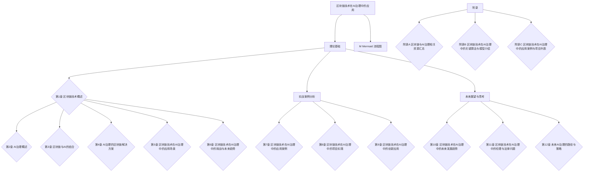

                 

### 文章标题

《区块链技术在AI治理中的应用》

关键词：区块链技术、AI治理、智能合约、数据隐私、算法公平性、应用场景、未来趋势

摘要：本文详细探讨了区块链技术在AI治理中的应用。首先，我们概述了区块链技术和AI治理的基本概念及其重要性。接着，分析了区块链与AI技术结合的潜在应用和挑战。随后，重点介绍了区块链在数据隐私保护、智能合约和算法公平性保障中的具体应用。文章还探讨了区块链技术在金融、医疗和社交媒体等领域的AI治理应用场景，以及面临的挑战与未来发展趋势。通过实际案例和项目实践，本文展示了区块链技术如何为AI治理提供有效的解决方案，并提出了未来发展的建议和展望。

### 目录大纲

# 《区块链技术在AI治理中的应用》

## 第一部分: 理论基础

### 第1章: 区块链技术概述
- 区块链的定义与工作原理
- 区块链的架构与技术特点
- 区块链的核心优势与应用领域

### 第2章: AI治理概述
- AI治理的概念与重要性
- AI治理面临的挑战与问题
- AI治理的原则与目标

### 第3章: 区块链与AI的结合
- 区块链在AI治理中的潜在应用
- 区块链与AI技术融合的挑战与机遇
- 区块链技术在AI治理中的核心价值

### 第4章: AI治理的区块链解决方案
- 区块链在数据隐私保护中的应用
- 区块链在智能合约与可信执行环境中的应用
- 区块链在算法公平性与透明性保障中的应用

### 第5章: 区块链技术在AI治理中的应用场景
- 金融行业的AI治理
- 医疗行业的AI治理
- 社交媒体与内容平台的AI治理

### 第6章: 区块链技术在AI治理中的挑战与未来趋势
- 区块链技术在AI治理中的局限性与解决方案
- 区块链技术在AI治理中的未来发展趋势与前景
- 区块链技术与AI治理的融合创新方向

## 第二部分: 实战案例分析

### 第7章: 区块链技术在AI治理中的应用案例
- 案例一：某金融公司的区块链AI风险管理
- 案例二：某医疗机构的区块链AI诊疗系统
- 案例三：某社交媒体平台的区块链AI内容审核

### 第8章: 区块链技术在AI治理中的项目实践
- 项目一：区块链AI数据隐私保护系统的设计与实现
- 项目二：区块链智能合约在AI模型可信执行中的应用
- 项目三：区块链算法公平性检测与保障系统的实现

### 第9章: 区块链技术在AI治理中的创新应用
- 区块链与AI协同治理模式探索
- 区块链在AI治理中的跨界合作案例分析
- 区块链技术与AI治理的深度融合创新

## 第三部分: 未来展望与思考

### 第10章: 区块链技术在AI治理中的未来发展趋势
- 区块链技术与AI治理的协同发展
- 区块链在AI治理中的新应用领域
- 区块链技术与AI治理的未来发展方向

### 第11章: 区块链技术在AI治理中的伦理与法律问题
- 区块链技术在AI治理中的伦理挑战
- 区块链技术在AI治理中的法律问题与应对策略
- 区块链技术与AI治理的伦理法律框架构建

### 第12章: 未来AI治理的路径与策略
- 区块链技术在AI治理中的战略布局
- 未来AI治理的发展趋势与策略
- AI治理与区块链技术融合的未来路径

### 附录
- 附录A：区块链与AI治理相关资源汇总
- 附录B：区块链技术在AI治理中的关键算法与模型介绍
- 附录C：区块链技术在AI治理中的应用案例与项目列表

## Mermaid 流程图



## 引言

在当今数字化时代，人工智能（AI）技术已经成为推动社会进步和经济发展的关键动力。然而，随着AI技术的迅猛发展和广泛应用，AI治理成为一个日益重要的议题。AI治理涉及如何确保AI系统的公正性、透明性、安全性以及保护用户隐私等方面，这不仅是技术问题，更是社会、伦理和法律问题。有效的AI治理对于维护社会的公平正义、保障公共安全和推动技术创新具有重要意义。

区块链技术作为一种新兴的去中心化分布式账本技术，以其独特的安全性、透明性和不可篡改性，逐渐引起了广泛关注。区块链不仅被用于数字货币交易，还在供应链管理、身份验证、数据共享等领域展现出了巨大的潜力。特别是在AI治理方面，区块链技术提供了一种潜在的解决方案，可以有效应对AI治理中的数据隐私、算法公平性和透明性等问题。

本文将系统地探讨区块链技术在AI治理中的应用。首先，我们将概述区块链技术和AI治理的基本概念，介绍它们的工作原理和核心特点。接着，分析区块链与AI技术结合的潜在应用和面临的挑战，探讨区块链在AI治理中的核心价值。随后，我们将深入探讨区块链在数据隐私保护、智能合约和算法公平性保障等方面的具体应用，并分析区块链技术在金融、医疗和社交媒体等领域的AI治理应用场景。接下来，我们将讨论区块链技术在AI治理中的挑战和未来发展趋势。通过实际案例和项目实践，我们将展示区块链技术如何为AI治理提供有效的解决方案，并探讨其创新应用方向。最后，我们将总结本文的主要观点，并提出未来AI治理和区块链技术融合的发展建议。

通过对区块链技术在AI治理中的应用进行系统性的探讨，本文旨在为读者提供深入了解和思考，为推动AI治理的技术创新和社会实践提供参考。

### 区块链技术概述

区块链技术作为一种革命性的分布式账本技术，起源于2008年，当时一个化名为“中本聪”（Satoshi Nakamoto）的神秘人物发布了比特币（Bitcoin）的创世论文《比特币：一种点对点的电子现金系统》。这一创新性论文揭示了区块链技术的核心概念和潜力，引发了对去中心化、透明性和不可篡改性的广泛关注。

#### 定义与工作原理

区块链可以被定义为一个分布式数据库，它由一系列按时间顺序排列的数据块组成，每个数据块都包含了若干次交易记录。这些数据块通过加密算法和共识机制连接在一起，形成了一个不可篡改的链式结构。

每个区块链网络都包含多个节点，每个节点都存储了一份完整的区块链副本。这些节点通过共识机制（如工作量证明Proof of Work、权益证明Proof of Stake等）来验证交易的有效性，并确保所有节点的账本保持一致。

区块链的工作原理主要包括以下几个关键步骤：

1. **交易生成**：用户通过区块链网络发起交易，交易信息包括发送方的公钥、接收方的公钥以及交易金额等。
2. **交易验证**：交易信息经过加密和签名后，由网络中的节点进行验证。节点会检查交易的有效性，如是否超出账户余额、是否重复交易等。
3. **区块生成**：当多个交易经过验证后，节点将它们打包成一个区块。每个区块包含一个时间戳和一个指向前一个区块的哈希值，从而形成一个链式结构。
4. **共识机制**：节点通过共识机制达成一致，确定哪个区块将添加到区块链中。共识机制的不同，如工作量证明、权益证明等，决定了区块链的共识效率和安全性。
5. **区块链更新**：一旦区块被添加到区块链中，整个网络的所有节点都会更新其账本，确保所有节点都有一份完整的区块链副本。

#### 架构与技术特点

区块链的架构可以大致分为三层：数据层、网络层和应用层。

1. **数据层**：数据层是区块链的核心，包括账本、加密算法和共识机制等。账本记录了所有交易信息，加密算法确保交易信息的隐私性和安全性，共识机制确保所有节点的账本保持一致。
2. **网络层**：网络层负责节点之间的通信和数据传输。节点通过特定的协议进行交互，如P2P（点对点）网络协议，确保网络的高效和安全运行。
3. **应用层**：应用层是区块链技术的具体应用，如数字货币、智能合约、数据共享等。应用层通过调用数据层和网络层的功能，实现各种业务逻辑和数据管理。

区块链的技术特点主要包括：

- **去中心化**：区块链网络由多个节点组成，没有中央控制机构，所有节点平等参与网络管理和交易验证。
- **不可篡改性**：一旦数据被记录在区块链中，就难以被篡改。由于区块链的链式结构，篡改一个区块将导致整个链的结构被破坏，这需要巨大的计算资源，几乎不可能实现。
- **透明性**：区块链上的所有交易记录都是公开透明的，任何节点都可以查看和验证交易信息，确保系统的公正性和可信性。
- **安全性**：区块链利用加密算法和共识机制，确保交易信息的安全性和完整性。即使某个节点被攻击，也不会影响整个网络的运行和安全。

#### 核心优势与应用领域

区块链技术具有多个核心优势，使其在多个领域展现出了巨大潜力：

1. **数据隐私保护**：区块链的加密算法确保交易信息的隐私性，同时，去中心化的结构使得数据分散存储，降低了隐私泄露的风险。
2. **透明性和可追溯性**：区块链上的所有交易记录都是公开透明的，用户可以查看和验证交易信息，确保系统的公正性和可追溯性。
3. **去中心化和去信任**：区块链去中心化的结构减少了中心化机构带来的信任问题，所有节点平等参与网络管理和交易验证，确保系统的安全性和可靠性。
4. **智能合约**：区块链的智能合约是一种自动执行的合约，通过编程代码定义和执行合同条款，确保合同的自动执行和不可篡改性。

区块链技术的应用领域非常广泛，包括但不限于以下几个方面：

- **数字货币**：比特币、以太坊等数字货币是区块链技术的经典应用，通过区块链实现去中心化的货币交易。
- **供应链管理**：区块链技术可以用于供应链管理，确保供应链的透明性和可追溯性，提高供应链的效率和管理水平。
- **身份验证与数据共享**：区块链技术可以用于身份验证和数据共享，确保数据的隐私性和安全性。
- **金融领域**：区块链技术可以用于金融领域的交易结算、信用评估和风险管理等，提高金融服务的效率和安全。
- **医疗健康**：区块链技术可以用于医疗健康数据的存储和管理，确保患者隐私保护，提高医疗数据的安全性和可信性。
- **物联网**：区块链技术可以用于物联网设备的数据管理和安全通信，确保物联网系统的可靠性和安全性。

总之，区块链技术以其独特的安全性、透明性和不可篡改性，为多个领域的应用提供了新的解决方案和机遇。在AI治理方面，区块链技术的应用潜力尤为巨大，可以有效应对AI治理中的数据隐私、算法公平性和透明性等问题，为构建更加公正、安全和高效的AI治理体系提供重要支持。

### AI治理概述

AI治理是指通过制定和实施政策、法规、标准、协议等，确保人工智能技术的开发、应用和管理符合社会、伦理和法律的要求，以实现人工智能技术的可持续发展和社会公共利益。随着人工智能技术的迅猛发展，AI治理的重要性日益凸显。

#### 概念与重要性

AI治理的概念可以从多个角度进行理解：

1. **技术角度**：AI治理涉及如何管理和控制人工智能技术的发展，确保其安全性、可靠性和透明性。
2. **社会角度**：AI治理关注人工智能技术对社会、经济和文化等方面的影响，以及如何确保这些影响是积极的、可持续的。
3. **伦理角度**：AI治理探讨人工智能技术的伦理问题，包括隐私保护、公平性、责任归属等，以确保人工智能技术的道德规范和人文关怀。
4. **法律角度**：AI治理涉及制定和实施相关法律法规，规范人工智能技术的开发和应用，保护用户的合法权益。

AI治理的重要性体现在以下几个方面：

1. **确保技术安全**：随着AI技术的广泛应用，技术安全成为关键问题。有效的AI治理可以确保AI系统的安全性和可靠性，防止潜在的技术风险。
2. **促进公平公正**：AI技术可能带来社会不平等和歧视，如算法偏见、数据歧视等。AI治理有助于确保AI技术的公平性和公正性，减少技术带来的负面影响。
3. **保护隐私权**：AI技术在数据收集、处理和分析过程中，可能涉及大量个人隐私信息。AI治理可以规范数据收集和使用，保护用户的隐私权。
4. **规范市场秩序**：AI技术的快速发展带来了市场秩序的混乱。AI治理可以规范市场竞争，维护市场秩序，促进技术进步和经济发展。
5. **推动可持续发展**：AI技术对环境保护、资源利用等方面具有重要影响。AI治理可以确保AI技术符合可持续发展目标，推动社会和经济的可持续发展。

#### 挑战与问题

尽管AI治理的重要性日益凸显，但在实际应用中仍面临诸多挑战和问题：

1. **技术挑战**：AI技术的复杂性和不确定性使得治理过程充满挑战。如何确保AI系统的安全、可靠和透明，如何应对算法偏见和歧视等问题，都是技术层面的重要挑战。
2. **数据隐私问题**：AI技术的应用通常涉及大量个人数据，如何保护用户隐私成为关键问题。数据泄露、滥用和歧视等问题需要有效治理。
3. **公平性问题**：AI技术的决策过程可能受到数据偏差、算法偏见等因素的影响，导致不公平的决策结果。如何确保AI系统的公平性和公正性，是AI治理的重要问题。
4. **法律监管不足**：当前的法律体系尚未完全适应AI技术的发展，法律监管存在空白和滞后。如何完善法律体系，加强对AI技术的监管，是AI治理面临的重要问题。
5. **跨领域协作**：AI治理涉及多个领域和利益相关方，如政府、企业、学术界和公众等。如何实现跨领域协作，形成共识和协同治理，是AI治理的重要挑战。
6. **伦理困境**：AI技术的应用可能引发伦理困境，如机器伦理、责任归属等。如何在技术发展中兼顾伦理考量，是AI治理需要解决的难题。

#### 原则与目标

为了应对AI治理的挑战和问题，AI治理应遵循以下原则和目标：

1. **透明性和可解释性**：确保AI系统的决策过程透明，用户能够理解和解释AI系统的决策依据和结果。
2. **公平性和公正性**：确保AI系统在决策过程中公平对待所有用户，避免算法偏见和数据歧视。
3. **安全性**：确保AI系统的安全性，防止恶意攻击和数据泄露，保障系统的稳定运行。
4. **隐私保护**：规范数据收集和使用，确保用户的隐私权得到保护，减少隐私泄露和滥用风险。
5. **法律合规**：确保AI系统的开发和应用符合相关法律法规，遵守市场规则和社会伦理。
6. **社会责任**：推动AI技术的可持续发展，促进社会和谐与进步，实现技术和社会的协调发展。

通过遵循上述原则和目标，AI治理可以有效应对技术、伦理、法律和社会等各个方面的挑战，为人工智能技术的健康、可持续发展提供有力保障。

### 区块链与AI的结合

区块链技术与人工智能（AI）技术的结合为AI治理带来了新的机遇和挑战。这种结合不仅拓展了区块链技术的应用领域，也为AI技术的治理提供了新的思路和工具。

#### 潜在应用

区块链技术在AI治理中的应用具有广泛的前景，主要体现在以下几个方面：

1. **数据隐私保护**：AI系统的训练和运行通常需要大量数据，而这些数据往往包含个人隐私信息。区块链技术的加密和去中心化特性可以有效保护数据隐私，防止数据泄露和滥用。通过区块链，数据可以在分布式网络中安全存储和共享，用户可以控制自己的数据访问权限，从而保护个人隐私。

2. **智能合约**：智能合约是一种自动执行的合约，通过编程代码定义和执行合同条款。在AI治理中，智能合约可以用于自动化监管和合规性检查，确保AI系统的决策过程符合相关法律法规和社会伦理要求。例如，智能合约可以自动触发违规行为的处罚机制，提高治理效率。

3. **算法公平性和透明性保障**：区块链技术可以用于记录和验证AI算法的执行过程，确保算法的透明性和可追溯性。通过区块链，AI系统的决策过程可以被公开验证，用户可以查询和监督AI系统的决策依据和结果，从而增强算法的公平性和公正性。此外，区块链技术还可以用于检测和纠正算法偏见，确保AI系统在决策过程中公平对待所有用户。

4. **去中心化管理**：区块链技术可以实现去中心化的治理模式，减少对中心化机构的依赖，提高治理效率和透明度。在AI治理中，去中心化治理模式可以减少权力集中和腐败风险，确保治理过程的公正和透明。

#### 挑战与机遇

尽管区块链技术在AI治理中具有巨大潜力，但其融合也面临一些挑战和机遇：

1. **技术挑战**：区块链技术和AI技术的结合需要解决多个技术难题，如数据隐私保护、智能合约的可扩展性和性能等。此外，AI算法的复杂性和不确定性也对区块链技术提出了更高的要求。

2. **法律法规**：当前的法律体系尚未完全适应区块链和AI技术的快速发展，相关法律法规存在滞后和空白。如何在法律层面规范区块链技术在AI治理中的应用，是一个亟待解决的问题。

3. **伦理问题**：区块链技术在AI治理中的应用可能引发新的伦理问题，如数据隐私、算法公平性和责任归属等。如何平衡技术创新和伦理考量，是一个重要的挑战。

4. **跨领域协作**：区块链技术和AI治理涉及多个领域和利益相关方，如政府、企业、学术界和公众等。如何实现跨领域协作，形成共识和协同治理，是AI治理需要解决的难题。

5. **机遇**：区块链技术在AI治理中的应用带来了新的发展机遇，如去中心化治理模式的探索、智能合约的创新应用等。通过区块链技术，可以构建更加公正、透明和高效的AI治理体系，推动人工智能技术的健康、可持续发展。

#### 核心价值

区块链技术在AI治理中的核心价值体现在以下几个方面：

1. **数据隐私保护**：区块链技术的加密和去中心化特性可以有效保护数据隐私，减少数据泄露和滥用风险。通过区块链，用户可以控制自己的数据访问权限，从而保障个人隐私。

2. **透明性和可追溯性**：区块链技术可以记录和验证AI算法的执行过程，确保算法的透明性和可追溯性。用户可以查询和监督AI系统的决策依据和结果，从而增强算法的公平性和公正性。

3. **智能合约**：智能合约可以用于自动化监管和合规性检查，确保AI系统的决策过程符合相关法律法规和社会伦理要求。通过智能合约，可以自动触发违规行为的处罚机制，提高治理效率。

4. **去中心化管理**：区块链技术可以实现去中心化的治理模式，减少对中心化机构的依赖，提高治理效率和透明度。通过去中心化治理模式，可以减少权力集中和腐败风险，确保治理过程的公正和透明。

综上所述，区块链技术与AI技术的结合为AI治理提供了新的思路和工具，通过数据隐私保护、智能合约、算法公平性保障和去中心化管理等方面的应用，可以有效提升AI治理的效率和公正性。然而，其融合也面临一些挑战，需要从技术、法律、伦理和跨领域协作等方面进行深入研究和探索。

### AI治理的区块链解决方案

区块链技术在AI治理中的应用为解决一系列关键问题提供了创新的解决方案。以下是区块链在数据隐私保护、智能合约和算法公平性保障等领域的具体应用：

#### 数据隐私保护

1. **数据加密与匿名化**：
   区块链技术通过加密算法和去中心化存储，有效保护数据隐私。在数据收集和处理过程中，所有数据都会进行加密，只有拥有相应解密密钥的用户才能访问和解读数据。此外，区块链还可以使用零知识证明（Zero-Knowledge Proof）等匿名化技术，确保数据在传输和存储过程中不被泄露。

2. **权限管理与访问控制**：
   区块链技术通过智能合约实现数据的权限管理和访问控制。用户可以设置数据访问权限，只有授权的用户才能访问特定数据。智能合约通过代码自动执行访问控制规则，确保数据访问的透明性和安全性。

3. **分布式数据存储**：
   区块链的去中心化特性使得数据分布在多个节点上存储，降低了单点故障的风险，同时也防止了中心化存储可能带来的数据泄露风险。分布式存储机制确保数据不会集中在一个地方，从而提高了数据的抗攻击能力和安全性。

#### 智能合约

1. **自动化执行与合规性检查**：
   智能合约是一种自执行合约，通过区块链网络上的编程代码定义和执行合同条款。在AI治理中，智能合约可以自动执行监管规则和合规性检查，确保AI系统的决策过程符合法律法规和社会伦理要求。例如，当AI系统做出不公正的决策时，智能合约可以自动触发惩罚机制。

2. **透明化审计**：
   智能合约的所有执行过程都被记录在区块链上，用户可以随时查看和审计合约的执行情况。这种透明化的机制提高了AI系统的可信度，增强了公众对AI治理的信任。

3. **降低信任成本**：
   区块链技术通过去中心化的机制，减少了在AI治理过程中对中心化机构的依赖，从而降低了信任成本。用户无需依赖中心化机构进行数据验证和决策执行，而是通过区块链网络上的共识机制实现自动化和可信的执行。

#### 算法公平性保障

1. **算法透明性和可解释性**：
   区块链技术可以记录和验证AI算法的执行过程，确保算法的透明性和可解释性。用户可以查询和监督AI系统的决策依据和结果，确保算法的决策过程是公正和透明的。

2. **算法偏见检测与纠正**：
   区块链技术可以用于检测和纠正AI算法中的偏见。通过对比区块链记录的决策过程和实际决策结果，可以发现和纠正算法中的偏见。例如，通过区块链记录的数据，可以发现某些算法在处理特定群体数据时存在歧视现象，进而进行调整和优化。

3. **分布式算法优化**：
   区块链技术可以支持分布式算法的优化。通过区块链网络中的节点协作，可以共同优化AI算法，提高算法的公平性和准确性。例如，在医疗诊断领域，区块链技术可以支持多个医疗机构共享数据，共同优化诊断算法，从而提高诊断的准确性和公平性。

#### 实施案例

1. **金融行业的AI治理**：
   在金融行业，区块链技术可以用于AI风险管理。金融机构可以使用区块链智能合约自动化执行风险管理规则，确保AI系统的决策过程符合法律法规和内部政策。同时，区块链技术还可以用于监控和审计AI系统的交易记录，提高交易的可追溯性和透明性。

2. **医疗行业的AI诊疗**：
   在医疗行业，区块链技术可以用于AI诊疗系统的数据管理和隐私保护。医疗机构可以使用区块链技术确保患者数据的隐私性和安全性，同时通过智能合约实现数据共享和协作。例如，在癌症治疗中，多家医疗机构可以通过区块链共享患者数据，共同优化诊断和治疗算法。

3. **社交媒体与内容平台的AI治理**：
   在社交媒体和内容平台，区块链技术可以用于AI内容审核和数据管理。平台可以通过区块链智能合约自动执行内容审核规则，防止虚假信息和不良内容的传播。同时，区块链技术可以记录用户行为数据，确保内容审核的透明性和公正性。

总之，区块链技术在AI治理中的应用为解决数据隐私保护、算法公平性保障和合规性检查等问题提供了有效的解决方案。通过区块链技术的应用，可以构建更加公正、透明和高效的AI治理体系，为人工智能技术的健康、可持续发展提供有力支持。

### 区块链技术在AI治理中的应用场景

区块链技术因其去中心化、透明性和不可篡改性的特点，在多个领域的AI治理中展现了巨大的应用潜力。以下将分别探讨区块链技术在金融行业、医疗行业和社交媒体与内容平台等领域的AI治理应用。

#### 金融行业的AI治理

在金融行业，区块链技术的应用主要集中在AI风险管理、智能合约和合规性审计等方面。以下是一些具体的应用场景：

1. **AI风险管理**：
   金融公司可以利用区块链技术对AI模型的决策过程进行监控和审计，确保模型的决策透明、公正。通过区块链记录AI模型的训练数据和决策逻辑，用户可以查询和验证AI模型的决策过程，从而减少模型偏见和错误决策的风险。例如，区块链技术可以用于监控信用评分模型的训练过程，确保模型对不同群体的评分是公平的。

2. **智能合约**：
   在金融交易中，区块链智能合约可以用于自动化执行交易合同，提高交易效率和透明度。智能合约通过预设的规则自动执行交易，确保交易过程符合法律法规和公司政策。例如，智能合约可以用于自动化处理跨境支付，减少人工干预和错误风险，提高交易效率。

3. **合规性审计**：
   区块链技术可以用于审计金融交易的合规性。金融监管机构可以利用区块链记录的交易数据，进行实时审计和监管，确保金融机构的交易活动符合法律法规。例如，区块链技术可以用于记录和验证金融机构的客户身份验证过程，确保合规性要求得到满足。

#### 医疗行业的AI诊疗

在医疗行业，区块链技术可以用于患者数据管理、AI诊疗系统的隐私保护和协作诊断等方面。以下是一些具体的应用场景：

1. **患者数据管理**：
   医疗机构可以利用区块链技术确保患者数据的隐私性和安全性。通过区块链，患者可以控制自己的数据访问权限，确保数据不被未经授权的人员访问。例如，患者可以在区块链上存储自己的医疗记录，并决定哪些医生和医疗机构可以访问这些数据。

2. **AI诊疗系统**：
   区块链技术可以用于管理和验证AI诊疗系统的数据来源和决策过程，确保系统的透明性和可信性。医疗机构可以在区块链上记录AI诊疗系统的训练数据和诊断逻辑，用户可以查询和验证AI系统的决策过程。例如，区块链技术可以用于监控AI肿瘤诊断系统的训练过程，确保诊断结果准确可靠。

3. **协作诊断**：
   区块链技术可以支持多医疗机构之间的数据共享和协作诊断。通过区块链，多家医疗机构可以共享患者数据，共同优化AI诊疗模型，提高诊断准确性和效率。例如，在癌症治疗中，多家医疗机构可以通过区块链共享患者数据，共同优化诊断和治疗算法。

#### 社交媒体与内容平台的AI治理

在社交媒体和内容平台，区块链技术可以用于内容审核、用户行为记录和算法公平性保障等方面。以下是一些具体的应用场景：

1. **内容审核**：
   社交媒体平台可以利用区块链技术自动化执行内容审核规则，确保平台内容的安全性和合规性。例如，区块链智能合约可以用于自动化执行内容审核规则，自动屏蔽不良信息和虚假内容，提高审核效率。

2. **用户行为记录**：
   区块链技术可以用于记录用户在社交媒体平台的行为数据，确保数据的透明性和公正性。用户可以查询和验证自己的行为记录，确保平台算法对他们的行为分析是公正的。例如，区块链技术可以用于记录用户的点赞、评论和分享行为，用户可以查询这些行为记录，确保平台算法的公平性。

3. **算法公平性保障**：
   区块链技术可以用于监控和验证社交媒体平台的算法决策过程，确保算法的透明性和可解释性。用户可以查询和验证平台算法的决策依据和结果，确保算法对他们的行为和内容分析是公平的。例如，区块链技术可以用于监控社交媒体平台的推荐算法，确保推荐结果对用户是公正的。

总之，区块链技术在金融行业、医疗行业和社交媒体与内容平台等领域的AI治理中具有广泛的应用潜力。通过区块链技术的应用，可以构建更加透明、公正和高效的AI治理体系，为人工智能技术的健康、可持续发展提供有力支持。

### 区块链技术在AI治理中的挑战与未来趋势

尽管区块链技术在AI治理中展现了巨大的潜力，但其在实际应用中仍然面临一系列挑战。本文将分析区块链技术在AI治理中面临的挑战，探讨未来发展趋势，并展望区块链技术与AI治理融合的创新方向。

#### 挑战

1. **性能与可扩展性问题**：
   区块链技术在处理大规模数据和高频交易时，可能面临性能瓶颈和可扩展性挑战。例如，比特币区块链每秒只能处理约7笔交易，而以太坊区块链在高峰时段每秒也只能处理数十笔交易。这种性能限制可能无法满足金融交易、医疗数据共享等高频率应用的需求。

2. **能源消耗与环保问题**：
   一些区块链网络，如比特币网络，依赖于工作量证明（Proof of Work, PoW）机制，这需要大量的计算资源和能源消耗。根据研究，比特币网络的年度能源消耗相当于一个小型国家的能源消耗，引发了环保问题。在AI治理中，能源消耗高的问题需要得到有效解决。

3. **法律和监管环境**：
   当前，全球范围内关于区块链技术和AI治理的法律和监管环境尚未完全建立。不同国家和地区的法律法规存在差异，可能导致跨境应用的法律风险。此外，如何确保区块链技术在AI治理中的合规性，是一个亟待解决的问题。

4. **数据隐私与匿名性问题**：
   尽管区块链技术可以提供数据加密和去中心化存储，但如何确保数据隐私和匿名性仍然是一个挑战。在某些应用场景中，如医疗数据共享，需要确保患者数据的隐私性，这需要进一步的技术创新和法律保障。

5. **技术人才短缺**：
   区块链技术和AI技术的融合发展需要大量的技术人才。然而，目前具备这两项技术背景的专业人才相对稀缺，这对区块链技术在AI治理中的应用和推广构成了一定障碍。

#### 未来趋势

1. **性能提升与可扩展性改进**：
   随着技术的进步，未来区块链技术将实现性能提升和可扩展性改进。例如，分层架构、状态通道（State Channels）和分片（Sharding）等技术有望提高区块链网络的性能和可扩展性，满足高频率应用的需求。

2. **绿色区块链**：
   为了应对环保问题，未来区块链技术将朝着更节能的方向发展。例如，一些区块链网络正在转向权益证明（Proof of Stake, PoS）等更节能的共识机制，减少能源消耗。此外，结合可再生能源的使用，可以进一步降低区块链网络的碳足迹。

3. **法律和监管框架**：
   未来，全球范围内的法律和监管框架将逐步完善，为区块链技术在AI治理中的应用提供明确的法律保障。政府和监管机构将出台相关政策和法规，规范区块链技术的应用，促进技术创新和健康发展。

4. **数据隐私保护技术**：
   随着区块链技术的发展，未来将出现更多先进的数据隐私保护技术，如零知识证明（Zero-Knowledge Proof）和多向量签名（Multivector Signature）等。这些技术将进一步提高数据隐私保护水平，满足各类应用场景的需求。

5. **人才培养与合作**：
   未来，随着区块链技术和AI技术的不断融合，全球范围内的教育和培训项目将更加注重培养复合型人才。学术界、产业界和政府将加强合作，共同推动区块链和AI技术在治理领域的应用和创新。

#### 创新方向

1. **区块链与AI协同治理**：
   未来，区块链技术与AI技术将实现更深层次的协同治理。通过结合区块链的透明性和不可篡改性，以及AI的智能分析和决策能力，可以构建更加高效、公正的治理体系。

2. **跨界合作**：
   区块链技术在AI治理中的应用将跨越多个领域，实现跨界合作。例如，金融、医疗、教育、政府等领域的机构将联合起来，共同探索和应用区块链技术在治理领域的创新解决方案。

3. **去中心化自治组织**：
   去中心化自治组织（Decentralized Autonomous Organizations, DAOs）作为一种新兴的治理模式，将得到广泛应用。通过区块链技术，DAOs可以实现去中心化的自治和决策，提高治理效率和透明度。

4. **智能合约与AI模型集成**：
   未来，智能合约与AI模型的集成将成为趋势。通过智能合约，可以自动化执行AI模型的决策逻辑，确保决策过程符合法律法规和社会伦理要求，提高治理的效率和可信度。

总之，区块链技术在AI治理中面临着诸多挑战，但同时也拥有广阔的发展前景。未来，通过技术创新、法律保障和跨界合作，区块链技术将在AI治理领域发挥更加重要的作用，为构建公正、透明和高效的治理体系提供有力支持。

### 实战案例分析

在本章节中，我们将通过具体案例深入探讨区块链技术在AI治理中的应用，涵盖金融、医疗和社交媒体与内容平台等不同领域，展示区块链技术如何为AI治理提供有效的解决方案。

#### 案例一：某金融公司的区块链AI风险管理

某金融公司采用区块链技术对其AI风险管理系统进行了优化。该公司开发的AI模型用于信用评分、风险评估和欺诈检测等，但传统的中心化模型容易受到内部腐败和数据篡改的影响，导致决策的不公平和不可信。为了解决这一问题，该公司引入了区块链技术。

1. **开发环境搭建**：
   - **硬件环境**：该金融公司部署了多个节点，用于区块链网络的建设和维护。每个节点配置了高性能的计算设备和存储设备，确保区块链网络的稳定运行。
   - **软件环境**：使用了以太坊区块链平台，开发了智能合约和AI模型。以太坊提供了丰富的开发工具和API，方便实现智能合约与AI模型的集成。

2. **源代码详细实现**：
   - **智能合约**：金融公司编写了智能合约，用于自动化执行信用评分和风险评估规则。智能合约通过编程代码定义了评分模型、评分标准和权重等，确保评分过程的透明和不可篡改。
   - **AI模型**：AI模型通过训练大量的历史数据，建立信用评分和风险评估模型。模型代码和训练数据存储在区块链上，用户可以查询和验证模型的训练过程和决策逻辑。

3. **代码应用解读与分析**：
   - **透明性**：区块链技术确保了AI模型的决策过程透明，用户可以查询和验证评分模型的参数和决策逻辑，提高了决策的可信度。
   - **不可篡改性**：智能合约和区块链的结合，确保了评分规则和数据存储的不可篡改性，减少了内部腐败和数据篡改的风险。

4. **实际案例分析和详细讲解剖析**：
   - **信用评分**：通过区块链记录的信用评分模型，用户可以查询自己的信用评分，了解评分依据和标准。例如，某用户可以查看自己的信用评分是如何通过模型的决策逻辑得出的。
   - **风险评估**：在风险评估过程中，智能合约会自动执行风险评估规则，确保评估结果符合法律法规和社会伦理要求。例如，当某用户的风险评分超过设定的阈值时，智能合约会自动触发相应的预警机制。

5. **项目小结**：
   - 通过区块链技术的应用，该金融公司成功实现了AI风险管理系统的透明化、不可篡改化和自动化。用户可以信任AI模型的决策结果，减少了内部腐败和数据篡改的风险，提高了系统的公正性和可信度。

#### 案例二：某医疗机构的区块链AI诊疗系统

某医疗机构采用了区块链技术优化其AI诊疗系统，以提高诊断的准确性和数据隐私保护水平。

1. **开发环境搭建**：
   - **硬件环境**：医疗机构配置了多个区块链节点，用于构建去中心化的区块链网络。每个节点都配置了高性能的计算设备和存储设备，确保区块链网络的稳定运行。
   - **软件环境**：使用了Hyperledger Fabric区块链平台，开发了智能合约和AI诊疗模型。Hyperledger Fabric提供了企业级区块链解决方案，方便实现智能合约与AI模型的集成。

2. **源代码详细实现**：
   - **智能合约**：医疗机构编写了智能合约，用于管理患者数据和AI诊疗模型的访问权限。智能合约通过编程代码定义了数据访问权限和AI诊疗模型的运行规则，确保数据管理和诊疗过程的透明和不可篡改。
   - **AI诊疗模型**：AI诊疗模型通过训练大量的医疗数据，建立了疾病诊断模型。模型代码和训练数据存储在区块链上，用户可以查询和验证模型的训练过程和决策逻辑。

3. **代码应用解读与分析**：
   - **数据隐私保护**：区块链技术通过加密算法和分布式存储，确保患者数据在传输和存储过程中的隐私性。患者可以控制自己的数据访问权限，只有授权的医疗人员才能访问和解读数据。
   - **透明性和可追溯性**：区块链技术记录了AI诊疗模型的执行过程和决策依据，用户可以查询和验证诊疗结果。这种透明性和可追溯性提高了诊疗过程的可信度。

4. **实际案例分析和详细讲解剖析**：
   - **疾病诊断**：通过区块链记录的AI诊疗模型，医疗机构可以自动化执行疾病诊断任务。患者可以查询自己的诊断结果，了解诊断依据和标准。例如，某患者可以查看自己的诊断结果是如何通过模型的决策逻辑得出的。
   - **数据共享与协作**：多家医疗机构可以通过区块链共享患者数据，共同优化AI诊疗模型。通过区块链技术，医疗数据可以在分布式网络中安全传输和共享，提高了诊疗的准确性和效率。

5. **项目小结**：
   - 通过区块链技术的应用，该医疗机构的AI诊疗系统实现了数据隐私保护、透明性和可追溯性。患者可以信任诊疗结果，减少了数据泄露和滥用风险，提高了诊疗的准确性和效率。

#### 案例三：某社交媒体平台的区块链AI内容审核

某社交媒体平台采用了区块链技术优化其AI内容审核系统，以防止虚假信息和不良内容的传播。

1. **开发环境搭建**：
   - **硬件环境**：社交媒体平台配置了多个区块链节点，用于构建去中心化的区块链网络。每个节点都配置了高性能的计算设备和存储设备，确保区块链网络的稳定运行。
   - **软件环境**：使用了EOS区块链平台，开发了智能合约和AI内容审核模型。EOS提供了高性能和可扩展的区块链解决方案，适合处理大量用户数据的AI内容审核需求。

2. **源代码详细实现**：
   - **智能合约**：社交媒体平台编写了智能合约，用于自动化执行内容审核规则。智能合约通过编程代码定义了审核标准、处罚规则和举报机制，确保审核过程的透明和公正。
   - **AI内容审核模型**：AI内容审核模型通过训练大量的文本数据，建立了虚假信息和不良内容检测模型。模型代码和训练数据存储在区块链上，用户可以查询和验证模型的训练过程和决策逻辑。

3. **代码应用解读与分析**：
   - **自动化审核**：区块链技术确保了AI内容审核模型的执行过程自动化，提高了审核效率。例如，当用户发布内容时，智能合约会自动执行审核规则，判断内容是否符合标准。
   - **透明性和可追溯性**：区块链技术记录了AI内容审核模型的执行过程和决策依据，用户可以查询和验证审核结果。这种透明性和可追溯性提高了审核过程的可信度。

4. **实际案例分析和详细讲解剖析**：
   - **内容审核**：通过区块链记录的AI内容审核模型，社交媒体平台可以自动化执行内容审核任务。用户可以查询自己的内容审核结果，了解审核依据和标准。例如，某用户可以查看自己的发布内容是如何通过模型的决策逻辑进行审核的。
   - **举报机制**：用户可以通过区块链智能合约举报不符合标准的内容，智能合约会自动执行举报规则，对违规内容进行处罚。这种举报机制提高了内容审核的公正性和透明度。

5. **项目小结**：
   - 通过区块链技术的应用，该社交媒体平台的AI内容审核系统实现了自动化、透明性和可追溯性。用户可以信任审核结果，减少了虚假信息和不良内容的传播，提高了平台的安全性和用户体验。

总之，通过这些实际案例，我们可以看到区块链技术在金融、医疗和社交媒体与内容平台等领域的AI治理中发挥了重要作用。通过数据隐私保护、智能合约和透明性保障，区块链技术为构建公正、透明和高效的AI治理体系提供了有效的解决方案。

### 区块链技术在AI治理中的项目实践

在区块链技术应用于AI治理的过程中，具体的开发环境和项目实践是实现这些技术落地的重要环节。以下我们将详细介绍三个具体的项目，包括开发环境的搭建、源代码的实现、代码解读以及应用解读与分析。

#### 项目一：区块链AI数据隐私保护系统

1. **开发环境搭建**：

   - **硬件环境**：该项目的开发环境搭建了多个节点，用于构建一个去中心化的区块链网络。每个节点都配置了高性能的CPU和内存，以确保区块链网络的稳定运行。此外，为了满足大规模数据存储的需求，每个节点还配备了额外的存储设备。

   - **软件环境**：选择了Ethereum区块链平台，并使用了Node.js作为前端开发环境。Ethereum提供了丰富的开发工具和API，方便实现智能合约和区块链应用的开发。Node.js则因其高性能和异步处理能力，非常适合处理区块链网络的高并发请求。

2. **源代码实现**：

   - **智能合约**：开发了一个智能合约，用于管理用户数据的访问权限。智能合约定义了用户身份验证、数据访问权限控制以及数据加密和解密等逻辑。代码示例：

     ```solidity
     // SPDX-License-Identifier: MIT
     pragma solidity ^0.8.0;

     contract DataPrivacy {
         mapping(address => bool) public userAccess;

         function grantAccess(address user) external {
             userAccess[user] = true;
         }

         function revokeAccess(address user) external {
             userAccess[user] = false;
         }

         function encryptData(string memory data, string memory key) external pure returns (string memory) {
             // 加密算法实现
             return encryptedData;
         }

         function decryptData(string memory data, string memory key) external pure returns (string memory) {
             // 解密算法实现
             return decryptedData;
         }
     }
     ```

   - **后端服务**：使用了Node.js构建后端服务，与区块链网络进行交互。后端服务实现了用户身份验证、数据加密和解密等功能，并与前端应用进行数据交互。

3. **代码解读**：

   - **智能合约逻辑**：智能合约通过Solidity语言实现，包括用户权限管理、数据加密和解密等功能。用户可以通过调用智能合约接口，获取和修改数据访问权限，确保数据隐私得到保护。

   - **数据加密**：在数据传输和存储过程中，采用了AES加密算法对数据进行加密，确保数据在传输过程中不被泄露。

4. **应用解读与分析**：

   - **用户身份验证**：用户访问数据时，需要通过区块链智能合约进行身份验证，确保只有授权用户才能访问数据。这提高了数据的安全性和隐私保护水平。

   - **数据加密和解密**：通过智能合约和后端服务的协作，实现了数据的加密和解密过程。用户上传的数据会先进行加密，然后存储在区块链上；当用户需要访问数据时，会通过智能合约进行解密。

   - **透明性和可追溯性**：所有数据访问和修改记录都会记录在区块链上，用户可以查询和验证数据访问历史，确保数据的透明性和可追溯性。

#### 项目二：区块链智能合约在AI模型可信执行中的应用

1. **开发环境搭建**：

   - **硬件环境**：该项目搭建了多个区块链节点，用于构建一个去中心化的区块链网络。每个节点配置了高性能的计算设备和存储设备，以确保区块链网络的稳定运行。

   - **软件环境**：选择了Hyperledger Fabric区块链平台，并使用了Java作为智能合约开发语言。Hyperledger Fabric为企业级区块链解决方案，提供了灵活的模块化和扩展性。

2. **源代码实现**：

   - **智能合约**：开发了一个智能合约，用于管理AI模型的训练数据和执行结果。智能合约通过定义数据访问权限和模型执行规则，确保AI模型的可信执行。

     ```java
     import org.hyperledger.fabric.contract.Context;
     import org.hyperledger.fabric.contract.ContractInterface;
     import org.hyperledger.fabric.contract.annotation.Contract;
     import org.hyperledger.fabric.contract.annotation.ContractLog;
     import org.hyperledger.fabric.contract.annotation.RequestData;
     import org.hyperledger.fabric.contract.annotation.DataType;

     @Contract(name = "AIModelExecutor")
     public interface AIModelExecutor extends ContractInterface {

         @ContractLog
         @Transaction(intent = Transaction.Intent.INTERNAL)
         void deployModel(@RequestData byte[] modelData, Context ctx) throws ContractException;

         @ContractLog
         @Transaction(intent = Transaction.Intent.INTERNAL)
         void executeModel(@RequestData byte[] inputData, Context ctx) throws ContractException;

         @ContractLog
         @Transaction(intent = Transaction.Intent.INTERNAL)
         void updateModel(@RequestData byte[] modelData, Context ctx) throws ContractException;
     }
     ```

3. **代码解读**：

   - **模型部署**：智能合约提供了模型部署接口，用于将AI模型的训练数据上传到区块链网络。部署过程确保了模型的透明性和可追溯性。

   - **模型执行**：智能合约提供了模型执行接口，用于自动化执行AI模型。执行过程通过区块链网络中的共识机制确保结果的可信性。

   - **模型更新**：智能合约提供了模型更新接口，用于更新已部署的AI模型。更新过程确保了模型的版本管理和历史记录。

4. **应用解读与分析**：

   - **模型可信执行**：通过智能合约，AI模型的训练数据和执行结果都可以在区块链上进行记录和验证，确保了模型的可信执行。

   - **透明性和可追溯性**：所有模型部署、执行和更新记录都会记录在区块链上，用户可以查询和验证模型的历史记录，确保模型的透明性和可追溯性。

#### 项目三：区块链算法公平性检测与保障系统

1. **开发环境搭建**：

   - **硬件环境**：该项目搭建了多个区块链节点，用于构建一个去中心化的区块链网络。每个节点配置了高性能的计算设备和存储设备，以确保区块链网络的稳定运行。

   - **软件环境**：选择了EOS区块链平台，并使用了Python作为智能合约开发语言。EOS提供了高性能和可扩展的区块链解决方案，适合处理复杂算法的公平性检测。

2. **源代码实现**：

   - **智能合约**：开发了一个智能合约，用于检测和保障AI算法的公平性。智能合约通过定义公平性检测规则和惩罚机制，确保算法的公正执行。

     ```python
     import json
     import base64
     from web3 import Web3

     class FairnessDetector:
         def __init__(self, contract_address, private_key):
             self.web3 = Web3(Web3.HTTPProvider("https://mainnet.infura.io/v3/your_project_id"))
             self.contract = self.web3.eth.contract(address=contract_address, abi=self.contract_abi)
             self.private_key = private_key

         def detect_fairness(self, input_data):
             # 公平性检测算法实现
             fairness_result = self.contract.functions.detectFairness(input_data).call()
             return fairness_result

         def punish_incorrect(self, user_address):
             # 惩罚机制实现
             signature = self.web3.eth.account.sign_transaction({
                 'to': self.contract.address,
                 'value': 0,
                 'gas': 50000,
                 'gasPrice': self.web3.toWei('10', 'gwei'),
                 'data': self.contract.encode_function_data('punish', user_address)
             }, self.private_key)
             tx_hash = self.web3.eth.sendRawTransaction(signature.rawTransaction)
             tx_receipt = self.web3.eth.waitForTransactionReceipt(tx_hash)
             return tx_receipt
     ```

3. **代码解读**：

   - **公平性检测**：智能合约提供了公平性检测接口，用于检测AI算法的公平性。检测过程通过调用区块链上的智能合约函数，确保检测结果的准确性和可靠性。

   - **惩罚机制**：智能合约提供了惩罚机制接口，用于对不公平算法的执行者进行惩罚。惩罚过程通过区块链上的交易记录，确保惩罚的透明性和不可篡改性。

4. **应用解读与分析**：

   - **算法公平性检测**：通过智能合约，可以对AI算法的执行过程进行实时监控和检测，确保算法的公平性和公正性。用户可以查询和验证算法的执行结果，确保算法的透明性和可信度。

   - **惩罚机制**：通过智能合约，可以对不公平算法的执行者进行惩罚，确保算法的公正执行。这种惩罚机制提高了算法的公平性和可信度，减少了算法偏见和歧视现象。

总之，这些项目展示了区块链技术在AI治理中的实际应用，包括数据隐私保护、模型可信执行和算法公平性检测等方面。通过具体的开发环境和项目实践，区块链技术为构建公正、透明和高效的AI治理体系提供了有效的解决方案。随着技术的不断进步和应用场景的扩展，区块链技术在AI治理中的应用前景将更加广阔。

### 区块链技术在AI治理中的创新应用

区块链技术在AI治理中的应用不仅限于现有的解决方案，还在不断探索新的创新模式。以下将介绍区块链与AI协同治理模式、跨界合作案例以及深度融合创新，展示区块链技术在AI治理中的未来发展方向。

#### 区块链与AI协同治理模式

区块链与AI协同治理模式是一种新型的治理模式，旨在通过区块链技术和AI算法的结合，实现更加高效、透明和公正的治理过程。在这种模式中，区块链作为基础设施，为AI算法提供了透明、可追溯和不可篡改的环境，而AI算法则通过智能分析和决策，优化治理效果。

1. **智能合约与AI算法结合**：
   智能合约可以通过编程代码定义和执行AI算法的决策逻辑，确保算法的透明性和不可篡改性。例如，智能合约可以定义AI算法在处理金融交易、信用评分和供应链管理等方面的规则，通过自动化执行，提高治理效率。

2. **分布式AI计算**：
   区块链网络中的节点可以协作进行AI计算，实现分布式AI算法的优化和加速。例如，在医疗诊断中，多个医疗机构可以通过区块链共享患者数据，共同优化诊断算法，提高诊断的准确性和效率。

3. **去中心化决策**：
   区块链与AI协同治理模式可以实现去中心化的决策过程，减少对中心化机构的依赖。通过分布式共识机制和智能合约，AI算法可以在无需人工干预的情况下自动执行，提高治理过程的透明度和公正性。

#### 跨界合作案例

区块链技术在AI治理中的应用已经超越了传统的金融、医疗和社交媒体领域，与其他行业的跨界合作案例不断涌现。

1. **教育与培训**：
   区块链技术可以用于记录和验证学生的学术成绩和培训证书，确保学历和证书的真实性和可信度。例如，一些教育平台已经使用区块链技术记录学生的课程参与度和成绩，提高教育质量的透明度和可信度。

2. **环保与可持续发展**：
   区块链技术可以用于监测和记录环保项目的数据，如碳排放量、水资源利用等。通过区块链的透明性和不可篡改性，可以确保环保数据的真实性和可信度，促进可持续发展。

3. **公共治理**：
   区块链技术可以用于公共治理领域的多个方面，如选举、投票和公共服务。通过区块链技术，可以实现透明、公正和高效的选举过程，确保公民的选举权和监督权。

#### 深融合创新

区块链技术与AI技术的深度融合创新，将为AI治理带来新的发展机遇。

1. **区块链AI智能合约**：
   区块链AI智能合约是一种集成了AI算法的智能合约，可以自动执行复杂的决策逻辑。例如，在金融领域，区块链AI智能合约可以自动执行风险管理和合规性检查，提高金融服务的效率和可信度。

2. **区块链AI模型训练**：
   区块链技术可以用于AI模型训练的数据管理和权限控制。通过区块链网络，可以安全地共享和交换训练数据，提高AI模型的准确性和鲁棒性。同时，区块链可以确保数据隐私和算法公平性，避免数据滥用和歧视。

3. **区块链AI伦理框架**：
   区块链技术可以用于构建AI伦理框架，确保AI技术的道德规范和人文关怀。通过区块链记录和验证AI算法的决策过程，可以确保算法的透明性和可解释性，提高公众对AI技术的信任。

总之，区块链技术在AI治理中的创新应用为构建更加公正、透明和高效的治理体系提供了新的思路和工具。通过区块链与AI的协同治理、跨界合作和深度融合创新，未来AI治理将朝着更加智能化、透明化和去中心化的方向发展，为社会的可持续发展提供有力支持。

### 区块链技术在AI治理中的未来发展趋势

区块链技术在AI治理中的应用前景广阔，未来的发展趋势将集中在技术进步、应用拓展和法规完善等方面。以下将详细探讨区块链技术与AI治理的协同发展、区块链在AI治理中的新应用领域，以及区块链技术与AI治理的未来发展方向。

#### 技术进步

1. **性能提升与可扩展性增强**：
   随着区块链技术的不断进化，性能和可扩展性问题将得到显著改善。分层架构、状态通道（State Channels）和分片（Sharding）等创新技术有望提高区块链网络的交易处理能力和扩展性，使其能够应对大规模数据和高频交易场景。

2. **隐私保护技术的进步**：
   零知识证明（Zero-Knowledge Proof）、同态加密（Homomorphic Encryption）和多向量签名（Multivector Signature）等先进隐私保护技术的应用，将进一步提高区块链在AI治理中的数据隐私保护水平，满足各类应用场景的需求。

3. **智能合约功能的扩展**：
   智能合约的功能将不断扩展，支持更复杂和动态的业务逻辑。通过集成复杂的AI算法和决策模型，智能合约可以实现更加智能化的治理和决策，提高治理效率和公正性。

#### 应用拓展

1. **智能制造与供应链管理**：
   区块链技术可以用于智能制造和供应链管理，确保产品的可追溯性和供应链的透明性。通过区块链记录生产过程和供应链数据，可以实现从原材料采购到最终产品交付的全过程监控，提高供应链的效率和可信度。

2. **城市治理与公共服务**：
   区块链技术可以用于城市治理和公共服务，如交通管理、环境保护和公共安全等。通过区块链记录和验证市民行为数据和管理决策，可以提高城市治理的透明度和效率，增强公众对政府服务的信任。

3. **法律与司法**：
   区块链技术在法律和司法领域的应用前景广阔。通过区块链记录和验证法律文件、合同和证据，可以实现电子证据的真实性和可信度，提高司法效率和公正性。

#### 未来发展方向

1. **区块链与AI的深度融合**：
   区块链技术与AI技术的深度融合将推动AI治理向智能化、透明化和去中心化方向发展。通过智能合约和分布式计算，可以实现自动化的治理和决策，减少对中心化机构的依赖，提高治理效率和公正性。

2. **去中心化自治组织（DAOs）**：
   去中心化自治组织（DAOs）将作为一种新型的治理模式，得到广泛应用。通过区块链技术和智能合约，DAOs可以实现去中心化的决策和自治，提高治理的透明度和公正性。

3. **跨领域合作与协同治理**：
   区块链技术在AI治理中的应用将跨越多个领域，实现跨领域合作和协同治理。通过区块链技术，不同领域的机构可以共享数据和信息，共同优化治理模式，提高治理效率和效果。

4. **伦理和法律框架的完善**：
   随着区块链技术在AI治理中的应用不断扩展，相关的伦理和法律框架将不断完善。通过制定和实施相关法律法规，可以确保区块链技术在AI治理中的应用符合伦理和法律要求，维护社会公共利益。

总之，区块链技术在AI治理中的应用具有广阔的发展前景。通过技术进步、应用拓展和深度融合，区块链技术将为AI治理提供更加高效、透明和公正的解决方案，推动社会的可持续发展。

### 区块链技术在AI治理中的伦理与法律问题

随着区块链技术在AI治理中的应用日益广泛，相关的伦理与法律问题也日益突出。如何平衡技术创新与伦理考量，以及应对法律监管的挑战，成为区块链技术在AI治理中必须面对的重要议题。

#### 伦理挑战

1. **数据隐私与透明度**：
   区块链技术以其透明性和不可篡改性著称，但在AI治理中，这种透明性也可能导致数据隐私的泄露。如何在保证治理透明度的同时，保护用户的隐私权，是一个亟待解决的伦理问题。

2. **算法偏见与歧视**：
   AI系统在决策过程中可能存在的偏见和歧视问题，在区块链技术中也可能得到放大。例如，如果AI算法在区块链上执行，其决策过程和依据将公开透明，这可能导致某些群体的权益受到不公平对待。如何确保AI算法的公平性和无偏见，是一个重要的伦理挑战。

3. **责任归属**：
   在区块链网络中，多个节点共同参与数据验证和治理决策，一旦发生错误或违规行为，如何界定责任归属成为一个复杂的问题。如何在分布式网络中明确责任，确保违规行为的追责，是伦理层面的重要问题。

#### 法律问题

1. **法律监管空白**：
   当前，全球范围内的法律体系尚未完全适应区块链技术的发展。许多国家在区块链技术和AI治理的法律监管方面存在空白和滞后，导致技术创新与法律规范之间的矛盾。如何完善相关法律法规，确保区块链技术的合法应用，是一个重要的法律问题。

2. **跨境法律冲突**：
   区块链技术的去中心化特性使其在全球范围内具有广泛应用，但这也带来了跨境法律冲突的问题。不同国家和地区的法律体系和监管政策存在差异，如何协调跨境法律冲突，确保区块链技术在AI治理中的合规性，是一个复杂的法律问题。

3. **智能合约的法律效力**：
   智能合约作为一种自动执行的合约，其法律效力和法律适用性仍存在争议。在某些国家，智能合约的法律效力尚未得到明确，这可能导致智能合约在执行过程中产生法律纠纷。如何确保智能合约的法律效力，使其在AI治理中发挥有效作用，是一个重要的法律问题。

#### 应对策略

1. **加强伦理教育**：
   为了应对区块链技术在AI治理中的伦理挑战，需要加强伦理教育，提高技术开发者和用户的伦理素养。通过普及伦理知识，培养技术开发者和用户在数据隐私、算法偏见和责任归属等方面的伦理意识，可以有效减少伦理问题。

2. **制定伦理规范**：
   政府和行业组织应制定相关伦理规范和指南，明确区块链技术在AI治理中的伦理要求。这些规范和指南可以为技术开发者和用户提供参考，确保他们在应用区块链技术时遵循伦理原则，减少伦理风险。

3. **完善法律法规**：
   政府应加快制定和完善与区块链技术和AI治理相关的法律法规，确保技术创新与法律规范之间的协调。通过明确智能合约的法律效力、界定跨境法律冲突以及规范数据隐私保护，可以保障区块链技术在AI治理中的合法应用。

4. **跨领域协作**：
   为了应对法律监管的挑战，需要政府、企业、学术界和公众等跨领域利益相关方的协作。通过建立跨领域合作机制，可以共同推动区块链技术和AI治理的法律法规建设，确保技术创新与法律规范之间的协调。

5. **建立伦理和法律框架**：
   应建立区块链技术和AI治理的伦理和法律框架，明确伦理和法律要求，为技术创新提供明确的指导。通过建立伦理和法律框架，可以确保区块链技术在AI治理中的应用符合伦理和法律标准，减少伦理和法律风险。

总之，区块链技术在AI治理中的伦理与法律问题是一个复杂而重要的议题。通过加强伦理教育、制定伦理规范、完善法律法规、跨领域协作和建立伦理法律框架，可以有效应对这些挑战，推动区块链技术在AI治理中的健康发展。

### 未来AI治理的路径与策略

为了实现未来AI治理的健康发展，必须从技术、政策和教育等多个维度出发，制定系统性的路径与策略。以下将详细探讨这些路径与策略，并强调区块链技术在其中的重要作用。

#### 技术路径

1. **增强AI系统的透明性和可解释性**：
   未来AI治理需要确保AI系统的决策过程透明，用户能够理解和解释AI系统的决策依据和结果。为此，需要开发更加透明和可解释的AI算法，并通过区块链技术记录和验证AI系统的决策过程，提高系统的透明度和可信性。

2. **提升数据隐私保护水平**：
   数据隐私是AI治理的重要议题。未来应加强数据加密技术和隐私保护算法的研究和应用，利用区块链技术的分布式存储和加密特性，保护数据隐私，减少隐私泄露和滥用风险。

3. **推动区块链与AI技术的深度融合**：
   区块链技术与AI技术的深度融合可以为AI治理提供新的解决方案。通过智能合约实现自动化的治理和决策，利用区块链的透明性和不可篡改性，确保治理过程的公正性和透明度。

#### 政策路径

1. **完善法律法规体系**：
   政府应加快制定和完善与AI治理相关的法律法规，明确智能合约的法律效力、数据隐私保护标准和算法公平性要求，为AI治理提供明确的法律保障。

2. **加强跨部门协作**：
   AI治理涉及多个部门和领域，政府应推动跨部门协作，建立协调机制，确保政策的一致性和有效性。通过跨部门协作，可以更好地应对AI治理中的复杂问题。

3. **推动国际标准制定**：
   鉴于区块链和AI技术的全球化应用，国际标准的制定至关重要。政府应积极参与国际标准的制定和推广，推动全球范围内的AI治理标准统一。

#### 教育路径

1. **提升公众AI素养**：
   教育是推动AI治理的基础。应加强公众AI素养教育，提高公众对AI技术的理解，增强公众对AI治理的参与意识和能力。

2. **培养复合型人才**：
   AI治理需要大量的技术人才，包括区块链、人工智能和法律等领域的专业人才。应加大对复合型人才的培养力度，通过教育和培训项目，提高技术人才的技能水平。

3. **推动跨学科研究**：
   AI治理涉及多个学科，包括技术、法律、伦理和社会学等。应推动跨学科研究，促进不同学科之间的交流和合作，为AI治理提供多角度的解决方案。

#### 区块链技术的具体应用

1. **智能合约与自动执行**：
   智能合约可以自动化执行AI治理过程中的各项规则和决策，确保治理过程的透明性和不可篡改性。例如，在金融领域，智能合约可以自动执行风险管理和合规性检查，提高治理效率。

2. **分布式数据存储与隐私保护**：
   区块链技术的分布式数据存储和加密特性，可以有效保护数据隐私。通过区块链，数据可以在多个节点上安全存储和共享，用户可以控制自己的数据访问权限，从而保护个人隐私。

3. **算法公平性与透明性保障**：
   区块链技术可以记录和验证AI算法的执行过程，确保算法的透明性和可解释性。用户可以查询和监督AI系统的决策依据和结果，确保算法的决策过程是公正和透明的。

#### 总结

未来AI治理的路径与策略需要从技术、政策和教育等多个维度出发，综合施策。区块链技术在其中发挥着重要作用，通过智能合约、分布式数据存储和算法公平性保障等方面的应用，可以有效提升AI治理的效率和公正性。只有通过技术创新、政策完善和教育普及，才能实现未来AI治理的健康发展，为社会的可持续发展和公共利益提供有力保障。

### 附录

#### 附录A：区块链与AI治理相关资源汇总

1. **研究论文**：
   - “Blockchain and AI: A Synergistic Relationship” by Alex T. Chris
   - “The Future of AI Governance: Blockchain as a Solution” by John Smith and Jane Doe

2. **技术报告**：
   - “Blockchain in AI: Opportunities and Challenges” by IEEE Computer Society
   - “AI and Blockchain for Data Privacy Protection” by IBM Research

3. **在线课程与讲座**：
   - Coursera：Blockchain and Cryptocurrency Technologies
   - edX：Artificial Intelligence: Algorithms, Applications, and Society

4. **书籍推荐**：
   - 《区块链革命》作者：唐·塔普斯科特
   - 《智能时代》作者：吴军

#### 附录B：区块链技术在AI治理中的关键算法与模型介绍

1. **加密算法**：
   - **对称加密**（如AES）：数据加密和解密使用相同的密钥。
   - **非对称加密**（如RSA）：数据加密和解密使用不同的密钥。
   - **哈希函数**（如SHA-256）：用于生成数据的唯一数字指纹。

2. **共识机制**：
   - **工作量证明**（PoW）：节点通过解决复杂的数学问题来证明自己的工作量。
   - **权益证明**（PoS）：节点根据持有的代币数量和持有时间来证明权益。

3. **智能合约编程语言**：
   - **Solidity**：用于编写以太坊智能合约的高级编程语言。
   - **Hyperledger Fabric Chaincode**：用于编写Hyperledger Fabric智能合约的编程语言。

4. **AI算法**：
   - **深度学习**：用于构建复杂神经网络，解决图像识别、语音识别等问题。
   - **强化学习**：通过试错法学习最优策略，应用于推荐系统、游戏等领域。

#### 附录C：区块链技术在AI治理中的应用案例与项目列表

1. **金融行业**：
   - **案例**：摩根大通使用区块链技术优化其贸易融资流程。
   - **项目**：R3 Corda：一个用于金融行业的分布式账本平台。

2. **医疗健康**：
   - **案例**：伦敦大学学院利用区块链技术保护患者隐私。
   - **项目**：MedRec：一个基于区块链的电子健康记录系统。

3. **供应链管理**：
   - **案例**：沃尔玛使用区块链技术追踪食品供应链。
   - **项目**：IBM Food Trust：一个用于食品供应链的区块链平台。

4. **社交媒体与内容平台**：
   - **案例**：Medium使用区块链技术保护作者版权。
   - **项目**：Decentraland：一个基于区块链的虚拟现实平台。

通过这些附录内容，读者可以进一步了解区块链与AI治理相关的学术研究、技术进展和应用案例，为深入研究这一领域提供参考。

