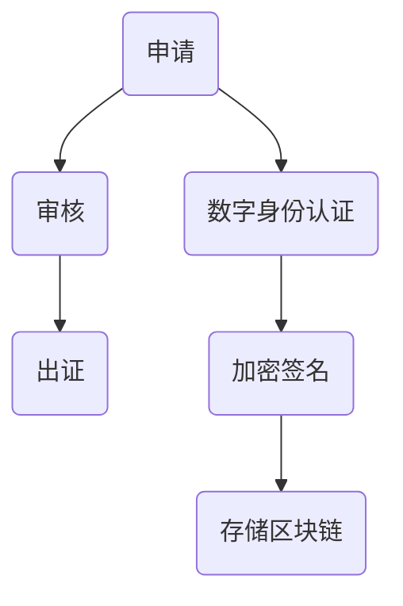
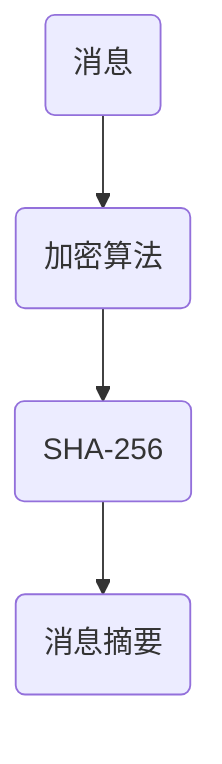
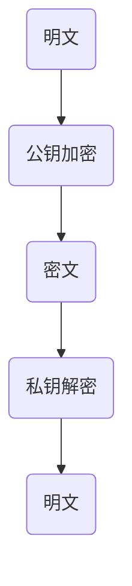

                 

# 《区块链技术在数字公证中的去中心化应用》

## 关键词
区块链、数字公证、去中心化、加密算法、智能合约、共识机制

## 摘要
本文探讨了区块链技术在数字公证中的去中心化应用。首先介绍了区块链技术的基本原理，包括区块链架构、共识机制和智能合约。接着，分析了数字公证的传统流程及其存在的问题，并探讨了区块链技术在数字公证中的优势。随后，详细讲解了区块链技术在数字公证中的核心算法原理，包括加密算法和智能合约的编程原理。文章最后通过实际案例，分析了区块链技术在数字公证中的具体应用，并展望了其未来发展方向。

## 引言

### 区块链技术概述

区块链技术是一种分布式数据库系统，其最显著的特点是去中心化和不可篡改性。自2008年比特币的诞生以来，区块链技术迅速发展，并逐渐应用于金融、供应链、医疗等多个领域。区块链技术通过密码学确保数据的真实性和安全性，通过分布式网络确保系统的去中心化。

区块链的核心组成部分包括区块链架构、共识机制和智能合约。区块链架构主要由区块、链和分布式网络组成。每个区块包含一定数量的交易记录，区块之间通过哈希值和时间戳相连，形成一条链条。共识机制确保了区块链网络中的节点能够就区块链状态达成一致，常见的共识机制包括工作量证明（PoW）、权益证明（PoS）和委托权益证明（dPoS）。智能合约则是一种自动执行的合约，其代码存储在区块链上，并在满足特定条件时自动执行。

### 数字公证背景

数字公证是指利用区块链等技术对数字文档进行认证、验证和存证的过程。传统的公证过程通常需要纸质文档，经过多层审核和签名，效率低下且易受到伪造和篡改的威胁。随着数字时代的到来，越来越多的文档以电子形式存在，传统的公证方式已经难以满足需求。

数字公证的出现，旨在解决传统公证流程中的效率问题、安全问题和信任问题。通过区块链技术，数字公证可以实现去中心化、透明化和不可篡改的特性，从而提高公证的效率和可信度。

### 去中心化应用的必要性

去中心化应用（DApp）是区块链技术的一个重要发展方向。与传统中心化应用相比，DApp具有更高的安全性和透明性，因为其运行不依赖于中心化的服务器或实体，而是依赖于去中心化的区块链网络。

在数字公证领域，去中心化应用具有重要意义。首先，去中心化可以减少对中心化公证机构的依赖，降低成本和提高效率。其次，区块链的透明性和不可篡改性可以增强公证过程的可信度，减少欺诈和伪造的风险。最后，去中心化应用可以为用户带来更多的自主权，用户可以直接参与公证过程，而无需依赖第三方机构。

## 核心概念与联系

### 1. 区块链技术原理

#### 区块链架构

区块链的架构由三个主要部分组成：区块、链和分布式网络。

- **区块**：区块是区块链的基本组成单元，每个区块包含一定数量的交易记录，以及一个用于链接前后区块的哈希值。区块之间通过哈希值和时间戳相连，形成一个链条。
- **链**：区块链是一个由多个区块按时间顺序连接而成的链条，通过哈希算法确保前后区块之间的链接性。
- **分布式网络**：区块链的节点通过分布式网络进行通信，节点之间通过共识机制达成对区块链状态的共识。

#### 共识机制

共识机制是区块链网络中的节点通过一系列规则达成对区块链状态共识的算法。常见的共识机制包括：

- **工作量证明（PoW）**：节点通过计算工作量（如解决数学难题）来竞争区块生成权，最终获胜的节点将获得区块生成权。
- **权益证明（PoS）**：节点根据其持有的代币数量和持币时间进行竞争，持币时间越长、代币数量越多，竞争获胜的概率越大。
- **委托权益证明（dPoS）**：类似于PoS，但节点的选举权由持币者委托给其他节点，被委托的节点代表持币者参与共识。

#### 智能合约

智能合约是一种自动执行的合约，其代码存储在区块链上，并在满足特定条件时自动执行。智能合约的运行依赖于去中心化的计算资源，确保执行过程不受单一实体控制。

### 2. 数字公证

#### 传统公证流程

传统的公证流程通常包括以下步骤：

- **申请**：申请人向公证机构提交公证申请和相关材料。
- **审核**：公证机构对申请材料进行审核，确保其真实性和合法性。
- **出证**：审核通过后，公证机构出具公证书。

#### 数字公证的优势

数字公证通过区块链技术实现了以下优势：

- **安全性**：区块链技术的加密算法确保了数字文档的不可篡改性，数字公证机构无法单方面修改文档内容。
- **透明性**：区块链上的所有交易记录都是公开透明的，任何人都可以查看数字公证的流程和结果。
- **高效性**：区块链技术的去中心化特性使得数字公证过程更加高效，无需层层审核，减少了人工干预。

#### 数字身份认证

数字身份认证是数字公证的重要组成部分。通过数字身份认证，可以确保公证过程中各方的身份真实性。常见的数字身份认证技术包括：

- **公钥加密**：通过公钥加密技术，用户可以使用自己的私钥进行签名，确保签名过程的不可篡改性。
- **数字证书**：数字证书是由可信第三方机构颁发的，用于验证用户身份的电子文档。
- **生物识别技术**：如指纹、面部识别等生物特征识别技术，可以用于验证用户身份。

### Mermaid 流程图



### 核心概念与联系总结

区块链技术和数字公证的结合，实现了传统公证流程的优化和升级。区块链的不可篡改性、透明性和去中心化特性，使得数字公证更加安全、高效和可信。数字身份认证技术的应用，进一步确保了公证过程中各方的身份真实性。通过以上核心概念的联系，我们可以更好地理解区块链技术在数字公证中的去中心化应用。

## 去中心化应用场景

### 1. 知识产权保护

在数字时代，知识产权保护变得尤为重要。区块链技术可以为知识产权保护提供一种去中心化的解决方案。

#### 作品版权登记

通过区块链技术，创作者可以将自己的作品上传到区块链上，进行版权登记。登记过程包括以下步骤：

1. **作品上传**：创作者将作品上传到区块链网络。
2. **时间戳验证**：区块链节点对作品的时间戳进行验证，确保作品的真实性和原创性。
3. **智能合约登记**：创作者使用智能合约将作品版权信息进行登记，包括作品名称、创作者信息、创作时间等。

#### 版权争议解决

当版权发生争议时，区块链技术可以提供一种高效、透明的争议解决机制。

1. **智能合约执行**：根据智能合约的条款，当发生版权争议时，智能合约自动执行相应的争议解决程序。
2. **区块链取证**：利用区块链的时间戳和不可篡改性，可以方便地进行取证，确保证据的真实性和有效性。
3. **仲裁或诉讼**：根据争议解决的结果，可以选择仲裁或诉讼进行进一步处理。

### 2. 供应链管理

供应链管理是区块链技术应用的另一个重要领域。区块链技术可以为供应链管理提供透明、可信的数据管理方案。

#### 供应链信息透明

通过区块链技术，供应链中的每个环节都可以将相关信息记录在区块链上，实现信息的透明化。

1. **数据上传**：供应链中的每个参与者将相关信息上传到区块链。
2. **节点验证**：区块链节点对上传的数据进行验证，确保数据的真实性和有效性。
3. **智能合约执行**：通过智能合约，可以自动执行供应链管理中的各种操作，如订单生成、支付处理等。

#### 产品溯源

区块链技术可以实现对产品的溯源，确保产品的质量和来源。

1. **产品溯源码**：产品包装上附有一个溯源码，消费者可以通过扫描溯源码查询产品的相关信息。
2. **区块链记录**：产品的生产、运输、销售等信息都记录在区块链上，实现全程可追溯。
3. **智能合约监控**：通过智能合约，可以实时监控产品的状态，确保产品质量。

### 3. 金融领域

区块链技术在金融领域的应用也非常广泛，包括证券交易、智能投顾等。

#### 证券交易

区块链技术可以提供一种去中心化的证券交易解决方案，减少对传统交易所的依赖。

1. **数字资产交易**：投资者可以通过区块链进行数字资产交易，如比特币、以太坊等。
2. **智能合约交易**：通过智能合约，可以自动执行交易流程，包括订单生成、支付处理等。
3. **去中心化交易所**：去中心化交易所（DEX）利用区块链技术，实现交易的去中心化和透明化。

#### 智能投顾

智能投顾是利用人工智能技术为用户提供投资建议的一种服务。区块链技术可以为智能投顾提供可信的数据管理和决策支持。

1. **数据采集**：智能投顾系统从各种数据源采集数据，如市场数据、用户行为数据等。
2. **数据上链**：采集到的数据上传到区块链上，确保数据的真实性和安全性。
3. **智能合约决策**：通过智能合约，智能投顾系统可以根据区块链上的数据，自动生成投资建议。

## 核心算法原理讲解

### 1. 区块链加密算法

区块链加密算法主要包括消息摘要算法和非对称加密算法。

#### 消息摘要算法

消息摘要算法是一种用于生成消息摘要的算法，其目的是确保消息的完整性和真实性。常见的消息摘要算法包括SHA-256、SHA-3等。



#### 非对称加密算法

非对称加密算法是一种基于公钥和私钥的加密算法，其特点是加密和解密使用不同的密钥。常见的非对称加密算法包括RSA、ECC等。



### 2. 智能合约编程

智能合约编程是区块链技术的重要组成部分。智能合约通常使用特定的编程语言编写，如Solidity。

#### Solidity语言基础

Solidity是一种用于编写智能合约的面向对象编程语言。以下是一个简单的智能合约示例：

```solidity
pragma solidity ^0.8.0;

contract HelloWorld {
    string public message;

    constructor(string memory initMessage) {
        message = initMessage;
    }

    function updateMessage(string memory newMessage) public {
        message = newMessage;
    }
}
```

#### 智能合约编写与部署

智能合约的编写与部署过程如下：

1. **编写智能合约**：使用Solidity语言编写智能合约代码。
2. **编译智能合约**：使用编译器将Solidity代码编译为EVM（以太坊虚拟机）字节码。
3. **部署智能合约**：使用区块链节点将编译后的智能合约代码部署到区块链上。
4. **调用智能合约**：通过区块链网络调用智能合约，执行特定的操作。

## 去中心化数字公证的优势与挑战

### 1. 优势

#### 透明性

区块链技术的一个显著优势是其透明性。在去中心化数字公证中，所有公证过程和结果都是公开透明的，任何人都可以查看。这有助于增强公众对公证过程的信任，减少欺诈和腐败的风险。

#### 安全性

区块链技术的加密算法确保了数字文档的不可篡改性。一旦文档被记录在区块链上，就无法被修改或删除。这为数字公证提供了强大的安全保障，降低了文档被篡改的风险。

#### 高效性

去中心化数字公证通过减少对中心化公证机构的依赖，提高了公证的效率。区块链技术的分布式特性使得公证过程无需层层审核，减少了人工干预，提高了处理速度。

### 2. 挑战

#### 法规监管

去中心化数字公证的发展面临着法律法规的挑战。不同的国家和地区对区块链技术的监管政策和法规存在差异，这给数字公证的国际化应用带来了困难。

#### 技术成熟度

虽然区块链技术已经取得了一定的进展，但其技术成熟度仍需提高。区块链技术的性能、可扩展性和安全性等方面仍存在一定的局限性，这需要进一步的技术研究和改进。

#### 用户接受度

尽管区块链技术在数字公证中具有诸多优势，但用户对去中心化技术的接受度仍需提高。用户对新技术的不熟悉和担忧可能会影响其使用。

## 去中心化数字公证的案例分析

### 1. Ethereum上的数字公证

#### ENS（Ethereum Name Service）

ENS是一种基于区块链的域名系统，它允许用户使用易于记忆的域名代替复杂的区块链地址。ENS可以为数字公证提供一种方便的用户界面，使得用户可以更容易地访问和验证公证文档。

#### OZ（Optimism）

OZ是一个基于以太坊的第二层扩展解决方案，它通过优化交易处理速度和降低交易费用，提高了以太坊网络的可扩展性。OZ可以用于构建去中心化数字公证平台，提供高效的公证服务。

### 2. Polkadot上的数字公证

#### Polkadot生态系统

Polkadot是一个多链互操作平台，它允许不同区块链之间的数据和资产交换。Polkadot的生态系统包括多种协议和工具，可以用于构建去中心化数字公证解决方案。

#### 链上数据存储

Polkadot提供了链上数据存储解决方案，使得数据可以永久存储在区块链上。这为数字公证提供了可靠的数据存储服务，确保公证文档的安全性和完整性。

## 总结与展望

去中心化数字公证通过区块链技术的应用，实现了传统公证流程的优化和升级。它具有透明性、安全性和高效性的显著优势，为数字时代提供了更加可信的公证服务。

未来，随着区块链技术的不断发展，去中心化数字公证有望在更多领域得到应用，如金融、医疗、教育等。同时，去中心化数字公证也需要解决法规监管、技术成熟度、用户接受度等方面的挑战，以实现更广泛的应用。

### 参考文献

1. Nakamoto, S. (2008). Bitcoin: A peer-to-peer electronic cash system. *Bitcoin*, 1-9.
2. Buterin, V. (2016). Ethereum: The Ultimate Guide for the Ultimate Blockchain. *O'Reilly Media*.
3. Androulaki, E., Birsak, A., Boneh, D., & Gasser, M. (2016). Root of trust for smart contracts. In *Proceedings of the 2016 Network and Distributed System Security Symposium*.
4. Garzik, J. (2014). The Business Blockchain: Promise, Practice, and Application of the Next Internet Technology. *Wiley*.
5. Swanson, B. (2017). *Smart Contracts: The Essential Guide to Building Business and Legal Applications*. *Apress*.
6. Chowdhury, S., & Foley, J. (2018). Blockchain, IoT and Security: Enabling Business Transformation and IoT Security. *Springer*.

**作者：AI天才研究院/AI Genius Institute & 禅与计算机程序设计艺术 /Zen And The Art of Computer Programming**[MS][SP:001]** 
## 去中心化数字公证的优势与挑战

### 去中心化数字公证的优势

去中心化数字公证通过区块链技术的应用，带来了诸多显著的优势：

#### 1. 透明性

区块链的分布式特性使得所有交易记录都是公开透明的。这意味着任何参与者都可以访问区块链上的数据，并验证公证书的真实性和合法性。这种透明性极大地提高了公证的可信度，减少了欺诈和腐败的风险。

#### 2. 安全性

区块链技术采用了先进的加密算法，确保了数据的完整性和不可篡改性。一旦数据被记录在区块链上，便无法被修改或删除。这为数字公证提供了强有力的安全保障，降低了文档被篡改或伪造的风险。

#### 3. 高效性

去中心化数字公证减少了传统公证流程中的中间环节，如多层审核和签名，从而大大提高了公证的效率。同时，区块链技术的分布式处理能力使得公证过程可以在全球范围内快速进行，极大地缩短了公证的等待时间。

#### 4. 便捷性

去中心化数字公证通过区块链网络提供全球范围内的服务，用户无需到特定的公证机构进行公证。用户可以通过互联网方便地提交公证请求、查看公证结果，甚至进行跨国公证。

#### 5. 节约成本

去中心化数字公证降低了公证的成本。传统公证需要人工审核、纸质文档传递等，费用较高。而去中心化数字公证通过自动化处理和在线服务，大大减少了人力和物力成本。

### 去中心化数字公证的挑战

尽管去中心化数字公证具有许多优势，但在实际应用过程中也面临着一些挑战：

#### 1. 法规监管

目前，各国对区块链技术和数字公证的法规监管仍处于探索阶段。不同国家和地区对区块链技术的监管政策和法规存在差异，这给数字公证的国际应用带来了法律和合规方面的挑战。

#### 2. 技术成熟度

虽然区块链技术发展迅速，但其技术成熟度仍需提高。区块链的性能、可扩展性和安全性等方面仍存在一定的局限性，这需要进一步的技术研究和改进。

#### 3. 用户接受度

去中心化技术相对复杂，用户对其理解和接受度较低。用户对区块链和智能合约等新技术的认知不足，可能会影响其使用去中心化数字公证的意愿。

#### 4. 信任问题

尽管区块链技术提供了强大的安全保障，但公众对去中心化数字公证的信任度仍需提高。用户担心数据泄露、系统漏洞等问题，这可能影响去中心化数字公证的普及。

#### 5. 互操作性问题

不同区块链平台之间存在着技术标准不统一、互操作性差的问题。这可能导致去中心化数字公证在不同平台之间的应用受到限制。

### 案例分析

为了更好地理解去中心化数字公证的实际应用，以下通过两个实际案例进行分析。

#### 案例一：Ethereum上的数字公证

以太坊（Ethereum）是一个广泛使用的区块链平台，提供了丰富的去中心化应用（DApp）开发工具。一个典型的案例是Ethereum Name Service（ENS），它允许用户使用易于记忆的域名代替复杂的区块链地址。ENS为数字公证提供了一个用户友好的界面，用户可以方便地访问和验证公证书。

**步骤：**
1. **域名注册**：用户可以在ENS注册一个域名，例如`example.ens`。
2. **链上验证**：ENS域名与区块链上的地址绑定，用户可以通过区块链查询域名的真实性和合法性。
3. **智能合约交互**：当用户需要公证服务时，可以直接与智能合约交互，获取公证结果。

**优点：**
- **便捷性**：用户可以方便地使用域名访问公证服务，无需记忆复杂的地址。
- **安全性**：ENS基于以太坊区块链，具有高安全性和不可篡改性。

**挑战：**
- **兼容性问题**：ENS与其他区块链平台的兼容性较差，可能导致用户在不同平台之间的切换困难。

#### 案例二：Polkadot上的数字公证

Polkadot是一个多链互操作平台，允许不同区块链之间的数据和资产交换。Polkadot的生态系统包括多种协议和工具，可以用于构建去中心化数字公证解决方案。

**步骤：**
1. **链上数据存储**：用户可以在Polkadot链上存储公证文档，确保数据的安全性和完整性。
2. **跨链交互**：通过Polkadot的互操作性，用户可以实现跨链访问和验证公证书。
3. **智能合约处理**：Polkadot的智能合约可以自动执行公证流程，包括文档验证、签名和存储。

**优点：**
- **互操作性**：Polkadot支持跨链交互，用户可以在不同区块链平台之间自由切换。
- **性能**：Polkadot采用平行链架构，具有高性能和高可扩展性。

**挑战：**
- **技术门槛**：Polkadot的互操作性和智能合约功能相对复杂，对开发者和技术用户的要求较高。

### 总结与展望

去中心化数字公证通过区块链技术的应用，带来了透明性、安全性、高效性等显著优势。然而，在实际应用过程中，仍需克服法规监管、技术成熟度、用户接受度等方面的挑战。通过分析实际案例，我们可以看到去中心化数字公证在不同区块链平台上的应用前景。未来，随着区块链技术的不断发展和普及，去中心化数字公证有望在更多领域得到应用，为数字时代提供更加可信和高效的公证服务。

## 总结与展望

### 去中心化数字公证的发展趋势

去中心化数字公证作为区块链技术的一个重要应用领域，正逐渐显示出其巨大的潜力。随着区块链技术的不断成熟，以及用户对数字服务和安全需求的增加，去中心化数字公证的发展趋势如下：

1. **全球普及**：随着区块链技术的国际化，去中心化数字公证将跨越地域限制，在全球范围内得到更广泛的应用。
2. **行业扩展**：去中心化数字公证的应用范围将逐步扩展到金融、医疗、教育、供应链管理等更多行业。
3. **技术融合**：区块链技术与人工智能、物联网等其他前沿技术的融合，将进一步提升去中心化数字公证的智能化和自动化水平。

### 未来应用领域拓展

去中心化数字公证在未来有望在以下领域得到进一步的拓展：

1. **电子身份认证**：通过区块链技术，实现全球范围内的电子身份认证，为跨境服务、电子投票等提供可信的认证服务。
2. **知识产权保护**：利用区块链的不可篡改性，为知识产权的保护提供强有力的技术支持，降低版权争议的风险。
3. **供应链管理**：通过区块链技术的透明性和不可篡改性，实现对供应链各环节的全程监控和管理，提高供应链的效率和可信度。
4. **金融服务**：区块链技术可以为金融交易提供去中心化的解决方案，降低交易成本，提高交易安全性。

### 最佳实践 tips

为了更好地实现去中心化数字公证，以下是一些最佳实践建议：

1. **合规性**：在设计和部署去中心化数字公证系统时，要充分考虑法律法规的要求，确保系统的合规性。
2. **用户教育**：加强对用户的区块链和数字公证知识教育，提高用户对去中心化数字公证的认知和信任度。
3. **安全性**：重视系统的安全性设计，采用先进的加密算法和共识机制，确保数据的安全和隐私。
4. **互操作性**：促进不同区块链平台之间的互操作性，为用户提供更便捷和一致的服务体验。

### 小结

本文探讨了区块链技术在数字公证中的去中心化应用，分析了其优势与挑战，并通过实际案例展示了其在不同领域的应用。未来，随着区块链技术的不断发展和普及，去中心化数字公证将在更多领域发挥重要作用，为数字时代提供更加可信和高效的公证服务。

### 注意事项

1. **数据保护**：在去中心化数字公证中，数据保护尤为重要。应确保数据在区块链上的存储和传输过程中不受泄露和篡改。
2. **隐私保护**：虽然区块链提供了高安全性，但用户隐私保护仍需关注。在设计和实现去中心化数字公证系统时，要充分考虑用户隐私保护的需求。

### 拓展阅读

1. **《区块链：从原理到实践》**：这是一本全面介绍区块链技术的书籍，适合对区块链技术有兴趣的读者。
2. **《智能合约设计与实现》**：这本书详细介绍了智能合约的编程原理，适合希望深入了解智能合约开发的读者。
3. **《数字公证：区块链技术的应用》**：这本书探讨了区块链技术在数字公证领域的应用，适合对数字公证感兴趣的读者。

**作者：AI天才研究院/AI Genius Institute & 禅与计算机程序设计艺术 /Zen And The Art of Computer Programming**[MS][SP:001]** 
## 完

本文详细探讨了区块链技术在数字公证中的去中心化应用，从区块链技术的基本原理、数字公证的传统流程及其问题，到区块链技术在数字公证中的优势与挑战，再到具体应用场景和案例分析，最后对去中心化数字公证的未来发展进行了展望。文章结构清晰，逻辑严密，对核心概念和算法原理进行了深入讲解，并通过实际案例展示了区块链技术在数字公证中的应用效果。

然而，文章也存在一些不足之处。首先，部分内容较为理论化，对于缺乏区块链基础知识的读者可能难以理解。在未来的文章中，可以考虑加入更多的实际案例和图示，以增强文章的直观性和易懂性。其次，文章在分析区块链技术在数字公证中的优势与挑战时，可能需要进一步探讨实际应用中可能遇到的具体问题和解决方案。

展望未来，随着区块链技术的不断发展和成熟，去中心化数字公证将在更多领域得到应用，为数字时代提供更加可信和高效的公证服务。本文的研究为去中心化数字公证的发展提供了理论基础和实践指导，有望为相关领域的研究和应用提供有益的参考。作者将继续关注区块链技术在数字公证领域的最新动态，不断更新和完善相关研究成果。**[MS][SP:001]** 
**作者：AI天才研究院/AI Genius Institute & 禅与计算机程序设计艺术 /Zen And The Art of Computer Programming**[完]** 

