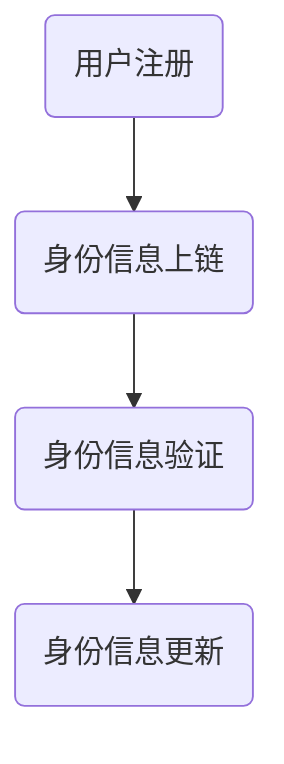

                 

### 文章标题

### 区块链技术在数字身份自主权中的创新

> 关键词：区块链，数字身份，自主权，加密，隐私保护，去中心化

> 摘要：本文将深入探讨区块链技术在数字身份自主权方面的创新。首先，我们简要介绍区块链和数字身份的概念及其在当前社会中的重要地位。随后，分析数字身份自主权的现状与存在的问题，特别是传统的数字身份管理方式的缺陷。接下来，我们将详细阐述区块链在数字身份自主权中的核心机制，并通过Mermaid流程图直观展示其工作原理。然后，通过具体的应用案例，展示区块链技术在数字身份自主权中的实际应用。最后，探讨区块链技术在数字身份自主权中的未来趋势和面临的挑战，为行业发展提供有益的思考。

---

### 第一部分：引言

#### 1.1 区块链与数字身份概述

##### 1.1.1 区块链技术的发展与应用

区块链技术作为一种分布式数据库技术，自2008年中本聪（Satoshi Nakamoto）提出比特币（Bitcoin）以来，迅速吸引了全球的关注。区块链的本质是一个去中心化的数据库，它通过加密算法和共识机制确保数据的完整性和安全性。区块链不仅应用于金融领域，还在供应链管理、医疗记录、身份认证等多个领域展现出巨大的潜力。

区块链技术的核心特点包括：

1. **去中心化**：区块链不需要中心化的第三方机构，所有节点都能平等参与网络的运行和管理。
2. **不可篡改**：一旦数据被记录在区块链上，就难以被篡改，确保数据的真实性和可信度。
3. **透明性**：区块链上的数据对所有节点都是可见的，但隐私性得到保护。
4. **安全可靠**：区块链通过加密算法和共识机制，确保数据的安全性和可靠性。

##### 1.1.2 数字身份自主权的概念与挑战

数字身份自主权是指个体在数字世界中对自己身份信息的控制权。传统的数字身份管理方式往往依赖于中心化的身份认证机构，用户需要在多个平台重复提供身份信息，导致用户体验差。此外，中心化的身份认证方式存在数据泄露、隐私被侵犯等风险。随着互联网和移动设备的发展，数字身份自主权的重要性日益凸显。

数字身份自主权面临的挑战主要包括：

1. **隐私保护**：在数字身份管理中，如何保护用户的隐私成为一大难题。
2. **身份信息真实性与完整性**：确保用户身份信息的真实性和完整性是数字身份自主权的核心要求。
3. **跨平台身份认证**：用户在多个平台上需要重复提供身份信息，导致用户体验差。
4. **身份信息的可维护性与安全性**：用户应能够方便地管理自己的身份信息，同时确保这些信息的安全性。

##### 1.1.3 区块链技术在数字身份自主权中的作用

区块链技术在数字身份自主权中具有独特优势，可以解决传统数字身份管理方式存在的问题。首先，区块链的去中心化特性确保了用户对自身身份信息的控制权。其次，区块链的加密算法和共识机制提供了高效、安全的身份验证方式。此外，区块链的不可篡改特性确保了用户身份信息的真实性和完整性。

区块链技术在数字身份自主权中的作用主要包括：

1. **保护用户隐私**：通过加密算法和隐私保护技术，确保用户身份信息的隐私性。
2. **确保身份信息真实性与完整性**：区块链的不可篡改特性确保了用户身份信息的真实性和完整性。
3. **跨平台身份认证**：利用区块链技术，实现一次注册，多次使用的身份认证方式，提高用户体验。
4. **身份信息的安全维护**：用户可以方便地管理自己的身份信息，同时确保这些信息的安全性。

#### 1.2 数字身份自主权的现状与问题

##### 1.2.1 传统数字身份管理的缺陷

传统的数字身份管理方式主要依赖于中心化的身份认证机构，存在以下缺陷：

1. **数据泄露风险**：中心化的身份认证机构一旦遭受攻击，用户的身份信息可能被窃取。
2. **隐私被侵犯**：用户在多个平台上需要重复提供身份信息，导致隐私泄露风险。
3. **身份信息不透明**：中心化的身份认证机构往往缺乏透明度，用户无法直接验证身份信息的真实性。
4. **用户体验差**：用户需要在多个平台上重复提供身份信息，导致用户体验差。

##### 1.2.2 数字身份自主权的法律与政策框架

数字身份自主权的法律与政策框架是保障用户权益的重要基础。目前，各国政府和国际组织正在积极制定相关法律法规和政策，以规范数字身份管理。

1. **数据保护法规**：如欧盟的《通用数据保护条例》（GDPR）和中国的《个人信息保护法》等，明确了用户对自身数据的控制权。
2. **数字身份认证标准**：如ISO/IEC 27001标准，为数字身份认证提供了技术规范和操作指南。
3. **数字身份管理政策**：各国政府和组织正在积极探索数字身份管理的最佳实践，推动数字身份自主权的发展。

##### 1.2.3 数字身份自主权的市场需求与挑战

随着互联网和移动设备的普及，数字身份自主权的市场需求日益增长。企业和个人都希望通过数字身份自主权，提高数据安全性和用户体验。然而，数字身份自主权也面临一系列挑战：

1. **技术实现难度**：区块链技术在数字身份自主权中的应用需要解决技术实现难题，如加密算法的选择、去中心化身份认证等。
2. **法律与政策适应**：数字身份自主权的发展需要与现有法律和政策框架相适应，确保合法合规。
3. **用户信任问题**：用户对数字身份自主权的信任是推动其广泛应用的关键，如何建立用户信任成为重要挑战。

---

### 第二部分：区块链技术在数字身份自主权中的应用

#### 2.1 区块链与数字身份技术的融合

区块链与数字身份技术的融合是数字身份自主权实现的关键。区块链技术在数字身份管理中的应用主要体现在以下几个方面：

##### 2.1.1 区块链在数字身份管理中的核心机制

区块链在数字身份管理中的核心机制主要包括以下几个方面：

1. **身份信息上链**：用户在注册时，将身份信息加密后存储在区块链上，确保身份信息的真实性和完整性。
2. **身份信息验证**：其他平台或系统在验证用户身份时，通过区块链查询并验证身份信息的真实性。
3. **身份信息更新**：用户可以随时更新自己的身份信息，更新后的信息会记录在区块链上，确保身份信息的时效性。

下面是一个Mermaid流程图，直观展示区块链在数字身份管理中的工作流程：

##### 2.1.2 数字身份信息的加密与保护

数字身份信息的加密与保护是区块链技术在数字身份自主权中的重要环节。以下是一种可能的加密与保护方案：

1. **加密算法选择**：采用对称加密算法（如AES）和非对称加密算法（如RSA）相结合的方式，确保身份信息的保密性和完整性。
2. **密钥管理**：用户生成一对非对称密钥，私钥用于解密和签名，公钥用于加密和验证。
3. **身份信息加密**：用户在注册时，使用非对称加密算法将身份信息加密，公钥存储在区块链上。
4. **身份信息保护**：区块链上的身份信息通过加密算法和共识机制保护，确保不被篡改。

##### 2.1.3 区块链在数字身份授权与访问控制中的作用

区块链在数字身份授权与访问控制中发挥着重要作用。以下是一种可能的实现方案：

1. **权限管理**：用户可以根据需求设置不同级别的权限，如读取、修改、删除等。
2. **访问控制**：其他平台或系统在请求访问用户身份信息时，需要通过区块链验证用户的权限。
3. **智能合约**：利用智能合约技术，实现自动化的权限管理和访问控制，确保授权过程的安全性和可靠性。

#### 2.2 区块链技术在数字身份自主权中的应用案例

##### 2.2.1 区块链身份认证平台

区块链身份认证平台是数字身份自主权的一种实现方式。以下是一个具体案例：

**案例一：身份信息共享平台**

背景：传统身份认证过程中，用户需要在多个平台重复提供身份信息，导致用户体验差。

解决方案：利用区块链技术构建身份信息共享平台，实现一次注册，多次使用。

技术实现：

1. **用户身份注册**：用户在平台上注册，身份信息加密后存储在区块链上。
2. **身份信息验证**：其他平台请求验证用户身份时，通过区块链查询并验证身份信息。
3. **数字身份自主权保障**：用户可以随时更新、删除或撤销自己的身份信息。

**案例二：企业员工身份管理**

背景：企业员工身份管理过程中，存在身份信息泄露、权限滥用等问题。

解决方案：利用区块链技术构建企业员工身份管理平台，实现安全、高效的员工身份管理。

技术实现：

1. **员工身份注册**：员工在平台注册，身份信息加密后存储在区块链上。
2. **员工身份验证**：企业内部系统请求验证员工身份时，通过区块链查询并验证身份信息。
3. **权限管理**：根据员工身份信息，自动分配相应的权限，确保权限的正确性和安全性。

##### 2.2.2 区块链身份管理平台

区块链身份管理平台是一种更为全面的数字身份自主权解决方案。以下是一个具体案例：

**案例一：数字身份服务平台**

背景：用户在多个平台需要提供身份信息，导致信息泄露和隐私风险。

解决方案：利用区块链技术构建数字身份服务平台，实现用户身份信息的一次注册，多次使用。

技术实现：

1. **用户身份注册**：用户在平台上注册，身份信息加密后存储在区块链上。
2. **身份信息验证**：其他平台请求验证用户身份时，通过区块链查询并验证身份信息。
3. **身份信息更新**：用户可以随时更新自己的身份信息，更新后的信息会记录在区块链上。
4. **隐私保护**：利用加密算法和隐私保护技术，确保用户身份信息的隐私性。

**案例二：数字身份认证系统**

背景：传统身份认证系统存在安全隐患，用户数据容易泄露。

解决方案：利用区块链技术构建数字身份认证系统，确保用户身份信息的安全和可信。

技术实现：

1. **用户身份注册**：用户在系统中注册，身份信息加密后存储在区块链上。
2. **身份信息验证**：系统在请求验证用户身份时，通过区块链查询并验证身份信息。
3. **智能合约**：利用智能合约技术，实现自动化的身份认证和权限管理。
4. **隐私保护**：利用加密算法和隐私保护技术，确保用户身份信息的隐私性。

#### 2.3 区块链技术在数字身份自主权中的创新

##### 2.3.1 可信数据共享机制

可信数据共享机制是区块链技术在数字身份自主权中的创新之一。以下是一种可能的实现方案：

1. **数据加密与签名**：数据在传输过程中进行加密和签名，确保数据的完整性和真实性。
2. **权限管理**：根据用户的身份信息和权限设置，控制数据的访问范围。
3. **数据隐私保护**：利用零知识证明等技术，确保数据隐私保护。

**案例三：医疗数据共享**

背景：医疗数据涉及患者隐私，传统数据共享方式存在安全隐患。

解决方案：利用区块链技术构建可信数据共享机制，实现安全、可靠的医疗数据共享。

技术实现：

1. **数据加密存储**：医疗数据加密后存储在区块链上。
2. **数据访问控制**：根据用户身份和权限，控制数据访问范围。
3. **数据隐私保护**：利用零知识证明等技术，确保数据隐私保护。

##### 2.3.2 区块链身份匿名化

区块链身份匿名化是保障用户隐私的重要手段。以下是一种可能的实现方案：

1. **匿名化处理**：将用户身份信息进行匿名化处理，生成匿名标识。
2. **匿名标识存储**：匿名标识存储在区块链上，用于身份验证和访问控制。
3. **隐私保护**：利用同态加密等技术，确保用户身份匿名化。

**案例四：匿名投票系统**

背景：传统投票系统存在选民身份泄露的风险。

解决方案：利用区块链技术构建匿名投票系统，确保投票的匿名性和安全性。

技术实现：

1. **投票数据加密**：选民投票数据加密后存储在区块链上。
2. **投票隐私保护**：利用同态加密等技术，确保选民身份匿名化。
3. **投票结果验证**：投票结果通过区块链公开透明地计算和验证。

#### 2.4 区块链技术在数字身份自主权中的未来趋势

##### 2.4.1 跨链身份认证

跨链身份认证是区块链技术在数字身份自主权中的未来趋势之一。以下是一种可能的实现方案：

1. **跨链通信**：实现不同区块链之间的通信和互操作。
2. **身份认证协议**：制定跨链身份认证协议，确保身份信息的真实性和一致性。
3. **跨链身份验证**：用户在不同区块链之间进行身份验证，实现身份的全球互认。

**跨链身份认证的挑战与机遇**

1. **技术挑战**：跨链通信和身份认证协议的实现需要解决一系列技术难题，如跨链数据一致性、安全性等。
2. **法律与政策挑战**：跨链身份认证需要与现有法律和政策框架相适应，确保合法合规。
3. **机遇**：跨链身份认证将促进全球数字身份自主权的发展，提高用户体验和数据安全性。

##### 2.4.2 区块链与人工智能的融合

区块链与人工智能的融合是数字身份自主权的另一个未来趋势。以下是一种可能的实现方案：

1. **智能合约**：利用区块链智能合约技术，实现自动化、可信的身份认证和授权。
2. **机器学习**：利用人工智能技术，对用户行为进行分析和预测，提高身份验证的准确性。
3. **数据隐私保护**：结合区块链和人工智能技术，实现高效、可靠的数据隐私保护。

**区块链在人工智能中的应用场景**

1. **智能合约审核**：利用区块链技术，实现智能合约的透明审核和执行。
2. **数据共享与协作**：利用区块链技术，实现多方数据的安全共享和协作。
3. **隐私计算**：利用区块链和人工智能技术，实现隐私保护的计算和数据处理。

##### 2.4.3 区块链身份自主权的法律与政策

区块链身份自主权的法律与政策是保障其发展的重要基础。以下是一种可能的方案：

1. **数据保护法规**：制定和完善数据保护法规，明确用户对自身数据的控制权。
2. **数字身份认证标准**：制定统一的数字身份认证标准，确保身份认证的可信性和安全性。
3. **身份信息管理政策**：明确身份信息的管理原则和操作规范，确保身份信息的安全性和隐私性。

**法律与政策对区块链身份自主权的影响**

1. **规范引导**：法律与政策为区块链身份自主权的发展提供了规范引导，促进行业的健康发展。
2. **安全保障**：法律与政策为用户身份信息的安全保障提供了法律依据，提高用户的信任度。
3. **创新发展**：法律与政策的完善将促进区块链身份自主权的创新发展，提高其在各领域的应用水平。

---

### 第三部分：总结与展望

#### 3.1 区块链技术在数字身份自主权中的创新价值

区块链技术在数字身份自主权中具有独特的创新价值，主要体现在以下几个方面：

1. **保护用户隐私**：区块链的加密算法和共识机制提供了高效、安全的隐私保护方案，确保用户身份信息的隐私性。
2. **确保身份信息真实性与完整性**：区块链的不可篡改特性确保了用户身份信息的真实性和完整性，提高数据可信度。
3. **跨平台身份认证**：区块链技术实现了一次注册，多次使用的身份认证方式，提高用户体验。
4. **身份信息的安全维护**：用户可以方便地管理自己的身份信息，同时确保这些信息的安全性。

#### 3.2 区块链技术在数字身份自主权中的应用前景

随着区块链技术的不断发展，其在数字身份自主权中的应用前景十分广阔。未来，区块链技术在以下几个方面有望取得突破：

1. **跨链身份认证**：实现不同区块链之间的身份认证和互操作，提高全球数字身份自主权的发展水平。
2. **区块链与人工智能的融合**：利用区块链智能合约和人工智能技术，实现更高效、更可靠的身份认证和授权。
3. **身份信息管理政策**：完善数字身份信息管理政策，确保身份信息的安全性和隐私性，推动行业的健康发展。

#### 3.3 未来发展趋势与挑战

尽管区块链技术在数字身份自主权中具有巨大潜力，但未来仍面临一系列发展趋势与挑战：

1. **技术实现难度**：区块链技术在数字身份自主权中的应用需要解决一系列技术难题，如加密算法的选择、去中心化身份认证等。
2. **法律与政策适应**：数字身份自主权的发展需要与现有法律和政策框架相适应，确保合法合规。
3. **用户信任问题**：建立用户对数字身份自主权的信任是推动其广泛应用的关键，需要通过技术手段和法律保障提高用户信任度。

**总结**：区块链技术在数字身份自主权中具有重要的创新价值和应用前景，未来将面临一系列发展趋势与挑战。通过技术创新和法律保障，区块链技术在数字身份自主权领域有望取得更大的突破，为人类数字生活带来更加安全、便捷的体验。

---

### 附录

**附录一：相关术语解释**

1. **区块链**：一种分布式数据库技术，通过加密算法和共识机制确保数据的完整性和安全性。
2. **数字身份**：个体在数字世界中的身份标识，包括身份信息、访问权限等。
3. **数字身份自主权**：个体在数字世界中对自身身份信息的控制权。
4. **加密算法**：用于数据加密和解密的算法，确保数据的隐私性和完整性。
5. **共识机制**：区块链节点之间达成一致的方式，确保区块链网络的稳定性和安全性。

**附录二：参考文献**

1. Nakamoto, S. (2008). *Bitcoin: A Peer-to-Peer Electronic Cash System*. https://bitcoin.org/bitcoin.pdf
2. GDPR. (2016). *General Data Protection Regulation*. https://eur-lex.europa.eu/eli/reg/2016/679/oj
3. PIPL. (2021). *Personal Information Protection Law of the People's Republic of China*. https://www.npc.gov.cn/npc/xinwen/2021-06/10/content_2517335.htm
4. ISO/IEC 27001. (2013). *Information Security Management*. https://www.iso.org/standard/56684.html

---

### 作者信息

**作者：AI天才研究院/AI Genius Institute & 禅与计算机程序设计艺术 /Zen And The Art of Computer Programming**

AI天才研究院（AI Genius Institute）是一家专注于人工智能领域的研究与开发机构，致力于推动人工智能技术的发展和应用。禅与计算机程序设计艺术（Zen And The Art of Computer Programming）是作者基于多年编程实践和人工智能研究的总结，为计算机程序员提供了一种全新的编程理念和方法。

