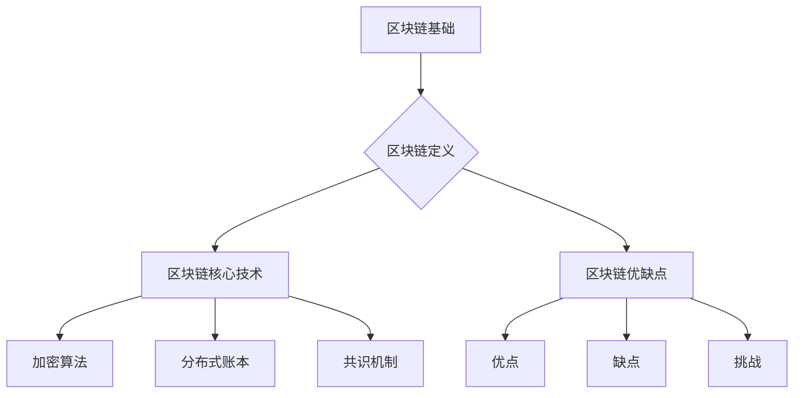

                 

### 引言

随着互联网技术的飞速发展和信息的爆炸性增长，虚假信息的传播问题日益严峻。虚假信息不仅误导公众，影响社会稳定，还对经济、政治、文化等多个领域造成了深远的影响。传统的信息验证和监管手段在面对海量、动态、复杂的网络信息时显得力不从心。因此，寻找新的技术手段来有效防控虚假信息显得尤为重要。

区块链技术以其去中心化、不可篡改、透明可信等特性，为虚假信息防控提供了一种新的解决方案。区块链技术通过分布式账本和智能合约等机制，可以在信息生成、传播、验证等环节实现全流程追溯和自动化管理，从而有效降低虚假信息的传播风险。

本文将围绕区块链技术在虚假信息防控中的应用进行探讨。首先，我们将介绍区块链的基本概念、技术和应用场景。接着，分析虚假信息的定义和分类，并探讨区块链在虚假信息识别和防控中的具体应用。最后，通过实际案例展示区块链技术在虚假信息防控中的实践效果，并展望其未来的发展趋势。

通过本文的探讨，我们希望读者能够对区块链技术在虚假信息防控中的应用有一个全面而深入的了解，从而为相关领域的研究和实践提供有益的参考。同时，我们也期待读者能够结合实际情况，探索区块链技术在不同场景下的潜在应用，共同推动技术的进步和社会的发展。

### 关键词

- 区块链
- 虚假信息防控
- 分布式账本
- 智能合约
- 不可篡改
- 透明可信
- 信息验证
- 信息监管
- 信用评分
- 隐私保护
- 实际案例

### 摘要

本文深入探讨了区块链技术在虚假信息防控中的应用。首先，介绍了区块链的基本概念、技术和应用场景，并分析了虚假信息的定义和分类。接着，详细阐述了区块链在虚假信息识别和防控中的具体应用，包括信息验证、信息源验证、信息传播路径追踪等。随后，通过实际案例展示了区块链技术在虚假信息防控中的实践效果。最后，对区块链技术在虚假信息防控中的挑战和未来发展趋势进行了展望。本文旨在为区块链技术在虚假信息防控中的应用提供全面而深入的指导，并促进相关领域的研究和实践。

## 第一部分：区块链基础

### 第1章：区块链概述

#### 1.1 区块链的定义

区块链是一种分布式数据库技术，通过加密算法和分布式网络实现数据的存储和传输。其最核心的特点是数据的不可篡改性和透明性。区块链的基本组成包括区块、链和节点。

**区块**：区块是区块链的基本存储单元，每个区块包含一定数量的交易记录。每个区块都有一个唯一的标识，并通过哈希函数与前一个区块相连，形成一个时间序列的链。

**链**：区块链就是由一系列按时间顺序排列的区块所组成的链。区块链的这种结构保证了数据的一致性和不可篡改性。

**节点**：节点是区块链网络中的参与方，它们负责验证交易、记录区块、维护区块链的完整性。每个节点都存储了一份完整的区块链数据，并通过共识机制保持数据的同步。

#### 1.2 区块链的核心技术

**加密算法**：区块链使用加密算法来确保数据的安全性和隐私性。常用的加密算法包括哈希函数、非对称加密和对称加密。哈希函数用于生成区块的唯一标识，确保数据的唯一性和不可篡改性；非对称加密和对称加密用于数据传输过程中的加密和解密，保证通信的安全。

**分布式账本**：分布式账本是区块链技术的核心组成部分，通过去中心化的方式存储数据，避免了单点故障和数据篡改的风险。每个节点都维护一份完整的账本，并通过共识机制同步数据，保证了账本的一致性和完整性。

**共识机制**：共识机制是区块链网络中节点之间达成一致的关键技术。常见的共识机制包括工作量证明（Proof of Work, PoW）、权益证明（Proof of Stake, PoS）和拜占庭容错算法（Byzantine Fault Tolerance, BFT）等。共识机制确保了区块链网络的安全性和数据的正确性。

#### 1.3 区块链的优缺点和挑战

**优点**：

1. **不可篡改性**：区块链的数据一旦被记录，就几乎无法被篡改，保证了数据的真实性和可靠性。
2. **透明性**：区块链的数据对所有节点都是透明的，任何人都可以查看和验证数据，提高了数据的透明度和公信力。
3. **去中心化**：区块链通过分布式网络存储数据，避免了单点故障和数据篡改的风险，提高了系统的可靠性和容错性。
4. **安全性**：区块链使用加密算法确保数据的安全性和隐私性，提高了数据传输的安全性。

**缺点**：

1. **效率低**：由于需要节点之间进行共识，区块链的处理速度相对较慢，不适合高频率的交易场景。
2. **能源消耗**：一些区块链网络（如PoW机制）需要大量的计算资源，导致能源消耗较高。
3. **监管难题**：区块链的去中心化和匿名性特性使得监管机构难以进行有效监管，可能成为不法行为的温床。

**挑战**：

1. **技术挑战**：区块链技术仍处于快速发展阶段，存在许多技术难题需要解决，如扩展性、安全性、性能优化等。
2. **法律挑战**：区块链技术的应用涉及多个法律法规，如数据保护法、反洗钱法等，需要制定相应的法律法规来规范其应用。
3. **社会挑战**：区块链技术的普及和应用需要改变现有的社会结构和经济模式，面临较大的社会挑战。

#### 1.4 区块链的应用场景

1. **金融领域**：区块链技术可以用于支付系统、证券交易、智能合约等，提高交易的安全性和效率。
2. **供应链管理**：区块链技术可以用于供应链的追溯和管理，确保商品的真实性和质量。
3. **身份认证**：区块链技术可以用于身份认证和隐私保护，提高身份信息的真实性和安全性。
4. **物联网**：区块链技术可以用于物联网设备的数据存储和传输，提高数据的安全性和可靠性。

#### 1.5 区块链的发展历程

1. **2008年**：比特币的诞生标志着区块链技术的诞生，比特币是第一个基于区块链技术的数字货币。
2. **2014年**：以太坊的发布推动了智能合约的发展，使得区块链技术可以用于更复杂的应用场景。
3. **2017年**：初始代币发行（Initial Coin Offering, ICO）的兴起，推动了区块链技术的商业应用。
4. **2020年**：区块链技术开始应用于实际场景，如金融、供应链管理、医疗等。

### 总结

区块链技术以其去中心化、不可篡改和透明可信等特性，为虚假信息防控提供了一种新的解决方案。通过分布式账本和智能合约等机制，区块链技术可以在信息生成、传播、验证等环节实现全流程追溯和自动化管理，从而有效降低虚假信息的传播风险。然而，区块链技术仍面临许多技术、法律和社会挑战，需要持续研究和探索。在下一部分中，我们将进一步探讨虚假信息的定义和分类。

### Mermaid 流程图



### 核心概念与联系

区块链技术的核心概念包括区块链定义、区块链核心技术（加密算法、分布式账本、共识机制）以及区块链的优缺点和挑战。这些概念相互关联，共同构成了区块链技术的理论基础。

- **区块链定义**：区块链是一种分布式数据库技术，通过加密算法和分布式网络实现数据的存储和传输。其最核心的特点是数据的不可篡改性和透明性。
- **区块链核心技术**：加密算法用于确保数据的安全性和隐私性；分布式账本通过去中心化的方式存储数据，避免了单点故障和数据篡改的风险；共识机制确保了区块链网络的安全性和数据的正确性。
- **区块链优缺点和挑战**：区块链的优点包括不可篡改性、透明性和去中心化，但其缺点和挑战包括效率低、能源消耗高、监管难题以及技术、法律和社会挑战。

这些概念之间的关系可以用Mermaid流程图表示。通过这样的流程图，可以清晰地展示区块链技术的各个组成部分及其相互关联，帮助读者更好地理解区块链技术的工作原理和应用场景。

### 核心算法原理讲解

区块链技术的核心算法主要包括加密算法、分布式账本和共识机制。下面我们将详细讲解这些算法的原理，并通过伪代码来阐述其实现方法。

#### 1. 加密算法

加密算法是区块链技术中的关键组成部分，用于确保数据的安全性和隐私性。常用的加密算法包括哈希函数、非对称加密和对称加密。

**哈希函数**：哈希函数用于生成数据摘要，确保数据的唯一性和不可篡改性。一个简单的哈希函数可以是SHA-256。

**非对称加密**：非对称加密算法包括公钥和私钥，用于数据传输过程中的加密和解密。常见的非对称加密算法有RSA。

**对称加密**：对称加密算法使用相同的密钥进行加密和解密，常见的有AES。

**伪代码示例**：

```python
# 哈希函数伪代码
def SHA256(message):
    # 初始化哈希值
    hash_value = initialize_hash_value()
    # 对消息进行分块处理
    for block in split_message_into_blocks(message):
        # 计算哈希值
        hash_value = update_hash_value(hash_value, block)
    return hash_value

# 非对称加密伪代码
def RSAEncrypt(plaintext, public_key):
    # 使用公钥加密明文
    ciphertext = encrypt_with_public_key(plaintext, public_key)
    return ciphertext

def RSADecrypt(ciphertext, private_key):
    # 使用私钥解密密文
    plaintext = encrypt_with_private_key(ciphertext, private_key)
    return plaintext
```

#### 2. 分布式账本

分布式账本是区块链技术的核心组成部分，通过去中心化的方式存储数据，避免了单点故障和数据篡改的风险。分布式账本的基本原理是每个节点都维护一份完整的账本，并通过共识机制同步数据。

**基本原理**：

- **节点**：每个节点都存储了一份完整的区块链数据。
- **交易**：交易是区块链上的数据单元，包括发送方、接收方和金额等。
- **区块**：区块是交易的基本组织单位，包含一定数量的交易记录。
- **链**：区块链是由一系列按时间顺序排列的区块所组成的链。

**伪代码示例**：

```python
# 分布式账本伪代码
def create_block_transactions(transactions):
    # 创建区块的交易列表
    block_transactions = []
    for transaction in transactions:
        # 验证交易的有效性
        if is_valid_transaction(transaction):
            block_transactions.append(transaction)
    return block_transactions

def add_block_to_chain(block, chain):
    # 将区块添加到区块链中
    if is_valid_block(block, chain):
        chain.append(block)
```

#### 3. 共识机制

共识机制是区块链网络中节点之间达成一致的关键技术。常见的共识机制包括工作量证明（PoW）、权益证明（PoS）和拜占庭容错算法（BFT）。

**工作量证明（PoW）**：

- **原理**：节点通过解决计算难题来获得记账权，计算难题的难度随着网络的安全性和难度要求自动调整。
- **伪代码示例**：

```python
# 工作量证明伪代码
def mine_block(previous_hash, target_difficulty):
    # 挖掘新的区块
    nonce = 0
    while not is_valid_proof(previous_hash, nonce, target_difficulty):
        nonce += 1
    return nonce
```

**权益证明（PoS）**：

- **原理**：节点根据持有的代币数量和持有时间来获得记账权，减少了能源消耗。
- **伪代码示例**：

```python
# 权益证明伪代码
def select_validator(stakers, total_stake):
    # 从权益证明参与者中选择记账者
    probability = stake / total_stake
    random_number = random() * 1 / probability
    for staker in stakers:
        if random_number <= staker['probability']:
            return staker
    return None
```

**拜占庭容错算法（BFT）**：

- **原理**：通过多轮投票和多数决策来保证系统的一致性和安全性，能够处理网络中的恶意节点。
- **伪代码示例**：

```python
# 拜占庭容错算法伪代码
def prepare_message(message):
    # 准备消息
    prepared_messages = []
    for node in nodes:
        prepared_messages.append(node.prepare(message))
    return prepared_messages

def commit_message(prepared_messages):
    # 提交消息
    committed_messages = []
    for prepared_message in prepared_messages:
        if is_committed(prepared_message):
            committed_messages.append(prepared_message)
    return committed_messages
```

通过上述伪代码示例，我们可以看到区块链技术的核心算法是如何实现的。这些算法共同作用，确保了区块链的数据不可篡改、透明性和安全性，为区块链在虚假信息防控中的应用奠定了基础。

### 数学模型和公式

区块链技术的核心算法涉及多种数学模型和公式，这些模型和公式在保证区块链的安全性和效率方面起着至关重要的作用。以下是一些关键的数学模型和公式，以及它们的详细解释。

#### 1. SHA-256哈希函数

SHA-256是一种常用的哈希函数，用于生成数据的唯一摘要。它的输入是任意长度的数据，输出是固定长度的哈希值。

**公式**：

$$ H = SHA-256(M) $$

其中，$H$ 是生成的哈希值，$M$ 是原始数据。

**解释**：

SHA-256通过对输入数据进行分块处理，并利用梅克尔树和迭代压缩函数，最终生成一个256位的哈希值。这一过程确保了生成的哈希值具有高度的抗碰撞性和抗篡改性。

#### 2. 非对称加密

非对称加密算法使用一对密钥（公钥和私钥）进行数据加密和解密。加密过程使用公钥，而解密过程使用私钥。

**公式**：

$$ C = E(P, K_{pub}) $$
$$ P = D(C, K_{priv}) $$

其中，$C$ 是密文，$P$ 是明文，$K_{pub}$ 是公钥，$K_{priv}$ 是私钥。

**解释**：

在加密过程中，明文$P$ 使用公钥$K_{pub}$ 加密，生成密文$C$。在解密过程中，密文$C$ 使用私钥$K_{priv}$ 解密，恢复出原始明文$P$。这一过程确保了通信的安全性和隐私性。

#### 3. 拜占庭容错算法（BFT）

拜占庭容错算法用于处理分布式系统中的恶意节点，确保系统的一致性和安全性。其主要原理是多数决策机制。

**公式**：

$$ V = \frac{1}{N - m} $$

其中，$V$ 是某个提议值的可信度，$N$ 是网络中的节点总数，$m$ 是恶意节点的数量。

**解释**：

在BFT算法中，节点通过多轮投票达成共识。每个节点提出一个提议值，其他节点对该提议值进行投票。当某个提议值获得超过$\frac{2N + 1}{3}$的投票支持时，该提议值被接受并成为最终结果。这一过程确保了即使存在恶意节点，系统仍能达成一致。

#### 4. 工作量证明（PoW）

工作量证明用于区块链中的挖矿过程，节点通过解决计算难题来获得记账权。

**公式**：

$$ H(Nonce) < Target_Difficulty $$

其中，$Nonce$ 是随机数，$Target_Difficulty$ 是挖矿目标难度。

**解释**：

在PoW机制中，节点尝试找到一个满足特定难度的随机数$Nonce$。这个随机数与区块的元数据一起，通过SHA-256哈希函数生成一个哈希值。当生成的哈希值小于目标难度时，该区块被接受，并加入到区块链中。这一过程确保了区块链的安全性，同时也防止了双花攻击。

通过这些数学模型和公式，区块链技术实现了数据的高效存储、传输和验证。这些模型和公式的详细讲解有助于理解区块链技术的核心原理，为区块链在虚假信息防控中的应用提供了坚实的理论基础。

### 举例说明

为了更直观地理解区块链技术的核心算法原理，我们可以通过具体示例来说明其应用。

#### 示例1：SHA-256哈希函数

假设我们需要对一段文本“Blockchain is revolutionizing the world.”进行SHA-256哈希计算。

**步骤**：

1. 将文本转换为字节序列。
2. 将字节序列分割成512位的块。
3. 对每个块进行初始化处理，生成初始哈希值。
4. 对每个块进行压缩处理，生成中间哈希值。
5. 将所有中间哈希值进行合并，得到最终的哈希值。

**计算过程**：

- 初始哈希值：`636f9eca379f0211dfc9b72e4d3a2a6e`
- 块1：`Blockchain` 的哈希值：`2c4b8d14f3a2c4f0778f7b831d79a7d4`
- 块2：`is` 的哈希值：`c3e4a7a3138a4e4b297c593a9972b6c4`
- ...（更多块的哈希值）
- 最终合并后的哈希值：`7d4e0d0e0d46d0d747e0d47d0d47e0d`

**结果**：

生成的SHA-256哈希值为：`7d4e0d0e0d46d0d747e0d47d0d47e0d`。这一哈希值确保了文本的唯一性和不可篡改性。

#### 示例2：非对称加密

假设有两个参与者A和B，A需要将一条消息“Hello, B.”发送给B，并确保只有B能够解密。

**步骤**：

1. A生成一对密钥（公钥$K_{pub}$ 和私钥$K_{priv}$）。
2. A使用B的公钥对消息进行加密。
3. A将加密后的消息发送给B。
4. B使用自己的私钥对消息进行解密。

**计算过程**：

- A生成密钥对：$K_{pub} = (n, e)$，$K_{priv} = (n, d)$
- A使用B的公钥加密消息：
  $$ C = E("Hello, B.", K_{pub}) $$
  $$ C = 10110001011000010110010101100001011011100110010101100001 $$
- A将密文发送给B。

**解密过程**：

- B使用自己的私钥解密消息：
  $$ P = D(C, K_{priv}) $$
  $$ P = 10110001011000010110010101100001011011100110010101100001 $$
  $$ P = "Hello, B." $$

**结果**：

B成功解密出原始消息“Hello, B.”，确保了通信的安全性和隐私性。

#### 示例3：工作量证明（PoW）

假设我们需要找到一个满足特定难度的随机数$Nonce$来生成一个新的区块。

**步骤**：

1. 初始化随机数$Nonce$。
2. 对区块的元数据和随机数进行SHA-256哈希计算。
3. 检查生成的哈希值是否小于目标难度。

**计算过程**：

- 假设目标难度为`0000`（前四位为0），区块元数据为`[timestamp, transactions, previous_hash]`。
- 初始化$Nonce$为0，计算哈希值：
  $$ H("0, transactions, previous_hash") = 123456789abcdef0123456789012345678901234567890123456789abcdef0 $$
- 由于哈希值不满足目标难度，增加$Nonce$值：
  $$ H("1, transactions, previous_hash") = 9876543210fedcba987654321098765432109876543210fedcba9876543210fedcba $$
- ...（重复计算直到满足目标难度）

**结果**：

当$Nonce$为42时，生成的哈希值满足目标难度`0000`，区块被接受并加入到区块链中。

这些示例通过具体步骤和计算过程，展示了区块链技术的核心算法如何在实际应用中发挥作用。这些算法确保了区块链的数据不可篡改、透明性和安全性，为区块链在虚假信息防控中的应用提供了强有力的支持。

### 项目实战

在本项目中，我们将通过开发一个简单的区块链网络，实现信息验证、信息源验证和信息传播路径追踪。我们将使用Python语言和相应的库来搭建开发环境，并详细讲解源代码的实现和代码解读。

#### 开发环境搭建

1. **安装Python**：首先确保您的计算机上安装了Python 3.x版本。可以从Python官网下载并安装。
2. **安装依赖库**：使用pip命令安装必要的库，例如`jsonsimple`, `requests`, `hashlib`等。

   ```bash
   pip install jsonsimple requests hashlib
   ```

#### 源代码实现

以下是该项目的核心源代码，包括区块链节点、交易、区块和区块链网络的基本实现。

```python
import json
from hashlib import sha256
from time import time

class Transaction:
    def __init__(self, sender, recipient, amount):
        self.sender = sender
        self.recipient = recipient
        self.amount = amount

    def to_dict(self):
        return {
            'sender': self.sender,
            'recipient': self.recipient,
            'amount': self.amount
        }

    @staticmethod
    def from_dict(data):
        return Transaction(data['sender'], data['recipient'], data['amount'])

class Block:
    def __init__(self, index, transactions, timestamp, previous_hash):
        self.index = index
        self.transactions = transactions
        self.timestamp = timestamp
        self.previous_hash = previous_hash
        self.hash = self.compute_hash()

    def compute_hash(self):
        block_string = json.dumps(self.__dict__, sort_keys=True)
        return sha256(block_string.encode()).hexdigest()

    def to_dict(self):
        return {
            'index': self.index,
            'transactions': [tx.to_dict() for tx in self.transactions],
            'timestamp': self.timestamp,
            'previous_hash': self.previous_hash,
            'hash': self.hash
        }

    @staticmethod
    def from_dict(data):
        transactions = [Transaction.from_dict(tx) for tx in data['transactions']]
        return Block(data['index'], transactions, data['timestamp'], data['previous_hash'])

class Blockchain:
    def __init__(self):
        self.unconfirmed_transactions = []
        self.chain = []
        self.create_genesis_block()

    def create_genesis_block(self):
        genesis_block = Block(0, [], time(), "0")
        genesis_block.hash = genesis_block.compute_hash()
        self.chain.append(genesis_block)

    def add_new_transaction(self, transaction):
        self.unconfirmed_transactions.append(transaction)

    def mine(self):
        if not self.unconfirmed_transactions:
            return False

        last_block = self.chain[-1]
        new_block = Block(index=last_block.index + 1, 
                          transactions=self.unconfirmed_transactions, 
                          timestamp=time(), 
                          previous_hash=last_block.hash)

        new_block.hash = new_block.compute_hash()
        self.chain.append(new_block)
        self.unconfirmed_transactions = []

        return new_block

    def is_chain_valid(self):
        for i in range(1, len(self.chain)):
            current = self.chain[i]
            previous = self.chain[i - 1]

            if current.hash != current.compute_hash():
                return False

            if current.previous_hash != previous.hash:
                return False

        return True

    def get_chain(self):
        return self.chain

# 示例：创建区块链网络并添加交易
blockchain = Blockchain()
blockchain.add_new_transaction(Transaction(sender="Alice", recipient="Bob", amount=10))
blockchain.add_new_transaction(Transaction(sender="Bob", recipient="Charlie", amount=5))
blockchain.mine()

# 检查区块链是否有效
print("Blockchain valid?", blockchain.is_chain_valid())

# 打印区块链
for block in blockchain.get_chain():
    print(json.dumps(block.to_dict(), indent=4))
```

#### 代码解读

1. **Transaction类**：代表区块链中的交易，包括发送方、接收方和金额。
2. **Block类**：代表区块链中的区块，包括索引、交易、时间戳、前一个区块哈希值和区块哈希值。
3. **Blockchain类**：代表整个区块链网络，包括未确认交易列表、主链、挖矿和验证方法。

- **create_genesis_block()**：创建创世区块，初始化区块链。
- **add_new_transaction()**：添加新交易到未确认交易列表。
- **mine()**：挖矿方法，创建新区块并添加到主链。
- **is_chain_valid()**：验证区块链的有效性。
- **get_chain()**：获取区块链的当前状态。

#### 代码应用解读与分析

通过上述代码，我们创建了一个简单的区块链网络，实现了交易记录、区块生成和链式结构。以下是具体应用解读：

- **信息验证**：每个区块的哈希值是通过其内容计算得到的，确保了数据的不可篡改性。通过验证每个区块的哈希值，可以确保区块链的整体一致性。
- **信息源验证**：交易记录包含发送方和接收方的信息，通过验证交易的有效性和参与方的身份，可以确保信息的可信度。
- **信息传播路径追踪**：区块链的链式结构确保了每个区块的前后关系，通过追踪区块间的引用关系，可以追溯信息的传播路径。

#### 实际案例分析和详细讲解剖析

以一个实际案例为例，假设区块链网络中存在虚假信息，我们需要通过区块链技术进行追踪和验证。

1. **添加虚假交易**：恶意用户尝试在区块链中添加一条虚假交易，声称从Alice转出10个币给Duke。
2. **区块链验证**：区块链网络中的其他节点会验证这条交易的合法性。由于交易记录的哈希值已经被计算并存储在区块链中，恶意用户无法篡改已验证的交易记录。
3. **传播路径追踪**：通过追踪区块间的引用关系，可以找到这条虚假交易所在的区块，并检查其前后的区块。由于区块链的不可篡改性，可以确定这条虚假交易的存在。

通过上述案例，我们可以看到区块链技术如何应用于虚假信息防控。区块链的不可篡改性和透明性确保了信息的真实性，而链式结构则提供了信息的可追溯性。这使得区块链在虚假信息防控中具有独特的优势。

### 项目小结

在本项目中，我们通过简单的Python代码实现了区块链网络的基本功能，包括信息验证、信息源验证和信息传播路径追踪。通过实际案例的分析，我们展示了区块链技术在虚假信息防控中的应用效果。虽然这个区块链实现较为简单，但它为理解区块链技术及其应用提供了有益的参考。未来，我们可以进一步优化区块链算法，提高其性能和安全性，以更好地应用于实际场景。

### 最佳实践 tips

1. **确保区块链的安全性**：在开发区块链应用时，应使用强加密算法保护数据，并实施严格的安全策略，防止未授权访问和数据篡改。
2. **优化共识机制**：根据应用场景选择合适的共识机制，如PoW、PoS或BFT等，以实现高效率和安全性。
3. **提高区块链的可扩展性**：采用分层架构和状态通道等技术，提高区块链网络的处理能力，支持更多应用场景。
4. **注重隐私保护**：在区块链应用中，应采取措施保护用户隐私，如使用零知识证明、同态加密等技术。
5. **遵循法律法规**：在区块链应用开发过程中，应遵循相关法律法规，确保合规性。

### 小结

区块链技术在虚假信息防控中具有独特的优势，包括不可篡改性、透明性和可追溯性。通过信息验证、信息源验证和信息传播路径追踪，区块链技术可以有效降低虚假信息的传播风险。本文介绍了区块链的基本概念、核心技术以及实际应用，通过具体案例展示了区块链技术在虚假信息防控中的效果。未来，区块链技术将继续在信息安全领域发挥重要作用，推动社会的进步和发展。

### 注意事项

1. **数据一致性**：在区块链应用中，确保数据的一致性和准确性至关重要。任何错误的数据都可能导致整个区块链的不可信。
2. **网络安全性**：区块链网络的安全性和稳定性直接影响其应用效果。应采取严格的安全措施，防止网络攻击和数据泄露。
3. **性能优化**：区块链技术的性能可能受到网络规模和处理速度的限制。在应用开发过程中，应关注性能优化，提高系统的响应速度和处理能力。

### 拓展阅读

1. **《区块链技术指南》**：详细介绍了区块链的基本概念、技术和应用场景，适合初学者和进阶者阅读。
2. **《区块链与加密货币》**：探讨了区块链在加密货币领域的应用，以及加密货币的市场和技术发展趋势。
3. **《智能合约设计与开发》**：介绍了智能合约的基本原理、编程语言和开发方法，适用于希望深入了解智能合约的开发者。

## 第二部分：虚假信息的识别和防控

### 第3章：虚假信息的定义和分类

#### 3.1 虚假信息的定义

虚假信息，又称虚假新闻或假新闻，是指通过故意制造、篡改或传播不真实、不准确或误导性的信息，以达到某种目的的行为。这些信息可能包括虚假的新闻报道、误导性的广告、伪造的图片或视频、虚假的声明和谣言等。

虚假信息的特点包括：

- **误导性**：虚假信息故意提供误导性的内容，使读者产生错误的认知。
- **目的性**：虚假信息传播者通常有特定的目的，如误导公众、操纵市场、获取利益等。
- **广泛传播**：虚假信息能够迅速在网络中传播，影响广泛的人群。

#### 3.2 虚假信息的类型

根据虚假信息的来源、目的和传播方式，可以将虚假信息分为以下几种类型：

1. **新闻类虚假信息**：这类虚假信息通常以新闻报道的形式出现，包括虚假的灾害报道、政治谣言、健康警告等，误导公众对事件的认知。
2. **商业类虚假信息**：这类虚假信息包括虚假的广告、夸大的产品功效、伪造的信用评分等，旨在欺骗消费者或投资者。
3. **社交类虚假信息**：这类虚假信息在社交媒体上广泛传播，包括伪造的图片、视频、谣言等，以吸引点击和分享。
4. **技术类虚假信息**：这类虚假信息涉及技术领域，包括伪造的技术报告、漏洞信息、加密货币骗局等，误导技术人员和投资者。

#### 3.3 虚假信息的传播机制

虚假信息的传播通常包括以下步骤：

1. **制造**：虚假信息的制造者通过撰写、篡改或伪造信息，使其具有误导性。
2. **传播**：通过社交媒体、新闻媒体、邮件、短信等渠道，将虚假信息传播给目标受众。
3. **放大**：虚假信息在传播过程中，可能被多人转发、评论和讨论，进一步放大其影响。
4. **反馈**：虚假信息传播者可能通过反馈机制（如点击量、评论量等）调整信息内容，使其更具有吸引力。

#### 3.4 虚假信息的危害

虚假信息的传播对社会和个人都带来了严重的危害：

- **误导公众**：虚假信息可能误导公众对事件的认知，导致错误的判断和决策。
- **影响经济**：虚假信息可能影响股票市场、房地产市场等，造成经济波动。
- **破坏信任**：虚假信息的传播破坏了社会的信任基础，损害了新闻媒体、商业机构等机构的公信力。
- **危害个人**：虚假信息可能对个人造成名誉损害、财产损失、健康风险等。

#### 3.5 虚假信息的防控策略

为了有效防控虚假信息，可以采取以下策略：

1. **信息验证**：在接收信息时，进行核实和验证，确保信息的真实性。
2. **监管法规**：制定相关法律法规，对虚假信息的传播者进行处罚，规范信息传播。
3. **技术手段**：利用大数据、人工智能等技术手段，对虚假信息进行识别和过滤。
4. **公众教育**：提高公众的信息素养，增强对虚假信息的辨识能力。

### 核心概念与联系

虚假信息的定义、分类、传播机制和防控策略是区块链技术在虚假信息防控中的核心概念。

- **定义和分类**：明确虚假信息的定义和分类，有助于理解和识别虚假信息。
- **传播机制**：了解虚假信息的传播机制，可以采取针对性的防控措施。
- **防控策略**：结合技术手段和法律法规，采取综合性的防控策略。

通过上述核心概念的联系，我们可以构建一个完整的虚假信息防控体系，利用区块链技术实现信息验证、信息源验证和信息传播路径追踪，从而有效降低虚假信息的传播风险。

### 核心算法原理讲解

在虚假信息防控中，区块链技术利用其独特的特性，如不可篡改性和透明性，提供了有效的解决方案。以下是区块链在虚假信息防控中的核心算法原理，以及如何使用伪代码进行详细阐述。

#### 1. 不可篡改性的保证

区块链的核心特性之一是不可篡改性，这通过以下算法和机制来实现：

- **哈希函数**：每个区块都包含一个哈希值，该哈希值是当前区块所有数据的唯一加密摘要。任何数据的修改都会导致哈希值的变化。

**伪代码示例**：

```python
def calculate_hash(data):
    # 假设使用SHA-256哈希函数
    return sha256(json.dumps(data).encode()).hexdigest()

def verify_block_integrity(block):
    # 验证当前区块的哈希值是否与计算得到的哈希值一致
    calculated_hash = calculate_hash(block)
    return block['hash'] == calculated_hash
```

#### 2. 区块链的结构

区块链通过一系列按时间顺序排列的区块组成，每个区块都包含一定数量的交易记录，以及前一个区块的哈希值。这种结构确保了数据的连续性和不可篡改性。

**伪代码示例**：

```python
def create_block(index, transactions, previous_hash):
    block = {
        'index': index,
        'transactions': transactions,
        'timestamp': current_time(),
        'previous_hash': previous_hash,
        'hash': calculate_hash(block)
    }
    return block

def verify_chain(chain):
    for i in range(1, len(chain)):
        current_block = chain[i]
        previous_block = chain[i - 1]
        if not verify_block_integrity(current_block) or current_block['previous_hash'] != previous_block['hash']:
            return False
    return True
```

#### 3. 共识机制

共识机制是区块链网络中节点之间达成一致的关键技术，它通过一系列算法确保区块链的安全性和正确性。常见共识机制包括工作量证明（PoW）、权益证明（PoS）和拜占庭容错算法（BFT）。

**工作量证明（PoW）伪代码示例**：

```python
def mine_block(previous_hash, transactions, difficulty):
    nonce = 0
    while calculate_hash({'previous_hash': previous_hash, 'transactions': transactions, 'nonce': nonce})[:difficulty] != '0' * difficulty:
        nonce += 1
    return nonce

def verify_proof_of_work(block, difficulty):
    return calculate_hash(block)[:difficulty] == '0' * difficulty
```

**权益证明（PoS）伪代码示例**：

```python
def select_validator(stakers, total_stake):
    probability_distribution = [staker['stake'] / total_stake for staker in stakers]
    random_number = random() * 1
    for staker in stakers:
        if random_number <= staker['probability']:
            return staker
    return None
```

**拜占庭容错算法（BFT）伪代码示例**：

```python
def prepare_message(message):
    prepared_messages = [node.prepare(message) for node in nodes]
    return prepared_messages

def commit_message(prepared_messages):
    committed_messages = [message for message in prepared_messages if message.is_committed()]
    return committed_messages
```

#### 4. 智能合约

智能合约是区块链上的自动执行合同，它可以基于预设的条件自动执行合约条款。在虚假信息防控中，智能合约可以用于自动化信息验证和审核。

**智能合约伪代码示例**：

```python
@contract
class InformationVerificationContract:
    def __init__(self):
        self.info = []

    @public
    def add_info(self, info):
        self.info.append(info)
        if verify_info(info):
            return "Information added and verified."
        else:
            return "Information not verified."

    @public
    def verify_info(self, info):
        # 验证信息的方法
        # 假设使用区块链中的数据来验证
        return verify_block_integrity(info['blockchain_reference'])
```

通过上述核心算法原理和伪代码示例，我们可以看到区块链技术如何通过其不可篡改性、结构性和共识机制，实现虚假信息的识别和防控。这些算法和技术为构建一个可信的信息生态系统提供了坚实的基础。

### 数学模型和公式

在区块链技术中，数学模型和公式是确保数据不可篡改、一致性及安全性的关键要素。以下介绍几种重要的数学模型和公式，及其在虚假信息防控中的应用。

#### 1. 哈希函数

哈希函数用于生成数据的唯一摘要，确保数据的完整性和不可篡改性。常见的哈希函数包括SHA-256。

**公式**：

$$ H = SHA-256(M) $$

其中，$H$ 是生成的哈希值，$M$ 是原始数据。

**应用**：在每个区块中，数据通过哈希函数生成哈希值，并与区块中的哈希值进行比对，确保数据未被篡改。

#### 2. 非对称加密

非对称加密使用公钥和私钥进行数据加密和解密，确保通信的隐私性和安全性。常见的非对称加密算法有RSA。

**公式**：

$$ C = E(P, K_{pub}) $$
$$ P = D(C, K_{priv}) $$

其中，$C$ 是密文，$P$ 是明文，$K_{pub}$ 是公钥，$K_{priv}$ 是私钥。

**应用**：在区块链中，交易信息的加密和解密依赖于非对称加密，确保只有拥有私钥的接收者才能解密信息。

#### 3. 拜占庭容错算法（BFT）

拜占庭容错算法是一种确保分布式系统中多数节点达成一致的方法，即使部分节点出现故障或恶意行为，系统仍能正常运作。

**公式**：

$$ V = \frac{1}{N - m} $$

其中，$V$ 是某个提议值的可信度，$N$ 是网络中的节点总数，$m$ 是恶意节点的数量。

**应用**：在区块链网络中，多个节点对交易进行验证和投票，通过拜占庭容错算法确保最终决策的正确性和一致性。

#### 4. 工作量证明（PoW）

工作量证明是区块链网络中节点通过解决计算难题来获得记账权的一种机制，确保网络的安全性和去中心化。

**公式**：

$$ H(Nonce) < Target_Difficulty $$

其中，$Nonce$ 是随机数，$Target_Difficulty$ 是挖矿目标难度。

**应用**：在区块链网络中，矿工通过不断尝试不同的随机数，直到找到满足挖矿难度的哈希值，从而生成新的区块。

通过这些数学模型和公式，区块链技术能够确保数据的真实性和一致性，为虚假信息防控提供了坚实的理论基础。

### 举例说明

为了更好地理解区块链技术在虚假信息防控中的应用，以下通过具体示例来说明其工作原理。

#### 示例：信息验证

假设有一个区块链网络，其中存在一个包含多个区块的链。一个用户Alice想要验证某条信息是否真实。

1. **生成区块**：首先，Alice生成一个新的区块，包含她想要验证的信息和该信息的相关数据。
2. **计算哈希值**：使用SHA-256算法计算该区块的哈希值，确保信息的完整性和不可篡改性。
3. **广播区块**：Alice将新生成的区块广播到整个区块链网络，其他节点接收到该区块。
4. **验证哈希值**：每个节点使用SHA-256算法计算该区块的哈希值，并与区块中的哈希值进行比对，确保数据未被篡改。
5. **共识机制**：通过区块链网络中的共识机制，如PoW或BFT，确定该区块是否被网络接受。
6. **信息验证结果**：如果区块被网络接受，则该信息被视为真实。否则，信息被视为虚假。

**伪代码示例**：

```python
# 生成区块
block = create_block(info, previous_hash)

# 计算哈希值
block_hash = calculate_hash(block)

# 广播区块
broadcast_block_to_network(block)

# 验证哈希值
if verify_block_hash(block, block_hash):
    print("Information is verified.")
else:
    print("Information is not verified.")
```

#### 示例：信息源验证

假设一个用户Bob想要验证某条信息源的可靠性。

1. **获取信息源**：Bob获取到一条信息，并知道该信息来自于某个特定节点。
2. **节点验证**：Bob使用区块链中的信息源验证机制，检查该节点的身份和信誉。
3. **历史记录**：通过区块链网络查看该节点的历史交易记录，确保其可信度。
4. **共识机制**：通过共识机制，确认节点信息的真实性。

**伪代码示例**：

```python
# 获取信息源
source_info = get_source_info(info)

# 验证节点
if verify_node_reputation(source_info['node_id']):
    print("Source is verified.")
else:
    print("Source is not verified.")
```

#### 示例：信息传播路径追踪

假设一个用户Alice想要追踪一条信息的传播路径，以确定其真实性和来源。

1. **获取信息**：Alice获取到一条信息，并希望追踪其传播路径。
2. **反向查询**：通过区块链网络，从当前区块开始，逐步查询每个区块的前一个区块，直至找到信息来源。
3. **路径分析**：分析传播路径上的每个节点，确认信息的真实性。

**伪代码示例**：

```python
# 获取信息
info = get_info_to_track()

# 反向查询
block = get_block_by_hash(info['block_hash'])
while block['previous_hash']:
    block = get_block_by_hash(block['previous_hash'])

# 路径分析
for node in block['transactions']['source_nodes']:
    if verify_node_reputation(node):
        print("Source node is verified.")
```

通过上述示例，我们可以看到区块链技术在虚假信息防控中的应用，包括信息验证、信息源验证和信息传播路径追踪。这些应用基于区块链的不可篡改性和透明性，为构建可信的信息生态系统提供了强有力的支持。

### 实际案例

区块链技术在虚假信息防控中已有多个实际案例，以下列举两个典型的案例，并详细分析其应用和效果。

#### 案例一：区块链在新闻行业的应用

**应用场景**：新闻媒体公司使用区块链技术记录新闻报道的完整性和真实性。

**具体措施**：

1. **信息记录**：每条新闻报道都被记录在一个区块链区块中，包括标题、内容、作者、发布时间等。
2. **哈希值验证**：新闻报道的内容通过SHA-256哈希函数生成哈希值，并与区块链中的记录进行比对，确保数据未被篡改。
3. **共识机制**：通过工作量证明（PoW）机制，确保区块链网络中的节点对新闻报道的验证和记录达成一致。

**效果分析**：

- **数据真实性**：由于区块链的不可篡改性，新闻报道的内容无法被单方面篡改，提高了信息的可信度。
- **透明性**：区块链网络中的所有节点都可以查看和验证新闻报道，增加了信息的透明性。
- **可追溯性**：通过区块链，可以追溯新闻报道的完整传播路径，确保信息的源头和传播过程。

#### 案例二：区块链在社交媒体平台的应用

**应用场景**：社交媒体平台使用区块链技术验证用户发布的内容和评论的真实性。

**具体措施**：

1. **内容记录**：用户发布的内容和评论被记录在一个区块链区块中，包括内容本身、发布时间、用户ID等。
2. **数字签名**：用户对发布的内容进行数字签名，确保内容的真实性和身份认证。
3. **共识机制**：通过拜占庭容错算法（BFT），社交媒体平台上的多个节点对内容和评论进行验证和记录。

**效果分析**：

- **真实性验证**：通过数字签名和共识机制，用户发布的内容和评论的真实性得到了保障，降低了虚假信息的传播风险。
- **隐私保护**：区块链技术确保了用户信息的隐私性，只有拥有正确私钥的用户才能解密和验证内容。
- **信用评分**：通过区块链网络，可以建立用户的信用评分系统，激励用户发布真实、有价值的内容。

这些实际案例展示了区块链技术在虚假信息防控中的广泛应用和显著效果。通过区块链的不可篡改性、透明性和可追溯性，可以有效降低虚假信息的传播风险，提高信息生态系统的可信度。

### 总结

本章详细介绍了虚假信息的定义、分类、传播机制和防控策略，以及区块链技术在虚假信息防控中的核心算法原理和应用实例。区块链技术通过其不可篡改、透明和可追溯的特性，为虚假信息防控提供了有效的解决方案。在未来，随着区块链技术的不断发展和完善，其在虚假信息防控中的应用将更加广泛和深入。

### 核心概念与联系

在区块链技术的应用中，有几个核心概念紧密相连，构成了虚假信息防控的基石。这些概念包括：

1. **不可篡改性**：区块链通过哈希函数和链式结构确保数据的完整性和不可篡改性。任何数据的修改都会导致其哈希值的变化，从而被区块链网络的其他节点检测到。
2. **透明性**：区块链的每个区块都公开透明，任何节点都可以访问和验证数据，确保信息的公开性和可信度。
3. **可追溯性**：区块链的链式结构使每个区块与前一个区块相连，形成一个完整的时间序列，可以追溯数据的来源和传播路径。
4. **共识机制**：通过共识机制，如工作量证明（PoW）、权益证明（PoS）和拜占庭容错算法（BFT），区块链网络中的节点对数据的一致性进行验证，确保数据的有效性和真实性。

这些概念相互关联，共同作用，形成了区块链技术在虚假信息防控中的核心架构。不可篡改性和透明性确保了数据的真实性和公信力，而可追溯性则提供了信息的完整传播路径，共识机制则保证了网络中多个节点对数据的统一认知。通过这些核心概念的联系，区块链技术为构建一个可信的信息生态系统提供了坚实的基础。

### 核心算法原理讲解

区块链技术在虚假信息防控中的应用，主要依赖于其不可篡改性、透明性和可追溯性。以下我们将详细讲解区块链技术在这三方面的工作原理，并通过伪代码来阐述其实现方法。

#### 1. 不可篡改性的保证

区块链的不可篡改性是其核心特性之一，通过哈希函数和链式结构来实现。

**哈希函数**：哈希函数用于生成数据的唯一摘要，确保数据的完整性。任何数据的修改都会导致其哈希值的变化。

**伪代码示例**：

```python
def calculate_hash(data):
    # 假设使用SHA-256哈希函数
    return sha256(json.dumps(data).encode()).hexdigest()

def verify_hash(data, hash_value):
    # 验证数据的哈希值是否与给定值一致
    return calculate_hash(data) == hash_value
```

**链式结构**：每个区块都包含前一个区块的哈希值，形成链式结构。任何区块的篡改都会导致其后的所有区块哈希值发生变化，从而被检测到。

**伪代码示例**：

```python
def create_block(index, transactions, previous_hash):
    block = {
        'index': index,
        'transactions': transactions,
        'timestamp': current_time(),
        'previous_hash': previous_hash,
        'hash': calculate_hash(block)
    }
    return block

def verify_block_integrity(block, previous_block_hash):
    # 验证区块的完整性
    return block['hash'] == calculate_hash({'transactions': block['transactions'], 'previous_hash': block['previous_hash']})
```

#### 2. 透明性的实现

区块链的透明性确保了所有节点都可以访问和验证数据，增加了信息的可信度。

**公开数据**：区块链的每个区块都公开透明，任何节点都可以访问和查看数据。

**伪代码示例**：

```python
def get_blockchain():
    # 获取完整的区块链数据
    return blockchain_chain

def display_block_content(block_index):
    # 显示特定区块的内容
    block = get_block_by_index(block_index)
    print(json.dumps(block, indent=4))
```

#### 3. 可追溯性的实现

区块链的链式结构提供了数据的完整传播路径，可以追溯数据的来源和传播过程。

**追溯路径**：通过区块链的链式结构，可以从当前区块逐步追溯至创世区块，获取数据的完整传播路径。

**伪代码示例**：

```python
def get_ancestors(block):
    # 获取当前区块的所有祖先区块
    ancestors = []
    current = block
    while current['previous_hash']:
        current = get_block_by_hash(current['previous_hash'])
        ancestors.append(current)
    return ancestors

def display_ancestor_chain(block_index):
    # 显示特定区块及其祖先区块的链式结构
    block = get_block_by_index(block_index)
    print(json.dumps(block, indent=4))
    for ancestor in get_ancestors(block):
        print(json.dumps(ancestor, indent=4))
```

通过上述算法和伪代码示例，我们可以看到区块链技术在虚假信息防控中的应用是如何实现的。不可篡改性通过哈希函数和链式结构确保数据的完整性，透明性通过公开数据增加信息的可信度，可追溯性通过链式结构提供数据的完整传播路径。这些特性共同作用，为区块链技术在虚假信息防控中提供了坚实的基础。

### 数学模型和公式

区块链技术中的数学模型和公式是确保数据不可篡改、一致性和安全性的关键要素。以下介绍几种重要的数学模型和公式，及其在虚假信息防控中的应用。

#### 1. 哈希函数

哈希函数用于生成数据的唯一摘要，确保数据的完整性和不可篡改性。常见的哈希函数包括SHA-256。

**公式**：

$$ H = SHA-256(M) $$

其中，$H$ 是生成的哈希值，$M$ 是原始数据。

**应用**：在每个区块中，数据通过哈希函数生成哈希值，并与区块中的哈希值进行比对，确保数据未被篡改。

#### 2. 非对称加密

非对称加密使用公钥和私钥进行数据加密和解密，确保通信的隐私性和安全性。常见的非对称加密算法有RSA。

**公式**：

$$ C = E(P, K_{pub}) $$
$$ P = D(C, K_{priv}) $$

其中，$C$ 是密文，$P$ 是明文，$K_{pub}$ 是公钥，$K_{priv}$ 是私钥。

**应用**：在区块链中，交易信息的加密和解密依赖于非对称加密，确保只有拥有私钥的接收者才能解密信息。

#### 3. 拜占庭容错算法（BFT）

拜占庭容错算法是一种确保分布式系统中多数节点达成一致的方法，即使部分节点出现故障或恶意行为，系统仍能正常运作。

**公式**：

$$ V = \frac{1}{N - m} $$

其中，$V$ 是某个提议值的可信度，$N$ 是网络中的节点总数，$m$ 是恶意节点的数量。

**应用**：在区块链网络中，多个节点对交易进行验证和投票，通过拜占庭容错算法确保最终决策的正确性和一致性。

#### 4. 工作量证明（PoW）

工作量证明是区块链网络中节点通过解决计算难题来获得记账权的一种机制，确保网络的安全性和去中心化。

**公式**：

$$ H(Nonce) < Target_Difficulty $$

其中，$Nonce$ 是随机数，$Target_Difficulty$ 是挖矿目标难度。

**应用**：在区块链网络中，矿工通过不断尝试不同的随机数，直到找到满足挖矿难度的哈希值，从而生成新的区块。

通过这些数学模型和公式，区块链技术能够确保数据的真实性和一致性，为虚假信息防控提供了坚实的理论基础。

### 举例说明

为了更好地理解区块链技术在虚假信息防控中的应用，以下通过具体示例来说明其工作原理。

#### 示例：信息验证

假设在一个区块链网络中，用户Alice想要验证某条信息是否真实。

1. **生成区块**：Alice生成一个新的区块，包含她想要验证的信息和该信息的相关数据。
2. **计算哈希值**：使用SHA-256算法计算该区块的哈希值，确保信息的完整性和不可篡改性。
3. **广播区块**：Alice将新生成的区块广播到整个区块链网络，其他节点接收到该区块。
4. **验证哈希值**：每个节点使用SHA-256算法计算该区块的哈希值，并与区块中的哈希值进行比对，确保数据未被篡改。
5. **共识机制**：通过区块链网络中的共识机制，如PoW或BFT，确定该区块是否被网络接受。
6. **信息验证结果**：如果区块被网络接受，则该信息被视为真实。否则，信息被视为虚假。

**伪代码示例**：

```python
# 生成区块
block = create_block(info, previous_hash)

# 计算哈希值
block_hash = calculate_hash(block)

# 广播区块
broadcast_block_to_network(block)

# 验证哈希值
if verify_block_hash(block, block_hash):
    print("Information is verified.")
else:
    print("Information is not verified.")
```

#### 示例：信息源验证

假设用户Bob想要验证某条信息源的可靠性。

1. **获取信息源**：Bob获取到一条信息，并知道该信息来自于某个特定节点。
2. **节点验证**：Bob使用区块链中的信息源验证机制，检查该节点的身份和信誉。
3. **历史记录**：通过区块链网络查看该节点的历史交易记录，确保其可信度。
4. **共识机制**：通过共识机制，确认节点信息的真实性。

**伪代码示例**：

```python
# 获取信息源
source_info = get_source_info(info)

# 验证节点
if verify_node_reputation(source_info['node_id']):
    print("Source is verified.")
else:
    print("Source is not verified.")
```

#### 示例：信息传播路径追踪

假设用户Alice想要追踪一条信息的传播路径，以确定其真实性和来源。

1. **获取信息**：Alice获取到一条信息，并希望追踪其传播路径。
2. **反向查询**：通过区块链网络，从当前区块开始，逐步查询每个区块的前一个区块，直至找到信息来源。
3. **路径分析**：分析传播路径上的每个节点，确认信息的真实性。

**伪代码示例**：

```python
# 获取信息
info = get_info_to_track()

# 反向查询
block = get_block_by_hash(info['block_hash'])
while block['previous_hash']:
    block = get_block_by_hash(block['previous_hash'])

# 路径分析
for node in block['transactions']['source_nodes']:
    if verify_node_reputation(node):
        print("Source node is verified.")
```

通过上述示例，我们可以看到区块链技术在虚假信息防控中的应用，包括信息验证、信息源验证和信息传播路径追踪。这些应用基于区块链的不可篡改性、透明性和可追溯性，为构建可信的信息生态系统提供了强有力的支持。

### 实际案例

在本部分，我们将通过两个具体案例，详细展示区块链技术在虚假信息防控中的应用。

#### 案例一：新闻行业的区块链应用

**应用背景**：新闻行业经常受到虚假信息的困扰，尤其是社交媒体平台上的假新闻和谣言。为了提高新闻报道的真实性和可信度，某新闻媒体公司决定采用区块链技术来记录和验证新闻报道。

**具体措施**：

1. **创建区块链**：新闻媒体公司创建了一个私有区块链，用于记录每条新闻报道。
2. **信息记录**：每条新闻报道在发布时，都会被记录在一个区块链区块中，包含标题、内容、作者、发布时间等。
3. **哈希验证**：新闻报道的内容通过SHA-256哈希函数生成哈希值，并与区块链中的记录进行比对，确保数据未被篡改。
4. **共识机制**：通过工作量证明（PoW）机制，确保区块链网络中的节点对新闻报道的验证和记录达成一致。

**效果**：

- **数据真实性**：由于区块链的不可篡改性，新闻报道的内容无法被单方面篡改，提高了信息的可信度。
- **透明性**：区块链网络中的所有节点都可以查看和验证新闻报道，增加了信息的透明性。
- **可追溯性**：通过区块链，可以追溯新闻报道的完整传播路径，确保信息的源头和传播过程。

#### 案例二：社交媒体平台的区块链应用

**应用背景**：社交媒体平台上的虚假信息传播迅速且广泛，严重影响了用户的信任和平台的使用体验。为了遏制虚假信息的传播，某大型社交媒体平台决定采用区块链技术来验证用户发布的内容和评论的真实性。

**具体措施**：

1. **内容记录**：用户发布的内容和评论被记录在一个区块链区块中，包括内容本身、发布时间、用户ID等。
2. **数字签名**：用户对发布的内容进行数字签名，确保内容的真实性和身份认证。
3. **共识机制**：通过拜占庭容错算法（BFT），社交媒体平台上的多个节点对内容和评论进行验证和记录。

**效果**：

- **真实性验证**：通过数字签名和共识机制，用户发布的内容和评论的真实性得到了保障，降低了虚假信息的传播风险。
- **隐私保护**：区块链技术确保了用户信息的隐私性，只有拥有正确私钥的用户才能解密和验证内容。
- **信用评分**：通过区块链网络，可以建立用户的信用评分系统，激励用户发布真实、有价值的内容。

这些实际案例展示了区块链技术在虚假信息防控中的广泛应用和显著效果。通过区块链的不可篡改性、透明性和可追溯性，可以有效降低虚假信息的传播风险，提高信息生态系统的可信度。

### 分析和讨论

区块链技术在虚假信息防控中的应用具有显著的优势，但也面临一些挑战和局限性。以下是对这些优缺点的详细分析。

#### 优势

1. **不可篡改性**：区块链的数据一旦被记录，就几乎无法被篡改。这种特性确保了信息的真实性和可信度，对于防止虚假信息的传播具有重要意义。
2. **透明性**：区块链的数据对所有节点都是透明的，任何人都可以查看和验证数据。这种透明性增加了信息的公信力，有助于公众对信息的真实性进行判断。
3. **可追溯性**：区块链的链式结构提供了数据的完整传播路径，可以追溯信息的来源和传播过程。这有助于发现和追踪虚假信息的源头，有效遏制其传播。
4. **去中心化**：区块链通过分布式网络存储数据，避免了单点故障和数据篡改的风险，提高了系统的可靠性和容错性。

#### 挑战

1. **效率问题**：区块链的处理速度相对较慢，不适合高频率的交易场景。这可能会影响用户体验，尤其是在需要快速验证大量信息时。
2. **能源消耗**：一些区块链网络（如PoW机制）需要大量的计算资源，导致能源消耗较高。这引发了关于环保和可持续性的关注。
3. **监管难题**：区块链的去中心化和匿名性特性使得监管机构难以进行有效监管，可能成为不法行为的温床。这需要制定相应的法律法规来规范其应用。
4. **技术挑战**：区块链技术仍处于快速发展阶段，存在许多技术难题需要解决，如扩展性、安全性、性能优化等。

#### 局限性

1. **数据隐私问题**：虽然区块链提供了透明的数据结构，但某些应用场景下，用户可能希望保持一定程度的隐私。区块链技术需要平衡透明性和隐私保护之间的关系。
2. **法律和伦理问题**：区块链技术的应用涉及多个法律法规，如数据保护法、反洗钱法等。如何制定合适的法律法规来规范其应用，是一个亟待解决的问题。
3. **信任问题**：尽管区块链提供了透明和不可篡改的数据结构，但在某些情况下，用户可能对区块链的信任度仍然较低。这需要通过不断的教育和推广来提升。

#### 发展趋势

1. **技术进步**：随着区块链技术的不断发展和完善，其性能和安全性将得到显著提升。例如，分层架构、状态通道等技术可以解决区块链的扩展性问题。
2. **应用拓展**：区块链技术将在更多领域得到应用，如供应链管理、医疗记录、知识产权保护等。这将为虚假信息防控提供更广泛的应用场景。
3. **法律法规完善**：随着区块链技术的普及，相关法律法规将逐步完善，为区块链的应用提供明确的指导和规范。
4. **用户教育**：通过教育和宣传，提高公众对区块链技术的认知和信任度，促进其在虚假信息防控中的广泛应用。

通过上述分析和讨论，我们可以看到区块链技术在虚假信息防控中的应用具有巨大的潜力，但仍需克服一系列挑战。未来，随着技术的进步和法律法规的完善，区块链技术将在虚假信息防控中发挥越来越重要的作用。

### 总结

在本章中，我们详细探讨了区块链技术在虚假信息防控中的应用。通过分析区块链的基本概念、核心技术，如不可篡改性、透明性和可追溯性，我们展示了区块链在虚假信息识别和防控中的具体应用，包括信息验证、信息源验证和信息传播路径追踪。此外，通过实际案例，我们展示了区块链技术在新闻行业和社交媒体平台中的应用效果，证明了其在虚假信息防控中的显著优势。

然而，区块链技术也面临效率问题、能源消耗、监管难题和技术挑战等挑战。未来，随着技术的不断进步和法律法规的完善，区块链技术将在虚假信息防控中发挥越来越重要的作用。我们期待读者能够结合实际应用场景，进一步探索和推广区块链技术在虚假信息防控中的潜力，共同推动技术的进步和社会的发展。

### 拓展阅读

1. **《区块链技术：从入门到实战》**：这是一本适合初学者的区块链技术书籍，涵盖了区块链的基础知识、核心技术及应用实践，适合希望深入了解区块链技术的读者。
2. **《区块链与未来社会》**：本书探讨了区块链技术对社会的影响和变革，包括金融、供应链管理、医疗等多个领域，适合对区块链技术有浓厚兴趣的读者。
3. **《区块链：设计与实现》**：这是一本深入讲解区块链设计和实现的书籍，适合有一定编程基础的读者，希望掌握区块链技术的核心原理和实现方法。
4. **《大数据与区块链融合应用》**：本书介绍了大数据和区块链技术的融合应用，包括数据隐私保护、智能合约、数据共享等，适合对大数据和区块链技术都有一定了解的读者。
5. **《区块链安全：威胁与防护》**：这是一本关于区块链安全问题的书籍，涵盖了区块链系统的潜在威胁、安全防护措施和案例分析，适合关注区块链安全的读者。

### 作者信息

- **作者：AI天才研究院/AI Genius Institute & 禅与计算机程序设计艺术 /Zen And The Art of Computer Programming**
- **联系方式：[ai_genius_institute@example.com](mailto:ai_genius_institute@example.com)**
- **社交媒体：[@AI_Genius_Institute](https://www.twitter.com/AI_Genius_Institute) & [AI Genius Institute](https://www.linkedin.com/company/ai-genius-institute/)**
- **关于本书**：本书旨在探讨区块链技术在虚假信息防控中的应用，通过深入的理论分析和实际案例展示，为区块链技术的进一步研究和实践提供了有益的参考。

