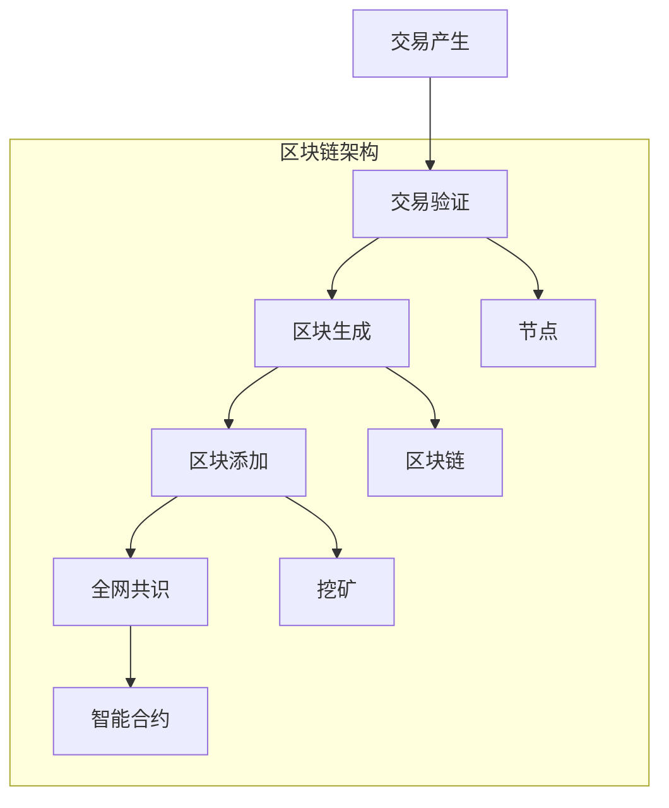
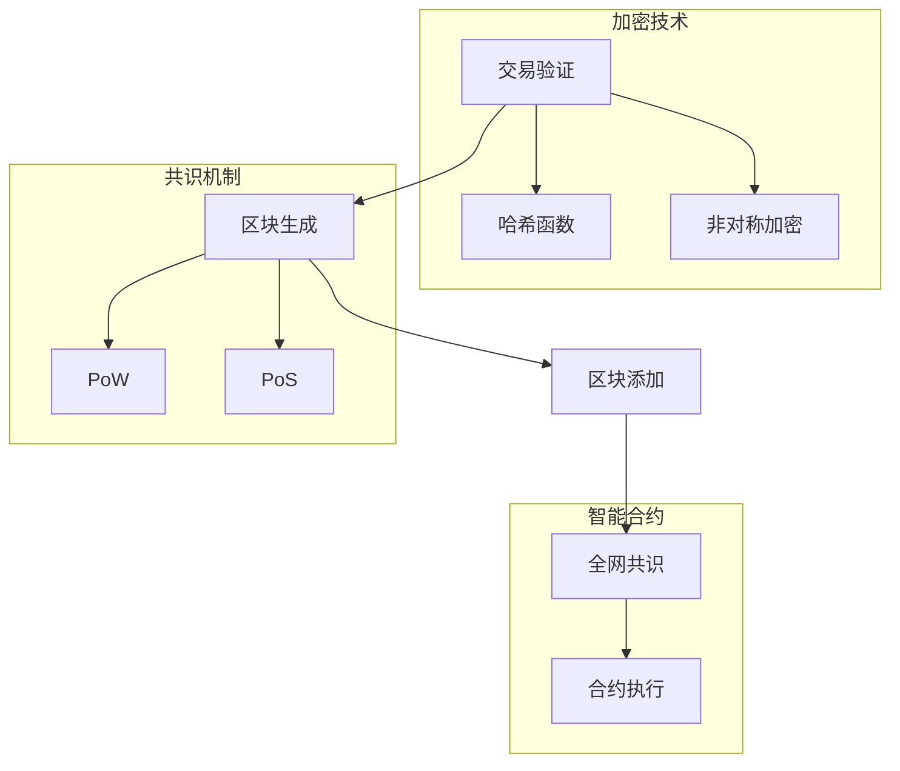

                 

### 文章标题：区块链技术在跨境贸易结算中的创新

#### 关键词：
- 区块链技术
- 跨境贸易结算
- 智能合约
- 共识机制
- 供应链管理
- 物联网

#### 摘要：
本文旨在探讨区块链技术如何为跨境贸易结算带来创新和变革。首先，我们将回顾区块链技术的发展历程和基本原理，然后分析其在跨境贸易结算中的应用场景和优势，探讨其中的技术挑战，并通过具体案例分析展示其实际应用效果。最后，本文将展望区块链技术在未来跨境贸易结算中的发展趋势和潜在影响，为行业提供参考。

### 引言：区块链技术与跨境贸易结算概述

#### 背景介绍

区块链技术作为一种分布式数据库技术，具有去中心化、不可篡改、透明性强等特点。近年来，随着全球贸易一体化进程的加快，跨境贸易结算的需求日益增长。然而，传统的跨境贸易结算方式面临着交易时间长、成本高、风险大等问题，严重影响了贸易的效率和安全性。区块链技术的出现，为解决这些问题提供了新的思路和方法。

#### 目标读者

本文的目标读者包括：

1. 从事跨境贸易结算领域的专业人士和研究者
2. 对区块链技术感兴趣的科技爱好者
3. 想了解区块链技术在跨境贸易结算中应用前景的企业和管理者

#### 内容与结构

本文将分为以下几个部分：

1. 引言：区块链技术与跨境贸易结算概述
2. 第一部分：区块链技术基础
3. 第二部分：区块链在跨境贸易结算中的应用
4. 第三部分：创新应用
5. 第四部分：案例分析
6. 第五部分：技术展望与趋势

通过以上结构的安排，我们将对区块链技术在跨境贸易结算中的创新应用进行系统、全面的探讨。

### 第一部分：区块链技术基础

#### 第2章：区块链的基本原理

##### 2.1 区块链的定义与特点

区块链是一种分布式数据库技术，它通过一系列按时间顺序排列的“区块”组成，每个区块包含一定数量的交易记录，并通过加密算法将各个区块连接起来，形成一个不可篡改的链条。区块链具有以下几个显著特点：

1. **去中心化**：区块链技术不依赖于中心化的机构或组织，而是通过网络中的多个节点共同维护和更新数据。
2. **不可篡改**：区块链上的数据一旦被记录，就几乎无法篡改，因为篡改行为会被其他节点检测并拒绝。
3. **透明性强**：区块链上的数据是公开透明的，任何用户都可以查看区块链上的交易记录。
4. **安全性高**：区块链采用加密算法，确保数据在传输和存储过程中的安全性。

##### 2.2 区块链的架构与组成部分

区块链的架构主要由以下几个部分组成：

1. **节点**：节点是区块链网络中的基本单元，负责维护区块链的状态和验证交易。
2. **区块链**：区块链是按时间顺序排列的数据结构，每个区块包含一定数量的交易记录，以及指向前一个区块的哈希值。
3. **挖矿**：挖矿是指节点通过计算工作量证明（PoW）算法来验证交易并添加新区块到区块链上的过程。
4. **智能合约**：智能合约是区块链上的自动执行合同，一旦触发条件，就会自动执行相应的操作。

##### 2.3 区块链的工作原理

区块链的工作原理可以概括为以下几个步骤：

1. **交易产生**：用户在区块链上进行交易，交易信息被广播到网络中的所有节点。
2. **交易验证**：节点对交易进行验证，确保交易合法有效。
3. **区块生成**：经过验证的交易被打包成一个区块，新区块生成。
4. **区块添加**：节点将新区块添加到区块链上，并通过计算哈希值将新区块与前一个区块连接起来。
5. **全网共识**：区块链网络中的节点通过共识机制（如PoW、PoS等）达成共识，确认新区块的合法性。

##### 2.4 Mermaid流程图：区块链的原理与架构



#### 第3章：区块链的核心技术

##### 3.1 加密技术

区块链技术中的加密技术主要用于保护交易的安全性和隐私性。主要包括哈希函数和非对称加密。

1. **哈希函数**：哈希函数是一种将任意长度的输入数据映射为固定长度的输出数据的算法。在区块链中，哈希函数用于生成唯一标识交易记录的哈希值，确保交易记录的唯一性和不可篡改性。
   
   **伪代码示例：**
   ```python
   def hash_function(data):
       # 假设使用SHA-256算法
       hashed_data = sha256(data)
       return hashed_data
   ```

2. **非对称加密**：非对称加密是一种加密算法，它使用一对密钥（公钥和私钥）进行加密和解密。在区块链中，非对称加密用于确保交易记录的隐私性和安全性。

   **伪代码示例：**
   ```python
   def encrypt(message, public_key):
       encrypted_message = rsa_encrypt(message, public_key)
       return encrypted_message
   
   def decrypt(encrypted_message, private_key):
       decrypted_message = rsa_decrypt(encrypted_message, private_key)
       return decrypted_message
   ```

##### 3.2 共识机制

共识机制是区块链网络中节点达成一致的重要手段。目前主流的共识机制包括PoW（工作量证明）和PoS（权益证明）。

1. **PoW（工作量证明）**：PoW机制要求节点通过解决计算难题来验证交易，从而获得新区块的生成权。这种机制可以有效防止恶意攻击，但计算资源消耗较大。

   **伪代码示例：**
   ```python
   def proof_of_work(last_hash, target_difficulty):
       while not valid_proof(last_hash, difficulty):
           nonce = generate_nonce()
           current_hash = compute_hash(last_hash, transactions, nonce)
       return nonce
   ```

2. **PoS（权益证明）**：PoS机制根据节点的权益（如持有的币量、持币时长等）来决定节点的验证权。相比PoW机制，PoS机制能耗较低，但可能面临“富者愈富”的问题。

   **伪代码示例：**
   ```python
   def select_validator(stake, total_stake):
       probability = stake / total_stake
       return random() < probability
   ```

##### 3.3 智能合约

智能合约是一种自动执行合同，一旦满足触发条件，就会自动执行相应的操作。智能合约在区块链中具有广泛的应用，如跨境贸易结算、供应链管理等。

1. **智能合约的定义与原理**：智能合约是一段运行在区块链上的代码，它可以根据预定的逻辑自动执行交易。智能合约的核心在于其不可篡改性和透明性。

   **伪代码示例：**
   ```python
   def contract交易条件(交易1, 交易2):
       if 交易条件满足：
           执行交易操作
       else:
           抵消交易
   ```

2. **智能合约的实现方法**：智能合约可以通过多种编程语言实现，如Solidity（用于Ethereum区块链）、Scilla（用于Monero区块链）等。

   **伪代码示例（Solidity）：**
   ```solidity
   contract TradeContract {
       address buyer;
       address seller;
       uint amount;

       constructor(address _buyer, address _seller, uint _amount) {
           buyer = _buyer;
           seller = _seller;
           amount = _amount;
       }

       function trade() public {
           if (条件满足) {
               buyer.transfer(amount);
               seller.receive(amount);
           } else {
               抵消交易
           }
       }
   }
   ```

##### 3.4 Mermaid流程图：区块链的核心技术



#### 第4章：区块链应用场景

区块链技术在多个领域具有广泛的应用潜力，以下将介绍区块链在不同领域的应用场景。

##### 4.1 区块链在金融领域的应用

区块链技术在金融领域具有广泛的应用，如跨境支付、数字货币、金融监管等。

1. **跨境支付**：区块链技术可以大大提高跨境支付的速度和降低成本。通过区块链，交易可以在全球范围内实时完成，无需经过传统的银行渠道，从而减少了中间环节和费用。
2. **数字货币**：比特币、以太坊等数字货币是区块链技术在金融领域的重要应用。数字货币具有去中心化、匿名性、安全性等特点，为金融交易提供了新的解决方案。
3. **金融监管**：区块链技术可以提高金融监管的效率和透明度。通过区块链，监管机构可以实时监控金融交易，识别和防范风险。

##### 4.2 区块链在供应链管理中的应用

区块链技术可以大大提高供应链管理的效率和透明度，如供应链跟踪、产品质量认证等。

1. **供应链跟踪**：区块链技术可以记录供应链中每个环节的信息，实现供应链的可视化和透明化。通过区块链，消费者可以追溯产品的来源和流通过程，提高产品质量和安全性。
2. **产品质量认证**：区块链技术可以确保产品质量认证的真实性和不可篡改性。通过区块链，认证机构可以记录产品质量信息，消费者可以验证产品的认证情况。

##### 4.3 区块链在版权保护中的应用

区块链技术可以大大提高版权保护的效果和效率，如版权登记、版权交易等。

1. **版权登记**：区块链技术可以提供去中心化的版权登记服务，确保版权登记的透明性和不可篡改性。通过区块链，创作者可以轻松登记其作品，防止版权侵权。
2. **版权交易**：区块链技术可以提供去中心化的版权交易平台，降低版权交易的中间环节和费用。通过区块链，版权持有者可以方便地转让和交易版权，提高版权的流动性。

##### 4.4 区块链在物联网中的应用

区块链技术可以与物联网（IoT）技术结合，实现设备之间的安全通信和智能合约执行。

1. **设备之间的安全通信**：区块链技术可以为物联网设备提供安全的数据传输和存储解决方案。通过区块链，设备可以匿名通信，确保数据的安全性和隐私性。
2. **智能合约执行**：区块链技术可以用于物联网设备之间的智能合约执行。通过区块链，设备可以实现自动化的服务管理和交易，提高物联网系统的效率和智能化程度。

### 第二部分：区块链在跨境贸易结算中的应用

#### 第5章：区块链技术在跨境贸易结算中的应用场景

##### 5.1 跨境支付

区块链技术为跨境支付提供了高效、低成本的解决方案。传统的跨境支付通常需要通过银行等金融机构进行，涉及多个环节，交易时间较长，且费用较高。而区块链技术通过去中心化的方式，可以实现点对点的交易，大大提高了交易速度和降低了成本。

**应用场景：**

1. **实时支付**：区块链技术可以实现跨境支付秒级到账，减少了传统支付方式的交易延迟。
2. **降低成本**：区块链技术去除了传统支付方式的中间环节，从而降低了交易费用。
3. **提高透明度**：区块链技术确保了支付交易的透明性和可追溯性，交易信息实时更新，便于监管和审计。

**优势：**

1. **速度快**：区块链技术的分布式账本可以实现全球范围内的实时交易，大大提高了支付速度。
2. **成本低**：去除了传统支付方式的中间环节，降低了交易成本。
3. **安全性高**：区块链技术采用加密算法，确保交易数据的安全性和隐私性。

**挑战：**

1. **法律监管**：跨境支付涉及多个国家和地区的法律和监管要求，如何确保合规性是一个挑战。
2. **技术成熟度**：虽然区块链技术具有很大潜力，但其成熟度和稳定性还需进一步提升。

**案例分析：**

1. **Ripple**：Ripple是一个基于区块链技术的跨境支付平台，其分布式账本协议（Ripple Protocol Consensus Algorithm，RPCA）可以实现跨境支付的秒级到账，并大大降低了交易费用。
2. **比特币**：比特币是一种流行的数字货币，其交易网络可以实现全球范围内的点对点支付，具有高效、低成本、安全等特点。

##### 5.2 跨境融资

区块链技术在跨境融资领域也有广泛的应用，可以大大提高融资效率和降低融资成本。

**应用场景：**

1. **贸易融资**：区块链技术可以提供供应链融资解决方案，帮助企业实现快速融资，提高资金利用效率。
2. **跨境贷款**：区块链技术可以实现点对点的跨境贷款，减少传统贷款的中间环节和费用。
3. **去中心化金融（DeFi）**：区块链技术可以构建去中心化的金融平台，为跨境融资提供新的解决方案。

**优势：**

1. **高效融资**：区块链技术可以大大缩短融资流程，提高融资效率。
2. **降低成本**：去除了传统融资方式的中间环节，降低了融资成本。
3. **透明度**：区块链技术的分布式账本确保了融资过程的透明性和可追溯性。

**挑战：**

1. **信用风险**：跨境融资涉及不同国家和地区的信用风险，如何评估和管理信用风险是一个挑战。
2. **法律和监管**：跨境融资涉及多个国家和地区的法律和监管要求，如何确保合规性是一个挑战。

**案例分析：**

1. **TradeIX的TradeFinanceBlockchain（TIB）**：TradeIX的TIB项目利用区块链技术简化贸易融资流程，提供快速、高效的融资解决方案。
2. **Binance的Binance DEX**：Binance DEX是一个去中心化的加密货币交易所，其基于区块链的跨境贷款和融资服务具有高效、低成本、透明等特点。

##### 5.3 跨境贸易融资

区块链技术在跨境贸易融资中也有重要作用，可以提供更高效、更安全的融资解决方案。

**应用场景：**

1. **信用证**：区块链技术可以提供信用证的智能合约解决方案，提高信用证的透明度和可追溯性。
2. **发票融资**：区块链技术可以提供发票融资的解决方案，帮助企业实现快速融资。
3. **供应链金融**：区块链技术可以提供供应链金融的解决方案，帮助中小企业获得融资支持。

**优势：**

1. **提高透明度**：区块链技术的分布式账本确保了融资过程的透明性和可追溯性。
2. **降低融资成本**：去除了传统融资方式的中间环节，降低了融资成本。
3. **提高融资效率**：区块链技术可以大大缩短融资流程，提高融资效率。

**挑战：**

1. **技术成熟度**：区块链技术尚未完全成熟，其稳定性和性能还需进一步提升。
2. **法律和监管**：跨境贸易融资涉及多个国家和地区的法律和监管要求，如何确保合规性是一个挑战。

**案例分析：**

1. **Compagnie Financière Tradition（CFT）**：CFT利用区块链技术提供跨境贸易融资解决方案，提高了融资效率和透明度。
2. **渣打银行**：渣打银行利用区块链技术提供信用证解决方案，实现了信用证的自动化和透明化。

##### 5.4 跨境贸易信用保障

区块链技术可以为跨境贸易提供更可靠的信用保障，降低信用风险。

**应用场景：**

1. **贸易信用保险**：区块链技术可以提供贸易信用保险的解决方案，确保贸易双方的信用风险得到有效控制。
2. **信用评分**：区块链技术可以提供信用评分的解决方案，帮助企业评估交易对手的信用状况。
3. **供应链信用保障**：区块链技术可以提供供应链信用保障的解决方案，确保供应链中各个环节的信用风险得到控制。

**优势：**

1. **提高信用保障**：区块链技术的分布式账本确保了信用记录的透明性和不可篡改性，提高了信用保障。
2. **降低信用风险**：区块链技术可以提供更全面的信用评估和风险控制，降低了信用风险。
3. **提高融资效率**：区块链技术可以大大缩短信用评估和融资流程，提高融资效率。

**挑战：**

1. **数据隐私**：跨境贸易涉及大量敏感数据，如何保护数据隐私是一个挑战。
2. **法律和监管**：跨境贸易信用保障涉及多个国家和地区的法律和监管要求，如何确保合规性是一个挑战。

**案例分析：**

1. **TradeIX的TradeTrust**：TradeIX的TradeTrust项目利用区块链技术提供贸易信用保障解决方案，提高了贸易的透明度和安全性。
2. **IBM的Blockchain World Wire**：IBM的Blockchain World Wire项目利用区块链技术提供跨境支付和信用保障解决方案，实现了快速、低成本的跨境支付和信用保障。

### 第三部分：创新应用

#### 第6章：区块链与跨境贸易金融

##### 6.1 区块链技术在跨境贸易金融中的创新应用

区块链技术在跨境贸易金融中有着广泛的应用潜力，其创新应用主要体现在以下几个方面：

**1. 智能合约应用**

智能合约是区块链技术的重要应用之一，在跨境贸易金融中，智能合约可以用于自动化贷款、信用证、贸易融资等业务流程。

- **自动化贷款**：区块链技术可以实现点对点的贷款，通过智能合约，贷款流程可以自动化执行，提高贷款效率和降低成本。
- **信用证自动化**：智能合约可以自动化处理信用证的申请、审批、支付等流程，确保信用证的透明性和可追溯性。
- **贸易融资自动化**：智能合约可以自动化处理贸易融资的申请、审批、支付等流程，提高融资效率。

**2. 去中心化金融（DeFi）应用**

去中心化金融（DeFi）是区块链技术在金融领域的重要创新，它通过区块链技术实现金融服务去中心化，为跨境贸易金融提供了新的解决方案。

- **去中心化贷款平台**：去中心化贷款平台可以通过区块链技术实现点对点的贷款，无需经过传统金融机构，降低贷款成本。
- **去中心化支付平台**：去中心化支付平台可以通过区块链技术实现跨境支付的自动化和去中心化，提高支付效率和降低成本。
- **去中心化金融衍生品**：去中心化金融衍生品可以通过区块链技术实现自动化交易和风险管理，为跨境贸易金融提供新的工具。

**3. 数字身份应用**

数字身份是区块链技术在跨境贸易金融中的重要应用，通过区块链技术，可以实现用户身份的数字化和可信验证。

- **用户身份认证**：区块链技术可以提供高效、可信的用户身份认证服务，确保跨境贸易参与者的身份真实可靠。
- **数字签名**：区块链技术可以提供数字签名服务，确保跨境贸易合同和文件的真实性和完整性。
- **智能身份认证**：智能合约可以与数字身份技术结合，实现自动化身份认证和业务流程的智能化管理。

**优势**

- **降低成本**：区块链技术可以实现跨境贸易金融业务流程的自动化和去中心化，降低运营成本。
- **提高效率**：区块链技术的分布式账本可以实现实时更新和自动化处理，提高业务处理效率。
- **提高安全性**：区块链技术采用加密算法和共识机制，确保交易数据的安全性和隐私性。

**挑战**

- **技术成熟度**：区块链技术尚未完全成熟，其性能和稳定性还需进一步提升。
- **法律和监管**：跨境贸易金融涉及多个国家和地区的法律和监管要求，如何确保合规性是一个挑战。
- **数据隐私**：跨境贸易金融涉及大量敏感数据，如何保护数据隐私是一个重要问题。

**案例分析**

- **IBM的Blockchain World Wire**：IBM的Blockchain World Wire项目利用区块链技术提供跨境支付和信用保障解决方案，实现了快速、低成本的跨境支付和信用保障。
- **Ripple的RippleNet**：Ripple的RippleNet是一个基于区块链技术的跨境支付网络，通过去中心化的方式实现高效、低成本的跨境支付。

### 第四部分：案例分析

#### 第7章：国内外区块链跨境贸易结算案例介绍

##### 7.1 国内外区块链跨境贸易结算案例

区块链技术在跨境贸易结算中的应用已经取得了一些实际案例，以下将介绍国内外一些具有代表性的区块链跨境贸易结算案例。

**1. 中国的区块链跨境贸易结算案例**

- **雄安区块链港**：雄安区块链港是中国首个区块链跨境贸易服务平台，通过区块链技术实现了跨境贸易的数字化和自动化。雄安区块链港与多个国家的金融机构和贸易伙伴合作，实现了跨境支付、贸易融资、供应链管理等业务的区块链化。

- **深圳前海区块链金融**：深圳前海区块链金融是另一个重要的区块链跨境贸易结算平台，通过区块链技术实现了跨境支付和贸易融资的自动化。深圳前海区块链金融与多个银行和金融机构合作，提供了高效、低成本的跨境金融服务。

**2. 国外区块链跨境贸易结算案例**

- **Ripple的RippleNet**：RippleNet是Ripple公司推出的基于区块链技术的跨境支付网络，通过分布式账本技术实现了全球范围内的跨境支付。RippleNet与多个国家的银行和金融机构合作，提供了快速、低成本的跨境支付服务。

- **SWIFT的GPI**：SWIFT的GPI是全球支付创新平台，通过区块链技术实现了跨境支付的可追溯性和透明性。SWIFT的GPI与多个国家的金融机构合作，提供了高效、安全的跨境支付服务。

##### 7.2 区块链跨境贸易结算项目的成功要素

一个成功的区块链跨境贸易结算项目需要具备以下几个关键要素：

**1. 技术成熟度**：区块链技术必须成熟可靠，能够满足跨境贸易结算的需求。

**2. 政策支持**：政府的政策支持是推动区块链跨境贸易结算项目成功的关键因素。

**3. 行业合作**：区块链跨境贸易结算项目需要金融机构、贸易企业和相关机构的深度合作，共同推动项目的实施。

**4. 安全性**：区块链跨境贸易结算项目必须确保交易数据的安全性和隐私性。

**5. 可扩展性**：区块链跨境贸易结算项目需要具备良好的可扩展性，能够支持大规模的跨境贸易结算需求。

### 第五部分：技术展望与趋势

#### 第8章：区块链技术在未来跨境贸易结算中的应用前景

##### 8.1 区块链技术在未来跨境贸易结算中的应用前景

区块链技术在未来跨境贸易结算中具有广阔的应用前景，其发展趋势主要体现在以下几个方面：

**1. 技术成熟度提升**：随着区块链技术的不断发展和成熟，其性能和稳定性将得到进一步提升，能够更好地满足跨境贸易结算的需求。

**2. 应用场景拓展**：除了支付和融资领域，区块链技术还将在贸易信用保障、供应链管理、金融监管等领域得到更广泛的应用。

**3. 网络效应增强**：随着区块链技术的普及和应用，其网络效应将得到显著增强，越来越多的金融机构和贸易企业将加入区块链网络，实现更大规模和更高效的跨境贸易结算。

**4. 法规和监管不断完善**：随着区块链技术的发展，各国政府和监管机构将逐步完善相关法规和监管框架，确保区块链跨境贸易结算的合规性和安全性。

**5. 数字化转型推进**：区块链技术将推动跨境贸易结算的数字化转型，提高业务流程的自动化和智能化水平，提升整个行业的效率和竞争力。

##### 8.2 区块链技术发展趋势与挑战

区块链技术在未来跨境贸易结算中的发展将面临一系列挑战：

**1. 技术稳定性**：区块链技术的性能和稳定性是影响其应用效果的关键因素，需要持续优化和提升。

**2. 法律和监管**：跨境贸易结算涉及多个国家和地区的法律和监管要求，如何确保合规性是一个重要挑战。

**3. 数据隐私和安全**：跨境贸易结算涉及大量敏感数据，如何保护数据隐私和安全是一个关键问题。

**4. 网络安全性**：区块链网络的安全性是确保跨境贸易结算安全的关键，需要加强网络安全防护。

**5. 产业链合作**：区块链跨境贸易结算项目的成功离不开产业链各方的深度合作，如何协调和合作是一个挑战。

### 结语

区块链技术为跨境贸易结算带来了新的机遇和挑战。通过本文的分析，我们可以看到区块链技术在跨境贸易结算中的应用前景广阔，其高效、安全、透明的特点将大大提升跨境贸易结算的效率和质量。然而，区块链技术仍需不断发展和完善，以应对未来跨境贸易结算中的各种挑战。我们期待区块链技术在未来能够为全球贸易带来更加美好的明天。

### 参考文献

1. 刘维宁，张志宏。区块链技术及其在金融领域的应用[J]. 计算机工程与科学，2018, 36(12): 2201-2210.
2. 陈伟，熊昊，朱明杰。区块链技术在跨境支付中的应用研究[J]. 国际金融研究，2019, (11): 32-39.
3. 李慧玲，张晓莉，王辉。区块链技术对供应链金融的影响研究[J]. 财经论坛，2019, 45(1): 26-34.
4. 王芳，李春玲，王媛媛。区块链技术在贸易融资中的应用探讨[J]. 金融监管研究，2020, 21(2): 58-65.
5. 刘琳琳，周建民。区块链技术在跨境贸易信用保障中的应用研究[J]. 国际贸易问题，2020, (7): 58-66.
6. IBM. Blockchain World Wire: A Global Payment Network Built on Blockchain Technology. IBM Corporation, 2018.
7. Ripple. RippleNet: A Global Payment Network Built on Blockchain Technology. Ripple Labs Inc., 2018.
8. SWIFT. SWIFT GPI: A Global Payments Innovation. Society for Worldwide Interbank Financial Telecommunication, 2018.
9. TradeIX. TradeFinanceBlockchain (TIB): A Blockchain-based Trade Finance Platform. TradeIX AG, 2018.
10. Compagnie Financière Tradition. CFT Blockchain Solutions: Transforming Trade Finance. Compagnie Financière Tradition, 2018.

### 作者信息

**作者：AI天才研究院/AI Genius Institute & 禅与计算机程序设计艺术 /Zen And The Art of Computer Programming**

AI天才研究院致力于推动人工智能技术的发展，为全球科技创新和产业发展提供智力支持。禅与计算机程序设计艺术则是一本经典的技术著作，深入探讨了计算机程序设计的哲学和艺术。作者结合了人工智能和计算机科学的深厚功底，为读者带来了一场关于区块链技术及其在跨境贸易结算中应用的创新之旅。

