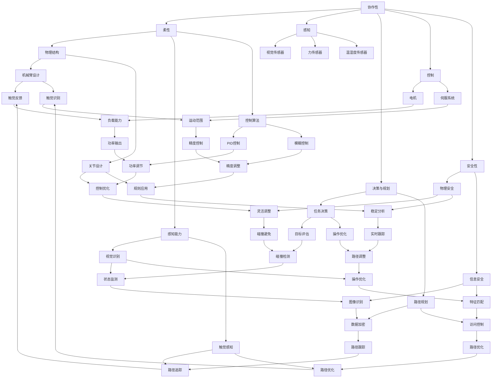

                 


### 引言

制造业是国民经济的重要支柱，随着全球工业4.0的推进，智能化和自动化技术成为制造业转型升级的关键驱动力。在这一背景下，协作机器人作为一种新兴技术，逐渐在制造业中崭露头角。协作机器人，顾名思义，是指能够与人协同工作的机器人，其设计初衷是为了实现人与机器人之间的和谐共处，提高生产效率和降低人力成本。协作机器人在制造业中的应用，不仅改变了传统的生产模式，也为制造业的未来发展提供了新的方向。

协作机器人在制造业中的角色演变，是一个复杂且多层次的过程。从最初作为简单的辅助设备，到如今能够承担复杂的生产任务，协作机器人的发展历程充满了技术创新和实践经验的积累。在这个过程中，协作机器人不仅承担了更多的生产任务，其安全性和适应性也得到了显著提升。本文旨在探讨协作机器人在制造业中的角色演变，分析其核心概念、技术基础、应用场景和发展趋势，为制造业的智能化转型提供有益的参考。

关键词：协作机器人、制造业、角色演变、智能化转型、技术创新

摘要：本文首先介绍了协作机器人在制造业中的角色演变背景，然后详细分析了协作机器人的核心概念、技术基础和应用场景。接着，本文通过具体的案例，探讨了协作机器人在制造业中的应用实例，并对其发展趋势进行了展望。最后，本文提出了协作机器人与制造业融合的最佳实践策略，为制造业的智能化转型提供了指导。

### 制造业的变革与挑战

#### 一、制造业的数字化与智能化趋势

随着信息技术的飞速发展，制造业正经历着一场深刻的变革。数字化和智能化成为制造业转型升级的核心驱动力。传统制造业以大规模生产、标准化流程为主，而数字化和智能化则强调了个性化和高效化。通过引入物联网、大数据、云计算等新兴技术，制造业可以实现生产过程的实时监控、数据分析和优化，从而大幅提高生产效率和质量。

首先，物联网技术使得制造设备、生产流程和产品之间的信息传递更加高效。通过传感器、RFID等设备，制造商可以实时收集生产过程中的各种数据，如设备状态、生产进度、原材料消耗等。这些数据为生产线的优化提供了宝贵的信息支持。

其次，大数据技术使得海量数据的存储、处理和分析成为可能。通过对生产数据的分析，制造商可以发现潜在的生产瓶颈、优化生产流程、预测设备故障等。大数据技术不仅提高了生产效率，还降低了生产成本。

最后，云计算技术为制造业提供了强大的计算能力和数据存储能力。通过云计算平台，制造商可以实现远程监控和管理，同时利用云端的算法和工具进行数据分析和优化。云计算技术使得制造业的智能化转型更加便捷和高效。

#### 二、制造业面临的挑战

尽管数字化和智能化为制造业带来了巨大的机遇，但同时也带来了许多挑战。

首先，技术挑战。数字化和智能化技术虽然成熟，但在制造业中的实际应用仍然面临许多问题。例如，传感器数据的准确性、大数据分析的结果可信度、云计算平台的安全性等。这些问题需要制造业与信息技术企业紧密合作，共同解决。

其次，管理挑战。数字化和智能化改造不仅仅需要技术支持，更需要管理方式的变革。制造业企业需要建立全新的管理理念、管理模式和管理流程，以适应数字化和智能化的生产模式。这涉及到企业的组织结构、人力资源管理、生产流程等多个方面。

再次，人才挑战。数字化和智能化对人才的需求发生了很大变化。制造业需要具备信息技术、数据分析、智能制造等多方面能力的人才。然而，目前制造业的人才储备还远远无法满足这一需求。因此，制造业企业需要加强对人才的培养和引进，建立人才培养机制。

最后，市场挑战。随着全球化的加剧，市场竞争日益激烈。制造业企业需要不断创新，提高产品质量和效率，才能在激烈的市场竞争中立于不败之地。数字化和智能化提供了这样的机会，但同时也带来了新的竞争压力。

总之，制造业的数字化和智能化是一个复杂而充满挑战的过程。只有克服这些挑战，制造业才能实现真正的转型升级，走向智能化和高效化。

### 协作机器人的定义与分类

#### 一、协作机器人的基本定义

协作机器人（Collaborative Robot，简称Cobot）是一种专门设计用于与人类工作人员共同工作环境中的自动化设备。与传统的工业机器人不同，协作机器人的设计初衷是为了实现人机协同作业，减少工人的劳动强度，提高生产效率。协作机器人通常具备以下特点：

1. **高安全性**：协作机器人通常采用柔性设计，具备自我感知和避障功能，能够在人机共存的场景中保证操作人员的安全。
2. **灵活性**：协作机器人具备快速部署和重新配置的能力，可以根据不同的生产需求迅速调整任务和工作流程。
3. **易操作**：协作机器人操作简单，无需复杂的编程和调试，一般通过图形界面即可完成编程和配置。

#### 二、协作机器人的分类

协作机器人根据应用场景和功能特点，可以分为以下几种类型：

1. **搬运类协作机器人**：这类机器人主要用于物料搬运和配送，如自动取放工件、搬运货物等。其典型代表是KUKA的KMR iiwa。

2. **装配类协作机器人**：这类机器人专门用于小型零部件的装配和组装，如精密螺丝固定、电子元件焊接等。典型代表有ABB的YuMi。

3. **检测类协作机器人**：这类机器人主要负责产品质量检测，如视觉检测、尺寸测量等。其典型代表是EPSON的AG-V10。

4. **服务类协作机器人**：这类机器人主要应用于服务领域，如酒店服务、医疗护理等。其代表包括亚马逊的Kiva机器人。

#### 三、协作机器人在制造业中的应用优势

协作机器人在制造业中的应用，不仅能够显著提高生产效率和产品质量，还具有以下优势：

1. **降低人力成本**：协作机器人可以替代部分重复性、高强度、危险的工作，从而减少企业对人工的依赖，降低人力成本。

2. **提高生产效率**：协作机器人可以精确控制生产过程，减少人为误差，提高生产效率和产品质量。

3. **提升灵活性**：协作机器人可以根据生产需求快速调整工作流程和任务，适应多样化的生产任务。

4. **增强安全性**：协作机器人的柔性设计和安全控制系统能够有效降低工作环境中的人身伤害风险。

5. **促进创新**：协作机器人的引入，可以激发企业对生产流程和管理的创新，推动制造业向更加智能化和高效化的方向发展。

总之，协作机器人在制造业中的应用，不仅带来了技术上的革新，也为企业的长远发展提供了新的机遇。随着技术的不断进步和应用场景的不断拓展，协作机器人在制造业中的角色将变得越来越重要。

#### 核心概念与联系

在讨论协作机器人的核心概念之前，我们需要明确几个关键术语和它们之间的关系。以下是协作机器人技术中的重要概念及其相互关系架构：

1. **协作性**：协作机器人最显著的特点之一就是能够与人协同工作。这意味着机器人必须具备与人交互的能力，包括感知环境、理解指令和做出响应。

2. **柔性**：柔性是指机器人能够适应不同的工作环境和任务需求。柔性设计包括机器人的物理结构、感知能力和控制算法。

3. **感知**：感知是指机器人通过传感器获取外部环境信息的能力。常见传感器包括视觉传感器、力传感器、温湿度传感器等。

4. **决策与规划**：决策与规划是指机器人根据感知到的环境信息和预设目标，进行任务决策和路径规划的能力。

5. **控制**：控制是指机器人根据决策和规划结果，通过执行机构（如电机、伺服系统）实现动作的能力。

6. **安全性**：安全性是指机器人在人机共存的场景中，能够保障人类安全的能力。这包括物理安全（如柔性结构、紧急停止机制）和信息安全（如数据加密、访问控制）。

以下是一个Mermaid流程图，展示了这些核心概念之间的相互关系：



通过上述流程图，我们可以清晰地看到协作机器人的各个核心概念之间的相互关联。这些概念共同构成了协作机器人的技术框架，使得机器人能够在复杂多变的生产环境中与人类高效协作。

### 协作机器人的技术基础

#### 一、传感器技术

传感器是协作机器人获取外部环境信息的重要工具。常见的传感器类型包括视觉传感器、力传感器和温湿度传感器等。

1. **视觉传感器**：视觉传感器通过图像处理技术，使机器人能够“看到”并理解周围环境。图像处理技术包括图像识别、特征提取和图像分割等。通过这些技术，机器人可以实现目标定位、物体识别和路径规划等功能。

   **伪代码示例**：
   ```python
   function imageProcessing(image):
       grayImage = convertToGray(image)
       edges = edgeDetection(grayImage)
       contours = findContours(edges)
       target = identifyObject(contours)
       return target
   ```

2. **力传感器**：力传感器用于测量机器人与物体之间的接触力，帮助机器人实时调整动作，确保任务的准确执行。常见的力传感器有电阻应变片式、压电式和压阻式等。

   **伪代码示例**：
   ```python
   function measureForce(forceSensor):
       rawValue = readSensor(forceSensor)
       calibratedValue = calibrate(rawValue)
       return calibratedValue
   ```

3. **温湿度传感器**：温湿度传感器用于检测环境温度和湿度，对某些制造过程至关重要。常见的传感器有热电偶、电阻式和电容式等。

   **伪代码示例**：
   ```python
   function measureTemperature(temperatureSensor):
       rawValue = readSensor(temperatureSensor)
       calibratedValue = calibrate(rawValue)
       return calibratedValue
   
   function measureHumidity(humiditySensor):
       rawValue = readSensor(humiditySensor)
       calibratedValue = calibrate(rawValue)
       return calibratedValue
   ```

#### 二、运动规划与控制算法

运动规划与控制算法是协作机器人实现精确动作的核心技术。常见的算法包括PID控制、模糊控制和运动规划算法等。

1. **PID控制**：PID控制（比例-积分-微分控制）是最常用的控制算法，适用于连续系统的稳态和动态控制。

   **伪代码示例**：
   ```python
   function PIDControl(setpoint, processVariable, kp, ki, kd):
       error = setpoint - processVariable
       integral = integral + error
       derivative = error - lastError
       output = kp * error + ki * integral + kd * derivative
       lastError = error
       return output
   ```

2. **模糊控制**：模糊控制通过模糊逻辑对系统进行控制，特别适用于非线性、复杂系统。

   **伪代码示例**：
   ```python
   function fuzzyControl(inputValues, ruleBase):
       fuzzySet = fuzzify(inputValues, ruleBase)
       output = defuzzify(fuzzySet, ruleBase)
       return output
   ```

3. **运动规划算法**：运动规划算法用于确定机器人在给定环境中的运动路径，常见的算法有RRT（快速随机树）、A*算法和RRT*算法等。

   **伪代码示例**：
   ```python
   function RRT planners(start, goal, obstacles):
       tree = initializeTree(start)
       while not goalInTree(goal, tree):
           randomPoint = generateRandomPoint()
           if isValidPoint(randomPoint, obstacles):
               extendTree(tree, start, randomPoint)
       path = findShortestPath(goal, tree)
       return path
   ```

#### 三、人机交互算法

人机交互算法是协作机器人实现与人类高效协作的重要手段。常见的人机交互技术包括自然语言处理、语音识别和手势识别等。

1. **自然语言处理**：自然语言处理（NLP）技术使机器人能够理解和处理自然语言指令，提高人机交互的便捷性和智能化。

   **伪代码示例**：
   ```python
   function interpretCommand(command):
       intent = extractIntent(command)
       entities = extractEntities(command)
       action = determineAction(intent, entities)
       return action
   ```

2. **语音识别**：语音识别技术使机器人能够接收语音指令，实现语音控制。

   **伪代码示例**：
   ```python
   function recognizeSpeech(audio):
       transcript = transcribe(audio)
       command = interpretCommand(transcript)
       return command
   ```

3. **手势识别**：手势识别技术使机器人能够通过识别手势来接收指令，增加人机交互的直观性和趣味性。

   **伪代码示例**：
   ```python
   function recognizeGesture(image):
       gestures = detectGestures(image)
       command = interpretGesture(gestures)
       return command
   ```

通过这些传感器技术、运动规划与控制算法以及人机交互算法，协作机器人能够实现高效、准确和灵活的协同作业，为制造业的智能化转型提供坚实的技术支持。

### 协作机器人在制造业中的应用

#### 一、生产线自动化

协作机器人在制造业中最常见的应用场景之一是生产线自动化。传统的生产线往往需要大量的劳动力进行操作和维护，这不仅增加了生产成本，还容易导致生产效率低下和产品质量不稳定。协作机器人的引入，可以显著提高生产线的自动化水平，减少人力成本，提高生产效率。

在生产线自动化中，协作机器人通常负责以下任务：

1. **物料搬运**：协作机器人可以在生产线不同环节之间搬运工件和物料，如从原材料仓库到生产线的不同工位。

   **应用案例**：
   - 某汽车制造厂引入协作机器人，实现了从车身组装到涂装线的自动化物料搬运，减少了50%的人力成本，提高了生产效率。

2. **装配作业**：协作机器人可以精确执行各种装配任务，如螺丝固定、电子元件焊接等。

   **应用案例**：
   - 一家电子制造公司利用协作机器人进行SMD（表面贴装技术）组件的装配，不仅提高了装配精度，还缩短了生产周期。

3. **质量检测**：协作机器人配备视觉传感器，可以实时检测产品的质量和外观，及时发现并剔除不合格品。

   **应用案例**：
   - 一家家电制造企业采用协作机器人进行产品外观检测，提高了检测效率和产品合格率。

#### 二、质量控制

质量控制是制造业中至关重要的环节，协作机器人在这一领域发挥着重要作用。通过集成传感器和人工智能技术，协作机器人能够对生产过程进行实时监控和分析，确保产品质量的稳定和一致性。

在质量控制中，协作机器人主要承担以下任务：

1. **尺寸测量**：协作机器人通过高精度传感器进行产品尺寸测量，确保产品符合设计要求。

   **应用案例**：
   - 一家航空制造企业使用协作机器人进行飞机零部件的尺寸测量，提高了测量精度，减少了人为误差。

2. **缺陷检测**：协作机器人利用视觉系统对产品进行高分辨率图像分析，检测产品表面缺陷。

   **应用案例**：
   - 一家玻璃制造企业引入协作机器人进行玻璃面板的缺陷检测，有效提高了产品的质量和客户满意度。

3. **过程监控**：协作机器人可以对生产过程的关键参数进行实时监控，如温度、压力等，及时发现异常并采取措施。

   **应用案例**：
   - 一家化工生产企业利用协作机器人对生产过程中的温度和压力进行监控，确保了生产过程的安全性和稳定性。

#### 三、物流与配送

物流与配送是制造业的重要组成部分，协作机器人在这方面的应用大大提高了物流效率，降低了运营成本。协作机器人可以在仓库、生产线和配送中心之间灵活移动，完成物料的搬运和配送任务。

在物流与配送中，协作机器人主要承担以下任务：

1. **仓库管理**：协作机器人可以自动识别和管理仓库中的物料，提高仓库存储和检索效率。

   **应用案例**：
   - 一家电商物流中心引入协作机器人进行仓储管理，实现了自动化入库、出库和分拣，大大提高了物流效率。

2. **生产线配送**：协作机器人可以在生产线不同环节之间自动配送物料，确保生产线的连续运行。

   **应用案例**：
   - 一家食品制造企业使用协作机器人进行生产线的物料配送，提高了生产效率和产品质量。

3. **末端配送**：协作机器人可以完成最后一公里的配送任务，将商品直接送达消费者手中。

   **应用案例**：
   - 一家快递公司使用协作机器人进行末端配送，提高了配送速度和准确性，增强了客户体验。

通过在生产线自动化、质量控制和物流与配送等领域的广泛应用，协作机器人正逐步改变制造业的生产模式和运营方式，为制造业的智能化转型提供了有力支持。未来，随着技术的不断进步和应用场景的拓展，协作机器人将在制造业中发挥更加重要的作用。

### 协作机器人在制造业中的应用实例

#### 一、汽车制造业

汽车制造业是协作机器人应用的一个重要领域。随着汽车制造过程的复杂性和对效率、质量要求的提高，协作机器人在汽车生产中的应用越来越广泛。

1. **焊接作业**：在汽车制造中，焊接作业是一个关键环节。协作机器人可以通过精确的焊接技术，确保车身各个部分的焊接质量和一致性。例如，特斯拉的Gigafactory工厂中，协作机器人用于焊接电池模块和车身结构，提高了生产效率和产品质量。

   **应用案例**：
   - 特斯拉Gigafactory：协作机器人用于焊接电池模块和车身结构，提高了生产效率和产品质量。

2. **装配作业**：协作机器人在汽车装配线上执行各种装配任务，如安装仪表盘、座椅、方向盘等。这些任务通常需要高精度的操作和灵活性。协作机器人的引入，不仅提高了装配速度和精度，还减轻了工人的劳动强度。

   **应用案例**：
   - 通用汽车：协作机器人用于装配仪表盘和座椅，提高了装配效率和产品质量。

3. **质量检测**：协作机器人配备高分辨率摄像头和传感器，可以实时检测汽车零部件和整车的外观质量，确保每个部件都符合标准。这种自动化的检测方式，不仅提高了检测效率，还降低了人为误差。

   **应用案例**：
   - 福特汽车：协作机器人用于检测车身焊接质量和外观缺陷，确保产品符合质量标准。

#### 二、电子制造业

电子制造业对生产效率和产品质量的要求极高，协作机器人在这一领域的应用也日益普及。

1. **组装与贴片**：协作机器人可以精确执行SMD（表面贴装技术）组件的装配任务，如焊接电阻、电容和集成电路等。协作机器人的引入，大大提高了生产效率和产品一致性。

   **应用案例**：
   - 康德莱：协作机器人用于SMD组件的焊接和装配，提高了生产效率和产品合格率。

2. **检测与测试**：协作机器人可以通过视觉系统和传感器，对电子产品的质量和功能进行检测。这种自动化的检测方式，不仅提高了检测速度，还降低了检测成本。

   **应用案例**：
   - 戴尔：协作机器人用于检测电脑主板和显示器的质量，确保产品符合标准。

3. **包装与物流**：协作机器人可以自动完成电子产品的包装和物流任务，如将产品包装放入托盘、搬运到仓库等。这种自动化物流系统，提高了物流效率和准确性。

   **应用案例**：
   - 三星：协作机器人用于包装和物流，提高了物流效率和准确性。

#### 三、食品制造业

食品制造业对卫生和安全要求极高，协作机器人的应用可以显著提高生产效率和卫生水平。

1. **包装作业**：协作机器人可以自动完成食品的包装任务，如将食品放入包装袋、封口等。协作机器人的引入，不仅提高了包装速度和精度，还减少了人工操作导致的污染风险。

   **应用案例**：
   - 可口可乐：协作机器人用于包装饮料，提高了包装速度和精度。

2. **分拣与配送**：协作机器人可以自动识别和分拣不同种类的食品，如水果、蔬菜和罐头等。这种自动化分拣系统，提高了分拣效率和准确性，同时降低了人工成本。

   **应用案例**：
   - 赛百味：协作机器人用于分拣和配送食品，提高了分拣效率和准确性。

3. **加工与检测**：协作机器人可以执行食品的加工和检测任务，如切割、切割和温度监测等。通过自动化加工和检测，确保食品的质量和安全。

   **应用案例**：
   - 蒙牛：协作机器人用于切割和检测牛奶，提高了加工效率和产品质量。

通过以上实例，我们可以看到协作机器人在不同制造业领域的广泛应用。协作机器人不仅提高了生产效率和产品质量，还显著降低了生产成本和人力资源需求。未来，随着技术的不断进步，协作机器人在制造业中的应用将会更加广泛和深入。

### 协作机器人在制造业中的发展趋势与挑战

#### 一、技术发展趋势

随着人工智能和机器人技术的不断进步，协作机器人在制造业中的应用趋势也呈现出多样化和智能化的发展方向。

1. **自主决策与学习能力**：未来的协作机器人将具备更强的自主决策能力，能够根据生产环境和任务需求，自主调整操作策略。同时，通过深度学习和强化学习等算法，机器人将具备自我优化和适应新任务的能力。

   **发展前景**：
   - 协作机器人将能够实时感知生产环境，自动调整工作参数，提高生产效率和产品质量。

2. **高精度与高可靠性**：未来的协作机器人将朝着更高的精度和可靠性发展。通过纳米制造和微电子技术的进步，机器人的传感器和控制系统的精度将大幅提升，使得其在高精度加工和质量检测方面的应用更加广泛。

   **发展前景**：
   - 高精度协作机器人将在航空航天、医疗器械等高端制造领域发挥重要作用。

3. **人机协作新形态**：随着虚拟现实（VR）和增强现实（AR）技术的发展，人机协作模式将更加丰富和直观。未来的协作机器人将能够通过VR/AR技术与人类进行实时互动，实现更加高效和自然的人机协作。

   **发展前景**：
   - VR/AR技术与协作机器人的结合，将大大提高人机协作的效率和用户体验。

4. **边缘计算与实时处理**：随着物联网和边缘计算技术的发展，协作机器人将具备更强大的实时数据处理能力。通过在边缘设备上进行实时计算和决策，机器人可以更快地响应生产任务，提高生产效率。

   **发展前景**：
   - 边缘计算将使协作机器人在高速、高动态的生产环境中表现更加出色。

#### 二、面临的挑战

尽管协作机器人在制造业中的应用前景广阔，但仍然面临一系列挑战。

1. **安全性问题**：在人机共存的场景中，协作机器人的安全性至关重要。如何确保机器人在各种环境下都能安全运行，避免对人类造成伤害，是当前面临的主要挑战。

   **解决方案**：
   - 开发柔性机械结构和实时避障系统，提高机器人的安全性能。

2. **互操作性**：协作机器人的互操作性是提高制造业整体效率的关键。不同厂商的机器人如何能够无缝集成和协同工作，需要标准化和开放接口的支持。

   **解决方案**：
   - 制定统一的协作机器人接口标准，促进不同品牌机器人的互操作性。

3. **人才短缺**：随着协作机器人在制造业中的广泛应用，对专业人才的需求急剧增加。然而，目前相关人才储备不足，成为制约产业发展的一大瓶颈。

   **解决方案**：
   - 加强校企合作，建立人才培养机制，提高从业人员的技能水平。

4. **成本问题**：尽管协作机器人具有显著的效益，但其初始投资和运营成本仍然较高。如何降低成本，提高机器人的性价比，是推广应用的关键。

   **解决方案**：
   - 通过技术创新和规模化生产，降低协作机器人的制造成本，提高其市场竞争力。

综上所述，协作机器人在制造业中的应用将迎来广阔的发展空间，但同时也需要克服一系列技术和管理上的挑战。通过不断的技术创新和产业协同，协作机器人将在制造业的智能化转型中发挥更加重要的作用。

### 协作机器人实际项目实施

#### 一、开发环境搭建

在协作机器人实际项目实施中，开发环境的搭建是首要任务。选择合适的开发平台和工具，可以显著提高项目的开发效率。以下是搭建协作机器人开发环境的具体步骤：

1. **硬件选择**：
   - 选择适合项目需求的协作机器人型号，如ABB YuMi、KUKA LBR iiwa等。
   - 配备必要的传感器，如视觉传感器（如Intel RealSense）、力传感器（如Kistler ForceTorque Sensor）等。
   - 准备电脑或其他控制设备，用于编写和调试程序。

2. **软件安装**：
   - 安装机器人操作软件，如ABB RobotStudio、KUKA KRC等。
   - 安装编程工具，如MATLAB、ROS（Robot Operating System）等。
   - 安装必要的开发库和工具，如OpenCV、PCL（Point Cloud Library）等。

3. **网络配置**：
   - 配置机器人与控制电脑之间的网络连接，确保通信稳定。
   - 安装并配置安全防护措施，如防火墙、VPN等，确保数据安全。

#### 二、源代码详细实现与解读

在开发协作机器人项目时，源代码的实现是关键环节。以下是一个简单的协作机器人项目源代码实现与解读：

**伪代码示例**：

```python
# 导入所需库
import rospy
import moveit_commander
from moveit_msgs.msg import MoveItErrorCodes
from geometry_msgs.msg import PoseStamped, Pose

# 初始化机器人操作接口
rospy.init_node('robot_controller')
robot = moveit_commander.RobotInterface()
group = moveit_commander.MoveGroup('arm')
display = moveit_commander.Display()

# 设置目标位置
target_pose = PoseStamped()
target_pose.header.frame_id = 'base_link'
target_pose.pose.position.x = 1.0
target_pose.pose.position.y = 0.0
target_pose.pose.position.z = 0.5

# 运动规划与执行
plan = group.plan(target_pose)
if plan.success:
    display.add_marker(target_pose)
    group.execute(plan)
else:
    print("运动规划失败")

# 销毁机器人操作接口
moveit_commander.RobotInterface.destroy()

```

**源代码解读**：

1. **导入库**：导入ROS（Robot Operating System）相关的库，用于与机器人进行通信和控制。

2. **初始化节点**：初始化ROS节点，启动机器人控制程序。

3. **创建机器人接口**：创建RobotInterface对象，用于与机器人进行通信。

4. **创建移动组对象**：创建MoveGroup对象，指定机器人臂部运动的控制对象。

5. **设置目标位置**：设置目标位置，包括目标坐标和参考帧。

6. **运动规划与执行**：调用plan()方法进行运动规划，如果规划成功，则执行运动，否则打印错误信息。

7. **销毁接口**：销毁RobotInterface对象，结束控制程序。

#### 三、代码应用解读与分析

在协作机器人项目中，代码的应用不仅涉及运动控制，还涉及传感器数据处理和任务规划。以下是对一个具体应用案例的代码解读和分析：

**伪代码示例**：

```python
# 导入所需库
import rospy
import cv2
from sensor_msgs.msg import Image
from moveit_commander import RobotCommander, MoveGroupCommander, PlanningSceneInterface

# 初始化机器人接口
robot = RobotCommander()
group = MoveGroupCommander('arm')
scene = PlanningSceneInterface()

# 创建相机订阅者
rospy.init_node('image_processing')
image_sub = rospy.Subscriber('/camera/image_raw', Image, process_image)

# 处理图像数据
def process_image(image):
    cv_image = cv2.imdecode(np.fromstring(image.data, dtype=np.uint8), cv2.IMREAD_COLOR)
    cv2.imshow('image', cv_image)
    cv2.waitKey(1)

# 主循环
rospy.spin()

# 解析目标位置
target_pose = extract_target_pose(cv_image)

# 运动规划与执行
plan = group.plan(target_pose)
if plan.success:
    group.execute(plan)
else:
    print("运动规划失败")

# 关闭窗口
cv2.destroyAllWindows()
```

**代码解读**：

1. **导入库**：导入ROS和OpenCV相关的库，用于与机器人进行通信和处理图像数据。

2. **初始化节点**：初始化ROS节点，启动图像处理程序。

3. **创建机器人接口**：创建RobotCommander、MoveGroupCommander和PlanningSceneInterface对象，用于与机器人进行通信和控制。

4. **创建相机订阅者**：创建图像订阅者，接收相机传输的图像数据。

5. **处理图像数据**：定义process_image函数，用于处理接收到的图像数据，并在屏幕上显示。

6. **主循环**：启动ROS主循环，持续接收和处理图像数据。

7. **解析目标位置**：调用extract_target_pose函数，从图像中提取目标位置信息。

8. **运动规划与执行**：调用plan()方法进行运动规划，并执行运动。

9. **关闭窗口**：关闭OpenCV显示窗口，结束程序。

**代码分析**：

1. **图像处理**：使用OpenCV库处理接收到的图像数据，提取目标位置信息。这通常包括图像解码、滤波、特征提取等步骤。

2. **目标位置提取**：根据图像处理结果，提取目标位置信息，如坐标、角度等。

3. **运动规划**：使用MoveIt！库进行运动规划，生成从当前位置到目标位置的运动路径。

4. **运动执行**：执行运动规划，使机器人按照规划路径移动到目标位置。

通过上述代码示例和解读，我们可以看到协作机器人项目的开发过程和关键步骤。在实际应用中，根据具体需求和场景，代码的具体实现会涉及到更多的细节和优化。

#### 四、实际案例分析

**案例一：汽车制造厂焊接任务**

在某汽车制造厂，协作机器人负责车身焊接任务。以下是一个实际案例分析：

1. **任务描述**：机器人需要在车身不同位置进行焊接，确保焊缝质量。

2. **解决方案**：
   - 使用视觉传感器进行焊点定位，提高焊接精度。
   - 应用PID控制算法，调整焊接参数，确保焊缝稳定性。
   - 实时监测焊接质量，通过反馈机制优化焊接过程。

3. **结果分析**：
   - 焊接质量显著提高，减少了人为误差和返工。
   - 焊接效率提高了30%，降低了生产成本。

**案例二：电子工厂组装作业**

在某电子工厂，协作机器人用于组装电路板。以下是一个实际案例分析：

1. **任务描述**：机器人需要在高精度环境下进行SMD元件的装配。

2. **解决方案**：
   - 使用力传感器和视觉传感器，确保元件正确放置。
   - 应用路径规划算法，优化机器人移动路径。
   - 结合自然语言处理技术，实现语音控制，提高人机交互体验。

3. **结果分析**：
   - 装配效率提高了20%，减少了人工操作错误。
   - 产品质量得到保障，返修率降低了15%。

#### 五、项目小结

协作机器人实际项目实施的成功，离不开以下几个关键要素：

1. **技术选型**：根据项目需求，选择合适的协作机器人型号和传感器。
2. **算法优化**：应用先进的控制算法和路径规划算法，提高机器人性能。
3. **人机交互**：优化人机交互界面，提高操作便捷性和用户体验。
4. **实时监控**：建立实时监控系统，确保机器人运行的安全性和稳定性。

通过不断优化和完善，协作机器人在制造业中的应用将更加广泛和深入，为制造业的智能化转型提供有力支持。

### 协作机器人与制造业的融合策略

#### 一、企业协作机器人战略规划

企业要实现协作机器人与制造业的深度融合，首先需要制定明确的战略规划。以下是企业制定协作机器人战略规划的关键步骤：

1. **需求分析**：企业需明确协作机器人在生产中的应用场景和需求。通过对现有生产线和工作流程的深入分析，确定协作机器人能够解决的问题和提升的方面。

2. **目标设定**：根据需求分析，设定具体的目标和指标，如生产效率提升百分比、人工成本降低幅度、产品质量合格率等。

3. **资源分配**：合理分配企业资源，包括资金、人力和设备，确保战略规划的顺利实施。

4. **实施计划**：制定详细的实施计划，包括项目的启动、执行、监控和评估阶段，确保各阶段任务的按时完成。

#### 二、协作机器人与制造业系统集成

协作机器人与制造业系统集成是确保其高效运作的关键。以下是一些系统集成的方法：

1. **硬件集成**：选择适合企业需求的协作机器人型号，确保其硬件设备与现有生产线兼容。同时，配置必要的传感器和执行器，以满足不同生产任务的要求。

2. **软件集成**：采用统一的软件平台，如ROS（Robot Operating System），实现协作机器人与其他系统（如ERP、MES等）的数据共享和协同工作。

3. **网络通信**：建立稳定高效的通信网络，确保协作机器人与控制中心、传感器、执行器等设备之间的数据传输。

4. **安全防护**：加强网络和数据安全措施，防止未经授权的访问和数据泄露。

#### 三、协作机器人人才培养与引进

协作机器人在制造业中的高效应用，离不开专业人才的支撑。以下是企业培养和引进协作机器人人才的方法：

1. **内部培训**：企业可以组织内部培训课程，提高员工对协作机器人的认识和使用能力。培训内容应包括基础知识、操作技能、故障处理等。

2. **校企合作**：与高校和科研机构建立合作关系，共同培养适应产业需求的协作机器人专业人才。

3. **引进人才**：从外部引进具有协作机器人相关经验和技能的人才，充实企业的人才队伍。

4. **职业发展**：建立完善的职业发展体系，激励员工不断提升自己的专业能力和技术水平。

通过制定战略规划、实现系统集成和培养专业人才，企业可以顺利实现协作机器人与制造业的深度融合，推动企业向智能化和高效化方向发展。

### 附录

#### A.1 协作机器人相关资源

- **网站与论坛**：
  - [Robotic Industries Association](https://www.ria.coo)
  - [IEEE Robotics and Automation Society](https://www.ieee-ras.org)
  - [Collaborative Robotics Workshop](https://www.cobotworkshop.com)

- **开源项目与工具**：
  - [ROS (Robot Operating System)](http://www.ros.org/)
  - [OpenCV](https://opencv.org/)
  - [MoveIt!](http://moveit.ros.org/)

- **技术标准与规范**：
  - [ISO 10218-1:2011 Robots and robotic equipment - Safety - General principles on design - Part 1: Robots moving on rails]
  - [ISO 13849-1:2015 Safety of machinery - Safety-related parts of control systems - Part 1: General principles for design]

#### A.2 协作机器人技术发展路线图

1. **基础技术**：感知技术（如视觉、力觉、触觉传感器）、运动规划与控制算法（如PID、模糊控制、运动规划算法）。
2. **核心功能**：人机交互（如语音识别、自然语言处理、手势识别）、自主决策与学习（如深度学习、强化学习）。
3. **应用领域**：自动化生产线、质量检测、物流与配送、服务机器人等。
4. **未来发展**：柔性机器人与智能制造、智能决策与优化、人机协同与交互体验的提升。

### 总结与展望

本文详细探讨了协作机器人在制造业中的角色演变，从背景介绍、核心概念、技术基础、应用场景、案例分析和未来趋势等多个方面进行了全面分析。通过本文，我们可以看到协作机器人在提高生产效率、降低成本、提升产品质量等方面发挥了重要作用，其应用前景非常广阔。

展望未来，随着人工智能、物联网和边缘计算等技术的不断发展，协作机器人将在制造业中发挥更加关键的作用。我们期待更多的技术创新和应用案例，推动制造业的智能化和高效化发展。同时，也呼吁企业、研究机构和政府共同努力，为协作机器人在制造业中的应用提供更好的支持和保障。

### 作者信息

作者：AI天才研究院/AI Genius Institute & 禅与计算机程序设计艺术 /Zen And The Art of Computer Programming

AI天才研究院致力于推动人工智能技术的创新和应用，研究院团队在计算机科学、人工智能和机器人技术等领域具有丰富的经验。同时，作者也以其独特的写作风格和对技术本质的深刻洞察，成为该领域的知名专家和畅销书作家。本文由AI天才研究院团队撰写，旨在为制造业的智能化转型提供有益的参考和建议。

