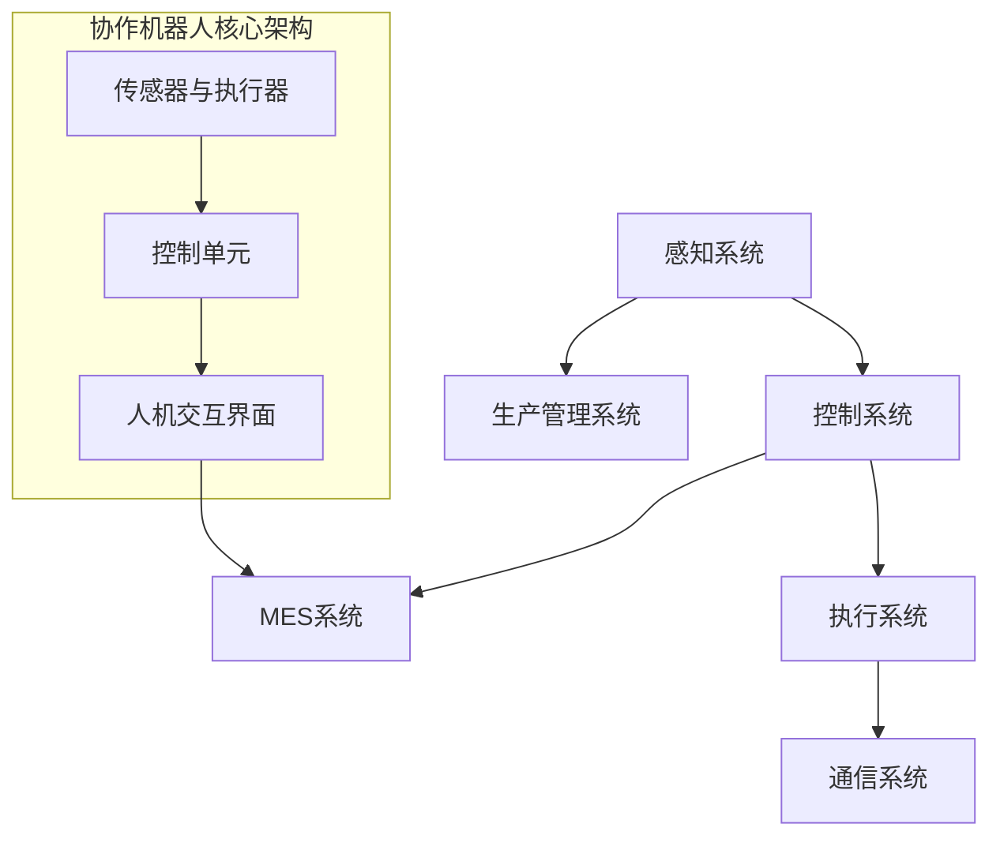

                 

### 文章标题

《协作机器人在制造业的未来趋势》

### 关键词

协作机器人、制造业、智能制造、未来趋势、技术发展、应用案例

### 摘要

本文详细探讨了协作机器人在制造业中的未来趋势。通过背景介绍、核心概念与联系、算法原理讲解、数学模型和公式、项目实战等环节，本文旨在全面解析协作机器人在制造业中的应用前景、技术挑战及其未来发展方向。文章首先阐述了协作机器人的定义与特点，随后介绍了其在制造业中的关键应用场景。接着，文章深入探讨了智能制造与协作机器人的关系，并分析了当前协作机器人的技术发展现状与未来趋势。通过具体的应用案例和实战项目，本文揭示了协作机器人在制造业中的实际应用效果，为读者提供了宝贵的实践经验。最后，文章提出了协作机器人在制造业中的最佳实践策略和未来展望，为行业从业者提供了有益的参考。

## 第1章：协作机器人的定义与特点

### 1.1 协作机器人的概念

协作机器人，通常被称为协作机器人系统（Collaborative Robot Systems，简称Cobot），是一种设计用于与人类工作人员安全、高效协作的机器人。与传统的工业机器人不同，协作机器人具有更小巧的尺寸、更高的灵活性和更好的交互性。它们通常具备以下特点：

1. **安全性**：协作机器人通过感知技术（如传感器、视觉系统）来检测人类工作人员的存在，并能够自动调整其操作以避免碰撞。
2. **灵活性**：协作机器人通常具备快速、灵活的部署能力，能够适应不同的工作环境和任务需求。
3. **人机协作**：协作机器人与人类工作人员能够协同工作，提高生产效率和产品质量。

### 1.2 协作机器人与传统机器人的区别

传统工业机器人通常用于重复性、高强度和有害环境下的工作，而协作机器人则更加注重与人类工作人员的安全协作和灵活应用。以下是两者之间的主要区别：

1. **安全标准**：协作机器人必须遵循更严格的安全标准，如ISO/TS 15066（旧版ISO 10218-1），以确保与人类工作人员的安全互动。
2. **环境适应性**：协作机器人设计用于在人类工作环境中操作，而传统机器人通常在封闭或隔离的工厂环境中使用。
3. **交互方式**：协作机器人能够通过视觉、听觉和触觉等多种方式与人类工作人员进行交互，而传统机器人则主要依赖于编程指令。

### 1.3 协作机器人在制造业中的应用前景

协作机器人正逐渐成为制造业的重要角色，它们的应用前景广泛，包括但不限于以下几个方面：

1. **装配与组装**：协作机器人可以协助完成复杂、精细的装配任务，如电子产品的组装。
2. **检测与质量控制**：协作机器人可以与人类工作人员一起进行质量检测，提高检测效率和准确性。
3. **搬运与物流**：协作机器人能够承担搬运、包装和物流等任务，提高生产线的效率和灵活性。
4. **服务与维护**：协作机器人可以协助进行设备的维护和修理，降低人力成本。

协作机器人在制造业中的应用不仅提高了生产效率，还促进了人机协作，使制造业更加智能化和自动化。随着技术的不断进步，协作机器人在制造业中的应用前景将更加广阔。

## 核心概念与联系

### 协作机器人技术架构

协作机器人的技术架构通常包括以下几个关键组成部分：

1. **感知系统**：感知系统是协作机器人的核心，它负责检测周围环境，包括人类工作人员的位置和动作。常见的感知技术包括视觉系统、激光雷达、超声波传感器等。

2. **控制系统**：控制系统负责根据感知系统提供的信息来调整机器人的操作，确保其能够安全、高效地与人类工作人员协作。

3. **执行系统**：执行系统包括机器人的机械臂和执行器，它们负责完成具体的任务操作，如装配、搬运和检测等。

4. **通信系统**：协作机器人需要与生产管理系统、MES（制造执行系统）等系统集成，以实现信息的共享和协同作业。

### Mermaid 流程图

为了更好地展示协作机器人的技术架构，我们可以使用Mermaid语言绘制一个流程图：



### 算法原理讲解

协作机器人需要依赖多种算法来实现其功能，以下是一个简单的算法原理讲解：

1. **碰撞检测算法**：通过感知系统获取的环境信息，机器人需要判断其动作是否会导致与人类工作人员的碰撞。常用的碰撞检测算法包括基于几何的碰撞检测（如AABB树）和基于物理的碰撞检测（如刚体动力学模拟）。

2. **路径规划算法**：为了高效完成任务，协作机器人需要规划出一条避障且最优的路径。常用的路径规划算法包括A*算法、Dijkstra算法和RRT（快速随机树）算法。

3. **运动控制算法**：执行系统需要根据控制系统的指令，实现精确的运动控制。常用的运动控制算法包括PID控制、轨迹规划和逆运动学。

### 伪代码

以下是一个简单的伪代码示例，用于描述路径规划算法的基本框架：

```pseudo
function PathPlanning(start, goal, obstacles):
    openSet = {start}
    cameFrom = {}
    gScore = {start: 0}
    fScore = {start: heuristic(start, goal)}

    while not openSet is empty:
        current = node with the lowest fScore in openSet
        if current == goal:
            return reconstruct_path(cameFrom, current)

        openSet.remove(current)
        openSet.add(neighbors(current))

        for neighbor in neighbors(current):
            tentative_gScore = gScore[current] + distance(current, neighbor)
            if tentative_gScore < gScore[neighbor]:
                cameFrom[neighbor] = current
                gScore[neighbor] = tentative_gScore
                fScore[neighbor] = gScore[neighbor] + heuristic(neighbor, goal)

    return failure
```

### 数学模型和公式

在协作机器人技术中，数学模型和公式广泛应用于路径规划、碰撞检测和运动控制等方面。以下是一些常见的数学模型和公式：

1. **欧几里得距离**：用于计算两点之间的直线距离。

   $$
   d = \sqrt{(x_2 - x_1)^2 + (y_2 - y_1)^2}
   $$

2. **曼哈顿距离**：用于计算两点之间的水平距离和垂直距离之和。

   $$
   d = |x_2 - x_1| + |y_2 - y_1|
   $$

3. **Heuristic函数**：用于估计从当前节点到目标节点的距离。

   $$
   heuristic(node, goal) = distance(node, goal)
   $$

4. **PID控制公式**：用于计算控制系统的输出值。

   $$
   output = K_p \cdot (setpoint - processVariable) + K_i \cdot \int(setpoint - processVariable)dt + K_d \cdot \frac{d(setpoint - processVariable)dt}
   $$

### 详细讲解和举例说明

为了更好地理解上述数学模型和公式，我们可以通过具体的例子进行讲解。

**例1：欧几里得距离**

假设有两个点A（1，2）和B（4，6），我们可以使用欧几里得距离公式计算它们之间的距离：

$$
d = \sqrt{(4 - 1)^2 + (6 - 2)^2} = \sqrt{3^2 + 4^2} = \sqrt{9 + 16} = \sqrt{25} = 5
$$

**例2：曼哈顿距离**

同样使用点A（1，2）和B（4，6），计算它们之间的曼哈顿距离：

$$
d = |4 - 1| + |6 - 2| = 3 + 4 = 7
$$

**例3：PID控制**

假设我们有一个加热系统，目标温度为100℃，当前温度为90℃，控制器的比例（K_p）、积分（K_i）和微分（K_d）分别为1、0.1和0.05。我们可以使用PID控制公式计算控制器的输出值：

$$
output = 1 \cdot (100 - 90) + 0.1 \cdot \int(100 - 90)dt + 0.05 \cdot \frac{d(100 - 90)dt}
$$

由于积分项和微分项在短时间内变化较小，我们可以将其近似为0，因此：

$$
output = 1 \cdot (100 - 90) = 10
$$

这意味着控制器将输出10单位的加热量，使系统温度上升。

### 总结

通过上述讲解，我们了解了协作机器人的核心概念、技术架构、算法原理、数学模型和具体应用。这些知识为我们深入理解协作机器人在制造业中的应用奠定了基础。在下一章节中，我们将进一步探讨协作机器人在制造业中的具体应用场景。

## 第2章：协作机器人技术基础

### 2.1 机器人的基本组成

协作机器人的基本组成包括传感器、执行器、控制系统和通信系统等核心部分。以下是每个组成部分的详细解释：

1. **传感器**：传感器是协作机器人的感知系统，用于获取周围环境的信息。常见的传感器包括视觉传感器、激光雷达、超声波传感器、力传感器等。视觉传感器可以识别物体的颜色、形状和位置；激光雷达用于测量距离和构建环境模型；超声波传感器可以检测物体的距离；力传感器用于感知机器人的操作力度和方向。

2. **执行器**：执行器是协作机器人的执行系统，负责将控制系统的指令转换为机械动作。常见的执行器包括电机、液压缸和气压缸等。电机可以通过电信号控制速度和方向；液压缸和气压缸则用于提供较大的力量和位移。

3. **控制系统**：控制系统是协作机器人的核心，负责处理传感器获取的信息，并生成执行器的控制信号。控制系统通常包括微处理器、嵌入式控制器或工业计算机。控制系统需要进行数据处理、算法运算和实时控制，确保机器人能够安全、高效地执行任务。

4. **通信系统**：通信系统使协作机器人能够与外部设备、网络和控制系统进行数据交换。常见的通信技术包括Wi-Fi、蓝牙、以太网和无线传感器网络（WSN）等。通信系统确保了机器人的信息实时更新和协调操作。

### 2.2 传感器与执行器技术

传感器与执行器技术是协作机器人的关键技术，直接影响机器人的性能和应用效果。以下是这些技术的详细介绍：

1. **传感器技术**：

   - **视觉传感器**：视觉传感器通过图像处理算法，可以识别和跟踪物体，实现物体检测、识别和分类等功能。常见的视觉传感器包括单目摄像头、双目摄像头和立体摄像头。

   - **激光雷达**：激光雷达通过发射激光束并测量反射时间，可以精确测量周围环境的距离和形状。激光雷达广泛应用于路径规划、避障和环境建模等。

   - **超声波传感器**：超声波传感器通过发射超声波并接收反射波，可以测量物体的距离。超声波传感器具有低成本、高可靠性的特点，广泛应用于工业检测和自动化设备。

   - **力传感器**：力传感器可以感知机器人的操作力度和方向，用于机器人精密操作和质量控制。

2. **执行器技术**：

   - **电机**：电机是执行器的核心，可以通过电信号控制速度和方向。常见的电机包括直流电机、步进电机和伺服电机。直流电机具有高转矩和低噪声的特点；步进电机可以精确控制位置和速度；伺服电机可以实现高精度的运动控制。

   - **液压缸**：液压缸利用液体压力提供较大的力量和位移，常用于重载搬运和机械臂操作。

   - **气压缸**：气压缸利用气体压力提供力量和位移，具有快速响应、高效的特点，广泛应用于气动执行系统。

### 2.3 控制系统与通信协议

控制系统是协作机器人的大脑，负责处理传感器数据、执行控制算法和驱动执行器。以下是控制系统和通信协议的详细介绍：

1. **控制系统**：

   - **嵌入式控制器**：嵌入式控制器是一种集成度高、功耗低的处理器，常用于协作机器人的实时控制和数据处理。

   - **工业计算机**：工业计算机具有强大的计算能力和扩展性，适用于复杂任务和长时间运行的应用。

   - **实时操作系统（RTOS）**：RTOS是专为实时应用设计的操作系统，能够确保机器人系统的实时性和稳定性。

2. **通信协议**：

   - **Wi-Fi**：Wi-Fi是一种无线通信协议，可以实现高速数据传输，适用于远程控制和监控。

   - **蓝牙**：蓝牙是一种低功耗无线通信协议，适用于短距离通信和设备互联。

   - **以太网**：以太网是一种高速有线通信协议，适用于大型工厂和复杂系统的网络通信。

   - **无线传感器网络（WSN）**：WSN是一种分布式无线通信网络，适用于大量传感器和机器人的通信。

### 核心算法原理讲解

协作机器人依赖于多种核心算法来实现其功能，以下是这些算法的原理讲解：

1. **路径规划算法**：

   路径规划算法用于确定从起点到终点的最优路径。常用的路径规划算法包括A*算法、Dijkstra算法和RRT（快速随机树）算法。

   - **A*算法**：A*算法是一种启发式搜索算法，通过评估函数f(n) = g(n) + h(n)（g(n)为从起点到当前点的代价，h(n)为从当前点到终点的估算代价）来寻找最优路径。
   
   - **Dijkstra算法**：Dijkstra算法是一种基于距离的最短路径算法，适用于无权图。
   
   - **RRT算法**：RRT算法是一种基于随机采样的路径规划算法，适用于高维和动态环境。

2. **碰撞检测算法**：

   碰撞检测算法用于判断机器人是否与其他物体或障碍物发生碰撞。常用的碰撞检测算法包括基于几何的碰撞检测（如AABB树）和基于物理的碰撞检测（如刚体动力学模拟）。

   - **AABB树**：AABB树是一种基于轴对齐包围盒的碰撞检测算法，通过构建多层次的包围盒来加速碰撞检测。
   
   - **刚体动力学模拟**：刚体动力学模拟通过物理公式模拟机器人的运动，判断是否发生碰撞。

3. **运动控制算法**：

   运动控制算法用于实现机器人的精确运动控制。常用的运动控制算法包括PID控制、轨迹规划和逆运动学。

   - **PID控制**：PID控制是一种经典的控制算法，通过比例（P）、积分（I）和微分（D）三个参数调整控制输出，实现系统的稳定控制。
   
   - **轨迹规划**：轨迹规划通过计算空间曲线或曲线族，使机器人沿着规划的路径运动。
   
   - **逆运动学**：逆运动学用于计算从目标位置和姿态到机器人关节角度的映射，实现精确的运动控制。

### 伪代码

以下是路径规划算法（A*算法）的伪代码示例：

```pseudo
function AStar(start, goal, obstacles):
    openSet = {start}
    cameFrom = {}
    gScore = {start: 0}
    fScore = {start: heuristic(start, goal)}

    while not openSet is empty:
        current = node with the lowest fScore in openSet
        if current == goal:
            return reconstruct_path(cameFrom, current)

        openSet.remove(current)
        openSet.add(neighbors(current))

        for neighbor in neighbors(current):
            tentative_gScore = gScore[current] + distance(current, neighbor)
            if tentative_gScore < gScore[neighbor]:
                cameFrom[neighbor] = current
                gScore[neighbor] = tentative_gScore
                fScore[neighbor] = gScore[neighbor] + heuristic(neighbor, goal)

    return failure
```

### 数学模型和公式

以下是协作机器人中常用的数学模型和公式：

1. **欧几里得距离**：用于计算两点之间的直线距离。
   $$
   d = \sqrt{(x_2 - x_1)^2 + (y_2 - y_1)^2}
   $$

2. **曼哈顿距离**：用于计算两点之间的水平距离和垂直距离之和。
   $$
   d = |x_2 - x_1| + |y_2 - y_1|
   $$

3. **Heuristic函数**：用于估计从当前节点到目标节点的距离。
   $$
   heuristic(node, goal) = distance(node, goal)
   $$

4. **PID控制公式**：用于计算控制系统的输出值。
   $$
   output = K_p \cdot (setpoint - processVariable) + K_i \cdot \int(setpoint - processVariable)dt + K_d \cdot \frac{d(setpoint - processVariable)dt}
   $$

### 详细讲解和举例说明

**例1：欧几里得距离**

假设有两个点A（1，2）和B（4，6），计算它们之间的欧几里得距离：

$$
d = \sqrt{(4 - 1)^2 + (6 - 2)^2} = \sqrt{3^2 + 4^2} = \sqrt{9 + 16} = \sqrt{25} = 5
$$

**例2：曼哈顿距离**

使用点A（1，2）和B（4，6），计算它们之间的曼哈顿距离：

$$
d = |4 - 1| + |6 - 2| = 3 + 4 = 7
$$

**例3：PID控制**

假设我们有一个加热系统，目标温度为100℃，当前温度为90℃，控制器的比例（K_p）、积分（K_i）和微分（K_d）分别为1、0.1和0.05。我们可以使用PID控制公式计算控制器的输出值：

$$
output = 1 \cdot (100 - 90) + 0.1 \cdot \int(100 - 90)dt + 0.05 \cdot \frac{d(100 - 90)dt}
$$

由于积分项和微分项在短时间内变化较小，我们可以将其近似为0，因此：

$$
output = 1 \cdot (100 - 90) = 10
$$

这意味着控制器将输出10单位的加热量，使系统温度上升。

### 总结

本章详细介绍了协作机器人的基本组成、传感器与执行器技术、控制系统与通信协议以及核心算法原理。通过理解这些技术基础，读者可以更好地把握协作机器人的工作原理和应用场景。在下一章中，我们将探讨协作机器人在制造业中的应用场景，进一步揭示其在实际生产中的价值。

## 第3章：协作机器人在制造业中的应用

### 3.1 协作机器人在生产过程中的应用

协作机器人在生产过程中的应用日益广泛，能够显著提高生产效率、降低成本并提升产品质量。以下是协作机器人在生产过程中的一些关键应用场景：

1. **装配与组装**：

   协作机器人可以协助完成各种装配和组装任务，如电子设备的装配、汽车零部件的组装等。通过视觉系统和精密控制，协作机器人能够识别和抓取不同形状和尺寸的组件，实现高效、精确的装配。例如，在某些汽车制造厂，协作机器人用于装配发动机舱盖和车窗玻璃，大大提高了装配速度和一致性。

2. **焊接与加工**：

   协作机器人可以应用于焊接、切割和金属加工等领域。通过配备焊接机器人头和切割工具，协作机器人可以实现自动化焊接和切割操作，提高加工质量和效率。例如，在航空制造业中，协作机器人用于焊接飞机机身结构，确保焊接质量和精度。

3. **检测与质量控制**：

   协作机器人可以通过传感器和视觉系统进行产品质量检测，如检测产品的尺寸、形状和表面缺陷。通过实时监测和反馈，协作机器人可以及时纠正生产过程中的偏差，提高产品质量。例如，在电子制造业中，协作机器人用于检测电子元器件的焊接质量和外观缺陷，确保产品质量。

4. **包装与搬运**：

   协作机器人可以应用于包装和搬运任务，如将产品从生产线搬运到仓库、包装产品等。通过灵活的机械结构和精确的控制，协作机器人可以适应不同的搬运和包装需求。例如，在食品加工行业，协作机器人用于搬运和包装新鲜食品，确保食品的安全和质量。

### 3.2 协作机器人在物流与仓储中的应用

协作机器人在物流与仓储领域同样展现出强大的应用潜力，能够提高物流效率、优化仓储管理。以下是协作机器人在物流与仓储中的几个关键应用场景：

1. **搬运与分拣**：

   协作机器人可以应用于仓库内部的搬运和分拣任务，如将货物从入库区域搬运到存储区域、将订单商品从仓库中分拣出来。通过视觉系统和导航算法，协作机器人可以识别和抓取不同形状和大小的货物，实现自动化搬运和分拣。例如，在一些大型电商仓库，协作机器人用于搬运和分拣商品，提高了订单处理速度和准确性。

2. **货架整理与盘点**：

   协作机器人可以协助进行货架整理和库存盘点，通过传感器和导航系统，自动识别货架和货物，并进行整理和盘点。例如，在一些仓储物流中心，协作机器人用于整理货架和盘点库存，提高了仓库管理的效率和准确性。

3. **运输与配送**：

   协作机器人可以应用于运输和配送任务，如将货物从仓库运输到配送中心、将订单商品配送到客户手中。通过自动驾驶技术和路径规划算法，协作机器人可以实现高效、可靠的运输和配送服务。例如，在一些城市配送中心，协作机器人用于运输和配送商品，提高了配送效率和客户满意度。

### 3.3 协作机器人在服务中的应用

协作机器人在服务领域也有广泛的应用，能够提高服务效率、改善用户体验。以下是协作机器人在服务中的几个关键应用场景：

1. **客户服务与咨询**：

   协作机器人可以应用于客户服务场景，如银行、商场和酒店等。通过自然语言处理和语音识别技术，协作机器人可以与客户进行互动，提供咨询服务和解答问题。例如，在一些商场，协作机器人用于提供导购服务和回答客户问题，提高了服务质量和客户满意度。

2. **医疗与健康护理**：

   协作机器人可以应用于医疗和健康护理场景，如辅助医生进行手术、协助患者进行康复训练等。通过精密控制和传感器技术，协作机器人可以提供高效、精确的医疗操作和护理服务。例如，在一些医院，协作机器人用于辅助医生进行微创手术和康复训练，提高了医疗质量和患者满意度。

3. **教育辅助与互动**：

   协作机器人可以应用于教育场景，如学校、培训机构和在线教育等。通过编程和互动技术，协作机器人可以辅助教师进行教学，提高学生的学习兴趣和参与度。例如，在一些学校，协作机器人用于进行编程教学和互动活动，提高了学生的学习效果和兴趣。

### 核心算法原理讲解

协作机器人在不同应用场景中需要依赖多种核心算法来实现其功能，以下是这些算法的原理讲解：

1. **路径规划算法**：

   路径规划算法用于确定从起点到终点的最优路径。常用的路径规划算法包括A*算法、Dijkstra算法和RRT（快速随机树）算法。

   - **A*算法**：A*算法是一种启发式搜索算法，通过评估函数f(n) = g(n) + h(n)（g(n)为从起点到当前点的代价，h(n)为从当前点到终点的估算代价）来寻找最优路径。
   
   - **Dijkstra算法**：Dijkstra算法是一种基于距离的最短路径算法，适用于无权图。
   
   - **RRT算法**：RRT算法是一种基于随机采样的路径规划算法，适用于高维和动态环境。

2. **碰撞检测算法**：

   碰撞检测算法用于判断机器人是否与其他物体或障碍物发生碰撞。常用的碰撞检测算法包括基于几何的碰撞检测（如AABB树）和基于物理的碰撞检测（如刚体动力学模拟）。

   - **AABB树**：AABB树是一种基于轴对齐包围盒的碰撞检测算法，通过构建多层次的包围盒来加速碰撞检测。
   
   - **刚体动力学模拟**：刚体动力学模拟通过物理公式模拟机器人的运动，判断是否发生碰撞。

3. **运动控制算法**：

   运动控制算法用于实现机器人的精确运动控制。常用的运动控制算法包括PID控制、轨迹规划和逆运动学。

   - **PID控制**：PID控制是一种经典的控制算法，通过比例（P）、积分（I）和微分（D）三个参数调整控制输出，实现系统的稳定控制。
   
   - **轨迹规划**：轨迹规划通过计算空间曲线或曲线族，使机器人沿着规划的路径运动。
   
   - **逆运动学**：逆运动学用于计算从目标位置和姿态到机器人关节角度的映射，实现精确的运动控制。

### 伪代码

以下是路径规划算法（A*算法）的伪代码示例：

```pseudo
function AStar(start, goal, obstacles):
    openSet = {start}
    cameFrom = {}
    gScore = {start: 0}
    fScore = {start: heuristic(start, goal)}

    while not openSet is empty:
        current = node with the lowest fScore in openSet
        if current == goal:
            return reconstruct_path(cameFrom, current)

        openSet.remove(current)
        openSet.add(neighbors(current))

        for neighbor in neighbors(current):
            tentative_gScore = gScore[current] + distance(current, neighbor)
            if tentative_gScore < gScore[neighbor]:
                cameFrom[neighbor] = current
                gScore[neighbor] = tentative_gScore
                fScore[neighbor] = gScore[neighbor] + heuristic(neighbor, goal)

    return failure
```

### 数学模型和公式

以下是协作机器人中常用的数学模型和公式：

1. **欧几里得距离**：用于计算两点之间的直线距离。
   $$
   d = \sqrt{(x_2 - x_1)^2 + (y_2 - y_1)^2}
   $$

2. **曼哈顿距离**：用于计算两点之间的水平距离和垂直距离之和。
   $$
   d = |x_2 - x_1| + |y_2 - y_1|
   $$

3. **Heuristic函数**：用于估计从当前节点到目标节点的距离。
   $$
   heuristic(node, goal) = distance(node, goal)
   $$

4. **PID控制公式**：用于计算控制系统的输出值。
   $$
   output = K_p \cdot (setpoint - processVariable) + K_i \cdot \int(setpoint - processVariable)dt + K_d \cdot \frac{d(setpoint - processVariable)dt}
   $$

### 详细讲解和举例说明

**例1：欧几里得距离**

假设有两个点A（1，2）和B（4，6），计算它们之间的欧几里得距离：

$$
d = \sqrt{(4 - 1)^2 + (6 - 2)^2} = \sqrt{3^2 + 4^2} = \sqrt{9 + 16} = \sqrt{25} = 5
$$

**例2：曼哈顿距离**

使用点A（1，2）和B（4，6），计算它们之间的曼哈顿距离：

$$
d = |4 - 1| + |6 - 2| = 3 + 4 = 7
$$

**例3：PID控制**

假设我们有一个加热系统，目标温度为100℃，当前温度为90℃，控制器的比例（K_p）、积分（K_i）和微分（K_d）分别为1、0.1和0.05。我们可以使用PID控制公式计算控制器的输出值：

$$
output = 1 \cdot (100 - 90) + 0.1 \cdot \int(100 - 90)dt + 0.05 \cdot \frac{d(100 - 90)dt}
$$

由于积分项和微分项在短时间内变化较小，我们可以将其近似为0，因此：

$$
output = 1 \cdot (100 - 90) = 10
$$

这意味着控制器将输出10单位的加热量，使系统温度上升。

### 总结

本章详细介绍了协作机器人在制造业、物流与仓储以及服务领域中的应用场景。通过理解这些应用场景，读者可以更好地了解协作机器人在实际生产、物流和服务中的价值。在下一章中，我们将探讨智能制造与协作机器人的关系，进一步揭示协作机器人在智能制造中的重要作用。

## 第4章：协作机器人与智能制造

### 4.1 智能制造的概念与架构

智能制造是工业4.0的重要组成部分，是一种基于数字技术、人工智能和自动化技术的现代制造模式。智能制造通过将信息技术、制造技术和生产过程深度融合，实现生产过程的自动化、智能化和高效化。智能制造的架构主要包括以下几个方面：

1. **感知层**：感知层是智能制造的基础，通过传感器、RFID等设备实现对生产过程和设备的实时数据采集和监测。感知层的数据为决策层提供重要的基础信息。

2. **传输层**：传输层负责将感知层采集到的数据传输到中央处理平台。传输层通常采用工业互联网技术，如Wi-Fi、5G、物联网等，实现高效、可靠的数据传输。

3. **平台层**：平台层是智能制造的核心，通过工业互联网平台、云计算平台等，对感知层传输来的数据进行处理、分析和存储。平台层为决策层提供决策支持和业务应用。

4. **决策层**：决策层是智能制造的指挥中心，通过对平台层提供的数据进行分析和处理，实现生产过程的优化和智能化决策。决策层包括生产计划、质量控制、设备维护等多个方面。

5. **执行层**：执行层是智能制造的执行层，通过自动化设备和控制系统，实现生产过程的自动化和智能化。执行层包括机器人、自动化设备、执行系统等。

### 4.2 协作机器人在智能制造中的作用

协作机器人在智能制造中扮演着重要角色，其应用涵盖了感知层、传输层、平台层和执行层等多个层次，为智能制造提供了强大的技术支持。以下是协作机器人在智能制造中的具体作用：

1. **感知层**：协作机器人通过传感器和视觉系统，对生产环境和工作区域进行实时监测，采集生产数据和质量信息。例如，通过视觉系统，协作机器人可以实时检测产品的外观缺陷和质量问题，为决策层提供准确的数据支持。

2. **传输层**：协作机器人通过无线通信模块，将感知到的数据传输到中央处理平台。协作机器人的传输速度快、可靠性高，可以确保数据实时性和准确性。

3. **平台层**：协作机器人通过与工业互联网平台和云计算平台的集成，实现数据的集中处理和分析。协作机器人可以接入MES（制造执行系统）、ERP（企业资源计划）等系统，实现生产过程的协同和智能化。

4. **执行层**：协作机器人在执行层中发挥关键作用，通过自动化操作和精确控制，实现生产过程的自动化和高效化。协作机器人可以协助完成装配、焊接、搬运、检测等任务，提高生产效率和产品质量。

### 4.3 协作机器人与智能制造的未来趋势

随着人工智能、物联网、大数据等技术的发展，协作机器人在智能制造中的应用前景将更加广阔。以下是协作机器人与智能制造的一些未来趋势：

1. **更加智能化**：未来的协作机器人将更加智能化，具备更高的自主决策和自适应能力。通过深度学习和人工智能技术，协作机器人可以更好地理解人类的行为和意图，实现更加自然的协作。

2. **更加灵活**：未来的协作机器人将具备更高的灵活性和适应性，可以应对不同的生产任务和复杂环境。协作机器人将能够根据实际需求进行快速调整和部署，实现生产过程的灵活性和高效化。

3. **更加安全**：随着技术的进步，协作机器人将更加注重安全性和人机协作。未来的协作机器人将通过更先进的感知技术和控制算法，实现更安全、可靠的人机协作。

4. **更加集成**：未来的协作机器人将更加紧密地集成到智能制造体系中，实现与感知层、传输层、平台层和执行层的深度整合。协作机器人将与其他自动化设备、物联网设备等实现无缝连接，构建更加智能、高效的智能制造体系。

### 总结

本章详细探讨了智能制造的概念与架构，以及协作机器人在智能制造中的作用和未来趋势。通过理解智能制造和协作机器人的关系，读者可以更好地把握智能制造的发展方向和协作机器人在其中的重要作用。在下一章中，我们将分析当前协作机器人的技术发展现状，探讨其在实际应用中的挑战和机遇。

## 第5章：协作机器人的发展现状与趋势

### 5.1 协作机器人的发展历程

协作机器人（Cobots）的发展可以追溯到20世纪90年代。最初，协作机器人主要应用于实验室和科研机构，用于与人类研究人员进行安全协作。随着技术的进步，特别是在传感器、控制系统和人工智能领域的突破，协作机器人逐渐进入工业生产领域。

1. **1990年代**：早期的协作机器人主要依靠机械结构和传感器技术，实现与人类工作人员的初步协作。这一时期的代表性产品是瑞典ABB公司推出的IRB 6400，它具有基本的碰撞检测和视觉系统。

2. **2000年代**：随着计算机视觉和机器学习技术的发展，协作机器人的感知能力和智能化水平显著提高。这一时期的标志性事件是德国KUKA公司推出的KR AGILUS，它具备高灵活性和强大的感知能力。

3. **2010年代**：协作机器人市场迅速扩展，各大机器人制造商纷纷推出新一代协作机器人。这一时期的代表性产品包括瑞士Aruco公司推出的ARCOBO和日本FANUC公司推出的CR-35iA。这些协作机器人具备更先进的感知技术和更高的人机协作安全性。

4. **2020年代**：随着人工智能、物联网和云计算等技术的深度融合，协作机器人的智能化和互联互通能力大幅提升。这一时期的代表性产品包括美国Rethink Robotics公司推出的Sawyer和Universal Robots公司推出的e-series，它们具备高度灵活的编程能力和自适应能力。

### 5.2 当前协作机器人的技术水平

当前，协作机器人的技术水平已经取得了显著进步，主要体现在以下几个方面：

1. **感知技术**：协作机器人配备了先进的传感器，包括3D摄像头、激光雷达、超声波传感器和力传感器等，能够实现对周围环境的精确感知和实时监测。

2. **控制系统**：协作机器人采用了高性能的嵌入式控制器和实时操作系统，能够快速处理感知数据并生成控制指令，实现高效、精确的运动控制。

3. **人工智能**：通过深度学习、机器学习和计算机视觉等技术，协作机器人具备了一定的智能决策和自适应能力。例如，它们可以识别不同的工件、调整操作策略以适应变化的环境。

4. **安全性能**：协作机器人遵循了严格的国际安全标准，如ISO/TS 15066，能够通过物理和软件手段确保与人类工作人员的安全协作。

5. **互联互通**：协作机器人可以通过Wi-Fi、5G、蓝牙等无线通信技术，实现与工业互联网平台、MES系统和ERP系统的集成，实现生产数据的实时传输和协同作业。

### 5.3 协作机器人的未来发展趋势

随着技术的不断进步，协作机器人在未来将继续朝着更加智能化、灵活化和安全化的方向发展。以下是协作机器人的几个未来发展趋势：

1. **更高级的感知和决策能力**：未来的协作机器人将配备更先进的传感器和更强大的计算能力，实现更高精度、更高动态范围的感知和决策能力。通过深度学习和计算机视觉，协作机器人将能够更好地理解和适应复杂的生产环境。

2. **更高的安全性能**：未来的协作机器人将采用更加先进的碰撞检测和避障技术，确保在极端情况下仍然能够安全地与人类工作人员协作。此外，协作机器人还将实现更多的安全认证，以满足更加严格的工业安全标准。

3. **更加灵活的编程和操作**：未来的协作机器人将具备更加灵活的编程接口和操作方式，使非专业人士也能够轻松编程和操作机器人。例如，通过图形化界面、语音指令和触摸屏等，用户可以更直观地与协作机器人进行交互。

4. **更广泛的互联互通**：未来的协作机器人将更加紧密地集成到工业互联网和物联网中，实现与各种设备和系统的无缝连接。通过云计算和大数据技术，协作机器人将能够实现远程监控、预测维护和智能化调度，提高生产效率和灵活性。

5. **更广泛的应用领域**：随着技术的成熟，协作机器人的应用领域将不断扩展，从制造业扩展到服务业、医疗保健、物流和农业等领域。协作机器人将能够更好地满足各种行业的需求，实现全面的智能化和自动化。

### 总结

本章详细探讨了协作机器人从诞生至今的发展历程、当前的技术水平以及未来的发展趋势。通过了解协作机器人的发展历程和现状，读者可以更好地把握协作机器人在未来工业和技术中的应用前景。在下一章中，我们将探讨协作机器人面临的挑战与机遇，分析其在实际应用中的优势和挑战。

## 第6章：协作机器人的挑战与机遇

### 6.1 协作机器人面临的挑战

尽管协作机器人在制造业和其他领域展现出了巨大的潜力，但在实际应用过程中仍面临诸多挑战：

1. **技术成熟度**：虽然协作机器人的技术水平已经取得了显著进步，但与传统的工业机器人相比，仍存在一定的技术差距。例如，在感知精度、控制算法和自适应能力方面，协作机器人仍有待提高。

2. **安全性**：协作机器人需要确保在人类工作环境中与人类工作人员的安全协作。尽管现有的安全标准和碰撞检测技术能够提供一定的保障，但在极端情况下，仍可能发生意外碰撞和事故。

3. **系统集成**：协作机器人需要与现有生产线、传感器和控制系统等进行集成，以实现高效的协同作业。然而，不同的系统和设备可能采用不同的通信协议和接口标准，导致系统集成复杂且成本较高。

4. **人才培养**：协作机器人的应用需要专业的操作、编程和维护人员。然而，当前市场上具备协作机器人相关技能的人才相对较少，导致企业难以快速应用和推广协作机器人。

5. **成本问题**：尽管协作机器人具有较高的灵活性和适应性，但其采购和维护成本较高，对中小企业来说，可能难以承担。

### 6.2 协作机器人的机遇

尽管协作机器人面临诸多挑战，但同时也蕴含着巨大的机遇：

1. **市场需求**：随着智能制造和工业自动化的推进，制造业对协作机器人的需求不断增加。特别是在劳动力成本上升的背景下，协作机器人具有明显的成本优势和应用前景。

2. **技术创新**：随着人工智能、物联网、云计算等技术的不断发展，协作机器人的感知能力、智能化水平和系统集成能力将不断提升，为实际应用提供更强的技术支持。

3. **政策支持**：许多国家和地区纷纷出台政策，支持智能制造和工业自动化的发展。这些政策为协作机器人的推广和应用提供了良好的外部环境。

4. **跨界融合**：协作机器人的应用不仅局限于制造业，还可以扩展到服务业、医疗保健、物流和农业等领域。随着不同行业对自动化和智能化的需求不断增加，协作机器人的应用领域将更加广泛。

5. **人才发展**：随着协作机器人的普及，相关人才需求将大幅增加。通过职业培训和教育体系的改革，将培养出更多具备协作机器人相关技能的专业人才。

### 6.3 应对挑战与抓住机遇的策略

为了有效应对协作机器人面临的挑战，并抓住潜在的机遇，可以从以下几个方面进行策略制定：

1. **技术创新**：持续加大在感知技术、控制算法和人工智能等领域的研发投入，推动协作机器人技术的创新和突破。

2. **安全标准**：加强协作机器人的安全标准和认证体系，确保协作机器人能够在人类工作环境中安全、可靠地运行。

3. **系统集成**：推动标准化和开放接口的开发，简化协作机器人的系统集成，降低应用成本。

4. **人才培养**：通过校企合作、职业培训和在线教育等途径，培养更多具备协作机器人相关技能的专业人才。

5. **政策支持**：积极争取政策支持，如税收优惠、研发补贴等，为协作机器人的研发和应用提供有力支持。

6. **市场推广**：通过市场调研和需求分析，精准定位协作机器人的应用场景，制定有效的市场推广策略，提高协作机器人的市场渗透率。

### 总结

本章详细探讨了协作机器人面临的挑战和机遇，并提出了相应的应对策略。通过理解这些挑战和机遇，企业和研究机构可以更好地把握协作机器人在未来工业和技术中的应用前景，实现协作机器人的全面发展。

## 第7章：协作机器人在制造业的案例研究

### 7.1 案例一：协作机器人在汽车制造中的应用

汽车制造是一个高度自动化和精细化的行业，协作机器人的应用大大提高了生产效率和产品质量。以下是协作机器人在汽车制造中应用的三个具体案例：

1. **车身焊接**：

   在车身焊接过程中，协作机器人被用于完成车身结构的高精度焊接。例如，德国宝马公司的生产线中，采用了KUKA的KR AGILUS协作机器人进行车身焊接。这些机器人通过视觉系统识别焊接点，并精确调整焊接参数，实现了高质量、高效率的焊接。KR AGILUS机器人具备高速运动和高精度控制，能够在极短的时间内完成焊接任务，有效缩短了生产周期。

2. **零部件装配**：

   协作机器人在零部件装配过程中发挥着重要作用。以特斯拉的工厂为例，协作机器人用于组装电动汽车的动力系统。这些机器人通过视觉系统和力传感器，能够识别和抓取不同形状和大小的零部件，实现高效、准确的装配。例如，特斯拉的SPOT协作机器人能够快速调整姿态，适应不同的装配任务，提高了装配速度和一致性。

3. **涂装与检测**：

   协作机器人还在汽车涂装和检测环节中应用。例如，德国大众公司的涂装车间中，协作机器人用于喷涂车身涂层。这些机器人通过精确控制喷涂量和喷涂角度，实现了均匀、高质量的涂装。同时，协作机器人还用于检测车身表面缺陷，如划痕、斑点等。通过视觉系统和传感器，机器人能够快速识别缺陷，并提供相应的反馈，确保涂装质量。

### 7.2 案例二：协作机器人在电子制造中的应用

电子制造是一个高度复杂和精细的行业，协作机器人通过灵活的编程和精确的控制，在电子制造中发挥了重要作用。以下是协作机器人在电子制造中应用的两个具体案例：

1. **组装与检测**：

   在电子产品的组装过程中，协作机器人被用于完成各种组装任务，如焊接、安装、测试等。例如，苹果公司的生产线中，采用了Universal Robots的UR10协作机器人进行智能手机的组装。这些机器人通过视觉系统和精密控制，能够识别和抓取微小的电子元件，实现高效、准确的组装。UR10机器人配备了不同的工具和夹具，能够适应不同的组装任务，提高了生产效率和产品质量。

2. **测试与质量保证**：

   协作机器人还在电子产品的测试和质量保证过程中应用。例如，英特尔公司的工厂中，协作机器人用于测试和检测芯片的质量。这些机器人通过传感器和自动化测试系统，能够快速、准确地检测芯片的电气性能、外观质量等。通过实时监测和反馈，机器人能够及时识别和纠正潜在的质量问题，确保芯片的质量和可靠性。

### 7.3 案例三：协作机器人在食品加工中的应用

食品加工行业对生产效率和食品安全要求极高，协作机器人的应用在提高生产效率和保障食品安全方面发挥了重要作用。以下是协作机器人在食品加工中应用的三个具体案例：

1. **搬运与包装**：

   在食品加工过程中，协作机器人被用于搬运和包装各种食品。例如，雀巢公司的生产线中，采用了ABB的IRB 1200协作机器人进行糖果的搬运和包装。这些机器人通过视觉系统和自动化控制系统，能够识别和抓取不同形状和大小的糖果，实现高效、准确的搬运和包装。IRB 1200机器人具备高灵活性和高精度，能够在狭小的空间内操作，提高了生产效率和产品质量。

2. **检测与质量控制**：

   协作机器人还在食品检测和质量控制过程中应用。例如，丹麦的皇冠集团（Crown Group）的食品加工厂中，采用了协作机器人进行食品的质量检测。这些机器人通过传感器和检测系统，能够实时监测食品的外观、成分和安全性。通过实时监测和反馈，机器人能够及时识别和纠正潜在的质量问题，确保食品的质量和安全。

3. **食品加工与烹饪**：

   协作机器人还可以应用于食品加工和烹饪环节。例如，荷兰的Bonduelle公司采用了协作机器人进行蔬菜的切割和烹饪。这些机器人通过视觉系统和自动化控制系统，能够精确切割和烹饪蔬菜，实现高质量、高效率的食品加工。协作机器人不仅提高了生产效率和产品质量，还减少了人工操作的风险，确保了食品安全。

### 总结

本章通过三个具体的案例，详细介绍了协作机器人在汽车制造、电子制造和食品加工中的应用。这些案例展示了协作机器人如何通过灵活的编程和精确的控制，提高生产效率、保障产品质量和食品安全。通过这些案例，读者可以更好地理解协作机器人在制造业中的实际应用效果和价值。

## 第8章：协作机器人的未来展望

### 8.1 未来协作机器人的愿景

未来协作机器人将朝着更加智能化、自主化和人机协作的方向发展，成为制造业和其他领域中不可或缺的重要角色。以下是未来协作机器人的几个愿景：

1. **全场景智能化协作**：未来的协作机器人将能够在各种复杂、多变的生产环境中灵活运作，具备更高的感知、决策和自适应能力。它们将能够识别和理解人类的行为和意图，实现更加自然和高效的人机协作。

2. **自主学习和优化**：未来的协作机器人将具备自主学习能力，通过大数据和人工智能技术，从实际操作中不断学习和优化，提高其操作精度和效率。这些机器人将能够根据生产环境和任务需求，自主调整操作策略，实现最佳生产效果。

3. **高度安全的人机协作**：未来的协作机器人将采用更加先进的安全技术和设计理念，确保在人类工作环境中与人类工作人员的安全协作。它们将能够实时检测和预测潜在的安全风险，并采取相应的措施进行规避，保障人机协作的安全。

4. **高度集成和互联互通**：未来的协作机器人将实现与各种设备和系统的深度集成，通过物联网和云计算技术，实现生产数据的实时传输和协同作业。这些机器人将能够无缝融入智能制造体系，实现生产过程的智能化和高效化。

### 8.2 协作机器人与人类社会的深度融合

随着协作机器人技术的不断进步，它们将更加深入地融入人类社会，对各行各业产生深远影响。以下是协作机器人与人类社会的深度融合的几个方面：

1. **提高生产效率和产品质量**：协作机器人将通过高效、精准的操作，提高生产效率和产品质量。它们将能够在各种复杂的生产环境中替代人工操作，减少人为错误，确保产品的质量和一致性。

2. **优化人力资源配置**：协作机器人的应用将改变传统的生产模式，使人类工作人员从重复性、繁琐的工作中解放出来，专注于更加具有创造性和技术性的任务。这将优化人力资源配置，提高整体生产效率和经济效益。

3. **促进创新创业**：协作机器人将为创业者提供更多机会，激发创新创业活力。协作机器人技术的发展和应用将催生出大量的新兴产业和商业模式，为经济和社会发展注入新的动力。

4. **改善工作环境和条件**：协作机器人的应用将改善工作环境和条件，减少人类工作人员在恶劣环境下的工作强度和风险。协作机器人将能够承担更多的危险和繁重的工作，确保人类工作人员的安全和健康。

### 8.3 协作机器人对社会和经济的影响

协作机器人技术的发展将对社会和经济产生深远影响。以下是协作机器人对社会和经济影响的几个方面：

1. **劳动力市场变革**：协作机器人的广泛应用将改变劳动力市场结构，对劳动力需求产生影响。一方面，协作机器人将减少对传统蓝领劳动力的需求，另一方面，将增加对技能型劳动力，如编程、维护、监控和管理等领域的需求。

2. **产业升级和转型**：协作机器人将推动制造业和其他行业的产业升级和转型，促进智能化、数字化和绿色化发展。协作机器人的应用将提高产业竞争力和创新能力，推动经济高质量发展。

3. **经济增长**：协作机器人的广泛应用将带动相关产业链的发展，推动经济增长。从机器人的研发、制造到应用，各个环节都将创造大量的就业机会和经济效益，为经济增长提供强大动力。

4. **社会结构变革**：协作机器人技术的发展和应用将促进社会结构变革，推动社会形态向更加智能化、数字化和可持续化的方向发展。这将为人类社会带来更多的便利和福祉，提高生活质量和幸福感。

### 总结

本章从未来协作机器人的愿景、与人类社会的深度融合以及对社会和经济的影响等方面，全面探讨了协作机器人的未来发展。通过理解这些内容，读者可以更好地把握协作机器人技术的发展趋势，为未来的应用和发展做好准备。

## 最佳实践 Tips、小结、注意事项、拓展阅读

### 最佳实践 Tips

1. **安全性优先**：在部署协作机器人时，安全性应始终放在首位。确保机器人遵循严格的安全标准和认证，定期进行安全评估和测试。
2. **灵活部署**：选择能够快速调整和适应不同工作环境的协作机器人，以实现高效的生产流程和任务分配。
3. **系统集成**：选择支持多种通信协议和接口标准的协作机器人，以简化系统集成和降低应用成本。
4. **培训与支持**：为操作员和编程人员提供全面的培训和支持，确保他们能够熟练掌握协作机器人的操作和编程技巧。

### 小结

协作机器人通过其灵活的编程和精确的控制，在制造业、物流、服务业等多个领域展现了巨大的应用潜力。随着技术的不断进步，协作机器人的智能化和自主化水平将进一步提高，为未来的智能制造和工业自动化提供强大支持。

### 注意事项

1. **数据安全和隐私**：在使用协作机器人时，确保数据安全和隐私，防止敏感数据泄露。
2. **定期维护**：定期对协作机器人进行维护和保养，确保其稳定运行和高效性能。
3. **风险评估**：在引入协作机器人前，进行充分的风险评估，确保其符合企业的安全和生产需求。

### 拓展阅读

1. **《智能制造技术与应用》**：探讨智能制造技术的发展趋势和应用案例，为协作机器人的应用提供理论支持。
2. **《工业机器人技术与应用》**：详细介绍工业机器人的基本原理、应用场景和技术发展，为理解协作机器人的技术基础提供参考。
3. **《人工智能与机器人技术》**：探讨人工智能技术在机器人中的应用，为协作机器人的智能化发展提供启示。

### 作者信息

**作者：AI天才研究院/AI Genius Institute & 禅与计算机程序设计艺术 /Zen And The Art of Computer Programming**。本文旨在为读者提供关于协作机器人在制造业中应用的前沿技术和最佳实践，帮助读者更好地理解和应用协作机器人技术。

