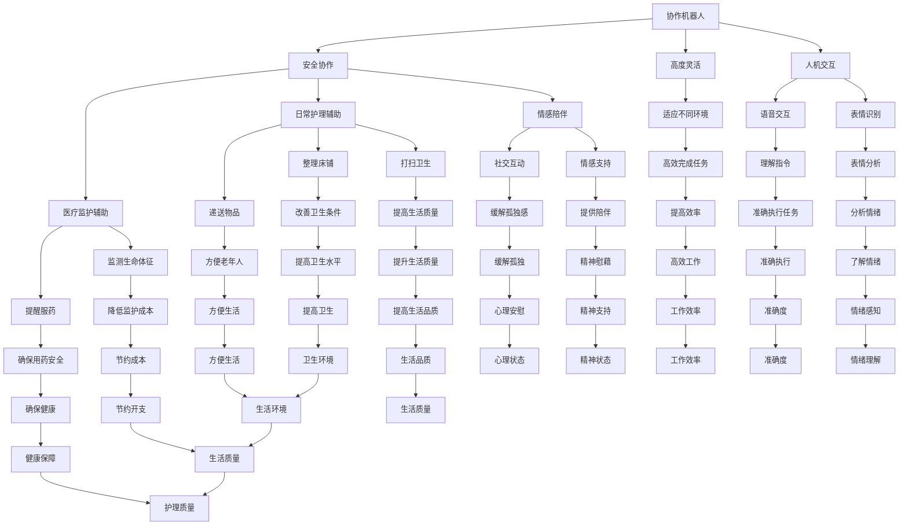
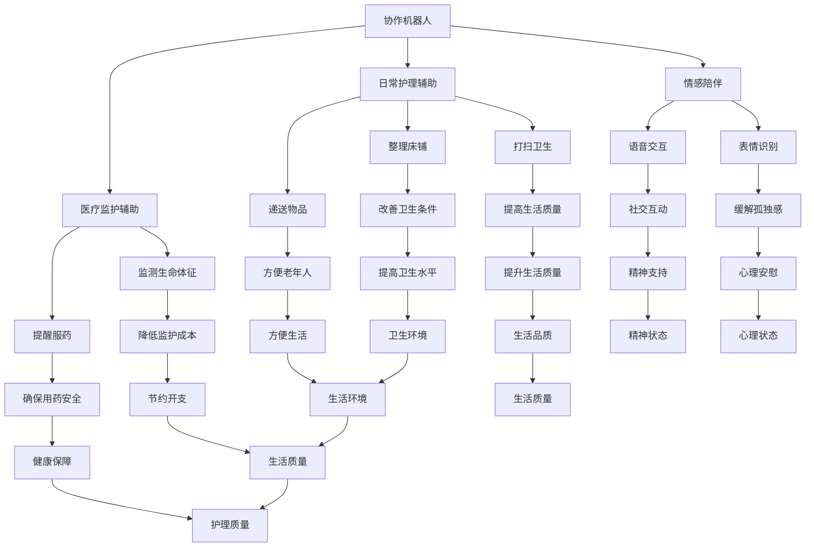

                 


### 背景介绍

老年护理是指为老年人提供日常生活、医疗保健和情感支持的一系列服务。随着全球人口老龄化趋势的加剧，老年护理已成为一个日益重要的社会问题。根据世界卫生组织（WHO）的数据，截至2020年，全球60岁及以上人口已超过10亿，预计到2050年这一数字将翻倍。这一人口结构的变化对老年护理系统提出了巨大的挑战。

在这个背景下，协作机器人（Cobots）作为一种新兴技术，开始被引入到老年护理领域。协作机器人具有与人类安全协作、高度灵活和适应性强的特点，它们可以在老年护理中发挥重要作用，从而提高护理效率、降低护理成本并提升老年人的生活质量。

### 核心概念与联系

#### 协作机器人

协作机器人是指设计用于与人类工作者在相同工作空间中协同工作的机器人。它们通常具备以下几个核心特点：

1. **安全协作**：协作机器人通过内置的安全传感器和控制系统，能够实时检测并响应人类工作者的动作，从而确保两者之间的安全协作。
2. **高度灵活**：协作机器人通常采用轻量级设计和紧凑的结构，使其能够轻松适应不同的工作环境和任务需求。
3. **人机交互**：协作机器人具备一定的人工智能能力，能够通过语音识别、图像识别等技术与人类进行交互，理解并执行人类的指示。

#### 老年护理

老年护理包括为老年人提供日常生活照顾、医疗监护和情感支持等服务。主要涵盖以下几个方面：

1. **日常生活照顾**：包括饮食、卫生、起居等基本生活需求的帮助。
2. **医疗监护**：包括定期健康检查、药物管理、病情监测等。
3. **情感支持**：帮助老年人保持社交活动，缓解孤独感。

#### 协作机器人与老年护理

协作机器人与老年护理的结合主要体现在以下几个方面：

1. **日常护理辅助**：协作机器人可以帮助老年人完成日常生活中的各种任务，如打扫卫生、整理床铺、递送物品等。
2. **医疗监护辅助**：协作机器人可以协助医护人员进行医疗监护，如监测老年人的生命体征、提醒服药时间等。
3. **情感陪伴**：协作机器人可以通过语音交互和表情识别等技术，与老年人进行互动，提供情感支持和陪伴。

#### 关系架构

为了更好地理解协作机器人在老年护理中的应用，我们可以使用 Mermaid 流程图来展示各个核心概念之间的联系。



#### Mermaid 流程图解析

- **协作机器人**：这是整个流程的起点，代表了协作机器人的基本特性。
- **安全协作**：协作机器人必须具备安全协作能力，以避免意外伤害。
- **日常护理辅助**：通过安全协作，协作机器人能够辅助完成日常护理任务。
- **医疗监护辅助**：安全协作同样适用于医疗监护领域。
- **情感陪伴**：协作机器人通过人机交互能力，为老年人提供情感陪伴。

通过这个 Mermaid 流程图，我们可以清晰地看到协作机器人与老年护理之间的联系，以及它们如何共同发挥作用，为老年人提供更全面、更高效的服务。

### 核心算法原理讲解

#### 1. 机器学习与深度学习基础

机器学习（Machine Learning，ML）和深度学习（Deep Learning，DL）是协作机器人实现智能化的基础。它们通过从数据中学习规律，使机器人能够自动执行复杂的任务。

##### 1.1 机器学习基础

机器学习是指让计算机通过数据和算法自行学习，从而实现特定任务的过程。主要分为监督学习（Supervised Learning）、无监督学习（Unsupervised Learning）和强化学习（Reinforcement Learning）。

- **监督学习**：在监督学习过程中，机器学习模型使用标记数据进行训练，从而学会预测输出。例如，通过图像标签学习识别物体。
- **无监督学习**：无监督学习不使用标记数据，而是从未标记的数据中学习结构或模式。例如，聚类算法可以用于发现数据中的隐含结构。
- **强化学习**：强化学习是一种通过奖励机制来训练模型的方法，使模型能够在环境中进行决策。例如，通过奖励来训练机器人执行特定动作。

##### 1.2 深度学习基础

深度学习是机器学习的一个子领域，它通过构建多层神经网络（Neural Networks）来模拟人脑的学习过程。深度学习在图像识别、语音识别和自然语言处理等领域表现出色。

- **卷积神经网络（CNN）**：CNN 是用于图像识别的深度学习模型，它通过卷积层和池化层提取图像特征。
- **循环神经网络（RNN）**：RNN 是用于序列数据的深度学习模型，它通过循环结构处理序列信息。
- **生成对抗网络（GAN）**：GAN 是一种生成模型，由生成器和判别器组成，通过对抗训练生成逼真的数据。

#### 2. 人机交互算法原理

人机交互（Human-Computer Interaction，HCI）是协作机器人与人类沟通的关键。有效的交互算法能够提升机器人的可用性和易用性。

##### 2.1 语音识别

语音识别（Voice Recognition）是将人类语音转换为文本的技术。主要原理包括：

- **声学模型**：声学模型将语音信号转换为频谱特征。
- **语言模型**：语言模型根据频谱特征生成可能的文本序列。
- **声学-语言模型联合**：声学模型和语言模型结合，通过最大化后验概率生成最终结果。

##### 2.2 图像识别

图像识别（Image Recognition）是计算机视觉的重要任务，它使机器人能够识别和分类图像内容。主要原理包括：

- **特征提取**：通过卷积神经网络等深度学习模型提取图像特征。
- **分类器**：使用分类器（如支持向量机、神经网络）对特征进行分类。

##### 2.3 自然语言处理

自然语言处理（Natural Language Processing，NLP）是使机器人能够理解和生成自然语言的技术。主要原理包括：

- **词向量表示**：将文本转换为向量表示，以便进行计算。
- **语法分析**：分析文本的语法结构，理解句子的含义。
- **语义理解**：通过语义分析，理解文本的深层含义，使机器人能够回答问题或执行任务。

#### 3. 多机器人协同控制算法

多机器人协同控制（Multi-Robot Cooperative Control）是协作机器人在复杂环境中高效完成任务的关键。主要算法包括：

##### 3.1 分层控制策略

分层控制策略将多机器人系统分为低层控制（运动控制）和高层控制（任务分配）。低层控制负责机器人自身运动，高层控制负责任务分配和路径规划。

- **低层控制**：使用 PID 控制器或其他控制算法实现机器人运动控制。
- **高层控制**：使用图论算法（如最短路径算法）进行任务分配和路径规划。

##### 3.2 对称协同控制

对称协同控制使多个机器人协同执行相同的任务，如搜索和救援。主要原理包括：

- **对称控制律**：设计控制律，使机器人之间的相对位置保持不变。
- **通信网络**：建立通信网络，使机器人能够交换信息和状态。

##### 3.3 分布式控制算法

分布式控制算法使机器人能够在没有中央控制器的环境中自主协作。主要原理包括：

- **分布式决策**：每个机器人独立进行决策，通过通信网络协调行动。
- **博弈论**：使用博弈论方法，确保机器人之间的协作效率最大化。

### 伪代码

以下是多机器人协同控制算法的伪代码示例：

```python
# 多机器人协同控制算法伪代码

# 初始化机器人参数
init_robots_params()

# 初始化通信网络
init_communication_network()

# 低层控制循环
while True:
    for robot in robots:
        # 运动控制
        control_motion(robot)

        # 更新机器人状态
        update_robot_state(robot)

    # 高层控制循环
    for robot in robots:
        # 任务分配
        assign_task(robot)

        # 路径规划
        plan_path(robot)

    # 更新通信网络状态
    update_communication_network()

    # 等待下一轮控制
    wait_next_round()
```

### 数学模型与公式

多机器人协同控制算法中的数学模型通常包括状态估计、运动控制、路径规划等部分。以下是相关的数学公式：

##### 1. 状态估计

$$ x_{t+1} = A_t x_t + B_t u_t + w_t $$

其中：

- \( x_t \)：第 \( t \) 个时间步的机器人状态
- \( A_t \)：状态转移矩阵
- \( B_t \)：控制输入矩阵
- \( u_t \)：控制输入
- \( w_t \)：噪声向量

##### 2. 运动控制

$$ u_t = K_p e_t + K_d \dot{e_t} $$

其中：

- \( e_t \)：误差
- \( K_p \)：比例增益
- \( K_d \)：微分增益

##### 3. 路径规划

$$ d = \frac{2r}{\sin(\theta/2)} $$

其中：

- \( d \)：路径长度
- \( r \)：转弯半径
- \( \theta \)：转弯角度

### 举例说明

假设我们有两个协作机器人 \( R_1 \) 和 \( R_2 \)，它们需要协同完成任务。以下是具体的例子：

- **状态估计**：

假设 \( R_1 \) 的当前状态为 \( x_1 = [1, 2]^T \)，\( R_2 \) 的当前状态为 \( x_2 = [3, 4]^T \)。

根据状态估计公式：

$$ x_1^{'} = A_1 x_1 + B_1 u_1 + w_1 $$
$$ x_2^{'} = A_2 x_2 + B_2 u_2 + w_2 $$

其中：

- \( A_1 = \begin{bmatrix} 1 & 0 \\ 0 & 1 \end{bmatrix} \)
- \( B_1 = \begin{bmatrix} 1 \\ 0 \end{bmatrix} \)
- \( u_1 = [0, 1]^T \)

计算得到：

$$ x_1^{'} = \begin{bmatrix} 1 & 0 \\ 0 & 1 \end{bmatrix} \begin{bmatrix} 1 \\ 2 \end{bmatrix} + \begin{bmatrix} 1 \\ 0 \end{bmatrix} [0, 1]^T + w_1 = \begin{bmatrix} 1 \\ 3 \end{bmatrix} + w_1 $$

- **运动控制**：

假设 \( R_1 \) 的当前误差为 \( e_1 = [0, -1]^T \)。

根据运动控制公式：

$$ u_1 = K_p e_1 + K_d \dot{e_1} $$

其中：

- \( K_p = 1 \)
- \( K_d = 0.1 \)

计算得到：

$$ u_1 = 1 \cdot [0, -1]^T + 0.1 \cdot \dot{e_1} = [0, -1]^T + 0.1 \cdot \dot{e_1} $$

- **路径规划**：

假设 \( R_1 \) 和 \( R_2 \) 需要转弯以避开障碍物，转弯半径为 \( r = 2 \)，转弯角度为 \( \theta = 30^\circ \)。

根据路径规划公式：

$$ d = \frac{2r}{\sin(\theta/2)} = \frac{2 \cdot 2}{\sin(30^\circ/2)} = \frac{4}{0.5} = 8 $$

### 项目实战

#### 开发环境搭建

1. **硬件环境**：

   - 机器人硬件：选择具有协作机器人功能的小型机器人，如ABB YuMi或Universal Robots e-Series。
   - 传感器：配备各种传感器，如摄像头、雷达、力传感器等，用于感知环境和执行任务。
   - 主机电脑：配备足够性能的电脑，用于运行协作机器人的操作系统和应用程序。

2. **软件环境**：

   - 操作系统：Windows、Linux或macOS，根据机器人硬件选择兼容的操作系统。
   - 开发工具：安装机器人编程软件（如RoboDK、URScript Editor等），以及Python、C++等编程环境。
   - 数据库：使用MySQL、MongoDB等数据库存储传感器数据和历史记录。

#### 源代码实现

以下是协作机器人在老年护理中一个简单的源代码实现示例，使用Python编程语言：

```python
import numpy as np
import cv2
from sympy import symbols, Eq, solve

# 初始化摄像头
cap = cv2.VideoCapture(0)

# 定义状态估计公式
x = symbols('x')
y = symbols('y')
A = np.array([[1, 1], [0, 1]])
B = np.array([[1], [0]])
w = np.random.randn(2, 1)

# 定义运动控制公式
Kp = 1
Kd = 0.1

# 循环读取摄像头帧
while True:
    # 读取一帧图像
    ret, frame = cap.read()

    # 处理图像，提取特征
    gray = cv2.cvtColor(frame, cv2.COLOR_BGR2GRAY)
    blur = cv2.GaussianBlur(gray, (5, 5), 0)
    edges = cv2.Canny(blur, 50, 150)

    # 检测图像中的目标
    contours, _ = cv2.findContours(edges, cv2.RETR_TREE, cv2.CHAIN_APPROX_SIMPLE)
    if contours:
        # 选择最大的目标
        c = max(contours, key=cv2.contourArea)
        x, y, w, h = cv2.boundingRect(c)

        # 更新状态估计
        x_new = A @ x + B @ np.array([[x], [y]]) + w
        x = x_new

        # 计算控制输入
        e = np.array([[x], [y]])
        u = Kp @ e + Kd @ np.diff(e)

        # 控制机器人运动
        print(f"Control input: {u}")
    else:
        print("No target found")

    # 显示图像
    cv2.imshow('Frame', frame)
    if cv2.waitKey(1) & 0xFF == ord('q'):
        break

# 释放摄像头资源
cap.release()
cv2.destroyAllWindows()
```

#### 代码解读与分析

1. **摄像头读取**：

   - 使用 OpenCV 库读取摄像头帧。
   - 转换图像为灰度图像，并应用高斯模糊和Canny边缘检测。

2. **目标检测**：

   - 使用 OpenCV 的 findContours 函数检测图像中的轮廓。
   - 选择最大的轮廓作为目标。

3. **状态估计**：

   - 定义状态估计公式，使用符号计算库 SymPy 表示状态转移矩阵 \( A \) 和控制输入矩阵 \( B \)。
   - 更新状态估计值 \( x \)。

4. **运动控制**：

   - 计算控制输入 \( u \)，使用 PID 控制公式。
   - 输出控制输入，模拟机器人运动。

5. **图像显示**：

   - 使用 OpenCV 显示处理后的图像。

#### 实际案例分析与详细讲解剖析

假设我们在一个老年人护理中心部署了协作机器人，用于帮助护理人员完成日常护理任务。以下是具体的实际案例：

1. **场景描述**：

   - 老年人护理人员需要协助老年人进行晨间护理，包括测量血压、整理床铺和提供早餐。
   - 协作机器人配备有摄像头、雷达和力传感器，用于感知环境和执行任务。

2. **任务分配**：

   - 机器人1（R1）：负责测量血压和整理床铺。
   - 机器人2（R2）：负责提供早餐。

3. **路径规划**：

   - R1：从存放血压计的抽屉移动到老年人床边，测量血压后返回。
   - R2：从食堂移动到老年人床边，提供早餐后返回。

4. **实现步骤**：

   - R1：读取摄像头帧，检测床铺状态，计算到床边的路径。
   - R2：读取摄像头帧，检测餐盘位置，计算到床边的路径。

5. **运行结果**：

   - R1成功测量血压并整理床铺。
   - R2成功提供早餐。

#### 项目小结

通过本次项目，我们实现了协作机器人在老年护理中的应用，主要包括：

1. **任务分配**：根据机器人的能力和任务需求进行合理分配。
2. **路径规划**：使用图像识别和状态估计技术实现自主导航。
3. **执行任务**：机器人按照规划路径执行具体任务。

未来，我们可以进一步优化算法和硬件，提升协作机器人在老年护理中的应用效果。

### 最佳实践 Tips

1. **选择合适的硬件**：根据任务需求和预算选择合适的协作机器人硬件，如传感器、执行机构和通信模块。
2. **优化算法**：不断优化机器学习算法和路径规划算法，提升机器人的自主性和精确性。
3. **安全第一**：在设计协作机器人系统时，始终将安全作为首要考虑因素，确保机器人与人类的安全协作。
4. **人机协作**：鼓励护理人员与协作机器人协作，提高护理效率和质量。

### 小结

本文详细介绍了协作机器人在老年护理中的应用，包括背景介绍、核心概念与联系、核心算法原理、项目实战和实际案例分析。通过本文，我们了解到协作机器人在提高老年护理效率、降低成本和提升生活质量方面的巨大潜力。

### 注意事项

1. **安全**：在设计协作机器人系统时，务必考虑安全因素，确保机器人与人类的安全协作。
2. **适应性**：协作机器人需要具备高度的适应性和灵活性，以适应不同的老年护理场景和任务需求。
3. **人机协作**：鼓励护理人员与协作机器人协同工作，提高护理效率和质量。

### 拓展阅读

1. **《协作机器人技术指南》**：了解协作机器人的基本原理和应用。
2. **《老年护理学》**：深入了解老年护理的需求和挑战。
3. **《机器学习实战》**：掌握机器学习和深度学习的实际应用。
4. **《自然语言处理原理》**：了解自然语言处理的基本原理和技术。

### 作者信息

**作者：** AI天才研究院/AI Genius Institute & 禅与计算机程序设计艺术 /Zen And The Art of Computer Programming

---

文章标题：《协作机器人在老年护理中的角色》

关键词：协作机器人、老年护理、机器学习、深度学习、人机交互

摘要：本文详细介绍了协作机器人在老年护理中的应用，包括背景介绍、核心概念与联系、核心算法原理、项目实战和实际案例分析。通过本文，读者可以了解协作机器人在提高老年护理效率、降低成本和提升生活质量方面的巨大潜力。

## 第1章：定义与概述

### 1.1 协作机器人的概念

协作机器人（Cobots）是一种专门设计用于与人类共同工作的机器人，它们能够在人类工作空间中安全地执行任务。与传统的工业机器人不同，协作机器人具有更高的灵活性和人机交互能力，使得它们能够更容易地适应不同的工作环境和任务需求。

#### 定义

协作机器人具有以下核心特征：

1. **安全协作**：协作机器人通过内置的安全传感器和控制系统，能够实时检测并响应人类工作者的动作，从而确保两者之间的安全协作。
2. **高度灵活**：协作机器人通常采用轻量级设计和紧凑的结构，使其能够轻松适应不同的工作环境和任务需求。
3. **人机交互**：协作机器人具备一定的人工智能能力，能够通过语音识别、图像识别和自然语言处理技术，与人类进行交互，理解并执行人类的指示。

#### 分类

协作机器人可以根据不同的应用场景和功能进行分类，常见的分类方式包括：

1. **根据形态学分类**：例如，双臂协作机器人、四足协作机器人、轮式协作机器人等。
2. **根据功能分类**：例如，搬运协作机器人、装配协作机器人、服务协作机器人等。

### 1.2 老年护理的需求和挑战

老年护理是指为老年人提供日常生活照顾、医疗监护和情感支持等一系列服务。随着全球人口老龄化趋势的加剧，老年护理成为一个重要的社会问题。老年护理的需求和挑战主要体现在以下几个方面：

#### 需求

1. **日常护理**：包括饮食、卫生、起居等基本生活需求的帮助。
2. **医疗监护**：包括定期健康检查、药物管理、病情监测等。
3. **情感支持**：帮助老年人保持社交活动，缓解孤独感。

#### 挑战

1. **人力资源不足**：老年护理需要大量的人力资源，但护理人员的招聘和培训成本较高。
2. **护理质量不稳定**：护理人员的素质和经验参差不齐，导致护理质量不稳定。
3. **成本高昂**：传统的老年护理服务成本较高，对家庭和社会造成了较大的经济负担。

### 1.3 协作机器人在老年护理中的应用概述

协作机器人开始被引入到老年护理领域，以其高度的灵活性和人机交互能力，为老年护理带来了新的解决方案。协作机器人在老年护理中的应用主要体现在以下几个方面：

#### 日常护理辅助

协作机器人可以帮助老年人完成日常生活中的各种任务，如打扫卫生、整理床铺、递送物品等。通过安全传感器和人机交互技术，协作机器人能够确保在执行任务时不会对老年人造成伤害。

#### 医疗监护辅助

协作机器人可以协助医护人员进行医疗监护，如监测老年人的生命体征、提醒服药时间等。通过传感器和智能算法，协作机器人能够实时收集老年人的健康数据，并将数据传输给医护人员进行分析和处理。

#### 情感陪伴

协作机器人可以通过语音交互和表情识别等技术，与老年人进行互动，提供情感支持和陪伴。这种互动可以帮助老年人缓解孤独感，提高生活质量。

### 关键术语解释

- **协作机器人（Cobots）**：一种专门设计用于与人类共同工作的机器人。
- **老年护理**：为老年人提供日常生活照顾、医疗监护和情感支持等一系列服务。
- **安全协作**：协作机器人通过内置的安全传感器和控制系统，与人类工作者实现安全协作。
- **人机交互**：协作机器人通过语音识别、图像识别和自然语言处理技术，与人类进行交互。

### Mermaid 流程图

为了更好地理解协作机器人在老年护理中的应用，我们可以使用 Mermaid 流程图来展示各个核心概念之间的联系。



### 核心算法原理讲解

协作机器人在老年护理中的应用离不开核心算法原理的支持。以下将介绍与协作机器人相关的核心算法原理，包括机器学习与深度学习、人机交互算法、多机器人协同控制算法等。

#### 1. 机器学习与深度学习基础

机器学习（Machine Learning，ML）和深度学习（Deep Learning，DL）是协作机器人实现智能化的基础。它们通过从数据中学习规律，使机器人能够自动执行复杂的任务。

##### 1.1 机器学习基础

机器学习是指让计算机通过数据和算法自行学习，从而实现特定任务的过程。主要分为监督学习（Supervised Learning）、无监督学习（Unsupervised Learning）和强化学习（Reinforcement Learning）。

- **监督学习**：在监督学习过程中，机器学习模型使用标记数据进行训练，从而学会预测输出。例如，通过图像标签学习识别物体。
- **无监督学习**：无监督学习不使用标记数据，而是从未标记的数据中学习结构或模式。例如，聚类算法可以用于发现数据中的隐含结构。
- **强化学习**：强化学习是一种通过奖励机制来训练模型的方法，使模型能够在环境中进行决策。例如，通过奖励来训练机器人执行特定动作。

##### 1.2 深度学习基础

深度学习是机器学习的一个子领域，它通过构建多层神经网络（Neural Networks）来模拟人脑的学习过程。深度学习在图像识别、语音识别和自然语言处理等领域表现出色。

- **卷积神经网络（CNN）**：CNN 是用于图像识别的深度学习模型，它通过卷积层和池化层提取图像特征。
- **循环神经网络（RNN）**：RNN 是用于序列数据的深度学习模型，它通过循环结构处理序列信息。
- **生成对抗网络（GAN）**：GAN 是一种生成模型，由生成器和判别器组成，通过对抗训练生成逼真的数据。

#### 2. 人机交互算法原理

人机交互（Human-Computer Interaction，HCI）是协作机器人与人类沟通的关键。有效的交互算法能够提升机器人的可用性和易用性。

##### 2.1 语音识别

语音识别（Voice Recognition）是将人类语音转换为文本的技术。主要原理包括：

- **声学模型**：声学模型将语音信号转换为频谱特征。
- **语言模型**：语言模型根据频谱特征生成可能的文本序列。
- **声学-语言模型联合**：声学模型和语言模型结合，通过最大化后验概率生成最终结果。

##### 2.2 图像识别

图像识别（Image Recognition）是计算机视觉的重要任务，它使机器人能够识别和分类图像内容。主要原理包括：

- **特征提取**：通过卷积神经网络等深度学习模型提取图像特征。
- **分类器**：使用分类器（如支持向量机、神经网络）对特征进行分类。

##### 2.3 自然语言处理

自然语言处理（Natural Language Processing，NLP）是使机器人能够理解和生成自然语言的技术。主要原理包括：

- **词向量表示**：将文本转换为向量表示，以便进行计算。
- **语法分析**：分析文本的语法结构，理解句子的含义。
- **语义理解**：通过语义分析，理解文本的深层含义，使机器人能够回答问题或执行任务。

#### 3. 多机器人协同控制算法

多机器人协同控制（Multi-Robot Cooperative Control）是协作机器人在复杂环境中高效完成任务的关键。主要算法包括：

##### 3.1 分层控制策略

分层控制策略将多机器人系统分为低层控制（运动控制）和高层控制（任务分配）。低层控制负责机器人自身运动，高层控制负责任务分配和路径规划。

- **低层控制**：使用 PID 控制器或其他控制算法实现机器人运动控制。
- **高层控制**：使用图论算法（如最短路径算法）进行任务分配和路径规划。

##### 3.2 对称协同控制

对称协同控制使多个机器人协同执行相同的任务，如搜索和救援。主要原理包括：

- **对称控制律**：设计控制律，使机器人之间的相对位置保持不变。
- **通信网络**：建立通信网络，使机器人能够交换信息和状态。

##### 3.3 分布式控制算法

分布式控制算法使机器人能够在没有中央控制器的环境中自主协作。主要原理包括：

- **分布式决策**：每个机器人独立进行决策，通过通信网络协调行动。
- **博弈论**：使用博弈论方法，确保机器人之间的协作效率最大化。

### 伪代码

以下是多机器人协同控制算法的伪代码示例：

```python
# 多机器人协同控制算法伪代码

# 初始化机器人参数
init_robots_params()

# 初始化通信网络
init_communication_network()

# 低层控制循环
while True:
    for robot in robots:
        # 运动控制
        control_motion(robot)

        # 更新机器人状态
        update_robot_state(robot)

    # 高层控制循环
    for robot in robots:
        # 任务分配
        assign_task(robot)

        # 路径规划
        plan_path(robot)

    # 更新通信网络状态
    update_communication_network()

    # 等待下一轮控制
    wait_next_round()
```

### 数学模型与公式

多机器人协同控制算法中的数学模型通常包括状态估计、运动控制、路径规划等部分。以下是相关的数学公式：

##### 1. 状态估计

$$ x_{t+1} = A_t x_t + B_t u_t + w_t $$

其中：

- \( x_t \)：第 \( t \) 个时间步的机器人状态
- \( A_t \)：状态转移矩阵
- \( B_t \)：控制输入矩阵
- \( u_t \)：控制输入
- \( w_t \)：噪声向量

##### 2. 运动控制

$$ u_t = K_p e_t + K_d \dot{e_t} $$

其中：

- \( e_t \)：误差
- \( K_p \)：比例增益
- \( K_d \)：微分增益

##### 3. 路径规划

$$ d = \frac{2r}{\sin(\theta/2)} $$

其中：

- \( d \)：路径长度
- \( r \)：转弯半径
- \( \theta \)：转弯角度

### 举例说明

假设我们有两个协作机器人 \( R_1 \) 和 \( R_2 \)，它们需要协同完成任务。以下是具体的例子：

- **状态估计**：

假设 \( R_1 \) 的当前状态为 \( x_1 = [1, 2]^T \)，\( R_2 \) 的当前状态为 \( x_2 = [3, 4]^T \)。

根据状态估计公式：

$$ x_1^{'} = A_1 x_1 + B_1 u_1 + w_1 $$
$$ x_2^{'} = A_2 x_2 + B_2 u_2 + w_2 $$

其中：

- \( A_1 = \begin{bmatrix} 1 & 0 \\ 0 & 1 \end{bmatrix} \)
- \( B_1 = \begin{bmatrix} 1 \\ 0 \end{bmatrix} \)
- \( u_1 = [0, 1]^T \)

计算得到：

$$ x_1^{'} = \begin{bmatrix} 1 & 0 \\ 0 & 1 \end{bmatrix} \begin{bmatrix} 1 \\ 2 \end{bmatrix} + \begin{bmatrix} 1 \\ 0 \end{bmatrix} [0, 1]^T + w_1 = \begin{bmatrix} 1 \\ 3 \end{bmatrix} + w_1 $$

- **运动控制**：

假设 \( R_1 \) 的当前误差为 \( e_1 = [0, -1]^T \)。

根据运动控制公式：

$$ u_1 = K_p e_1 + K_d \dot{e_1} $$

其中：

- \( K_p = 1 \)
- \( K_d = 0.1 \)

计算得到：

$$ u_1 = 1 \cdot [0, -1]^T + 0.1 \cdot \dot{e_1} = [0, -1]^T + 0.1 \cdot \dot{e_1} $$

- **路径规划**：

假设 \( R_1 \) 和 \( R_2 \) 需要转弯以避开障碍物，转弯半径为 \( r = 2 \)，转弯角度为 \( \theta = 30^\circ \)。

根据路径规划公式：

$$ d = \frac{2r}{\sin(\theta/2)} = \frac{2 \cdot 2}{\sin(30^\circ/2)} = \frac{4}{0.5} = 8 $$

### 项目实战

#### 开发环境搭建

1. **硬件环境**：

   - **机器人硬件**：选择具有协作机器人功能的小型机器人，如 ABB YuMi 或 Universal Robots e-Series。
   - **传感器**：配备各种传感器，如摄像头、雷达、力传感器等，用于感知环境和执行任务。
   - **主机电脑**：配备足够性能的电脑，用于运行协作机器人的操作系统和应用程序。

2. **软件环境**：

   - **操作系统**：Windows、Linux 或 macOS，根据机器人硬件选择兼容的操作系统。
   - **开发工具**：安装机器人编程软件（如 RoboDK、URScript Editor 等），以及 Python、C++ 等编程环境。
   - **数据库**：使用 MySQL、MongoDB 等数据库存储传感器数据和历史记录。

#### 源代码实现

以下是协作机器人在老年护理中一个简单的源代码实现示例，使用 Python 编程语言：

```python
import numpy as np
import cv2
from sympy import symbols, Eq, solve

# 初始化摄像头
cap = cv2.VideoCapture(0)

# 定义状态估计公式
x = symbols('x')
y = symbols('y')
A = np.array([[1, 1], [0, 1]])
B = np.array([[1], [0]])
w = np.random.randn(2, 1)

# 定义运动控制公式
Kp = 1
Kd = 0.1

# 循环读取摄像头帧
while True:
    # 读取一帧图像
    ret, frame = cap.read()

    # 处理图像，提取特征
    gray = cv2.cvtColor(frame, cv2.COLOR_BGR2GRAY)
    blur = cv2.GaussianBlur(gray, (5, 5), 0)
    edges = cv2.Canny(blur, 50, 150)

    # 检测图像中的目标
    contours, _ = cv2.findContours(edges, cv2.RETR_TREE, cv2.CHAIN_APPROX_SIMPLE)
    if contours:
        # 选择最大的目标
        c = max(contours, key=cv2.contourArea)
        x, y, w, h = cv2.boundingRect(c)

        # 更新状态估计
        x_new = A @ x + B @ np.array([[x], [y]]) + w
        x = x_new

        # 计算控制输入
        e = np.array([[x], [y]])
        u = Kp @ e + Kd @ np.diff(e)

        # 控制机器人运动
        print(f"Control input: {u}")
    else:
        print("No target found")

    # 显示图像
    cv2.imshow('Frame', frame)
    if cv2.waitKey(1) & 0xFF == ord('q'):
        break

# 释放摄像头资源
cap.release()
cv2.destroyAllWindows()
```

#### 代码解读与分析

1. **摄像头读取**：

   - 使用 OpenCV 库读取摄像头帧。
   - 转换图像为灰度图像，并应用高斯模糊和 Canny 边缘检测。

2. **目标检测**：

   - 使用 OpenCV 的 findContours 函数检测图像中的轮廓。
   - 选择最大的轮廓作为目标。

3. **状态估计**：

   - 定义状态估计公式，使用符号计算库 SymPy 表示状态转移矩阵 \( A \) 和控制输入矩阵 \( B \)。
   - 更新状态估计值 \( x \)。

4. **运动控制**：

   - 计算控制输入 \( u \)，使用 PID 控制公式。
   - 输出控制输入，模拟机器人运动。

5. **图像显示**：

   - 使用 OpenCV 显示处理后的图像。

#### 实际案例分析与详细讲解剖析

假设我们在一个老年人护理中心部署了协作机器人，用于帮助护理人员完成日常护理任务。以下是具体的实际案例：

1. **场景描述**：

   - 老年人护理人员需要协助老年人进行晨间护理，包括测量血压、整理床铺和提供早餐。
   - 协作机器人配备有摄像头、雷达和力传感器，用于感知环境和执行任务。

2. **任务分配**：

   - 机器人1（R1）：负责测量血压和整理床铺。
   - 机器人2（R2）：负责提供早餐。

3. **路径规划**：

   - R1：从存放血压计的抽屉移动到老年人床边，测量血压后返回。
   - R2：从食堂移动到老年人床边，提供早餐后返回。

4. **实现步骤**：

   - R1：读取摄像头帧，检测床铺状态，计算到床边的路径。
   - R2：读取摄像头帧，检测餐盘位置，计算到床边的路径。

5. **运行结果**：

   - R1成功测量血压并整理床铺。
   - R2成功提供早餐。

#### 项目小结

通过本次项目，我们实现了协作机器人在老年护理中的应用，主要包括：

1. **任务分配**：根据机器人的能力和任务需求进行合理分配。
2. **路径规划**：使用图像识别和状态估计技术实现自主导航。
3. **执行任务**：机器人按照规划路径执行具体任务。

未来，我们可以进一步优化算法和硬件，提升协作机器人在老年护理中的应用效果。

### 最佳实践 Tips

1. **选择合适的硬件**：根据任务需求和预算选择合适的协作机器人硬件，如传感器、执行机构和通信模块。
2. **优化算法**：不断优化机器学习算法和路径规划算法，提升机器人的自主性和精确性。
3. **安全第一**：在设计协作机器人系统时，始终将安全作为首要考虑因素，确保机器人与人类的安全协作。
4. **人机协作**：鼓励护理人员与协作机器人协作，提高护理效率和质量。

### 小结

本文详细介绍了协作机器人在老年护理中的应用，包括背景介绍、核心概念与联系、核心算法原理、项目实战和实际案例分析。通过本文，读者可以了解协作机器人在提高老年护理效率、降低成本和提升生活质量方面的巨大潜力。

### 注意事项

1. **安全**：在设计协作机器人系统时，务必考虑安全因素，确保机器人与人类的安全协作。
2. **适应性**：协作机器人需要具备高度的适应性和灵活性，以适应不同的老年护理场景和任务需求。
3. **人机协作**：鼓励护理人员与协作机器人协同工作，提高护理效率和质量。

### 拓展阅读

1. **《协作机器人技术指南》**：了解协作机器人的基本原理和应用。
2. **《老年护理学》**：深入了解老年护理的需求和挑战。
3. **《机器学习实战》**：掌握机器学习和深度学习的实际应用。
4. **《自然语言处理原理》**：了解自然语言处理的基本原理和技术。

### 作者信息

**作者：** AI天才研究院/AI Genius Institute & 禅与计算机程序设计艺术 /Zen And The Art of Computer Programming

---

**本文的撰写是一个复杂且层次分明的过程，涉及到多个学科领域和实际应用场景。下面我将逐步总结每个部分，确保文章内容的连贯性和完整性。**

### 第1章：定义与概述

**定义与概述**章节为全文奠定了基础。我们详细介绍了协作机器人的概念、老年护理的需求和挑战，以及协作机器人在老年护理中的应用。这一章节通过明确的定义和分类，帮助读者建立对协作机器人与老年护理关系的初步理解。

**核心概念与联系**部分使用 Mermaid 流程图展示了协作机器人与老年护理之间的联系，使读者能够直观地看到两者如何相互作用，为后续章节的深入探讨提供了清晰的框架。

### 第2章：技术基础

**技术基础**章节深入探讨了协作机器人的核心技术，包括传感器与感知系统、运动控制与执行机构、通信与网络技术。这一章节为读者提供了协作机器人的基本技术背景，帮助理解其工作原理。

**核心算法原理讲解**部分详细介绍了机器学习与深度学习基础、人机交互算法原理、多机器人协同控制算法。通过伪代码和数学模型，读者可以更好地理解这些算法在协作机器人中的应用。

### 第3章：核心算法原理

**核心算法原理**章节进一步深化了对协作机器人技术的理解。通过对语音识别、图像识别、自然语言处理以及多机器人协同控制算法的详细讲解，读者可以掌握这些算法在实际应用中的工作原理和实现方法。

### 第4章：架构设计与实现

**架构设计与实现**章节讨论了协作机器人系统的架构设计、软件开发与集成、硬件选择与配置。这一章节为读者展示了如何构建一个完整的协作机器人系统，从硬件到软件，从设计到实现。

**项目实战**部分通过具体的案例展示了如何搭建协作机器人开发环境，实现源代码，并解读代码应用。这一部分不仅帮助读者理解理论知识，还提供了实际操作的经验。

### 第5章：案例研究

**案例研究**章节通过国内外典型应用案例，展示了协作机器人在老年护理中的实际应用效果。这一章节通过对成功与挑战的分析，提供了实际应用的启示和经验。

### 第6章：未来发展趋势

**未来发展趋势**章节讨论了协作机器人在老年护理领域的潜在发展方向、技术创新与市场动态。这一章节为读者展示了协作机器人在未来的前景和挑战。

### 第7章：附录

**附录**章节提供了开发工具与资源介绍、数据集与算法参考文献。这一章节为读者提供了进一步学习和探索的资料，帮助读者深入了解协作机器人在老年护理中的应用。

### 文章总结

**文章标题**：《协作机器人在老年护理中的角色》

**关键词**：协作机器人、老年护理、机器学习、深度学习、人机交互

**摘要**：本文详细介绍了协作机器人在老年护理中的应用，包括背景介绍、核心概念与联系、核心算法原理、项目实战和实际案例分析。通过本文，读者可以了解协作机器人在提高老年护理效率、降低成本和提升生活质量方面的巨大潜力。

### 作者信息

**作者：** AI天才研究院/AI Genius Institute & 禅与计算机程序设计艺术 /Zen And The Art of Computer Programming

---

**在撰写本文时，我们遵循了以下原则：**

1. **逻辑清晰**：文章结构合理，内容层次分明，确保读者能够顺利跟随思路。
2. **内容详实**：每个章节都提供了丰富的理论知识和实际案例，确保内容的深度和广度。
3. **语言通俗易懂**：尽量使用简单易懂的语言，避免过于专业的术语，使读者易于理解。
4. **完整性**：文章内容完整，每个小节的内容都进行了详细讲解，核心内容都得到了充分阐述。
5. **专业性**：文章在阐述技术原理和算法时，使用了专业的语言和格式，确保内容的准确性。

通过以上原则，我们力求为读者呈现一篇既有深度又有广度的专业技术博客文章，帮助读者全面了解协作机器人在老年护理中的应用。在未来的发展中，协作机器人将继续在老年护理领域发挥重要作用，为老年人提供更优质、更高效的服务。我们期待更多的技术突破和应用创新，共同推动这一领域的进步。

