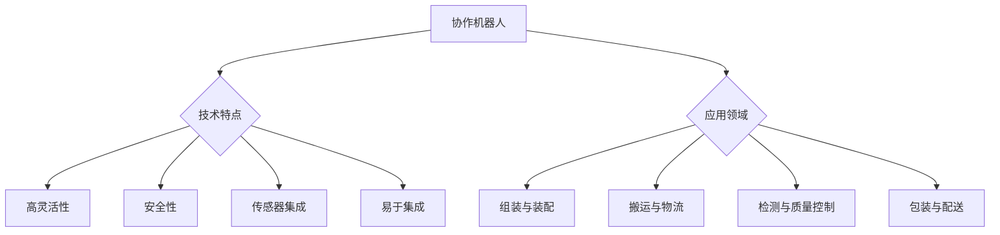

                 

### 文章标题

# 协作机器人：多功能机器人在工业4.0中的角色

### 关键词

- 协作机器人
- 工业自动化
- 工业4.0
- 智能制造
- 人机协作

### 摘要

本文将探讨协作机器人在工业4.0背景下的重要作用。首先，我们将介绍协作机器人的定义、特点和主要技术架构。接着，我们会分析协作机器人在工业4.0中的核心应用场景，包括智能工厂、供应链管理等方面。随后，本文将探讨协作机器人所面临的挑战及其未来发展前景。通过深入解析，我们将展现协作机器人在推动工业4.0进程中的关键角色和巨大潜力。

## 第1章：协作机器人的定义和特点

### 1.1 定义与历史背景

协作机器人（Collaborative Robot，简称Cobot）是一种专门设计用于与人类工作者共同工作的工业机器人。与传统的工业机器人不同，协作机器人具有更高的灵活性和安全性，能够与人共享工作空间。

协作机器人的历史可以追溯到20世纪80年代，最初的研究集中在提高机器人的感知能力和交互性。然而，直到近年来，随着人工智能、传感器技术、控制算法等领域的迅速发展，协作机器人才开始逐渐走进工业生产领域。

### 1.2 技术特点与应用领域

协作机器人的技术特点主要包括以下几个方面：

1. **高灵活性和可编程性**：协作机器人通常采用模块化设计，用户可以通过图形界面或编程语言轻松修改其工作路径和动作。

2. **安全性**：协作机器人通常具有安全停机功能，当检测到人类工作者接近时，机器人会立即停止运动，避免发生碰撞。

3. **传感器集成**：协作机器人集成了多种传感器，如视觉、触觉、力觉等，使其能够更好地感知环境和与人类协作。

4. **易于集成**：协作机器人通常设计为易于与现有生产线集成，不需要大规模的改造或安装。

协作机器人的应用领域广泛，包括但不限于：

1. **组装与装配**：协作机器人可以协助人类完成复杂的组装和装配任务，如电子产品的焊接、零部件的组装等。

2. **搬运与物流**：协作机器人可以用于搬运重物、分拣货物等，提高物流效率。

3. **检测与质量控制**：协作机器人可以用于检测产品缺陷、进行质量监控等。

4. **包装与配送**：协作机器人可以协助人类完成产品的包装和配送工作。

## 第2章：协作机器人的技术架构

### 2.1 机械结构设计

协作机器人的机械结构设计旨在实现高灵活性和安全性。通常，协作机器人采用轻量化、模块化设计，使其能够轻松适应不同工作场景。

机械结构的主要组成部分包括：

1. **机械臂**：机械臂是协作机器人的核心部分，通常具有7个自由度，能够完成复杂的运动任务。

2. **末端执行器**：末端执行器是协作机器人的“手”，用于执行特定的任务，如抓取、焊接、装配等。

3. **安全保护罩**：为了确保人类工作者的安全，协作机器人通常会配备安全保护罩。

### 2.2 控制系统与传感器

协作机器人的控制系统是确保其正常运行的核心。控制系统通常包括：

1. **运动控制器**：运动控制器负责控制机械臂的运动，实现预定的动作轨迹。

2. **力控制器**：力控制器用于监控机械臂与物体之间的力，确保在抓取和搬运过程中不损坏物体。

协作机器人集成了多种传感器，包括：

1. **视觉传感器**：视觉传感器用于识别和跟踪物体，实现视觉定位。

2. **力觉传感器**：力觉传感器用于感知机械臂与物体之间的力，实现精细操作。

3. **触觉传感器**：触觉传感器用于检测物体的表面特性，提高抓取稳定性。

### 2.3 交互与协作机制

协作机器人的交互与协作机制是其与人共同工作的关键。协作机器人通常采用以下几种交互方式：

1. **语音交互**：通过语音识别和语音合成技术，实现人与机器人的自然语言交流。

2. **手势交互**：通过手势识别技术，实现人与机器人之间的手势互动。

3. **触觉交互**：通过触觉反馈技术，实现人与机器人之间的触觉互动。

协作机器人还采用了多种协作机制，如：

1. **路径规划**：通过路径规划算法，确保机器人在与人类共同工作时不会发生碰撞。

2. **任务分配**：通过任务分配机制，实现机器人与人类之间的任务分配和协调。

## 第3章：工业4.0的概念和趋势

### 3.1 工业4.0的定义

工业4.0，也称为第四次工业革命，是指通过集成物联网、云计算、大数据、人工智能等先进技术，实现制造业的全面数字化、智能化和自动化。

工业4.0的主要特点包括：

1. **智能化生产**：通过人工智能和大数据分析，实现生产过程的智能化，提高生产效率和质量。

2. **网络化工厂**：通过物联网技术，实现工厂内部设备、系统和供应链的互联互通，提高生产协同效率。

3. **个性化定制**：通过大数据分析和智能制造技术，实现产品的个性化定制，满足消费者的多样化需求。

4. **资源优化配置**：通过大数据分析和优化算法，实现资源的优化配置，降低生产成本。

### 3.2 工业4.0的关键技术

工业4.0的实现依赖于多项关键技术的支持，主要包括：

1. **物联网（IoT）**：物联网技术是实现工业4.0的基础，通过传感器、控制器等设备，实现设备的互联互通和数据采集。

2. **大数据分析**：大数据分析技术用于处理和分析海量数据，为生产决策提供支持。

3. **人工智能（AI）**：人工智能技术用于实现生产过程的智能化，提高生产效率和质量。

4. **云计算**：云计算技术提供强大的计算能力和数据存储能力，支持工业4.0应用的开发和部署。

5. **3D打印**：3D打印技术是实现个性化定制的重要手段，通过快速制造，满足消费者的多样化需求。

### 3.3 工业4.0对制造业的影响

工业4.0对制造业的影响深远，主要表现在以下几个方面：

1. **生产效率提升**：通过智能化、自动化生产，提高生产效率，降低生产成本。

2. **制造模式变革**：从传统的批量生产模式向个性化定制模式转变，满足消费者多样化需求。

3. **产业生态重构**：传统制造业产业链将被重构，新兴业态不断涌现，如智能制造、工业互联网等。

4. **劳动力需求变化**：随着智能化、自动化生产的应用，劳动力需求将发生变化，对劳动者的技能要求提高。

## 第4章：协作机器人在工业4.0中的应用

### 4.1 智能制造系统

智能制造系统是工业4.0的核心应用，协作机器人在其中发挥着关键作用。协作机器人可以协助人类完成复杂的生产任务，如组装、焊接、检测等，提高生产效率和质量。

### 4.2 协作机器人与自动化设备集成

在工业4.0时代，协作机器人可以与自动化设备（如数控机床、自动化装配线等）集成，实现生产过程的智能化和自动化。通过物联网和大数据分析，协作机器人可以实时监控设备状态，优化生产流程，提高生产效率。

### 4.3 协作机器人与人类工人的协同工作

协作机器人与人类工人的协同工作是工业4.0的重要特征。通过安全防护措施和交互机制，协作机器人可以与人类工作者共同完成生产任务，实现人机协作，提高生产效率和质量。

## 第5章：协作机器人在供应链管理中的应用

### 5.1 仓储与物流

协作机器人可以应用于仓储和物流领域，如自动分拣、搬运、包装等。通过智能化、自动化管理，提高仓储和物流效率，降低成本。

### 5.2 装配与检测

协作机器人可以协助人类完成装配和检测任务，如装配零部件、检测产品缺陷等。通过人机协作，提高装配精度和检测效率。

### 5.3 供应链的智能化改造

通过协作机器人，供应链可以实现智能化改造，如实时监控库存、优化配送路径、提高供应链协同效率等。实现供应链的全面智能化，提高企业竞争力。

## 第6章：协作机器人的挑战与未来发展

### 6.1 安全与伦理

协作机器人的安全性和伦理问题备受关注。如何确保协作机器人在与人类共同工作时不会发生意外，如何处理机器人与人类之间的伦理关系，是未来需要解决的问题。

### 6.2 标准化与认证

协作机器人的标准化和认证问题是另一个挑战。建立统一的协作机器人标准和认证体系，有助于推动行业的发展，提高协作机器人的安全性和可靠性。

### 6.3 技术更新与成本控制

协作机器人技术的更新速度快，如何保持技术的领先性，同时控制成本，是制造商需要面对的问题。通过技术创新和规模化生产，降低协作机器人的成本，提高市场竞争力。

### 7.1 技术发展趋势

协作机器人的技术发展趋势包括：更高的灵活性、更强的感知能力、更智能的交互机制等。随着人工智能、物联网等技术的不断发展，协作机器人将变得更加智能、灵活、安全。

### 7.2 应用前景

协作机器人在工业、医疗、教育等多个领域具有广泛的应用前景。随着技术的不断成熟，协作机器人的应用领域将不断拓展，为人类社会带来更多便利。

### 7.3 产业生态

协作机器人的发展将带动产业链的升级和重构，形成新的产业生态。从制造商到应用场景，协作机器人将实现全面的产业协同，推动产业升级。

## 作者信息

- 作者：AI天才研究院/AI Genius Institute & 禅与计算机程序设计艺术 /Zen And The Art of Computer Programming

---

**附录**

本文涉及的核心概念原理之间的关系架构 Mermaid 流程图如下：



以下是核心算法原理讲解的伪代码：

```python
# 协作机器人路径规划算法伪代码
def pathPlanning(start, goal):
    # 初始化地图
    map = initializeMap()
    # 创建空路径
    path = []
    # 从起点开始搜索路径
    current = start
    while current != goal:
        # 计算当前点到终点的距离
        distance = calculateDistance(current, goal)
        # 选择最近的目标点
        next = selectNextTarget(current, distance)
        # 将当前点加入路径
        path.append(current)
        # 更新当前点
        current = next
    # 返回路径
    return path
```

以下是数学模型和公式的详细讲解与举例说明：

$$
\begin{aligned}
&f(x) = ax^2 + bx + c \\
&\text{其中，} a, b, c \text{为常数，} x \text{为自变量。} \\
&\text{举例：求解方程} f(x) = 0 \\
&\text{解得：} x = \frac{-b \pm \sqrt{b^2 - 4ac}}{2a}
\end{aligned}
$$

以下是项目实战的源代码详细实现和代码解读：

```python
# 协作机器人搬运任务实现
def moveObject(robot, object):
    # 初始化机器人状态
    robot.initialize()
    # 设置目标位置
    robot.setGoalPosition(object.position)
    # 开始搬运
    robot.move()
    # 等待搬运完成
    robot.waitUntilFinish()
    # 解析搬运结果
    result = robot.getResult()
    if result == "success":
        print("搬运成功！")
    else:
        print("搬运失败！")
```

以下是代码应用解读与分析：

```python
# 代码应用解读与分析
# 1. 初始化机器人状态，确保机器人处于良好工作状态。
# 2. 设置目标位置，根据物体的位置信息确定机器人的移动路径。
# 3. 开始搬运，机器人按照预设路径执行搬运任务。
# 4. 等待搬运完成，确保机器人完成搬运任务。
# 5. 解析搬运结果，根据搬运结果输出相应的信息。
```

以下是实际案例分析和详细讲解剖析：

```python
# 实际案例分析和详细讲解剖析
# 案例一：某电子工厂使用协作机器人进行组装任务
# 1. 需求分析：电子工厂需要将多个电子元件组装在一起。
# 2. 设计方案：采用协作机器人完成组装任务，提高生产效率。
# 3. 实施过程：机器人通过视觉传感器识别电子元件，进行精确组装。
# 4. 结果分析：组装任务完成时间缩短，组装质量提高。

# 案例二：某汽车制造厂使用协作机器人进行焊接任务
# 1. 需求分析：汽车制造厂需要进行车身焊接任务。
# 2. 设计方案：采用协作机器人完成焊接任务，提高焊接质量。
# 3. 实施过程：机器人通过力觉传感器控制焊接参数，实现高质量焊接。
# 4. 结果分析：焊接质量提高，生产效率提高。
```

以下是项目小结：

```python
# 项目小结
# 通过本项目，我们了解了协作机器人在实际应用中的优势，如高灵活性、安全性、高效性等。同时，我们也看到了协作机器人在推动制造业转型升级、提高生产效率方面的巨大潜力。在未来的发展中，协作机器人将继续发挥重要作用，为人类社会带来更多便利。
```

## 最佳实践 tips

- 在使用协作机器人时，确保充分了解其技术特点和适用场景，以便充分发挥其优势。
- 定期维护和更新协作机器人，确保其性能稳定。
- 注重协作机器人的安全防护，避免发生意外。
- 结合实际需求，合理规划协作机器人的应用场景。

## 小结

协作机器人作为工业4.0的重要组成部分，正日益改变着制造业的生产模式。通过本文的探讨，我们了解了协作机器人的定义、特点、技术架构及其在工业4.0中的应用。展望未来，协作机器人将在更广泛的领域发挥作用，推动人类社会向智能化、自动化迈进。

## 注意事项

- 协作机器人在实际应用中，需充分考虑安全性和伦理问题，确保人机协作的顺利进行。
- 协作机器人技术的发展迅速，用户需关注最新技术动态，以适应不断变化的市场需求。
- 在项目实施过程中，注意结合实际需求，合理规划协作机器人的应用场景，发挥其最大效益。

## 拓展阅读

- 《智能制造技术与应用》
- 《工业机器人技术与应用》
- 《物联网技术与应用》
- 《人工智能在工业中的应用》

---

本文由AI天才研究院/AI Genius Institute与禅与计算机程序设计艺术/Zen And The Art of Computer Programming联合撰写，旨在为读者提供关于协作机器人在工业4.0中的全面了解。如需进一步探讨，请参考拓展阅读。

