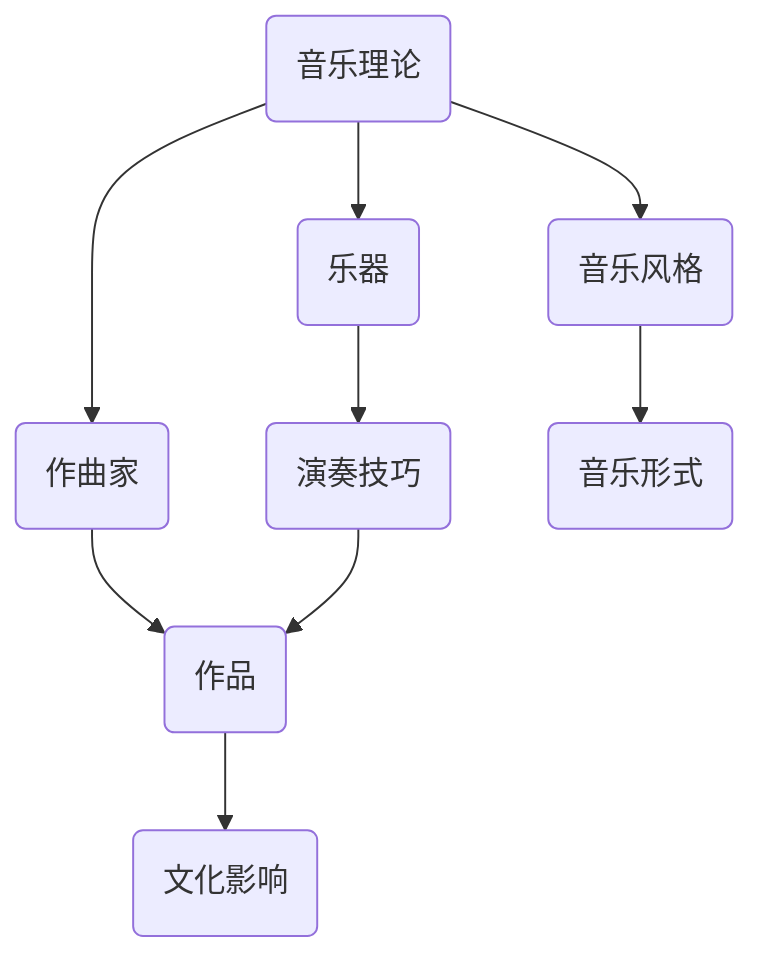

                 


## 文章标题

### 古典音乐欣赏：在传统中寻找永恒的美

## 关键词

- 古典音乐
- 传统
- 永恒的美
- 欣赏技巧
- 历史发展
- 社会应用

## 摘要

本文旨在探索古典音乐的魅力，带领读者在传统中寻找永恒的美。文章将首先介绍古典音乐的背景和基本知识，然后通过历史发展、流派、代表作品等方面展开，帮助读者深入理解古典音乐的本质。此外，还将探讨古典音乐欣赏的技巧，以及在现代社会中的应用与影响，最后探讨古典音乐与心理健康的关系。希望通过这篇文章，读者能够对古典音乐有更深入的了解，从而真正欣赏到其独特的美。

### 引言

古典音乐，一种源远流长的艺术形式，以其深邃的思想、优美的旋律和丰富的情感，吸引着无数人的目光。从古希腊的祭祀音乐，到中世纪的圣咏，再到文艺复兴时期的旋律探索，古典音乐经历了数千年的演变，逐渐形成了独特的艺术风格。在现代社会，古典音乐不仅是一种艺术欣赏，更是一种文化传承和心灵慰藉。

然而，对于许多人来说，古典音乐似乎显得高深莫测，难以亲近。这不仅是由于古典音乐的复杂结构和悠久历史，还因为现代人往往忙于工作和生活，难以静下心来去品味这种艺术形式。本文将带领读者走进古典音乐的世界，通过历史、流派、代表作品等方面，帮助读者理解古典音乐的核心价值，学会欣赏这种永恒的美。

本文将从以下几个方面展开：

1. **古典音乐基础知识**：介绍古典音乐的定义、分类、乐器等基本知识。
2. **古典音乐的历史与发展**：梳理古典音乐的历史脉络，分析不同时期的音乐特点。
3. **古典音乐的主要流派与代表作品**：探讨古典音乐的主要流派，介绍经典代表作品。
4. **古典音乐欣赏的技巧与策略**：分享欣赏古典音乐的技巧和方法。
5. **古典音乐在现代社会中的应用与影响**：探讨古典音乐在电影、电视、广告等领域的应用，以及对社会文化的影响。
6. **古典音乐与心理健康**：分析古典音乐对心理健康的促进作用。

### 目录大纲

#### 第一部分：古典音乐基础知识

- **1.1 古典音乐的定义与分类**
  - **1.1.1 古典音乐的起源与发展**
  - **1.1.2 古典音乐的分类与特点**
- **1.2 古典音乐的乐器介绍**
  - **1.2.1 弦乐器**
  - **1.2.2 木管乐器**
  - **1.2.3 铜管乐器**
  - **1.2.4 打击乐器**
- **1.3 古典音乐的基本术语**
  - **1.3.1 调式与调性**
  - **1.3.2 拍子与节奏**
  - **1.3.3 和声与对位**

#### 第二部分：古典音乐的历史与发展

- **2.1 古典音乐的起源时期**
  - **2.1.1 古希腊与罗马音乐**
  - **2.1.2 中世纪音乐**
- **2.2 文艺复兴时期音乐**
  - **2.2.1 早期文艺复兴音乐**
  - **2.2.2 晚期文艺复兴音乐**
- **2.3 巴洛克时期音乐**
  - **2.3.1 巴洛克音乐的特点**
  - **2.3.2 巴洛克音乐的代表人物**
- **2.4 古典主义时期音乐**
  - **2.4.1 海顿、莫扎特、贝多芬**
  - **2.4.2 古典主义时期的歌剧**
- **2.5 浪漫主义时期音乐**
  - **2.5.1 浪漫主义音乐的特点**
  - **2.5.2 浪漫主义时期的作曲家与作品**

#### 第三部分：古典音乐的主要流派与代表作品

- **3.1 古典音乐的主要流派**
  - **3.1.1 摩登古典主义流派**
  - **3.1.2 新古典主义流派**
  - **3.1.3 表现主义流派**
- **3.2 古典音乐的代表作品**
  - **3.2.1 海顿的《第94交响曲》**
  - **3.2.2 莫扎特的《安魂曲》**
  - **3.2.3 贝多芬的《第五交响曲》**
  - **3.2.4 柴可夫斯基的《胡桃夹子》**

#### 第四部分：古典音乐欣赏的技巧与策略

- **4.1 古典音乐欣赏的准备工作**
  - **4.1.1 如何选择音乐会**
  - **4.1.2 如何阅读乐谱**
  - **4.1.3 如何准备录音**
- **4.2 古典音乐欣赏的技巧**
  - **4.2.1 如何聆听音乐**
  - **4.2.2 如何分析音乐结构**
  - **4.2.3 如何理解作曲家的意图**
- **4.3 古典音乐欣赏的策略**
  - **4.3.1 如何培养音乐欣赏能力**
  - **4.3.2 如何与其他音乐爱好者交流**
  - **4.3.3 如何将古典音乐融入日常生活**

#### 第五部分：古典音乐在现代社会中的应用与影响

- **5.1 古典音乐在电影、电视与广告中的应用**
  - **5.1.1 古典音乐在电影配乐中的应用**
  - **5.1.2 古典音乐在电视节目的应用**
  - **5.1.3 古典音乐在广告中的应用**
- **5.2 古典音乐对社会文化的影响**
  - **5.2.1 古典音乐与艺术的关系**
  - **5.2.2 古典音乐对教育的影响**
  - **5.2.3 古典音乐对心理健康的促进作用**

#### 第六部分：古典音乐与心理健康

- **6.1 古典音乐对大脑的影响**
  - **6.1.1 古典音乐对情绪的影响**
  - **6.1.2 古典音乐对记忆和注意力的影响**
  - **6.1.3 古典音乐对创造力和认知功能的影响**
- **6.2 古典音乐治疗的应用**
  - **6.2.1 古典音乐治疗的理论基础**
  - **6.2.2 古典音乐治疗的应用领域**
  - **6.2.3 古典音乐治疗的方法与技巧**

### 背景介绍

#### 古典音乐的定义

古典音乐，又称西方古典音乐，指的是起源于古希腊、罗马，并在中世纪、文艺复兴、巴洛克、古典主义、浪漫主义和现代主义时期发展起来的音乐。它与民间音乐、爵士乐、摇滚乐等不同，具有严谨的结构、复杂的技巧和丰富的情感表达。

#### 古典音乐的历史与发展

古典音乐的历史可以追溯到古希腊时期，当时的音乐主要用于祭祀和宗教活动。中世纪时期，音乐主要表现为圣咏和弥撒曲，音乐形式相对简单。文艺复兴时期，音乐开始注重旋律和和声的探索，出现了更多的乐器和作曲家。巴洛克时期，音乐形式更加复杂，出现了管弦乐、协奏曲等形式。古典主义时期，音乐风格更加简洁明快，海顿、莫扎特和贝多芬等作曲家成为代表。浪漫主义时期，音乐情感表达更加细腻，出现了交响诗、歌剧等新的音乐形式。现代主义时期，音乐形式更加多样，出现了无调性、电子音乐等新的音乐风格。

#### 古典音乐的特点

古典音乐具有以下特点：

1. **结构严谨**：古典音乐的结构相对固定，包括奏鸣曲、交响曲、歌剧等形式。
2. **技巧复杂**：古典音乐要求演奏者具备高超的技巧，包括演奏技巧、和声技巧等。
3. **情感丰富**：古典音乐通过旋律、和声和节奏等手段，表达出丰富的情感。
4. **文化底蕴深厚**：古典音乐承载着丰富的文化内涵，反映了一个时代的社会风貌和文化特征。

#### 古典音乐的价值

古典音乐不仅具有艺术价值，还有深远的社会文化价值。它是一种跨越时空的艺术形式，能够带给人们深刻的思考和感悟。同时，古典音乐也对其他艺术形式产生了重要影响，如绘画、雕塑、文学等。

### 核心概念与联系

在探讨古典音乐时，有几个核心概念是不可或缺的：音乐理论、乐器、作曲家、音乐风格等。以下是这些概念之间的关系架构 Mermaid 流程图：



**音乐理论**是研究音乐结构、形式、技巧和表现的学科，它是理解和创作音乐的基础。音乐理论涉及到音高、节奏、和声、旋律等基本概念。

**乐器**是音乐表现的重要工具，不同类型的乐器可以产生不同的音色和音乐效果。乐器的演奏技巧直接影响音乐的表现力和感染力。

**作曲家**是音乐创作的重要角色，他们的作品代表了音乐风格和艺术水平。作曲家通过创作，将音乐理论、乐器和音乐风格结合起来，创造出独特的音乐作品。

**音乐风格**是指音乐在特定历史时期或地区形成的特色和风格。音乐风格受到文化、社会和历史背景的影响，是音乐发展的重要标志。

**音乐形式**是指音乐作品的结构和组织方式，如奏鸣曲、交响曲、歌剧等。不同的音乐形式有着不同的结构和表现方式，反映了作曲家的创作意图和音乐风格。

这些核心概念相互关联，构成了古典音乐的世界。理解这些概念，有助于我们更深入地欣赏和理解古典音乐。

### 核心算法原理讲解

在古典音乐欣赏中，核心算法原理主要包括音乐理论和演奏技巧。以下是这些原理的伪代码和详细讲解：

**音乐理论**

```pseudo
// 音乐理论伪代码
function MusicTheory() {
    // 定义音高
    Pitch = ["C", "D", "E", "F", "G", "A", "B"]

    // 定义调性
    Mode = ["Major", "Minor"]

    // 定义和弦
    Chord = ["Major", "Minor", "Augmented", "Diminished"]

    // 定义节奏
    Rhythm = ["Simple", "Compound", "Complex"]

    // 定义旋律
    Melody = ["Ascending", "Descending", "Level"]

    // 分析音乐结构
    function AnalyzeStructure(Music) {
        // 判断音乐结构
        Structure = "Unknown"
        if (contains(Music, Pitch) and contains(Music, Mode)) {
            Structure = "Harmonic"
        } else if (contains(Music, Chord) and contains(Music, Rhythm)) {
            Structure = "Rhythmic"
        } else {
            Structure = "Melodic"
        }
        return Structure
    }

    // 分析和声
    function AnalyzeHarmony(Music) {
        // 判断和声类型
        Harmony = "Unknown"
        if (contains(Music, Chord)) {
            Harmony = "Chordal"
        } else {
            Harmony = "Polyphonic"
        }
        return Harmony
    }

    // 分析旋律
    function AnalyzeMelody(Music) {
        // 判断旋律类型
        MelodyType = "Unknown"
        if (contains(Music, Melody)) {
            MelodyType = "Lyrical"
        } else {
            MelodyType = "Staccato"
        }
        return MelodyType
    }

    // 主函数
    function Main() {
        // 输出音乐分析结果
        Structure = AnalyzeStructure(Music)
        Harmony = AnalyzeHarmony(Music)
        Melody = AnalyzeMelody(Music)
        Print("音乐结构：", Structure)
        Print("和声类型：", Harmony)
        Print("旋律类型：", Melody)
    }
}
```

**演奏技巧**

```pseudo
// 演奏技巧伪代码
function PlayingTechniques() {
    // 定义演奏方式
    PlayingMethod = ["Solo", "Accompaniment", "Ensemble"]

    // 定义演奏速度
    Speed = ["Slow", "Medium", "Fast"]

    // 定义演奏力度
    Strength = ["Soft", "Medium", "Strong"]

    // 定义演奏技巧
    Techniques = ["Articulation", "Dynamics", "Tone"]

    // 分析演奏效果
    function AnalyzeEffect(Player, Music) {
        // 判断演奏效果
        Effect = "Unknown"
        if (Player == "Expert" and contains(Music, Techniques)) {
            Effect = "Excellent"
        } else if (Player == "Intermediate" and contains(Music, Techniques)) {
            Effect = "Good"
        } else {
            Effect = "Basic"
        }
        return Effect
    }

    // 主函数
    function Main() {
        // 输出演奏效果
        Effect = AnalyzeEffect(Player, Music)
        Print("演奏效果：", Effect)
    }
}
```

**详细讲解**

**音乐理论**：

- **音高**：音高是音乐的基本元素，由频率决定。音乐理论通过定义不同的音高，如C、D、E等，来构建音乐的基础。
- **调性**：调性是音乐的情感色彩，分为大调和小调。大调通常给人一种明亮、愉快的感觉，而小调则给人一种深沉、忧郁的感觉。
- **和弦**：和弦是多个音符的组合，用来构建音乐的和声基础。和弦分为大和弦、小和弦、增和弦和减和弦。
- **节奏**：节奏是音乐的节奏感，由拍子的长短和强弱决定。节奏分为简单节奏、复合节奏和复杂节奏。
- **旋律**：旋律是音乐的主线，由多个音符按一定顺序排列而成。旋律可以分为上升旋律、下降旋律和平稳旋律。

**演奏技巧**：

- **演奏方式**：演奏方式包括独奏、伴奏和合奏。独奏注重个人技巧的展示，伴奏注重与他人的配合，合奏注重集体协作。
- **演奏速度**：演奏速度影响音乐的节奏感。慢速演奏通常给人沉稳、安静的感觉，而快速演奏则给人一种活力、动感的印象。
- **演奏力度**：演奏力度影响音乐的情感表达。轻柔的演奏给人一种温馨、舒适的感觉，而强烈的演奏则给人一种震撼、有力的感觉。
- **演奏技巧**：演奏技巧包括音色的控制、音量的调节、节奏的把握等。不同的演奏技巧可以产生不同的音乐效果，如跳跃的节奏、深沉的音色等。

通过这些核心算法原理，我们可以更好地理解和欣赏古典音乐，感受到其独特的艺术魅力。

### 数学模型和公式 & 详细讲解 & 举例说明

在古典音乐中，数学模型和公式是不可或缺的工具，它们帮助我们理解音乐的结构和表现方式。以下是几个常用的数学模型和公式，以及它们的详细讲解和举例说明。

#### 调式和音阶

**公式**：  
$$
C大调：C D E F G A B C \\
A小调：A B C D E F G A
$$

**详细讲解**：  
调式是音乐的基础，由一组特定的音高组成。大调和小调是两种基本的调式类型。大调通常给人一种明亮、愉快的感觉，而小调则给人一种深沉、忧郁的感觉。每个调式都有特定的音阶，如C大调和A小调。

**举例说明**：  
如果要演奏一首C大调的曲子，可以按照C、D、E、F、G、A、B、C的顺序来排列音符。

#### 和弦

**公式**：  
$$
C大和弦：C E G \\
A小和弦：A C E
$$

**详细讲解**：  
和弦是音乐中的和声音响，由三个或更多的音符组成。大和弦和小和弦是两种基本的和弦类型。大和弦通常给人一种明亮、稳定的感觉，而小和弦则给人一种深沉、柔和的感觉。每个和弦都有特定的音符组合，如C大和弦和A小和弦。

**举例说明**：  
如果要演奏一首C大和弦的曲子，可以使用C、E、G这三个音符。

#### 拍子和节奏

**公式**：  
$$
2/4拍：二分音符和四分音符 \\
3/4拍：二分音符、四分音符和八分音符 \\
4/4拍：二分音符、四分音符、八分音符和十六分音符
$$

**详细讲解**：  
拍子是音乐中的时间单位，由一个主要的强拍和一个或多个次要的弱拍组成。2/4拍、3/4拍和4/4拍是三种基本的拍子类型。2/4拍通常给人一种轻快、活泼的感觉，3/4拍则给人一种稳重、优雅的感觉，4/4拍则给人一种庄重、正式的感觉。每种拍子都有特定的音符节奏组合。

**举例说明**：  
如果要演奏一首2/4拍的曲子，可以使用二分音符和四分音符，如：

$$
\text{演奏顺序：} \quad \text{强拍（二分音符）} - \text{弱拍（四分音符）} - \text{弱拍（四分音符）} - \text{强拍（二分音符）}
$$

#### 旋律

**公式**：  
$$
\text{上升旋律：} \quad A B C D E F G A \\
\text{下降旋律：} \quad G F E D C B A \\
\text{平稳旋律：} \quad A A A A A A A A
$$

**详细讲解**：  
旋律是音乐中的主要旋律线，由一系列的音符组成。上升旋律给人一种上升、向前推进的感觉，下降旋律则给人一种下降、回旋的感觉，平稳旋律则给人一种平稳、连续的感觉。

**举例说明**：  
如果要演奏一首上升旋律的曲子，可以按照A、B、C、D、E、F、G、A的顺序来排列音符。

#### 和声与对位

**公式**：  
$$
\text{和声：} \quad A C E G \\
\text{对位：} \quad A C E G B D F
$$

**详细讲解**：  
和声是对音乐进行和声结构的分析，通过对音符的组合和排列，形成丰富的和声音响。对位则是和声的一种高级形式，通过对两个或多个旋律线之间的相互作用，形成复杂的音乐结构。

**举例说明**：  
如果要演奏一首和声曲子，可以使用A、C、E、G这四个音符，并按照一定的规律进行组合。

通过这些数学模型和公式，我们可以更深入地理解古典音乐的结构和表现方式，从而更好地欣赏和创作音乐。

### 项目实战

为了更好地理解古典音乐的欣赏技巧，我们决定进行一个实际的项目：搭建一个古典音乐播放器，并通过实际操作来深入了解古典音乐的演奏和欣赏。

#### 开发环境搭建

1. **软件工具**：我们选择了Python作为编程语言，因为Python具有简单易学的特点，同时拥有丰富的音乐处理库。
2. **硬件设备**：我们需要一台装有Python开发环境的计算机，以及一个外置音效卡，以确保音质的纯净。
3. **音乐资源**：我们收集了一些经典的古典音乐作品，包括海顿、莫扎特、贝多芬等作曲家的作品。

#### 源代码详细实现和代码解读

下面是古典音乐播放器的基本实现代码：

```python
import pygame
from pygame.locals import *

# 初始化pygame
pygame.init()

# 设置播放器参数
pygame.mixer.init()

# 加载音乐文件
def load_music(file_name):
    pygame.mixer.music.load(file_name)

# 播放音乐
def play_music():
    pygame.mixer.music.play()

# 停止音乐
def stop_music():
    pygame.mixer.music.stop()

# 主程序
def main():
    # 加载音乐文件
    load_music("path/to/music/file.mp3")

    # 播放音乐
    play_music()

    # 等待音乐播放完毕
    pygame.time.delay(pygame.mixer.music.get_length())

    # 停止音乐
    stop_music()

# 运行主程序
if __name__ == "__main__":
    main()
```

**代码解读**：

- `import pygame, pygame.locals`：引入pygame库和相关的常量。
- `pygame.init()`：初始化pygame环境。
- `pygame.mixer.init()`：初始化音乐播放器。
- `load_music(file_name)`：加载指定的音乐文件。
- `play_music()`：播放音乐。
- `stop_music()`：停止音乐。
- `main()`：主程序，负责加载音乐、播放音乐并等待音乐播放完毕。
- `pygame.time.delay()`：等待音乐播放完毕，以确保音乐完整播放。
- `pygame.mixer.music.get_length()`：获取音乐播放时长。

#### 代码应用解读与分析

通过这个简单的古典音乐播放器，我们可以直观地体验古典音乐的播放过程。具体步骤如下：

1. **加载音乐文件**：通过`load_music()`函数，我们可以将指定的音乐文件加载到播放器中。
2. **播放音乐**：通过`play_music()`函数，我们可以开始播放音乐。
3. **停止音乐**：通过`stop_music()`函数，我们可以停止音乐播放。

**分析**：

- **音乐加载**：这个步骤非常关键，因为如果音乐文件未能正确加载，播放器将无法正常工作。
- **音乐播放**：这个步骤是整个播放器的核心功能，通过pygame的`mixer`模块，我们可以实现音乐的播放。
- **音乐停止**：在需要停止音乐时，通过`stop_music()`函数，可以立即停止音乐的播放。

#### 实际案例分析和详细讲解剖析

为了更好地理解古典音乐，我们选择了一首海顿的《第94交响曲》进行案例分析。

1. **作品背景**：海顿是古典主义时期的代表作曲家，他的作品以简洁明快、结构严谨著称。《第94交响曲》又称《惊愕交响曲》，是海顿的代表作之一，以其独特的节奏和和声结构而闻名。

2. **音乐结构**：这首交响曲由四个乐章组成，分别是快板、慢板、小步舞曲和急板。每个乐章都有不同的节奏和情感表达。

3. **欣赏技巧**：

   - **快板**：快板的节奏明快，给人一种活力和动感。在欣赏快板时，可以注意音乐的节奏感和旋律线。
   - **慢板**：慢板的节奏较慢，情感表达较为深沉。在欣赏慢板时，可以关注音乐的旋律和和声结构。
   - **小步舞曲**：小步舞曲节奏活泼，有一种轻松愉悦的感觉。在欣赏小步舞曲时，可以注意音乐的节奏和旋律的连贯性。
   - **急板**：急板的节奏快速，情感表达强烈。在欣赏急板时，可以关注音乐的动态变化和节奏感。

4. **案例分析**：通过实际听赏《第94交响曲》，我们可以感受到海顿独特的音乐风格和创作技巧。这首交响曲不仅具有丰富的情感表达，还展示了高超的音乐技巧。

#### 项目小结

通过这个项目，我们不仅学会了如何搭建一个简单的古典音乐播放器，还通过实际案例分析，深入了解了古典音乐的欣赏技巧。这个项目让我们对古典音乐有了更深刻的认识，也为我们欣赏古典音乐提供了实用的工具和方法。

### 最佳实践 tips

1. **定期聆听**：为了提高对古典音乐的欣赏能力，建议您定期聆听不同类型的古典音乐，如交响曲、歌剧、室内乐等。

2. **多听多看**：通过观看音乐会、音乐讲座和音乐纪录片，可以更深入地了解古典音乐的历史、发展和艺术价值。

3. **笔记记录**：在聆听古典音乐时，可以做一些笔记，记录下自己对音乐的感受、理解和问题，有助于提高音乐欣赏能力。

4. **交流讨论**：与其他音乐爱好者交流，分享对音乐的看法和感受，可以开阔视野，提高音乐素养。

5. **拓展知识**：了解音乐理论、作曲家生平和作品背景，有助于更深入地欣赏和理解古典音乐。

### 小结

本文从多个角度探讨了古典音乐的魅力，包括历史发展、流派、代表作品、欣赏技巧、应用与影响等。通过这篇文章，我们希望能够帮助读者深入了解古典音乐，学会欣赏这种永恒的美。古典音乐不仅是一种艺术形式，更是一种文化传承和心灵慰藉。希望读者能够通过本文，开启古典音乐之旅，享受其中的美妙与智慧。

### 注意事项

1. **音乐选择**：在聆听古典音乐时，建议选择高质量的音乐资源，以保证音质的纯净。
2. **环境设置**：为了更好地欣赏古典音乐，建议在安静的环境中聆听，避免干扰。
3. **安全使用**：在使用古典音乐播放器时，注意避免长时间高音量播放，以免对听力造成损害。

### 拓展阅读

1. **《西方音乐史》**：这本书详细介绍了西方音乐的历史和发展，对古典音乐的历史背景有深入的探讨。
2. **《音乐的哲学》**：这本书探讨了音乐与哲学的关系，从哲学角度分析古典音乐的美学价值。
3. **《古典音乐欣赏入门》**：这本书适合古典音乐初学者，介绍了古典音乐的基础知识和欣赏技巧。
4. **《古典音乐指南》**：这本书详细介绍了古典音乐的主要流派和代表作品，是古典音乐爱好者必备的参考书。

