                 

# 《可持续计算：从硬件到软件的全栈优化》

## 文章关键词

- 可持续计算
- 硬件优化
- 软件优化
- 低功耗
- 数据中心
- 环境影响
- 全栈优化

## 摘要

在当今全球气候变化和资源短缺的背景下，可持续计算作为一种应对策略显得尤为重要。本文从硬件到软件的全栈角度，深入探讨了可持续计算的概念、关键原则以及实施策略。首先，我们介绍了可持续计算的基本概念和重要性，然后详细阐述了硬件层面的可持续优化方法，包括低功耗硬件技术和绿色数据中心设计。接着，我们转向软件层面的优化，讨论了编程语言选择、应用性能优化以及能耗管理与监控。最后，通过实际案例研究，展示了全栈优化在实践中的应用，并展望了可持续计算的未来发展趋势和面临的挑战。

## 目录

1. **可持续计算概述**
   1.1 **可持续计算的定义与背景**
   1.2 **可持续计算的三大原则**
   1.3 **可持续计算与未来发展趋势**

2. **硬件层面的可持续优化**
   2.1 **硬件设计原则与可持续性**
   2.2 **低功耗硬件技术**
   2.3 **绿色数据中心设计与实现**

3. **软件层面的可持续优化**
   3.1 **软件优化策略与方法**
   3.2 **编程语言与工具的选择**
   3.3 **应用性能优化实践**

4. **能耗管理与监控**
   4.1 **能耗监控工具与技术**
   4.2 **能耗模型与预测**
   4.3 **节能策略与案例分析**

5. **数据中心的可持续性**
   5.1 **数据中心的碳排放问题**
   5.2 **数据中心能源效率优化**
   5.3 **可再生能源在数据中心的应用**

6. **全栈优化案例研究**
   6.1 **企业级数据中心的可持续优化**
   6.2 **云计算服务提供商的绿色转型**
   6.3 **互联网公司的全栈优化实践**

7. **可持续计算的未来与挑战**
   7.1 **可持续计算的未来趋势**
   7.2 **技术创新与可持续性**
   7.3 **可持续计算的挑战与解决方案**

## 第一章：可持续计算概述

### 1.1 可持续计算的定义与背景

可持续计算（Sustainable Computing）是一种旨在减少计算对环境负面影响，同时提高资源利用效率的计算方法。它涉及到计算机硬件、软件、网络和数据中心的设计、开发、运营和维护等多个方面。

可持续计算的定义可以从三个方面来理解：

1. **环境影响最小化**：通过降低能耗、减少废物排放、采用可再生资源等方式，减少计算活动对环境的负面影响。
2. **资源效率优化**：提高计算系统的能效比，通过技术创新和管理优化，使计算资源得到更高效的利用。
3. **社会责任**：将可持续发展理念融入计算技术的发展和应用中，促进社会和经济的长期健康发展。

可持续计算的出现源于以下几个方面：

- **全球气候变化**：随着全球温室气体排放量的不断增加，气候变化成为全球性的挑战。可持续计算通过减少计算能耗，有助于减缓气候变化。
- **资源短缺**：地球上的自然资源（如石油、煤炭等）日益减少，可持续计算通过提高资源利用效率，有助于缓解资源短缺问题。
- **社会责任**：企业和社会越来越重视可持续发展，可持续计算作为一种社会责任的体现，受到广泛关注。

### 1.2 可持续计算的三大原则

可持续计算遵循以下三大原则：

- **效率优化**：通过优化算法、硬件设计和软件架构，提高计算系统的效率，减少能耗和资源消耗。
- **可持续能源使用**：采用可再生能源（如太阳能、风能等），减少对化石燃料的依赖，降低碳排放。
- **环境影响最小化**：通过设计、开发、运营和维护等各个环节，减少计算活动对环境的影响，如减少废物排放、降低噪音污染等。

### 1.3 可持续计算与未来发展趋势

随着计算技术的快速发展，可持续计算在未来的发展中将面临以下趋势：

- **技术创新**：新的计算技术和硬件架构（如量子计算、边缘计算等）将为可持续计算提供新的解决方案。
- **产业融合**：可持续计算将与其他领域（如能源、环境、社会等）深度融合，推动跨领域创新。
- **政策支持**：政府和企业将加大对可持续计算的投入和监管，推动可持续计算的发展。
- **社会意识**：公众对可持续性的关注度不断提高，可持续计算将成为计算技术发展的重要方向。

## 第二章：硬件层面的可持续优化

### 2.1 硬件设计原则与可持续性

硬件设计是可持续计算的关键环节，其原则和策略直接影响到计算系统的能效和环境影响。以下是硬件设计原则与可持续性的关键点：

- **低功耗设计**：通过减少硬件组件的功耗，降低整个计算系统的能耗。例如，采用低功耗CPU和GPU，优化电路设计，使用节能的内存和存储设备。
- **模块化设计**：模块化设计使得硬件组件可以方便地更换和升级，减少了废弃物的产生，延长了设备的使用寿命。
- **高效散热**：通过优化散热设计，减少系统发热，提高计算效率，同时降低能耗。
- **环境友好材料**：使用环保材料，减少有害物质的排放，降低对环境的影响。
- **可再生资源**：使用可再生资源（如回收金属、生物塑料等）制造硬件组件，减少对自然资源的消耗。

### 2.2 低功耗硬件技术

低功耗硬件技术是可持续计算的重要组成部分，以下是一些关键的低功耗技术：

- **动态电压和频率调节技术（DVFS）**：通过调节CPU和GPU的电压和频率，实现功耗和性能的动态调整，从而降低能耗。
- **低功耗处理器架构**：设计低功耗的处理器架构，如ARM架构，以提高能效比。
- **新型存储技术**：如非易失性存储器（NVM），具有较低的能耗和更长的使用寿命。
- **无线充电技术**：通过无线充电，减少电缆连接，降低能耗和噪音污染。

### 2.3 绿色数据中心设计与实现

绿色数据中心是可持续计算的重要应用场景，其设计要点包括：

- **能源效率**：通过采用高效电源供应系统（EPS）、冷却系统和智能管理系统，提高能源利用效率。
- **分布式架构**：通过分布式架构，减少数据传输距离，降低能耗。
- **废物回收与处理**：建立废物回收和再利用机制，减少废弃物对环境的影响。
- **可再生能源使用**：通过使用太阳能、风能等可再生能源，减少对化石燃料的依赖，降低碳排放。

## 第三章：软件层面的可持续优化

### 3.1 软件优化策略与方法

软件优化是可持续计算的重要组成部分，以下是一些常见的软件优化策略和方法：

- **算法优化**：通过改进算法，降低计算复杂度，减少计算资源消耗。例如，采用更高效的排序算法、搜索算法等。
- **代码优化**：通过优化代码结构、减少冗余代码、提高代码可读性，提高计算效率。
- **资源管理**：优化系统资源管理，如CPU、内存、磁盘等，提高资源利用率。
- **并行计算**：通过并行计算，提高计算速度，降低能耗。例如，使用多线程、GPU加速等。
- **优化数据库**：通过优化数据库设计、索引策略、查询优化等，提高数据库的访问速度和效率。

### 3.2 编程语言与工具的选择

编程语言和工具的选择对软件的可持续性有重要影响，以下是一些关键点：

- **高效编程语言**：选择高效、易用的编程语言，如Python、Java、C++等，可以提高开发效率，降低能耗。
- **开发工具**：选择适合的集成开发环境（IDE）和代码分析工具，可以帮助发现和修复潜在的性能问题。
- **持续集成和持续部署（CI/CD）**：通过CI/CD流程，自动化代码测试和部署，提高开发效率，降低人为错误。
- **开源工具**：开源工具通常具有较好的性能和可持续性，如Apache、MySQL、Linux等。

### 3.3 应用性能优化实践

应用性能优化是软件可持续性的关键，以下是一些具体实践：

- **性能测试**：通过性能测试，识别系统瓶颈和性能问题，为优化提供依据。
- **缓存技术**：使用缓存技术，减少数据库访问次数，提高系统响应速度。
- **数据库优化**：通过优化数据库设计、索引策略、查询优化等，提高数据库性能。
- **网络优化**：通过优化网络架构、使用CDN（内容分发网络）等，提高网络传输速度和稳定性。
- **自动化监控**：通过自动化监控工具，实时监测系统性能，及时发现和解决问题。

## 第四章：能耗管理与监控

### 4.1 能耗监控工具与技术

能耗管理与监控是可持续计算的核心，以下介绍一些常用的能耗监控工具和技术：

- **能耗监控工具**：如Nmon、PowerTOP、EnergyAware等，可以实时监测系统的能耗情况。
- **能耗模型**：通过建立能耗模型，预测系统的能耗情况，为优化提供依据。
- **能耗监控技术**：如无线传感器网络（WSN）、物联网（IoT）等，可以实现远程监控和自动化控制。

### 4.2 能耗模型与预测

能耗模型是能耗管理的基础，以下介绍一些常用的能耗模型和预测方法：

- **基于物理的能耗模型**：通过分析硬件组件的能耗特性，建立物理模型，如CPU、GPU、内存等。
- **基于数据的能耗模型**：通过收集和分析系统运行数据，建立数据驱动的能耗模型。
- **预测方法**：如时间序列预测、回归分析、机器学习等，可以用于预测系统的未来能耗。

### 4.3 节能策略与案例分析

节能策略是能耗管理的关键，以下介绍一些常见的节能策略和案例分析：

- **动态电源管理**：通过动态调整硬件组件的电源状态，降低能耗。如CPU频率调节、硬盘休眠等。
- **虚拟化技术**：通过虚拟化技术，提高资源利用率，减少能耗。如虚拟CPU、虚拟内存等。
- **能耗优化算法**：通过设计能耗优化算法，降低系统总体能耗。如能耗感知调度算法、能耗均衡算法等。
- **案例分析**：如某大型数据中心通过优化冷却系统、采用绿色能源等，实现了显著的能耗降低。

## 第五章：数据中心的可持续性

### 5.1 数据中心的碳排放问题

数据中心的碳排放问题是可持续性的重要挑战，以下介绍一些关键点：

- **碳排放来源**：数据中心的碳排放主要来自电力消耗、设备制造和运输、冷却系统等。
- **碳排放计算**：通过建立碳排放模型，计算数据中心的碳排放量。
- **减排措施**：如采用绿色能源、优化冷却系统、节能设备采购等，减少碳排放。

### 5.2 数据中心能源效率优化

数据中心能源效率优化是可持续性的关键，以下介绍一些优化方法：

- **节能设备**：采用高效的电源供应系统、冷却系统和服务器设备，提高能源效率。
- **冷却系统优化**：通过优化冷却系统，降低能耗。如采用水冷、空气冷却等。
- **能源管理**：通过能源管理系统，实时监控和调整能源消耗，实现能源优化。
- **分布式架构**：通过分布式架构，减少数据传输距离，降低能耗。

### 5.3 可再生能源在数据中心的应用

可再生能源在数据中心的应用是可持续性的重要方向，以下介绍一些关键点：

- **太阳能**：通过安装太阳能板，利用太阳能发电，减少对化石燃料的依赖。
- **风能**：在数据中心附近安装风力发电设备，利用风能发电。
- **储能技术**：通过储能技术，如电池储能、飞轮储能等，实现可再生能源的平稳供电。
- **多能互补**：通过多能互补，如太阳能与风能结合，实现能源供应的稳定性。

## 第六章：全栈优化案例研究

### 6.1 企业级数据中心的可持续优化

企业级数据中心的可持续优化是一个复杂的过程，以下介绍一个案例：

**案例背景**：某大型企业拥有一个大规模数据中心，为了降低碳排放和能耗，决定进行可持续优化。

**优化措施**：
- **能源效率优化**：采用高效服务器和电源供应系统，提高能源利用效率。
- **冷却系统优化**：采用水冷系统，降低冷却能耗。
- **可再生能源使用**：安装太阳能板和风力发电设备，实现部分可再生能源自给。
- **虚拟化技术**：通过虚拟化技术，提高资源利用率，减少能耗。

**成果**：通过上述措施，数据中心的能耗降低了30%，碳排放减少了20%。

### 6.2 云计算服务提供商的绿色转型

云计算服务提供商的绿色转型是一个重要趋势，以下介绍一个案例：

**案例背景**：某云计算服务提供商为了应对环境挑战，决定进行绿色转型。

**转型措施**：
- **数据中心优化**：采用高效服务器、虚拟化技术和智能能源管理，提高能源效率。
- **可再生能源使用**：购买可再生能源证书（REC），实现数据中心的全可再生能源供电。
- **碳足迹监测**：建立碳足迹监测系统，实时监控碳排放情况。

**成果**：通过绿色转型，云计算服务提供商实现了100%可再生能源供电，碳排放减少了50%。

### 6.3 互联网公司的全栈优化实践

互联网公司的全栈优化实践是可持续计算的重要应用，以下介绍一个案例：

**案例背景**：某互联网公司为了提升用户体验和降低能耗，决定进行全栈优化。

**优化措施**：
- **算法优化**：通过改进算法，提高数据处理速度和效率。
- **代码优化**：通过代码优化，减少资源消耗和延迟。
- **能耗监控**：通过能耗监控工具，实时监控系统能耗情况。
- **绿色数据中心**：选择绿色数据中心，降低碳排放。

**成果**：通过全栈优化，互联网公司提升了用户体验，能耗降低了20%，碳排放减少了15%。

## 第七章：可持续计算的未来与挑战

### 7.1 可持续计算的未来趋势

可持续计算的未来发展趋势包括：

- **技术创新**：新的计算技术和硬件架构将为可持续计算提供更多解决方案。
- **产业融合**：可持续计算将与其他领域（如能源、环境、社会等）深度融合。
- **政策支持**：政府和企业将加大对可持续计算的投入和监管。
- **社会意识**：公众对可持续性的关注度不断提高。

### 7.2 技术创新与可持续性

技术创新是可持续计算的关键，以下介绍一些关键技术创新：

- **量子计算**：量子计算具有巨大的计算潜力，有望解决当前计算无法解决的问题。
- **边缘计算**：边缘计算将计算能力下沉到网络边缘，减少数据传输距离，降低能耗。
- **人工智能**：人工智能将在能耗优化、故障预测等方面发挥重要作用。

### 7.3 可持续计算的挑战与解决方案

可持续计算面临的挑战包括：

- **技术成熟度**：一些关键技术创新尚未成熟，需要进一步研发。
- **成本问题**：可持续计算的技术和设备成本较高，需要降低成本。
- **数据隐私与安全**：可持续计算在数据隐私和安全方面面临挑战，需要加强保护。

解决方案包括：

- **技术研发**：加大对关键技术的研发投入，提高技术成熟度。
- **政策支持**：制定相关政策和标准，推动可持续计算的发展。
- **成本降低**：通过规模效应和产业链协同，降低可持续计算的成本。
- **安全保护**：加强数据隐私和安全保护，确保可持续计算的安全性和可靠性。

## 作者信息

作者：AI天才研究院/AI Genius Institute & 禅与计算机程序设计艺术 /Zen And The Art of Computer Programming

## 结束语

可持续计算是应对全球气候变化和资源短缺问题的重要策略，通过硬件和软件的全栈优化，我们可以实现计算系统的可持续性。本文从多个角度探讨了可持续计算的概念、原则、技术和实践，并通过案例研究展示了其在实际应用中的效果。未来，随着技术的不断创新，可持续计算将发挥越来越重要的作用，为人类社会的可持续发展贡献力量。

### 附录：核心概念与联系

为了更好地理解本文的核心概念和联系，我们可以使用Mermaid流程图来展示不同部分之间的逻辑关系。

```mermaid
graph TD
    A[可持续计算概述] --> B[硬件层面优化]
    A --> C[软件层面优化]
    A --> D[能耗管理与监控]
    A --> E[数据中心可持续性]
    B --> F[硬件设计原则]
    B --> G[低功耗技术]
    B --> H[绿色数据中心]
    C --> I[软件优化策略]
    C --> J[编程语言选择]
    C --> K[应用性能优化]
    D --> L[能耗监控工具]
    D --> M[能耗模型与预测]
    D --> N[节能策略]
    E --> O[碳排放问题]
    E --> P[能源效率优化]
    E --> Q[可再生能源应用]
    F --> R[低功耗设计]
    F --> S[模块化设计]
    F --> T[高效散热]
    F --> U[环境友好材料]
    G --> V[动态电压调节]
    G --> W[低功耗处理器]
    G --> X[新型存储技术]
    H --> Y[能源效率]
    H --> Z[分布式架构]
    H --> AA[废物回收与处理]
    I --> AB[算法优化]
    I --> AC[代码优化]
    I --> AD[资源管理]
    I --> AE[并行计算]
    J --> AF[高效编程语言]
    J --> AG[开发工具]
    J --> AH[CI/CD流程]
    J --> AI[开源工具]
    K --> AK[性能测试]
    K --> AL[缓存技术]
    K --> AM[数据库优化]
    K --> AN[网络优化]
    K --> AO[自动化监控]
    L --> AP[能耗监控工具]
    L --> AQ[能耗模型]
    L --> AR[预测方法]
    M --> AS[基于物理模型]
    M --> AT[数据驱动模型]
    M --> AU[预测方法]
    N --> AV[动态电源管理]
    N --> AW[虚拟化技术]
    N --> AX[能耗优化算法]
    O --> AY[碳排放来源]
    O --> AZ[碳排放计算]
    O --> BA[减排措施]
    P --> BB[节能设备]
    P --> BC[冷却系统优化]
    P --> BD[能源管理]
    P --> BE[分布式架构]
    Q --> BF[太阳能应用]
    Q --> BG[风能应用]
    Q --> BH[储能技术]
    Q --> BI[多能互补]
    R --> BJ[低功耗设计]
    R --> BK[模块化设计]
    R --> BL[高效散热]
    R --> BM[环境友好材料]
    S --> BN[模块化设计]
    S --> BO[低功耗设计]
    S --> BP[高效散热]
    S --> BQ[环境友好材料]
    T --> BR[高效散热]
    T --> BS[模块化设计]
    T --> BT[低功耗设计]
    T --> BU[环境友好材料]
    U --> BV[环境友好材料]
    U --> BW[模块化设计]
    U --> BX[低功耗设计]
    U --> BY[高效散热]
    V --> BZ[动态电压调节]
    V --> CA[低功耗处理器]
    V --> CB[新型存储技术]
    W --> CC[低功耗处理器]
    W --> CD[动态电压调节]
    W --> CE[新型存储技术]
    W --> CF[低功耗设计]
    X --> CG[新型存储技术]
    X --> CH[动态电压调节]
    X --> CI[低功耗设计]
    X --> CJ[环境友好材料]
    Y --> CK[能源效率]
    Y --> CL[分布式架构]
    Y --> CM[节能设备]
    Y --> CN[冷却系统优化]
    Y --> CO[废物回收与处理]
    Z --> CP[分布式架构]
    Z --> CQ[能源效率]
    Z --> CR[废物回收与处理]
    Z --> CS[节能设备]
    Z --> CT[冷却系统优化]
    AA --> CU[废物回收与处理]
    AA --> CV[节能设备]
    AA --> CW[能源效率]
    AA --> CX[分布式架构]
    I --> AD[资源管理]
    I --> AE[并行计算]
    I --> AF[高效编程语言]
    I --> AG[开发工具]
    I --> AH[CI/CD流程]
    I --> AI[开源工具]
    AD --> AJ[资源管理]
    AD --> AK[性能测试]
    AD --> AL[缓存技术]
    AD --> AM[数据库优化]
    AD --> AN[网络优化]
    AE --> AP[能耗监控工具]
    AE --> AQ[能耗模型]
    AE --> AR[预测方法]
    AF --> AG[开发工具]
    AF --> AH[CI/CD流程]
    AF --> AI[开源工具]
    AF --> AJ[资源管理]
    AG --> AI[开源工具]
    AG --> AJ[资源管理]
    AG --> AK[性能测试]
    AG --> AL[缓存技术]
    AG --> AM[数据库优化]
    AG --> AN[网络优化]
    AH --> AJ[资源管理]
    AH --> AK[性能测试]
    AH --> AL[缓存技术]
    AH --> AM[数据库优化]
    AH --> AN[网络优化]
    AI --> AJ[资源管理]
    AI --> AK[性能测试]
    AI --> AL[缓存技术]
    AI --> AM[数据库优化]
    AI --> AN[网络优化]
    AK --> AL[缓存技术]
    AK --> AM[数据库优化]
    AK --> AN[网络优化]
    AK --> AJ[资源管理]
    AL --> AM[数据库优化]
    AL --> AN[网络优化]
    AL --> AJ[资源管理]
    AM --> AN[网络优化]
    AM --> AJ[资源管理]
    AM --> AK[性能测试]
    AN --> AK[性能测试]
    AN --> AJ[资源管理]
    AN --> AL[缓存技术]
    AP --> AQ[能耗模型]
    AP --> AR[预测方法]
    AQ --> AR[预测方法]
    AQ --> AS[基于物理模型]
    AQ --> AT[数据驱动模型]
    AR --> AS[基于物理模型]
    AR --> AT[数据驱动模型]
    AS --> AT[数据驱动模型]
    AS --> AU[预测方法]
    AU --> AS[基于物理模型]
    AU --> AT[数据驱动模型]
    AU --> AV[动态电源管理]
    AU --> AW[虚拟化技术]
    AU --> AX[能耗优化算法]
    AV --> AW[虚拟化技术]
    AV --> AX[能耗优化算法]
    AV --> AU[预测方法]
    AW --> AX[能耗优化算法]
    AW --> AU[预测方法]
    AW --> AV[动态电源管理]
    AX --> AU[预测方法]
    AX --> AV[动态电源管理]
    AX --> AW[虚拟化技术]
    AY --> AZ[碳排放来源]
    AY --> BA[碳排放计算]
    AY --> BB[减排措施]
    AZ --> BB[减排措施]
    AZ --> BA[碳排放计算]
    AZ --> BZ[低功耗设计]
    BB --> BZ[低功耗设计]
    BB --> BC[冷却系统优化]
    BB --> BD[能源管理]
    BB --> BE[分布式架构]
    BC --> BD[能源管理]
    BC --> BE[分布式架构]
    BC --> BB[减排措施]
    BD --> BE[分布式架构]
    BD --> BB[减排措施]
    BD --> BC[冷却系统优化]
    BE --> BB[减排措施]
    BE --> BC[冷却系统优化]
    BE --> BD[能源管理]
    BF --> BG[风能应用]
    BF --> BH[储能技术]
    BF --> BI[多能互补]
    BF --> BG[太阳能应用]
    BG --> BH[储能技术]
    BG --> BI[多能互补]
    BG --> BG[风能应用]
    BG --> BF[太阳能应用]
    BG --> BH[储能技术]
    BG --> BI[多能互补]
    BG --> BF[太阳能应用]
    BH --> BI[多能互补]
    BH --> BG[风能应用]
    BH --> BF[太阳能应用]
    BH --> BI[多能互补]
    BI --> BG[风能应用]
    BI --> BH[储能技术]
    BI --> BF[太阳能应用]
    BI --> BG[风能应用]
    BJ --> BK[模块化设计]
    BJ --> BL[高效散热]
    BJ --> BM[环境友好材料]
    BJ --> BN[低功耗设计]
    BK --> BL[高效散热]
    BK --> BM[环境友好材料]
    BK --> BN[低功耗设计]
    BK --> BJ[模块化设计]
    BL --> BM[环境友好材料]
    BL --> BN[低功耗设计]
    BL --> BK[模块化设计]
    BM --> BN[低功耗设计]
    BM --> BL[高效散热]
    BM --> BK[模块化设计]
    BN --> BM[环境友好材料]
    BN --> BL[高效散热]
    BN --> BK[模块化设计]
    BZ --> CJ[低功耗设计]
    BZ --> CK[能源效率]
    BZ --> CL[分布式架构]
    BZ --> CM[节能设备]
    BZ --> CN[冷却系统优化]
    CK --> CL[分布式架构]
    CK --> CM[节能设备]
    CK --> CN[冷却系统优化]
    CK --> CK[能源效率]
    CL --> CM[节能设备]
    CL --> CN[冷却系统优化]
    CL --> CK[能源效率]
    CL --> CL[分布式架构]
    CM --> CN[冷却系统优化]
    CM --> CK[能源效率]
    CM --> CL[分布式架构]
    CM --> CM[节能设备]
    CN --> CK[能源效率]
    CN --> CL[分布式架构]
    CN --> CM[节能设备]
    CN --> CN[冷却系统优化]
    CP --> CQ[分布式架构]
    CP --> CR[节能设备]
    CP --> CS[冷却系统优化]
    CP --> CT[废物回收与处理]
    CQ --> CR[节能设备]
    CQ --> CS[冷却系统优化]
    CQ --> CT[废物回收与处理]
    CQ --> CQ[分布式架构]
    CR --> CS[冷却系统优化]
    CR --> CT[废物回收与处理]
    CR --> CQ[分布式架构]
    CR --> CR[节能设备]
    CS --> CT[废物回收与处理]
    CS --> CQ[分布式架构]
    CS --> CR[节能设备]
    CS --> CS[冷却系统优化]
    CT --> CQ[分布式架构]
    CT --> CR[节能设备]
    CT --> CS[冷却系统优化]
    CT --> CT[废物回收与处理]
    CU --> CV[节能设备]
    CU --> CW[能源效率]
    CU --> CX[分布式架构]
    CU --> CT[废物回收与处理]
    CV --> CW[能源效率]
    CV --> CX[分布式架构]
    CV --> CU[废物回收与处理]
    CV --> CV[节能设备]
    CW --> CX[分布式架构]
    CW --> CU[废物回收与处理]
    CW --> CV[节能设备]
    CW --> CW[能源效率]
    CX --> CU[废物回收与处理]
    CX --> CV[节能设备]
    CX --> CW[能源效率]
    CX --> CX[分布式架构]
    Y --> Z[分布式架构]
    Y --> AA[废物回收与处理]
    Y --> AB[碳排放问题]
    Z --> AA[废物回收与处理]
    Z --> AB[碳排放问题]
    Z --> Z[分布式架构]
    AA --> AB[碳排放问题]
    AA --> AA[废物回收与处理]
    AA --> AC[碳排放计算]
    AB --> AC[碳排放计算]
    AB --> AA[废物回收与处理]
    AB --> AB[碳排放问题]
```



### 附录：核心算法原理讲解

为了深入理解可持续计算中的核心算法原理，我们将使用伪代码来详细阐述一些关键算法，并辅以数学模型和公式。

#### 3.1.1 动态电压和频率调节（DVFS）算法

动态电压和频率调节算法是一种通过调节CPU和GPU的电压和频率来降低功耗的技术。

```python
// 伪代码：动态电压和频率调节算法
function DynamicVoltageAndFrequencyScaling(loads):
    current_load = MeasureCurrentLoad()
    target_power = CalculateTargetPower(current_load)
    
    if target_power < LowPowerThreshold:
        voltage = LowVoltageSetting
        frequency = LowFrequencySetting
    elif target_power < MediumPowerThreshold:
        voltage = MediumVoltageSetting
        frequency = MediumFrequencySetting
    else:
        voltage = HighVoltageSetting
        frequency = HighFrequencySetting
    
    SetVoltageAndFrequency(voltage, frequency)
```

#### 3.1.2 能耗优化调度算法

能耗优化调度算法旨在通过优化任务调度来降低系统的总体能耗。

```python
// 伪代码：能耗优化调度算法
function EnergyOptimizedScheduling(jobs, powers):
    sorted_jobs = SortJobsByEnergyConsumption(jobs, powers)
    scheduled_jobs = []
    
    for job in sorted_jobs:
        if CanExecuteJob(job):
            scheduled_jobs.append(job)
            UpdateEnergyConsumption(job)
    
    return scheduled_jobs
```

#### 3.1.3 数据中心冷却优化算法

数据中心冷却优化算法通过优化冷却系统的配置来降低能耗。

```python
// 伪代码：数据中心冷却优化算法
function DataCenterCoolingOptimization(cooling_system, ambient_temp, server_power):
    optimal_cooling_config = {}
    
    for server in servers:
        server_load = GetServerLoad(server)
        server_temp = GetServerTemperature(server)
        
        if server_temp > HighTempThreshold:
            optimal_cooling_config[server] = IncreaseCoolingPower(server_load)
        elif server_temp < LowTempThreshold:
            optimal_cooling_config[server] = DecreaseCoolingPower(server_load)
        else:
            optimal_cooling_config[server] = MaintainCurrentCoolingPower(server_load)
    
    ApplyOptimalCoolingConfig(cooling_system, optimal_cooling_config)
```

#### 3.1.4 数据库查询优化算法

数据库查询优化算法通过优化SQL查询来减少计算资源和能耗。

```python
// 伪代码：数据库查询优化算法
function QueryOptimization(query):
    optimized_query = ""
    
    if ContainsComplexJoin(query):
        optimized_query = ReplaceWithIndexedJoin(query)
    if ContainsSubquery(query):
        optimized_query = ReplaceWithJoin(query)
    if ContainsLargeDataLoad(query):
        optimized_query = SplitIntoSmallerQueries(query)
    
    return optimized_query
```

#### 3.1.5 网络流量优化算法

网络流量优化算法通过调整网络传输策略来减少能耗和延迟。

```python
// 伪代码：网络流量优化算法
function NetworkTrafficOptimization(traffic):
    optimal_traffic_routing = {}
    
    for flow in traffic:
        if FlowIsCongested(flow):
            optimal_traffic_routing[flow] = FindLessCongestedPath(flow)
        else:
            optimal_traffic_routing[flow] = flow
    
    ApplyOptimalTrafficRouting(optimal_traffic_routing)
```

#### 数学模型和公式

为了更好地理解上述算法，我们可以使用以下数学模型和公式：

- **能耗计算公式**：

  $$E = P \times t$$
  
  其中，\(E\) 是能耗，\(P\) 是功率，\(t\) 是运行时间。

- **负载均衡公式**：

  $$L = \frac{1}{N} \sum_{i=1}^{N} L_i$$
  
  其中，\(L\) 是总负载，\(L_i\) 是每个服务器的负载，\(N\) 是服务器数量。

- **温度调节公式**：

  $$T_{opt} = T_{base} + k \times (P - P_{base})$$
  
  其中，\(T_{opt}\) 是最佳温度，\(T_{base}\) 是基础温度，\(P\) 是服务器功率，\(P_{base}\) 是基础功率，\(k\) 是调节系数。

- **网络路径选择公式**：

  $$P_{path} = \frac{1}{N} \sum_{i=1}^{N} P_i$$
  
  其中，\(P_{path}\) 是最佳路径的总能耗，\(P_i\) 是每个路径的能耗。

### 附录：项目实战

#### 6.1 企业级数据中心的可持续优化项目

**项目背景**：某大型企业拥有一个大规模数据中心，希望实现能耗降低和碳排放减少。

**开发环境搭建**：
- 操作系统：Linux
- 编程语言：Python
- 工具：Docker, Kubernetes

**源代码详细实现和代码解读**：

以下是一个简单的Python脚本，用于监控数据中心的能耗情况：

```python
import os
import subprocess

def measure_power_consumption(server_ids):
    power_consumptions = {}
    for server_id in server_ids:
        command = f"docker stats --no-stream {server_id} | grep 'CPUPerc'" 
        output = subprocess.check_output(command, shell=True)
        power_consumption = int(output.split()[1])
        power_consumptions[server_id] = power_consumption
    return power_consumptions

def optimize_power_consumption(power_consumptions):
    # 假设低功耗阈值为10W，中等功耗阈值为30W
    low_threshold = 10
    medium_threshold = 30
    
    optimized_servers = []
    for server_id, power_consumption in power_consumptions.items():
        if power_consumption < low_threshold:
            command = f"docker run --cpu-period=1000000 --cpu-quota={power_consumption} {server_id}"
            optimized_servers.append(server_id)
        elif power_consumption < medium_threshold:
            command = f"docker run --cpu-period=1000000 --cpu-quota={power_consumption} {server_id}"
            optimized_servers.append(server_id)
        else:
            command = f"docker run --cpu-period=1000000 --cpu-quota={medium_threshold} {server_id}"
            optimized_servers.append(server_id)
    
    return optimized_servers

if __name__ == "__main__":
    server_ids = ["server1", "server2", "server3"]
    power_consumptions = measure_power_consumption(server_ids)
    print("Current power consumptions:", power_consumptions)
    optimized_servers = optimize_power_consumption(power_consumptions)
    print("Optimized servers:", optimized_servers)
```

**代码应用解读与分析**：
该脚本首先使用`docker stats`命令获取每个服务器的当前功耗，然后根据预设的功耗阈值对服务器进行分类，最后使用`docker run`命令调整每个服务器的CPU配额，实现功耗优化。

**实际案例分析和详细讲解剖析**：
在实际应用中，该脚本可以集成到企业级数据中心的监控和管理系统中，通过定期执行功耗监控和优化，实现数据中心的能耗降低和碳排放减少。

**项目小结**：
通过该项目，我们实现了对数据中心功耗的实时监控和优化，降低了数据中心的能耗和碳排放。然而，由于功耗优化涉及到硬件和软件的多个方面，未来的工作可以进一步扩展到更多服务器的优化，以及与其他优化策略（如冷却系统优化、虚拟化技术等）的结合。

### 附录：最佳实践 tips、小结、注意事项、拓展阅读

#### 最佳实践 tips

1. **性能测试**：在部署任何优化策略之前，进行性能测试以确保系统能稳定运行。
2. **逐步优化**：逐步引入优化策略，观察其对系统性能和能耗的影响。
3. **监控与调整**：定期监控系统的能耗和性能，根据实际效果调整优化策略。

#### 小结

本文从硬件到软件的全栈角度，深入探讨了可持续计算的概念、原则、技术和实践。通过案例研究，展示了可持续计算在实际应用中的效果。可持续计算是应对全球气候变化和资源短缺问题的重要策略，未来将继续发挥重要作用。

#### 注意事项

1. **技术成熟度**：在引入新技术时，考虑其成熟度和实施难度。
2. **成本效益**：评估优化策略的成本效益，确保在预算范围内实施。
3. **数据隐私与安全**：在优化过程中，确保数据隐私和系统安全。

#### 拓展阅读

- **参考文献**：
  - "Sustainable Computing: Fundamentals and Applications" by KaiHui Luo
  - "Greening IT: How Companies Can Make a Positive Impact on the Environment" by John Pflueger

- **在线资源**：
  - [The Green Grid](https://thegreengrid.org/)
  - [Energy Star Data Center Efficiency Program](https://www.energystar.gov/data_centers/data_center)

- **课程与研讨会**：
  - [MIT Sustainable Energy and Climate](https://energy.mit.edu/sustainable-energy-and-climate)
  - [Google Green: Energy Efficiency and Sustainability](https://www.google.com/search?q=google+green+energy+efficiency)

