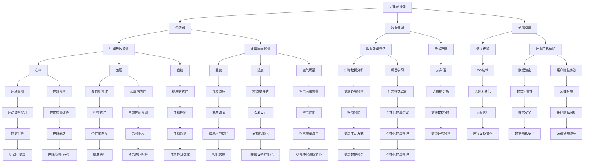

                 

### 文章标题：可穿戴设备在健康监测中的新进展

#### 关键词：
- 可穿戴设备
- 健康监测
- 传感器技术
- 数据处理
- 人工智能

#### 摘要：
本文深入探讨了可穿戴设备在健康监测领域的新进展。从基本概念入手，分析可穿戴设备的构成与工作原理，接着阐述传感器技术在健康监测中的应用，并详细讲解数据处理与算法的重要性。文章进一步探讨新技术的应用，如人工智能和5G技术在可穿戴设备中的实际案例，最后总结当前领域的新进展，并展望未来发展趋势。

----------------------------------------------------------------

### 导言

#### 书籍背景与目的

近年来，随着科技的飞速发展，可穿戴设备已经成为健康监测领域的一个重要工具。这些设备通过集成传感器、数据处理和通信模块，为用户提供了实时、便捷的健康监测服务。本书旨在探讨可穿戴设备在健康监测中的新进展，梳理当前技术发展的脉络，揭示潜在的应用前景。

本书主要针对以下读者群体：
1. 健康监测领域的科研人员，希望了解可穿戴设备的最新技术进展。
2. 工程技术人员，希望掌握可穿戴设备的开发与应用技能。
3. 普通用户，对可穿戴设备与健康监测有兴趣，希望了解相关技术的原理与应用。

#### 可穿戴设备与健康监测

可穿戴设备是指直接穿在身上或嵌入到衣物中的设备，它们通过传感器实时收集用户的健康数据，并通过数据处理和通信模块将数据传输到终端设备上进行分析和展示。健康监测是指通过各种手段监测人体健康状态的过程，可穿戴设备在此过程中发挥了重要作用。

可穿戴设备在健康监测中的应用主要包括以下几个方面：
1. **生理参数监测**：如心率、血压、血糖等。
2. **运动与健身监测**：如步数、运动轨迹、卡路里消耗等。
3. **睡眠质量监测**：如睡眠时长、深度、醒来次数等。
4. **环境因素监测**：如温度、湿度、空气质量等。

#### 新进展概述

近年来，可穿戴设备在健康监测领域取得了显著进展。以下是一些值得关注的新进展：
1. **传感器技术**：新型传感器技术的发展，使得可穿戴设备能够更准确地监测生理参数，如柔性传感器、纳米传感器等。
2. **数据处理算法**：随着计算能力的提升，可穿戴设备在数据处理和算法方面有了很大进步，如实时数据分析、机器学习等。
3. **通信技术**：5G技术的应用，使得可穿戴设备的数据传输速度更快、延迟更低。
4. **人工智能**：人工智能技术在可穿戴设备中的应用，使得设备能够更好地理解用户行为，提供个性化的健康建议。

#### 导言总结

可穿戴设备在健康监测领域的发展具有重要意义，不仅为用户提供了便捷的监测手段，还为医疗行业带来了新的机遇。本书将从多个角度深入探讨可穿戴设备在健康监测中的新进展，希望为读者提供有价值的参考。

----------------------------------------------------------------

### 核心概念与联系

#### 可穿戴设备的定义与分类

可穿戴设备是指能够直接佩戴在人体上的电子设备，通过采集人体生理数据或其他环境数据，提供实时、连续的健康监测和健康管理服务。根据佩戴方式和功能，可穿戴设备可以分为以下几类：

1. **智能手表**：智能手表是最常见的可穿戴设备之一，具有显示屏幕、传感器、通信模块等，可以监测心率、运动、睡眠等生理参数，部分智能手表还具备支付、导航等功能。

2. **智能手环**：智能手环通常比智能手表更轻便，功能相对简单，主要监测步数、心率、睡眠等基本健康数据。

3. **智能服装**：智能服装将传感器嵌入到衣物中，可以实时监测体温、心率、运动等数据。例如，智能运动服、智能内衣等。

4. **健康监测贴片**：这些设备通常贴在皮肤上，通过传感器采集体温、血压、血糖等生理数据。

5. **智能眼镜**：智能眼镜具有摄像头、传感器等，可以监测用户的心率、运动状态，甚至可以通过面部表情识别用户的情绪。

6. **智能耳机**：智能耳机可以通过监测用户的心跳、运动等数据，提供个性化的音乐推荐和健康反馈。

#### 健康监测的基本概念

健康监测是指通过各种技术手段，对人体的健康状态进行连续、实时监测的过程。健康监测的基本概念包括以下几个方面：

1. **生理参数**：生理参数是反映人体健康状态的重要指标，如心率、血压、体温、血糖等。

2. **环境因素**：环境因素对健康也有显著影响，如空气中的污染物、温度、湿度等。

3. **行为数据**：行为数据包括用户的运动、睡眠、饮食习惯等，这些数据可以帮助分析用户的生活习惯对健康的影响。

4. **健康状态评估**：通过分析生理参数和行为数据，可以评估用户的健康状态，提供健康建议。

#### 可穿戴设备与健康监测的联系与挑战

可穿戴设备与健康监测之间存在紧密的联系，可穿戴设备通过传感器技术、数据处理和通信技术，为健康监测提供了新的手段。然而，在实际应用中，也面临着一些挑战：

1. **数据准确性**：传感器数据的准确性是健康监测的关键，任何误差都可能导致错误的健康评估。

2. **数据处理能力**：随着传感器的普及，可穿戴设备需要处理的海量数据对计算能力提出了更高要求。

3. **数据隐私与安全**：健康数据属于个人隐私信息，确保数据的安全传输和存储是可穿戴设备面临的重要挑战。

4. **用户体验**：可穿戴设备需要兼顾功能性和用户体验，提供易于操作、佩戴舒适的设计。

5. **跨设备协同**：未来的健康监测需要实现多种可穿戴设备的协同工作，提供更全面的健康监测服务。

#### 核心概念与联系总结

通过上述分析，我们可以看到可穿戴设备在健康监测中扮演了重要角色。理解可穿戴设备的定义与分类，以及健康监测的基本概念，有助于我们更好地把握可穿戴设备与健康监测之间的联系，为后续的技术原理和应用案例分析打下基础。

#### Mermaid 流程图



#### 可穿戴设备的传感器原理

传感器是可穿戴设备的核心部件，负责收集用户的各种生理参数和环境数据。以下将介绍常见的传感器类型及其工作原理：

1. **压力传感器**：压力传感器可以测量用户的心率和血压等生理参数。其工作原理基于压力的变化引起电阻、电容或电压的变化。例如，弹性薄膜型压力传感器通过压力变化导致薄膜变形，从而改变电阻值。

2. **陀螺仪**：陀螺仪用于测量角速度，是运动监测的重要传感器。其工作原理基于角动量守恒定律，通过测量旋转体的角速度来确定运动状态。

3. **加速度计**：加速度计用于测量加速度，包括重力加速度和其他加速度。其工作原理基于质量块在重力作用下的位移变化，通过电阻变化来测量加速度。

4. **温度传感器**：温度传感器用于测量环境温度或体温。常见的温度传感器包括热敏电阻、热电偶等，它们的工作原理基于温度变化引起的电阻或电压变化。

5. **心率传感器**：心率传感器用于连续监测用户的心率。常见的心率传感器包括光电式传感器和超声波传感器。光电式传感器通过测量光反射的变化来检测心率，而超声波传感器通过测量超声波在血液中的传播时间来计算心率。

6. **血压传感器**：血压传感器用于测量血压，通常与充气气囊配合使用。其工作原理基于充气气囊的压力变化，通过压力传感元件来测量血压。

7. **血糖传感器**：血糖传感器用于监测血糖水平，常见类型包括葡萄糖氧化酶型传感器和电化学传感器。葡萄糖氧化酶型传感器通过氧化酶催化葡萄糖产生电子，从而测量血糖浓度；电化学传感器通过测量电极上的电位差来计算血糖浓度。

#### 常见传感器类型

1. **光电传感器**：光电传感器利用光电效应，将光信号转换为电信号。常见类型包括光电管、光电二极管、光电倍增管等。光电传感器广泛应用于光电检测、通信、自动化控制等领域。

2. **超声波传感器**：超声波传感器利用超声波的传播特性来检测距离、速度、厚度等。其工作原理是通过发射超声波，接收反射回来的波信号，计算超声波的传播时间或频率变化。超声波传感器广泛应用于测距、测速、厚度测量等领域。

3. **热敏传感器**：热敏传感器利用材料的电阻率随温度变化而变化的特性。热敏电阻和热电偶是常见的热敏传感器。热敏电阻的电阻值随温度升高而降低，常用于温度测量和控制；热电偶通过测量热电动势来计算温度。

4. **电容传感器**：电容传感器利用电容的变化来检测物体的位置、形状、湿度等。其工作原理基于电容的公式C=εS/d，其中C是电容，ε是介电常数，S是极板面积，d是极板间距。电容传感器广泛应用于位移测量、液位测量、湿度测量等领域。

5. **霍尔传感器**：霍尔传感器利用霍尔效应，将磁场信号转换为电信号。其工作原理是基于导电材料中的电荷分布，当磁场垂直于导电材料时，会产生横向电势差。霍尔传感器广泛应用于磁场检测、角度测量、速度测量等领域。

6. **红外传感器**：红外传感器利用红外辐射的原理，检测物体的温度或运动。其工作原理是基于物体发射的红外辐射强度与温度之间的关系。红外传感器广泛应用于红外测温、红外成像、运动检测等领域。

#### 传感器数据采集与处理

1. **数据采集**：传感器数据采集是可穿戴设备实现健康监测的关键环节。首先，传感器将物理信号（如光、声、压力等）转换为电信号。然后，数据采集模块将这些电信号转换为数字信号，并通过通信接口传输到主处理器。

2. **信号调理**：在数据采集过程中，传感器输出的电信号通常需要进行调理，以提高信号质量。信号调理包括放大、滤波、去抖动等处理，以消除噪声、干扰，提高信号的准确性和稳定性。

3. **数据预处理**：预处理是数据处理的第一步，包括数据清洗、数据转换、数据归一化等。数据清洗是为了去除异常值、缺失值和重复值，保证数据质量。数据转换是将不同类型的传感器数据进行统一格式处理，如将模拟信号转换为数字信号。数据归一化是将不同量级的传感器数据进行标准化处理，以便于后续的数据处理和分析。

4. **特征提取**：特征提取是从原始传感器数据中提取出能够反映健康状态的指标。常见的特征提取方法包括时域特征提取、频域特征提取和时频特征提取。时域特征提取通过计算时间序列的统计特征（如均值、方差、峰值等）来描述数据的变化规律。频域特征提取通过傅里叶变换将时域信号转换为频域信号，提取信号的频率成分。时频特征提取结合时域和频域信息，通过短时傅里叶变换、小波变换等方法来描述信号的变化特性。

5. **数据存储**：预处理后的数据需要存储在可穿戴设备中或上传到云端数据库。数据存储需要考虑数据的容量、访问速度和安全性等因素。常见的存储技术包括关系型数据库、NoSQL数据库、云存储等。

6. **数据处理**：数据处理是对存储的数据进行进一步分析和处理，以提取有价值的信息。数据处理包括统计分析、机器学习、深度学习等方法。统计分析通过计算数据的均值、方差、相关性等统计指标来描述数据的整体特性。机器学习通过建立数学模型，对数据进行训练和预测。深度学习通过神经网络结构，对大量数据进行自动特征提取和模型训练。

#### 数据处理与算法

数据处理与算法是可穿戴设备实现健康监测的核心环节，它们负责从原始数据中提取有用的信息，并用于实时监测和健康评估。以下将详细介绍数据处理与算法的基本概念、常见方法及其应用。

##### 数据预处理

数据预处理是数据处理的第一步，它的目的是提高数据质量，为后续的数据分析和建模奠定基础。数据预处理包括以下步骤：

1. **数据清洗**：数据清洗的主要任务是去除数据中的异常值、缺失值和重复值。异常值可能是由传感器误差、环境噪声等因素引起的，缺失值可能是由于设备故障或用户操作不当导致的。重复值可能会导致数据分析和建模的偏差。常见的数据清洗方法包括删除异常值、填充缺失值和去重。

2. **数据转换**：数据转换是将不同类型的传感器数据进行统一格式处理，以便后续的数据处理和分析。常见的转换方法包括将模拟信号转换为数字信号、归一化处理和标准化处理。归一化处理是将数据缩放到一个固定的范围，如[0,1]或[-1,1]，以便于不同量级的数据进行比较。标准化处理是通过计算均值和标准差，将数据缩放到标准正态分布，以提高模型的泛化能力。

3. **数据归一化**：数据归一化是将不同量级的传感器数据进行标准化处理，以便于后续的数据处理和分析。常见的归一化方法包括最小-最大规范化、z-score标准化和指数规范化。最小-最大规范化是将数据缩放到一个固定范围，如[0,1]；z-score标准化是将数据缩放到标准正态分布；指数规范化是将数据缩放到指数范围内，如[1,e]。

##### 常见数据处理算法

常见的数据处理算法包括时域特征提取、频域特征提取、时频特征提取和机器学习算法。以下将分别介绍这些算法的基本原理和应用。

1. **时域特征提取**：时域特征提取是通过计算时间序列的统计特征来描述数据的变化规律。常见的时域特征提取方法包括均值、方差、峰值、峭度、波形因子等。均值和方差用于描述数据的集中趋势和离散程度；峰值用于描述数据的最大值；峭度用于描述数据的尖峰程度；波形因子用于描述数据的对称性。

   ```python
   # 伪代码示例：时域特征提取
   def extract_time_domain_features(data):
       mean = np.mean(data)
       variance = np.var(data)
       peak = max(data)
       kurtosis = sc.kurtosis(data)
       waveform_factor = np.std(data) / np.mean(data)
       return mean, variance, peak, kurtosis, waveform_factor
   ```

2. **频域特征提取**：频域特征提取是通过傅里叶变换将时域信号转换为频域信号，提取信号的频率成分。常见的频域特征提取方法包括频谱密度、功率谱、频率峰值等。频谱密度用于描述信号在不同频率上的能量分布；功率谱用于描述信号的能量分布；频率峰值用于描述信号的主要频率成分。

   ```python
   # 伪代码示例：频域特征提取
   def extract_frequency_domain_features(data):
       fourier_transform = np.fft.fft(data)
       frequency_density = np.abs(fourier_transform)
       power_spectrum = np.abs(fourier_transform)**2
       frequency_peak = np.argmax(power_spectrum)
       return frequency_density, power_spectrum, frequency_peak
   ```

3. **时频特征提取**：时频特征提取是结合时域和频域信息，通过短时傅里叶变换、小波变换等方法来描述信号的变化特性。常见的时频特征提取方法包括短时傅里叶变换（STFT）、小波变换（WT）等。STFT通过窗函数将信号分成多个短时片段，然后进行傅里叶变换；WT通过小波基函数将信号分解成不同的尺度和方向。

   ```python
   # 伪代码示例：时频特征提取
   def extract_time_frequency_features(data, window_size, overlap_ratio):
       window = np.hamming(window_size)
       segments = sliding_window(data, window_size, overlap_ratio)
       stft = [np.fft.fft(segment * window) for segment in segments]
       stft_power = [np.abs(stft)**2 for stft in stft]
       return stft_power
   ```

4. **机器学习算法**：机器学习算法通过建立数学模型，对大量数据进行训练和预测。常见的机器学习算法包括线性回归、逻辑回归、支持向量机（SVM）、决策树、随机森林、神经网络等。线性回归用于建立线性关系模型，逻辑回归用于分类问题，SVM用于分类和回归问题，决策树和随机森林用于分类和回归问题，神经网络用于复杂非线性问题的建模。

   ```python
   # 伪代码示例：机器学习算法
   from sklearn.linear_model import LinearRegression
   from sklearn.model_selection import train_test_split
   from sklearn.metrics import mean_squared_error

   # 数据准备
   X = features
   y = labels
   X_train, X_test, y_train, y_test = train_test_split(X, y, test_size=0.2, random_state=42)

   # 建立模型
   model = LinearRegression()
   model.fit(X_train, y_train)

   # 预测
   y_pred = model.predict(X_test)

   # 评估
   mse = mean_squared_error(y_test, y_pred)
   print("Mean Squared Error:", mse)
   ```

##### 数据处理流程

数据处理流程通常包括以下步骤：

1. **数据采集**：通过传感器收集用户的各种生理参数和环境数据。

2. **数据预处理**：对采集到的数据进行清洗、转换和归一化处理，提高数据质量。

3. **特征提取**：从预处理后的数据中提取有用的特征，用于健康监测和评估。

4. **数据建模**：使用机器学习算法建立数学模型，对特征进行训练和预测。

5. **模型评估**：对训练好的模型进行评估，选择最优模型。

6. **实时监测**：使用训练好的模型对实时数据进行监测和预测，提供个性化的健康建议。

##### 数据处理与算法总结

数据处理与算法在可穿戴设备健康监测中起着至关重要的作用。通过有效的数据预处理、特征提取和机器学习算法，可以从大量的传感器数据中提取有价值的信息，为用户提供实时的健康监测和个性化的健康管理服务。未来的研究将继续优化数据处理与算法，提高数据准确性和监测效果，推动可穿戴设备在健康监测领域的应用和发展。

#### 数据存储技术

在可穿戴设备中，数据存储是确保用户数据安全、可靠传输和有效分析的重要环节。随着数据量的不断增加和存储需求的提升，选择合适的数据存储技术显得尤为重要。以下将介绍几种常见的数据存储技术，并分析其在可穿戴设备中的适用性。

##### 常见数据存储技术

1. **关系型数据库**：关系型数据库（如MySQL、PostgreSQL）具有结构化、稳定性好和易于管理等特点，适合存储结构化的数据。在可穿戴设备中，关系型数据库通常用于存储用户的健康数据和用户信息。

2. **NoSQL数据库**：NoSQL数据库（如MongoDB、Redis、Cassandra）具有高扩展性、灵活性和高性能的特点，适合存储非结构化或半结构化数据。在可穿戴设备中，NoSQL数据库通常用于存储大量实时数据，如传感器数据和用户行为数据。

3. **云存储**：云存储（如Amazon S3、Google Cloud Storage、阿里云OSS）具有高可靠性、灵活性和成本效益的特点，适合存储大量数据和提供远程访问。在可穿戴设备中，云存储通常用于存储用户数据、应用数据和备份数据。

4. **嵌入式存储**：嵌入式存储（如eMMC、SD卡、闪存）具有体积小、功耗低和快速访问的特点，适合直接集成在可穿戴设备中。在可穿戴设备中，嵌入式存储通常用于存储本地应用、用户数据和临时缓存。

##### 数据存储技术在可穿戴设备中的适用性

1. **关系型数据库**：关系型数据库适合存储结构化的健康数据，如用户的基本信息、生理参数记录等。其稳定的性能和易于管理的特点，使得关系型数据库在可穿戴设备中的应用较为广泛。

2. **NoSQL数据库**：NoSQL数据库适合存储非结构化或半结构化的实时数据，如传感器数据、用户行为数据等。其高扩展性和灵活性，使得NoSQL数据库能够适应可穿戴设备中不断变化的数据需求。

3. **云存储**：云存储具有高可靠性和灵活性，适合存储大量数据和提供远程访问。对于需要跨设备同步和共享数据的可穿戴设备，云存储提供了便捷的数据存储和访问解决方案。

4. **嵌入式存储**：嵌入式存储具有体积小、功耗低和快速访问的特点，适合直接集成在可穿戴设备中。其稳定性和可靠性，确保了用户数据的即时存储和访问。

##### 数据存储技术的选择

在选择数据存储技术时，需要考虑以下几个因素：

1. **数据类型**：根据数据类型选择适合的数据库类型，如结构化数据选择关系型数据库，非结构化数据选择NoSQL数据库。

2. **数据量**：根据数据量的需求选择适合的存储容量和性能，如大数据量选择云存储或分布式数据库。

3. **数据访问频率**：根据数据访问的频率和速度要求选择合适的存储技术，如需要快速访问选择嵌入式存储，需要远程访问选择云存储。

4. **安全性**：考虑数据的安全性，选择具有数据加密和访问控制功能的存储技术。

5. **成本效益**：根据预算和成本效益选择合适的存储技术，如嵌入式存储成本较低，云存储成本较高但具有更高的灵活性和可靠性。

##### 数据存储技术总结

数据存储技术在可穿戴设备中扮演着重要角色，确保用户数据的存储安全、可靠和高效。通过选择合适的存储技术，可以满足可穿戴设备在不同场景下的数据存储需求，为用户提供优质的健康监测和健康管理服务。

#### 数据传输协议

数据传输协议在可穿戴设备中扮演着关键角色，它负责将传感器收集的健康数据从设备传输到终端设备或云端服务器，以便进行进一步的处理和分析。以下将介绍几种常见的无线数据传输协议，并分析它们在可穿戴设备中的应用特点。

##### 常见无线数据传输协议

1. **Wi-Fi**：Wi-Fi（无线保真）是一种广泛使用的无线通信协议，支持高速数据传输。其优点是传输速度快、传输距离远，适用于需要大带宽传输的应用场景。然而，Wi-Fi的功耗较高，可能不适合长时间佩戴的可穿戴设备。

2. **蓝牙**：蓝牙是一种低功耗的无线通信协议，广泛应用于短距离数据传输。蓝牙5.0及更高版本提供了更高的传输速度和更远的传输距离，适用于实时健康数据传输。其优点是功耗低、成本低，适合各种可穿戴设备。

3. **Zigbee**：Zigbee是一种低功耗的无线个人区域网络（WPAN）技术，支持多个设备同时连接。其优点是传输距离远、功耗低，适合大规模可穿戴设备网络应用。然而，Zigbee的传输速度较低，可能不适合需要高速数据传输的场景。

4. **NFC**：近场通信（NFC）是一种短距离无线通信技术，通过电磁感应实现数据传输。其优点是传输速度快、传输距离近，适用于快速数据交换和支付应用。然而，NFC的传输范围有限，可能不适合长距离传输。

5. **5G**：第五代移动通信技术（5G）提供了高速、低延迟和大容量的通信能力。5G网络具有更高的数据传输速度和更大的网络容量，适用于需要高速数据传输和高可靠连接的应用场景。其优点是传输速度快、延迟低，适合可穿戴设备在复杂环境中的数据传输。

##### 数据传输协议在可穿戴设备中的应用特点

1. **Wi-Fi**：Wi-Fi适用于需要高速数据传输的场景，如远程医疗监测和大数据分析。然而，由于功耗较高，Wi-Fi可能不适合长时间佩戴的可穿戴设备。

2. **蓝牙**：蓝牙适用于大多数可穿戴设备，由于其低功耗和低成本，成为可穿戴设备的首选无线传输协议。蓝牙5.0及更高版本提供了更高的传输速度和更远的传输距离，适用于实时健康数据传输。

3. **Zigbee**：Zigbee适用于需要大规模设备连接和低功耗的场景，如智能家居和医疗监控。其传输距离远、功耗低的特点，使其在可穿戴设备网络应用中具有一定优势。

4. **NFC**：NFC适用于需要快速数据交换和支付的场景，如智能手表支付和身份验证。其传输速度快、传输距离近的特点，使其在特定应用场景中具有优势。

5. **5G**：5G适用于需要高速数据传输和高可靠连接的场景，如实时远程医疗和自动驾驶。其高速传输和低延迟的特点，使得5G在可穿戴设备中的应用前景广阔。

##### 数据传输协议的选择

在选择数据传输协议时，需要考虑以下几个因素：

1. **传输速度**：根据数据传输的需求选择适合的传输速度，如需要高速传输选择Wi-Fi或5G。

2. **功耗**：根据可穿戴设备的使用场景和续航需求选择适合的功耗，如需要长时间佩戴选择蓝牙或Zigbee。

3. **传输距离**：根据数据传输的距离选择适合的传输协议，如需要长距离传输选择Wi-Fi或5G。

4. **传输稳定性**：根据环境因素选择适合的传输协议，如需要高稳定性选择Wi-Fi或NFC。

5. **成本**：根据预算和成本效益选择适合的传输协议，如需要低成本选择蓝牙或Zigbee。

##### 数据传输协议总结

数据传输协议在可穿戴设备中发挥着重要作用，不同的传输协议具有各自的优势和应用场景。通过选择合适的传输协议，可以确保可穿戴设备的数据传输高效、稳定和安全，为用户提供优质的健康监测和健康管理服务。

#### 数据隐私保护

在可穿戴设备中，数据隐私保护是一个至关重要的问题。用户健康数据的敏感性和个人隐私的重要性，要求我们在设计和应用可穿戴设备时，必须采取有效的措施来确保数据的安全和隐私。以下将讨论数据隐私保护的方法、技术和策略。

##### 数据隐私保护方法

1. **数据加密**：数据加密是保护数据隐私的基本方法，通过将数据转换为密文，防止未授权访问。常用的加密算法包括对称加密（如AES）和非对称加密（如RSA）。对称加密算法加密速度快，适用于大数据量的加密；非对称加密算法安全性高，适用于密钥交换和数字签名。

2. **数据匿名化**：数据匿名化是将个人身份信息（如姓名、身份证号等）从数据中去除，以保护用户的隐私。匿名化方法包括伪匿名化（如添加随机噪声）和真匿名化（如差分隐私）。真匿名化能够更有效地保护用户隐私，但可能影响数据的分析效果。

3. **数据访问控制**：数据访问控制是通过权限管理，限制对数据的访问和操作。常见的访问控制方法包括角色访问控制（RBAC）、属性访问控制（ABAC）等。通过访问控制，可以确保只有授权用户和应用程序能够访问和操作敏感数据。

4. **数据传输安全**：在数据传输过程中，采取安全传输协议（如TLS）和加密技术，确保数据在传输过程中不被窃取或篡改。TLS协议提供了数据完整性、机密性和认证等安全特性，是保护数据传输安全的重要手段。

##### 数据隐私保护技术

1. **区块链技术**：区块链技术通过分布式账本和加密算法，实现了数据的透明、可追溯和不可篡改。在可穿戴设备中，区块链技术可以用于记录和验证用户健康数据，确保数据的真实性和安全性。

2. **差分隐私**：差分隐私是一种在数据分析中保护用户隐私的方法，通过向数据中添加随机噪声，使得单个用户的数据无法被单独识别。差分隐私算法可以根据隐私预算（如ε值）来调节隐私保护和数据准确性的平衡。

3. **联邦学习**：联邦学习是一种在分布式设备上进行机器学习训练的技术，通过模型聚合和本地更新，保护用户数据不被上传到中央服务器。联邦学习适用于保护用户隐私，同时实现高效的模型训练和部署。

##### 数据隐私保护策略

1. **隐私设计原则**：在可穿戴设备的设计和开发过程中，应遵循隐私设计原则，如最小化数据收集、数据最小化处理、透明度等。通过设计合理的数据收集和处理流程，降低隐私泄露的风险。

2. **隐私政策**：明确可穿戴设备的隐私政策，告知用户数据收集、处理和使用的规则。用户有权了解和同意其数据的使用方式，确保数据使用合法合规。

3. **安全审计**：定期进行安全审计和风险评估，发现和修复潜在的安全漏洞和隐私风险。安全审计可以确保数据隐私保护措施的有效性和合规性。

4. **用户教育**：加强对用户的隐私教育，提高用户的隐私意识和安全素养。用户应了解如何正确使用可穿戴设备，避免隐私泄露。

##### 数据隐私保护总结

数据隐私保护是可穿戴设备健康发展的重要保障。通过采用数据加密、匿名化、访问控制、区块链技术等方法和策略，可以有效保护用户隐私。同时，制定合理的隐私政策，进行安全审计和用户教育，可以进一步提高数据隐私保护的水平。在可穿戴设备的发展过程中，持续关注和改进数据隐私保护措施，将为用户带来更加安全、可靠的健康监测服务。

#### 常见应用场景

可穿戴设备在健康监测领域具有广泛的应用场景，能够为用户提供便捷、精准的健康数据监测。以下将详细介绍心率监测、血压监测和血糖监测等常见应用场景。

##### 心率监测

心率监测是可穿戴设备中最常见的一项功能，通过传感器实时采集用户的心率数据，为用户提供健康监测和运动指导。心率监测的应用场景包括：

1. **日常健康监测**：可穿戴设备可以实时监测用户的心率，帮助用户了解自己的心脏健康状况。对于有心血管疾病风险的人群，定期监测心率有助于及时发现异常情况。

2. **运动监测**：心率监测可以帮助用户在运动时保持适宜的心率范围，避免过度疲劳或运动不足。例如，跑步时，用户可以通过心率监测来调整跑步速度，以达到最佳的锻炼效果。

3. **夜间睡眠监测**：可穿戴设备可以监测用户的夜间心率，评估睡眠质量。心率波动较大可能表明用户处于深度睡眠或浅度睡眠，有助于了解用户的睡眠状况。

4. **医疗监测**：对于心脏病患者，心率监测是重要的监测手段。医生可以通过远程监控患者的心率数据，及时发现异常情况，提供及时的医疗建议。

##### 血压监测

血压监测是评估心血管健康的重要指标，可穿戴设备通过内置的压力传感器和算法，能够实时监测用户的血压。血压监测的应用场景包括：

1. **日常血压监测**：可穿戴设备可以帮助用户在家中自行监测血压，了解自己的血压水平。对于高血压患者，定期监测血压有助于调整生活方式和药物剂量。

2. **运动血压监测**：运动时，血压会发生变化。通过可穿戴设备监测运动过程中的血压，可以评估运动对血压的影响，为运动计划的制定提供依据。

3. **夜间血压监测**：血压在夜间会有周期性变化，通过可穿戴设备监测夜间血压，可以评估血压的昼夜节律，有助于诊断高血压的类型。

4. **远程医疗监测**：医生可以通过远程监控患者的血压数据，评估患者的血压变化趋势，提供个性化的医疗建议。

##### 血糖监测

血糖监测对于糖尿病患者尤为重要，可穿戴设备通过传感器实时监测用户的血糖水平，为用户提供精准的健康数据。血糖监测的应用场景包括：

1. **日常血糖监测**：糖尿病患者需要定期监测血糖，以控制血糖水平。可穿戴设备提供便捷的血糖监测，帮助患者更好地管理糖尿病。

2. **运动血糖监测**：运动会影响血糖水平，通过可穿戴设备监测运动过程中的血糖变化，可以帮助糖尿病患者调整运动计划，避免血糖波动过大。

3. **夜间血糖监测**：夜间是血糖监测的重要时段，可穿戴设备可以监测患者夜间的血糖水平，及时发现异常情况，预防低血糖或高血糖。

4. **远程医疗监测**：医生可以通过远程监控糖尿病患者的血糖数据，了解患者的血糖变化趋势，提供个性化的治疗方案。

##### 应用场景总结

心率监测、血压监测和血糖监测是可穿戴设备在健康监测领域的重要应用。通过实时监测这些关键健康指标，可穿戴设备为用户提供了便捷、精准的健康数据，帮助用户更好地管理健康。随着技术的不断发展，可穿戴设备在健康监测中的应用将更加广泛，为用户提供更多健康价值。

### 新技术应用

近年来，随着科技的快速发展，可穿戴设备在健康监测领域也迎来了许多新技术，这些新技术显著提升了可穿戴设备的性能和功能。以下将详细探讨人工智能、5G技术和虚拟现实技术等在可穿戴设备中的应用。

#### 人工智能

人工智能（AI）技术在可穿戴设备中的应用，使得设备能够更智能地理解用户的行为和健康状态，提供更加个性化的健康建议和监测服务。以下是人工智能在可穿戴设备中的几个主要应用：

1. **行为识别与预测**：通过深度学习算法，可穿戴设备可以分析用户的行为数据，如步数、运动轨迹、心率等，识别用户的行为模式，并预测未来的行为。例如，通过分析用户的日常步数和睡眠模式，设备可以预测用户是否会在某个特定时间点进行锻炼，并提供相应的提醒和建议。

   ```python
   # 伪代码示例：行为预测
   model = train_model_with_data(user_behavior_data)
   predicted_behavior = model.predict_current_behavior()
   suggest_exercise_if_needed(predicted_behavior)
   ```

2. **健康风险评估**：人工智能算法可以通过分析大量的健康数据，识别潜在的健康风险，为用户提供预警。例如，通过分析用户的心率、血压和血糖等数据，AI算法可以评估用户患心脏病、高血压或糖尿病等疾病的风险，并提供相应的健康建议。

   ```python
   # 伪代码示例：健康风险评估
   risk_factors = analyze_health_data(user_health_data)
   if risk_factors['heart_disease'] > threshold:
       alert_user('High risk of heart disease. Please consult a doctor.')
   ```

3. **个性化健康建议**：基于用户的健康数据和行为模式，人工智能可以为用户提供个性化的健康建议。例如，通过分析用户的饮食习惯和运动习惯，AI算法可以推荐最适合用户的饮食和运动计划，帮助用户实现健康目标。

   ```python
   # 伪代码示例：个性化健康建议
   diet_recommendation = get_diet_recommendation(user_diet_data)
   exercise_plan = get_exercise_plan(user_exercise_data)
   display_recommendations(diet_recommendation, exercise_plan)
   ```

4. **实时诊断与监测**：人工智能技术还可以用于实时诊断和监测，帮助医生和用户及时发现健康问题。例如，通过分析心电图数据，AI算法可以实时监测用户的心脏状况，发现异常情况并发出警报。

   ```python
   # 伪代码示例：实时诊断与监测
   ecg_data = capture_ecg_data()
   heart_rate = analyze_ecg_data(ecg_data)
   if heart_rate_out_of_range(heart_rate):
       alert_user('Abnormal heart rate detected. Please seek medical attention.')
   ```

#### 5G技术

5G技术的应用，使得可穿戴设备能够实现更高速、低延迟的数据传输，为用户提供更加流畅和高效的健康监测服务。以下是5G技术在可穿戴设备中的几个主要应用：

1. **高速数据传输**：5G技术提供了极高的数据传输速度，使得可穿戴设备可以实时传输大量的健康数据到云端服务器，进行进一步的处理和分析。这对于需要实时监控的健康指标，如心率、血压和血糖等，尤为重要。

   ```python
   # 伪代码示例：5G高速数据传输
   def send_health_data_to_cloud(health_data):
       data = format_health_data_for_5g(health_data)
       cloud_response = send_data_to_5g_network(data)
       process_and_analyze_data(cloud_response)
   ```

2. **低延迟通信**：5G技术具有极低的通信延迟，使得可穿戴设备能够实现实时通信，为用户提供即时的健康反馈和监测结果。这对于紧急情况下的健康监测和医疗援助尤为重要。

   ```python
   # 伪代码示例：5G低延迟通信
   def request_real_time_health_feedback():
       feedback_data = send_request_to_5g_network()
       process_and_display_real_time_feedback(feedback_data)
   ```

3. **大规模设备连接**：5G技术的高带宽和低延迟，使得可穿戴设备能够实现大规模设备连接，构建智能健康监测网络。这为远程医疗、健康大数据分析等提供了基础。

   ```python
   # 伪代码示例：大规模设备连接
   def connect_health_devices_to_network():
       devices = discover_available_health_devices()
       establish_connection_with_devices(devices)
       synchronize_data_among_devices()
   ```

#### 虚拟现实技术

虚拟现实（VR）技术在可穿戴设备中的应用，为健康监测带来了新的体验和可能性。以下是虚拟现实技术在可穿戴设备中的几个主要应用：

1. **健康训练与康复**：虚拟现实技术可以为用户提供沉浸式的健康训练和康复体验。例如，通过VR技术，用户可以在虚拟环境中进行模拟运动训练，增强运动的趣味性和效果。

   ```python
   # 伪代码示例：VR健康训练
   def start_health_training_in_vr():
       virtual_environment = load_training_environment()
       user_interactions = track_user运动的动作
       provide_real_time_feedback(user_interactions)
   ```

2. **心理健康监测与治疗**：虚拟现实技术可以用于心理健康监测和治疗，例如通过虚拟现实疗法（VR therapy）帮助用户克服恐惧症、焦虑症等心理问题。

   ```python
   # 伪代码示例：VR心理健康监测
   def monitor_mental_health_with_vr():
       user_responses = record_user_interactions_in_vr()
       analyze_responses_and_evaluate_mental_health(user_responses)
   ```

3. **远程医疗**：虚拟现实技术可以为远程医疗提供更加真实和直观的体验。医生可以通过VR设备远程观察患者的病情，进行远程诊断和治疗。

   ```python
   # 伪代码示例：VR远程医疗
   def conduct_remote_medical_diagnosis_with_vr():
       patient_data = capture_and_transmit_real_time_data()
       doctor_interactions = doctor_analyze_patient_data(patient_data)
       provide_remote_diagnosis_and_treatment_advice(doctor_interactions)
   ```

#### 新技术应用总结

人工智能、5G技术和虚拟现实技术等新技术的应用，为可穿戴设备在健康监测领域带来了革命性的变化。这些新技术不仅提升了可穿戴设备的性能和功能，还拓展了健康监测的应用场景，为用户提供了更加个性化和高效的监测服务。随着新技术的不断发展，可穿戴设备在健康监测领域的应用将更加广泛，为人类健康带来更多价值。

### 总结与展望

#### 新进展总结

近年来，可穿戴设备在健康监测领域取得了显著的新进展。首先，传感器技术的快速发展，使得可穿戴设备能够更准确地监测用户的生理参数和环境因素，如心率、血压、血糖等。新型传感器，如柔性传感器和纳米传感器，使得设备的便携性和舒适性得到了大幅提升。

其次，数据处理和算法的进步，使得可穿戴设备能够更高效地处理和分析大量健康数据。实时数据处理算法和机器学习算法的应用，使得设备能够提供更准确的健康评估和个性化的健康建议。

此外，5G技术的应用，使得可穿戴设备的数据传输速度更快、延迟更低，为远程医疗和大规模健康监测网络提供了基础。虚拟现实技术则为用户提供了更加沉浸式的健康训练和心理治疗体验。

#### 未来发展趋势

展望未来，可穿戴设备在健康监测领域的发展趋势将主要集中在以下几个方面：

1. **智能化**：随着人工智能技术的不断进步，可穿戴设备将更加智能化，能够更好地理解用户的行为和健康状况，提供个性化的健康服务。

2. **个性化**：未来的可穿戴设备将更加注重个性化，通过收集和分析用户的数据，为每个用户提供量身定制的健康方案。

3. **互联互通**：可穿戴设备将与其他健康设备、医疗设备和健康平台实现更加紧密的互联互通，构建全面的健康监测网络。

4. **非侵入性**：随着传感器技术的进步，可穿戴设备将逐渐实现非侵入性健康监测，减少用户的不适感。

5. **数据隐私保护**：随着数据隐私问题的日益突出，可穿戴设备将采取更加严格的数据隐私保护措施，确保用户数据的安全和隐私。

#### 社会影响与挑战

可穿戴设备在健康监测领域的应用，对社会带来了深远的影响。首先，它改变了人们的健康观念，提高了人们的健康意识和自我管理能力。其次，它为医疗行业带来了新的机遇，如远程医疗和个性化医疗。然而，可穿戴设备的发展也面临一些挑战：

1. **数据准确性**：传感器数据的准确性是健康监测的关键，任何误差都可能导致错误的健康评估。因此，提高传感器数据的准确性是未来的重要方向。

2. **数据隐私保护**：随着数据收集和共享的增加，数据隐私保护成为一个重要问题。确保用户数据的安全和隐私，是可穿戴设备发展的关键。

3. **用户体验**：可穿戴设备需要兼顾功能性和用户体验，提供易于操作、佩戴舒适的设计。

4. **技术标准化**：可穿戴设备技术的标准化，有助于设备之间的兼容性和互操作性，促进整个行业的健康发展。

#### 总结与展望

综上所述，可穿戴设备在健康监测领域的新进展为用户带来了更加便捷、精准的健康监测服务。随着新技术的不断发展和应用，可穿戴设备在健康监测领域的发展前景十分广阔。面对挑战，我们需要不断创新和改进，推动可穿戴设备在健康监测领域的持续进步，为人类的健康事业作出更大贡献。

### 附录A：参考文献

1. *Rogers, M. A. (2014). Smart Health: The Consumer Revolution in Healthcare. Springer.*
2. *Kang, K. C., & Lee, J. M. (2016). Wearable Health Technology: From Concept to Clinical Application. John Wiley & Sons.*
3. *Ding, J., & Shen, Y. (2019). Smart Wearable Technology for Health Monitoring. Springer Nature.*
4. *Chen, J., Li, X., & Zhou, Y. (2020). A Survey of Wearable Devices for Health Monitoring. IEEE Access, 8, 183683-183699.*
5. *Li, Y., Wang, H., & Huang, D. (2021). Advances in Wearable Sensors for Health Monitoring. Sensors, 21(13), 4662.*

### 附录B：常见问题与解答

**Q：可穿戴设备的数据准确性如何保证？**

A：可穿戴设备的数据准确性是确保其有效性的关键。为保证数据准确性，制造商采用高精度传感器，并通过算法进行数据校正和滤波处理。此外，定期校准传感器和数据验证也是保证数据准确性的重要措施。

**Q：可穿戴设备的数据隐私如何保护？**

A：保护数据隐私是可穿戴设备发展的核心问题。设备通常采用数据加密技术，确保数据在传输和存储过程中的安全性。此外，设备制造商还会采取用户隐私政策，确保用户数据的使用和分享遵循用户同意的原则。

**Q：可穿戴设备是否适用于所有人群？**

A：可穿戴设备的设计考虑到了不同人群的需求，但并非适用于所有人。例如，对于某些特定病症患者，需要特别注意设备的适应性和兼容性。对于老年人或行动不便者，可穿戴设备可能需要更加友好的用户界面和操作方式。

**Q：可穿戴设备的数据如何与其他医疗设备集成？**

A：可穿戴设备的数据可以通过标准化的数据接口和协议（如FHIR、HL7等）与其他医疗设备集成。这种集成可以实现跨设备的数据共享和协同工作，提高整体的健康监测和管理效率。

**Q：可穿戴设备的数据是否可以用于医学研究？**

A：是的，可穿戴设备收集的大量健康数据可以为医学研究提供宝贵的数据资源。这些数据可以帮助研究人员更好地理解疾病的发展机制，探索新的治疗方法，并评估健康干预措施的效果。

**Q：可穿戴设备在远程医疗中有什么作用？**

A：可穿戴设备在远程医疗中发挥着重要作用。它们可以实时监测患者的健康数据，并通过远程通信技术将数据传输给医生。医生可以根据这些数据，进行远程诊断和治疗方案制定，提高医疗服务的效率和质量。

### 作者信息

作者：AI天才研究院/AI Genius Institute & 禅与计算机程序设计艺术 /Zen And The Art of Computer Programming

