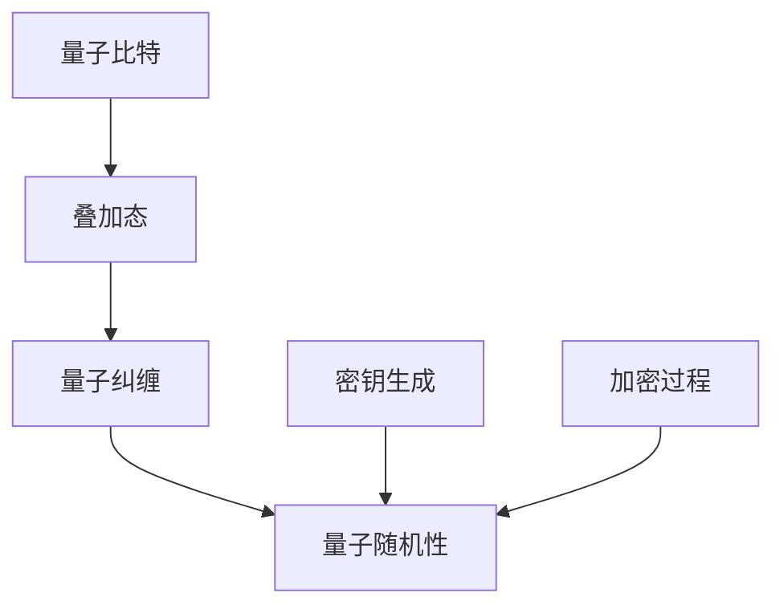

                 

### 引言

在当前的信息时代，数据的安全与隐私保护显得尤为重要。然而，随着量子计算技术的迅猛发展，传统的加密算法面临前所未有的威胁。为了应对这一挑战，后量子加密算法应运而生。后量子加密算法是一种基于量子力学原理设计的加密方法，旨在确保在量子计算机出现后，现有的信息安全体系仍然能够有效抵御攻击。

本博客旨在系统地探讨后量子加密算法的标准化进程。在文章中，我们将首先介绍后量子加密算法的基本概念，包括量子计算的基本原理、后量子加密算法的历史发展以及基本原理。接着，我们将深入分析标准化进程的背景与重要性，包括国际标准化组织的角色和标准化的具体进程。

文章的核心章节将详细讲解后量子加密算法的数学原理和基础，通过Mermaid流程图和伪代码，清晰展示核心概念与联系。此外，我们还将介绍后量子加密算法的框架，包括加密、解密、签名和验证等基本操作，并分析常见的后量子加密协议。

在案例研究章节中，我们将研究几个典型的后量子加密算法标准化案例，分析标准化进程的实际影响和挑战。随后，我们将探讨后量子加密算法在实际应用中的挑战和解决方案，以及未来发展趋势和标准化进程的进一步发展。

通过这篇文章，我们希望读者能够对后量子加密算法及其标准化进程有一个全面而深入的了解，为未来的信息安全领域打下坚实的基础。

### 后量子加密算法概述

#### 量子计算的基本概念

量子计算是一种基于量子力学原理的新型计算模式，它利用量子比特（qubit）这一基本单元进行信息处理。与传统的二进制计算不同，量子比特可以同时处于0和1的状态，这种性质称为量子叠加。此外，量子比特之间可以通过量子纠缠实现状态间的强烈关联，这一特性使得量子计算机在某些任务上能够显著超越经典计算机。

**量子比特（Qubit）**：量子比特是量子计算的基本单元，它可以存在于多种量子状态中。一个量子比特可以表示为两种基本状态的线性组合，即$$|0\rangle$$和$$|1\rangle$$。量子比特的状态可以用复数表示，例如$$\alpha|0\rangle + \beta|1\rangle$$，其中$$\alpha$$和$$\beta$$是复数系数，且满足$$|\alpha|^2 + |\beta|^2 = 1$$。

**量子叠加（Quantum Superposition）**：量子比特可以同时处于多个状态的叠加态。例如，两个量子比特的叠加态可以表示为$$\alpha|00\rangle + \beta|01\rangle + \gamma|10\rangle + \delta|11\rangle$$。这意味着在测量之前，量子比特处于一个模糊的状态，只有测量后才能确定其确切状态。

**量子纠缠（Quantum Entanglement）**：量子纠缠是量子比特之间的一种特殊关联，即使它们被相隔很远，一个量子比特的状态变化也会立即影响另一个量子比特的状态。这种关联可以用贝尔态（Bell state）来描述，如$$\frac{1}{\sqrt{2}}(|00\rangle + |11\rangle)$$。量子纠缠是量子计算的重要资源，它允许量子计算机在处理信息时实现超越经典计算机的并行性。

#### 后量子加密算法的发展

**量子计算机的威胁**：随着量子计算机的发展，传统加密算法如RSA和ECC面临严重威胁。这是因为Shor算法可以在多项式时间内分解大质数，从而破解基于大整数分解问题的加密算法。此外，量子计算机还可以高效解决线性方程组和求解离散对数问题，对其他许多加密算法构成威胁。

**后量子加密算法的诞生**：为了应对量子计算机的威胁，研究人员提出了后量子加密算法，这种算法基于量子力学的基本原理，旨在确保在量子计算机面前保持安全性。后量子加密算法主要包括基于量子纠缠的量子密钥分发（QKD）和基于多变量非线性特性的公钥加密。

**量子密钥分发（QKD）**：量子密钥分发是后量子加密算法的一种重要实现方式，它利用量子纠缠和量子测量不可克隆定理来确保密钥的安全性。QKD的基本思想是通过量子信道传输量子比特，并在接收方进行量子态测量，从而生成共享密钥。如果测量过程中检测到量子态被窃听，则可以立即发现并重新生成密钥。

**基于多变量非线性特性的公钥加密**：另一种重要的后量子加密算法是基于多变量非线性特性的公钥加密，如基于Lattice的NTRU算法和基于Hash函数的McEliece算法。这些算法利用多变量非线性方程组在量子计算机上的求解难度，确保加密信息的安全性。

#### 后量子加密算法的种类和特点

后量子加密算法种类繁多，每种算法都有其独特的优势和局限性。以下是一些常见的后量子加密算法：

**Lattice-based加密算法**：Lattice-based加密算法如NTRU和Kyber利用了在量子计算机上求解lattice问题的困难性。它们通常具有快速加密和解密的速度，同时保持较高的安全性。

**Hash-based加密算法**：Hash-based加密算法如McEliece利用错误纠正码的特性进行加密。这些算法的加密过程依赖于复杂的错误纠正码，使量子计算机难以破解。

**Quantum-resistant密码学**：Quantum-resistant密码学包括一系列传统密码学算法，如AES和SHA，它们经过改进以抵抗量子攻击。这些算法在某些特定的量子攻击下仍然保持安全性，但它们并不是专门为量子计算机设计的。

**量子密钥分发（QKD）**：QKD算法如BB84和E91利用量子纠缠和量子态测量原理，确保密钥传输过程中的安全性。QKD的实现依赖于高效的量子信道和量子态检测技术。

通过上述介绍，我们可以看到后量子加密算法在现代信息安全领域中扮演着至关重要的角色。随着量子计算技术的不断进步，后量子加密算法的发展和应用将越来越受到关注。接下来，我们将进一步探讨后量子加密算法的标准化背景和重要性，以及国际标准化进程的具体情况。

#### 标准化背景与重要性

随着量子计算技术的不断进步，后量子加密算法的标准化进程显得尤为重要。标准化不仅能够确保不同实现之间的互操作性，还能提高算法的可靠性和安全性。以下是后量子加密算法标准化的背景、重要性以及国际标准化组织的角色和标准化进程的概述。

**标准化背景**

在传统加密算法中，RSA和ECC等基于大整数分解和离散对数问题的算法因其较高的安全性而广泛应用。然而，这些算法在量子计算机面前变得脆弱，因为量子计算机可以利用Shor算法在多项式时间内分解大质数和求解离散对数问题。因此，后量子加密算法的标准化成为了信息安全领域的关键需求。

**标准化的重要性**

1. **互操作性**：标准化能够确保不同实现之间的互操作性，使得不同系统和应用可以无缝集成和通信。
2. **安全性**：通过标准化，可以确保后量子加密算法的安全性得到广泛认可和验证，从而提高整体信息安全。
3. **合规性**：标准化有助于遵守国际和地区的法规要求，确保信息安全体系的合规性。
4. **可靠性**：标准化可以提高后量子加密算法的可靠性，减少错误和漏洞，确保系统的稳定运行。

**国际标准化组织的角色**

在国际层面，几个关键的国际标准化组织在推动后量子加密算法的标准化进程：

1. **国际标准化组织（ISO）**：ISO是负责制定国际标准的权威机构。ISO/IEC JTC 1/SC 27（信息安全的IT安全技术分委员会）负责后量子加密算法的国际标准制定。
2. **国际电信联盟（ITU）**：ITU是联合国专门负责电信标准的国际机构。ITU-T研究组（SG17）负责密码学和相关问题的标准化工作。
3. **美国国家标准与技术研究院（NIST）**：NIST是美国负责制定国家标准和技术规范的机构，其NIST Special Publication 800-90系列文档对后量子加密算法的标准化有着重要影响。

**标准化进程的概述**

标准化进程通常包括以下阶段：

1. **需求分析**：识别信息安全领域对后量子加密算法的需求，明确标准化的目标和应用场景。
2. **研究阶段**：研究现有的后量子加密算法，评估其安全性和性能，确定候选算法。
3. **草案阶段**：编写标准草案，提交给相关标准化组织进行评审和讨论。
4. **投票阶段**：经过多次评审和修改后，标准草案进入投票阶段。标准需获得一定比例的支持票才能通过。
5. **发布阶段**：通过投票后的标准正式发布，成为正式的国际标准。

后量子加密算法的标准化进程涉及广泛的利益相关者，包括政府机构、科研机构、企业以及国际标准化组织。这一进程需要充分考虑不同国家和地区的需求，确保标准具有全球适用性。

在国际标准化组织中，一些关键的标准文档和协议包括：

- **ISO/IEC 18014-5**：定义了后量子加密算法的框架和基本操作。
- **ITU-T X.208**：提供了后量子加密算法的实现指南。
- **NIST SP 800-57**：详细描述了后量子加密算法的选择和实施指南。

通过这些标准文档，后量子加密算法的标准化进程为信息安全领域提供了坚实的基础，确保未来的信息传输和存储能够抵御量子计算机的威胁。接下来，我们将进一步探讨后量子加密算法的数学原理和基础，为理解这一复杂技术提供更深入的视角。

### 后量子加密算法原理

后量子加密算法的核心在于其基于量子力学的基本原理，主要包括量子纠缠、量子比特和量子随机性。以下是对这些概念及其相互关系的详细探讨，并通过数学模型和公式进行解释。

#### 量子纠缠

量子纠缠是量子计算中的一种特殊现象，描述了两个或多个量子比特之间不可分割的关联。量子纠缠是后量子加密算法安全性的基础之一。当两个量子比特处于纠缠态时，对其中一个量子比特的测量将立即影响另一个量子比特的状态。

**量子纠缠态公式**：

假设我们有两个量子比特A和B，它们的初始状态为$$|0\rangle$$。通过量子门操作，我们可以将它们纠缠在一起，形成纠缠态：

$$ \psi_{AB} = \frac{1}{\sqrt{2}}(|00\rangle + |11\rangle) $$

这个公式表示A和B之间的量子纠缠态，其中$$|00\rangle$$和$$|11\rangle$$是两个量子比特的叠加态。即使A和B被分隔很远，它们的状态仍然是相互关联的。这种纠缠态的特性使得量子比特在传输和存储过程中具有极高的安全性。

#### 量子比特

量子比特是量子计算的基本单元，与经典比特不同，量子比特可以同时处于0和1的状态，这种性质称为量子叠加。量子比特的状态可以用一个复数向量表示，例如：

$$ |q\rangle = \alpha|0\rangle + \beta|1\rangle $$

其中，$$\alpha$$和$$\beta$$是复数系数，且满足$$|\alpha|^2 + |\beta|^2 = 1$$。量子比特的叠加态允许我们在计算过程中同时处理多个状态，这大大提高了量子计算机的计算能力。

#### 量子随机性

量子随机性是量子计算中另一个重要的概念。量子随机性来源于量子态的测量结果，测量量子比特会破坏其叠加态，导致随机结果。这种随机性被广泛用于后量子加密算法中，以确保密钥生成和加密过程中的随机性。

**量子随机数生成（QRNG）**：

量子随机数生成是通过测量量子态来生成随机数的过程。假设我们有一个量子态$$\psi$$，通过测量可以生成一系列随机结果。例如，考虑一个两个量子比特的态：

$$ \psi = \frac{1}{\sqrt{2}}(|00\rangle + |11\rangle) $$

对这两个量子比特进行测量，我们可能得到结果$$|00\rangle$$或$$|11\rangle$$，每个结果的概率都是1/2。这种随机性可以用于密钥生成和加密过程，确保加密算法的安全性。

#### 量子比特、量子纠缠和量子随机性的关系

量子比特、量子纠缠和量子随机性之间存在着紧密的联系。量子纠缠使得量子比特之间的状态紧密关联，量子比特的叠加态使得我们能够在计算过程中同时处理多个状态，而量子随机性则保证了密钥生成和加密过程中的随机性。

这种联系可以用以下Mermaid流程图表示：



**量子比特到密钥生成的流程**：

1. **量子比特初始化**：生成一系列量子比特，初始化为叠加态。
2. **量子纠缠**：通过量子门操作，将量子比特纠缠在一起，形成纠缠态。
3. **量子测量**：测量纠缠态的量子比特，得到随机结果，用于密钥生成。

**加密过程的流程**：

1. **密钥生成**：使用量子随机性生成随机密钥。
2. **加密**：使用量子密钥对信息进行加密。
3. **量子态传输**：通过量子信道传输加密后的信息。
4. **量子测量**：在接收方对传输的量子态进行测量，解密信息。

通过上述流程，我们可以看到量子比特、量子纠缠和量子随机性在密钥生成和加密过程中的关键作用。这些原理共同构成了后量子加密算法的基础，确保了其在量子计算面前的高度安全性。

接下来，我们将通过具体的数学模型和公式，进一步探讨后量子加密算法的实现方法和安全性。

### 后量子加密算法框架

后量子加密算法的框架包括加密、解密、签名和验证等基本操作。这些操作构成了后量子加密算法的核心，确保数据在传输和存储过程中保持安全。以下是这些基本操作的具体实现方法。

#### 加密（Encryption）

加密是将明文信息转换为密文的过程。后量子加密算法通常基于量子纠缠和量子随机性来实现加密。

**加密过程**：

1. **量子比特初始化**：生成一系列量子比特，初始化为叠加态。
2. **量子纠缠**：通过量子门操作，将量子比特纠缠在一起，形成纠缠态。
3. **量子测量**：对纠缠态的量子比特进行测量，得到随机结果，用于生成密钥。
4. **加密算法**：使用量子密钥和加密算法对明文信息进行加密，生成密文。

**伪代码示例**：

```python
# 伪代码：后量子加密算法加密过程
def quantum_encryption(plaintext, public_key):
    # 初始化量子比特
    qubits = initialize_qubits(length=len(plaintext))
    
    # 量子纠缠
    entangle_qubits(qubits)
    
    # 生成密钥
    secret_key = quantum_key_generation(qubits)
    
    # 加密
    ciphertext = encrypt(plaintext, secret_key)
    
    return ciphertext
```

#### 解密（Decryption）

解密是将密文恢复为明文的过程。解密需要使用与加密相同的量子密钥。

**解密过程**：

1. **接收密文**：从通信信道接收密文。
2. **量子比特初始化**：生成与加密时相同数量的量子比特，初始化为叠加态。
3. **量子纠缠**：将接收的密文与量子比特进行纠缠。
4. **量子测量**：使用量子密钥对纠缠态进行测量，恢复明文信息。

**伪代码示例**：

```python
# 伪代码：后量子加密算法解密过程
def quantum_decryption(ciphertext, secret_key):
    # 初始化量子比特
    qubits = initialize_qubits(length=len(ciphertext))
    
    # 量子纠缠
    entangle_qubits(qubits, ciphertext)
    
    # 测量并解密
    plaintext = decrypt(qubits, secret_key)
    
    return plaintext
```

#### 签名（Signing）

签名是验证消息来源和完整性的过程。后量子加密算法可以通过哈希函数和量子密钥来实现签名。

**签名过程**：

1. **哈希计算**：对明文消息进行哈希计算，生成哈希值。
2. **量子比特初始化**：生成一系列量子比特，初始化为叠加态。
3. **量子纠缠**：通过量子门操作，将量子比特与哈希值纠缠在一起。
4. **量子测量**：测量纠缠态的量子比特，生成签名。

**伪代码示例**：

```python
# 伪代码：后量子加密算法签名过程
def quantum_signing(message, private_key):
    # 哈希计算
    hash_value = hash_function(message)
    
    # 初始化量子比特
    qubits = initialize_qubits(length=len(hash_value))
    
    # 量子纠缠
    entangle_qubits(qubits, hash_value)
    
    # 量子测量
    signature = measure_qubits(qubits)
    
    return signature
```

#### 验证（Verification）

验证是验证签名有效性的过程，确保消息来源的合法性和消息的完整性。

**验证过程**：

1. **接收签名**：从通信信道接收签名。
2. **哈希计算**：对明文消息进行哈希计算，生成哈希值。
3. **量子比特初始化**：生成与签名时相同数量的量子比特，初始化为叠加态。
4. **量子纠缠**：将接收的签名与量子比特进行纠缠。
5. **量子测量**：使用公钥对纠缠态进行测量，验证签名。

**伪代码示例**：

```python
# 伪代码：后量子加密算法验证过程
def verify_signature(message, signature, public_key):
    # 哈希计算
    hash_value = hash_function(message)
    
    # 初始化量子比特
    qubits = initialize_qubits(length=len(hash_value))
    
    # 量子纠缠
    entangle_qubits(qubits, signature)
    
    # 测量并验证
    verified = verify_signature(qubits, public_key)
    
    return verified
```

通过上述加密、解密、签名和验证的基本操作，后量子加密算法实现了对信息的保护。接下来，我们将通过几个具体的标准化进程案例研究，分析后量子加密算法在实际应用中的标准化情况。

### 标准化进程案例研究

在后量子加密算法的标准化进程中，有多个重要案例展示了国际标准化组织（ISO）和国际电信联盟（ITU）等机构在推动标准化工作中的作用，以及这些标准对实际应用的影响。以下是一些典型的案例研究：

#### 案例一：ISO/IEC 18014-5

**背景**：ISO/IEC 18014-5是后量子加密算法的第一个国际标准，由ISO/IEC JTC 1/SC 27（信息安全的IT安全技术分委员会）制定。该标准为后量子加密算法提供了一个框架和基本操作指南。

**标准化进程**：

1. **需求分析**：随着量子计算的发展，信息安全领域迫切需要一种新的加密算法来保护数据。ISO/IEC JTC 1/SC 27识别了这一需求，并开始制定ISO/IEC 18014-5标准。
2. **研究阶段**：标准化工作组对现有的后量子加密算法进行了深入研究，评估其安全性和性能，确定了标准化的方向和目标。
3. **草案阶段**：工作组编写了ISO/IEC 18014-5的初步草案，并进行了广泛的评审和讨论。
4. **投票阶段**：经过多轮评审和修改后，ISO/IEC 18014-5草案提交给ISO成员国的标准化机构进行投票。标准需获得至少75%的支持票才能通过。
5. **发布阶段**：ISO/IEC 18014-5在2016年正式发布，成为国际标准。

**实际影响**：

- **互操作性**：ISO/IEC 18014-5确保了不同系统和应用之间的互操作性，使得后量子加密算法的实现和应用更加便捷。
- **安全性**：该标准提供了一个安全框架，帮助确保后量子加密算法的安全性得到广泛认可和验证。
- **合规性**：ISO/IEC 18014-5为各国在信息安全法规中的合规性提供了依据，推动了全球信息安全标准的统一。

#### 案例二：ITU-T X.208

**背景**：ITU-T X.208是ITU-T研究组（SG17）制定的关于密码学的国际标准，其中包括后量子加密算法的实现指南。

**标准化进程**：

1. **需求分析**：随着量子计算的发展，ITU-T SG17意识到传统密码学算法面临新的威胁，开始研究后量子加密算法。
2. **研究阶段**：SG17对多种后量子加密算法进行了评估，确定了适合在ITU-T X.208中包含的标准算法。
3. **草案阶段**：ITU-T SG17编写了ITU-T X.208的初步草案，并进行了广泛的讨论和评审。
4. **投票阶段**：ITU-T X.208草案经过多次修改后，提交给ITU成员国的标准化机构进行投票。
5. **发布阶段**：ITU-T X.208在2018年正式发布。

**实际影响**：

- **实现指南**：ITU-T X.208提供了详细的后量子加密算法实现指南，帮助开发者理解并实现这些算法。
- **互操作性**：该标准确保了不同实现之间的互操作性，促进了全球范围内的后量子加密算法应用。
- **标准化进程**：ITU-T X.208的成功发布为后续后量子加密算法标准的制定奠定了基础。

#### 案例三：NIST SP 800-57

**背景**：NIST SP 800-57是NIST发布的一系列文档，详细描述了后量子加密算法的选择和实施指南。

**标准化进程**：

1. **需求分析**：NIST认识到传统密码学算法在面对量子计算机威胁时的脆弱性，开始研究后量子加密算法。
2. **研究阶段**：NIST对多种后量子加密算法进行了深入研究，评估其安全性和性能，确定了适合推荐的算法。
3. **发布阶段**：NIST SP 800-57分为多个部分逐步发布，包括算法评估、密钥管理、算法实施指南等。

**实际影响**：

- **算法推荐**：NIST SP 800-57为后量子加密算法的选择提供了权威指导，帮助各国政府和企业制定信息安全策略。
- **标准化进程**：NIST SP 800-57的成功发布推动了全球范围内的后量子加密算法标准化进程。
- **安全性**：NIST SP 800-57的详细指南帮助开发者确保后量子加密算法的安全性和可靠性。

通过这些案例研究，我们可以看到国际标准化组织在推动后量子加密算法标准化进程中的重要作用。这些标准不仅为后量子加密算法的应用提供了规范，还确保了全球信息安全的统一和协调。接下来，我们将探讨后量子加密算法在实际应用中的挑战和解决方案。

### 实施与挑战

尽管后量子加密算法在理论上展示了巨大的潜力，但其实际应用仍面临诸多挑战。这些挑战主要集中在技术实现、兼容性、安全性和标准化的复杂性上。

#### 技术实现挑战

**量子硬件的稳定性**：实现后量子加密算法需要一个稳定的量子硬件平台。目前，尽管量子比特的数量已经有所增加，但量子态的保持时间（量子退相干时间）仍然较短。这意味着在实际应用中，需要解决量子比特的稳定性问题，以提高系统的可靠性。

**量子信道传输**：量子密钥分发（QKD）依赖于量子信道的传输。在实际应用中，量子信道可能受到各种噪声和干扰的影响，这会影响量子态的传输质量。因此，需要开发高效的量子信道传输技术和噪声容忍算法。

**量子计算资源的限制**：尽管量子计算机的理论性能优越，但当前量子计算资源仍然有限。这使得在实际应用中，量子计算可能无法完全替代传统计算，需要在两者之间找到平衡。

#### 兼容性挑战

**与传统系统的兼容性**：后量子加密算法需要与传统加密算法共存。在实际应用中，如何确保后量子加密算法与现有系统和协议的兼容性是一个重大挑战。这要求对现有系统进行改造，以支持后量子加密算法。

**跨平台兼容性**：不同操作系统和硬件平台之间的兼容性也需要考虑。实现跨平台的统一后量子加密解决方案，需要开发兼容性框架和工具。

#### 安全性挑战

**量子计算能力的评估**：评估量子计算的实际能力，以确定何时需要切换到后量子加密算法是一个复杂的任务。这需要精确的量子计算能力模型和预测工具。

**算法安全性**：后量子加密算法需要经过严格的数学验证和安全评估。在标准化过程中，如何确保所选算法的长期安全性是一个关键问题。

#### 标准化的复杂性

**多利益相关者参与**：后量子加密算法的标准化涉及多个利益相关者，包括政府机构、科研机构、企业和国际标准化组织。协调这些利益相关者的利益和需求，确保标准的统一和有效是一个复杂的过程。

**标准更新**：随着量子计算技术的不断进步，后量子加密算法的标准也需要不断更新。如何及时调整和更新标准，以适应新的技术发展，是一个持续性的挑战。

#### 解决方案与建议

**量子硬件的稳定性**：通过改进量子比特的制造工艺和量子纠错技术，可以增强量子硬件的稳定性。此外，开发高效的量子信道传输算法和噪声容忍机制，可以提高量子态的传输质量。

**量子计算资源的优化**：通过优化量子算法和编程模型，可以提高量子计算资源的使用效率。同时，发展混合量子-经典计算模型，以充分利用量子计算的优势和传统计算的性能。

**与传统系统的兼容性**：通过开发适配器和转换器，确保后量子加密算法与传统系统的兼容性。此外，推动标准化进程，制定统一的接口和协议，可以简化系统升级和改造过程。

**跨平台兼容性**：通过开发跨平台的后量子加密算法实现和工具，确保在不同操作系统和硬件平台上的统一应用。

**算法安全性**：加强后量子加密算法的数学验证和安全评估，确保算法的长期安全性。同时，建立开放的验证机制，促进学术界和工业界的合作与交流。

**标准化的复杂性**：通过建立多利益相关者的合作机制，确保标准的统一和有效。定期评估和更新标准，以适应新技术的发展。

通过上述解决方案和建议，我们可以更好地应对后量子加密算法在实际应用中的挑战，推动量子加密技术的广泛应用和发展。

### 未来展望

随着量子计算技术的不断进步，后量子加密算法的未来发展前景广阔。以下是一些可能的趋势、技术突破以及应用领域扩展。

#### 技术趋势与突破

**量子硬件的突破**：未来量子计算机的性能将得到显著提升，量子比特的数量和量子态的保持时间将不断增加。这将为后量子加密算法的实际应用提供更强大的计算能力。此外，量子纠错技术的进步将进一步提高量子硬件的稳定性，降低错误率。

**量子密钥分发（QKD）技术的进步**：QKD技术在未来的发展将更加成熟，量子信道的传输距离和传输速率将显著提升。这将为实现更大规模的量子通信网络提供基础。同时，开发高效的量子态传输算法和噪声容忍机制，将提高QKD系统的实际应用效果。

**新型后量子加密算法的发明**：随着量子计算技术的进步，将不断有新的后量子加密算法被发明和优化。这些算法将具备更高的安全性和更优的性能，为未来的信息安全体系提供更多选择。

#### 应用领域扩展

**金融领域**：金融领域对数据安全的要求极高，后量子加密算法的应用将显著提升金融交易的加密安全性，防止量子计算机攻击。

**医疗保健**：随着医疗数据量的激增，后量子加密算法将有助于保护患者的隐私和安全，确保医疗数据的机密性和完整性。

**物联网（IoT）**：在物联网领域，设备之间的通信和数据交换需要高度的安全保障。后量子加密算法将提供更强大的安全防护，防止数据泄露和设备被攻击。

**政府与国防**：政府机构和军事领域对信息安全的依赖性极高，后量子加密算法的应用将提升政府通信和数据处理的安全水平。

#### 标准化的进一步发展

**全球统一标准**：未来，随着量子计算技术的广泛应用，全球统一的后量子加密标准将得到进一步发展。这将确保不同国家和地区的后量子加密算法实现之间的互操作性，推动全球信息安全的统一。

**标准更新与完善**：随着新技术的发展，现有的后量子加密标准需要不断更新和完善。这包括对现有算法的改进、新算法的引入以及标准的适应性调整。

**开放性与协作**：未来的标准化进程将更加注重开放性和协作。通过建立开放的验证机制和国际合作，将促进后量子加密技术的共同发展和创新。

总之，后量子加密算法在未来将继续发展，其在金融、医疗、物联网和政府等领域的应用将日益广泛。随着量子计算技术的不断进步，后量子加密算法的安全性和性能将得到进一步提升，为现代信息社会提供更坚实的保障。同时，标准化进程的不断完善将为后量子加密技术的广泛应用奠定坚实基础。

### 结论

通过本文的详细探讨，我们可以看到后量子加密算法在现代信息安全领域中的关键作用。从量子计算的基本概念、后量子加密算法的原理，到加密、解密、签名和验证的具体实现，再到标准化的进程和实施中的挑战，我们系统地分析了这一技术的各个方面。后量子加密算法不仅为应对量子计算机的威胁提供了有效解决方案，而且随着技术的不断进步，其应用前景将愈加广阔。

本文的核心内容涵盖了后量子加密算法的背景、核心概念与联系、数学模型与公式、实际应用框架以及标准化的进程和挑战。通过这些分析，我们不仅理解了后量子加密算法的工作原理，也认识到了其在实际应用中面临的挑战和未来发展方向。

读者可以通过本文获得对后量子加密算法的全面了解，并认识到其对于保障未来信息安全的重要性。在学习和研究这一领域时，建议读者进一步探索相关的技术文献和最新研究动态，以便深入了解这一快速发展的领域。

最后，感谢您阅读本文，希望本文能为您在信息安全领域的研究提供有益的参考。作者：AI天才研究院/AI Genius Institute & 禅与计算机程序设计艺术 /Zen And The Art of Computer Programming。

