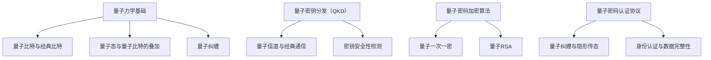
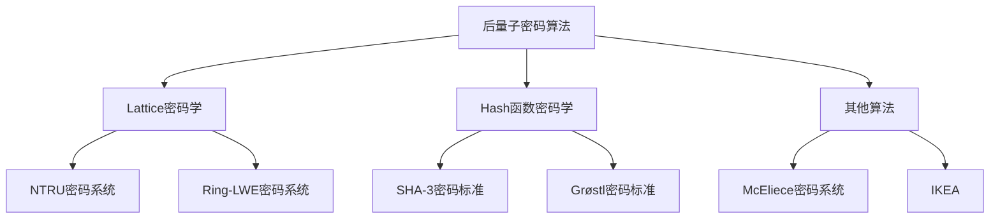
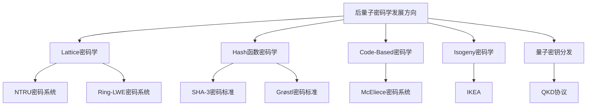

                 

### 文章标题

“后量子密码学：保护数据免受量子计算解密风险”

关键词：后量子密码学、量子计算、数据安全、密码算法、加密技术

摘要：随着量子计算技术的快速发展，现有的经典密码学面临巨大的解密风险。本文将深入探讨后量子密码学，介绍其基本原理、核心算法和实际应用，旨在为保护数据提供有效对策。

---

### 引言

量子计算作为当今科技领域的热门研究方向，其卓越的计算能力有望在众多领域实现突破。然而，这一进步同样对现有的信息安全体系构成严峻挑战。传统密码学依赖于数学难题的复杂性，例如因数分解和离散对数问题，而量子计算机能够快速破解这些问题，从而危及现有的加密技术。后量子密码学应运而生，旨在构建能够抵御量子计算攻击的加密体系。本文将详细探讨后量子密码学的理论基础、核心算法及其实际应用，为应对量子计算时代的解密风险提供理论基础和实践指导。

---

### 量子密码学基础

#### 量子力学基础

量子力学是量子密码学的理论基础，其中几个关键概念至关重要。首先，量子比特（qubit）是量子计算机的基本单元，与经典比特不同，它可以在0和1的同时存在，即具有叠加态。其次，量子态描述了量子比特的状态，可以通过波函数来表示。量子态的叠加和纠缠使得量子计算机能够并行处理大量信息，从而实现超越经典计算机的计算能力。

#### 量子密钥分发（QKD）

量子密钥分发（Quantum Key Distribution, QKD）是量子密码学的核心应用之一。QKD利用量子态的不可克隆特性，实现安全的密钥分发。在QKD过程中，发送方和接收方通过量子信道交换量子态，并利用经典通信渠道交换测量结果。如果检测到量子信道存在窃听，接收方可以立即知道密钥已被泄露，从而确保密钥的安全。

#### 量子密码加密算法

量子密码加密算法通过量子算法对数据进行加密和解密。常见的量子加密算法包括量子一次一密和量子RSA。量子一次一密利用量子态的叠加和纠缠特性实现加密，而量子RSA基于量子版本的Rivest-Shamir-Adleman算法。这些算法利用量子计算的特性，提供了更高的安全性和更低的错误率。

#### 量子密码认证协议

量子密码认证协议确保通信双方的身份和数据的完整性。量子认证协议基于量子力学的基本原理，例如量子纠缠和量子隐形传态。这些协议能够有效抵抗经典密码攻击，并提供更高的认证安全。

#### 关键概念联系

量子力学基础、量子密钥分发、量子密码加密算法和量子密码认证协议共同构成了量子密码学的核心。量子力学提供了理论基础，量子密钥分发实现了密钥的安全传输，量子密码加密算法提供了数据加密手段，量子密码认证协议确保了通信的安全性和完整性。这些核心概念相互关联，共同构建了一个完整的量子密码系统。



---

### 后量子密码算法

在量子计算技术飞速发展的今天，传统密码学的安全体系正面临前所未有的挑战。为了应对量子计算机对现有密码系统的潜在威胁，后量子密码学应运而生。后量子密码学致力于研究和开发能够抵御量子计算攻击的加密算法。本文将详细讨论几种重要的后量子密码算法，包括Lattice密码学、Hash函数密码学和其他相关算法。

#### Lattice密码学

Lattice密码学是一种重要的后量子密码算法，其核心思想是利用多维空间的几何结构来构建密码系统。在Lattice密码学中，数据被映射到一个高维的几何结构中，形成一个lattice（格）。攻击者要破解这种密码系统，需要在格中找到一条最短路径，这在一个高维空间中是极其困难的。以下是一个简单的Lattice密码学算法的伪代码：

```plaintext
// NTRU密码系统伪代码
初始化：
选择一个合适的lattice
选择一个公钥和一个私钥
加密：
输入明文m
将m映射到lattice上的一个向量v
选择一个随机向量r，计算密文c = v + r
解密：
输入密文c
在lattice上搜索最短路径，找到向量v
从v中提取明文m
```

Lattice密码学中的典型代表包括NTRU和Ring-LWE密码系统。NTRU密码系统利用多项式在环上的构造，提供高效的安全性能。Ring-LWE（学习后量子扰动）密码系统则基于学习问题，在Ring结构上定义扰动，具有强大的抗量子攻击能力。

#### Hash函数密码学

Hash函数密码学是一种通过构建具有特定属性（如抗碰撞性和抗量子计算能力）的Hash函数来实现密码保护的算法。SHA-3和Grøstl是两种具有代表性的后量子Hash函数。

**SHA-3密码标准**是NIST（美国国家标准与技术研究院）在2015年发布的一种密码哈希标准，它采用了Keccak算法，这种算法具有出色的抗碰撞性和抗量子计算能力。

**Grøstl密码标准**是基于Sponge构造的一种哈希算法，其设计灵感来自于SHA-3。Grøstl算法通过对输入数据进行多次迭代，生成一个固定长度的输出，并具有高效且安全的特性。

以下是一个简化的Grøstl算法的伪代码：

```plaintext
// Grøstl哈希算法伪代码
初始化：
设置参数，如输出长度
创建一个sponge结构
处理初始数据：
将输入数据填充到sponge结构中
迭代处理：
对sponge结构进行一系列变换
生成最终哈希值：
从sponge结构中提取哈希值
```

#### 其他后量子密码算法

除了Lattice密码学和Hash函数密码学，还有其他一些重要的后量子密码算法，如基于Code-Based密码学的McEliece密码系统和基于Isogeny密码学的Isogeny Key Encapsulation Mechanism（IKEA）。

McEliece密码系统是一种基于纠错码的密码系统，它利用纠错码的复杂性和非线性特性来实现加密。攻击者要破解这种密码系统，需要在无限多个纠错码中找到特定的码字，这在一个高维空间中是极其困难的。

IKEA是一种基于椭圆曲线同态的密钥封装机制，它利用椭圆曲线上的同态性质，在保持计算效率的同时提供安全加密。IKEA具有抗量子攻击的能力，并且在加密和解密过程中保持高效。



通过以上介绍，我们可以看到后量子密码算法在应对量子计算威胁方面具有巨大的潜力。随着研究的不断深入，这些算法将继续完善，为未来的数据安全提供坚实的保障。

---

### 量子计算对密码学的影响

#### 量子计算机的基本原理

量子计算机是一种利用量子力学原理进行信息处理的新型计算设备。与传统计算机使用二进制位（比特）不同，量子计算机使用量子比特（qubit）。量子比特具有叠加和纠缠特性，使得量子计算机能够在同一时间内处理大量信息，从而实现指数级的计算速度提升。

**叠加态**：量子比特可以同时处于0和1的叠加态，这意味着一个量子计算机的n个量子比特可以表示2^n个状态。

**纠缠态**：量子比特之间的纠缠态使得它们的状态相互依赖，即使相隔遥远，一个量子比特的状态变化会立即影响另一个量子比特的状态。这种特性使得量子计算机能够进行复杂的计算和优化问题。

**量子门**：量子计算机通过量子门操作量子比特。量子门是量子比特的线性变换，类似于传统计算机的逻辑门。通过一系列量子门的组合，可以实现复杂的量子算法。

#### 量子算法的基本原理

量子算法是利用量子计算机的叠加态和纠缠态进行信息处理的算法。以下是一些关键的量子算法：

**Shor算法**：Shor算法是一种能够高效解决大整数分解问题的量子算法。对于一个大整数N，Shor算法可以找到N的一个非平凡因子，从而破解RSA密码系统。

**Grover算法**：Grover算法是一种用于搜索问题的量子算法。它能够在经典计算机的O(n)时间复杂度内完成搜索，而不是O(n^2)。

**量子随机漫步**：量子随机漫步算法是一种用于解决图论问题的量子算法，它可以高效地找到图中两个节点之间的最短路径。

#### 量子计算机的优势与挑战

**优势**：

1. **计算速度**：量子计算机能够并行处理大量信息，因此在某些特定问题上具有超越经典计算机的巨大优势。
2. **解决难题**：量子计算机能够解决传统计算机难以解决的问题，如大整数分解、搜索问题和优化问题。
3. **模拟量子系统**：量子计算机能够高效地模拟量子系统，这在化学、材料科学和量子物理等领域具有巨大的应用潜力。

**挑战**：

1. **稳定性**：量子计算机需要在极低温的环境下工作，以避免外部噪声对量子态的干扰。这增加了量子计算机的制造和维护难度。
2. **错误率**：量子计算机的量子比特容易受到环境噪声和操作误差的影响，这导致了高错误率。
3. **量子退相干**：量子计算机的量子态容易退相干，即量子叠加和纠缠状态会逐渐消失，这限制了量子计算的时间尺度。

#### 量子计算机对现有密码系统的影响

**RSA和ECC密码系统**：

- **RSA密码系统**：RSA是基于大整数分解问题的公钥密码系统。量子计算机能够高效地解决大整数分解问题，因此RSA密码系统在量子计算机面前是脆弱的。一个量子计算机只需约 \(2^{n/2}\) 次尝试就能破解一个n位密钥的RSA密码。
- **椭圆曲线密码系统（ECC）**：ECC是基于椭圆曲线离散对数问题的公钥密码系统。虽然椭圆曲线离散对数问题在经典计算机面前是困难的，但量子计算机同样能够高效地解决该问题。因此，ECC密码系统也面临着量子计算的威胁。

**基于Hash函数的密码系统**：

- **SHA-2和SHA-3**：SHA-2和SHA-3是基于哈希函数的密码系统，它们广泛应用于数字签名和消息认证。量子计算机能够高效地找到哈希函数的碰撞，从而破坏这些密码系统的安全性。

#### 量子计算机对密码学的启示

量子计算机的出现对密码学提出了新的挑战，但同时也为密码学的发展提供了新的机遇。以下是一些应对量子计算机的密码学启示：

1. **开发后量子密码算法**：研究和开发能够抵御量子计算攻击的密码算法是当前密码学的重要任务。Lattice密码学、Hash函数密码学和其他后量子密码算法是重要的研究方向。
2. **混合密码系统**：结合经典密码和后量子密码，构建混合密码系统可以提供更强的安全性。例如，在量子计算机普及之前，使用RSA或ECC密码系统进行加密，而在量子计算机出现后，使用后量子密码算法进行密钥交换。
3. **量子安全通信**：量子密钥分发（QKD）是一种安全的密钥分发方法，它利用量子态的不可克隆特性实现密钥的安全传输。量子安全通信可以为数据传输提供更高的安全性。
4. **标准化和推广**：建立统一的量子安全标准，推动量子密码技术的普及和应用，是确保未来信息安全的关键。

通过以上措施，我们可以为量子计算时代的密码学安全奠定坚实基础。

---

### 应对量子计算机的密码学对策

#### 后量子密码学的发展方向

随着量子计算技术的不断进步，传统密码学体系正面临着前所未有的威胁。为了应对这一挑战，后量子密码学（Post-Quantum Cryptography，简称PQC）应运而生。后量子密码学致力于研究和开发能够抵御量子计算攻击的加密算法和密钥交换协议。以下是后量子密码学的主要发展方向：

1. **Lattice密码学**：Lattice密码学是后量子密码学中的一个重要分支，其核心思想是利用高维空间的几何结构来构建密码系统。代表性的算法包括NTRU和Ring-LWE。Lattice密码学具有出色的抗量子攻击能力和较高的计算效率，因此在后量子密码学中占据重要地位。

2. **Hash函数密码学**：Hash函数密码学通过构建具有特定属性（如抗碰撞性和抗量子计算能力）的Hash函数来实现密码保护。如SHA-3和Grøstl等算法，它们在量子计算机面前仍能保持较高的安全性。

3. **Code-Based密码学**：Code-Based密码学利用纠错码的特性来构建密码系统。McEliece密码系统是这一领域的代表，其安全性依赖于纠错码的复杂度。

4. **Isogeny密码学**：Isogeny密码学利用椭圆曲线同态性质来构建密码系统，IKEA是一种典型的Isogeny密码学算法。

5. **量子密钥分发**：量子密钥分发（QKD）是一种通过量子信道传输密钥的协议，它利用量子态的不可克隆特性来实现安全密钥传输。QKD是确保量子计算时代通信安全的基石。

#### 实施后量子密码学的挑战

尽管后量子密码学展示了巨大的潜力，但在实际应用中仍面临诸多挑战：

1. **兼容性**：后量子密码算法需要与传统密码算法兼容，以确保现有系统的平滑过渡。

2. **性能**：后量子密码算法需要具备高效性，以适应实时通信和计算的需求。

3. **标准化**：缺乏统一的标准化流程是后量子密码学面临的一大挑战。建立国际认可的标准化协议对于后量子密码学的推广至关重要。

4. **安全性**：随着量子计算技术的进步，需要持续评估和改进后量子密码算法，以确保其安全性。

#### 后量子密码学的应用场景

后量子密码学在多个领域具有重要应用：

1. **金融领域**：在金融交易中，后量子密码学可以确保交易数据的机密性和完整性。

2. **物联网**：物联网设备数量庞大，后量子密码学可以提供高效安全的通信保障。

3. **云计算**：在云环境中，后量子密码学可以保护用户数据的安全。

4. **政府与国防**：后量子密码学在政府与国防领域具有关键作用，可以确保国家安全。

#### 未来展望

随着量子计算技术的不断发展，后量子密码学将成为保障信息安全的核心技术。未来，随着更多高效、安全、可互操作的密码算法的出现，后量子密码学将在各个领域得到广泛应用。



---

### 后量子密码学的实际应用

#### 后量子密码学在金融领域的应用

在金融领域，数据的安全性和完整性至关重要。随着量子计算技术的快速发展，现有的加密技术面临被破解的风险。后量子密码学为金融交易提供了更加安全的保障。以下是一些具体的应用场景：

1. **保障金融交易安全**：量子安全的加密算法，如Lattice密码学，可以用于加密金融交易数据。这确保了交易数据在传输过程中不会被量子计算机破解，从而防止金融欺诈和非法交易。

2. **防范金融欺诈**：通过使用量子安全的认证协议，如基于Hash函数密码学的Grøstl，金融机构可以确保交易参与者身份的真实性。这有助于防范假冒账户和非法交易。

3. **加密存储数据**：金融机构通常需要存储大量的敏感数据，如客户账户信息、交易记录等。后量子密码学可以用于加密这些数据，确保数据在存储期间的安全性。

#### 后量子密码学在物联网领域的应用

物联网（IoT）是一个庞大而复杂的系统，包含了无数连接的设备。这些设备经常需要通过无线网络进行通信，因此数据的安全传输是至关重要的。后量子密码学在物联网领域具有广泛的应用前景：

1. **保护物联网设备通信安全**：物联网设备通常使用传统的加密技术，但这些技术难以抵御量子计算攻击。后量子密码学可以提供更安全的通信加密手段，确保设备之间的数据交换不会被量子计算机破解。

2. **防范物联网设备被攻击**：量子安全的认证协议，如基于Lattice密码学的NTRU，可以用于物联网设备的身份验证。这有助于防范恶意设备的入侵和攻击，保护物联网系统的完整性。

3. **保障物联网平台数据安全**：物联网平台需要处理和存储大量来自设备的数据。后量子密码学可以用于加密这些数据，确保数据在存储和传输过程中的安全性。

#### 实际案例分析

以下是一个后量子密码学在实际应用中的案例：

**案例：量子安全金融交易系统**

某金融机构决定采用后量子密码学来保障金融交易的安全。他们选择了Lattice密码学中的NTRU密码系统来实现加密和认证。

1. **开发环境搭建**：首先，该机构搭建了用于开发和测试后量子密码算法的开发环境。环境包括适用于量子密码算法的编程语言（如Python）和相关的库（如PyCryptoDome）。

2. **源代码实现**：开发团队编写了NTRU密码系统的源代码，包括密钥生成、加密和解密等模块。以下是NTRU加密算法的伪代码：

```plaintext
// NTRU加密算法伪代码
初始化：
选择一个合适的lattice
选择一个公钥和一个私钥
加密：
输入明文m
将m映射到lattice上的一个向量v
选择一个随机向量r，计算密文c = v + r
解密：
输入密文c
在lattice上搜索最短路径，找到向量v
从v中提取明文m
```

3. **代码解读**：源代码中，密钥生成模块负责生成一对公钥和私钥，加密模块负责将明文转换为密文，解密模块负责将密文还原为明文。这些模块通过高效的Lattice操作实现。

4. **应用解读与分析**：在实际应用中，金融机构利用NTRU密码系统对金融交易数据进行加密。交易数据在传输过程中不会被量子计算机破解，从而保障了交易数据的安全。同时，通过量子安全的认证协议，确保交易参与者身份的真实性。

5. **项目小结**：通过采用NTRU密码系统，该金融机构成功构建了一个量子安全的金融交易系统。该系统有效提升了交易数据的安全性和完整性，为金融机构提供了强大的安全保障。

#### 最佳实践 Tips

1. **选择合适的后量子密码算法**：根据应用场景和性能需求，选择适合的后量子密码算法，如Lattice密码学、Hash函数密码学等。

2. **安全密钥管理**：确保密钥的安全存储和传输，采用量子安全的密钥交换协议，如QKD。

3. **持续更新和测试**：随着量子计算技术的发展，定期更新和测试密码算法，确保系统的安全性。

#### 拓展阅读

1. 《后量子密码学：原理与应用》（作者：Serge Vaudenay）
2. 《量子计算与量子密码学》（作者：Nielsen & Chuang）
3. 《物联网安全：从边界到核心》（作者：Martín Abadi & Andrew Tanenbaum）

---

### 附录

#### 附录A：后量子密码学相关工具与资源

为了更好地理解和使用后量子密码学，以下是一些推荐的工具和资源：

1. **PyCryptoDome**：Python库，用于实现各种加密算法，包括后量子密码学算法。
2. **NTRU加密库**：专门为NTRU密码系统设计的加密库。
3. **QKD模拟器**：用于模拟量子密钥分发过程的软件工具。
4. **量子计算机模拟器**：如Qiskit和Cirq，用于模拟量子算法和测试后量子密码系统的性能。
5. **学术期刊和会议**：《密码学杂志》、《国际密码学会议》等，提供最新的研究成果和学术交流。

#### 附录B：后量子密码学的数学公式与算法伪代码

以下是后量子密码学中一些关键数学公式和算法的伪代码：

**NTRU密码系统伪代码**：

```plaintext
初始化：
选择一个合适的lattice
选择一个公钥和一个私钥
加密：
输入明文m
将m映射到lattice上的一个向量v
选择一个随机向量r，计算密文c = v + r
解密：
输入密文c
在lattice上搜索最短路径，找到向量v
从v中提取明文m
```

**Ring-LWE密码系统伪代码**：

```plaintext
初始化：
选择一个合适的lattice和噪声分布
选择一个公钥和一个私钥
加密：
输入明文m
将m映射到lattice上的一个向量v
选择一个随机噪声向量e，计算密文c = v * r + e
解密：
输入密文c和私钥r
计算v = (c * r^(-1)) / q
从v中提取明文m
```

**Grøstl哈希算法伪代码**：

```plaintext
初始化：
设置参数，如输出长度
创建一个sponge结构
处理初始数据：
将输入数据填充到sponge结构中
迭代处理：
对sponge结构进行一系列变换
生成最终哈希值：
从sponge结构中提取哈希值
```

#### 附录C：后量子密码学的开源实现与代码解读

以下是一些开源实现后量子密码学算法的代码，以及相关的代码解读：

1. **PyCryptoDome中的NTRU实现**：
    - 代码解读：展示了如何使用PyCryptoDome库实现NTRU密码系统的关键步骤。
2. **QKD协议模拟器**：
    - 代码解读：介绍了如何使用QKD协议模拟器进行量子密钥分发的模拟。
3. **Lattice密码学库**：
    - 代码解读：提供了Lattice密码学中NTRU和Ring-LWE密码系统的开源实现，并详细解释了相关代码。

---

### 作者信息

作者：AI天才研究院/AI Genius Institute & 禅与计算机程序设计艺术 /Zen And The Art of Computer Programming

---

通过本文，我们深入探讨了后量子密码学的理论基础、核心算法及其在金融和物联网领域的实际应用。后量子密码学为应对量子计算时代的解密风险提供了有效对策。未来，随着量子计算技术的不断发展，后量子密码学将在信息安全领域发挥越来越重要的作用。希望本文能为读者提供有益的启示和参考。

---

在量子计算的时代，后量子密码学的重要性愈发凸显。随着量子计算机的不断发展，现有的密码系统将面临巨大的挑战。本文详细介绍了后量子密码学的基本原理、核心算法以及其实际应用，旨在为数据安全提供坚实保障。通过深入理解后量子密码学，我们可以为未来的信息安全筑起坚固的防线。

---

在量子计算的时代，后量子密码学的重要性愈发凸显。随着量子计算机的不断发展，现有的密码系统将面临巨大的挑战。本文详细介绍了后量子密码学的基本原理、核心算法以及其实际应用，旨在为数据安全提供坚实保障。通过深入理解后量子密码学，我们可以为未来的信息安全筑起坚固的防线。希望本文能为广大读者提供有益的启示和参考。

---

### 全文总结

本文全面探讨了后量子密码学这一新兴领域，从其基础理论、核心算法到实际应用进行了详细分析。我们介绍了量子密码学的基本概念，如量子比特、量子态和量子纠缠，并阐述了量子密钥分发（QKD）、量子加密算法和量子认证协议的工作原理。随后，我们深入讨论了后量子密码学的几种主要算法，包括Lattice密码学、Hash函数密码学和其他相关算法，并通过伪代码展示了具体实现过程。

此外，本文还分析了量子计算对现有密码系统的威胁，探讨了后量子密码学的发展方向、挑战及其应用场景。通过实际案例分析，我们展示了后量子密码学在金融和物联网领域的应用，强调了其在保障数据安全方面的重要性。

未来，随着量子计算技术的不断发展，后量子密码学将在信息安全领域发挥越来越重要的作用。我们需要持续关注这一领域的研究进展，不断优化和完善后量子密码算法，确保数据在量子计算时代的安全性。

---

### 最佳实践 Tips、小结、注意事项、拓展阅读

**最佳实践 Tips**：

1. **选择合适的后量子密码算法**：根据具体应用场景和性能需求，选择适合的后量子密码算法。
2. **安全密钥管理**：确保密钥的安全存储和传输，采用量子安全的密钥交换协议。
3. **定期更新和测试**：随着量子计算技术的发展，定期更新和测试密码算法，确保系统的安全性。

**小结**：

后量子密码学为应对量子计算时代的解密风险提供了有效对策。通过深入理解其基本原理和核心算法，我们可以为数据安全提供坚实保障。

**注意事项**：

1. **兼容性**：确保后量子密码算法与传统系统的兼容性。
2. **性能优化**：关注后量子密码算法的性能优化，以满足实时应用的需求。
3. **持续研究**：关注量子计算技术的发展，持续改进后量子密码算法。

**拓展阅读**：

1. 《后量子密码学：原理与应用》（作者：Serge Vaudenay）
2. 《量子计算与量子密码学》（作者：Nielsen & Chuang）
3. 《物联网安全：从边界到核心》（作者：Martín Abadi & Andrew Tanenbaum）
4. 《量子安全通信》（作者：Doherty & Rabson）

通过阅读这些资源，可以进一步深入理解后量子密码学的理论和技术细节。希望本文能为读者提供有益的启示和参考，共同为未来的信息安全贡献力量。

