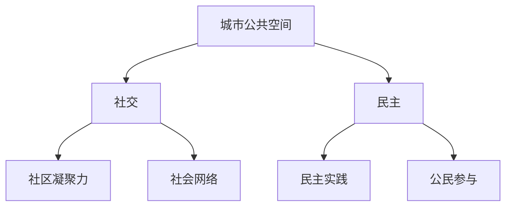

                 

### 《城市公共空间的重要性：社交与民主的物理载体》

---

关键词：城市公共空间、社交、民主、物理载体、城市规划、算法原理、数学模型

摘要：本文从城市公共空间的角度，探讨其在促进社交和民主价值实现中的重要作用。通过详细分析核心概念、理论基础、测量方法、社交功能、民主价值，以及实际应用案例，揭示了城市公共空间在现代城市中的重要性和未来发展方向。

---

### 引言

城市公共空间是现代城市规划中的重要组成部分，它不仅是人们日常生活的场所，更是促进社会交往和民主实践的重要载体。随着城市化进程的加速，城市公共空间的重要性日益凸显。本文将从以下几个方面展开讨论：

1. **核心概念与联系**：介绍城市公共空间、社交和民主的基本概念，并使用 Mermaid 流程图展示它们之间的联系。
2. **理论基础**：分析城市公共空间的历史演变、现代意义及其与城市规划的关系。
3. **测量与分析**：介绍测量城市公共空间的方法和工具，讲解空间分析的基本算法原理。
4. **社交功能**：探讨城市公共空间如何促进社交活动，并通过案例说明其社交功能的实际应用。
5. **民主价值**：分析城市公共空间如何体现民主价值，及其在民主实践中的作用。
6. **未来展望**：预测城市公共空间的发展趋势，探讨未来城市规划中公共空间的角色。
7. **案例研究**：分析实际城市公共空间项目，展示理论在实践中的应用。

通过以上分析，本文旨在揭示城市公共空间在现代城市中的重要作用，为城市规划提供理论支持和实践指导。

### 第1章：核心概念与框架

#### 1.1 城市公共空间

城市公共空间指的是城市中供所有人自由使用的空间，包括街道、广场、公园、公共建筑等。这些空间不仅提供了人们日常活动的场所，还承担着促进社会交往、文化传承和民主实践的重要功能。

#### 1.2 社交

社交是指人与人之间的互动和交往，是建立社会关系和社会认同的基础。城市公共空间为人们提供了面对面的交流机会，有助于增强社区凝聚力和社会网络。

#### 1.3 民主

民主是指公民在政治和社会生活中享有平等权利和自由，能够参与决策和管理。城市公共空间是民主实践的重要场所，人们在这里可以自由表达观点、讨论问题，甚至发起和参与社会运动。

#### 1.4 Mermaid流程图：核心概念联系

以下是一个简单的 Mermaid 流程图，展示了城市公共空间、社交和民主之间的联系：



通过这个流程图，我们可以看出城市公共空间既是社交的物理载体，也是民主实践的基础。社交和民主通过城市公共空间相互促进，共同构建了现代城市的社会结构。

### 第2章：城市公共空间的理论基础

#### 2.1 历史演变

城市公共空间的历史可以追溯到古代城市的发展。在古代，城市公共空间主要是指城市广场和街道，这些空间主要用于政治集会、商业交易和宗教活动。随着城市化进程的加速，城市公共空间逐渐从单一功能转变为多功能、多样化的空间。

在现代社会，城市公共空间经历了以下几个重要阶段：

1. **工业革命后的城市扩张**：工业革命带来了城市人口的急剧增长，城市公共空间的需求也随之增加。这个阶段，城市公共空间主要侧重于提供基本的生活设施和公共建筑。
2. **现代城市设计运动**：20世纪初，现代城市设计运动兴起，强调城市公共空间的重要性。这个阶段，城市公共空间开始注重人文关怀，提倡创造多样化的空间以满足人们的不同需求。
3. **后现代城市设计**：20世纪末以来，后现代城市设计强调城市公共空间的灵活性和适应性。这个阶段，城市公共空间不仅提供了功能，还成为了人们交流、互动和参与的重要场所。

#### 2.2 现代意义

在现代城市中，城市公共空间具有以下几个方面的意义：

1. **社会功能**：城市公共空间是人们日常生活的场所，提供了购物、休闲、娱乐等多种功能。这些功能有助于提升人们的生活质量，增强城市活力。
2. **文化功能**：城市公共空间是文化传播和交流的重要场所。各种文化活动、展览和表演在这里举行，有助于丰富人们的精神生活，促进文化交流。
3. **民主功能**：城市公共空间是民主实践的重要场所。人们在这里可以自由表达观点、讨论问题，甚至发起和参与社会运动。这种自由和开放的氛围有助于推动社会的进步和民主化。

#### 2.3 公共空间与城市规划的关系

城市公共空间与城市规划密切相关。城市规划不仅关注城市公共空间的建设，还关注其规划、设计和维护。以下是公共空间与城市规划之间的一些关系：

1. **功能规划**：城市规划需要根据城市公共空间的不同功能进行合理规划，确保各类空间能满足人们的不同需求。
2. **空间布局**：城市规划需要合理安排城市公共空间的位置和布局，使其分布均匀、便于使用。
3. **环境设计**：城市规划需要注重城市公共空间的环境设计，创造舒适、美观的空间氛围。
4. **可持续发展**：城市规划需要考虑城市公共空间的可持续性，确保其能在未来满足人们的需求。

### 第3章：城市公共空间的测量与分析

#### 3.1 测量方法

测量城市公共空间的方法主要包括以下几种：

1. **空间测量**：使用测量工具，如激光测距仪、GPS等，测量城市公共空间的大小、形状和位置。
2. **人口统计**：通过对城市公共空间的使用情况、人流量等数据进行统计，分析公共空间的利用率。
3. **问卷调查**：通过问卷调查，了解人们对城市公共空间的满意度、需求等，为规划提供参考。
4. **遥感技术**：利用遥感技术，从卫星图像中提取城市公共空间的信息，进行定量分析。

#### 3.2 测量工具

以下是几种常用的测量工具：

1. **激光测距仪**：适用于测量大型城市公共空间的大小和形状。
2. **GPS**：用于定位城市公共空间的位置，便于分析和规划。
3. **无人机**：通过无人机拍摄城市公共空间的图像，进行定量分析。
4. **移动测量设备**：如平板电脑和智能手机，可用于现场测量和数据采集。

#### 3.3 空间分析

空间分析是测量城市公共空间后进行的进一步处理和分析。以下是几种常见空间分析方法：

1. **空间分布分析**：分析城市公共空间在不同地区的分布情况，找出热点区域和空白区域。
2. **空间结构分析**：分析城市公共空间的结构特点，如连通性、密度等。
3. **空间动态分析**：分析城市公共空间在不同时间段的使用情况，找出高峰期和低谷期。
4. **空间关联分析**：分析城市公共空间与其他空间要素（如住宅、商业区等）之间的关联性。

#### 3.4 基本算法原理

以下是一个简单的空间分析算法示例，用于计算城市公共空间的连通性：

```python
def calculate_connectivity(public_spaces):
    # 初始化连通性矩阵
    connectivity_matrix = [[0 for _ in range(len(public_spaces))] for _ in range(len(public_spaces))]

    # 计算两个公共空间之间的连通性
    for i in range(len(public_spaces)):
        for j in range(i + 1, len(public_spaces)):
            distance = calculate_distance(public_spaces[i], public_spaces[j])
            if distance < threshold:
                connectivity_matrix[i][j] = 1
                connectivity_matrix[j][i] = 1

    return connectivity_matrix
```

其中，`calculate_distance()` 函数用于计算两个公共空间之间的距离，`threshold` 是连通性的阈值。

#### 3.5 实际案例分析

以下是一个实际案例，分析某城市的公园空间分布：

1. **数据采集**：通过遥感技术和现场测量，获取公园的地理位置、面积等数据。
2. **空间分布分析**：使用GIS软件，分析公园在不同地区的分布情况，找出热点区域和空白区域。
3. **空间结构分析**：分析公园的连通性，找出公园之间的主要交通路线。
4. **空间动态分析**：通过调查问卷，了解公园在不同时间段的使用情况，找出高峰期和低谷期。
5. **空间关联分析**：分析公园与其他空间要素（如住宅区、商业区等）之间的关联性。

通过以上分析，可以为城市规划提供有针对性的建议，优化公园空间布局，提高公园的利用率和满意度。

### 第4章：城市公共空间的社交功能

#### 4.1 社交活动的促进

城市公共空间为社交活动提供了重要的场所和机会。以下是城市公共空间如何促进社交活动的一些例子：

1. **社区活动**：城市公共空间经常举办各种社区活动，如文化节、市集、运动会等。这些活动吸引了大量居民参与，促进了社区成员之间的交流与互动。
2. **街头表演**：街头表演是城市公共空间中常见的社交形式。表演者通过自己的才艺，吸引了观众的注意，同时也为观众提供了交流和娱乐的机会。
3. **公共设施**：城市公共空间中的座椅、凉亭、健身器材等设施，为人们提供了休息和交流的空间。在这些设施周围，人们常常会自发地组织社交活动，如聊天、聚会等。

#### 4.2 社交功能与社区发展

城市公共空间的社交功能对社区发展具有重要影响。以下是社交功能与社区发展的几个方面：

1. **社会凝聚力**：城市公共空间为居民提供了交流和互动的机会，有助于增强社区凝聚力。当居民之间建立了紧密的社会关系时，社区的稳定性和社会和谐性也会提高。
2. **社会网络**：城市公共空间是居民建立和扩展社会网络的重要场所。通过在公共空间中的交流，居民可以结识新朋友、拓展人际关系，从而建立更广泛的社会网络。
3. **社会参与**：城市公共空间为居民提供了参与社会活动的机会。当居民参与社区活动时，他们不仅能够提高自身的社会地位，还能够为社区的发展和进步做出贡献。

#### 4.3 案例研究：城市广场的社交作用

以下是一个关于城市广场的社交作用的案例研究：

1. **案例背景**：某城市广场是当地居民和游客的重要聚集地，每天吸引大量人流量。广场周围有商场、餐厅、公园等设施，为居民提供了丰富的社交场所。
2. **社交活动**：城市广场经常举办各种文化活动，如音乐会、市集、广场舞等。这些活动吸引了大量居民参与，成为了城市广场的一大特色。
3. **社交功能**：城市广场不仅提供了社交场所，还促进了社区成员之间的互动和交流。居民在这里可以结识新朋友、参与社区活动，从而增强了社区凝聚力。
4. **社区发展**：城市广场的社交功能对社区发展产生了积极影响。居民之间的交流促进了社区的社会凝聚力和社会网络，也为社区的发展和进步提供了动力。

通过这个案例，我们可以看到城市广场在促进社交和社区发展方面的重要作用。城市公共空间的设计和规划应充分考虑其社交功能，为居民提供更多的交流机会和社交场所。

### 第5章：城市公共空间的民主价值

#### 5.1 公共空间与民主实践

城市公共空间在民主实践中扮演着重要角色。以下是城市公共空间如何促进民主实践的一些例子：

1. **公共讨论**：城市公共空间为人们提供了一个自由讨论和表达观点的平台。在这里，人们可以就各种议题进行讨论，形成公共意见，从而影响政策制定。
2. **示威游行**：城市公共空间是示威游行的重要场所。人们在这里集结、表达诉求，形成公共力量，推动社会变革。
3. **公民参与**：城市公共空间为公民提供了参与公共事务的机会。在这里，居民可以参加社区会议、投票选举等民主活动，从而实现自我管理和自治。

#### 5.2 民主价值的体现

城市公共空间体现了以下几个方面的民主价值：

1. **言论自由**：城市公共空间保障了公民的言论自由。在这里，人们可以自由表达观点，不受政府或私人机构的限制。
2. **平等权利**：城市公共空间为所有人提供了平等的使用机会。无论贫富、年龄、性别等，人们都可以在城市公共空间中自由活动，享受公共资源。
3. **公共参与**：城市公共空间鼓励公民参与公共事务。在这里，居民可以参与社区管理、公共决策等，实现民主治理。

#### 5.3 案例研究：公共讨论区的民主功能

以下是一个关于公共讨论区民主功能的案例研究：

1. **案例背景**：某城市在市中心广场设立了一个公共讨论区，为居民提供了一个自由讨论和表达观点的平台。
2. **民主实践**：公共讨论区吸引了大量居民参与。在这里，居民可以就各种议题进行讨论，形成公共意见，从而影响政策制定。
3. **言论自由**：公共讨论区保障了公民的言论自由。居民可以在这里自由表达观点，不受政府或私人机构的限制。
4. **平等权利**：公共讨论区为所有人提供了平等的使用机会。无论贫富、年龄、性别等，人们都可以在公共讨论区中自由活动，享受公共资源。
5. **公共参与**：公共讨论区鼓励公民参与公共事务。居民可以在这里参加社区会议、投票选举等民主活动，从而实现自我管理和自治。

通过这个案例，我们可以看到公共讨论区在民主实践中的重要作用。城市公共空间的设计和规划应充分考虑其民主价值，为公民提供更多的参与机会和公共资源。

### 第6章：城市公共空间的未来展望

#### 6.1 发展趋势预测

随着城市化进程的加速和科技的进步，城市公共空间的发展也将面临新的趋势：

1. **智能化**：城市公共空间将越来越多地采用智能技术，如物联网、大数据、人工智能等，提高公共空间的利用效率和用户体验。
2. **可持续性**：城市公共空间将更加注重可持续性，采用绿色建筑、可再生能源等环保技术，减少对环境的影响。
3. **多元化**：城市公共空间将提供更多样化的功能和服务，满足不同人群的需求，促进社会的多元化发展。
4. **民主化**：城市公共空间将更加注重民主化，鼓励公民参与公共事务，提高公共空间的治理水平。

#### 6.2 未来城市规划中的公共空间角色

在未来城市规划中，城市公共空间将发挥更加重要的作用：

1. **功能集成**：城市公共空间将实现功能集成，提供购物、休闲、娱乐、教育等多种服务，满足人们的多样化需求。
2. **生态优先**：城市公共空间将注重生态设计，提高生态质量，营造宜居环境。
3. **民主参与**：城市公共空间将鼓励公民参与规划和管理，实现民主治理。
4. **技术创新**：城市公共空间将引入新技术，提高空间利用效率和用户体验。

#### 6.3 挑战与机遇

在未来发展中，城市公共空间也将面临一系列挑战和机遇：

1. **资源有限**：城市公共空间的资源有限，需要合理规划和管理，确保其可持续发展。
2. **城市化进程**：城市化进程加快，城市公共空间需求增加，需要加大投入和建设力度。
3. **技术变革**：技术变革带来新的发展机遇，但也对城市公共空间提出了新的要求。
4. **民主参与**：公民对公共事务的参与度提高，需要建立有效的参与机制和渠道。

通过以上分析，我们可以看到城市公共空间在未来城市规划中的重要作用和广阔前景。城市公共空间的发展应结合实际情况，充分发挥其功能，为城市居民提供更好的生活环境和公共服务。

### 第7章：案例研究

#### 7.1 实际城市公共空间项目分析

以下是对一个实际城市公共空间项目的分析：

**项目背景**：某城市在市中心区域建设了一个大型城市公园，旨在提升城市公共空间的质量和功能。

**项目目标**：
1. 提高公园的生态质量，营造宜居环境。
2. 提供多样化的社交和活动场所，满足居民的需求。
3. 鼓励公民参与公共事务，提高民主治理水平。

**项目实施**：
1. **生态设计**：采用绿色建筑和可再生能源技术，提高公园的生态质量。例如，使用太阳能板、雨水收集系统和植物墙等。
2. **功能集成**：公园内设有运动场、儿童游乐区、休闲广场等，满足居民的多样化需求。
3. **民主参与**：设立公共讨论区，鼓励居民参与公园的规划和管理。例如，通过社区会议、问卷调查等方式，听取居民的意见和建议。

**效果评估**：
1. **生态质量**：公园的生态质量得到了显著提升，空气质量、植被覆盖率等指标均达到较高水平。
2. **社交活动**：公园吸引了大量居民参与社交和活动，公园的使用率大幅提高。
3. **民主治理**：居民对公园的参与度提高，公园的规划和管理更加民主和透明。

**结论**：通过实际案例的分析，我们可以看到城市公共空间在促进生态质量、满足居民需求、提高民主治理水平等方面的重要作用。未来的城市公共空间项目应借鉴这些成功经验，充分发挥其功能，为城市居民提供更好的生活环境。

#### 7.2 理论在实践中的应用

以下是一个关于城市公共空间理论在实践中的应用案例：

**案例背景**：某城市在更新旧城区时，计划建设一个多功能城市广场，旨在提升城市公共空间的质量和功能。

**项目目标**：
1. 提供购物、休闲、娱乐等多种功能，满足居民的需求。
2. 增强城市广场的社交功能，促进社区发展。
3. 体现民主价值，鼓励公民参与公共事务。

**项目实施**：
1. **多功能设计**：城市广场内设有购物中心、咖啡馆、广场舞台等，满足居民的多样化需求。
2. **社交功能**：广场定期举办各种文化活动，如音乐会、市集、广场舞等，吸引了大量居民参与。
3. **民主参与**：广场设立了公共讨论区，为居民提供了一个自由讨论和表达观点的平台。

**效果评估**：
1. **多功能性**：城市广场的使用率大幅提高，成为了居民和游客的重要聚集地。
2. **社交功能**：广场的文化活动丰富了居民的社交生活，增强了社区凝聚力。
3. **民主参与**：居民对广场的参与度提高，广场的规划和管理更加民主和透明。

**结论**：通过实际案例的应用，我们可以看到城市公共空间理论在实践中的有效性和重要性。城市公共空间的设计和规划应充分考虑其功能、社交和民主价值，为城市居民提供更好的生活环境和公共服务。

### 结论

本文从城市公共空间的角度，探讨了其在促进社交和民主价值实现中的重要作用。通过分析核心概念、理论基础、测量方法、社交功能、民主价值以及实际应用案例，我们揭示了城市公共空间在现代城市中的重要性和广阔前景。未来，城市公共空间的发展应结合实际情况，充分发挥其功能，为城市居民提供更好的生活环境和公共服务。

作者：AI天才研究院/AI Genius Institute & 禅与计算机程序设计艺术 /Zen And The Art of Computer Programming

---

通过以上步骤和章节的详细讲解，本文旨在为读者提供一个全面、深入的城市公共空间分析框架，使其能够更好地理解这一重要领域，并在实践中加以应用。希望这篇文章能够为城市规划和公共空间设计提供有价值的参考和启示。

### 附录

#### 9.1 相关资源与工具

1. **城市公共空间测量与分析工具**：
   - **GIS软件**：如ArcGIS、QGIS等，用于空间数据的处理和分析。
   - **无人机**：用于拍摄城市公共空间的图像，进行定量分析。
   - **移动测量设备**：如平板电脑和智能手机，用于现场测量和数据采集。

2. **社交和民主功能分析工具**：
   - **问卷调查工具**：如SurveyMonkey、Google Forms等，用于收集居民的意见和需求。
   - **社交媒体分析工具**：如Twitter Analytics、Facebook Insights等，用于分析社交活动的数据。

3. **相关文献与资料**：
   - **城市公共空间设计指南**：如《城市公共空间设计手册》（City Space，by Jan Gehl）。
   - **民主理论书籍**：如《民主的四种特性》（The Four Freedoms，by Franklin D. Roosevelt）。

#### 9.2 进一步阅读推荐

1. **学术期刊**：
   - **《城市规划学刊》**（Journal of Urban Planning and Development）
   - **《社会空间》**（Social Space）
   - **《公共空间研究》**（Public Space Research）

2. **书籍**：
   - **《城市公共空间设计》**（Designing Public Space，by Jan Gehl）
   - **《城市与社会》**（The City and Society，by Robert E. Park）
   - **《民主的城市》**（The Democratic City，by Henri Lefebvre）

3. **在线课程与讲座**：
   - **MIT OpenCourseWare**：城市规划与设计相关课程。
   - **TED Talks**：关于城市公共空间和民主价值的精彩演讲。

通过这些资源，读者可以进一步深入了解城市公共空间的理论和实践，为自己的研究和实践提供更多的支持和启示。希望本文能够激发读者对城市公共空间这一重要领域的兴趣和探索。

